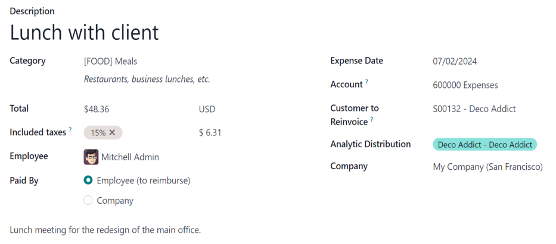

============
Log expenses
============

Before expenses can be reimbursed, each individual expense needs to be logged in the database.
Expense records can be created in four different ways: :ref:`manually enter an expense record
<expenses/manual_expense>`, :ref:`upload a receipt <expenses/upload_receipt>`, :ref:`drag and drop
<expenses/drag_and_drop>` a receipt onto the **Expenses** app dashboard, or :ref:`email a receipt
<expenses/email_expense>` to a preconfigured email address.

.. _expenses/manual_expense:

Manually enter expenses
=======================

To record a new expense, open the **Expenses** app, which displays the :guilabel:`My Expenses` page,
by default.

.. tip::
   This view can also be accessed at any time by navigating to :menuselection:`Expenses app --> My
   Expenses --> My Expenses`.

Click the :guilabel:`New` button and fill out the following fields on the blank expense form that
loads:

- :guilabel:`Description`: Enter a short description for the expense. This should be concise and
  informative, such as `Lunch with client` or `Hotel for trade show`.
- :guilabel:`Category`: Using the drop-down menu, select the :doc:`expense category
  <expense_categories>` that most closely corresponds to the expense.
- :guilabel:`Total`: Enter the total amount paid for the expense in one of two ways:

  #. If the expense is for a single item/expense, and the category selected was for a single item,
     enter the cost in the :guilabel:`Total` field (the :guilabel:`Quantity` field is hidden).
  #. If the expense is for multiples of the same item/expense with a fixed price, the
     :guilabel:`Unit Price` is displayed. Enter the number of units in the :guilabel:`Quantity`
     field, and the total cost is automatically updated with the correct total. The total cost
     appears below the :guilabel:`Quantity`.

     .. example::
        An employee received one dollar for each mile driven for work. The :guilabel:`Category` is
        :guilabel:`[MIL] Mileage`. The :guilabel:`Unit Price` is automatically populated with
        `$1.00`, which is the cost *per mile* configured for the expense :guilabel:`Category`
        :guilabel:`[MIL] Mileage`. The :guilabel:`Quantity` is set to `48`, which is the *number of
        miles driven*, and the total is calculated to `$48.00`.

- :guilabel:`Included Taxes`: If taxes were configured on the selected expense category, the tax
  percentage and amount appear automatically after entering either the :guilabel:`Total` or the
  :guilabel:`Quantity`.

  .. note::
     When a tax is configured on an expense category, the :guilabel:`Included Taxes` value updates
     in real time, as the :guilabel:`Total` or :guilabel:`Quantity` is updated.

- :guilabel:`Employee`: Using the drop-down menu, select the employee associated with the expense.
- :guilabel:`Paid By`: Click the radio button to indicate who paid for the expense and should be
  reimbursed. Select either :guilabel:`Employee (to reimburse)` or :guilabel:`Company`. Depending on
  the expense category selected, this field may not appear.
- :guilabel:`Expense Date`: Using the calendar popover window that appears when this field is
  clicked, enter the date the expense was incurred.
- :guilabel:`Account`: If the selected expense :guilabel:`Category` has a specific account linked to
  it, that account appears in the :guilabel:`Account` field. If no account is specified, the default
  `600000 Expenses` account populates this field. If a different account is desired, select the
  account the expense should be logged in.
- :guilabel:`Customer to Reinvoice`: If the expense should be paid for by a customer and the
  selected :guilabel:`Category` allows for reinvoicing of expenses, select the :abbr:`SO (Sales
  Order)` and customer to be invoiced for the expense using the drop-down menu. All sales orders in
  the drop-down menu list both the :abbr:`SO (Sales Order)`, as well as the company the sales order
  is written for. After the expense is saved, the customer name disappears, and only the :abbr:`SO
  (Sales Order)` is visible on the expense.

  .. example::
     A customer wishes to have an on-site meeting for the design and installation of a custom
     building, and agrees to pay for all expenses associated with the meeting, including travel,
     hotel, and meals for the traveling employees. All expenses tied to that meeting would indicate
     the sales order for the custom building (which also references the customer) as the
     :guilabel:`Customer to Reinvoice`.

- :guilabel:`Analytic Distribution`: Select the account the expense should be written against from
  the drop-down menu for either :guilabel:`Projects`, :guilabel:`Departments`, or both. Multiple
  accounts can be listed for each category, if needed. Adjust the percentage for each analytic
  account by typing in the percentage value next to each account.
- :guilabel:`Company`: If in a multi-company database, select the company the expense should be
  filed for using the drop-down menu. The current company automatically populates this field.
- :guilabel:`Notes...`: If any notes are needed to clarify the expense, enter them in the notes
  field.

Attach receipts
---------------

After the expense record is created, the next step is to attach a receipt. Click the
:guilabel:`Attach Receipt` button, and a file explorer appears. Navigate to the receipt to be
attached, and click :guilabel:`Open`.

The new receipt is recorded in the *chatter*, and the number of receipts appears next to the
:icon:`fa-paperclip` :guilabel:`(paperclip)` icon. Multiple receipts can be attached to an
individual expense record, as needed.

.. _expenses/upload_receipt:

Upload expenses
===============

It is possible to have expense records created automatically by :ref:`uploading a PDF receipt
<expenses/upload>`. To utilize this feature, a setting must be enabled, and :abbr:`IAP (in-app
purchases)` credits must be purchased.

.. _expenses/digitalization:

Digitalization settings
-----------------------

To enable receipt scanning, navigate to :menuselection:`Expenses app --> Configuration -->
Settings`, and tick the checkbox beside the :guilabel:`Expense Digitization (OCR)` option. Then,
click :guilabel:`Save`. When enabled, additional options appear. Click on the corresponding radio
button to select one of the following options:

- :guilabel:`Do not digitize`: Disables receipt digitization but does *not* uninstall the related
  digitization module.
- :guilabel:`Digitize on demand only`: Only digitizes receipts when requested. A :guilabel:`Digitize
  document` button appears on expense records. When clicked, the receipt is scanned and the expense
  record is updated.
- :guilabel:`Digitize automatically`: Automatically digitizes all receipts when they are uploaded.

Beneath these options are two additional links. Click the :icon:`fa-arrow-right` :guilabel:`Manage
Service & Buy Credits` link to view account details and settings, and purchase credits for receipt
digitization. Click the :icon:`fa-arrow-right` :guilabel:`View My Services` link to view a list of
all current services, and their remaining credit balances.

For more information on document digitization and :abbr:`IAPs (in-app purchases)`, refer to the
:doc:`In-app purchase (IAP) <../../essentials/in_app_purchase>` documentation.

.. note::
   When the :guilabel:`Expense Digitization (OCR)` option is enabled, a necessary module is
   installed, so receipts can be scanned. Disabling this option uninstalls the module.

   If, at some point, there is a desire to temporarily stop digitizing receipts, select the
   :guilabel:`Do not digitize` option. The reason this option is available is so the module is not
   uninstalled, allowing for digitization to be enabled in the future by selecting one of the other
   two options.

.. _expenses/upload:

Upload receipts
---------------

Open the :guilabel:`Expenses app`, and from the :guilabel:`My Expenses` dashboard, click
:guilabel:`Upload`, and a file explorer appears. Navigate to the desired receipt, select it, then
click :guilabel:`Open`.

The receipt is scanned, and a new expense record is created. The :guilabel:`Expense Date` field is
populated with today's date, along with any other fields based on the scanned data, such as the
:guilabel:`Total`.

Click on the new entry to open the individual expense form, and make any changes, if needed. The
scanned receipt appears in the *chatter*.

.. _expenses/drag_and_drop:

Drag and drop an expense
========================

If :ref:`digitalization is enabled <expenses/digitalization>`, drag and drop a receipt onto the
**Expenses** app dashboard. The receipt is scanned and appears by itself on the :guilabel:`Generate
Expenses` dashboard.

Click on the expense record, and modify the details as needed. After changes are made, return to the
:guilabel:`My Expenses` dashboard, and the expense now appears in the list.

.. _expenses/email_expense:

Email expenses
==============

Instead of individually creating each expense in the **Expenses** app, expenses can be automatically
created by sending an email to an email alias.

.. note::
   For security purposes, only authenticated employee emails are accepted by Odoo when creating an
   expense from an email. To confirm an authenticated employee email address, go to the employee
   card in the :menuselection:`Employees app`, and refer to the :guilabel:`Work Email` field.

   .. image:: log_expenses/authenticated-email-address.png
      :alt: Create the domain alias by clicking the link.

To do so, an email alias must first be configured. Navigate to :menuselection:`Expenses app -->
Configuration --> Settings`. Ensure the checkbox beside :guilabel:`Incoming Emails` is ticked. The
default email alias is *expense@(domain).com*. Change the email alias by entering the desired email
in the field to the right of :guilabel:`Alias`. Then, click :guilabel:`Save`.

.. note::
   If the domain alias needs to be set up, :icon:`fa-arrow-right` :guilabel:`Setup your domain
   alias` appears beneath the :guilabel:`Incoming Emails` checkbox, instead of the email address
   field.

   Refer to the :doc:`/applications/websites/website/configuration/domain_names` documentation for
   setup instructions and more information.

   Once the domain alias is configured, the email address field is visible beneath the
   :guilabel:`Incoming Emails` feature on the :guilabel:`Settings` page in the **Expenses** app.

Once the email address has been entered, emails can be sent to that alias to create new expenses,
without having to be in the Odoo database.

To submit an expense via email, create a new email, and enter the product's *reference* code (if
available) and the amount of the expense as the subject of the email. Next, attach the receipt to
the email. Odoo creates the expense by taking the information in the email subject, and combining it
with the receipt.

.. tip::
   To check an expense category's reference code, go to :menuselection:`Expenses app -->
   Configuration --> Expense Categories`. Reference codes are listed in the :guilabel:`Reference`
   column.

  To add a reference code to an expense category, click on the category to open the expense category
  form. Enter the reference code in the :guilabel:`Reference` field.

  .. image:: log_expenses/ref.png
     :alt: Reference categories displayed in the main Expense Categories view.

.. example::
   If submitting an expense, via email, for a $25.00 meal during a work trip, the email subject
   would be `FOOD $25.00`.

   Explanation:

   - The :guilabel:`Reference` for the expense category `Meals` is `FOOD`
   - The :guilabel:`Cost` for the expense is `$25.00`
