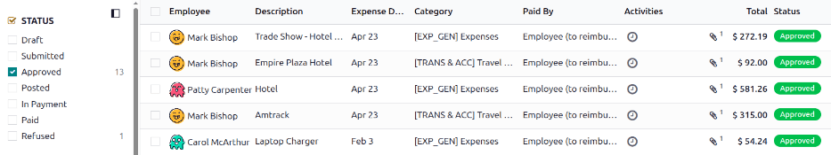
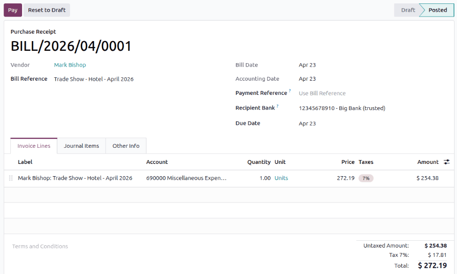
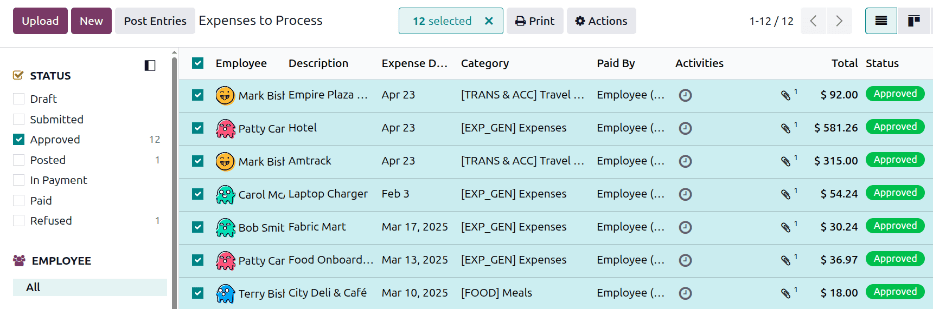

=============
Post expenses
=============

Once an expense is :doc:`approved <../expenses/approve_expenses>`, the next step is to post the
expense to the proper accounting journal.

.. important::
   To post an expense to an accounting journal, the user **must** have the following :doc:`access
   rights <../../general/users/access_rights>`:

   - Accounting: *Accountant* or *Adviser*
   - Expenses: *Manager*

Only expenses with an *Approved* status can be posted to a journal. To view all expenses ready to be
posted, navigate to :menuselection:`Expenses app --> My Expenses --> Expenses to Process`. Next, to
view **only** approved expenses that need to be posted, adjust the filters on the left side so only
the :guilabel:`Approved` checkbox is ticked.

Expenses can be posted to accounting journals in two ways: :ref:`individually
<expenses/post-individual>` or :ref:`in bulk <expenses/post-multiple>`.

.. note::
   The default :guilabel:`Expenses to Process` dashboard displays all expenses with a status of
   :guilabel:`Submitted`.

.. _expenses/post-individual:

Post individual expenses
------------------------

To post an individual expense, navigate to :menuselection:`Expenses app --> My Expenses --> Expenses
to Process`, and click on an individual expense, to view the detailed expense form. In this view,
several options are presented: :guilabel:`Post Journal Entries`, :guilabel:`Report In Next Payslip`,
:guilabel:`Refuse`, :guilabel:`Reset`, :guilabel:`Split Expense`, and :guilabel:`Attach Receipt`.

Click :guilabel:`Post Journal Entries` and a *Post expenses* pop-up window loads. The default
accounting journal for the expense category populates the :guilabel:`Journal` field, but can be
modified if needed. The default journal for all expense categories is *Purchases*. Additionally, the
date of the expense populates the :guilabel:`Accounting Date` field, indicating when the expense was
incurred.

Click the :guilabel:`Post Expenses` button, and the journal entry loads, displaying all the details,
and has a status of :guilabel:`Posted`.

.. _expenses/post-multiple:

Post multiple expenses
----------------------

To post multiple expenses at once, navigate to :menuselection:`Expenses app --> My Expenses -->
Expenses to Process`, then adjust the filters on the left side so only the :guilabel:`Approved`
checkbox is ticked. Next, select the expenses to approve by ticking the checkbox next to each
expense being approved.

Next, click the :guilabel:`Post Entries` button. A *Post Expenses* pop-up window loads, with the
default accounting journal :guilabel:`Purchases` populating the :guilabel:`Journal` field, and the
expense date populating the :guilabel:`Accounting date` field. Make any necessary modifications,
then click :guilabel:`Post Expenses`.

Once posted, the list changes ot show all the various accounting journal entries created. Click on
any entry to view the accounting journal details.

.. note::
   Only expenses with a status of :guilabel:`Approved` can be posted to an accounting journal. If an
   expense is selected that **cannot** be posted, such as an unapproved expense, or the expense has
   already been posted to a journal, the :guilabel:`Post Entries` button is **not** visible.

