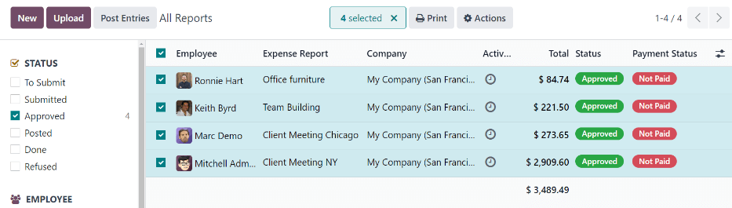

=============
Post expenses
=============

Once an expense report is :doc:`approved <../expenses/approve_expenses>`, the next step is to post
the expense report to the proper accounting journal.

.. important::
   To post expense reports to an accounting journal, the user **must** have the following
   :doc:`access rights <../../general/users/access_rights>`:

   - Accounting: *Accountant* or *Adviser*
   - Expenses: *Manager*

Only expense reports with an *Approved* status can post the expenses to a journal. To view all
expense reports, navigate to :menuselection:`Expenses app --> Expense Reports`. Next, to view
**only** approved expense reports that need to be posted, adjust the filters on the left side, so
only the :guilabel:`Approved` checkbox is ticked.

.. note::
   The default :guilabel:`All Reports` dashboard displays all expense reports, except reports with a
   status of :guilabel:`Refused`.

Expense reports can be posted to accounting journals in two ways: :ref:`individually
<expenses/individual-reports>` or :ref:`in bulk <expenses/multiple-reports>`.

.. _expenses/individual-reports:

Post individual reports
-----------------------

To post an individual report, navigate to :menuselection:`Expenses app --> Expense Reports`, and
click on an individual report with a :guilabel:`Status` of :guilabel:`Approved`, to view the report
form. In this view, several options are presented: :guilabel:`Post Journal Entries`,
:guilabel:`Report In Next Payslip`, :guilabel:`Refuse`, or :guilabel:`Reset to Draft`.

Click :guilabel:`Post Journal Entries` to post the report.

The accounting journal the expenses are posted to is listed in the :guilabel:`Journal` field of the
expense report.

After posting the expenses to an accounting journal, a :guilabel:`Journal Entry` smart button
appears at the top of the screen. Click the :guilabel:`Journal Entry` smart button, and the details
for the journal entry appear, with a status of :guilabel:`Posted`.

.. _expenses/multiple-reports:

Post multiple reports
---------------------

To post multiple expense reports at once, navigate to :menuselection:`Expenses app --> Expense
Reports` to view a list of expense reports. Next, select the reports to approve by ticking the
checkbox next to each report being approved.

.. note::
   Only expense reports with a status of :guilabel:`Approved` are able to post the expenses to an
   accounting journal. If an expense report is selected that **cannot** be posted, such as an
   unapproved report, or the report has already been posted to a journal, the :guilabel:`Post
   Entries` button is **not** visible.

.. tip::
   To select **only** approved expense reports, adjust the filters on the left side, so that only
   the :guilabel:`Approved` checkbox is ticked. Next, tick the checkbox next to the
   :guilabel:`Employee` column title to select **all** the :guilabel:`Approved` reports in the list
   at once.

Next, click the :guilabel:`Post Entries` button.

