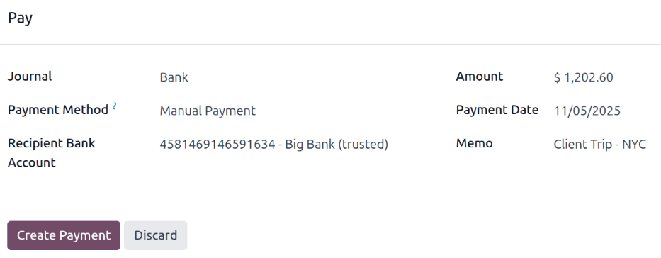
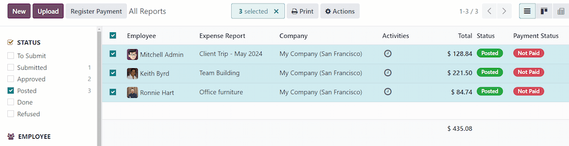
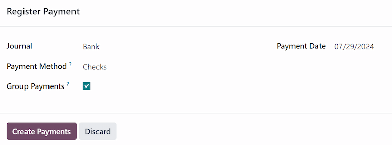
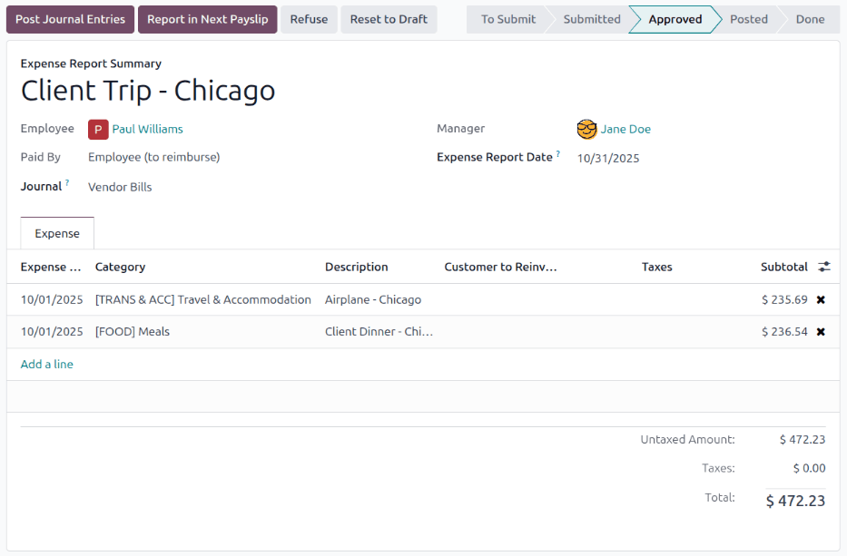

===================
Reimburse employees
===================

After an expense report is :doc:`posted to an accounting journal <../expenses/post_expenses>`, the
next step is to reimburse the employee. Just like approving and posting expenses, employees can be
reimbursed in two ways: with cash, check, or direct deposit (:ref:`individually
<expenses/reimburse-single>` or :ref:`in bulk <expenses/reimburse-bulk>`), or :ref:`reimbursed in a
payslip <expenses/reimburse-payslip>`.

Settings
========

Reimbursements can be paid via paycheck, check, cash, or bank transfer. To set up payment options,
first configure the various settings by navigating to :menuselection:`Expenses app -->
Configuration --> Settings`.

To reimburse employees for expenses :ref:`in their paychecks <expenses/reimburse-payslip>`, tick the
checkbox beside the :guilabel:`Reimburse in Payslip` option in the :guilabel:`Expenses` section.

Next, set how payments are made in the :guilabel:`Accounting` section. Click the drop-down menu
under :guilabel:`Payment Methods`, and select the desired payment option. Default options include
paying by :guilabel:`Manual (Cash)`, :guilabel:`Checks (Bank)`, :guilabel:`NACHA (Bank)`, and
others. Leaving this field blank allows for **all** available payment options to be used.

When all desired configurations are complete, click :guilabel:`Save` to activate the settings.

.. _expenses/reimburse-single:

Reimburse individually
======================

To reimburse an individual expense report, first navigate to :menuselection:`Expenses app -->
Expense Reports`. All expense reports are presented in a default list view. Click on the expense
report being reimbursed to view the report details.

.. important::
   **Only** expense reports with a status of :guilabel:`Posted` can be reimbursed.

Click the :guilabel:`Register Payment` button in the top-left corner of the expense report, and a
:guilabel:`Register Payment` pop-up window appears. Enter the following information in the pop-up
window:

- :guilabel:`Journal`: Select the accounting journal to post the payment to using the drop-down
  menu. The default options are :guilabel:`Bank` or :guilabel:`Cash`.
- :guilabel:`Payment Method`: Select how the payment is made using the drop-down menu. If
  :guilabel:`Cash` is selected for the :guilabel:`Journal`, the only option available is
  :guilabel:`Manual`. If :guilabel:`Bank` is selected for the :guilabel:`Journal`, the default
  options are :guilabel:`Manual` or :guilabel:`Checks`.
- :guilabel:`Recipient Bank Account`: Select the employee's bank account the payment is being sent
  to. If the employee has a bank account on file in the :ref:`Private Information tab
  <employees/private-info>` of their employee form in the **Employees** app, that bank account
  populates this field, by default.
- :guilabel:`Amount`: The total amount being reimbursed populates this field, by default. The
  currency, located to the right of the field, can be modified using the drop-down menu.
- :guilabel:`Payment Date`: Enter the date the payments are issued in this field. The current date
  populates this field, by default.
- :guilabel:`Memo`: The text entered in the :doc:`Expense Report Summary
  <../expenses/expense_reports>` field of the expense report populates this field, by default.

         reimbursement.

When the fields of the pop-up window are completed, click the :guilabel:`Create Payment` button to
register the payment, and reimburse the employee.

.. _expenses/reimburse-bulk:

Reimburse in bulk
=================

To reimburse multiple expense reports at once, navigate to :menuselection:`Expenses app --> Expense
Reports` to view all expense reports in a list view. Next, adjust the :guilabel:`STATUS` filters on
the left side to only present expense reports with a status of :guilabel:`Posted`.

.. tip::
   Adjusting the :guilabel:`STATUS` filters to only show :guilabel:`Posted` expense reports is not
   necessary, but removes the step of selecting each individual report in the list.

Tick the checkbox next to the :guilabel:`Employee` column title to select all the reports in the
list. Once ticked, the number of selected expense reports appears at the top of the page
(:guilabel:`(#) Selected`). Additionally, a :guilabel:`Register Payment` button also appears in the
upper-left corner.

Click the :guilabel:`Register Payment` button, and a :guilabel:`Register Payment` pop-up window
appears. Enter the following information in the pop-up window:

- :guilabel:`Journal`: Select the accounting journal the payment should be posted to, using the
  drop-down menu. The default options are :guilabel:`Bank` or :guilabel:`Cash`.
- :guilabel:`Payment Method`: Select how the payment is made using the drop-down menu. If
  :guilabel:`Cash` is selected for the :guilabel:`Journal`, the only option available is
  :guilabel:`Manual`. If :guilabel:`Bank` is selected for the :guilabel:`Journal`, the default
  options are :guilabel:`Manual` or :guilabel:`Checks`.
- :guilabel:`Group Payments`: When multiple expense reports are selected for the same employee, this
  option appears. Tick the checkbox to have only one payment made, rather than issuing multiple
  payments to the same employee.
- :guilabel:`Payment Date`: Enter the date the payments are issued. The current date populates this
  field, by default.

When the fields on the pop-up window are completed, click the :guilabel:`Create Payments` button to
register the payments, and reimburse the employees.

.. _expenses/reimburse-payslip:

Report in next payslip
======================

If the  *Reimburse in Payslip* option is activated on the *Settings* page, payments can be added to
their next payslip, instead of issued manually.

.. important::
   Reimbursing expenses on payslips can **only** be done individually, on an expense report with a
   status of *Approved*. Once an expense report has a status of *Posted*, the option to reimburse in
   the following payslip does **not** appear.

Navigate to :menuselection:`Expenses app --> Expense Reports`, and click on the individual expense
report being reimbursed on the following paycheck. Click the :guilabel:`Report in Next Payslip`
smart button, and the expenses are added to the next payslip issued for that employee. Additionally,
a message is logged in the chatter stating the expense is added to the following payslip.

The status for the expense report remains :guilabel:`Approved`. The status only changes to
:guilabel:`Posted` (and then :guilabel:`Done`), when the paycheck is processed.

.. seealso::
   Refer to the :doc:`Payslips <../../hr/payroll/payslips>` documentation for more information about
   processing paychecks.
