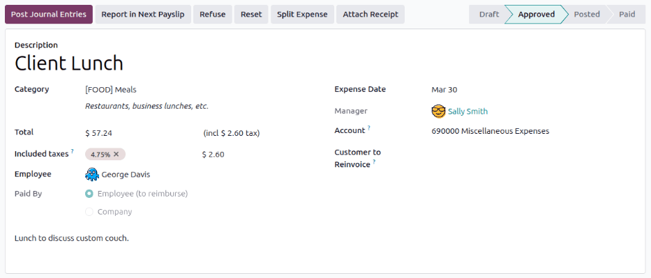
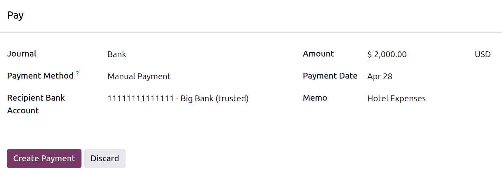

===================
Reimburse employees
===================

After an expense is :doc:`posted to an accounting journal <../expenses/post_expenses>`, the next
step is to reimburse the employee. Employees can be reimbursed :ref:`directly in their paychecks
<expenses/reimburse-payslip>`, or an individual expense can be :ref:`reimbursed via cash, check, or
direct deposit <expenses/reimburse-single>`.

.. _expenses/reimburse-settings:

Reimbursement settings
======================

Reimbursements can be paid via a paycheck, check, cash, or bank transfer (usually referred to as
direct deposit). To set up payment options, first configure the various settings by navigating to
the :menuselection:`Expenses app --> Configuration --> Settings`.

To reimburse employees for expenses :ref:`in their paychecks <expenses/reimburse-payslip>`, tick the
checkbox beside the :guilabel:`Reimburse in Payslip` option in the :guilabel:`Expenses` section.

Next, set how payments are made in the :guilabel:`Accounting` section. Click the drop-down menu
under :guilabel:`Payment Methods`, and select the desired payment option. The default options
include paying by :guilabel:`Manual Payment (Bank)`, :guilabel:`Batch Deposit (Bank)`, and
:guilabel:`Checks (Bank)`. Depending on the installed :doc:`payroll localization
<../../hr/payroll/payroll_localizations>`, additional options may appear.

Leaving this field blank allows for **all** available payment options to be used.

When all desired configurations are complete, click :guilabel:`Save` to activate the settings.

.. _expenses/reimburse-payslip:

Reimburse in payslips
=====================

If the  *Reimburse in Payslip* option is activated on the :ref:`settings
<expenses/reimburse-settings>` page, payments can be added to the employee's next payslip, instead
of issuing separate payments.

.. important::
   Only expenses with a status of :guilabel:`Approved` and :guilabel:`Posted` are able to be
   reimbursed in a payslip. If an expense with a different status is selected, a warning appears
   when attempting to repay the expense in a payslip.

.. seealso::
   :doc:`Payslips <../../hr/payroll/payslips>`

.. _expenses/reimburse-payslip-single:

Reimburse individually
----------------------

Navigate to :menuselection:`Expenses app --> My Expenses --> Expenses to Process`, and click on an
expense with a :guilabel:`Status` of :guilabel:`Approved` or :guilabel:`Posted`.

On the individual expense, click the :guilabel:`Report in Next Payslip` button. A message is logged
in the chatter stating the `Expense ("Expense Name") will be added to the next payslip.` The status
for the expense remains unchanged, but changes to :guilabel:`Posted` when the journal entry is
posted, then :guilabel:`Paid` when the related payslip is processed.

If the expense is repaid in another manner before the payslip is processed, the expense can be
removed from the payslip by clicking the :guilabel:`Remove from Payslip` button.

.. _expenses/reimburse-payslip-bulk:

Reimburse in bulk
-----------------

Navigate to :menuselection:`Expenses app --> My Expenses --> Expenses to Process`, and click the
checkbox next to all the expenses being reimbursed.

.. tip::
   To select *all* reimbursable expenses, adjust the side menu so that only :guilabel:`Approved` or
   :guilabel:`Posted` are checked. Next, click the checkbox next to :guilabel:`Employee` to select
   all expenses.

Click the :icon:`fa-gear` :guilabel:`Actions` button, then select :guilabel:`Report in Next Payslip`
from the resulting drop-down menu. :guilabel:`Report in Next Payslip` button, and the expenses are
all added to the next payslip issued for the corresponding employee.

Nothing changes on the :guilabel:`Expenses to Process` dashboard, but a message is logged in the
chatter of each individual expense stating the `Expense ("Expense Name") will be added to the next
payslip.` The status for the individual expenses remains unchanged, but changes to
:guilabel:`Posted` when the journal entry is posted, then :guilabel:`Paid` when the related payslip
is processed.

.. _expenses/reimburse-single:

Reimburse expenses via cash, check, or direct deposit
=====================================================

To reimburse an individual expense, navigate to the :menuselection:`Expenses app --> My Expenses -->
Expenses to Process`, and the :guilabel:`Expenses to Process` dashboard appears, displaying all
:guilabel:`Submitted` expenses. Adjust the side menu to display only :guilabel:`Posted` expenses.

.. note::
   Only expenses that have been :doc:`posted to an accounting journal <post_expenses>` (expenses
   with a status of :guilabel:`Posted`) can be reimbursed.

Click the expense to pay, then click the :icon:`fa-bars` :guilabel:`Journal Entry` smart button. On
the journal entry, click the :guilabel:`Pay` button. In the *Pay* pop-up window, enter the following
information in the pop-up window:

- :guilabel:`Journal`: Select the accounting journal to post the payment using the drop-down menu.
  The default journal is :guilabel:`Bank`.
- :guilabel:`Payment Method`: Select how the payment is made using the drop-down menu. If
  :guilabel:`Cash` is selected for the :guilabel:`Journal`, the only option available is
  :guilabel:`Manual Payment`. If :guilabel:`Bank` is selected for the :guilabel:`Journal`, the
  default options are :guilabel:`Manual Payment` or :guilabel:`Checks`.
- :guilabel:`Recipient Bank Account`: This field only appears if the :guilabel:`Journal` is set to
  :guilabel:`Bank`, and the :guilabel:`Payment Method` is set to :guilabel:`Manual Payment`. The
  employee's :ref:`bank account <employees/private-info>` populates this field, by default. If the
  employee has more than one trusted bank account on their employee profile, use the drop-down menu
  to select the desired bank account.
- :guilabel:`Amount`: The total amount being reimbursed populates this field by default.
- :guilabel:`Payment Date`: Enter the date the payment is issued in this field. The current date
  populates this field by default.
- :guilabel:`Memo`: The text entered in the :guilabel:`Description` field of the expense form
  populates this field by default.

When the fields of the pop-up window are completed, click the :guilabel:`Create Payment` button to
register the payment, and reimburse the employee. A green :guilabel:`Paid` banner now appears on the
journal entry.

         reimbursement.
