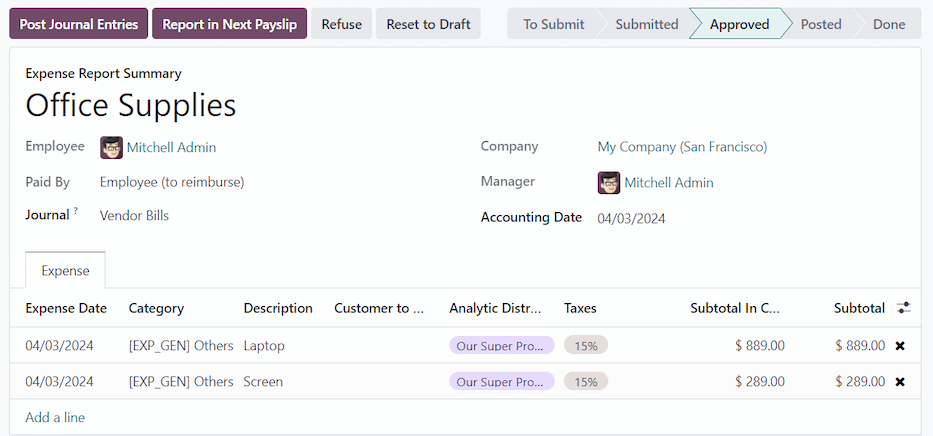
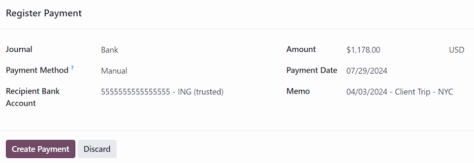

===================
Reimburse employees
===================

After an expense report is :doc:`posted to an accounting journal <../expenses/post_expenses>`, the
next step is to reimburse the employee. Employees can be reimbursed via cash, check, or direct
deposit in three ways:

- :ref:`Individually <expenses/reimburse-single>`: Each individual expense report is reimbursed
  separately.
- :ref:`In bulk <expenses/reimburse-bulk>`: Multiple expense reports are reimbursed in a single
  payment.
- :ref:`In the employee's payslip <expenses/reimburse-payslip>`: Expense reports are reimbursed
  directly in the employee's payslip.

.. _expenses/reimburse-settings:

Reimbursement settings
======================

Reimbursements can be paid via a paycheck, check, cash, or bank transfer (usually referred to as
direct deposit). To set up payment options, first configure the various settings by navigating to
:menuselection:`Expenses app --> Configuration --> Settings`.

To reimburse employees for expenses :ref:`in their paychecks <expenses/reimburse-payslip>`, tick the
checkbox beside the :guilabel:`Reimburse in Payslip` option in the :guilabel:`Expenses` section.

Next, set how payments are made in the :guilabel:`Accounting` section. Click the drop-down menu
under :guilabel:`Payment Methods`, and select the desired payment option. The default options
include paying by :guilabel:`Manual Payment (Cash)`, :guilabel:`Manual Payment (Bank)`,
:guilabel:`Batch Deposit (Bank)`, and :guilabel:`Checks (Bank)`.

Leaving this field blank allows for **all** available payment options to be used.

When all desired configurations are complete, click :guilabel:`Save` to activate the settings.

.. _expenses/reimburse-payslip:

Reimburse in payslips
=====================

If the  *Reimburse in Payslip* option is activated on the :ref:`settings
<expenses/reimburse-settings>` page, payments can be added to the employee's next payslip, instead
of issuing separate payments.

.. important::
   Reimbursing expenses on payslips can **only** be done individually for an *approved* expense
   report. Once an expense report has a status of *Posted*, the option to reimburse in the following
   payslip **is not available**.

Navigate to :menuselection:`Expenses app --> Expense Reports`, and click on the individual expense
report to reimburse on the following paycheck. Click the :guilabel:`Report in Next Payslip` button,
and the expenses are added to the next payslip issued for that employee.

Once the expense report is added to the following payslip, a message is logged in the chatter
stating `Expense report (expense report name) will be added to the next payslip.` The status for the
expense report remains :guilabel:`Approved`. The status only changes to :guilabel:`Posted` (and then
:guilabel:`Done`), when the related payslip is processed.

.. seealso::
   Refer to the :doc:`Payslips <../../hr/payroll/payslips>` documentation for more information about
   processing paychecks.

.. _expenses/reimburse-single:

Reimburse individually
======================

To reimburse an individual expense report, first navigate to :menuselection:`Expenses app -->
Expense Reports`. All expense reports are presented in a default list view. Click on the expense
report being reimbursed to view the report details.

.. important::
   **Only** expense reports with a status of :guilabel:`Posted` can be reimbursed directly to the
   employee (not :ref:`via a payslip <expenses/reimburse-payslip>`).

Click the :guilabel:`Pay` button in the top-left corner of the expense report, and a :guilabel:`Pay`
pop-up window loads. Enter the following information in the pop-up window:

- :guilabel:`Journal`: Select the accounting journal to post the payment using the drop-down menu.
  The default options are :guilabel:`Bank` or :guilabel:`Cash`.
- :guilabel:`Payment Method`: Select how the payment is made using the drop-down menu. If
  :guilabel:`Cash` is selected for the :guilabel:`Journal`, the only option available is
  :guilabel:`Manual Payment`. If :guilabel:`Bank` is selected for the :guilabel:`Journal`, the
  default options are :guilabel:`Manual Payment` or :guilabel:`Checks`.
- :guilabel:`Recipient Bank Account`: This field only appears if the :guilabel:`Journal` is set to
  :guilabel:`Bank`. The employee's :ref:`bank account <employees/private-info>` populates this
  field, by default. If the employee has more than one trusted bank account on their employee
  profile, use the drop-down menu to select the desired bank account.
- :guilabel:`Amount`: The total amount being reimbursed populates this field, by default.
- :guilabel:`Payment Date`: Enter the date the payment is issued in this field. The current date
  populates this field, by default.
- :guilabel:`Memo`: The text entered in the :doc:`Expense Report Summary
  <../expenses/expense_reports>` field of the expense report populates this field, by default.

         reimbursement.

When the fields of the pop-up window are completed, click the :guilabel:`Create Payment` button to
register the payment, and reimburse the employee. A green :guilabel:`In Payment` banner now appears
on the expense report.

.. _expenses/reimburse-bulk:

Reimburse in bulk
=================

To reimburse multiple expense reports at once, navigate to :menuselection:`Expenses app --> Expense
Reports` to view all expense reports in a list view. Next, select the expense reports to be
reimbursed.

.. important::
   **Only** expense reports with a status of :guilabel:`Posted` can be reimbursed directly to the
   employee (not :ref:`via a payslip <expenses/reimburse-payslip>`).

.. tip::
   Adjust the :guilabel:`STATUS` filter on the left side to only show :guilabel:`Posted` expense
   reports. This displays **only** expense reports that are able to be reimbursed.

Tick the checkbox next to the expense reports being reimbursed, then click the :guilabel:`Pay`
button, and a :guilabel:`Pay` pop-up window loads. Enter the following information in the pop-up
window:

- :guilabel:`Journal`: Select the accounting journal to post the payment using the drop-down menu.
  The default options are :guilabel:`Bank` or :guilabel:`Cash`.
- :guilabel:`Payment Method`: Select how the payment is made using the drop-down menu. If
  :guilabel:`Cash` is selected for the :guilabel:`Journal`, the only option available is
  :guilabel:`Manual Payment`. If :guilabel:`Bank` is selected for the :guilabel:`Journal`, the
  default options are :guilabel:`Manual Payment` or :guilabel:`Checks`.
- :guilabel:`Group Payments`: When multiple expense reports are selected for the same employee, this
  option appears. Tick the checkbox to have only one payment made per employee, rather than issuing
  multiple payments to the same employee.
- :guilabel:`Amount`: The total amount being reimbursed for all the expense reports populates this
  field, by default.
- :guilabel:`Payment Date`: Enter the date the payments are issued. The current date populates this
  field, by default.

When the fields on the :guilabel:`Pay` pop-up window are completed, click the :guilabel:`Create
Payments` button to register the payments, and reimburse the employees.

.. image:: reimburse/repay-multiple.png
   :alt: The pay pop-up window filled out for multiple reimbursements via checks.
