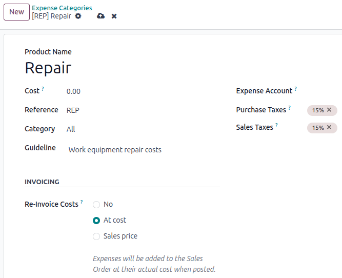
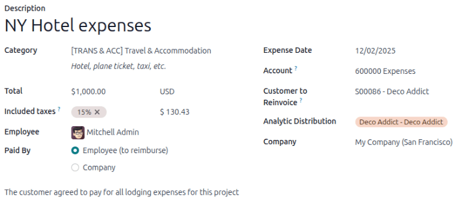
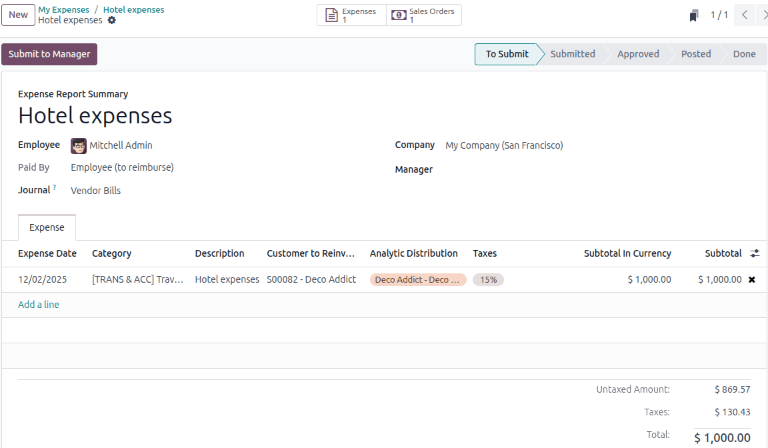

===================
Re-invoice expenses
===================

If expenses are tracked on customer projects, they can be automatically charged back to the
customer. This is done by :ref:`creating an expense <expenses/reinvoice-create>`, referencing the
sales order to which it is added, then :ref:`creating an expense report
<expenses/reinvoice-report>`.

Next, managers :ref:`approve the expense report <expenses/reinvoice-approve>`, before the accounting
department :ref:`posts the journal entries <expenses/reinvoice-approve>`.

Finally, once the expense report is posted to a journal, the expenses appear on the specified
:abbr:`SO (Sales Order)`. The :abbr:`SO (Sales Order)` is then :ref:`invoiced <expenses/reinvoice>`,
thus charging the customer for the expenses.

.. important::
   Approving expenses, posting expenses to accounting, and reinvoicing expenses on :abbr:`SOs (Sales
   Orders)` are **only** possible for users with the appropriate :doc:`access rights
   <../../general/users/access_rights>`.

.. seealso::
   This document provides lower-level instructions to create, submit, approve, and post expenses.
   For fully-detailed instructions for any of these steps, refer to the following documentation:

   - :doc:`Log expenses <log_expenses>`
   - :doc:`Expense reports <expense_reports>`
   - :doc:`Approving expenses <approve_expenses>`
   - :doc:`Posting expenses in accounting <post_expenses>`

Setup
=====

The **Sales** and **Accounting** apps must be installed for this configuration.

In the **Expense** app, specify the invoicing policy for each expense category. Navigate to
:menuselection:`Expenses app --> Configuration --> Expense Categories`. Click on an expense category
to view the expense category form.

Under the :guilabel:`INVOICING` section, click the radio button next to the desired selection for
:guilabel:`Re-Invoice Expenses`:

- :guilabel:`No`: The expense category cannot be re-invoiced.
- :guilabel:`At cost`: The expense category invoices expenses at the price set on the expense
  category form.
- :guilabel:`Sales price`: The expense category invoices at the sales price set on the expense form.

The default expense categories have the following re-invoicing policies:

+-------------+---------------------------------------------------------------------------+-----------------------------------------------------------+--------------------------------------+
|             |                                 *At cost*                                 |                       *Sales price*                       |             *Not enabled*            |
+=============+===========================================================================+===========================================================+======================================+
|  *Category* |                                  **COMM**                                 |                          **FOOD**                         |             **EXP_GEN**              |
+-------------+---------------------------------------------------------------------------+-----------------------------------------------------------+--------------------------------------+
|*Description*|         Communication expenses such as phone bills, postage, etc.         |  Meal expenses such as restaurants, business lunches, etc |                Others                |
+-------------+---------------------------------------------------------------------------+-----------------------------------------------------------+--------------------------------------+
|  *Category* |                              **TRANS & ACCT**                             |                          **MIL**                          |              **GIFT**                |
+-------------+---------------------------------------------------------------------------+-----------------------------------------------------------+--------------------------------------+
|*Description*| Travel and accommodation expenses such as hotel, plane ticket, taxi, etc. |                          Mileage.                         |    Gifts to customers or vendors.    |
+-------------+---------------------------------------------------------------------------+-----------------------------------------------------------+--------------------------------------+

Set the re-invoicing policy
---------------------------

To set a re-invoicing policy on an expense category, navigate to :menuselection:`Expenses app -->
Configuration --> Expense Categories`. Either open the desired expense category, or :ref:`create a
new one <expenses/expense-categories>`.

In the :guilabel:`INVOICING` section, select either :guilabel:`At cost` or :guilabel:`Sales price`
for the :guilabel:`Re-invoice Costs` field.

.. _expenses/reinvoice-create:

Create an expense
=================

To re-invoice an expense, first :doc:`create an expense record <log_expenses>`. In the
:guilabel:`Customer to Reinvoice` field, use the drop-down menu to select the :abbr:`SO (Sales
Order)` to add the expense to.

.. important::
   Selecting the proper :abbr:`SO (Sales Order)` in the :guilabel:`Customer to Reinvoice` field is
   **critical**, since this is how expenses are automatically invoiced after an expense report is
   approved.

.. seealso::
   :doc:`Detailed instructions on completing an expense <log_expenses>`.

Optional: Analytic Distribution
-------------------------------

.. important::
   For the :guilabel:`Analytic Distribution` field to be visible the **Accounting** app must be
   installed, :guilabel:`Analytic Accounting`, and :guilabel:`Analytic Plans` must be configured.
   Refer to :doc:`../accounting/reporting/analytic_accounting` for more information.

Next, select the :guilabel:`Analytic Distribution` the expense is posted to. Multiple accounts can
be selected, if desired.

To add another :guilabel:`Analytic Distribution`, click on the line to reveal the
:guilabel:`Analytic` pop-over window. Click :guilabel:`Add a line`, then select the desired
:guilabel:`Analytic Distribution` from the drop-down field.

If selecting more than one :guilabel:`Analytic Distribution`, the :guilabel:`Percentage` fields
**must** be modified. By default, both fields are populated with `100%`. Adjust the percentages for
all the fields, so the total of all selected accounts equals `100%`.

.. example::
   A painting company agrees to paint an office building that houses two different companies. During
   the estimate, a meeting is held at the office location to discuss the project.

   Both companies agree to pay for the travel expenses for the painting company employees. When
   creating the expenses for the mileage and hotels, **both companies** are listed in the
   :guilabel:`Analytic Distribution` line, for 50% each.

.. _expenses/reinvoice-report:

Create an expense report
========================

After the expenses are created, click :guilabel:`Create report`. Once the expense report is
submitted, the :icon:`fa-money` :guilabel:`Sales Orders` and :icon:`fa-file-text-o`
:guilabel:`Expenses` smart buttons appear at the top of the expense report. The smart buttons will
display the number of :abbr:`SOs (Sales Orders)` and expenses linked to the expense report.

Next, click :guilabel:`Submit to Manager` to request approval from the assigned Manager.

.. important::
   The :guilabel:`Customer to Reinvoice` field can be modified *only* until an expense report is
   **approved**. After an expense report is approved, the :guilabel:`Customer to Reinvoice` field is
   no longer able to be modified.

.. seealso::
   :doc:`Detailed instructions to create and submit an expense reports <expense_reports>`.

.. _expenses/reinvoice-approve:

Approve and post expenses
=========================

Before approving an expense report, ensure all the information for every expense line is correct,
then click :guilabel:`Approve`.

.. image:: reinvoice_expenses/analytic-dist.png
   :alt: The expense report with all the Analytic Distribution lines populated.

.. note::
   The :guilabel:`Approve` button **only** appears after an expense report has been :ref:`submitted
   <expenses/submit>`.

The accounting department is typically responsible for :doc:`posting journal entries
<post_expenses>`. To post expenses to an accounting journal, click :guilabel:`Post Journal Entries`.
Once an expense report is approved, it can then be posted.

The :abbr:`SO (Sales Order)` is **only** updated *after* the journal entries are posted. Once the
journal entries are posted, the expenses now appear on the referenced :abbr:`SO (Sales Order)`.

.. seealso::
   :doc:`Detailed instructions to approve an expense report <approve_expenses>`.

.. _expenses/reinvoice:

Invoice expenses to the customer
================================

Once the expense report is approved and the corresponding journal entries are posted, the :abbr:`SO
(Sales Order)` is automatically updated, allowing the customer to be invoiced. The accounting
department is typically responsible for generating the final invoice.

Select the desired expense report, and click the :icon:`fa-money` :guilabel:`Sales Orders` smart
button to open the :abbr:`SO (Sales Order)`. The expenses to be re-invoiced now appear on the
:abbr:`SO (Sales Order)`.

.. note::
   More than one :abbr:`SO (Sales Order)` can be referenced on an expense report. If more than one
   :abbr:`SO (Sales Order)` is referenced, clicking the :icon:`fa-money` :guilabel:`Sales Orders`
   smart button opens a list displaying all the :abbr:`SOs (Sales Order)` associated with that
   expense report. Click on a :abbr:`SO (Sales Order)` to open the individual :abbr:`SO (Sales
   Order)` details.

.. example::
   A electronics repair company has a large customer base. Their service charges vary depending on
   the product they service. A technician uses different components depending on the product they
   service and services five customers per day on average.

   After each job the technician submits an expense and associates the appropriate :abbr:`SO (Sales
   Order)` for each. At the end of the day, the technician selects all of the expenses and creates
   an expense report for the manager to review and approve.

   When the expense report gets created, several :abbr:`SOs (Sales Order)` are linked to it. The
   :icon:`fa-file-text-o` :guilabel:`Expenses` and :icon:`fa-money` :guilabel:`Sales Orders` smart
   buttons display the number of linked records on the top of the expense report.

   .. image:: reinvoice_expenses/expense-report-multi-so.png
      :alt: See the expenses listed on the sales order after clicking into it.

On the :abbr:`SO (Sales Order)` form, the expenses are now line items in the :guilabel:`Order Lines`
tab, with their :guilabel:`Delivered` column filled in, and ready to be invoiced.

.. image:: reinvoice_expenses/so-details.png
   :alt: See the expenses listed on the sales order after clicking into it.

Click :guilabel:`Create Invoice`, and a :guilabel:`Create invoices` pop-up window appears.

Select if the invoice is a :guilabel:`Regular invoice`, a :guilabel:`Down payment (percentage)`, or
a :guilabel:`Down payment (fixed amount)`, and click :guilabel:`Create Draft Invoice`. A customer
invoice draft window displays the products and expenses in the :guilabel:`Invoice Lines` tab.

.. note::
   For an :abbr:`SO (Sales Order)` with a product and a expense, if the product has not been
   delivered to the customer, only the expense is listed in the :guilabel:`Invoice Lines` tab of the
   invoice. Creating two invoices for one :abbr:`SO (Sales Order)` is possible.

Click :guilabel:`Confirm` to change the invoice status from :guilabel:`Draft` to :guilabel:`Posted`.

To email the invoice to the customer, click :guilabel:`Send & Print`. A document layout
configuration pop-up window appears for layout customization.

Click :guilabel:`Save`, and a pop-up window with a pre-configured email message and a PDF invoice in
its body displays. The message can be reviewed and modified, if needed.

Click :guilabel:`Send & Print` to email the invoice to the customer. The pop-up window disappears,
and Odoo sends the invoice to the customer. Additionally, a PDF of the invoice is automatically
downloaded for record-keeping and printing purposes.

Invoice payment
===============

Depending on the payment configuration in the **Accounting** app, there are several ways to process
payment for an invoice. This workflow incorporates the customer portal and manual verification. The
customer is responsible for submitting the invoice payment and the accounting department is
responsible for verification.

.. note::
   For online payments through the customer portal, the :doc:`Invoice Online Payment
   <../../finance/payment_providers>` feature must be enabled on the **Accounting** app. Also a
   payment method must be set up.

Navigate to the invoice by clicking the :menuselection:`Expenses app --> Expense Reports` and select
the desired expense report.

Click the :icon:`fa-money` :guilabel:`Sales Orders` smart button, then select the desired :abbr:`SO
(Sales Order)`. Click the :icon:`fa-pencil-square-o` :guilabel:`Invoices` smart button.

After clicking :guilabel:`Send & Print`, the invoice is emailed to the customer and published online
on the customer portal. Click :guilabel:`Preview` to see the customer's view of the invoice and
payment methods.

Once the customer pays online, the invoice gets an :guilabel:`In Payment` banner. The
:icon:`fa-bars` :guilabel:`Payments` and :icon:`fa-money` :guilabel:`Payment Transaction` smart
buttons display at the top of the invoice form.

Click the :icon:`fa-bars` :guilabel:`Payments` smart button to go to the :guilabel:`Pay` form. Click
:guilabel:`Validate` to confirm that the invoice payment has been received. The Pay form is
automatically updated to :guilabel:`Paid`.
