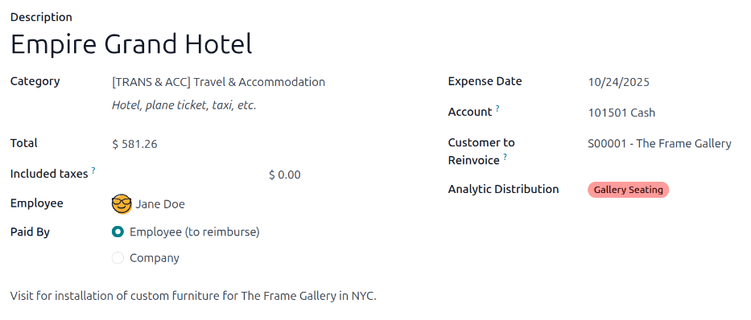
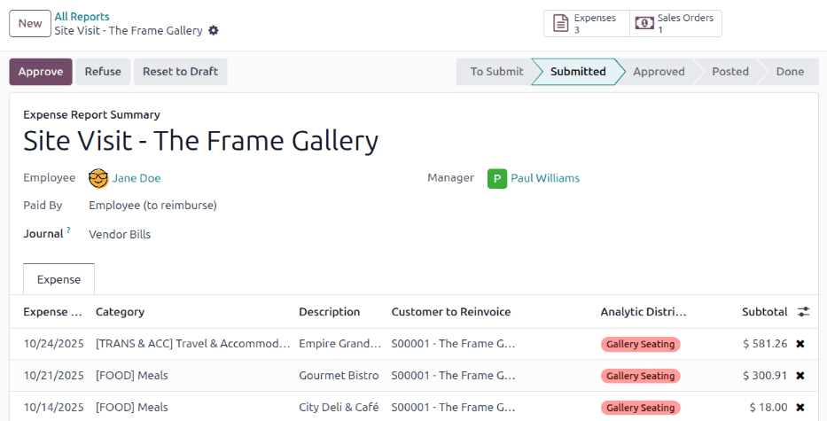
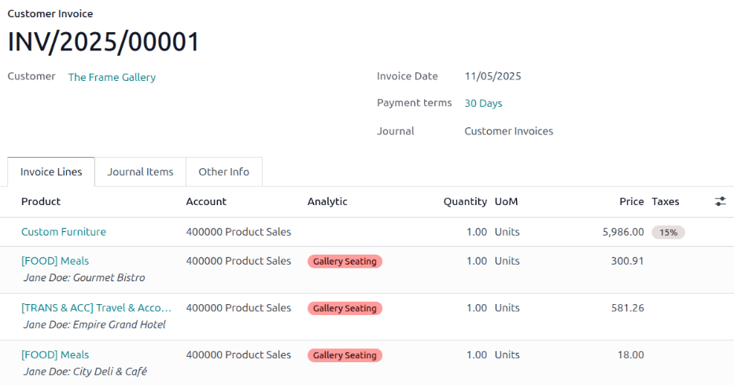

==================
Reinvoice expenses
==================

If expenses are tracked on customer projects, they can be automatically charged back to the
customer. This is done by :ref:`logging an expense <expenses/reinvoice-create>`, referencing the
corresponding sales order, and then :ref:`creating an expense report
<expenses/reinvoice-expense-report>`.

Next, managers :ref:`approve the expense report <expenses/reinvoice-approve>`, then the accounting
department :ref:`post the journal entries <expenses/reinvoice-approve>`.

Finally, once the expense report is posted to a journal, the expenses appear on the specified
:abbr:`SO (Sales Order)`. When the :abbr:`SO (Sales Order)` is :ref:`invoiced <expenses/reinvoice>`,
the customer is charged for the expenses.

.. important::
   Approving expenses, posting expenses to accounting, and reinvoicing expenses on :abbr:`SOs (Sales
   Orders)` is **only** possible for users with the appropriate :doc:`access rights
   <../../general/users/access_rights>`.

.. seealso::
   This document provides lower-level instructions for the creation, submission, approval, and
   posting of expenses. For fully-detailed instructions for any of these steps, refer to the
   following documentation:

   - :doc:`Log expenses <../expenses/log_expenses>`
   - :doc:`Expense reports <../expenses/expense_reports>`
   - :doc:`Approve expenses <../expenses/approve_expenses>`
   - :doc:`Post expenses <../expenses/post_expenses>`

Setup
=====

First, specify the invoicing policy for each expense category. Navigate to :menuselection:`Expenses
app --> Configuration --> Expense Categories`. Click on an expense category to view the expense
category form. Under the :guilabel:`INVOICING` section, click the radio button next to the desired
selection for :guilabel:`Re-Invoice costs`:

- :guilabel:`No`: The expense category **cannot** be reinvoiced.
- :guilabel:`At cost`: The expense category invoices expenses at the :guilabel:`Cost` set on the
  expense category form.
- :guilabel:`Sales price`: The expense category invoices at the :guilabel:`Sales Price` set on the
  expense form.

.. _expenses/reinvoice-create:

Log an expense
==============

First, when :doc:`creating a new expense <../expenses/log_expenses>`, the correct information needs
to be entered to reinvoice the expense to a customer. Using the drop-down menu, select the :abbr:`SO
(Sales Order)` to add the expense to in the :guilabel:`Customer to Reinvoice` field.

Next, select the :guilabel:`Analytic Distribution` the expense is posted to. The options available
are pulled from the **Projects** app.

Multiple projects can be selected, if desired. To add another :guilabel:`Analytic Distribution`,
click on the line to reveal the :guilabel:`Analytic` pop-over window. Click :guilabel:`Add a line`,
then select the desired :guilabel:`Analytic Distribution` from the drop-down menu.

.. important::
   If selecting more than one :guilabel:`Analytic Distribution`, the :guilabel:`Percentage` fields
   **must** be modified. Both fields are populated with `100%`, by default. Adjust the percentages
   for all the fields, so the total of all selected accounts equals `100%`.

.. example::
   A furniture company is building seating for two different locations for one client. The client
   agrees to pay for all travel expenses for site visits related to these two projects. The
   furniture company plans one trip to visit *both* locations.

   When creating the expenses for travel expenses, **both projects** are listed in the
   :guilabel:`Analytic Distribution` line, for 50% each.

.. _expenses/reinvoice-expense-report:

Create an expense report
========================

After the expenses are created, the expense report must be :ref:`created <expenses/create_report>`
and :ref:`submitted <expenses/submit>`, in the same manner as all other expenses.

Once the expense report is submitted, a :icon:`fa-money` :guilabel:`Sales Orders` smart button
appears at the top-center of both the expense report, and each individual expense record being
reinvoiced.

.. important::
   Selecting the proper :abbr:`SO (Sales Order)` in the :guilabel:`Customer to Reinvoice` field is
   **critical**, since this is how expenses are automatically invoiced after an expense report is
   approved.

   The :guilabel:`Customer to Reinvoice` field can be modified *only* until an expense report is
   **approved**. After an expense report is approved, the :guilabel:`Customer to Reinvoice` field is
   no longer able to be modified.

.. _expenses/reinvoice-approve:

Approve and post expenses
=========================

Before :doc:`approving an expense report <../expenses/approve_expenses>`, ensure the
:guilabel:`Analytic Distribution` section is populated for every relevant expense line.

If an :guilabel:`Analytic Distribution` entry is missing, assign the correct accounts from the
drop-down menu, then click :guilabel:`Approve`.

.. note::
   The :guilabel:`Approve` button **only** appears after an expense report has been :ref:`submitted
   <expenses/submit>`.

The accounting department is typically responsible for :doc:`posting journal entries
<../expenses/post_expenses>`. To post expenses to an accounting journal, click :guilabel:`Post
Journal Entries`. Once an expense report is approved, it can then be posted.

The :abbr:`SO (Sales Order)` is **only** updated *after* the journal entries are posted. Once the
journal entries are posted, the expenses now appear on the referenced :abbr:`SO (Sales Order)`.

.. _expenses/reinvoice:

Invoice expenses
================

After the expense report has been approved, and the journal entries have been posted, the :abbr:`SO
(Sales Order)` is updated, and the customer can be invoiced.

Navigate to the expense report, and click the :icon:`fa-money` :guilabel:`Sales Orders` smart button
to open the :abbr:`SO (Sales Order)`. The expenses to be reinvoiced now appear on the :abbr:`SO
(Sales Order)`.

.. note::
   More than one :abbr:`SO (Sales Order)` can be referenced on an expense report. If more than one
   :abbr:`SO (Sales Order)` is referenced, clicking the :guilabel:`Sales Orders` smart button opens
   a list displaying all the :abbr:`SOs (Sales Order)` associated with that expense report. Click on
   a :abbr:`SO (Sales Order)` to open the individual :abbr:`SO (Sales Order)` details.

The expenses are listed in the :abbr:`SO (Sales Order)` :guilabel:`Order Lines` tab.

Next, click :guilabel:`Create Invoice`, and a :guilabel:`Create invoices` pop-up window appears.
Select if the invoice is a :guilabel:`Regular invoice`, a :guilabel:`Down payment (percentage)`, or
a :guilabel:`Down payment (fixed amount)`. Then, click :guilabel:`Create Draft`. Doing so creates a
draft invoice for the customer. Click :guilabel:`Confirm` to confirm the invoice, and the customer
is invoiced for the expenses.

.. seealso::
   :doc:`../../sales/sales/invoicing`
