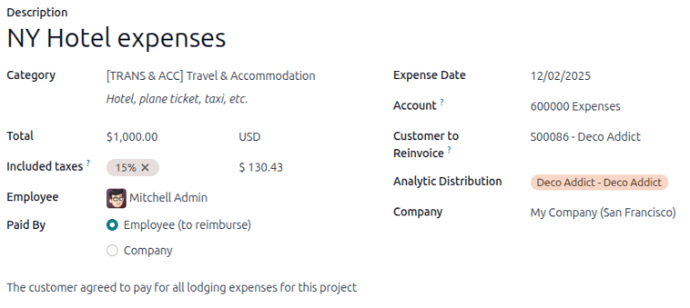
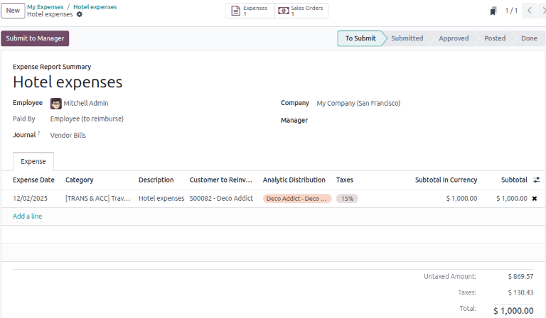
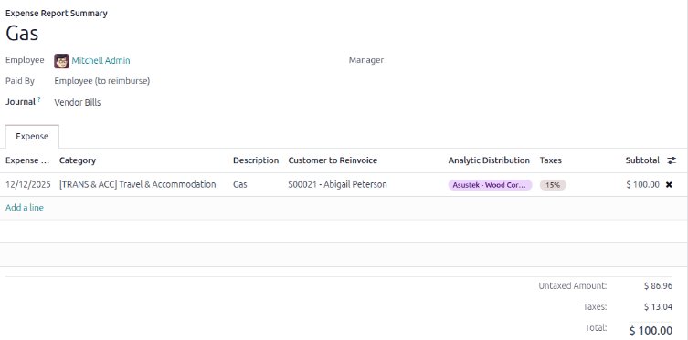
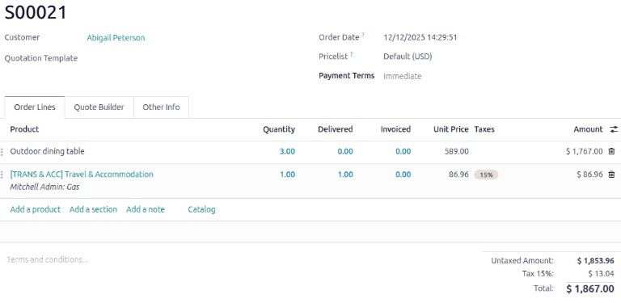

===================
Re-invoice expenses
===================

If expenses are tracked on customer projects, they can be automatically charged back to the
customer. This is done by :ref:`creating an expense <expenses/reinvoice-create>`, referencing the
sales order to which it is added, then :ref:`creating an expense report
<expenses/reinvoice-report>`.

Next, managers :ref:`approve the expense report <expenses/reinvoice-approve>`, before the accounting
department :ref:`posts the journal entries <expenses/reinvoice-approve>`.

Finally, once the expense report is posted to a journal, the expenses appears on the specified
:abbr:`SO (Sales Order)`. The :abbr:`SO (Sales Order)` is then :ref:`invoiced <expenses/reinvoice>`,
thus charging the customer for the expenses.

.. important::
   Approving expenses, posting expenses to accounting, and reinvoicing expenses on :abbr:`SOs (Sales
   Orders)` are **only** possible for users with the appropriate :doc:`access rights
   <../../general/users/access_rights>`.

.. seealso::
   This document provides lower-level instructions to create, submit, approve, and post expenses.
   For fully-detailed instructions for any of these steps, refer to the following documentation:

   - :doc:`Log expenses <log_expenses>`
   - :doc:`Expense reports <expense_reports>`
   - :doc:`Approving expenses <approve_expenses>`
   - :doc:`Posting expenses in accounting <post_expenses>`

Setup
=====

First, specify the invoicing policy for each expense category. Navigate to :menuselection:`Expenses
app --> Configuration --> Expense Categories`. Click on an expense category to view the expense
category form.

Under the :guilabel:`INVOICING` section, click the radio button next to the desired selection for
:guilabel:`Re-Invoice Expenses`:

- :guilabel:`No`: The expense category cannot be re-invoiced.
- :guilabel:`At cost`: The expense category invoices expenses at the cost set on the expense
  category form.
- :guilabel:`Sales price`: The expense category invoices at the sales price set on the expense form.

.. important::

   By default, the :guilabel:`Customer to Reinvoice` field is enabled for the :guilabel:`[TRANS &
   ACC] Travel & Accommodation`, :guilabel:`[COMM] Communication`, :guilabel:`[FOOD] Meals`, and
   :guilabel:`[MIL] Mileage` expense categories.

   It should be noted that **not** all default expense categories installed with the **Expenses**
   application have reinvoicing policies activated. The setting may have to be manually activated.

   To do that, navigate to ::menuselection:`Expenses app --> Configuration --> Expenses Categories`
   to view a list of all expense categories in the database.

   Look in the :guilabel:`Re-Invoice Expenses` column to see which selections have been made for
   each expense category.

   .. image:: reinvoice_expenses/reinvoice-expenses-column.png
      :alt: Sample of Reinvoice Expenses column in the Expenses Categories window.

.. _expenses/reinvoice-create:

Create an expense
=================

To see detailed instructions on completing an expense form, refer to the :doc:`Log expenses
<log_expenses>` page. This section focuses on the information required to reinvoice an expense to an
:abbr:`SO (Sales Order)`.

Navigate to the :guilabel:`Expense app` and click :guilabel:`New` to reveal a blank expense form. On
the expenses form, add a :guilabel:`Description` to reference the expense.

Then, for the :guilabel:`Category` field, select one of the following options from the drop-down
menu:

- **Communication:** any form of communication related to a project/order.
- **Others:** expense that does not fit into any other categories.
- **Meals:** any form of meal costs related to a project/order.
- **Gifts:** any form of gift costs related to a project/order.
- **Mileage:** any form of mileage (gas) costs related to project/order.
- **Travel & Accommodation:** any travel or accommodation costs related to a project/order.

Next, fill in the correct information for the following fields:

- :guilabel:`Total`
- :guilabel:`Included Taxes`
- :guilabel:`Employee`
- :guilabel:`Paid By`
- Optional: :guilabel:`Bill Reference`

The :guilabel:`Expense Date` and :guilabel:`Account` fields are auto-populated, but can be modified
if needed. In the :guilabel:`Customer to Reinvoice` field, use the drop-down menu to select the
:abbr:`SO (Sales Order)` to add the expense to.

.. important::
   Selecting the proper :abbr:`SO (Sales Order)` in the :guilabel:`Customer to Reinvoice` field is
   critical, since this is how expenses are automatically invoiced after an expense report is
   approved.

   The :guilabel:`Customer to Reinvoice` field can be modified only until an expense report is
   approved. After an expense report is approved, the :guilabel:`Customer to Reinvoice` field cannot
   be modified.

Next, select the :guilabel:`Analytic Distribution` the expense is posted to. Multiple accounts can
be selected, if desired.

To add another :guilabel:`Analytic Distribution`, click on the line to reveal the
:guilabel:`Analytic` pop-over window. Click :guilabel:`Add a line`, then select the desired
:guilabel:`Analytic Distribution` from the drop-down field.

If selecting more than one :guilabel:`Analytic Distribution`, the :guilabel:`Percentage` fields
**must** be modified. By default, both fields are populated with `100%`. Adjust the percentages for
all the fields, so the total of all selected accounts equals `100%`.

.. example::
   A painting company agrees to paint an office building that houses two different companies. During
   the estimate, a meeting is held at the office location to discuss the project.

   Both companies agree to pay for the travel expenses for the painting company employees. When
   creating the expenses for the mileage and hotels, **both companies** are listed in the
   :guilabel:`Analytic Distribution` line, for 50% each.

.. _expenses/reinvoice-report:

Create an expense report
========================

For detailed instructions to create and submit a expense report, refer to the :doc:`Expense reports
<expense_reports>` page.

After the expenses are created, click :guilabel:`Create report`. Once the expense report is
submitted, a :icon:`fa-money` :guilabel:`Sales Orders` smart button appears at the top-center of
both the expense report, and each individual expense record being reinvoiced.

Next, click :guilabel:`Submit to Manager` to request approval from the assigned Manager.

.. important::
   Selecting the proper :abbr:`SO (Sales Order)` in the :guilabel:`Customer to Reinvoice` field is
   **critical**, since this is how expenses are automatically invoiced after an expense report is
   approved.

   The :guilabel:`Customer to Reinvoice` field can be modified *only* until an expense report is
   **approved**. After an expense report is approved, the :guilabel:`Customer to Reinvoice` field is
   no longer able to be modified.

.. _expenses/reinvoice-approve:

Approve and post expenses
=========================

For detailed instructions to approve a expense report, refer to the :doc:`Approve expenses
<approve_expenses>` page.

Before approving an expense report, ensure the :guilabel:`Analytic Distribution` section is
populated for every expense line. If an :guilabel:`Analytic Distribution` entry is missing, assign
the correct accounts from the drop-down menu, then click :guilabel:`Approve`.

.. note::
   The :guilabel:`Approve` button **only** appears after an expense report has been :ref:`submitted
   <expenses/submit>`.

The accounting department is typically responsible for :doc:`posting journal entries
<post_expenses>`. To post expenses to an accounting journal, click :guilabel:`Post Journal Entries`.
Once an expense report is approved, it can then be posted.

The :abbr:`SO (Sales Order)` is **only** updated *after* the journal entries are posted. Once the
journal entries are posted, the expenses now appear on the referenced :abbr:`SO (Sales Order)`.

.. _expenses/reinvoice:

Invoice expenses to the customer
================================

Once the expense report is approved and the corresponding journal entries are posted, the :abbr:`SO
(Sales Order)` is automatically updated, allowing the customer can be invoiced. The account
department is typically responsible for generating the final invoice.

Select the desired expense report, and click the :icon:`fa-money` :guilabel:`Sales Orders` smart
button to open the :abbr:`SO (Sales Order)`. The expenses to be re-invoiced now appear on the
:abbr:`SO (Sales Order)`.

.. note::
   More than one :abbr:`SO (Sales Order)` can be referenced on an expense report. If more than one
   :abbr:`SO (Sales Order)` is referenced, clicking the :guilabel:`Sales Orders` smart button opens
   a list displaying all the :abbr:`SOs (Sales Order)` associated with that expense report. Click on
   a :abbr:`SO (Sales Order)` to open the individual :abbr:`SO (Sales Order)` details.

On the :abbr:`SO (Sales Order)` form, the expenses are now line items in the :guilabel:`Order Lines`
tab, with their :guilabel:`Delivered` column filled in, and ready to be invoiced.

Click :guilabel:`Create Invoice`, and a :guilabel:`Create invoices` pop-up window appears.

Select if the invoice is a :guilabel:`Regular invoice`, a :guilabel:`Down payment (percentage)`, or
a :guilabel:`Down payment (fixed amount)`, and click :guilabel:`Create Draft Invoice`. A customer
invoice draft window displays with the products and expensees in the :guilabel:`Invoice Lines` tab.

.. note::
   If the product has not been delivered, then when creating an invoice draft, only the expense is
   listed in the :guilabel:`Invoice Lines` tab. Creating two invoices for one :abbr:`SO (Sales
   Order)` is possible.

Click :guilabel:`Confirm` to change the invoice status from :guilabel:`Draft` to :guilabel:`Posted`.

To email the invoice to the customer, click :guilabel:`Send & Print`. A document layout
configuration pop-up window appears for layout customization.

Click :guilabel:`Save`, and a pop-up window with a preconfigured email message and a PDF invoice in
its body displays. The message can be reviewed and modified, if needed.

Click :guilabel:`Send & Print` to email the invoice to the customer. The pop-up window disappears,
and Odoo sends the invoice to the customer. Additionally, a PDF of the invoice is automatically
downloaded for record-keeping and/or printing purposes.

Invoice payment
===============

On the :guilabel:`Customer Invoice`, click :guilabel:`Register Payment` when the customer pays for
the invoiced expense.`

A :guilabel:`Pay` pop-up window appears, and the necessary fields are auto-populated with the
correct information. After reviewing the information, click :guilabel:`Create Payment`.

A green :guilabel:`In Payment` banner appears in the upper-right corner of the invoice, indicating
that the invoice is paid in full.

A :guilabel:`Payments` smart button displays at the top of the form. Click :guilabel:`Payments` to
go to the :guilabel:`Pay` form. Click :guilabel:`Validate` to confirm the invoice is paid for in
full. Thus, completing the workflow.

