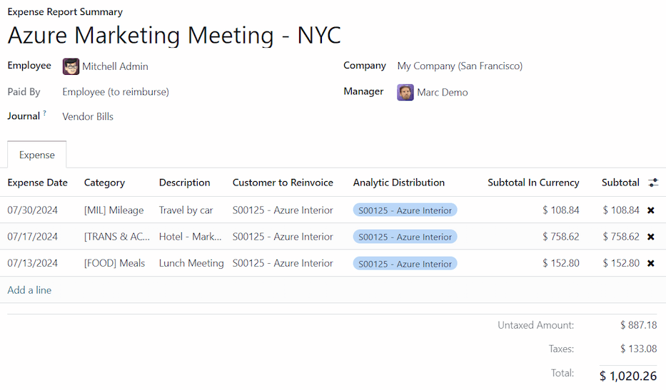
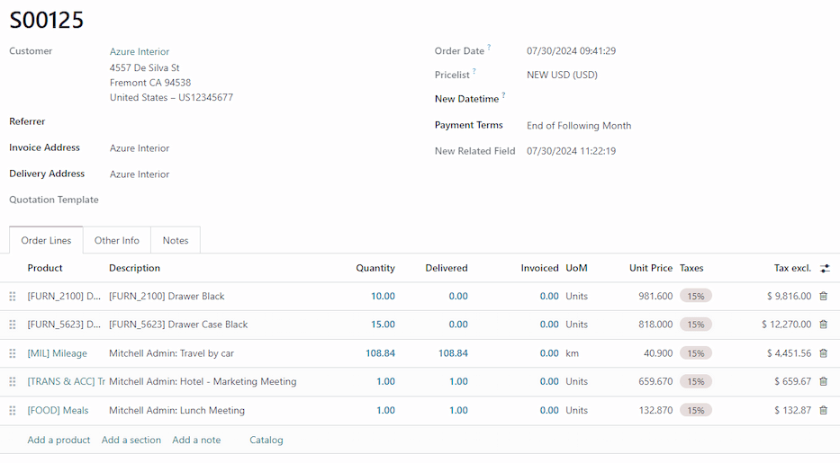

===================
Re-invoice expenses
===================

If expenses are tracked on customer projects, they can be automatically charged back to the
customer. This is done by :ref:`creating an expense <expenses/reinvoice-create>`, referencing the
sales order the expense is added to, and then :ref:`creating an expense report
<expenses/reinvoice-report>`.

Next, managers :ref:`approve the expense report <expenses/reinvoice-approve>`, before the accounting
department :ref:`posts the journal entries <expenses/reinvoice-approve>`.

Finally, once the expense report is posted to a journal, the expenses appears on the specified
:abbr:`SO (Sales Order)`. The :abbr:`SO (Sales Order)` is then :ref:`invoiced <expenses/reinvoice>`,
thus charging the customer for the expenses.

.. important::
   Approving expenses, posting expenses to accounting, and reinvoicing expenses on :abbr:`SOs (Sales
   Orders)` is **only** possible for users with the appropriate :doc:`access rights
   <../../general/users/access_rights>`.

.. seealso::
   This document provides lower-level instructions for the creation, submission, approval, and
   posting of expenses. For fully-detailed instructions for any of these steps, refer to the
   following documentation:

   - :doc:`Log expenses <../expenses/log_expenses>`
   - :doc:`Expense reports <../expenses/expense_reports>`
   - :doc:`Approving expenses <../expenses/approve_expenses>`
   - :doc:`Posting expenses in accounting <../expenses/post_expenses>`

Setup
=====

First, specify the invoicing policy for each expense category. Navigate to :menuselection:`Expenses
app --> Configuration --> Expense Categories`. Click on an expense category to view the expense
category form. Under the :guilabel:`INVOICING` section, click the radio button next to the desired
selection for :guilabel:`Re-Invoice Expenses`:

- :guilabel:`No`: The expense category cannot be re-invoiced.
- :guilabel:`At cost`: The expense category invoices expenses at the cost set on the expense
  category form.
- :guilabel:`Sales price`: The expense category invoices at the sales price set on the expense form.

.. _expenses/reinvoice-create:

Create an expense
=================

First, when :doc:`creating a new expense <../expenses/log_expenses>`, the correct information needs
to be entered to re-invoice the expense to a customer. Using the drop-down menu, select the
:abbr:`SO (Sales Order)` to add the expense to in the :guilabel:`Customer to Reinvoice` field.

Next, select the :guilabel:`Analytic Distribution` the expense is posted to. Multiple accounts can
be selected, if desired.

To add another :guilabel:`Analytic Distribution`, click on the line to reveal the
:guilabel:`Analytic` pop-over window. Click :guilabel:`Add a line`, then select the desired
:guilabel:`Analytic Distribution` from the drop-down field. If selecting more than one
:guilabel:`Analytic Distribution`, the :guilabel:`Percentage` fields **must** be modified. By
default, both fields are populated with `100%`. Adjust the percentages for all the fields, so the
total of all selected accounts equals `100%`.

.. example::
   A painting company agrees to paint an office building that houses two different companies. During
   the estimate, a meeting is held at the office location to discuss the project.

   Both companies agree to pay for the travel expenses for the painting company employees. When
   creating the expenses for the mileage and hotels, **both companies** are listed in the
   :guilabel:`Analytic Distribution` line, for 50% each.

.. _expenses/reinvoice-report:

Create an expense report
========================

After the expenses are created, the expense report must be :ref:`created <expenses/create_report>`
and :ref:`submitted <expenses/submit>`, in the same manner as all other expenses.

Once the expense report is submitted, a :icon:`fa-money` :guilabel:`Sales Orders` smart button
appears at the top-center of both the expense report, and each individual expense record being
reinvoiced.

.. image:: reinvoice_expenses/reinvoice-expense.png
   :align: center
   :alt: Ensure the customer to be invoiced is called out on the expense.

.. important::
   Selecting the proper :abbr:`SO (Sales Order)` in the :guilabel:`Customer to Reinvoice` field is
   **critical**, since this is how expenses are automatically invoiced after an expense report is
   approved.

   The :guilabel:`Customer to Reinvoice` field can be modified *only* until an expense report is
   **approved**. After an expense report is approved, the :guilabel:`Customer to Reinvoice` field is
   no longer able to be modified.

.. _expenses/reinvoice-approve:

Approve and post expenses
=========================

Before :doc:`approving an expense report <../expenses/approve_expenses>`, ensure the
:guilabel:`Analytic Distribution` section is populated for every expense line.

If an :guilabel:`Analytic Distribution` entry is missing, assign the correct accounts from the
drop-down menu, then click :guilabel:`Approve`.

.. note::
   The :guilabel:`Approve` button **only** appears after an expense report has been :ref:`submitted
   <expenses/submit>`.

The accounting department is typically responsible for :doc:`posting journal entries
<../expenses/post_expenses>`. To post expenses to an accounting journal, click :guilabel:`Post
Journal Entries`. Once an expense report is approved, it can then be posted.

The :abbr:`SO (Sales Order)` is **only** updated *after* the journal entries are posted. Once the
journal entries are posted, the expenses now appear on the referenced :abbr:`SO (Sales Order)`.

.. _expenses/reinvoice:

Invoice expenses
================

After the expense report has been approved, and the journal entries have been posted, the :abbr:`SO
(Sales Order)` is updated, and the customer can be invoiced.

Select the expense report, and click the :icon:`fa-money` :guilabel:`Sales Orders` smart button to
open the :abbr:`SO (Sales Order)`. The expenses to be re-invoiced now appear on the :abbr:`SO (Sales
Order)`.

.. note::
   More than one :abbr:`SO (Sales Order)` can be referenced on an expense report. If more than one
   :abbr:`SO (Sales Order)` is referenced, clicking the :guilabel:`Sales Orders` smart button opens
   a list displaying all the :abbr:`SOs (Sales Order)` associated with that expense report. Click on
   a :abbr:`SO (Sales Order)` to open the individual :abbr:`SO (Sales Order)` details.

The expenses are listed in the :abbr:`SO (Sales Order)` :guilabel:`Order Lines` tab.

Next, click :guilabel:`Create Invoice`, and a :guilabel:`Create invoices` pop-up window appears.
Select if the invoice is a :guilabel:`Regular invoice`, a :guilabel:`Down payment (percentage)`, or
a :guilabel:`Down payment (fixed amount)`. Then, click :guilabel:`Create Draft Invoice`. Doing so
creates a draft invoice for the customer. Click :guilabel:`Confirm` to confirm the invoice, and the
customer is invoiced for the expenses.
