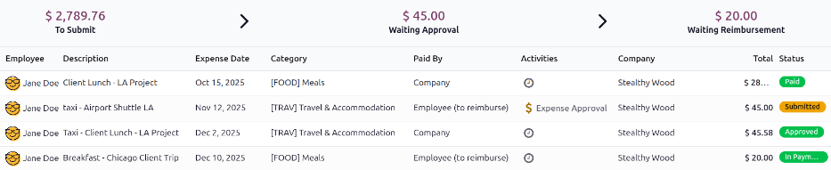
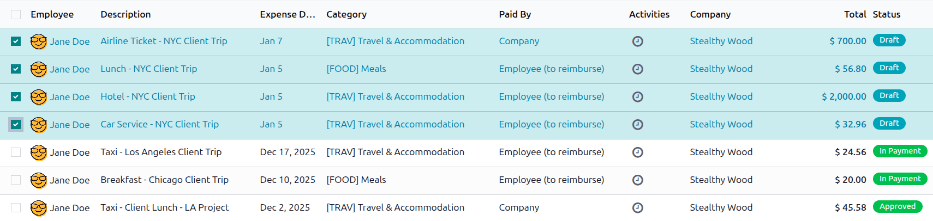

===============
Submit expenses
===============

When expenses have been :doc:`logged <log_expenses>` the next step is to submit them for approval,
so the expenses can then be reimbursed.

.. _expenses/my_expenses:

My expenses dashboard
=====================

Open the **Expenses** app, which displays the :guilabel:`My Expenses` dashboard, by default.
Alternatively, navigate to :menuselection:`Expenses app --> My Expenses --> My Expenses`.

All expenses are color-coded by status. Any expense with a status of :guilabel:`Draft` (expenses
that have been created but not submitted) appears in blue text. For all other statuses
(:guilabel:`Submitted`, :guilabel:`Approved`, and :guilabel:`Refused`), the text appears in black.

Above the list of expenses is the total monetary value of all expenses waiting to be submitted,
waiting for approval, or waiting for reimbursement. Expenses with a status of :guilabel:`Draft` are
used to calculate the amount in the :guilabel:`To Submit` field, expenses with a status of
:guilabel:`Submitted` are used to calculate the :guilabel:`Waiting Approval` amount, and expenses
with a status of :guilabel:`Approved` are used to calculate the :guilabel:`Waiting Reimbursement`
total.

.. important::
   While any expense can be selected from the :guilabel:`My Expenses` list, the :guilabel:`Submit`
   button is *only* visible when expenses with a status of :guilabel:`Draft` are selected. If any
   other status of expense is selected, the :guilabel:`Submit` button does **not** appear.

.. tip::
   Another way to select all expenses with a :guilabel:`Draft` status is to click into the search
   bar and select :guilabel:`To Submit` in the :icon:`fa-filter` :guilabel:`Filters` column, then
   click the checkbox next to :guilabel:`Employee`.

Submit expense records
======================

On the :ref:`My Expenses <expenses/my_expenses>` dashboard, select the desired expenses to be
submitted on the :guilabel:`My Expenses` dashboard by clicking the checkbox next to each entry.

Once the expenses have been selected, click the :guilabel:`Submit` button.

