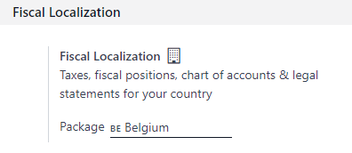

:show-content:

====================
Fiscal localizations
====================

.. _fiscal_localizations/packages:

Fiscal localization packages
============================

**Fiscal Localization Packages** are country-specific modules that install pre-configured taxes,
fiscal positions, chart of accounts, and legal statements on your database. Some additional
features, such as the configuration of specific certificates, are also added to your Accounting app,
following your fiscal administration requirements.

.. note::
   Odoo continuously adds new localizations and improves the existing packages.

Configuration
-------------

Odoo automatically installs the appropriate package for your company, according to the country
selected at the creation of the database.

.. important::
   As long as you haven't posted any entry, you can still select another package.

To select a fiscal localization package for your company, go to :menuselection:`Accounting -->
Configuration --> Settings --> Fiscal Localization`, select the appropriate package from the list
and save.

Use
---

These packages require you to fine-tune your chart of accounts according to your needs, activate the
taxes you use, and configure your country-specific statements and certifications.

.. seealso::
   - :doc:`accounting/get_started/chart_of_accounts`
   - :doc:`accounting/taxes`

.. _fiscal_localizations/countries-list:

List of supported countries
===========================

Odoo Accounting can be used in many countries out of the box by installing the appropriate module.
Here is a list of all :ref:`fiscal localization package <fiscal_localizations/packages>` that are
available on Odoo.

- Algeria - Accounting
- :doc:`Argentina - Accounting <fiscal_localizations/argentina>`
- :doc:`Australian - Accounting <fiscal_localizations/australia>`
- :doc:`Austria - Accounting <fiscal_localizations/austria>`
- :doc:`Belgium - Accounting <fiscal_localizations/belgium>`
- Bolivia - Accounting
- :doc:`Brazilian - Accounting <fiscal_localizations/brazil>`
- Canada - Accounting
- :doc:`Chile - Accounting <fiscal_localizations/chile>`
- China - Accounting
- :doc:`Colombia - Accounting <fiscal_localizations/colombia>`
- Costa Rica - Accounting
- Croatia - Accounting (RRIF 2012)
- Czech - Accounting
- Denmark - Accounting
- Dominican Republic - Accounting
- :doc:`Ecuadorian - Accounting <fiscal_localizations/ecuador>`
- :doc:`Egypt - Accounting <fiscal_localizations/egypt>`
- Ethiopia - Accounting
- Finnish Localization
- :doc:`France - Accounting <fiscal_localizations/france>`
- Generic - Accounting
- :doc:`Germany <fiscal_localizations/germany>`

  - Germany SKR03 - Accounting
  - Germany SKR04 - Accounting

- Greece - Accounting
- Guatemala - Accounting
- Honduras - Accounting
- :doc:`Hong Kong - Accounting <fiscal_localizations/hong_kong>`
- Hungarian - Accounting
- :doc:`Indian - Accounting <fiscal_localizations/india>`
- :doc:`Indonesian - Accounting <fiscal_localizations/indonesia>`
- Ireland - Accounting
- Israel - Accounting
- :doc:`Italy - Accounting <fiscal_localizations/italy>`
- Japan - Accounting
- :doc:`Kenya - Accounting <fiscal_localizations/kenya>`
- Lithuania - Accounting
- :doc:`Luxembourg - Accounting <fiscal_localizations/luxembourg>`
- Maroc - Accounting
- :doc:`Mexico - Accounting <fiscal_localizations/mexico>`
- Mongolia - Accounting
- :doc:`Netherlands - Accounting <fiscal_localizations/netherlands>`
- New Zealand - Accounting
- Norway - Accounting
- OHADA - Accounting
- Pakistan - Accounting
- Panama - Accounting
- :doc:`Peru - Accounting <fiscal_localizations/peru>`
- :doc:`Philippines - Accounting <fiscal_localizations/philippines>`
- Poland - Accounting
- Portugal - Accounting
- :doc:`Romania - Accounting <fiscal_localizations/romania>`
- :doc:`Saudi Arabia - Accounting <fiscal_localizations/saudi_arabia>`
- :doc:`Singapore - Accounting <fiscal_localizations/singapore>`
- Slovak - Accounting
- Slovenian - Accounting
- South Africa - Accounting
- :doc:`Spain - Accounting (PGCE 2008) <fiscal_localizations/spain>`
- Sweden - Accounting
- :doc:`Switzerland - Accounting <fiscal_localizations/switzerland>`
- Taiwan - Accounting
- :doc:`Thailand - Accounting <fiscal_localizations/thailand>`
- Turkey - Accounting
- :doc:`United Arab Emirates - Accounting <fiscal_localizations/united_arab_emirates>`
- :doc:`UK - Accounting <fiscal_localizations/united_kingdom>`
- Ukraine - Accounting
- :doc:`United States - Accounting <fiscal_localizations/united_states>`
- :doc:`Uruguay - Accounting <fiscal_localizations/uruguay>`
- Venezuela - Accounting
- :doc:`Vietnam - Accounting <fiscal_localizations/vietnam>`

.. toctree::
   :titlesonly:

   fiscal_localizations/argentina
   fiscal_localizations/australia
   fiscal_localizations/austria
   fiscal_localizations/belgium
   fiscal_localizations/brazil
   fiscal_localizations/chile
   fiscal_localizations/colombia
   fiscal_localizations/ecuador
   fiscal_localizations/egypt
   fiscal_localizations/france
   fiscal_localizations/germany
   fiscal_localizations/hong_kong
   fiscal_localizations/india
   fiscal_localizations/indonesia
   fiscal_localizations/italy
   fiscal_localizations/kenya
   fiscal_localizations/luxembourg
   fiscal_localizations/mexico
   fiscal_localizations/netherlands
   fiscal_localizations/romania
   fiscal_localizations/peru
   fiscal_localizations/philippines
   fiscal_localizations/saudi_arabia
   fiscal_localizations/singapore
   fiscal_localizations/spain
   fiscal_localizations/switzerland
   fiscal_localizations/thailand
   fiscal_localizations/vietnam
   fiscal_localizations/united_arab_emirates
   fiscal_localizations/united_kingdom
   fiscal_localizations/united_states
   fiscal_localizations/uruguay
