=========
Argentina
=========

.. |ARCA| replace:: :abbr:`ARCA (Agencia de Recaudación y Control Aduanero)`
.. |CAE| replace:: :abbr:`CAE (Código de Autorización Electrónico)`
.. |FCE| replace:: :abbr:`FCE (Factura de Crédito Electrónica)`

.. seealso::
   - `Webinar - Localización de Argentina <https://youtu.be/S5xlANeXja0>`_
   - `eCommerce - Localización de Argentina <https://www.youtube.com/watch?v=5gUi2WWfRuI>`_
   - `Smart Tutorial - Localización de Argentina
     <https://www.odoo.com/slides/smart-tutorial-localizacion-de-argentina-130>`_
   - :doc:`Documentation on e-invoicing's legality and compliance in Argentina
     <../accounting/customer_invoices/electronic_invoicing/argentina>`

.. _localizations/argentina/modules:

Modules
=======

The following modules related to the Argentinian localization are available:

.. list-table::
   :header-rows: 1
   :widths: 25 25 50

   * - Name
     - Technical name
     - Description
   * - :guilabel:`Argentina - Accounting`
     - `l10n_ar`
     - Default :ref:`fiscal localization package <fiscal_localizations/packages>`, which represents
       the minimal configuration to operate in Argentina under the |ARCA| regulations and
       guidelines.
   * - :guilabel:`Argentinean Accounting Reports`
     - `l10n_ar_reports`
     - VAT Book report and VAT summary report.
   * - :guilabel:`Argentinean Electronic Invoicing`
     - `l10n_ar_edi`
     - Includes all technical and functional requirements to generate electronic invoices via web
       service, based on |ARCA| regulations.
   * - :ref:`Argentinean eCommerce <localizations/argentina/ecommerce-electronic-invoicing>`
     - `l10n_ar_website_sale`
     - (optional) Allows the user to see Identification Type and |ARCA| Responsibility in the
       eCommerce checkout form to create electronic invoices.
   * - :ref:`Argentina - Payment Withholdings <localizations/argentina/payment-withholdings>`
     - `l10n_ar_withholding`
     - Allows registering withholdings during the payment of an invoice.

.. note::
   The localization's core modules are installed automatically with the localization. The rest can
   be manually :doc:`installed </applications/general/apps_modules>`.

.. _localizations/argentina/loc-review:

Localization overview
=====================

The Argentinian localization package ensures compliance with Argentinian fiscal and accounting
regulations. It includes tools for managing taxes, fiscal positions, reporting, and a predefined
chart of accounts tailored to Argentina's standards.

The Argentinian localization package provides the following key features to ensure compliance with
local fiscal and accounting regulations:

- :ref:`Chart of accounts <localizations/argentina/chart-accounts>`: a predefined structure tailored
  to Argentinian accounting standards
- :ref:`Taxes <localizations/argentina/taxes>`: pre-configured tax rates, including standard VAT,
  zero-rated, and exempt options
- :doc:`../accounting/taxes/fiscal_positions`: automated tax adjustments based on customer or
  supplier registration status
- :ref:`Reporting <localizations/argentina/reporting>`

.. _localizations/argentina/chart-accounts:

Chart of accounts
-----------------

Three distinct :doc:`chart of accounts <../accounting/get_started/chart_of_accounts>` packages are
available when :ref:`configuring the Argentinian fiscal localization
<fiscal_localizations/packages>`. The choice of package depends on the company’s |ARCA|
responsibility type and reflects the different levels of fiscal complexity required:

- :guilabel:`Monotributista` (227 accounts): Generic chart of accounts Argentina single taxpayer /
  basis
- :guilabel:`Exento` (290 accounts): Argentine generic chart of accounts for exempt individuals
- :guilabel:`Responsable Inscripto` (298 accounts): Argentine generic chart of accounts for
  registered accountants.

.. _localizations/argentina/taxes:

Taxes
-----

As part of the localization module, taxes are created automatically with their related financial
account and configuration, e.g., 73 taxes for :guilabel:`Responsable Inscripto`.

Argentina has several tax types; the most common ones are:

- :guilabel:`VAT`: Regular VAT with various percentages.
- :guilabel:`Perception`: Advance payment of a tax that is applied to invoices.
- :guilabel:`Retention`: Advance payment of a tax that is applied to payments.

Some Argentinian taxes are not commonly used for all companies, and are therefore labeled as
inactive in Odoo by default. Before creating a new tax, check that the tax is not already included
and labeled inactive.

.. _localizations/argentina/document-types:

Document types
--------------

In some Latin American countries, like Argentina, accounting transactions such as invoices and
vendor bills are classified by document types defined by the governmental fiscal authorities. In
Argentina, the `ARCA <https://www.arca.gob.ar/>`__ is the governmental fiscal authority that
defines such transactions.

The document type is an essential piece of information that must be clearly displayed in printed
reports, invoices, and journal entries that list account moves.

Each document type can have a unique sequence per journal where it is assigned. As part of the
localization, the document type includes the country where the document is applicable (this data
is created automatically when the localization module is installed).

The required information about :guilabel:`Document Types` is included by default, so no further
configuration is necessary in the :guilabel:`Document Types` view.

.. note::
   The list displayed below is not exhaustive and does not include all available document types.

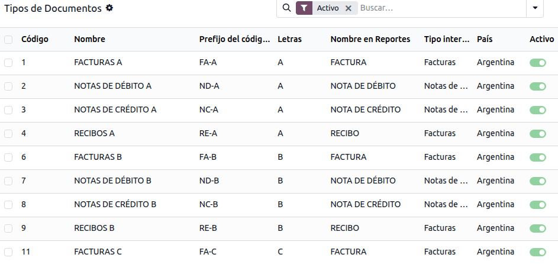

.. tip::
   Several :guilabel:`Document Types` are inactive by default, but can be activated as needed.

.. _localizations/argentina/letters:

Letters
~~~~~~~

For Argentina, the :guilabel:`Document Types` include a letter that helps indicate the type of
transaction or operation. For example, when an invoice is related to a(n):

- :guilabel:`B2B transaction`, a document type :guilabel:`A` must be used.
- :guilabel:`B2C transaction`, a document type :guilabel:`B` must be used.
- :guilabel:`Exportation Transaction`, a document type :guilabel:`E` must be used.

The documents included in the localization already have the correct letter associated with each
:guilabel:`Document Type`, and no further configuration is necessary.

.. _localizations/argentina/doc-types-invoices:

Use on invoices
~~~~~~~~~~~~~~~

The :guilabel:`Document Type` on each transaction will be determined by:

- The journal entry related to the invoice (if the journal uses documents).
- The conditions applied depend on the issuer and receiver types (e.g., the buyer's and vendor's
  fiscal regime types).

.. _localizations/argentina/journals:

Journals
--------

In the Argentinian localization, the :doc:`journal <../accounting/get_started/journals>` can have
a different approach depending on its usage and internal type. To configure journals, go to
:menuselection:`Accounting --> Configuration --> Journals`.

For sales and purchase journals, the :guilabel:`Use Documents` option can be activated, enabling
:ref:`Document Types <localizations/argentina/document-types>` to be linked to invoices and
vendor bills.

If the sales or purchase journals do not have the :guilabel:`Use Documents` option activated, they
will not be able to generate fiscal invoices, limiting their use case mostly to monitoring account
moves related to internal control processes.

.. _localizations/argentina/journals-arca:

ARCA information (ARCA Point of Sale)
~~~~~~~~~~~~~~~~~~~~~~~~~~~~~~~~~~~~~

The :guilabel:`ARCA POS System` is a field that defines the type of ARCA POS to be used to manage
the transactions for which the journal is created.

The ARCA POS defines the following:

- The sequences of document types related to the web service.
- The structure and data of the electronic invoice file.

.. _localizations/argentina/journals-web-services:

Web services
************

**Web services** help generate invoices for different purposes. Below are a few options to choose
from in the :guilabel:`ARCA POS System` field:

- :guilabel:`wsfev1: Electronic Invoice`: The most common service, used to generate invoices for
  document types A, B, C, M, with no item detail.
- :guilabel:`wsbfev1: Electronic Fiscal Bond`: For those who invoice capital goods and wish to
  benefit from the `Electronic Tax Bonds <https://www.argentina.gob.ar/acceder-un-bono-por-fabricar-bienes-de-capital>`_
  granted by the Ministry of Economy.
- :guilabel:`wsfexv1: Export Voucher`: Used to generate invoices for international customers and
  transactions involving export processes; the related document type is type E.

Here are some useful fields to know when working with web services:

- :guilabel:`ARCA POS Number`: The number configured in |ARCA| to identify the operations related to
  this ARCA POS.
- :guilabel:`ARCA POS Address`: The field related to the commercial address registered for the POS,
  which is usually the same address as the company. For example, if a company has multiple stores
  (fiscal locations), then |ARCA| will require the company to have one ARCA POS per location. This
  location will appear on the invoice report.

In ARCA, when configuring the electronic invoicing data, the following should be configured:

- Monotributista: Factura Electrónica – Monotributo - WebServices
- Exento: Facturación Electrónica - exento en IVA - WebServices
- Responsable Inscripto: RECE para aplicativo y WebServices

.. _localizations/argentina/journals-sequence:

Sequences
~~~~~~~~~

For the first invoice, Odoo automatically synchronizes with ARCA and displays the last sequence
used.

.. note::
   When creating :guilabel:`Purchase Journals`, specify if they are related to document types. When
   the :guilabel:`Use Documents` option is activated, there is no need to manually associate
   document type sequences, since the vendor provides the document number.

.. _localizations/argentina/reporting:

Reporting
---------

As part of the localization installation, financial :doc:`reporting <../accounting/reporting>` for
Argentina is available in the :guilabel:`Accounting` dashboard. To access these reports, navigate to
:menuselection:`Accounting --> Reporting`, and select the relevant report in the
:guilabel:`Argentinean Statements` section.

To access the VAT book report, go to :menuselection:`Accounting --> Reporting --> Tax Report`, click
:icon:`fa-book` :guilabel:`Report:`, and select :guilabel:`VAT book (AR)`.

.. note::
   Click the :icon:`fa-cog` :guilabel:`(cog)` icon and select :guilabel:`VAT Book (ZIP)` or
   :guilabel:`VAT Simple Report (ZIP)` to generate the VAT Book or VAT Simple report ZIP file,
   respectively.

.. _localizations/argentina/vat-summary:

VAT summary
~~~~~~~~~~~

This pivot table displays the monthly VAT totals. This report is for internal use and is not sent to
the ARCA. To access it, go to :menuselection:`Accounting --> Reporting --> VAT Summary`.

.. _localizations/argentina/iibb-sales:

IIBB - Sales by jurisdiction
~~~~~~~~~~~~~~~~~~~~~~~~~~~~

This pivot table displays the gross income for each jurisdiction. It serves as an affidavit for the
corresponding taxes due, but is not submitted to the ARCA. To access it, go to
:menuselection:`Accounting --> Reporting --> IIBB Sales by jurisdiction`.

.. _localizations/argentina/iibb-purchases:

IIBB - Purchases by jurisdiction
~~~~~~~~~~~~~~~~~~~~~~~~~~~~~~~~

This pivot table displays the gross purchases for each jurisdiction. It serves as an affidavit for
the corresponding taxes due, but is not submitted to the ARCA. To access it, go to
:menuselection:`Accounting --> Reporting --> IIBB --> Purchases by jurisdiction`.

.. _localizations/argentina/company:

Company
=======

Once the localization modules are installed, the first step is to set up the :ref:`company's record
<general/companies/configuration>`. In addition to the basic information, make sure to complete the
Argentina-specific field, :guilabel:`ARCA Responsibility Type`, to define the company's fiscal
obligation and structure.

.. _localizations/argentina/contact:

Contacts
========

.. _localizations/argentina/contact-id-vat:

Identification type and VAT
---------------------------

As part of the Argentinian localization, identification types defined by |ARCA| are available in the
:doc:`contact form <../../essentials/contacts>`. Information is essential for most transactions.
Seven :guilabel:`Identification Types` are available by default, as well as 32 inactive types.

.. note::
   The complete list of :guilabel:`Identification Types` defined by |ARCA| is included in Odoo,
   but only the common ones are active.

.. _localizations/argentina/contact-arca:

ARCA responsibility type
------------------------

In Argentina, the document type and corresponding transactions associated with customers and
vendors are defined by the :guilabel:`ARCA Responsibility Type`. This field should be defined in the
:doc:`contact form <../../essentials/contacts>`.

.. _localizations/argentina/e-invoicing:

E-invoicing
===========

.. _localizations/argentina/e-invoicing-config:

Configuration
-------------

.. _localizations/argentina/e-invoicing-environment:

Environment
~~~~~~~~~~~

The ARCA infrastructure is replicated across two separate environments, **testing** and
**production**.

Testing is provided so companies can test their databases until they are ready to move to the
production environment. As these two environments are completely isolated from each other, the
digital certificates issued in one instance are not valid in the other.

To select a database environment, go to :menuselection:`Accounting --> Configuration --> Settings`,
scroll down to the :guilabel:`Argentinean Localization` section, and choose either
:guilabel:`Testing` (Prueba) or :guilabel:`Production` (Produccion).

.. _localizations/argentina/e-invoicing-ARCA:

ARCA certificates
~~~~~~~~~~~~~~~~~

The electronic invoice and other |ARCA| services use the :guilabel:`Web Services (WS)` provided by
|ARCA|.

To enable communication with |ARCA|, follow these steps to request a :guilabel:`Digital
Certificate` if you do not already have one:

#. Go to :menuselection:`Accounting --> Configuration --> Settings` and scroll down to the
   :guilabel:`Argentinean Localization` section.
#. **Generate renewal request**: In the :guilabel:`ARCA Web Services` section, click
   :icon:`oi-arrow-right` :guilabel:`Generate Renewal Request` to generate a `.csr` (certificate
   signing request) file to use in the |ARCA| portal to request the certificate.
#. **Obtain certificate (ARCA)**: Access the |ARCA| portal and follow the instructions described in
   `this document <https://drive.google.com/file/d/17OKX2lNWd1bjUt3NxfqcCKBkBh-Xlpo-/view>`_ to get
   a certificate.
#. **Upload certificate and add private key (Odoo)**: To upload the certificate into Odoo, click the
   :icon:`oi-arrow-right` :guilabel:`(Internal link)` icon next to the :guilabel:`Certificate` field
   and select the corresponding file. Then add the existing private key that was created after
   clicking :guilabel:`Generate Renewal Request`.

.. tip::
   - When a created certificate expires, click :guilabel:`Generate Renewal Request` to generate a
     new certificate.
   - If you need to configure the Homologation Certificate, refer to the `official ARCA
     documentation <http://www.arca.gob.ar/ws/documentacion/certificados.asp>`_. It is possible to
     test electronic invoicing locally without a Homologation Certificate; the following message
     appears in the chatter when testing locally:

     .. image:: argentina/local-testing.png
        :alt: Invoice validated locally because it is in a testing environment without testing
              certificate/keys.

.. _localizations/argentina/accounting:

Accounting
==========

.. _localizations/argentina/invoice:

Invoices
--------

The information below applies to invoice creation once the contacts and journals are created and
properly configured.

.. note::
   To handle invoice adjustments or corrections, :ref:`credit notes
   <accounting/credit_notes/issue-credit-note>` and :ref:`debit notes
   <accounting/credit_notes/issue-debit-note>` can also be created.

.. _localizations/argentina/doc-type-assignation:

Document type assignation
~~~~~~~~~~~~~~~~~~~~~~~~~

When the partner is selected, the :guilabel:`Document Type` field will be filled in automatically
based on the :ref:`ARCA document type <localizations/argentina/document-types>`:

- **Invoice for a customer IVA Responsable Inscripto, prefix A** is the type of document that shows
  all the taxes in detail, along with the customer's information.

  .. image:: argentina/prefix-a-invoice-for-customer.png
     :alt: Invoice for a customer IVA Responsable Inscripto, prefix A.

- **Invoice for an end customer, prefix B** is the type of document that does not detail taxes,
  since the taxes are included in the total amount.

  .. image:: argentina/prefix-b-invoice-for-end-customer.png
     :alt: Invoice for an end customer, prefix B.

- **Exportation Invoice, prefix E** is the type of document used when exporting goods that shows
  the incoterm.

  .. image:: argentina/prefix-e-exporation-invoice.png
     :alt: Exportation Invoice, prefix E

Even though some invoices use the same journal, the prefix and sequence are given by the
:guilabel:`Document Type` field.

The most common :guilabel:`Document Type` will be automatically defined for different combinations
of :ref:`ARCA responsibility type <localizations/argentina/contact-arca>`, but it can be updated
manually before confirming the invoice.

.. _localizations/argentina/e-invoice-elements:

Electronic invoice elements
~~~~~~~~~~~~~~~~~~~~~~~~~~~

When using electronic invoices, if all information is correct, the invoice is posted in the standard
way unless an error needs to be addressed. Error messages indicate both the issue that needs
attention and a proposed solution. If an error persists, the invoice remains in draft until the
issue is resolved.

Once the invoice is posted, the information related to |ARCA| appears on the invoice, and the
:guilabel:`Result` field indicates if the invoice has been :guilabel:`Aceptado en ARCA` or
:guilabel:`Aceptado con Observaciones`.

In the :guilabel:`ARCA` tab, the following authorization information is displayed:

- :guilabel:`ARCA authorization`: |CAE| number
- :guilabel:`Authorization Due date`: deadline to deliver the invoice to the customers (normally 10
  days after the |CAE| is generated)

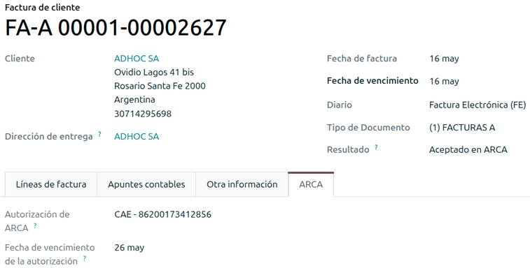

.. _localizations/argentina/invoice-taxes:

Invoice taxes
~~~~~~~~~~~~~

Based on the :guilabel:`ARCA Responsibility Type`, the VAT tax can apply differently on the PDF
report:

- :guilabel:`Tax excluded`: In this case the taxed amount must be clearly identified in the report.
  This condition applies when the customer's :guilabel:`ARCA Responsibility type` is
  :guilabel:`Responsable Inscripto`.
- :guilabel:`Tax amount included`: This means that the taxed amount is included as part of the
  product price, subtotal, and totals. This condition applies when the customer has the following
  :guilabel:`ARCA Responsibility type`:

  - :guilabel:`IVA Sujeto Exento`
  - :guilabel:`Consumidor Final`
  - :guilabel:`Responsable Monotributo`
  - :guilabel:`IVA liberado`

.. _localizations/argentina/invoices-special-cases:

Special use cases
~~~~~~~~~~~~~~~~~

.. _localizations/argentina/invoices-services:

Invoices for services
*********************

For electronic invoices that include :guilabel:`Services`, |ARCA| requires reporting the service
start and end dates. To do so, fill in the :guilabel:`Service Date` field in the :guilabel:`Other
Info` tab.

.. note::
   If the dates are not selected manually before the invoice is validated, the values will be
   automatically set to the first and last days of the invoice's month.

.. _localizations/argentina/exportation-invoices:

Exportation invoices
********************

Invoices related to :guilabel:`Exportation Transactions` require a journal using |ARCA| POS
System :guilabel:`Export Voucher - Web Service` to ensure the correct document types are associated.

When the customer selected in the invoice is configured with an |ARCA| responsibility type
:guilabel:`Cliente / Proveedor del Exterior` - :guilabel:`Ley N° 19.640`, Odoo automatically
assigns the:

- :guilabel:`Journal`: related to the exportation Web Service
- Exportation :guilabel:`Document Type`
- Exempt Taxes

In the :guilabel:`Other Info` tab:

- :guilabel:`Invoice` section - :guilabel:`ARCA Concept`: Products / Definitive export of goods
- :guilabel:`Accounting` section - :guilabel:`Fiscal position`: Compras/Ventas al exterior

.. note::
   For exportation documents, complete the :guilabel:`Incoterm` field in the :guilabel:`Accounting`
   section of the :guilabel:`Other Info` tab.

.. _localizations/argentina/fiscal-bond:

Fiscal bond
***********

The :guilabel:`Electronic Fiscal Bond` is used by those who invoice capital goods and wish to
benefit from the `Electronic Tax Bonds <https://www.argentina.gob.ar/acceder-un-bono-por-fabricar-bienes-de-capital>`_
granted by the Ministry of Economy.

For these transactions, it is important to consider the following requirements:

- Currency (according to the parameter table) and invoice quotation
- Taxes
- Zone
- Detail each item

  - Code according to the Common Nomenclator of Mercosur (NCM)
  - Complete description
  - Unit Net Price
  - Quantity
  - Unit of measurement
  - Bonus
  - VAT rate

.. _localizations/argentina/electronic-credit-invoice:

Electronic credit invoice MiPyme (FCE)
**************************************

For SME invoices, several document types are classified as **MiPyME**, also known as **Electronic
Credit Invoice** (|FCE| in Spanish). This classification develops a mechanism that improves
financing conditions for small and medium-sized businesses and allows them to increase productivity
by collecting early on credits and receivables issued to their clients and/or vendors.

For these transactions, it is important to consider the following requirements:

- Specific document types (201, 202, 206, etc).
- The emitter should be eligible for MiPyME transactions via |ARCA|.
- The amount should be larger than 100,000 ARS.
- A bank account type CBU must be associated with the emitter; otherwise, the invoice cannot be
  validated, with an error message such as the following:

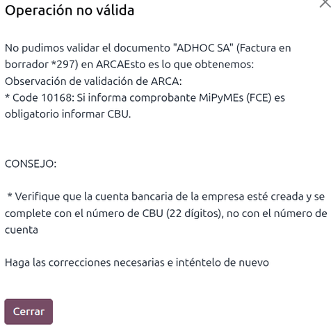

To set up the :guilabel:`Transmission Mode`, go to :menuselection:`Accounting --> Configuration -->
Settings` and scroll down to the :guilabel:`Argentinean Localization` section. Then, in the
:guilabel:`Default MiPyME FCE Transmission Option` section, select either:

- :guilabel:`SCA - TRANSFERENCIA AL SISTEMA DE CIRCULACION ABIERTA`
- :guilabel:`ADC - AGENTE DE DEPOSITO COLECTIVO`

.. note::
   - To change the transmission mode, access the related invoice form and, in the :guilabel:`Other
     Info` tab, update the :guilabel:`FCE: Transmission Mode` field in the :guilabel:`Invoice`
     section before confirming the invoice.
   - Changing the :guilabel:`Transmission Mode` on a specific invoice does not change the
     transmission mode selected in :guilabel:`Settings`.

When creating a :guilabel:`Credit/Debit` note related to an |FCE| document:

- Use the :guilabel:`Credit Note` and :guilabel:`Debit Note` buttons in the related invoice form to
  transfer all information from the invoice to the new credit or debit note.
- The document letter should match the originator document (either A or B).
- The same currency as the source document must be used. When using a secondary currency, there is
  an exchange difference if the currency rate differs between the emission date and the payment
  date. Create a credit/debit note to decrease/increase the amount to pay in ARS.

When creating a credit note, there are two scenarios:

#. The |FCE| is rejected; then, the credit note should have the :guilabel:`FCE: is Cancellation?`
   option enabled, or
#. The credit note is created to annul the |FCE| document; then, the :guilabel:`FCE: is
   Cancellation?` option must be disabled.

.. _localizations/argentina/invoice-printed-report:

Invoice printed report
~~~~~~~~~~~~~~~~~~~~~~

The :guilabel:`PDF Report` for electronic invoices validated by |ARCA| includes a QR code at the
bottom of the page, which represents the |CAE| number. The expiration date is also displayed, as it
is a legal requirement.

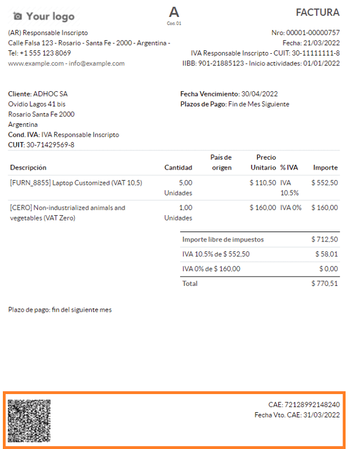

.. _localizations/argentina/troubleshooting:

Troubleshooting and auditing
~~~~~~~~~~~~~~~~~~~~~~~~~~~~

For auditing and troubleshooting purposes, detailed information can be obtained for an invoice
number previously sent to |ARCA|. To retrieve this information, follow these steps:

#. Activate the :ref:`developer mode <developer-mode>`.
#. Go to :menuselection:`Accounting --> Accounting --> Consult Invoice in ARCA`.
#. In the :guilabel:`Consult invoice in ARCA` window, select the relevant :guilabel:`Journal`,
   :guilabel:`Document Type`, and :guilabel:`Number`. Then, click :guilabel:`Get Invoice Detail`.

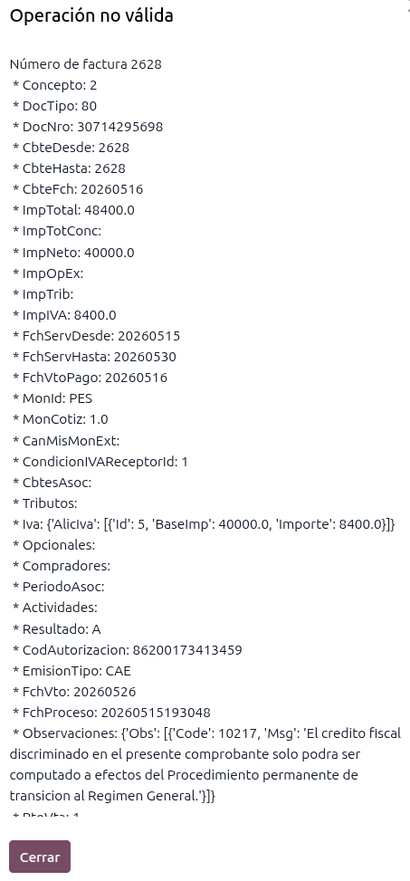

.. tip::
   To retrieve the last number used in ARCA for a specific :guilabel:`Document Type` and POS
   :guilabel:`Number` and use this reference for any potential issues with the sequence
   synchronization between Odoo and ARCA, select :guilabel:`Get Last Invoice` as the
   :guilabel:`Type`.

.. _localizations/argentina/vendor-bills:

Vendor bills
------------

Based on the selected purchase journal for the vendor bill, the :guilabel:`Document Type` field is
now required. This value is auto-populated based on the :ref:`ARCA Responsibility Type
<localizations/argentina/contact-arca>` of Issuer and Customer, but it can be changed if necessary.

The :guilabel:`Document Number` field must be entered manually, and the format will be validated
automatically. However, if the format is invalid, an error message indicates the expected format.

The vendor bill number is structured the same way as customer invoices, except that the document
sequence is entered by the user in the following format: `Document Prefix - Letter - Document
Number`.

.. _localizations/argentina/validate-vendor-bill:

Validate vendor bill number in ARCA
~~~~~~~~~~~~~~~~~~~~~~~~~~~~~~~~~~~

As most companies have internal controls to verify that the vendor bill is related to a valid |ARCA|
document, an automatic validation can be set.

To do so, go to :menuselection:`Accounting --> Configuration --> Settings`, scroll down to the
:guilabel:`Argentinean Localization` section, then set one of the following options under
:guilabel:`Verify Vendor Bills validity in ARCA`:

- :guilabel:`Not available:` No verification is performed (this is the default value).
- :guilabel:`Available:` Verification is performed. If the number is invalid, a warning is displayed
  but the vendor bill can still be posted.
- :guilabel:`Required:` Verification is performed. The vendor bill can only be posted if the number
  is valid.

.. _localizations/argentina/validate-bill-odoo:

Validate vendor bills in Odoo
*****************************

Once the :ref:`vendor bill validation settings are enabled
<localizations/argentina/validate-vendor-bill>`, click :guilabel:`Verify on ARCA` in the
:guilabel:`Authorization code` field.

If the vendor bill cannot be validated in ARCA, the status is updated to :guilabel:`Rejected`
in the :guilabel:`Authorization code` field, and the details are recorded in the chatter.

.. _localizations/argentina/vendor-bill-special-cases:

Special use cases
~~~~~~~~~~~~~~~~~

.. _localizations/argentina/untaxed-concept:

Untaxed concepts
****************

Some transactions include items that are not part of the VAT base amount, such as fuel and gasoline
invoices.

The vendor bill will be recorded using one item for each product that is part of the VAT base
amount, and an additional item to register the amount of the exempt concept.

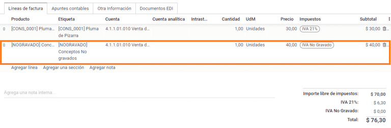

.. _localizations/argentina/perception-taxes:

Perception taxes
****************

The vendor bill will be recorded using one item for each product that is part of the VAT base
amount, and the perception tax can be added to any of the product lines. As a result, there will be
one tax group for the VAT and another for the perception. The perception default value is always
:guilabel:`0.10`.

To edit the VAT perception and set the correct amount, you should use the :guilabel:`Pencil` icon
next to the :guilabel:`Perception` amount. After the VAT perception amount has been set, the invoice
can be validated.

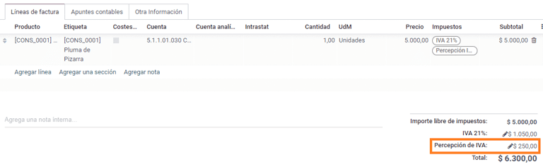

.. _localizations/argentina/payment-withholdings:

Withholding management
----------------------

.. note::
   Make sure the :guilabel:`Argentina Payment Withholdings` (`l10n_ar_withholding`) module is
   :ref:`installed <general/install>`.

The Argentinian fiscal localization module contains the necessary withholding records, which can be
seen by navigating to :menuselection:`Accounting --> Configuration --> Taxes` and removing the
default :guilabel:`Sale or Purchase` filter.

Journal entries are *not* created when payments are posted unless :ref:`outstanding accounts
<accounting/journals/outstanding-accounts>` are set up. Thus, for this feature to work properly, it
is important to verify that *all* payment methods within the bank journals have an outstanding
payment and receipt account set.

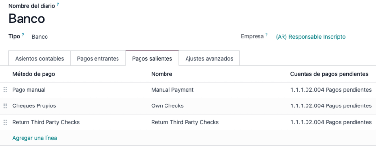

This configuration is crucial for the proper accounting of withholding transactions with clients
and vendors.

.. note::
   In Argentina, withholdings represent the cancellation of a specific portion of the total debt
   owed to a supplier or a reduction in the total payment to be collected from a customer.
   Therefore, one or multiple withholdings can be recorded for each payment applied to an invoice.

.. _localizations/argentina/withholdings-configuration:

Configuration
~~~~~~~~~~~~~

While Odoo already creates most of the required withholdings inside the :guilabel:`Taxes` menu, in
several cases it is necessary to apply or modify configurations to correctly calculate the
withholding amount on vendor payments. The following withholding types are available:

- :ref:`Earnings <localizations/argentina/earnings-withholdings>`
- :ref:`Earnings Scale <localizations/argentina/earnings-scale-withholdings>`
- :ref:`IIBB Total Amount <localizations/argentina/iib-total-amount-withholdings>`
- :ref:`IIBB Non-Taxable <localizations/argentina/iib-nontax-withholdings>`

.. _localizations/argentina/earnings-withholdings:

Earnings
********

For :guilabel:`Earnings` withholdings, Odoo already has a record for each regime group, which is
listed under the tax name and the |ARCA| code.

Each of these records is ready to be used. As a best practice, the configuration should be
double-checked to make sure it is updated and well-applied. The fields to validate are:

- :guilabel:`Amount`: This is the percentage of the total payment amount which is withheld.
- :guilabel:`Non-Taxable Amount`: Up to this amount, the withholding does not apply.
- :guilabel:`Minimum Withholding`: If the calculated withholding amount is smaller than this value,
  the total withholding amount is set to `0.0`.
- :guilabel:`Withholding Sequence`: This field automates the capture of a withholding number under
  the payment line. If this field is not set, a number is manually captured while adding a
  withholding to a payment.

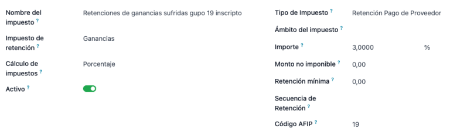

.. _localizations/argentina/earnings-scale-withholdings:

Earnings Scale
**************

In this particular case, a percentage does not need to be set. Instead, this withholding is
calculated based on the value of the :guilabel:`Scale` field.

To view, modify, or create new scales, navigate to :menuselection:`Accounting --> Configuration -->
Earnings Scale`. By default, the Argentinian localization is preconfigured with two main scales.
However, scales should be created and updated as necessary to suit a business's needs.

.. note::
   Earnings scales are cumulative, which means that Odoo keeps track of the different records
   created for a bill and automatically calculates the correct withholding amount.

.. _localizations/argentina/iib-total-amount-withholdings:

IIBB Total Amount
*****************

In this case, the necessary records related to the applicable province must be created. The
withholding amount is calculated based on the percentage :guilabel:`Amount` set on the tax
configuration. Since Odoo does not automatically synchronize the percentages applicable to each
province, this information must be manually updated.

The recommendation, in this case, is to always duplicate and apply the different configurations to
each record to safeguard technical configurations that allow the proper calculation and accounting
of the withholding.

.. _localizations/argentina/iib-nontax-withholdings:

IIBB Untaxed
************

The configuration of non-taxable gross income withholdings is very similar to that of a :ref:`total
amount withholding <localizations/argentina/iib-total-amount-withholdings>`, so the percentage
:guilabel:`Amount` in each record must be maintained. However, Odoo comes preconfigured with several
records that apply to different provinces. The difference, in this case, is that it is not necessary
to establish a non-taxable amount or minimum withholding for this record type.

.. _localizations/argentina/partner-withholding-assign:

Partner withholding assignation
~~~~~~~~~~~~~~~~~~~~~~~~~~~~~~~

Once the proper configuration is set on each possible withholding for partners, the applicable
withholdings must be assigned to each contact. To do this, open the Contacts app and select the
desired partner. In the :guilabel:`Accounting` tab, find the :guilabel:`Purchase
Withholdings` table.

By using the additional fields :guilabel:`From Date` and :guilabel:`To Date`, the applicability of
multiple withholdings can be automated across different date ranges. The :guilabel:`ref` field
allows you to apply an internal control number to each withholding line, which is just for internal
reference, so it does not affect any transactions and is not visible on them. These fields are
accessible from the :icon:`oi-settings-adjust` :guilabel:`(adjust settings)` menu.

- :guilabel:`From Date`: The start of the withholding date range.
- :guilabel:`To Date`: The end of the withholding date range.
- :guilabel:`ref`: Apply an internal control number to each withholding line that is only visible
  for internal reference and does not affect any transactions.

.. _localizations/argentina/auto-withholding-calculation:

Automatic withholding calculation and application per payment
~~~~~~~~~~~~~~~~~~~~~~~~~~~~~~~~~~~~~~~~~~~~~~~~~~~~~~~~~~~~~

By applying new payments to vendor bills, Odoo automatically applies and calculates the proper
withholding into the payment. Based on the record's configuration, it may be necessary to use a
reference number for each withholding line.

More withholdings can be added, or computed withholdings can be edited if necessary.

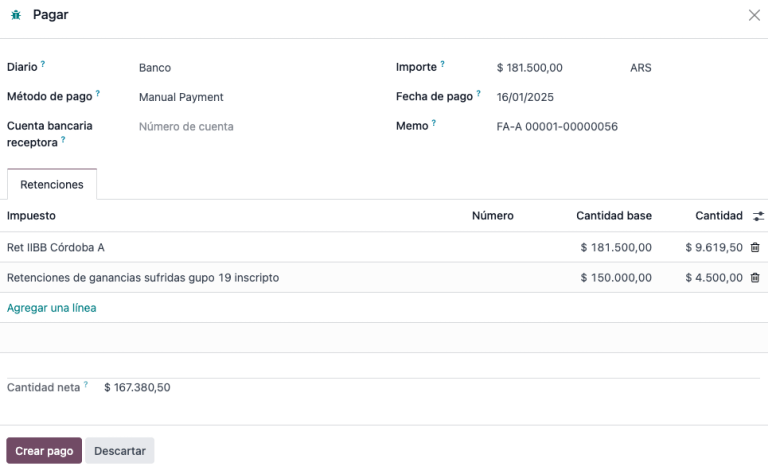

.. important::
   The amount of the debt to be cancelled equals the total payment amount. However, Odoo
   still captures the net amount (i.e., the amount to be reconciled with the bank), which will be
   represented as the payment amount after the withholding application.

   .. image:: argentina/l10n-ar-payment-registered.png
      :alt: Payment registered form.

.. _localizations/argentina/check-management:

Check management
----------------

.. note::
   Make sure to :ref:`install <general/install>` the :guilabel:`Third Party and Deferred/Electronic
   Checks Management` (`l10n_latam_check`) module.

This module enables the required configuration for journals and payments to:

- Create, manage, and control your different types of checks.
- Optimize the management of *own checks* and *third-party checks*.
- Have an easy and effective way to manage expiration dates for your own and third-party checks.

Once all the configurations are set for the Argentinian electronic invoice flow, it is also needed
to complete certain configurations for the own checks and third-party checks flows.

.. _localizations/argentina/own-checks:

Own checks
~~~~~~~~~~

Configure the bank journal used to create your own checks by going to :menuselection:`Accounting -->
Configuration --> Journals`, selecting the bank journal, and opening the :guilabel:`Outgoing
Payments` tab.

- :guilabel:`Checks` should be available as a :guilabel:`Payment Method`. If not, click
  :guilabel:`Add a line` and type `Checks` under :guilabel:`Payment Method` to add them.
- Enable the :guilabel:`Use electronic and deferred checks` setting.

.. note::
   This last configuration disables the printing ability but:

   - allows check numbers to be entered manually
   - adds a field to indicate the payment date of the check

.. _localizations/argentina/own-checks-management:

Management of own checks
************************

Own checks can be created directly from the vendor bill. For this process, click :guilabel:`Register
Payment`.

In the :guilabel:`Pay` window, select the bank journal from which the payment is to be made and set
the :guilabel:`Check Cash-In Date` and :guilabel:`Amount`.

.. note::
   To manage current checks, the :guilabel:`Check Cash-In Date` field must be left blank or filled
   in with the current date. To manage deferred checks, the :guilabel:`Check Cash-In Date` must be
   set in the future.

To manage your existing own checks, navigate to :menuselection:`Accounting --> Vendors --> Own
Checks`. This window displays critical information, including the dates checks must be paid, the
total number of checks, and the total amount paid in checks.

It is important to note that the list is pre-filtered by checks that are still *not reconciled* with
a bank statement - that were not yet debited from the bank - which can be verified with the
:guilabel:`Is Matched with a Bank Statement` field. If you want to see all of your own checks,
delete the :guilabel:`No Bank Matching` filter by clicking on the :guilabel:`X` symbol.

.. _localizations/argentina/own-check-cancel:

Cancel an own check
*******************

To cancel an own check created in Odoo, navigate to :menuselection:`Accounting --> Vendors --> Own
Checks` and select the check to be cancelled, then click :guilabel:`Void Check`. This breaks the
reconciliation between vendor bills and bank statements, leaving the check marked as
:guilabel:`Cancelled`.

.. _localizations/argentina/third-party-checks:

Third-party checks
~~~~~~~~~~~~~~~~~~

To register payments with third-party checks, two specific journals must be configured. To do so,
navigate to :menuselection:`Accounting --> Configuration --> Journals` and create two new journals:

- `Third-Party Checks`
- `Rejected Third-Party Checks`

.. note::
   You can manually create additional journals if you have multiple points of sale and need journals
   for those.

To create the *Third-Party Checks* journal, click :guilabel:`New` and configure the following:

- Type `Third-Party Checks` as the :guilabel:`Journal Name`.
- Select :guilabel:`Cash` as :guilabel:`Type`.
- In the :guilabel:`Journal Entries` tab, set :guilabel:`Cash Account`: to `1.1.1.02.010 Cheques de
  Terceros`, input a :guilabel:`Short Code` of your choice, and select a :guilabel:`Currency`.

The available payment methods are listed in the :guilabel:`Payments` tab:

- For new incoming third-party checks, click :guilabel:`Add a line` in the :guilabel:`Incoming
  Payments` tab and select :guilabel:`New Third Party Checks`. This method is used to create *new*
  third-party checks.
- For incoming and outgoing existing third-party checks, click :guilabel:`Add a line` in the
  :guilabel:`Incoming Payments` tab and  select :guilabel:`Existing Third Party Checks`. Repeat the
  same step for the :guilabel:`Outgoing Payments` tab. This method is used to receive and/or pay
  vendor bills using already *existing* checks, as well as for internal transfers.

.. tip::
   You can delete pre-existing payment methods that appear by default when configuring third-party
   check journals.

The *Rejected Third-Party Checks* journal must also be created and/or configured. This journal is
used to manage rejected third-party checks and can be used to send checks rejected at the
time of collection or upon receipt from vendors.

To create the *Rejected Third-Party Checks* journal, click :guilabel:`New` and configure the
following:

- Type `Rejected Third Party Checks` as the :guilabel:`Journal Name`
- Select :guilabel:`Cash` as :guilabel:`Type`
- In the :guilabel:`Journal Entries` tab, set :guilabel:`Cash Account`: to `1.1.1.01.002 Rejected
  Third Party Checks`, input a :guilabel:`Short Code` of your choice, and select a
  :guilabel:`Currency`.

Use the same payment methods as the *Third-Party Checks* journal.

.. _localizations/argentina/new-third-party-checks:

New third-party checks
**********************

To register a *new* third-party check for a customer invoice, click :guilabel:`Register Payment`. In
the pop-up window, select :guilabel:`Third-Party Checks` as the journal for the payment
registration.

Select :guilabel:`New Third Party Checks` as :guilabel:`Payment Method`, and fill in the
:guilabel:`Check Number`, :guilabel:`Payment Date`, and :guilabel:`Check Bank`. Optionally, you can
manually add the :guilabel:`Check Issuer Vat`, but this field is automatically filled with the
customer's VAT number as it appears on the invoice.

.. _localizations/argentina/existing-third-party-checks:

Existing third-party checks
***************************

To pay a vendor bill with an *existing* check, click :guilabel:`Register Payment`. In the pop-up
window, select :guilabel:`Third Party Checks` as the journal for the payment registration.

Select :guilabel:`Existing Third Party Checks` as :guilabel:`Payment Method`, and select a check
from the :guilabel:`Check` field. The field shows all **available existing checks** to be used as
payment for vendor bills.

When an **existing third-party check** is used, you can review the operations related to it. For
example, you can see if a third-party check made to pay a customer invoice was later used as an
existing third-party check to pay a vendor bill.

To do so, either go to :menuselection:`Accounting --> Customers --> Third Party Checks` or
:menuselection:`Accounting --> Vendors --> Own Checks`, depending on the case, and click on a check.
In the :guilabel:`Check Current Journal` field, click on :guilabel:`=> Check Operations` to bring up
the check's history and movements.

The menu also displays critical information related to these operations, such as:

- The :guilabel:`Payment Type`, allowing to classify whether it is a payment *sent* to a vendor or a
  payment *received* from a customer
- The :guilabel:`Journal` in which the check is currently registered
- The **partner** associated with the operation (either customer or vendor).

.. _localizations/argentina/liquidity:

Liquidity product direct sales
------------------------------

Liquidity product direct sales are used for sales involving third parties. For such
sales, the seller and the proprietary company of the goods can each register their corresponding
sales and purchases.

.. note::
   :ref:`Install <general/install>` the :guilabel:`Argentinean Electronic Invoicing` module
   (`l10n_ar_edi`) to use this feature.

.. _localizations/argentina/liquidity-configuration:

Configuration
~~~~~~~~~~~~~

.. _localizations/argentina/liquidity-purchase-journal:

Purchase journal
****************

A purchase journal is needed to generate an electronic vendor bill with a document type *Liquidity
Product*. This journal must be synchronized with |ARCA|, as it will be used to generate the
electronic document for the liquidity product.

To modify the existing purchase journal or create a new one, navigate to :menuselection:`Accounting
--> Configuration --> Journals`. Then, select the existing purchase journal or click
:guilabel:`New`, and fill in the following required information:

- :guilabel:`Type`: Select :guilabel:`Purchase`.
- :guilabel:`Use Documents`: Check this field to select the electronic document type.
- :guilabel:`Is ARCA POS?`: Check this field to generate electronic documents. Three additional
  fields appear:

  - :guilabel:`ARCA POS System`: Select :guilabel:`Electronic Invoice - Web Service` from the
    drop-down menu to send the electronic document to |ARCA| via web service.
  - :guilabel:`ARCA POS Number`: The number configured in |ARCA| to identify the operations related
    to this |ARCA| POS.
  - :guilabel:`ARCA POS Address`: The field related to the commercial address registered for the
    POS, which is usually the same address as the company. For example, if a company has multiple
    stores (fiscal locations) then |ARCA| will require the company to have one ARCA POS per
    location. This location will be printed in the invoice report.

.. _localizations/argentina/liquidity-sales-journal:

Sales journal
*************

A sales journal is needed to record the invoice when a product is sold to a third party that will
then sell the same product. This journal will not be synced with |ARCA| as the invoice will not be
electronic.

To modify the existing sales journal or create a new one, navigate to
:menuselection:`Accounting --> Configuration --> Journals`. Then, access the sales journal or click
:guilabel:`New`, and fill in the following required information:

- :guilabel:`Type`: select :guilabel:`Sales`.
- :guilabel:`Use Documents`: check this field on the journal to select the electronic document type
  (in this case, the electronic invoice).

.. _localizations/argentina/liquidity-invoicing-flow:

Invoicing flow
~~~~~~~~~~~~~~

Once all configurations are set, the *Liquidity Product Vendor Bill* will be generated by the
company selling the product on behalf of another party. For example, a distributor of a specific
product.

.. _localizations/argentina/ecommerce-electronic-invoicing:

Ecommerce electronic invoicing
==============================

:ref:`Install <general/install>` the :guilabel:`Argentinean eCommerce` (`l10n_ar_website_sale`)
module to enable the following features and configurations:

- Allow clients to create online accounts for eCommerce purposes.
- Support for required fiscal fields in the eCommerce application.
- Receive payments for sale orders online.
- Generate electronic documents from the eCommerce application.

.. _localizations/argentina/ecommerce-configuration:

Configuration
-------------

Once all configurations for the Argentinian :ref:`electronic invoice
<localizations/argentina/company>` flow are complete, additional configurations must be completed to
integrate the eCommerce flow.

.. _localizations/argentina/ecommerce-client-account:

Client account registration
~~~~~~~~~~~~~~~~~~~~~~~~~~~

To configure your website for client accounts, follow the instructions in the :doc:`checkout
<../../websites/ecommerce/checkout>` documentation.

.. _localizations/argentina/ecommerce-automatic-invoice:

Automatic invoice
~~~~~~~~~~~~~~~~~

To generate electronic documents in the sales process, go to :menuselection:`Website -->
Configuration --> Settings` and enable the :guilabel:`Automatic Invoice` option in the
:guilabel:`Invoicing` section to automatically generate the required electronic documents when the
online payment is confirmed.

.. note::
   Since an online payment must be confirmed for the :guilabel:`Automatic Invoice` feature to
   generate the document, a :doc:`payment provider <../payment_providers>` **must** be configured
   for the related website.

.. _localizations/argentina/ecommerce-products:

Products
~~~~~~~~

To allow your products to be invoiced when an online payment is confirmed, navigate to the desired
product from :menuselection:`Website --> eCommerce --> Products`. In the :guilabel:`General
Information` tab, set the :guilabel:`Invoicing Policy` to :guilabel:`Ordered quantities` and define
the desired :guilabel:`Customer Taxes`.

.. _localizations/argentina/ecommerce-invoicing-flow:

Invoicing flow for eCommerce
----------------------------

Once all configurations mentioned above are set, clients can complete the following required
steps in the *Argentinian eCommerce* flow to enter fiscal fields during checkout.

Fiscal fields are available for input during checkout once the :guilabel:`Country` field is set to
`Argentina`. Entering the fiscal data enables the purchase to be recorded in the corresponding
electronic document.

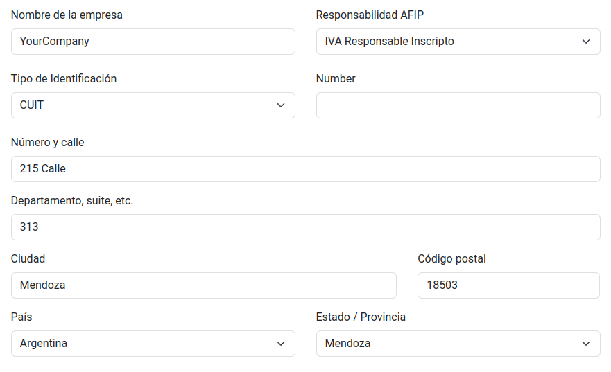

When the client makes a successful purchase and payment, the necessary invoice is generated with
the corresponding layout and fiscal stamps stated in the :ref:`Invoice printed report
<localizations/argentina/invoice-printed-report>`.

.. seealso::
   :doc:`Client account creation <../../websites/ecommerce/checkout>`
