=========
Australia
=========

.. _australia/configuration:

Configuration
=============

.. list-table::
   :widths: 25 25 50
   :header-rows: 1

   * - Module Name
     - Module Key
     - Description
   * - :guilabel:`Australia - Accounting`
     - `l10n_au`
     - Installed by default when the Accounting :guilabel:`Fiscal Localization` package is set to
       :guilabel:`Australia`. This module also installs the :guilabel:`ABA credit transfer` and the
       :guilabel:`Remittance Advice report` module.
   * - :guilabel:`Australian Reports - Accounting`
     - `l10n_au_reports`
     - Includes the :guilabel:`Taxable Payments Annual Reports (TPAR)` and the
       :guilabel:`BAS report`.
   * - :guilabel:`Australia - Payroll`
     - `l10n_au_hr_payroll`
     - Payroll localisation for Australia.
   * - :guilabel:`Australia - Payroll with Accounting`
     - `l10n_au_hr_payroll_account`
     - Installs the link between Australian payroll and accounting. The module also installs the
       modules: :guilabel:`Australian - Accounting`; :guilabel:`Australian Reports - Accounting`;
       and :guilabel:`Australia - Payroll`.
   * - :guilabel:`Accounting Customer Statements`
     - `l10n_account_customer_statements`
     - Allows the management and sending of monthly customer statements from the partner ledger and
       the contact form. Also used in New Zealand.
   * - :guilabel:`Employment Hero Australian Payroll`
     - `l10n_au_keypay`
     - Synchronises all pay runs from Employment Hero with Odoo’s journal entries.

.. _australia/coa:

Chart of Accounts
=================

The Australian chart of accounts is included in the **Australia - Accounting** module. Go to
:menuselection:`Accounting --> Configuration --> Chart of Accounts` to access it.

.. seealso::
   :doc:`../accounting/get_started/chart_of_accounts`

.. _australia/taxes:

Taxes and GST
=============

The default Australian taxes impact the :ref:`BAS Report <australia/bas>`, which can be accessed
through :menuselection:`Accounting --> Reporting --> BAS Report`.

In Australia, the standard **Goods and Services Tax** (GST) rate is 10%, but different rates and
exemptions exist for specific categories of goods and services.

Tax Mapping
-----------

Within the Australian localisation package, tax names encompass the tax rate as an integral part of
their naming convention.

Despite the high amount of taxes in Odoo, these taxes are pretty similar (mostly 0% and 10%), with
different tax grid variations for:

- Goods
- Services
- TPAR
- TPAR without ABN

.. seealso::
   :doc:`Taxes <../accounting/taxes>`

Taxes including a **TPAR** mention impact not only the **BAS** report but also the **TPAR** report.
Businesses from certain industries need to report payments made to subcontractors from relevant
services during the financial year. Odoo combines the use of taxes and fiscal positions to report
these payments on the **TPAR** report. Taxes with the mention **TPAR without ABN** are used to
record amounts withheld from subcontractors without an **ABN** for the **ATO**.

.. seealso::
   :ref:`TPAR <australia/tpar>`

Here are the taxes for Australia in Odoo 17.

.. list-table::
   :widths: 20 40 20 20
   :header-rows: 1

   * - GST Name
     - Description
     - GST Scope
     - GST Type
   * - 10%
     - GST Purchases
     - -
     - Purchases
   * - 10% INC
     - GST Inclusive Purchases
     - -
     - Purchases
   * - 10% C
     - Capital Purchases
     - -
     - Purchases
   * - 0% C
     - Zero Rated Purch
     - -
     - Purchases
   * - 100% T EX
     - Purchase (Taxable Imports) - Tax Paid Separately
     - -
     - Purchases
   * - 10% I
     - Purchases for Input Taxed Sales
     - -
     - Purchases
   * - 10% P
     - Purchases for Private use or not deductible
     - -
     - Purchases
   * - 100% EX
     - GST Only on Imports
     - -
     - Purchases
   * - 10% Adj
     - Tax Adjustments (Purchases)
     - -
     - Purchases
   * - 10%
     - GST Sales
     - -
     - Sales
   * - 10% INC
     - GST Inclusive Sales
     - -
     - Sales
   * - 0% EX
     - Zero Rated (Export) Sales
     - -
     - Sales
   * - 0% EXEMPT
     - Exempt Sales
     - -
     - Sales
   * - 0% I
     - Input Taxed Sales
     - -
     - Sales
   * - 10% Adj
     - Tax Adjustments (Sales)
     - -
     - Sales
   * - 10% TPAR
     - GST Purchases
     - Services
     - Purchases
   * - 10% TPAR NO ABN
     - GST Purchases
     - Services
     - Purchases
   * - 10% INC TPAR
     - GST Inclusive Purchases
     - Services
     - Purchases
   * - 10% INC TPAR N ABN
     - GST Inclusive Purchases
     - Services
     - Purchases
   * - 10% C TPAR
     - Capital Purchases
     - Services
     - Purchases
   * - 10% C TPAR N ABN
     - Capital Purchases
     - Services
     - Purchases
   * - 0% C TPAR
     - Zero Rated Purch TPAR
     - Services
     - Purchases
   * - 0% C TPAR N ABN
     - Zero Rated Purch TPAR without ABN
     - Services
     - Purchases
   * - 100% T EX TPAR
     - Purchase (Taxable Imports) - Tax Paid Separately
     - Services
     - Purchases
   * - 100% T EX TPAR N ABN
     - Purchase (Taxable Imports) - Tax Paid Separately
     - Services
     - Purchases
   * - 10% I TPAR
     - Purchases for Input Taxed Sales
     - Services
     - Purchases
   * - 100% I TPAR N ABN
     - Purchases for Input Taxed Sales
     - Services
     - Purchases
   * - 10% P TPAR
     - Purchases for Private use or not deductible
     - Services
     - Purchases
   * - 10% P TPAR N ABN
     - Purchases for Private use or not deductible
     - Services
     - Purchases
   * - 100% EX TPAR
     - GST Only on Imports
     - Services
     - Purchases
   * - 100% EX TPAR N ABN
     - GST Only on Imports
     - Services
     - Purchases
   * - 10% Adj TPAR
     - Tax Adjustments (Purchases)
     - Services
     - Purchases
   * - 10% Adj TPAR N ABN
     - Tax Adjustments (Purchases)
     - Services
     - Purchases
   * - 47% WH
     - Tax Withheld for Partners without ABN
     - Services
     - Purchases

.. _australia/bas:

BAS report
==========

The **Business Activity Statement (BAS)** report is a critical tax reporting requirement for
businesses registered for **Goods and Services Tax (GST)** in Australia. The **BAS** is used to
report and remit various taxes to the **Australian Taxation Office (ATO)**. With the Odoo **BAS**
feature, businesses can report on the following:

- Goods and Services Tax (GST)
- PAYG tax withheld

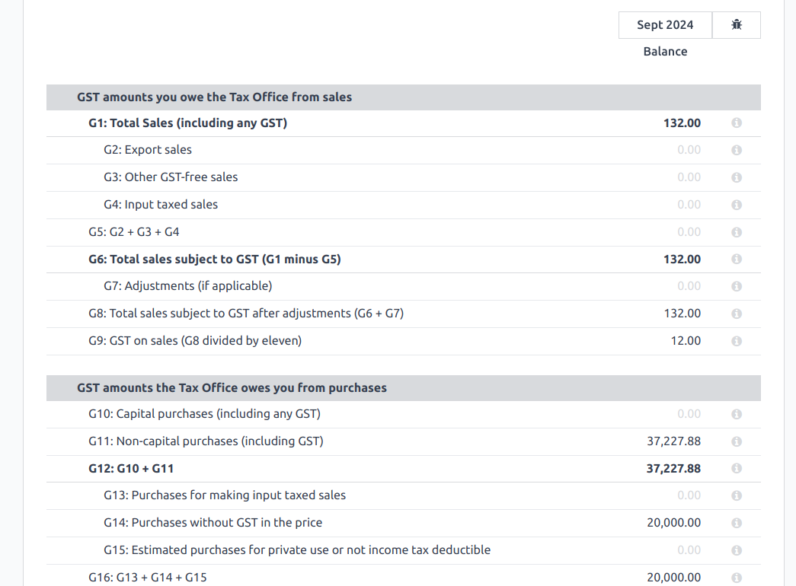

The taxes for GST are collected from the **tax grid**, which is pre-configured in the system. The
**tax grid** can also be manually set up for any additional special GST. Once the tax for each
account is set up, the system automatically slots journal items into the correct tax category. This
ensures the **BAS** report is accurate and reflective of the business's financial activities.

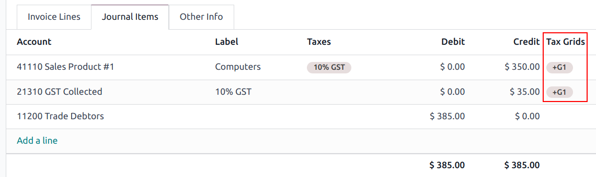

In addition, the **BAS** report includes the **PAYG** tax withheld components (**W1** to **W5**,
then **summary, section 4**). This integration ensures that all payroll-related withholding taxes
are accurately captured and reflected within the report.

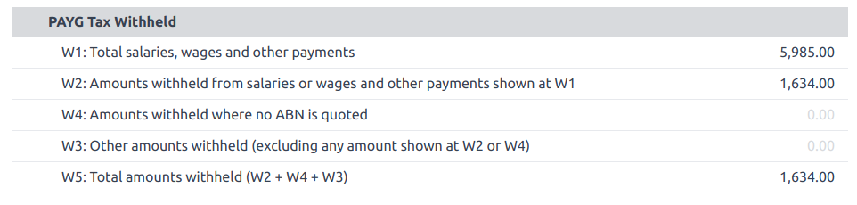

The module incorporates built-in rules that facilitate the automatic calculation of taxes for types
**W1** to **W5**. For a detailed walkthrough and more information on the calculation process for
these taxes, please refer to the Payroll app documentation.

.. seealso::
   :ref:`Payroll <australia/payroll>`

Closing the BAS report
----------------------

When it is time to file the tax return with the **ATO**, click :guilabel:`Closing entry`. The tax
return period can be configured in :menuselection:`configuration --> Settings --> Tax Return
Periodicity`. Also, the start date of the tax return period can be defined through the **period
button** (marked by a calendar icon 📅).

.. seealso::
   :doc:`Year-end closing <../accounting/reporting/year_end>`

.. note::
   Odoo uses the *calendar quarter* rather than the Australian FY quarter, which means **July to
   September is Q3 in Odoo**.

Before closing the entry for the first time, the default **GST payable account** and **GST
receivable account** need to be set. A notification pops up and redirects the user to tax group
configurations.

Once the **GST payable** and **GST receivable** accounts are set up, the **BAS** report generates an
accurate journal closing entry automatically, which balances out the GST balance with the GST
clearing account.

.. image:: australia/bas-report-accounts.png
   :alt: GST accounts for the BAS report in Odoo.

The balance between **GST receivable** and **payable** is set against the tax clearing account
defined on the tax group. The amount to be paid to or received from the **ATO** can be reconciled
against a bank statement.

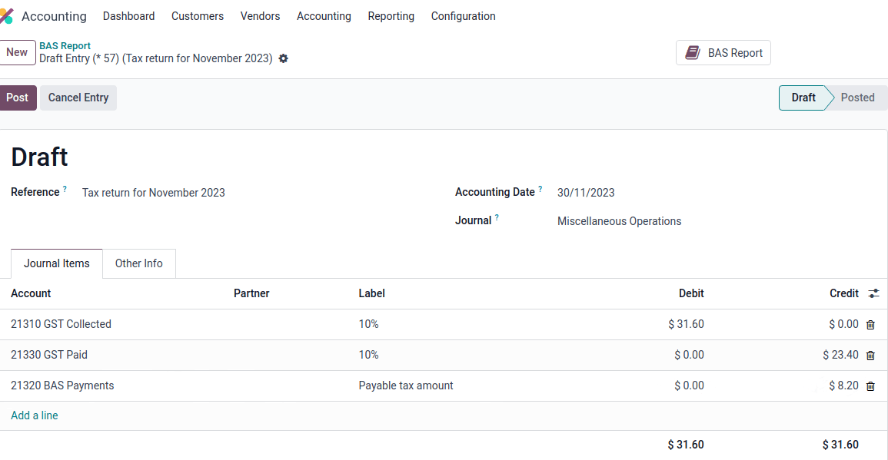

.. important::
   The **BAS** report is not directly submitted to the **ATO**. Odoo helps you automatically compute
   the necessary values in each section, with the possibility to audit them to better understand the
   history behind these numbers. Businesses can copy these values and enter them on the `ATO’s
   portal <https://www.ato.gov.au/newsrooms/small-business-newsroom/lodging-your-next-bas>`_.

.. _australia/tpar:

TPAR report
===========

Odoo allows businesses to report payments made to contractors or subcontractors during the financial
year. This is done by generating a :abbr:`TPAR (Taxable Payments Annual Report)`. If you are unsure
your business needs this report, refer to the documentation provided by the `ATO <https://www.ato.gov.au/businesses-and-organisations/preparing-lodging-and-paying/reports-and-returns/taxable-payments-annual-report>`_.
You can find this report in :menuselection:`Accounting --> Reporting --> Taxable Payments Annual
Reports (TPAR)`.

Configuration
-------------

Under :menuselection:`Accounting --> Customers` or :menuselection:`Accounting --> Vendors`, select a
your contractor and set a :guilabel:`Fiscal Position` under the :guilabel:`Sales & Purchase` tab.

Upon billing a contact with a fiscal position set to :guilabel:`TPAR` or
:guilabel:`TPAR without ABN`, the report is automatically generated in :menuselection:`Accounting
--> Reporting --> Taxable Payments Annual Reports (TPAR)`.

The report includes the **ABN**, **Total GST**, **Gross Paid**, and **Tax Withheld** from their
**TPAR** subcontractors.

- **Total GST**: the total tax paid
- **Gross Paid amounts**: shows after registering a payment for those bills
- **Tax Withheld**: shown if the subcontractor is registered with a fiscal position set to
  :guilabel:`TPAR without ABN`

The **TPAR** report can be exported to PDF, XLSX, and TPAR formats.

.. _australia/customer-statement:

Customer statements
===================

Customer statements allow customers to see their financial transactions with the company over a
certain period, and overdue statement details. These statements can be sent out to customers
by email.

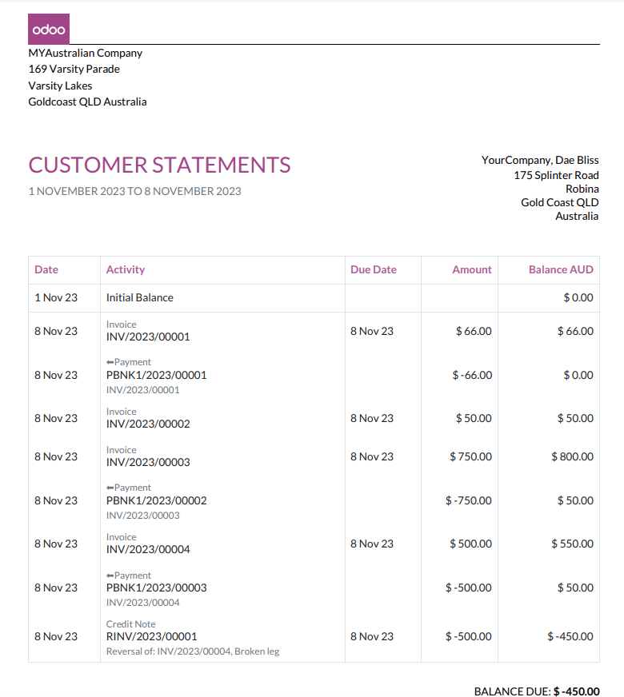

There are **two** ways for customers to download these statements.

#. **From the contact form:** Customer statements are under :menuselection:`Customers -->
   Customers`. Select a customer, click the **gear icon (⚙)**, and then
   :guilabel:`Print Customer Statements`. This prints out the statement from the beginning of the
   month to today's date.

#. **From the partner ledger:** This option allows for more flexibility in selecting a statement's
   start and end date. You can access it by going to :menuselection:`Accounting --> Reporting -->
   Partner Ledger`. From here, specify a date range in the **calendar menu (📅)** for the statement,
   hover over a partner, and click the :guilabel:`Customer Statements` tab.

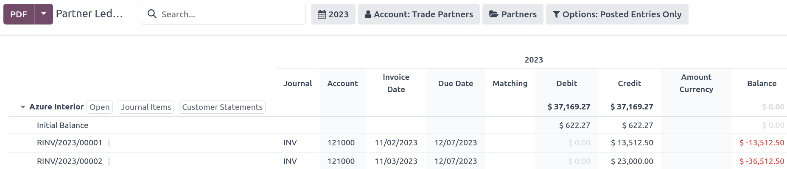

.. _australia/remittance:

Remittance advice
=================

A remittance advice is a document used as proof of payment to a business. In Odoo, it can be
accessed by going to :menuselection:`Accounting ‣ Vendors ‣ Payments`, selecting the payment(s), and
clicking :menuselection:`Print --> Payment Receipt`.

.. _australia/peppol:

E-Invoicing via Peppol
======================

Odoo is compliant with Australia's and New Zealand's `PEPPOL requirements <https://peppol.org/learn-more/country-profiles/australia/>`_.
You can find and set up **electronic invoicing** settings per partner under
:menuselection:`Accounting --> Customers` or :menuselection:`Accounting --> Vendors`, select a
partner, and click the :guilabel:`Accounting` tab.

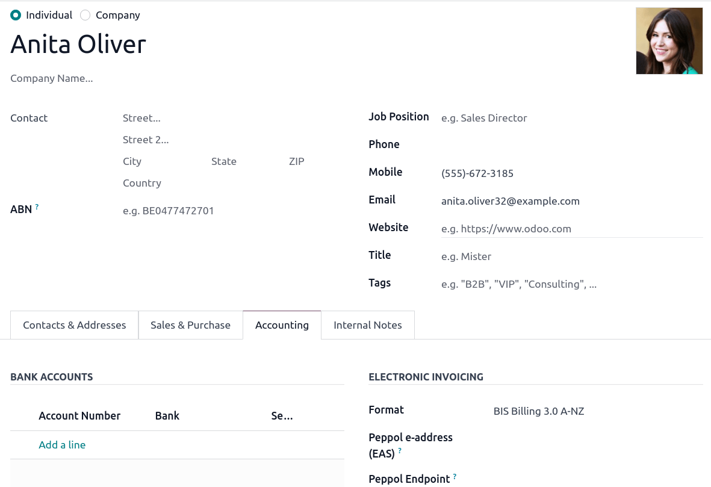

.. important::
   Validating an invoice or credit note for a partner on the PEPPOL network will download a
   compliant XML file that can be manually uploaded to your PEPPOL network.

.. _australia/aba:

ABA files for batch payments
============================

Introduction
------------

An ABA file is a digital format developed by the `Australian Bankers' Association <https://www.ausbanking.org.au/>`_.
It is designed for business customers to facilitate bulk payment processing by uploading a single
file from their business management software.

The main advantage of using ABA files is to improve payment and matching efficiency. This is
achieved by consolidating numerous payments into one file for batch processing, which can be
submitted to all Australian banks.

Configuration
-------------

Settings
~~~~~~~~

To enable **batch payments**, go to :menuselection:`Accounting --> Configuration --> Setting -->
Batch Payment` and enable :guilabel:`Allow Batch Payments`.

Bank journal
~~~~~~~~~~~~

Then, go to :menuselection:`Accounting --> Configuration --> Journals` and select the
:guilabel:`Bank` journal type. In the :guilabel:`Journal Entries` tab, enter the
:guilabel:`Account Number` and click :guilabel:`Create and edit`. In the pop-up window, fill in the
following fields:

- :guilabel:`Bank`
- :guilabel:`Account Holder Name`
- :guilabel:`BSB`
- :guilabel:`Account Holder`

.. important::
   The :guilabel:`Send Money` field must be **enabled**.

.. note::
   The :guilabel:`Currency` field is optional.

Go back to the :guilabel:`Journal Entries` tab and fill in the following fields related to the ABA:

- :guilabel:`BSB`: This field is auto-formatted from the bank account
- :guilabel:`Financial Institution Code`: The official 3-letter abbreviation of the financial
  institution (e.g., WBC for Westpac)
- :guilabel:`Supplying User Name`: 6-digit number provided by your bank. Contact or check your bank
  website if you need to know.
- :guilabel:`Include Self-Balancing Transactions`: Selecting this option adds an additional
   "self-balancing" transaction to the end of the ABA file, which some financial institutions
   require when generating ABA files. Check with your bank to see if you need this option.

Then, go to the :guilabel:`Outgoing Payments` tab on the same :guilabel:`Bank` type journal. Click
:guilabel:`Add a line` and select :guilabel:`ABA Credit Transfer` as the **payment method**.

Partners’ bank accounts
~~~~~~~~~~~~~~~~~~~~~~~

Go to :menuselection:`Accounting --> Customers --> Customers` or :menuselection:`Accounting -->
Vendors --> Vendors` and select a partner for whom you want to add banking information. Once
selected, click the :guilabel:`Accounting` tab, and under the :guilabel:`Bank Accounts` section,
click :guilabel:`Add a line` to fill in:

- :guilabel:`Account Number` of that partner
- :guilabel:`Bank`
- :guilabel:`Account Holder Name`
- :guilabel:`BSB`
- :guilabel:`Accounter Holder`
- :guilabel:`Send Money` defines the bank account as *trusted*, which is essential for ABA files and
  must be enabled if to be used.

Generate an ABA file
--------------------

To generate an **ABA** file, :guilabel:`Create` a vendor bill (manually or from a purchase order).
:guilabel:`Confirm` the bill and ensure the vendor’s banking information is set up correctly before
registering a payment..

Next, click :guilabel:`Register Payment` in the pop-up window: select the :guilabel:`Bank` journal,
select :guilabel:`ABA Credit Transfer` as :guilabel:`Payment Method`, and select the right
:guilabel:`Recipient Bank Account`.

Once payments are confirmed, they appear in :menuselection:`Accounting --> Vendors --> Payments`.
Tick the box of the payments to be included in the batch, then click :guilabel:`Create Batch`.
Verify all information is correct and finally :guilabel:`Validate`. Once validated, the ABA file
becomes available in the **chatter** on the right.

After uploading it to your bank’s portal, an ABA transaction line will appear in your bank feed at
the following bank feed iteration. You will need to reconcile it against the **batch payment** made
in Odoo.

.. seealso::
   :doc:`Batch Payment <../accounting/payments/batch>`

.. _australia/buynow_paylater:

Buy Now, Pay Later solutions
============================

Buy Now, Pay Later solutions are popular payment methods for eShops in Australia. Some of these
solutions are available via the `Stripe <https://stripe.com/en-au/payments/payment-methods>`_ and
`AsiaPay <https://www.asiapay.com.au/payment.html#option>`_ payment providers.

.. seealso::
   - :doc:`AsiaPay Payment Provider <../payment_providers/asiapay>`
   - :doc:`Stripe Payment Provider <../payment_providers/stripe>`

POS terminals for Australia
===========================

If you wish to have a direct connection between Odoo and your PoS terminal in Australia, you *must*
have a **Stripe** terminal. Odoo supports the **EFTPOS** payment solution in Australia.

.. note::
   You do not need a Stripe payment terminal to use Odoo as your main PoS system. The only drawback
   of not using Stripe is that cashiers must manually enter the final payment amount on the
   terminal.

.. seealso::
   - :doc:`Stripe Odoo Payment Provider <../payment_providers/stripe>`
   - :doc:`Stripe Odoo Payment Terminal </applications/sales/point_of_sale/payment_methods/terminals/stripe>`
   - `Stripe Dashboard <https://dashboard.stripe.com/dashboard>`_
   - `Stripe Terminal <https://stripe.com/docs/terminal>`_

.. _australia/payroll:

Payroll
=======

.. important::
   Odoo is currently not compliant with STP Phase 2.

Create your employees
---------------------

To create an **employee form** and fill in mandatory information, go to the **Employees** app and
click :guilabel:`Create`. In the :guilabel:`HR Settings` tab, you can input the mandatory
information:

#. :guilabel:`TFN Status`: if the employee provides a TFN, make sure to add it to the “TFN” field
#. :guilabel:`Non-resident`: if the employee is a foreign resident
#. :guilabel:`Tax-free Threshold`: if the employee is below or above the threshold
#. :guilabel:`HELP / STSL`: for all types of study and training support loans (e.g. HELP, VSL, SSL…)
#. :guilabel:`Medicare levy Deduction`
#. :guilabel:`Medicare levy Exemption`
#. :guilabel:`Withholding for Extra Pay`
#. ...

Manage Australian contracts
---------------------------

Once the employee form has been created, ensure the contract is enabled by clicking the
:guilabel:`Contracts` smart button or by going to :menuselection:`Employees --> Employees -->
Contracts`.

.. note::
   Only one contract can be active simultaneously per employee, but an employee can be assigned
   consecutive contracts during their employment.

Contractual information related to Australia can be found in the following **three** places:

#. Before assigning a salary amount, pay frequency, and other important details to a contract,
   defining the **salary structure**, **start date**, and **work entry** source is important. In
   Australia, a "Salary Structure" is employed to specify the tax schedule applicable to that
   contract, as defined by the Australian Taxation Office (ATO). Most contracts will fall under the
   following **three structures**:

    - **Regular (Schedule 1)**: the great majority of Australian employees will fall in this
      category; hence, this structure is assigned by default to all contracts.
    - **Working holiday makers (Schedule 15)**. When employing working holiday makers (WHMs), other
      taxes apply. For detailed information on these specific tax implications, refer to the
      documentation provided by the **ATO**.
    - **No TFN**. Choose this structure if the employee hasn’t provided a **TFN** for over **28**
      days.

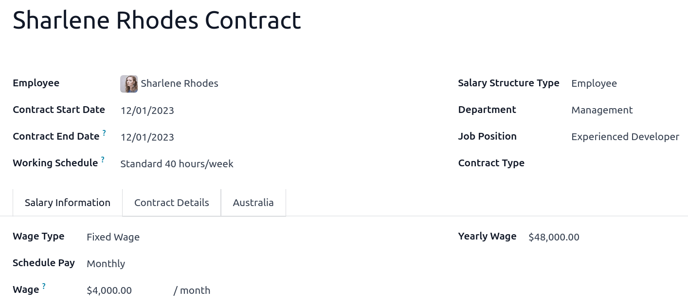

.. important::
   The structures **Horticulture/Shearing (Schedule 2)** and **Artists and Performers (Schedule 3)**
   are only partially complete, and proper tests should be performed before using them to pay
   employees in your production database. Send your feedback to au-feedback@mail.odoo.com.

The field :guilabel:`Work Entry Source` is also significant and defines how **working hours** and
**days** are accounted for in the employee’s payslip.

- :guilabel:`Working Schedule`: work entries are automatically generated based on the employee’s
  working schedule, starting from the contract's start date.. For example, let’s assume that an
  employee works 38 hours a week, and their contract’s begins on January 1st. Today is January 16th,
  and the user generates a pay run from January 14th to 20th. The working hours on the payslip will
  be automatically calculated to be 38 hours (5 * 7.36 hours) if no leave is taken.
- :guilabel:`Attendances`: The default working schedule is ignored, and work entries are only
  generated after clocking in and out of the attendance app.
- :guilabel:`Planning`: The default working schedule is ignored, and work entries are generated from
  planning shifts only.

  .. important::
     Additional configurations are necessary to ensure that Odoo’s payslips automatically compute
     various **penalty rates** as defined by an **award (overtime rate, public holiday rate, etc)**.
     To create these configurations, create new work-entry types for each penalty rate and then
     assign a penalty rate in % to each. Once this one-time configuration is done, work entries can
     be manually imported for each period, and Odoo will separate the pay items and rates on the
     employee’s payslip.

  .. important::
     Timesheets do not impact work entries in Odoo.

- The :guilabel:`Salary Information` tab contains a few essential fields impacting the frequency of
  pay runs and the management of payslip rules in Odoo.

    - :guilabel:`Wage Type`: Select the :guilabel:`Fixed Wage` pay type for full-time and part-time
      employees. For casual workers and other :guilabel:`Hourly Wage` type. For employees being paid
      hourly, make sure to define the correct **casual loading**.
    - :guilabel:`Schedule Pay`: In Australia, only the following pay run frequencies are accepted:
      **daily, weekly, bi-weekly (or fortnightly), monthly, and quarterly**.
    - :guilabel:`Wage` (/period): Assign a wage to the contract according to their pay frequency.
      On payslips, the corresponding annual and hourly rates will be automatically computed.

  .. note::
     For hourly workers, please note that the hourly wage should exclude casual loading.

- The :guilabel:`Australia` tab. Most of the fields in this tab are used for **Single Touch
  Payroll** (or **STP**) reporting, which requires a thorough understanding of several details from
  an employee’s contract. Review the information on this tab before moving forward with pay runs.
  This includes the following **four** fields which impact payslip computations:

    - :guilabel:`Withholding Variation`: use this field in case the employee’s withholding must be
      varied upward or downward according to their circumstances. E.g., if employee X benefits from a
      25% withholding variation, their percentage of tax withheld will vary from whatever amount
      they were supposed to pay according to their salary structure and situation to a fixed 25%.
    - :guilabel:`Leave Loading`: if the employee benefits from a regular leave loading, the value
      set in the field :guilabel:`Leave Loading Rate` (e.g., 17.5%) is added to any amount earned
      when taking annual or long service leaves.
    - :guilabel:`Salary Sacrifice Superannuation`: any amount added to this field is deducted, per
      pay frequency, from the employee’s basic salary before the computation of the gross salary.
      Then, this amount is added to the super guarantee line of their payslip. E.g., if employee Y
      earns 5,000 AUD per month and sacrifices 300 AUD to superannuation, their gross salary will be
      4,700 AUD, and 300 AUD will be added on top of their normal super contributions.
    - :guilabel:`Salary Sacrifice Other`: any amount added to this field is deducted, per pay
      frequency, from the employee’s basic salary before the computation of the gross salary.

Once all important information has been entered, ensure the transition of the contract's status from
"New" to "Running" to facilitate its use in pay runs.

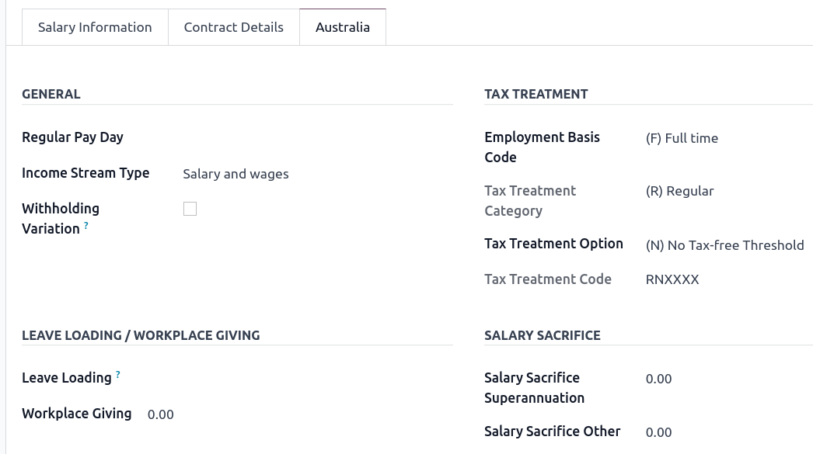

Assign superannuation accounts
------------------------------

Upon receipt of superannuation details from a new employee, ensure the creation of a new account in
:menuselection:`Payroll --> Configuration --> Super Accounts` to link it to the employee. Input the
:guilabel:`Super Fund`, :guilabel:`Member Since` date, and :guilabel:`TFN` number of the employee.

Suppose the employee uses a superannuation fund that does not exist in the database yet. In that
case Odoo creates a new one and centralises basic information about this fund, such as its **ABN**,
**address**, type (**APRA** or **SMSF**), **USI**, and **ESA**. Super funds can be created or
imported in :menuselection:`Payroll --> Configuration --> Super Funds`.

.. important::
   Odoo is currently not **SuperStream-compliant**.

Create pay runs with payslips
-----------------------------

Odoo can create pay runs in **two** ways: via **batch** or via **individual** payslips.

Create a batch of payslips
~~~~~~~~~~~~~~~~~~~~~~~~~~

When preparing to generate employees’ draft payslips (e.g., at the end of every week, fortnight, or
month), navigate to :menuselection:`Payroll --> Payslips --> Batches` and click :guilabel:`New`.
Fill in the necessary info, click :guilabel:`Generate Payslips`, select the
:guilabel:`Salary Structure`, :guilabel:`Department`, :guilabel:`Employees`, and
:guilabel:`Generate`. This method allows the creation of multiple payslips corresponding to each
employee in a single batch.

#. Give the batch a name. (E.g., `2024 – Weekly W1`)
#. Choose the pay run's start and end date. (E.g., 01/01/2024 to 07/01/2024)
#. Click on :guilabel:`Generate`. A pop-up window asks to confirm which employees should be included
   in the batch. By default, all active employees are included. You can leave
   :guilabel:`Salary Structure` field blank as Odoo automatically selects the structure linked to
   each employee’s contract.
#. The batch creates as many payslips as there are employees. There is no limit to the number of
   payslips created in a batch.
#. Verify important information on each payslip. After payslips from a batch have been generated,
   there is no need to manually compute payslip lines; Odoo does it for you.

Create an individual payslip
~~~~~~~~~~~~~~~~~~~~~~~~~~~~

In cases where the pay run does not fall into the category of regular payslips, the option exists to
create a pay run dedicated to a single employee. Go to :menuselection:`Payroll --> Payslips --> All
Payslips` and click :guilabel:`New`. Employ this method when processing **one-time payments** for
employees, including **return-to-work** payments (**ATO Schedule 4**), **employment termination**
payments (**ATO Schedule 7 and 11**), and **commissions and bonuses** (**ATO Schedule 5**). When
generating an individual payslip, make sure to proceed with the following steps:

#. Select an :guilabel:`Employee`; their :guilabel:`Contract` will be filled out automatically
#. Add a pay :guilabel:`Period`
#. Select a salary :guilabel:`Structure` (e.g., return-to-work payment)
#. Unlike payslips generated from a batch, the payroll user must click the :guilabel:`Compute Sheet`
   button to generate payslip lines

.. image:: australia/worked-days-input.png
   :alt: One-time payments in Odoo Payroll.

Understand payslip features
~~~~~~~~~~~~~~~~~~~~~~~~~~~

The same features apply no matter how payslips are created (individually or via batch).

Depending on how work entries are created, the :guilabel:`Worked Days & Inputs` table
automatically shows the number of days and hours the employee worked during the payslip period next
to the corresponding total gross amount.

.. note::
   There is one line per work entry type, meaning **paid** and **unpaid time-off**, in addition to
   custom **hourly penalty rates** (overtime, public holidays, etc.) which are automatically added
   to the table.

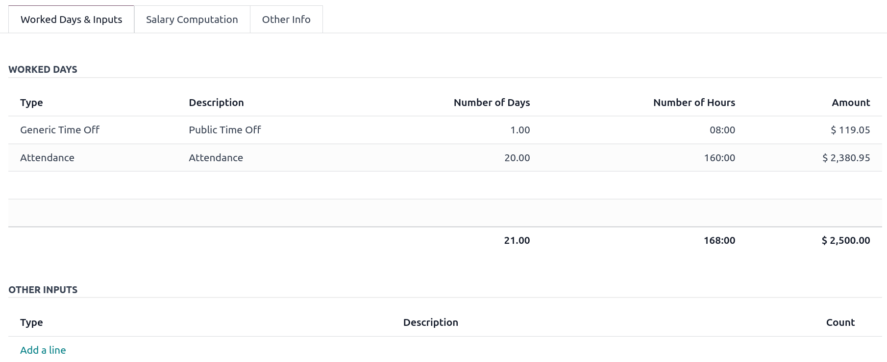

In the :guilabel:`Other Inputs` section, You can add entries such as **allowances** and **extra
pay** items in the :guilabel:`Other Inputs` section.

- To incorporate various **allowances** into an employee's payslip, create **allowances** in
  :menuselection:`Payroll --> Configuration --> Other Input Types`. Once created, tick the
  :guilabel:`Is an Allowance` checkbox for the involved allowances.

  .. important::
     Withholding for allowances is not computed automatically. The payroll user has to use the field
     :guilabel:`Withholding for allowance` under the other inputs table to manually add the total
     amount to be withheld across all allowances on that payslip.

- **Extra pay** items are other inputs added to the **payslip’s gross** and, as a result, to the
  **withholding amount**. An example lies in regular sales commissions, taxed at the same rate as
  the regular salary (unlike discretionary bonuses, which fall under the ATO’s Schedule 5 and its
  corresponding salary structure). To configure such a custom pay item, go to
  :menuselection:`Payroll --> Configuration --> Other Input Types` and create a new entry with the
  code **EXTRA**.

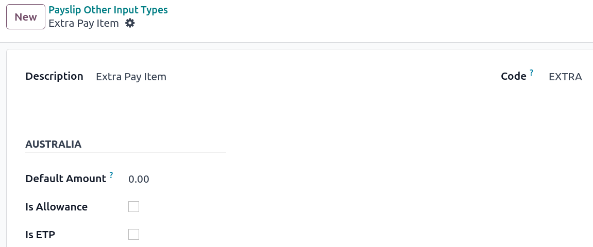

In the :guilabel:`Salary Computation` tab, the payroll user can verify whether all the pay rules
have been computed correctly as per employee, contract and salary structure. Here are a few
guidelines to better understand the data.

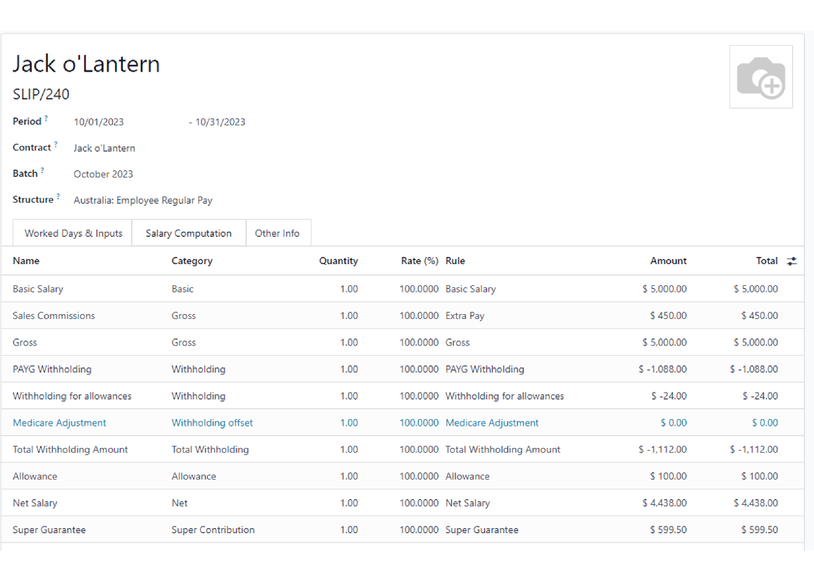

#. **Basic salary:** amount from which tax-deductible lines can be subtracted
#. **Gross salary:** amount subject to the taxes defined by the salary structure
#. **Withholding:** tax amount to be paid to the **ATO**
#. **Net salary:** amount to be paid to the employee’s bank account
#. **Superannuation Guarantee:** amount to be provisioned for quarterly payments to the employee’s
   super account
#. **Allowances & Extra pay items:** these lines will show if other inputs are added to the payslip.
#. **Other lines:** depending on the employee and contract specifics (Medicare, child support,
   salary, sacrifice, etc.)

When satisfied with the payslip, click :guilabel:`Create Draft entry` to generate a draft accounting
journal entry that the accountant can review. Note that in the case of a payslip batch, this
accounting entry will sum up balances from all payslips.

Pay employees
-------------

After a batch or a payslip’s journal entry has been posted, the company can pay their employees. The
user can choose between **two** different **payment methods**.

- Pay the employee in batch via **ABA** files. This is **only** possible from the **payslip batch**
  level. Ensure the batch’s journal entry has been posted to generate the **ABA** file. From the
  batch form view, click :guilabel:`Create ABA File` and choose the desired bank journal. The newly
  generated **ABA** file becomes available for download in the field :guilabel:`ABA File`. It is
  possible to re-generate the ABA file after applying corrections to existing payslips.

  .. note::
     It is always possible to include an individual payslip into an existing batch in an **ABA**
     file.

  .. important::
     An ABA file can only be generated if both the company’s bank account and each employee’s bank
     account have been properly :ref:`configured <australia/aba>`.

- From the employee's payslip (:menuselection:`Payroll --> Payslips`), once the payslip's journal
  entry has been posted, click :guilabel:`Register Payment`. The process is the same as
  :doc:`paying vendor bills <../accounting/payments>`: select the desired bank journal and payment
  method, then later reconcile the payment with the corresponding bank statement.

One-time payments
~~~~~~~~~~~~~~~~~

Certain payments, such as **Return-to-Work** payments and **Employment Termination Payments**
**(ETP)**, are processed only once and require a slightly different approach.

Return-to-Work payments
***********************

A **Return-to-Work** payment is a payment made to an employee to resume working. To process one,
create an individual payslip, select the employee, and modify its **regular structure** to
:guilabel:`Australia: Return to work`. Then, add the **gross amount** of that payment in the
:guilabel:`Other Inputs` section and compute the payslip. Odoo automatically computes the **PAYG
withholding**, the **net amount**, and the **super guarantee** corresponding to that payment.

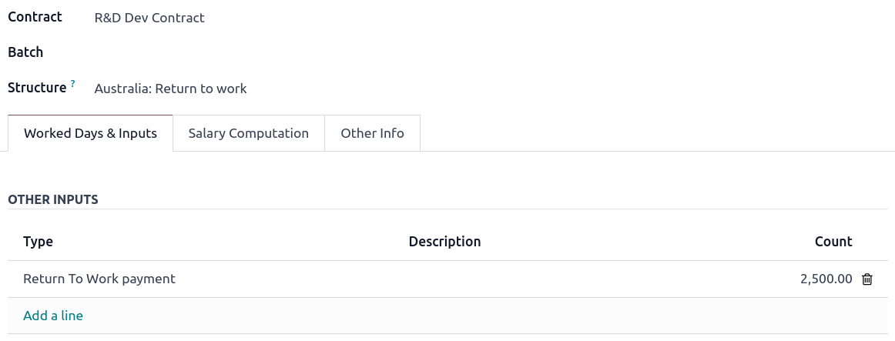

Termination payments
********************

Before proceeding with the employee’s ETP, make sure that a **Contract End Date** has been set on
that employee’s contract so that Odoo can automatically compute the final prorated salary of that
employee for the current month.

First, create the final salary for that employee this month. To do so, create an individual payslip.
If the contract end date is set correctly, Odoo will automatically compute the prorated salary up to
the final payslip date.

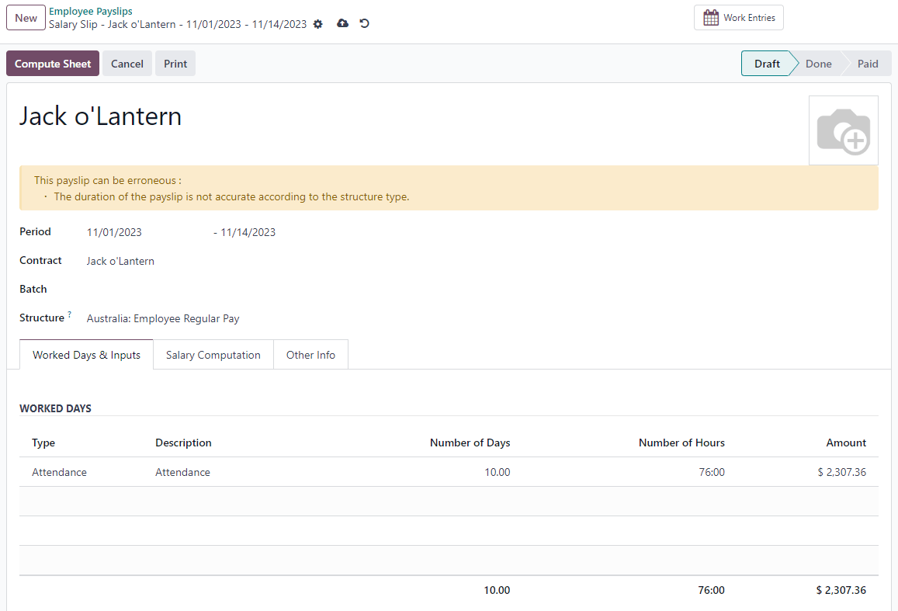

.. tip::
   We recommend creating a batch on the fly for that payslip, in which the ETP is added as a second
   payslip of that same batch.

Create a second individual payslip and include it in the same batch. Change the salary structure on
that payslip to :guilabel:`Australia: Termination Payments`. Before computing the sheet, it is
important to provide the payslip with termination details .

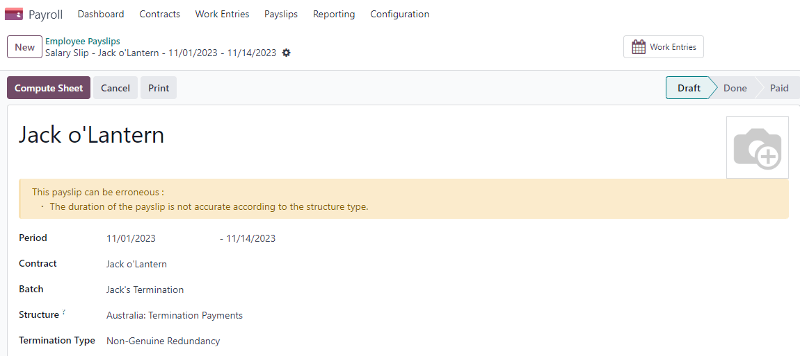

- :guilabel:`Genuine` or :guilabel:`Non-Genuine Redundancy`. This choice impacts the amounts and
  caps defined per **ETP** type.
- **ETP types**: see the full list of termination payment types in
  :guilabel:`Other Input Types` by filtering by `ETP Type is Set`.

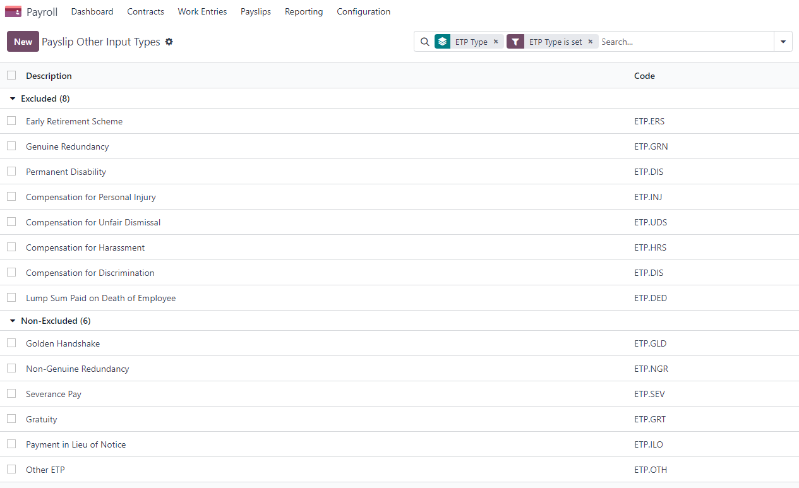

Add the relevant **ETP type** in the :guilabel:`Other Inputs` table of the payslip, then compute the
payslip. Odoo computes the **gross ETP**, the **withholding**, the **unused leaves**, and the **net
salary** according to the rules defined on the **ETP**, the **employee**, and their **contract**.
Once payment for both payslips is ready to be processed, an **ABA** file can be created directly
from the batch.

.. _australia/employment-hero:

Employment Hero Australian Payroll
==================================

If your business is already up and running with `Employment Hero <https://employmenthero.com/>`_,
you can use our connector as an alternative payroll solution.

The Employment Hero module synchronises payslip accounting entries (e.g., expenses, social charges,
liabilities, taxes) automatically from Employment Hero to Odoo. Payroll administration is still done
in Employment Hero. We only record the **journal entries** in Odoo.

.. important::
   KeyPay was rebranded as **Employment Hero** in March 2023.

Configuration
-------------

#. :ref:`Activate <general/install>` the :guilabel:`Employment Hero Australian Payroll` module
   (`l10n_au_keypay`).
#. Configure the **Employment Hero API** by going to :menuselection:`Accounting --> Configuration
   --> Settings`. More fields become visible after clicking on :guilabel:`Enable Employment Hero
   Integration`.

   .. image:: australia/employment-hero-integration.png
      :alt: Enabling Employment Hero Integration in Odoo Accounting displays new fields in the
            settings

   - You can find the API Key in the :guilabel:`My Account` section of the Employment Hero platform.

     .. image:: australia/employment-hero-myaccount.png
        :alt: "Account Details" section on the Employment Hero dashboard

   - The **Payroll URL** is pre-filled with `https://keypay.yourpayroll.com.au`.

     .. warning::
        Do not change the **pre-filled Payroll URL**

   - You can find the **Business ID** in the Employment Hero URL. (i.e., `189241`)

     .. image:: australia/employment-hero-business-id.png
        :alt: The Employment Hero "Business ID" number is in the URL

   - You can choose any Odoo journal to post the payslip entries.

How does the API work?
----------------------

The API syncs the journal entries from Employment Hero to Odoo and leaves them in draft mode. The
reference includes the Employment Hero payslip entry ID in brackets for the user to easily retrieve
the same record in Employment Hero and Odoo.

.. image:: australia/employment-hero-journal-entry.png
   :alt: Example of a Employment Hero Journal Entry in Odoo Accounting (Australia)

By default, the synchronisation happens once per week. You can fetch the records manually by going
to :menuselection:`Accounting --> Configuration --> Settings` and, in the :guilabel:`Enable
Employment Hero Integration` option, click on :guilabel:`Fetch Payruns Manually`.

Employment Hero payslip entries also work based on double-entry bookkeeping.

The accounts used by Employment Hero are defined in the section :guilabel:`Payroll settings`.

.. image:: australia/employment-hero-chart-of-accounts.png
   :alt: Chart of Accounts menu in Employment Hero

For the API to work, you need to create the same accounts as the default accounts of your Employment
Hero business (**same name and same code**) in Odoo. You also need to choose the correct account
types in Odoo to generate accurate financial reports.
