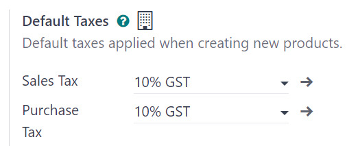
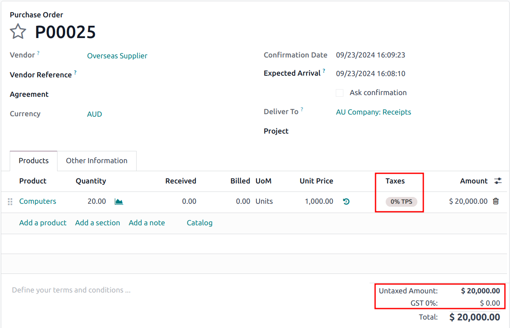
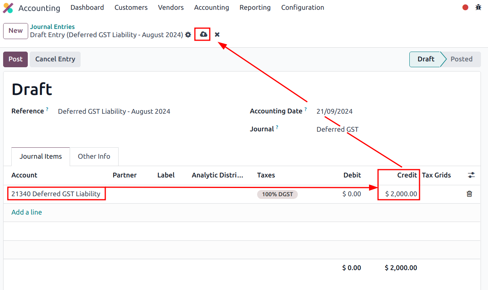
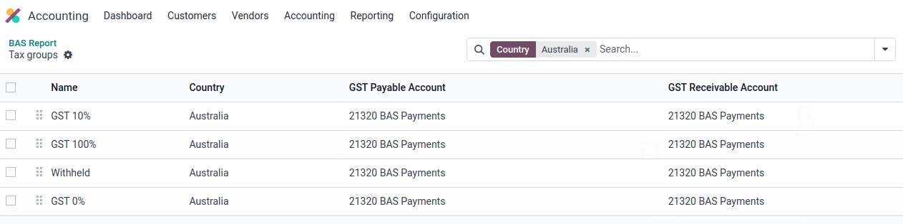
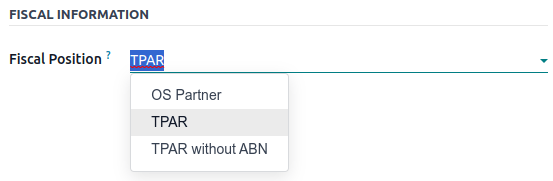
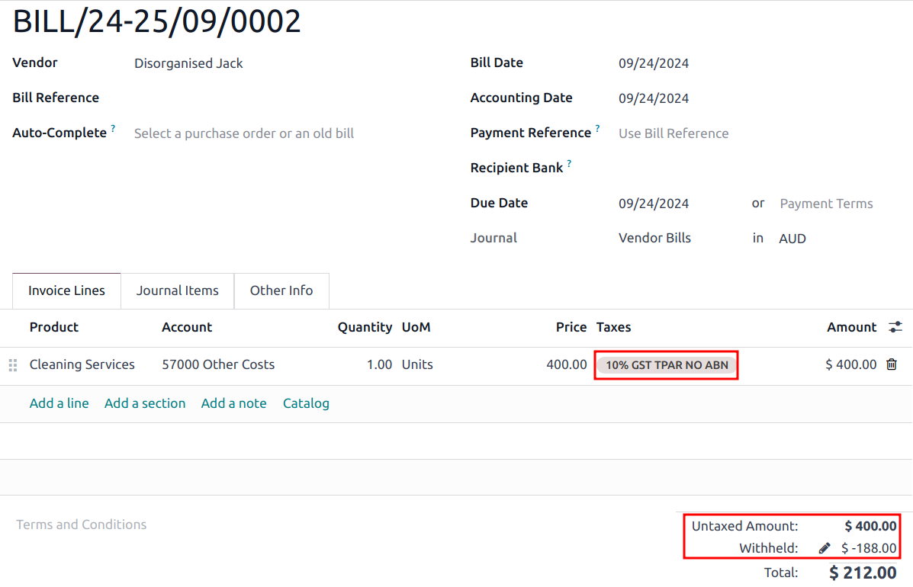
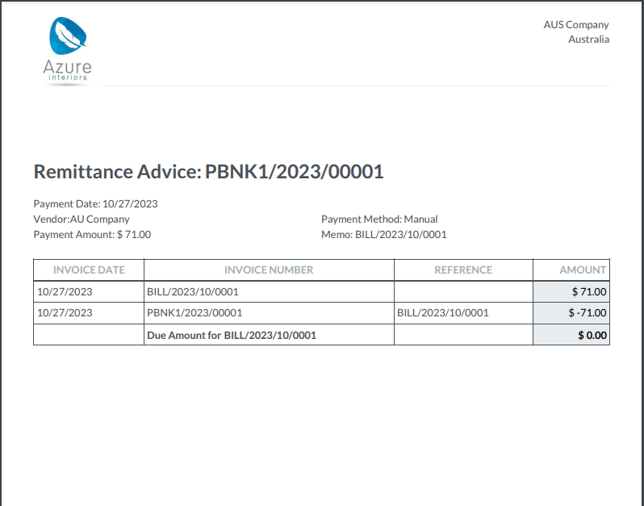

=========
Australia
=========

Modules
=======

.. list-table::
   :widths: 25 25 50
   :header-rows: 1

   * - Name
     - Technical name
     - Description
   * - :guilabel:`Australia - Accounting`
     - `l10n_au`
     - The base :ref:`accounting <australia/accounting>` module for the Australian localization. It
       is installed automatically when the :guilabel:`Australia` :ref:`fiscal localization package
       <fiscal_localizations/packages>` is selected. This module also installs the :ref:`ABA Credit
       Transfer <australia/aba>` module.
   * - :guilabel:`Australian Reports - Accounting`
     - `l10n_au_reports`
     - Adds the :ref:`Taxable Payments Annual Report (TPAR) <australia/tpar>` and the :ref:`Business
       Activity Statement (BAS) <australia/bas>` report. It is installed automatically when the
       :guilabel:`Australia` :ref:`fiscal localization package <fiscal_localizations/packages>` is
       selected.
   * - :guilabel:`Australia - Payroll`
     - `l10n_au_hr_payroll`
     - The base :ref:`payroll <payroll/l10n_au/payroll>` module for the Australian localization.
   * - :guilabel:`Australia - Payroll with Accounting`
     - `l10n_au_hr_payroll_account`
     - Contains the necessary accounting data for the Australian payroll rules. It is installed
       automatically when the :ref:`Payroll Entries option <payroll-accounting>` is enabled.
   * - :guilabel:`Employment Hero Payroll`
     - `l10n_employment_hero`
     - Synchronizes all pay runs from :ref:`Employment Hero <payroll/l10n_au/employment-hero>`
       with Odoo's journal entries.

.. _australia/accounting:

Accounting
==========

Taxes and GST
-------------

In Australia, the standard **Goods and Services Tax (GST)** rate is 10%, but different rates and
exemptions exist for specific categories of goods and services.

.. note::
   The taxes impact the :ref:`BAS report <australia/bas>`.

Tax mapping
~~~~~~~~~~~

Within the Australian localization, tax names encompass the tax rate as an integral part of their
naming convention. Despite the high number of :doc:`taxes <../accounting/taxes>` configured in Odoo,
their rates are often similar (0% or 10%).

GST sales taxes
***************

The **GST sales** taxes available in Odoo are listed below.

.. list-table::
   :widths: 20 50 30
   :header-rows: 1

   * - GST name
     - Description
     - Label on invoices
   * - 10% GST
     - GST Sales
     - 10% GST
   * - 0% EX
     - GST Free on Export Sales
     - 0% GST Free
   * - 0% F
     - GST Free Sales
     - 0% Exempt
   * - 0% INP
     - Input Taxed Sales
     - 0% Input Taxed Sales
   * - 100% Adj
     - This is for adjustment, amounts can be modified to fit your needs
     - Tax Adjustments (Sales)

GST purchase taxes
******************

The **GST purchase** taxes available in Odoo are listed below.

.. list-table::
   :widths: 20 50 30
   :header-rows: 1

   * - GST name
     - Description
     - Label on invoices
   * - 10% GST
     - GST Purchases
     - 10% GST
   * - 10% C
     - Capital Purchases
     - 10% Capital Purchases
   * - 10% INP
     - Purchases for Input Taxed Sales
     - 10% Purchases for Input Taxed Sales
   * - 10% PRIV
     - Purchases for private use or not deductible
     - 10% Purchases for Private Use
   * - 0% F
     - GST Free Purchases
     - 0% GST Free
   * - 0% TPS
     - Purchase (Taxable Imports) - Tax Paid Separately
     - 0% GST Paid Separately
   * - 100% ONLY
     - GST Only on Imports
     - GST Only on Imports
   * - 100% Adj
     - Tax Adjustments (Purchases)
     - Tax Adjustments (Purchases)
   * - 100% DGST
     - Deferred GST Liability
     - 100% DGST
   * - No ABN
     - Tax Withheld for Partners without ABN
     - Withholding Tax for No ABN
   * - PAYGW - W3
     - Other amounts withheld (excluding any amount shown at W2 or W4)
     - Other Amounts Withheld (W3)

Variants
^^^^^^^^

Businesses from certain industries need to report payments made to subcontractors from relevant
services during the financial year. Odoo combines the use of taxes and fiscal positions to report
these payments on the :ref:`TPAR <australia/tpar>`. In order to be compliant with the TPAR's
obligations, two variants of the main purchase taxes are available in Odoo, but they are inactive by
default.

.. example::

   For the *10% GST* tax, the variants are:

   .. list-table::
      :widths: 20 40 20 20
      :header-rows: 1

      * - Tax name
        - Description
        - Reports impacted
        - Default status
      * - 10% GST
        - Default 10% GST tax
        - BAS
        - Active
      * - 10% GST TPAR
        - TPAR variant of the tax, if the contractor provided an ABN
        - | BAS
          | TPAR
        - Inactive
      * - 10% GST TPAR NO ABN
        - TPAR variant of the tax, if the contractor did not provide an ABN
        - | BAS
          | TPAR
        - Inactive

Deferred GST
~~~~~~~~~~~~

Odoo allows companies under the `Deferred Goods and Services Tax (DGST) scheme <https://www.ato.gov.au/businesses-and-organisations/gst-excise-and-indirect-taxes/gst/in-detail/rules-for-specific-transactions/international-transactions/deferred-gst?=redirected_deferredGSTscheme>`_
to automate their deferred GST flows.

Configuration
*************

It is recommended to:

- go to :menuselection:`Accounting --> Configuration --> Settings` and set the :guilabel:`Tax Return
  Periodicity` to :guilabel:`monthly` (= monthly BAS); and
- create a new journal to store all deferred GST entries by going to :menuselection:`Accounting
  --> Configuration --> Journals --> New`, and selecting :guilabel:`Miscellaneous` as its
  :guilabel:`Type` when configuring it.

By default, a tax (*100% DGST*, inactive by default) and an account (*21340 Deferred GST Liability*)
are available for Australian companies. Activate the tax by going to :menuselection:`Accounting -->
Configuration --> Taxes`. Search for the :guilabel:`Name` `100% DGST` (remove the default filter if
necessary), and click the :guilabel:`Activate` toggle switch.

Flow
****

1. Importing goods: purchase order and vendor bill
^^^^^^^^^^^^^^^^^^^^^^^^^^^^^^^^^^^^^^^^^^^^^^^^^^

When importing goods from abroad, the GST liability can now be deferred for companies under the DGST
scheme. On the purchase order, select the :guilabel:`0% TPS` tax (tax paid separately) for the
relevant order lines.

2. Recording the DGST balance on the BAS report
^^^^^^^^^^^^^^^^^^^^^^^^^^^^^^^^^^^^^^^^^^^^^^^

When the Australian Taxation Office (ATO) is advised electronically of the aggregated liability for
the company by the Integrated Cargo System (ICS), the GST balance deferred during the previous month
becomes available on the ATO's BAS portal.

.. important::
   Odoo does not yet fetch the DGST balance automatically from the ATO. A manual entry with the
   liability amount needs to be created in Odoo. We recommend using a new journal for this purpose
   since deferrals will be recurring.

Go to :menuselection:`Accounting --> Journal Entries --> New`. On the first journal item line, add
the :guilabel:`Account` `21340 Deferred GST Liability` and the deferred GST balance as a
:guilabel:`Credit`. To resume the example shown above, we credit $2,000 and save.

An auto-balancing line is created, along with journal items correctly assigning the right values in
the BAS :guilabel:`Tax Grids`. Sections *G11*, *G18*, *7A*, and *ONLY* are updated correctly.

.. image:: australia/dgst-tax-grids.png
   :alt: The journal entry with the auto-balancing line and BAS tax grids

After posting the journal entry, the BAS report displays the correct values for each section, along
with the DGST offset.

Reports
-------

.. _australia/bas:

Business Activity Statement (BAS)
~~~~~~~~~~~~~~~~~~~~~~~~~~~~~~~~~

The **BAS report** is a critical tax reporting requirement for businesses registered for GST in
Australia. The BAS is used to report and remit various taxes to the ATO. With the Odoo BAS feature,
businesses can report on the following:

- GST
- PAYG tax withheld
- DGST

Access the report from the Accounting dashboard by clicking :guilabel:`BAS Report (AU)` under the
:guilabel:`Miscellaneous Operations` section.

.. image:: australia/bas-report.png
   :alt: BAS report example

The base and tax amounts are collected from the **tax grid**, which is pre-configured in the system.
The tax grid can also be manually set up for any additional special use-case of GST (e.g., wine
equalization tax). Once the tax for each account is set up, the system automatically slots journal
items into the correct tax category. This ensures the BAS report is accurate and reflective of the
business's financial activities.

.. image:: australia/gst-grids.png
   :alt: GST grids example

Besides the GST sections, the BAS report also includes the **PAYG** tax withheld components (*W1* to
*W5*, then *summary, section 4*). This integration ensures that all payroll-related withholding
taxes are accurately captured and reflected within the report.

.. image:: australia/payg.png
   :alt: PAYG tax withheld and summary of BAS report example

The module incorporates built-in rules that facilitate the automatic calculation of taxes for types
W1 to W5. For a detailed walkthrough and more information on the calculation process for these
taxes, refer to the :ref:`Payroll section <payroll/l10n_au/payroll>`.

Closing
*******

When it is time to file the tax return with the ATO, click :guilabel:`Closing Entry`. The tax return
period can be configured under :menuselection:`Accounting --> Configuration --> Settings --> Tax
Return Periodicity`. The start date of the tax return period can also be defined on the report
itself through the period button (:icon:`fa-calendar` *period* *year*).

.. seealso::
   :doc:`Year-end closing <../accounting/reporting/year_end>`

.. note::
   Odoo uses calendar quarters rather than the Australian FY quarters, which means *July to
   September* is *Q3* in Odoo.

Before closing the entry for the first time, the default **GST payable account** and **GST
receivable account** need to be set. A notification pops up and redirects the user to the tax groups
configuration.

Once the GST payable and GST receivable accounts are set up, the BAS report generates an accurate
journal closing entry automatically, which balances out the GST balance with the GST clearing
account.

The balance between GST receivable and payable is set against the tax clearing account defined on
the tax group. The amount to be paid to or received from the ATO can be reconciled against a bank
statement.

.. image:: australia/bas-taxes.png
   :alt: BAS report tax payment

.. important::
   The BAS report is not directly submitted to the ATO. Odoo helps you automatically compute the
   necessary values in each section, with the possibility to audit them to better understand the
   history behind these numbers. Businesses can copy these values and enter them on the `ATO portal
   <https://www.ato.gov.au/businesses-and-organisations/preparing-lodging-and-paying/business-activity-statements-bas/how-to-lodge-your-bas>`_.

.. _australia/tpar:

Taxable Payments Annual Report (TPAR)
~~~~~~~~~~~~~~~~~~~~~~~~~~~~~~~~~~~~~

Odoo allows businesses to report payments made to contractors or subcontractors during the financial
year. This is done by generating a **TPAR**. If you are unsure your business needs this report,
refer to the `ATO's TPAR web page <https://www.ato.gov.au/businesses-and-organisations/preparing-lodging-and-paying/reports-and-returns/taxable-payments-annual-report>`_.

Access the TPAR in Odoo by going to :menuselection:`Accounting --> Reporting --> Taxable Payments
Annual Reports (TPAR)`.

Configuration
*************

First, it is required to assign fiscal positions to your contractors before billing them to update
the TPAR. To do so, go to :menuselection:`Accounting --> Vendors --> Vendors`, select a contractor,
and set a :guilabel:`Fiscal Position` under the :guilabel:`Sales & Purchase` tab.

Based on the chosen fiscal position, the correct tax mapping will apply to the contractor's vendor
bills.

The TPAR includes the following information from contractors:

- :guilabel:`ABN`
- :guilabel:`Total GST` (the total tax paid)
- :guilabel:`Gross Paid` (the amounts are displayed after a vendor bill has been marked as paid)
- :guilabel:`Tax Withheld` (displayed if the contractor is registered with a fiscal position set to
  :guilabel:`TPAR without ABN`)

The TPAR can be exported to multiple formats: PDF, XLSX, and TPAR.

.. _australia/remittance:

Remittance advice
-----------------

A remittance advice is a document used as proof of payment to a business. In Odoo, it can be
accessed by going to :menuselection:`Accounting --> Vendors --> Payments`, selecting the payment(s),
and clicking :menuselection:`Print --> Payment Receipt`.

.. _australia/peppol:

E-invoicing
-----------

Peppol
~~~~~~

Odoo is compliant with Australia's `Peppol requirements
<https://peppol.org/learn-more/country-profiles/australia/>`_. Set up your customers and vendors
by going to :menuselection:`Accounting --> Customers --> Customers` or :menuselection:`Vendors -->
Vendors`, selecting one, clicking the :guilabel:`Accounting` tab, and configuring the
:guilabel:`Electronic Invoicing` section as needed.

.. important::
   Validating an invoice or credit note for a partner on the Peppol network will download a
   compliant XML file that can be manually uploaded to your Peppol network. Odoo is currently in the
   process of becoming an access point for the ANZ region.

.. _australia/aba:

ABA files for batch payments
----------------------------

An ABA file is a digital format developed by the `Australian Banking Association
<https://www.ausbanking.org.au/>`_. It is designed for business customers to facilitate bulk payment
processing by uploading a single file from their business management software.

The main advantage of using ABA files is to improve payment and matching efficiency. This is
achieved by consolidating numerous payments into one file for batch processing, which can be
submitted to all Australian banks.

Configuration
~~~~~~~~~~~~~

Batch payments
**************

Go to :menuselection:`Accounting --> Configuration --> Settings` and enable :guilabel:`Batch
Payments`.

Bank journal
************

Go to :menuselection:`Accounting --> Configuration --> Journals` and select the :guilabel:`Bank`
journal. Enter the :guilabel:`Account Number`, click :guilabel:`Create and edit...`, and fill in the
following fields:

- :guilabel:`Bank`
- :guilabel:`BSB`
- :guilabel:`Account Holder`

Then, toggle on the :guilabel:`Send Money` switch and click :guilabel:`Save & Close`.

.. note::
   Using the :guilabel:`Currency` field is optional.

Back on the :guilabel:`Journal Entries` tab, fill in the following fields under the :guilabel:`ABA`
section:

- :guilabel:`BSB`: the BSB code from the bank account is used to fill in this field.
- :guilabel:`Financial Institution Code`: the official 3-letter abbreviation of the bank (e.g.,
  `WBC` for Westpac)
- :guilabel:`Supplying User Name`: 6-digit number provided by the bank. Contact your bank or check
  its website if you do not know it.
- :guilabel:`APCA Identification Number`: 6-digit number provided by the bank. Contact your bank or
  check its website if you do not know it.
- :guilabel:`Include Self Balancing Transaction`: selecting this option adds an additional
   "self-balancing" transaction to the end of the ABA file, which is required by some banks.

Customers' and vendors' bank accounts
*************************************

Go to :menuselection:`Accounting --> Customers --> Customers` or :menuselection:`Accounting -->
Vendors --> Vendors` and select a customer or vendor. Open the :guilabel:`Accounting` tab, and,
under the :guilabel:`Bank Accounts` section, click :guilabel:`Add a line` to fill in their:

- :guilabel:`Account Number`
- :guilabel:`Bank`
- :guilabel:`BSB`
- :guilabel:`Account Holder`

Then, toggle on the :guilabel:`Send Money` switch and click :guilabel:`Save & Close`.

Generating an ABA file
~~~~~~~~~~~~~~~~~~~~~~

To generate an ABA file, create a vendor bill, confirm it, and ensure the vendor's banking
information is set up correctly.

Next, click :guilabel:`Pay` on the vendor bill, and select, for the following fields:

- :guilabel:`Journal`: :guilabel:`Bank`
- :guilabel:`Payment Method`: :guilabel:`ABA Credit Transfer`
- :guilabel:`Recipient Bank Account`: the vendor's account number

Once payments are created, go to :menuselection:`Accounting --> Vendors --> Payments`, select the
payments to be included in the batch, and click :guilabel:`Create Batch`. Verify all information is
correct and click :guilabel:`Validate`. Once validated, the ABA file is available in the **chatter**
on the right.

After uploading the file to your bank's portal, an ABA transaction line will appear in your bank
feed at the following bank feed iteration. You will need to reconcile it against the **batch
payment** made in Odoo.

Industry-specific features
==========================

Starshipit shipping
-------------------

Starshipit is a shipping service operator that facilitates the integration of Australasian shipping
couriers with Odoo. Refer to the :doc:`Starshipit documentation
<../../inventory_and_mrp/inventory/shipping_receiving/setup_configuration/starshipit_shipping>` for
detailed information.

.. seealso::
   `Starshipit Odoo webinar recording <https://www.youtube.com/watch?v=TcDWnoYLXWg>`_

.. _australia/buynow_paylater:

Buy Now, Pay Later solutions
----------------------------

*Buy Now, Pay Later* solutions are popular payment methods for eShops in Australia. Some of these
solutions are available via `Stripe <https://stripe.com/en-au/payments/payment-methods>`_ and
`AsiaPay <https://www.asiapay.com.au/payment.html#option>`_.

.. seealso::
   - :doc:`Stripe payment provider <../payment_providers/stripe>`
   - :doc:`AsiaPay payment provider <../payment_providers/asiapay>`

POS terminals
-------------

To establish a direct connection between Odoo and a POS terminal in Australia, a **Stripe** payment
terminal is required. Odoo supports the **EFTPOS** payment solution in Australia.

.. note::
   A Stripe payment terminal is not required to use Odoo as the main POS system. However, without
   one, cashiers must manually enter the final payment amount on the terminal.

.. seealso::
   - :doc:`Stripe payment provider <../payment_providers/stripe>`
   - :doc:`Stripe payment terminal <../../sales/point_of_sale/payment_methods/terminals/stripe>`
   - `Stripe.com terminal documentation <https://stripe.com/docs/terminal>`_
