=========
Australia
=========

.. _australia/configuration:

Modules
=======

.. list-table::
   :widths: 25 25 50
   :header-rows: 1

   * - Name
     - Technical name
     - Description
   * - :guilabel:`Australia - Accounting`
     - `l10n_au`
     - The base accounting module for the Australian localization. It is installed automatically
       when the :guilabel:`Australia` :ref:`fiscal localization package
       <fiscal_localizations/packages>` is selected. This module also installs the :guilabel:`ABA
       Credit Transfer` module.
   * - :guilabel:`Australian Reports - Accounting`
     - `l10n_au_reports`
     - Adds the **Taxable Payments Annual Report (TPAR)** and the **Business Activity Statement
       (BAS) report**. It is installed automatically when the :guilabel:`Australia` :ref:`fiscal
       localization package <fiscal_localizations/packages>` is selected.
   * - :guilabel:`Australia - Payroll`
     - `l10n_au_hr_payroll`
     - The base payroll module for the Australian localization.
   * - :guilabel:`Australia - Payroll with Accounting`
     - `l10n_au_hr_payroll_account`
     - Contains the necessary accounting data for the Australian payroll rules. It is installed
       automatically when the :ref:`Payroll Entries option <payroll-accounting>` is enabled.
   * - :guilabel:`Employment Hero Payroll`
     - `l10n_employment_hero`
     - Synchronizes all pay runs from Employment Hero with Odoo's journal entries.

Accounting
==========

.. _australia/taxes:

Taxes and GST
-------------

In Australia, the standard **Goods and Services Tax (GST)** rate is 10%, but different rates and
exemptions exist for specific categories of goods and services.

.. image:: australia/default-taxes.png
   :alt: Default GST rates

.. note::
   The taxes impact the :ref:`BAS report <australia/bas>`.

Tax mapping
~~~~~~~~~~~

Within the Australian localization, tax names encompass the tax rate as an integral part of their
naming convention. Despite the high number of :doc:`taxes <../accounting/taxes>` configured in Odoo,
their rates are often similar (0% or 10%).

GST sales taxes
***************

The **GST sales** taxes available in Odoo are listed below.

.. list-table::
   :widths: 20 50 30
   :header-rows: 1

   * - GST name
     - Description
     - Label on invoices
   * - 10% GST
     - GST Sales
     - 10% GST
   * - 0% EX
     - GST Free on Export Sales
     - 0% GST Free
   * - 0% F
     - GST Free Sales
     - 0% Exempt
   * - 0% INP
     - Input Taxed Sales
     - 0% Input Taxed Sales
   * - 100% Adj
     - This is for adjustment, amounts can be modified to fit your needs
     - Tax Adjustments (Sales)

GST purchase taxes
******************

The **GST purchase** taxes available in Odoo are listed below.

.. list-table::
   :widths: 20 50 30
   :header-rows: 1

   * - GST name
     - Description
     - Label on invoices
   * - 10% GST
     - GST Purchases
     - 10% GST
   * - 10% C
     - Capital Purchases
     - 10% Capital Purchases
   * - 10% INP
     - Purchases for Input Taxed Sales
     - 10% Purchases for Input Taxed Sales
   * - 10% PRIV
     - Purchases for private use or not deductible
     - 10% Purchases for Private Use
   * - 0% F
     - GST Free Purchases
     - 0% GST Free
   * - 0% TPS
     - Purchase (Taxable Imports) - Tax Paid Separately
     - 0% GST Paid Separately
   * - 100% ONLY
     - GST Only on Imports
     - GST Only on Imports
   * - 100% Adj
     - Tax Adjustments (Purchases)
     - Tax Adjustments (Purchases)
   * - 100% DGST
     - Deferred GST Liability
     - 100% DGST
   * - No ABN
     - Tax Withheld for Partners without ABN
     - Withholding Tax for No ABN
   * - PAYGW - W3
     - Other amounts withheld (excluding any amount shown at W2 or W4)
     - Other Amounts Withheld (W3)

Variants
^^^^^^^^

Businesses from certain industries need to report payments made to subcontractors from relevant
services during the financial year. Odoo combines the use of taxes and fiscal positions to report
these payments on the :ref:`TPAR <australia/tpar>`. In order to be compliant with the TPAR's
obligations, two variants of the main purchase taxes are available in Odoo, but they are inactive by
default.

.. example::

  For the *10% GST* tax, the variants are:

   .. list-table::
      :widths: 20 40 20 20
      :header-rows: 1

      * - Tax name
        - Description
        - Reports impacted
        - Default status
      * - 10% GST
        - Default 10% GST tax
        - BAS Report
        - Active
      * - 10% GST TPAR
        - TPAR variant of the tax, if the contractor provided an ABN
        - | BAS Report
          | TPAR Report
        - Inactive
      * - 10% GST TPAR NO ABN
        - TPAR variant of the tax, if the contractor did not provide an ABN
        - | BAS Report
          | TPAR Report
        - Inactive

Deferred GST
~~~~~~~~~~~~

Odoo allows companies under the `Deferred Goods and Services Tax (DGST) scheme <https://www.ato.gov.au/businesses-and-organisations/gst-excise-and-indirect-taxes/gst/in-detail/rules-for-specific-transactions/international-transactions/deferred-gst?=redirected_deferredGSTscheme>`_
to automate their deferred GST flows.

Configuration
*************

It is recommended to:

- set the :guilabel:`Tax Return Periodicity` to :guilabel:`monthly` (= monthly BAS), which can be
  found under :menuselection:`Accounting --> Configuration --> Settings`; and

- create a new journal to store all deferred GST entries by going to :menuselection:`Accounting
  --> Configuration --> Journals --> New`, and selecting :guilabel:`Miscellaneous` as its
  :guilabel:`Type` when configuring it.

By default, a tax (*100% DGST*, inactive by default) and an account (*21340 Deferred GST Liability*)
are available for Australian companies. Activate the tax by going to :menuselection:`Accounting -->
Configuration --> Taxes`. Search for the `100% DGST` :guilabel:`Name`, removing the default filter
if necessary, and click the :guilabel:`Activate` toggle switch.

Flow
****

1. Importing goods: purchase order and vendor bill
^^^^^^^^^^^^^^^^^^^^^^^^^^^^^^^^^^^^^^^^^^^^^^^^^^

When importing goods from abroad, the GST liability can now be deferred for companies under the DGST
scheme. On the purchase order, select the :guilabel:`0% TPS` tax (tax paid separately) for the
relevant order lines.

.. image:: australia/dgst-po-tax.png
   :alt: Setting the 0% TPS tax on a purchase order

2. Recording the DGST balance on the BAS report
^^^^^^^^^^^^^^^^^^^^^^^^^^^^^^^^^^^^^^^^^^^^^^^

When the Australian Taxation Office (ATO) is advised electronically of the aggregated liability for
the company by the Integrated Cargo System (ICS), the GST balance deferred during the previous month
becomes available on the ATO's BAS portal.

.. important::
   Odoo does not yet fetch the DGST balance automatically from the ATO. A manual entry with the
   liability amount needs to be created in Odoo. We recommend using a new journal for this purpose,
   since deferrals will be recurring.

Go to :menuselection:`Accounting --> Journal Entries --> New`. On the first journal item line, add
the :guilabel:`Account` `21340 Deferred GST Liability` and the deferred GST balance as a
:guilabel:`Credit`. To resume the example shown above, we credit $2,000 and save.

.. image:: australia/dgst-balance-credit.png
   :alt: Creating a journal entry with the DGST account

An auto-balancing line is created, along with journal items correctly assigning the right values in
the BAS :guilabel:`Tax Grids`. Sections *G11*, *G18*, *7A*, and *ONLY* are updated correctly.

.. image:: australia/dgst-tax-grids.png
   :alt: The journal entry with the auto-balancing line and BAS tax grids

After posting the journal entry, the BAS report displays the correct values for each section, along
with the DGST offset.

Reports
-------

.. _australia/bas:

Business Activity Statement (BAS)
~~~~~~~~~~~~~~~~~~~~~~~~~~~~~~~~~

The **BAS report** is a critical tax reporting requirement for businesses registered for GST in
Australia. The BAS is used to report and remit various taxes to the ATO. With the Odoo BAS feature,
businesses can report on the following:

- GST
- PAYG tax withheld
- DGST

Access the report from the Accounting dashboard by clicking :guilabel:`BAS Report (AU)` under the
:guilabel:`Miscellaneous Operations` section.

.. image:: australia/bas-report.png
   :alt: BAS report example

The base and tax amounts are collected from the **tax grid**, which is pre-configured in the system.
The tax grid can also be manually set up for any additional special use-case of GST (e.g., wine
equalization tax). Once the tax for each account is set up, the system automatically slots journal
items into the correct tax category. This ensures the BAS report is accurate and reflective of the
business's financial activities.

.. image:: australia/gst-grids.png
   :alt: GST grids example

Besides the GST sections, the BAS report also includes the **PAYG** tax withheld components (*W1* to
*W5*, then *summary, section 4*). This integration ensures that all payroll-related withholding
taxes are accurately captured and reflected within the report.

.. image:: australia/payg.png
   :alt: PAYG tax withheld and summary of BAS report example

The module incorporates built-in rules that facilitate the automatic calculation of taxes for types
W1 to W5. For a detailed walkthrough and more information on the calculation process for these
taxes, refer to the :ref:`Payroll section <australia/payroll>`.

Closing
*******

When it is time to file the tax return with the ATO, click :guilabel:`Closing Entry`. The tax return
period can be configured under :menuselection:`Accounting --> Configuration --> Settings --> Tax
Return Periodicity`. The start date of the tax return period can also be defined on the report
itself through the period button (:icon:`fa-calendar` *period* *year*).

.. seealso::
   :doc:`Year-end closing <../accounting/reporting/year_end>`

.. note::
   Odoo uses calendar quarters rather than the Australian FY quarters, which means *July to
   September* is *Q3* in Odoo.

Before closing the entry for the first time, the default **GST payable account** and **GST
receivable account** need to be set. A notification pops up and redirects the user to the tax groups
configuration.

.. image:: australia/bas-accounts.png
   :alt: BAS report tax groups

Once the GST payable and GST receivable accounts are set up, the BAS report generates an accurate
journal closing entry automatically, which balances out the GST balance with the GST clearing
account.

The balance between GST receivable and payable is set against the tax clearing account defined on
the tax group. The amount to be paid to or received from the ATO can be reconciled against a bank
statement.

.. image:: australia/bas-taxes.png
   :alt: BAS report tax payment

.. important::
   The BAS report is not directly submitted to the ATO. Odoo helps you automatically compute the
   necessary values in each section, with the possibility to audit them to better understand the
   history behind these numbers. Businesses can copy these values and enter them on the `ATO portal
   <https://www.ato.gov.au/businesses-and-organisations/preparing-lodging-and-paying/business-activity-statements-bas/how-to-lodge-your-bas>`_.

.. _australia/tpar:

Taxable Payments Annual Report (TPAR)
~~~~~~~~~~~~~~~~~~~~~~~~~~~~~~~~~~~~~

Odoo allows businesses to report payments made to contractors or subcontractors during the financial
year. This is done by generating a **TPAR**. If you are unsure your business needs this report,
refer to the `ATO's TPAR web page <https://www.ato.gov.au/businesses-and-organisations/preparing-lodging-and-paying/reports-and-returns/taxable-payments-annual-report>`_.

Access the TPAR in Odoo by going to :menuselection:`Accounting --> Reporting --> Taxable Payments
Annual Reports (TPAR)`.

Configuration
*************

First, it is required to assign fiscal positions to your contractors before billing them to update
the TPAR. To do so, go to :menuselection:`Accounting --> Vendors --> Vendors`, select a contractor
and set a :guilabel:`Fiscal Position` under the :guilabel:`Sales & Purchase` tab.

.. image:: australia/tpar-fiscal-positions.png
   :alt: TPAR fiscal position on a vendor

Based on the chosen fiscal position, the correct tax mapping will apply to the contractor's vendor
bills.

.. image:: australia/tpar-vendor-bill-tax.png
   :alt: TPAR vendor bill tax mapping

The TPAR includes the following information from contractors:

- :guilabel:`ABN`
- :guilabel:`Total GST` (the total tax paid)
- :guilabel:`Gross Paid` (the amounts are displayed after a vendor bill has been marked as paid)
- :guilabel:`Tax Withheld` (displayed if the contractor is registered with a fiscal position set to
  :guilabel:`TPAR without ABN`)

The TPAR can be exported to multiple formats: PDF, XLSX, and TPAR.

.. _australia/remittance:

Remittance advice
-----------------

A remittance advice is a document used as proof of payment to a business. In Odoo, it can be
accessed by going to :menuselection:`Accounting --> Vendors --> Payments`, selecting the payment(s),
and clicking :menuselection:`Print --> Payment Receipt`.

.. image:: australia/remittance.png
   :alt: Remittance advice example

.. _australia/peppol:

e-invoicing
-----------

Peppol
~~~~~~

Odoo is compliant with Australia's `Peppol requirements
<https://peppol.org/learn-more/country-profiles/australia/>`_. Set up your customers and vendors
by going to :menuselection:`Accounting --> Customers --> Customers` or :menuselection:`Accounting
--> Vendors --> Vendors`, selecting one, clicking the :guilabel:`Accounting` tab, and configuring
the :guilabel:`Electronic Invoicing` section as needed.

.. image:: australia/partner-einvoincing.png
   :alt: Electronic invoicing settings for a partner

.. important::
   Validating an invoice or credit note for a partner on the Peppol network will download a
   compliant XML file that can be manually uploaded to your Peppol network. Odoo is currently in the
   process of becoming an access point for the ANZ region.

.. _australia/aba:

ABA files for batch payments
----------------------------

An ABA file is a digital format developed by the `Australian Banking Association
<https://www.ausbanking.org.au/>`_. It is designed for business customers to facilitate bulk payment
processing by uploading a single file from their business management software.

The main advantage of using ABA files is to improve payment and matching efficiency. This is
achieved by consolidating numerous payments into one file for batch processing, which can be
submitted to all Australian banks.

Configuration
~~~~~~~~~~~~~

Batch payments
**************

Go to :menuselection:`Accounting --> Configuration --> Settings` and enable :guilabel:`Batch
Payments`.

Bank journal
************

Go to :menuselection:`Accounting --> Configuration --> Journals` and select the :guilabel:`Bank`
journal. Enter the :guilabel:`Account Number`, click :guilabel:`Create and edit...`, and fill in the
following fields:

- :guilabel:`Bank`
- :guilabel:`BSB`
- :guilabel:`Account Holder`

Then, toggle on the :guilabel:`Send Money` switch and click :guilabel:`Save & Close`.

.. note::
   Using the :guilabel:`Currency` field is optional.

Back on the :guilabel:`Journal Entries` tab, fill in the following fields under the :guilabel:`ABA`
section:

- :guilabel:`BSB`: the BSB code from the bank account is used to fill in this field.
- :guilabel:`Financial Institution Code`: the official 3-letter abbreviation of the bank (e.g.,
  `WBC` for Westpac)
- :guilabel:`Supplying User Name`: 6-digit number provided by the bank. Contact your bank or check
  its website if you do not know it.
- :guilabel:`APCA Identification Number`: 6-digit number provided by the bank. Contact your bank or
  check its website if you do not know it.
- :guilabel:`Include Self Balancing Transaction`: selecting this option adds an additional
   "self-balancing" transaction to the end of the ABA file, which is required by some banks.

Customers and vendors bank accounts
***********************************

Go to :menuselection:`Accounting --> Customers --> Customers` or :menuselection:`Accounting -->
Vendors --> Vendors` and select a customer or vendor. Open the :guilabel:`Accounting` tab, and,
under the :guilabel:`Bank Accounts` section, click :guilabel:`Add a line` to fill in their:

- :guilabel:`Account Number`
- :guilabel:`Bank`
- :guilabel:`BSB`
- :guilabel:`Account Holder`

Then, toggle on the :guilabel:`Send Money` switch and click :guilabel:`Save & Close`.

Generating an ABA file
~~~~~~~~~~~~~~~~~~~~~~

To generate an ABA file, create a vendor bill, confirm it, and ensure the vendor's banking
information is set up correctly.

Next, click :guilabel:`Pay` on the vendor bill, and select, for the following fields:

- :guilabel:`Journal`: :guilabel:`Bank`
- :guilabel:`Payment Method`: :guilabel:`ABA Credit Transfer`
- :guilabel:`Recipient Bank Account`: the vendor's account number

Once payments are created, go to :menuselection:`Accounting --> Vendors --> Payments`, select the
payments to be included in the batch, and click :guilabel:`Create Batch`. Verify all information is
correct and click :guilabel:`Validate`. Once validated, the ABA file is available in the **chatter**
on the right.

After uploading the file to your bank's portal, an ABA transaction line will appear in your bank
feed at the following bank feed iteration. You will need to reconcile it against the **batch
payment** made in Odoo.

Industry-specific features
==========================

Starshipit shipping
-------------------

Starshipit is a shipping service operator that facilitates the integration of Australasian shipping
couriers with Odoo. Refer to the :doc:`Starshipit documentation
<../../inventory_and_mrp/inventory/shipping_receiving/setup_configuration/starshipit_shipping>` for
detailed information.

.. seealso::
   `Starshipit Odoo webinar recording <https://www.youtube.com/watch?v=TcDWnoYLXWg>`_

.. _australia/buynow_paylater:

Buy Now, Pay Later solutions
----------------------------

*Buy Now, Pay Later* solutions are popular payment methods for eShops in Australia. Some of these
solutions are available via `Stripe <https://stripe.com/en-au/payments/payment-methods>`_ and
`AsiaPay <https://www.asiapay.com.au/payment.html#option>`_.

.. seealso::
   - :doc:`Stripe payment provider <../payment_providers/stripe>`
   - :doc:`AsiaPay payment provider <../payment_providers/asiapay>`

POS terminals
-------------

To establish a direct connection between Odoo and a POS terminal in Australia, a **Stripe** payment
terminal is required. Odoo supports the **EFTPOS** payment solution in Australia.

.. note::
   A Stripe payment terminal is not required to use Odoo as the main POS system. However, without
   one, cashiers must manually enter the final payment amount on the terminal.

.. seealso::
   - :doc:`Stripe payment provider <../payment_providers/stripe>`
   - :doc:`Stripe payment terminal <../../sales/point_of_sale/payment_methods/terminals/stripe>`
   - `Stripe.com terminal documentation <https://stripe.com/docs/terminal>`_

.. _australia/payroll:

Payroll
=======

.. important::
   Odoo is currently in the process of becoming compliant with STP Phase 2 and SuperStream.
   An announcement will be made as soon as companies can use Odoo for payroll as a one-stop
   platform.

Setting up employees
--------------------

Employee settings
~~~~~~~~~~~~~~~~~

Create an employee by going to :menuselection:`Employees --> New`. Go to the :guilabel:`Settings`
tab, and configure the :guilabel:`Australian Payroll` section, for example checking if they are
:guilabel:`Non-resident`, if they benefit from the :guilabel:`Tax-free Threshold`, their
:guilabel:`TFN Status`, :guilabel:`Employee Type`, etc.

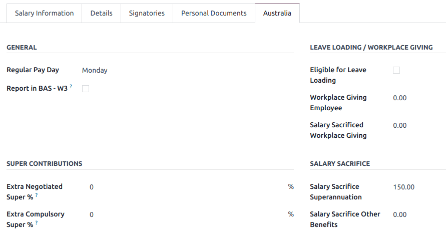

Employee private information
~~~~~~~~~~~~~~~~~~~~~~~~~~~~

In addition, some personal employee information is required for payroll compliance with Single Touch
Payroll, and to process superannuation payments. Open the employee's :guilabel:`Private Information`
tab and fill in the following fields:

- :guilabel:`Private Address`
- :guilabel:`Private Email`
- :guilabel:`Private Phone`
- :guilabel:`Date of Birth`

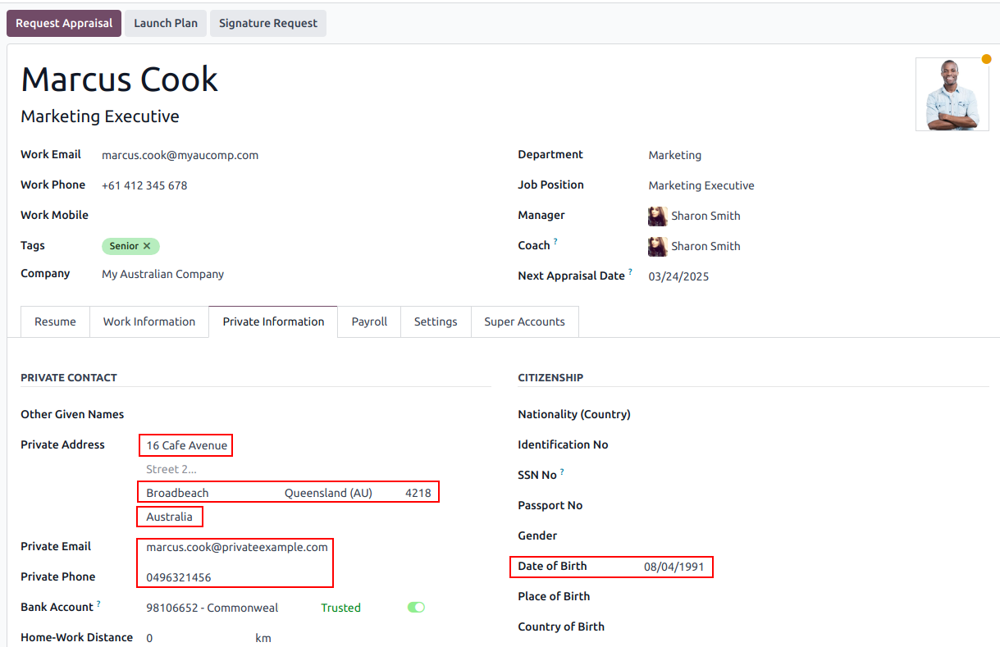

.. note::
   Odoo will remind you to complete the required data at different stages of the process.

Super accounts and funds
~~~~~~~~~~~~~~~~~~~~~~~~

You can add the superannuation details of new employees under the employee's :guilabel:`Super
Accounts` tab. Click :guilabel:`Add a line` and make sure to include the :guilabel:`Member Since`
date, :guilabel:`Member Number`, and :guilabel:`Super Fund`.

..  tip::
    Use the :guilabel:`Proportion` field if an employee's contributions should sent to multiple
    funds at a time.

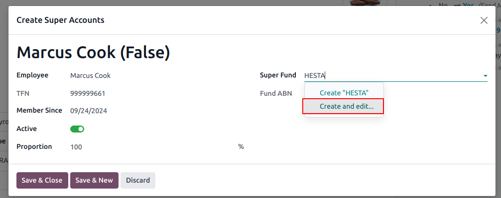

To create a new :guilabel:`Super Fund`, start typing its name and click :guilabel:`Create and
edit...`. Fill in its :guilabel:`Address`, :guilabel:`ABN`, :guilabel:`Type` (APRA / SMSF),
unique identifier (:guilabel:`USI` for APRA, and :guilabel:`ESA` for SMSF), and, for SMFS only, its
:guilabl:`Bank Account`.

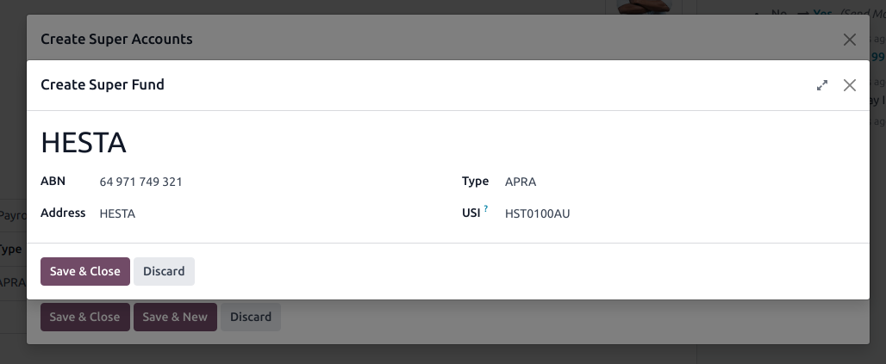

..  tip::
    Manage all super accounts and funds by going to :menuselection:`Payroll --> Configuration -->
    Super Funds / Super Accounts`.

.. important::
   Odoo is currently in the process of becoming SuperStream-compliant.

Contracts
~~~~~~~~~

Once the employee has been created, create their employment contract by clicking the :icon:`fa-book`
:guilabel:`Contracts` smart button, or by going to :menuselection:`Employees --> Employees -->
Contracts`.

.. note::
   Only one contract can be active per employee at a time. However, an employee can be assigned
   consecutive contracts during their employment.

Employment contract creation: recommended steps
***********************************************

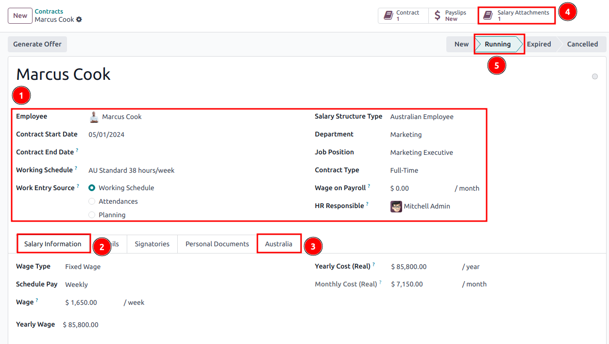

**1. Basic contractual information**

   a. Select the :guilabel:`Contract Start Date` and :guilabel:`Working Schedule` (set, or flexible
      for casual workers).
   b. Keep the :guilabel:`Salary Structure Type` set to :guilabel:`Australian Employee`. This
      structure covers all of the ATO's tax schedules.

.. _australia/payroll/work-entry-source:

   c. (if using the Attendances or Planning app) Select the :guilabel:`Work Entry Source` to define
      how working hours and days are accounted for on the employee's payslip.

      - :guilabel:`Working Schedule`: work entries are automatically generated based on the
        employee's working schedule, starting from the contract's start date.

        .. example::
           An employee works 38 hours a week, their contract begins on 01/01, today's date is 16/01,
           and the user generates a pay run from 14/01 to 20/01. The working hours on the payslip
           will be automatically calculated to be 38 hours (5 * 7.36 hours) if no unpaid leave is
           taken.

      - :guilabel:`Attendances`: the working schedule is ignored, and work entries are only
        generated after clocking in and out of the Attendances app. Note that attendances can be
        imported.
      - :guilabel:`Planning`: the working schedule is ignored, and work entries are generated from
        planning shifts in the Planning app.

      .. important::
         Timesheets do not impact work entries in Odoo.

**2. Salary Information tab**

   a. :guilabel:`Wage Type`: select :guilabel:`Fixed Wage` for full-time and part-time employees,
      and :guilabel:`Hourly Wage` for casual workers. The latter allows you to add a
      :guilabel:`Casual Loading` percentage.

      .. note::
         For hourly workers, the :guilabel:`Hourly Wage` field should exclude casual loading.

   b. :guilabel:`Schedule Pay`: in Australia, only the following pay run frequencies are accepted:
      :guilabel:`Daily`, :guilabel:`Weekly`, :guilabel:`Bi-weekly` (or fortnightly),
      :guilabel:`Monthly`, and :guilabel:`Quarterly`.
   c. :guilabel:`Wage` /*period*: assign a wage to the contract according to their pay frequency.
      On payslips, the corresponding annual and hourly rates will be computed automatically.

**3. Australia tab**

   .. image:: australia/payroll-contract-australia.png
      :alt: Australia tab of a contract

   a. :guilabel:`General`

      - Add the :guilabel:`Regular Pay Day` if relevant.
      - Enable :guilabel:`Report in BAS - W3` if you choose to add PAYG withholding amounts in BAS
        section W3 instead of W2 (refer to the `ATO's web page on PAYG withholding
        <https://www.ato.gov.au/businesses-and-organisations/preparing-lodging-and-paying/business-activity-statements-bas/in-detail/instructions/payg-withholding-how-to-complete-your-activity-statement-labels#W3Otheramountswithheldexcludinganyamount>`_
        for more information).

   b. :guilabel:`Leave loading / workplace giving`

      - Define whether your employees are :guilabel:`Eligible for Leave Loading`.
      - Set the :guilabel:`Workplace Giving Employee` amount in exchange for deductions.
      - Set the :guilabel:`Salary Sacrificed Workplace Giving` amount (e.g., receiving a benefit
        instead of a deduction).

   c. :guilabel:`Super contributions`

      - Add the :guilabel:`Extra Negotiated Super %` on top of the *super guarantee*.
      - Add the :guilabel:`Extra Compulsory Super %` as per industrial agreements or awards
        obligations.

   d. :guilabel:`Salary sacrifice`

      - :guilabel:`Salary Sacrifice Superannuation` allows employees to sacrifice part of their
        salary in favor of reportable employer superannuation contribution (RESC).
      - :guilabel:`Salary Sacrifice Other Benefits` allows them to sacrifice part of their salary
        towards some other form of benefit (refer to the `ATO's web page on Salary sacrificing for
        employees <https://www.ato.gov.au/individuals-and-families/jobs-and-employment-types/working-as-an-employee/salary-sacrificing-for-employees>`_
        for more information).

        .. note::
           As of Odoo 18, salary sacrificing for other benefits currently does not impact fringe
           benefits tax (FBT) reporting.

.. _australia/payroll/salary-attachments:

**4. Salary attachments**

   If the employee is to receive additional recurring payments every pay run, whether indefinitely
   or for a set number of periods, click the :icon:`fa-book` :guilabel:`Salary Attachments` smart
   button on the contract. Choose a :guilabel:`Type` and a :guilabel:`Description`.

   .. note::
      Around 32 recurring salary attachment types exist for Australia. These are mostly related to
      allowances and child support. `Contact us <https://www.odoo.com/help>`_ for more information
      as to whether allowances from your industry can be covered.

**5. Run the contract**

   .. image:: australia/payroll-contract-run.png
      :alt: Example of a running contract

   Once all the information has been completed, change the contract stage from :guilabel:`New` to
   :guilabel:`Running`.

Prepare pay runs
----------------

Regular
~~~~~~~

Pay runs are created by going to :menuselection:`Payroll --> Payslips --> Batches`. After clicking
:guilabel:`New`, enter a :guilabel:`Batch Name`, select a :guilabel:`Period`, and click
:guilabel:`Generate Payslips`

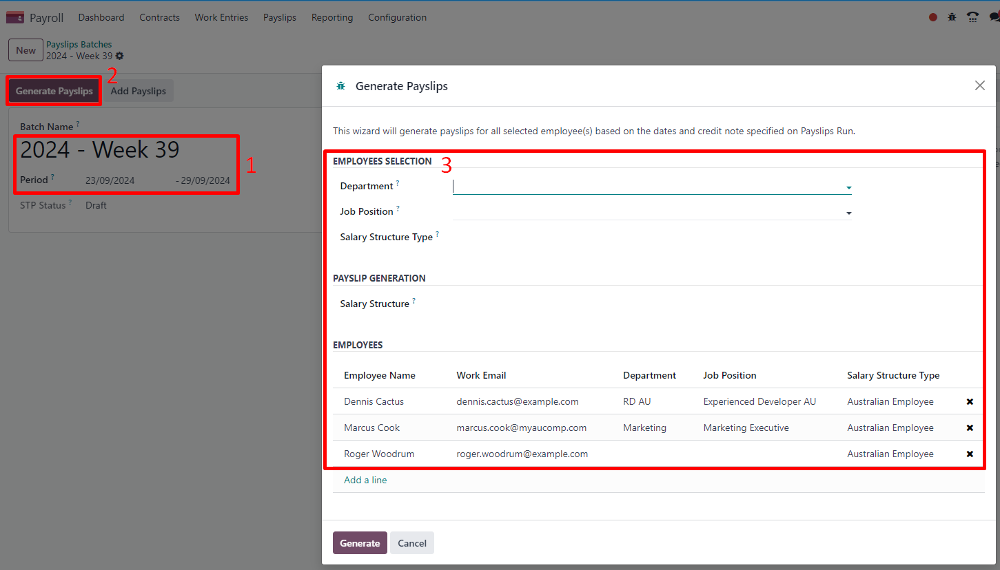

Employees on a pay run can be filtered down by :guilabel:`Department` and :guilabel:`Job Position`.
There is no limit to the amount of payslips that can be created in one batch. After clicking
:guilabel:`Generate`, one payslip is created per employee in the :guilabel:`Waiting` stage, in which
they can be reviewed and amended before validation.

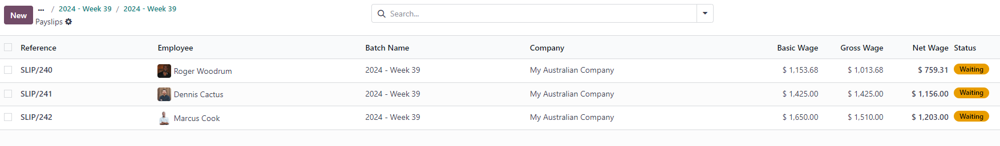

On the payslip form view, there are two types of inputs:

- :guilabel:`Worked days` are computed based on the :ref:`work entry source set on the employee's
  contract <australia/payroll/work-entry-source>`. :ref:`Work entries can be configured
  <australia/payroll/work-entry-types>` according to different types: attendance, overtime,
  Saturday rate, Sunday rate, public holiday rate, etc.
- :guilabel:`Other inputs` are individual payments or amounts of :ref:`different types
  <australia/payroll/other-input-types>` (allowances, lump sums, deductions, termination payments,
  leaves, etc.) that have little to do with the hours worked during the current pay period. The
  :ref:`previously configured salary attachments <australia/payroll/salary-attachments>` are simply
  recurring other inputs attached to a contract.

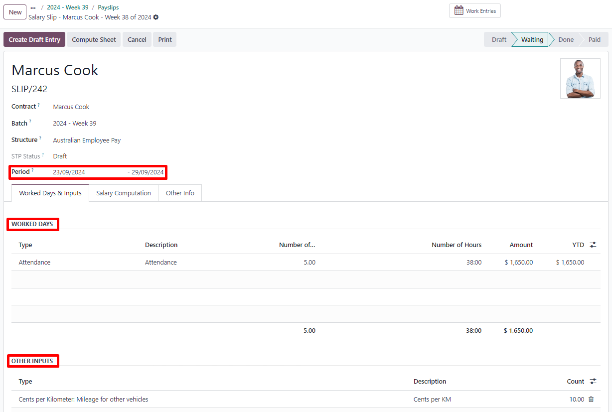

Under the :guilabel:`Salary Computation` tab, Odoo automatically computes payslip rules based on
employees, contracts, worked hours, other input types, and salary attachments.

The salary structure *Australian Employee* has 35 payslip rules that automatically compute and
dynamically display according to the payslip inputs.

.. example::

   .. image:: australia/payroll-payslip-salary.png
      :alt: Salary computation tab of a payslip

   The following rules apply for that pay period in the above example:

   - :guilabel:`Basic Salary`: pre-sacrifice gross salary
   - :guilabel:`Ordinary Time Earnings`: amount to which the super guarantee percentage needs to be
     applied
   - :guilabel:`Salary Sacrifice Total`: includes the $150 sacrificed to superannuation
   - :guilabel:`Taxable Allowance Payments`: includes the $10 allowance (*cents per KM* in this
     case)
   - :guilabel:`Taxable Salary`: gross salary amount minus non-taxable amounts
   - :guilabel:`Salary Withholding` and :guilabel:`Total Withholding`: amounts to be withheld from
     the taxable salary
   - :guilabel:`Net Salary`: the employee's net wage
   - :guilabel:`Concessional Super Contribution`: in this scenario, the amount sacrificed to
     superannuation, payable to the employee's super fund in addition to the super guarantee
   - :guilabel:`Super Guarantee`: as of 01 July 2024, it is computed as 11.5% of the ordinary time
     earnings amount

.. note::
   As of Odoo 18, the most recent tax schedule rates (2024-2025) have been updated for all salary
   rules and computations.

Out-of-cycle
~~~~~~~~~~~~

In Australia, payslips created without a batch are considered to be *out-of-cycle* runs. Create them
by going to :menuselection:`Payroll --> Payslips --> Individual Payslips`. The same payslip rules
apply, but the way these payslips are submitted to the ATO in the frame of Single Touch Payroll
(STP) is slightly different.

.. important::
   As of Odoo 18, adding an out-of-cycle payslip to an existing batch is **not** recommended.

Finalise pay runs
-----------------

Validate payslips
~~~~~~~~~~~~~~~~~

Once all payslip data is deemed correct, click :guilabel:`Create Draft Entry` on the payslip batch.
This can also be done payslip by payslip for control reasons.

This has several impacts:

- Marking the batch and its payslips as :guilabel:`Done`.
- Creating a draft accounting entry per payslip or one entry for the whole batch, depending on your
  payroll settings. At this stage, accountants can post entries to affect the balance sheet, P&L
  report, and BAS report.
- Preparing the STP submission (or payroll data to be filed to the ATO as part of STP compliance).
  This needs to be performed by the :guilabel:`STP Responsible` user, defined under
  :menuselection:`Payroll --> Configuration --> Settings`.
- Preparing super contribution lines as part of SuperStream compliance. This needs to be done by the
  :guilabel:`HR Super Send` user selected under :menuselection:`Payroll --> Configuration -->
  Settings`.

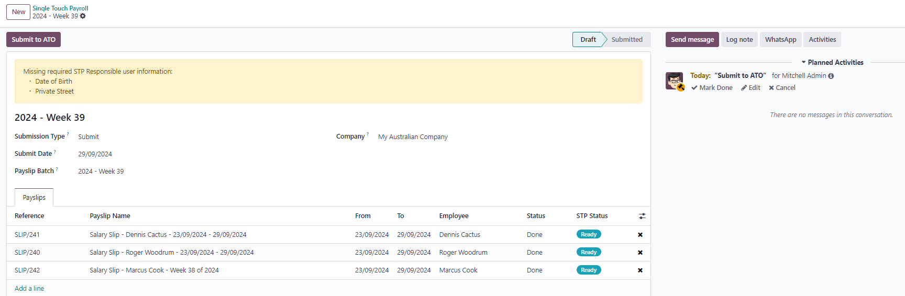

Submit payroll data to the ATO
~~~~~~~~~~~~~~~~~~~~~~~~~~~~~~

.. important::
   Odoo is currently in the process of becoming compliant with STP Phase 2, and this step described
   above does not submit data yet to the ATO.

As per ATO requirement, STP submission for a pay run needs to be done on or before the pay day. For
this reason, submit your STP data to the ATO first before proceeding with payment. To do so, click
:guilabel:`Submit to ATO` on the payslip batch.

On the STP record for this pay run, a few useful information is displayed:

- a warning message if important information is missing,
- an automatically generated activity for the STP responsible user, and
- a summary of payslips contained in this pay run, auditable from this view.

Once the STP record is ready to go, click :guilabel:`Submit to ATO`, then read and accept the
related terms and conditions.

Pay employees
~~~~~~~~~~~~~

Once the ATO submission is complete, you can proceed to pay your employees. To facilitate the
payment matching process, remember to post the payslip-related journal entries prior to validating a
payment.

Although you may decide to pay your employees individually, we recommend creating a batch payment
from your payslip batch. To do so, click :guilabel:`Pay` on the payslip batch, and select
:guilabel:`ABA Credit Transfer` as the :guilabel:`Payment Method`.

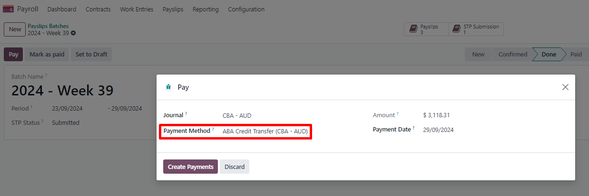

This has two impacts:

- Marking the batch and its payslips as :guilabel:`Paid`.
- Creating a :guilabel:`Payment Batch` linked to the payslip batch.

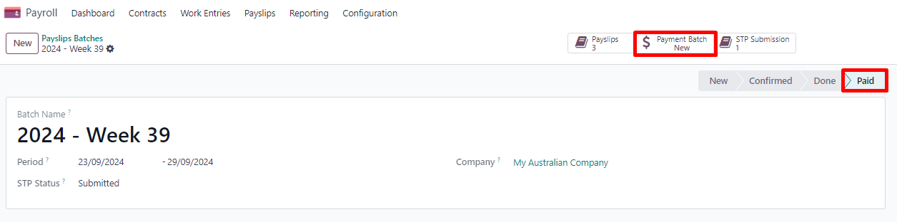

When receiving the bank statement in Odoo, you can now match the statement line with the batch
payment in one click. The payment is not reconciled against the payslip batch, and all individual
payslips.

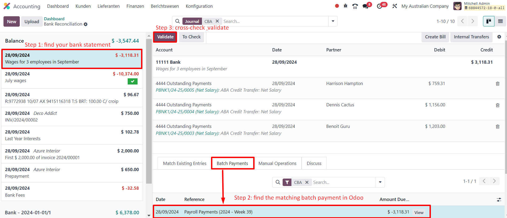

Impact on accounting
~~~~~~~~~~~~~~~~~~~~

Depending on the employee and contract configuration, the journal entry linked to a payslip will be
more or less exhaustive.

.. example::
   For instance, here is the journal entry generated by the employee Marcus Cook configured above.

   .. image:: australia/payroll-accounting-entry.png
      :alt: Example of a journal entry for a payslip

Once posted, predefined accounts will impact the company's balance sheet (PAYGW, wages, and
superannuation liabilities) and profit & loss report (wages and superannuation expenses). In
addition, the employee's gross wage and PAYG withholding will update the BAS report for the relevant
period (see Tax Grid: W1 and W2). Accounts can be adjusted to the company's chart of accounts.

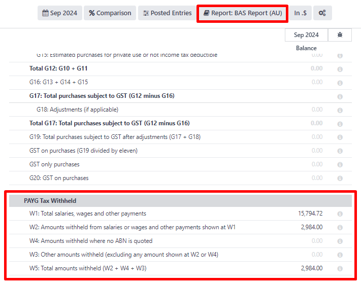

Other payroll flows
-------------------

Paying super contributions
~~~~~~~~~~~~~~~~~~~~~~~~~~

.. important::
   Odoo has a partnership with a clearing house to process both superannuation payments and data to
   the right funds in one click, via direct debit. Odoo is currently in process of becoming
   compliant with SuperStream, and an announcement will be made as soon as superannuation
   contributions can be processed via Odoo's payroll solution.

Once a quarter (or more frequently, in preparation for *Payday Super*), you have to process
superannuation payments to your employees' super funds. To do so, go to :menuselection:`Payroll -->
Reporting --> Super Contributions`.

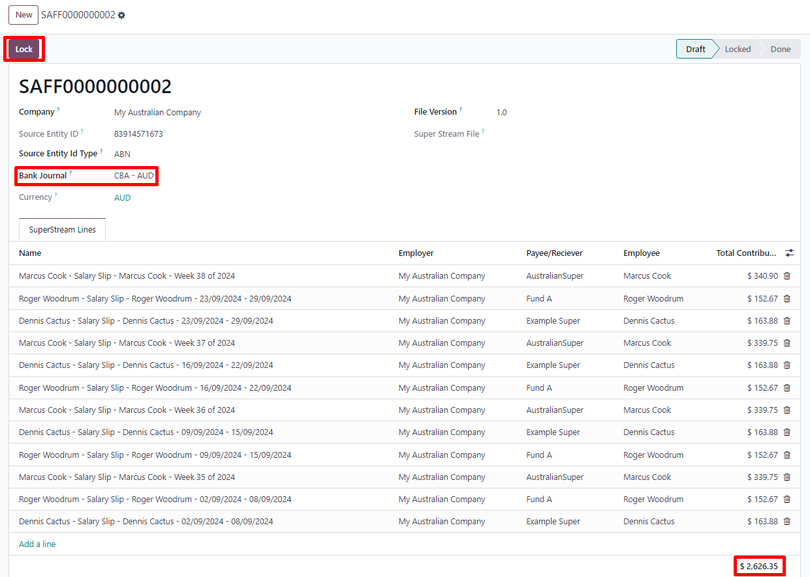

When ready to pay, add the :guilabel:`Bank Journal` that will be used to pay the super from, then
click :guilabel:`Lock` to prevent the contributions from subsequent payslips from being added to
that file. Instead, a new Super file will be created.

Once the payment has been processed, it can be traced back to the Super file and matched with a bank
statement.

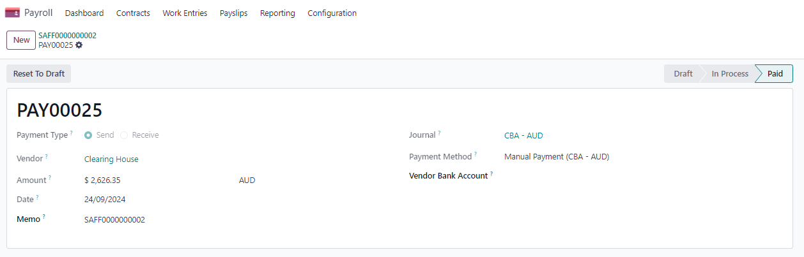

Terminating employees
~~~~~~~~~~~~~~~~~~~~~

Employees can be terminated by going to :menuselection:`Payroll --> Reporting --> Terminate
Employee`.

The following fields must be completed:

- :guilabel:`Contract End Date`: once the termination is validated, this date will be added to the
  contract automatically, and mark the contract as :guilabel:`Expired` when the date has been
  reached.
- :guilabel:`Cessation Type Code`: a mandatory field for the ATO's STP reporting.
- :guilabel:`Termination Type`: the type of redundancy (genuine or non-genuine) affects the
  computation of unused annual and long service leave withholding.

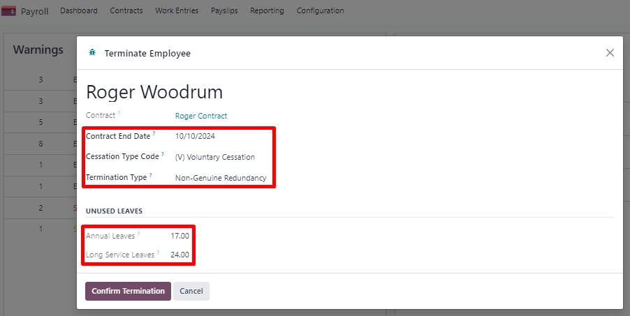

The balance of unused annual leaves and long service leaves is displayed for reference.

Confirming the termination creates an out-of-cycle payslip with the tag :guilabel:`final pay`. It
computes the worked days until the contract end date, in addition to the employee's unused annual
and long service leave entitlements.

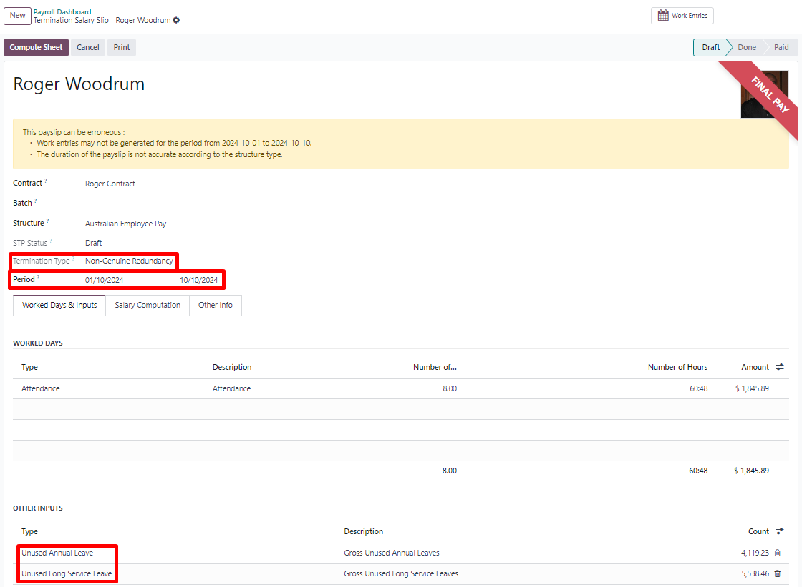

Odoo automatically computes unused leaves entitlements based on the employee's current hourly rate
leave loading (for annual leaves only), and the remaining leave balance. However, these amounts can
be manually edited in the :guilabel:`Other Inputs` table if necessary.

Employment Termination Payments (ETP) can also be added to the :guilabel:`Other Inputs` table. Odoo
has a comprehensive list of excluded and non-excluded ETPs for companies to select from.

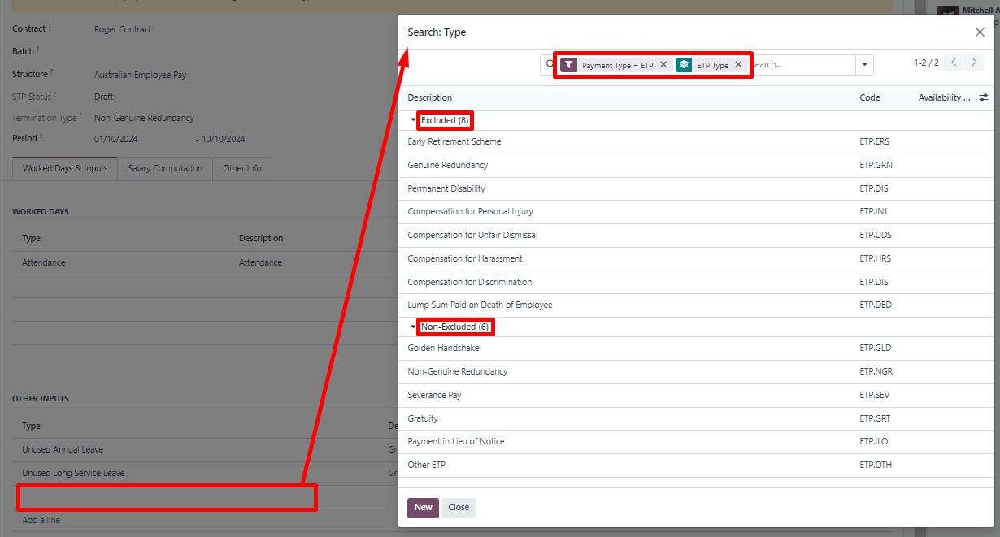

.. note::
   Withholding for both unused leaves and ETPs are computed according to the ATO's schedule 7 and
   schedule 11 and updated as of 01 July 2024.

.. tip::
   Once an employee has been terminated and the last detailed of their employment resolved, you can
   archive the employee by clicking the :icon:`fa-cog` (:guilabel:`Actions`) icon, then
   :icon:`oi-archive` :guilabel:`Archive` on the employee's form view.

Switching from another STP software to Odoo
~~~~~~~~~~~~~~~~~~~~~~~~~~~~~~~~~~~~~~~~~~~

When switching from another STP-enabled software to Odoo, you might need to maintain a continuity in
the YTD values of your employees. Odoo allows importing employees' YTD values by going to
:menuslection:`Payroll --> Configuration --> Settings` and clicking :guilabel:`Import YTD Balances`.

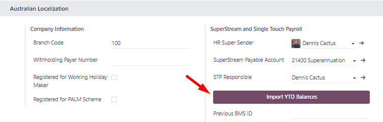

For the ATO to recognize the employee records of your previous software and keep a continuity in
Odoo, you must enter the:

- :guilabel:`Previous BMS ID` (one per database)
- :guilabel:`Previous Payroll ID` (one per employee)

Ask your previous software provider if you cannot find its BMS ID or your employees' payroll IDs.

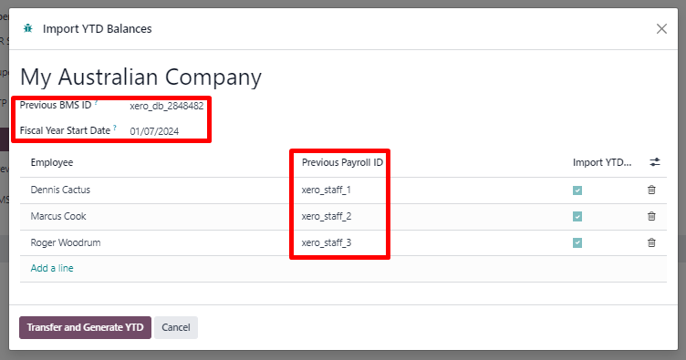

This will give you the opportunity to add in your employees' YTD opening balances in the current
fiscal year. The ATO reports on a lot of different types of YTD. These are represented by the 13
following :guilabel:`Salary Rules` in Odoo.

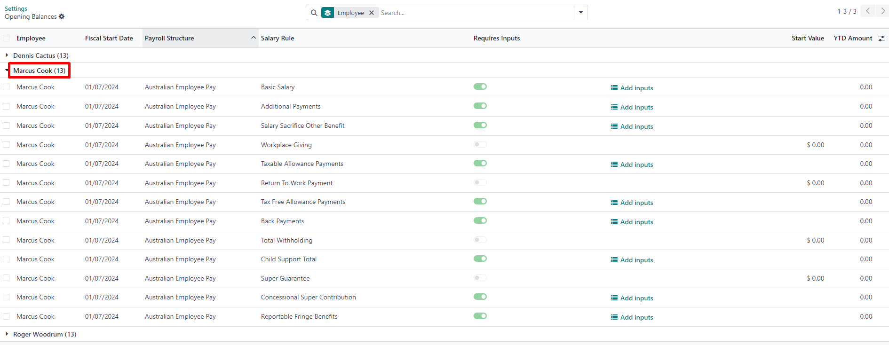

.. example::
   Let us say that the employee Marcus Cook has been transitioned from another STP-enabled software
   on September 1. Marcus has received two monthly payslips in his previous software (for July and
   August). Here are the YTD balances Marcus's company needs to transfer to Odoo:

   .. list-table::
      :header-rows: 1

      * - YTD category
        - YTD balance to transfer
      * - Gross (normal attendance)
        - $13,045.45
      * - Gross (overtime)
        - $1,000
      * - Paid leave
        - $954.55
      * - Laundry allowance
        - $200
      * - Total withholding
        - $2,956
      * - Super Guarantee
        - $1,610

If some YTD balances need to be reported with more granularity to the ATO, you can use the salary
rule's inputs.

.. example::
   For instance, the *Basic Salary* rule can contain 6 inputs, and 3 are necessary in our example:
   regular gross amounts, overtime, and paid leaves. These are all reported differently in terms of
   YTD amounts.

   .. image:: australia/payroll-ytd-basic-rule.png
      :alt:

The finalised YTD opening balances for Marcus Cook look like the following.

.. image:: australia/payroll-.png
   :alt:

As a result, YTD computations on payslips will be based on the employee's opening balances instead of starting from zero.

STP Finalisation
~~~~~~~~~~~~~~~~

.. important::
   Odoo is currently in the process of becoming compliant with STP Phase 2, and the finalisation
   flows described below do not yet submit data to the ATO.

EOFY finalisation
*****************

Employers reporting through Single Touch Payroll need to make a finalisation declaration by 14 July each year. You can do this in Odoo by going to Payroll ‣ Reporting ‣ STP Finalisation.

.. image:: australia/payroll-.png
   :alt:

Odoo will show you both active and terminated employees to finalise.

.. image:: australia/payroll-.png
   :alt:

From the finalisation form view, you can proceed with a final audit of all payslips for your employees during the relevant financial year. Once ready, click on Submit to ATO. When you have made the finalisation declaration, your employees will see the status of their payment information change to 'tax ready' on their online income statement after the end of the financial year.

Individual finalisation
***********************

Odoo also allows you to finalise employees individually during the year. This can be useful when:
One-off payments are made after a first finalisation
Finalisation after termination of employment during the year

To proceed with an individual finalisation, on the STP Finalisation pop-up window, simply leave the EOFY Declaration checkbox unticked and add your employees to be finalised manually one by one.

.. image:: australia/payroll-.png
   :alt:

Even if you finalise an employee record partway through the financial year, the ATO will not pre-fill the information into the employee's tax return until after the end of the financial year.

Adjustments
~~~~~~~~~~~

.. important::
   Odoo is currently in the process of becoming compliant with STP Phase 2, and the adjustment flows
   described below do not yet submit data to the ATO.

Amend finalisation
******************

If you need to amend YTD amounts for an employee after a finalisation declaration was made, Odoo can help you remove the finalisation indicator for that employee. To do so, open the STP finalisation pop-up window, select the employee and leave the Finalisation checkbox unticked.

.. image:: australia/payroll-.png
   :alt:

When ready, simply click on Submit to ATO to file the finalisation update to the ATO.

.. image:: australia/payroll-.png
   :alt:

Once the correct YTD details are ready for that employee after amendment, simply finalise that employee again. Please note that the ATO expects employers to correct errors within 14 days of detection or, if your pay cycle is longer than 14 days (e.g. monthly), by the date you would be due to lodge the next regular pay event. Finalisation amendments can be done through STP up to five years after the end of the financial year.

Finalising and amending finalisation for a single employee can also be useful when rehiring an employee within the same financial year. You might have finalised the employee after termination in January, but rehired them in March.

Full file replacements
**********************

Full file replacements of pay runs is an action that an employer can take to replace the last lodgement sent to the ATO if it turns out to contain significantly inaccurate data.

In Odoo, the last STP submission will show the button Replace File.

.. image:: australia/payroll-.png
   :alt:

Odoo will allow you to select which payslips need to be reset. Resetting Payslips won't create new payslips or a new payrun. Instead:

- The payslips batch will be reset from “Paid” or “Done” to “Confirmed”
- The status of the reset payslips will revert back to “Draft”
- The correct payslips will remain paid and matched against the original payment
- A new STP submission will be created to replace the former one. For traceability purposes, the former STP submission will not be deleted, but will be marked as replaced

First, correct the reset payslips and create their draft entry. Once done, the button Submit to ATO reappears on the payslip batch to process the full file replacement.

.. image:: australia/payroll-.png
   :alt:

When ready, submit the pay run to the ATO once again. If the data sent to the ATO is still incorrect, please note that full file replacements can only be done once every 24 hours. If the same pay run needs to be replaced a second time, make sure not to validate any new payslip or payslip batch until the full file replacement with accurate data has been submitted.

Zero out YTD values
*******************

In case of a mid-year change of the following 5 key identifiers, YTD values need to be zeroed out, then re-posted with the updated key identifier:
Company identifiers: ABN, Branch Code and BMS ID (all employees need to be zeroed out)
Employee identifiers: TFN and Payroll ID (individual employees can be zeroed out)

To do so in Odoo, go to Payroll ‣ Reporting ‣ Single Touch Payroll before updating any key identifiers. Create a new STP submission, but change the submission type from Submit to Update. Then, tick the checkbox Zero Out YTD.

.. image:: australia/payroll-.png
   :alt:

Submit to ATO, then modify the key identifiers to amend. Finally, go back to Payroll ‣ Reporting ‣ Single Touch Payroll and post a new update event but this time, without ticking the Zero Out YTD checkbox. This will notify the ATO that the previously-recorded YTD balances are to be adjusted to the new key identifiers.

Payroll links to other apps
---------------------------

Time off
~~~~~~~~

The Time Off app is natively integrated with the payroll application in Odoo. Different types of leaves will populate payslips based on the concept of Work Entries. To configure Time Off Types correctly, go to Time Off ‣ Configuration ‣ Time Off Types.

For each type, configure the following 2 fields correctly:
Work Entry Type: will define which work entry will be selected on the Worked Days table of your payslip.
Unused Leave Type: choose between annual, long service, or personal. If “Personal” is selected, the remaining leave balance for this time off type will not show up as an entitlement at time of termination. Unused leaves of the type “Annual” will include leave loading, in cases the employee is eligible for it.

.. image:: australia/payroll-.png
   :alt:

See also
Time off documentation

Expenses
~~~~~~~~

The Expenses app is also natively integrated with the payroll in Odoo. First of all, go to Expenses ‣ Configuration ‣ Settings and enable “Reimburse in Payslip”.

.. image:: australia/payroll-.png
   :alt:

Let us assume that one of the employees on your payroll submitted an approved expense to be reimbursed. You can reimburse employees using 2 ways:

- If the expense is to be reimbursed outside of a pay run, click on Post Journal Entries. The payment must be made manually.
- If the expense is to be reimbursed as part of the next pay run, click on Report in Next Payslip.

.. image:: australia/payroll-.png
   :alt:

After an expense has been added to the next payslip, you can find it in the Other Inputs table. This input type is then computed as an addition to the Net salary.

.. image:: australia/payroll-.png
   :alt:

After paying the employee, the payslip's journal item related to the employee's reimbursement is automatically matched against the expense's vendor bill.

.. image:: australia/payroll-.png
   :alt:

See also
Expenses documentation

Advanced configurations
-----------------------

.. _australia/payroll/other-input-types:

Other input types
~~~~~~~~~~~~~~~~~

You can access other input types by going to Payroll ‣ Configuration ‣ Other Input Types. There are 63 other input types related to Australia. We do not recommend using the other ones as part of your payroll solution, since they can't be used in the frame of Single Touch Payroll. Feel free to archive or delete them.

.. image:: australia/payroll-.png
   :alt:

On each input type, the following 4 fields are important to understand:
Payment Type: these classify input types in 6 categories: allowances, deductions, ETPs, leaves, lump sums and others. More details below.
PAYGW Treatment: Regular, No PAYG Withholding, or Excess Only (for allowances). This field affects how Odoo withholds tax for this input type.
Superannuation treatment. OTE, Salary & Wages, or Not Salary & Wages.
STP Code: this field is only visible in developer mode. It tells Odoo how to report the gross value of this payment to the ATO. We do not recommend changing the value of this field if it was already set by default.

Grouping your other input types by Payment Type will help you understand the different scenarios in which these inputs can be used:

.. image:: australia/payroll-.png
   :alt:

#. Allowance: a separate amount you pay to your employees in addition to salary & wages. Some of these allowances are mandated by modern awards: laundry, transport, etc.

   .. important::
      If you plan to use allowances subject to varied rates of withholding (such as cents per KM or travel allowances), please contact our teams to see whether Odoo currently covers your business case.

   .. note::
      - As of Odoo 18, some allowances such as “Laundry: Allowance for approved uniforms” are managed by 2 other inputs: one to lodge the amount paid up to the ATO limit, and the other one to lodge the amount exceeding the ATO limit. This is necessary for Odoo to compute PAYGW correctly.
      - Some businesses may require to shift the reporting of an allowance from OTE to Salary & Wages depending on the employee. In this case, you will need to duplicate and re-configure an existing other input type. For example, “Work-Related Non-Expense” allowance is OTE by default.

#. Deduction: union fees and child support deductions are considered deductions.
#. ETP: employment termination payments. These are either considered excluded or non-excluded (see ATO's documentation).
#. Leave: leave-related other inputs that are not pertaining to a single pay period (lump sum, cashing out leaves while in service, unused leaves,...).
#. Lump Sum: return to work and lump sum E (for back payments) fall under this category.
#. Other: other payments with their own specific logic.

.. _australia/payroll/work-entry-types:

Work entry types
~~~~~~~~~~~~~~~~

A Work Entry Type is a type of attendance for your employees (e.g. attendance, paid leave, overtime,...). A few work entry types are created by default in every Australian database.

.. image:: australia/payroll-.png
   :alt:

Before you start using Odoo's payroll solution for Australia, it is recommended you trim work entry types to keep the ones you need only.

For each type, make sure to configure the following 3 fields for Australia:
Is OTE: determines whether time spent in this category can be considered ordinary time earnings, meaning that the superannuation guarantee rate will apply. For example: regular attendance, paid leave,...
Penalty Rate: used to determine the percentage of penalty that applies to time spent in this category. It is important that you configure the penalty rate that applies in your State / industry according to the type of work. For example: Saturday rate, Sunday rate, overtime rate, etc.
STP Code: this field is only visible in developer mode. It tells Odoo how to report the time spent in this category to the ATO. We do not recommend changing the value of this field if it was already set by default.

Current limitations
-------------------

As of Odoo 18, we do not recommend companies to use the payroll application for the following business flows:

- Income stream types: Foreign Employment Income, and ATO-defined
- Tax treatment category: actors & performers
- Death benefits reporting
- Reporting obligations for WPN (instead of ABN)
- Allowances subject to a varied rate of withholding (such as “Cents per Kilometre” allowance and “Travel Allowances”)

If you would like to make sure whether Odoo fits your payroll requirements in Australia, please contact our direct sales department.

Employment Hero Integration
---------------------------

If your business is already up and running with Employment Hero, you can use our connector as an alternative payroll solution.
The Employment Hero module synchronises payslip accounting entries (e.g., expenses, social charges, liabilities, taxes) automatically from Employment Hero to Odoo. Payroll administration is still done in Employment Hero. We only record the journal entries in Odoo.

Configuration
~~~~~~~~~~~~~

#. Activate the Employment Hero Australian Payroll module (l10n_employment_hero).
#. Configure the Employment Hero API by going to Accounting ‣ Configuration ‣ Settings. More fields become visible after clicking on Enable Employment Hero Integration.

   .. image:: australia/payroll-.png
      :alt:

   - You can find the API Key in the My Account section of the Employment Hero platform.

     .. image:: australia/payroll-.png
        :alt:

   - The Payroll URL is pre-filled with `https://keypay.yourpayroll.com.au`.

     .. warning::
        Do not change the pre-filled Payroll URL

   - You can find the Business ID in the Employment Hero URL. (i.e., 189241)

     .. image:: australia/payroll-.png
        :alt:

   - You can choose any Odoo journal to post the payslip entries.

#. Configure the tax by going to Accounting ‣ Configuration ‣ Taxes. Create the necessary taxes for the Employment Hero payslip entries. Fill in the tax code from Employment Hero in the Matching Employment Hero Tax field.

The API explained
~~~~~~~~~~~~~~~~~

The API syncs the journal entries from Employment Hero to Odoo and leaves them in draft mode. The reference includes the Employment Hero payslip entry ID in brackets for the user to easily retrieve the same record in Employment Hero and Odoo.

.. image:: australia/payroll-.png
   :alt:

By default, the synchronisation happens once per week. You can fetch the records manually by going to Accounting ‣ Configuration ‣ Settings and, in the Enable Employment Hero Integration option, click on Fetch Payruns Manually.
Employment Hero payslip entries also work based on double-entry bookkeeping.
The accounts used by Employment Hero are defined in the section Payroll settings.

.. image:: australia/payroll-.png
   :alt:

For the API to work, you need to create the same accounts as the default accounts of your Employment Hero business (same name and same code) in Odoo. You also need to choose the correct account types in Odoo to generate accurate financial reports.
