=========
Australia
=========

.. _australia/configuration:

Configuration:
========================

.. list-table::
   :widths: 20 25 55
   :header-rows: 1

   * - Module Name
     - Module Key
     - Description
   * - :guilabel:`Australia - Accounting``
     - `l10n_au`
     - Australian accounting basic charts of accounts and localizations. If Australia is selected as a fiscal package in :menuselection:`Accounting -> Configuration -> Fiscal Localization`, this module will be installed automatically. This module will also install the :guilabel:`ABA credit transfer` module and the :guilabel:`Remittance Advice report`.
   * - :guilabel:`Australian Reports - Accounting`
     - `l10n_au_reports`
     - Once :guilabel:`Australia` is selected as a localization package for a company, this module will be installed automatically as well. This includes the :guilabel:`Taxable Payments Annual Reports (TPAR)` and the :guilabel:`BAS report`.
   * - :guilabel:`Australia - Payroll`
     - `l10n_au_hr_payroll`
     - Payroll localization for Australia.
   * - :guilabel:`Australia - Payroll with Accounting`
     - `l10n_au_hr_payroll_account`
     - Instals the link between Australian payroll and accounting. Installing this module will also install all other Australian modules: :guilabel:`Australian - Accounting`; :guilabel:`Australian Reports - Accounting`; :guilabel:`Australia - Payroll`.
   * - :guilabel:`Accounting Customer Statements`
     - `l10n_account_customer_statements`
     - Allows the management and sending of monthly customer statements in the partner ledger and from the contact form. Commonly used in Australia and New Zealand.
   * - :guilabel:`Employment Hero Australian Payroll`
     - `l10n_au_keypay`
     - Employment Hero Payroll Integration. This module will synchronise all pay runs from Employment Hero with Odoo’s journal entries.

.. _australia/coa:

COA:
========================

The Australian chart of accounts is included in the Australian - Accounting module. Go to :menuselection:`Accounting --> Configuration --> Accounting: Chart of Accounts`. to access it.

.. seealso::
   :doc:`../accounting/get_started/chart_of_accounts`

.. _australia/taxes:

Taxes & GST
========================

The default Australian taxes are automatically installed upon installation of the **Australia - Accounting (l10n_au)** which is installed automatically in Australian databases.

These taxes impact the :guilabel:`BAS Report`, which can be accessed through :menuselection:`Accounting --> Reporting --> BAS Report`.

:ref:`BAS Report <australia/bas>`

In Australia, the standard Goods and Services Tax (GST) rate is 10%, but there are different rates and exemptions for specific categories of goods and services. 

.. image:: australia/BAS_1.png
   :align: center

Tax Mapping
-----------------------
Each tax in Odoo has a short name and a description. Within the Australian localisation package, tax names encompass the tax rate as an integral part of their naming convention.

Despite the high amount of taxes in Odoo, these taxes are pretty similar (mostly 0% and 10%), with different tax grid variations for:

- Goods
- Services
- TPAR
- TPAR without ABN
  
.. seealso::
  - :doc:`Taxes <../accounting/taxes>`

The taxes that include a TPAR mention will not only impact the BAS report, but also the TPAR report. Businesses from certain industries need to report payments made to subcontractors from relevant services during the financial year. Odoo combines the use of taxes and fiscal positions to report these payments on the TPAR Report. Taxes with the mention “TPAR without ABN” are used to record amounts withheld from subcontractors without an ABN for the ATO. 

.. seealso::
   :ref:`TPAR <australia/tpar>`

Here are the taxes for Australia in Odoo 17.

.. list-table::
   :widths: 10 30 10 10
   :header-rows: 1

   * - GST Name
     - Description
     - GST Scope
     - GST Type
   * - 10%
     - GST Purchases
     - -
     - Purchases
   * - 10% INC
     - GST Inclusive Purchases
     - -
     - Purchases
   * - 10% C
     - Capital Purchases
     - -
     - Purchases
   * - 0% C
     - Zero Rated Purch
     - -
     - Purchases
   * - 100% T EX
     - Purchase (Taxable Imports) - Tax Paid Separately
     - -
     - Purchases
   * - 10% I
     - Purchases for Input Taxed Sales
     - -
     - Purchases
   * - 10% P
     - Purchases for Private use or not deductible
     - -
     - Purchases
   * - 100% EX
     - GST Only on Imports
     - -
     - Purchases
   * - 10% Adj
     - Tax Adjustments (Purchases)
     - -
     - Purchases
   * - 10%
     - GST Sales
     - -
     - Sales
   * - 10% INC
     - GST Inclusive Sales
     - -
     - Sales
   * - 0% EX
     - Zero Rated (Export) Sales
     - -
     - Sales
   * - 0% EXEMPT
     - Exempt Sales
     - -
     - Sales
   * - 0% I
     - Input Taxed Sales
     - -
     - Sales
   * - 10% Adj
     - Tax Adjustments (Sales)
     - -
     - Sales
   * - 10% TPAR
     - GST Purchases
     - Services
     - Purchases
   * - 10% TPAR NO ABN
     - GST Purchases
     - Services
     - Purchases
   * - 10% INC TPAR
     - GST Inclusive Purchases
     - Services
     - Purchases
   * - 10% INC TPAR N ABN
     - GST Inclusive Purchases
     - Services
     - Purchases
   * - 10% C TPAR
     - Capital Purchases
     - Services
     - Purchases
   * - 10% C TPAR N ABN
     - Capital Purchases
     - Services
     - Purchases
   * - 0% C TPAR
     - Zero Rated Purch TPAR
     - Services
     - Purchases
   * - 0% C TPAR N ABN
     - Zero Rated Purch TPAR without ABN
     - Services
     - Purchases
   * - 100% T EX TPAR
     - Purchase (Taxable Imports) - Tax Paid Separately
     - Services
     - Purchases
   * - 100% T EX TPAR N ABN
     - Purchase (Taxable Imports) - Tax Paid Separately
     - Services
     - Purchases
   * - 10% I TPAR
     - Purchases for Input Taxed Sales
     - Services
     - Purchases
   * - 100% I TPAR N ABN
     - Purchases for Input Taxed Sales
     - Services
     - Purchases
   * - 10% P TPAR
     - Purchases for Private use or not deductible
     - Services
     - Purchases
   * - 10% P TPAR N ABN
     - Purchases for Private use or not deductible
     - Services
     - Purchases
   * - 100% EX TPAR
     - GST Only on Imports
     - Services
     - Purchases
   * - 100% EX TPAR N ABN
     - GST Only on Imports
     - Services
     - Purchases
   * - 10% Adj TPAR
     - Tax Adjustments (Purchases)
     - Services
     - Purchases
   * - 10% Adj TPAR N ABN
     - Tax Adjustments (Purchases)
     - Services
     - Purchases
   * - 47% WH
     - Tax Withheld for Partners without ABN
     - Services
     - Purchases

.. _australia/bas:

BAS Report
========================

The Business Activity Statement (BAS) report is a critical tax reporting requirement for businesses registered for Goods and Services Tax (GST) in Australia. The BAS is used to report and remit various taxes to the Australian Taxation Office (ATO). With the Odoo BAS feature, businesses can report on the following:

- Goods and Services Tax (GST) 
- PAYG tax withheld

.. image:: australia/bas_e1.png
   :align: center

The taxes for GST are collected from the Tax Grid, which is pre-configured in the system. The Tax Grid can also be manually set up for any additional special GST. Once the tax for each account is set up, the system automatically slots journal items into the correct tax category. This ensures that the BAS report is accurate and reflective of the business's financial activities. 

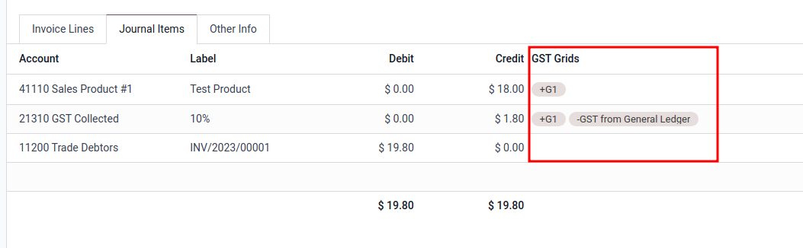

In addition, the BAS report includes the PAYG tax withheld components (W1 to W5, then summary section 4). This integration ensures that all payroll-related withholding taxes are accurately captured and reflected within the report.

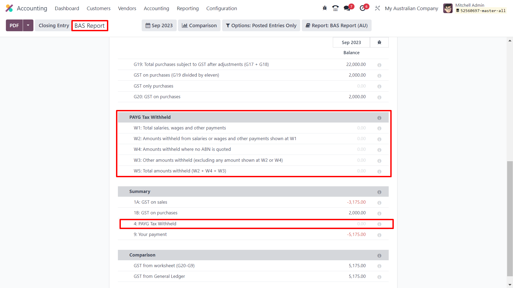

The module incorporates in-built rules that facilitate the automatic calculation of taxes for types W1 to W5. For a detailed walkthrough and more information on the calculation process for these taxes, please refer to the Payroll app documentation.

.. seealso::
   :ref:`Payroll <australia/payroll>`

Closing the BAS report
-------------------------

When it's time to file the tax return with the ATO, select "Close entry”. The tax return period can be configured in :menuselection:`configuration --> Settings --> Tax Return Periodicity`. Also, the start date of the tax return can be defined in Fiscal Periods.

# Add a see also: closing fiscal year

.. note::
   Odoo uses the calendar quarter rather than the Australian FY quarter which means July to September is Q3 in Odoo.

Before closing the entry for the first time, the default GST payable account and GST receivable account need to be set. A notification pops up and redirects the user to tax group configurations.

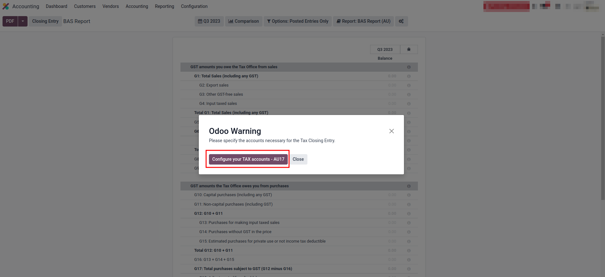

Once the GST payable account and GST receivable account are set up, the BAS report generates an accurate journal closing entry automatically which balances out the GST balance with the GST clearing account (e.g. see “BAS payments” in the image below).

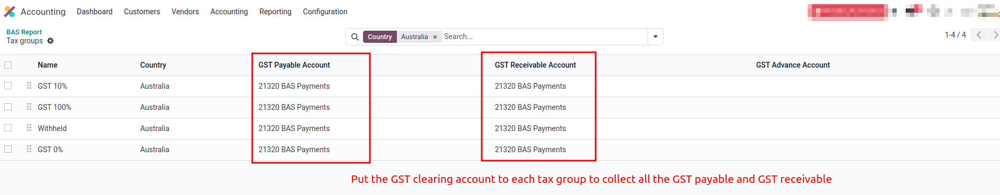

The balance between GST receivable and payable is now set against the tax clearing account defined on the tax group. The amount to be paid to or received from the ATO can now be reconciled against a bank statement.

.. image:: australia/BAS_6.png
   :align: center

.. important::
   In Odoo 17, the BAS report won’t be directly lodged to the ATO at the click of a button. Odoo helps you automatically compute the necessary values in each section, with the possibility to audit them to better understand the history behind these numbers. Businesses can copy these values and enter them on the `ATO’s portal <https://www.ato.gov.au/newsrooms/small-business-newsroom/lodging-your-next-bas>`_. We are currently working hard to give businesses the possibility to lodge their BAS report directly from Odoo to the ATO.

.. _australia/tpar:

TPAR Report (PERO)
========================

Odoo allows businesses to report payments made to contractors or subcontractors during the financial year. This is done by generating a TPAR (Taxable Payments Annual Report). If you are not sure that your business needs this report, refer to the documentation provided by the `ATO <https://www.ato.gov.au/businesses-and-organisations/preparing-lodging-and-paying/reports-and-returns/taxable-payments-annual-report>`_. 
You can find this report in :menuselection:`Accounting ‣ Reporting`: 

.. image:: australia/TPAR_1.png
   :align: center

Configuration
-------------------------

Select Fiscal Position on the Contact form.

.. image:: australia/TPAR_2.png
   :align: center

Upon billing a contact with a fiscal position set to “TPAR”  or “TPAR without ABN”, the report will automatically be generated in Accounting ‣ Reporting.

The report includes the ABN, Total GST, Gross Paid and Tax Withheld from their TPAR  subcontractors. 
- Total GST: total tax paid 
- Gross Paid amounts will show after registering a payment for those bills. 
- Tax Withheld will be shown if the subcontractor is registered with Fiscal Position “TPAR without ABN” 

The following image shows an example of an IT company contracting services from other IT-related companies and subcontractors: 

.. image:: australia/TPAR_3.png
   :align: center

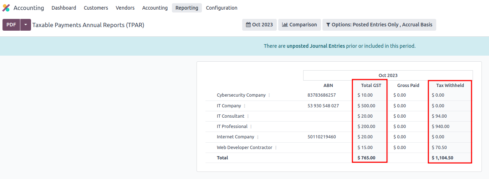

File types that can be exported from Odoo: 
- PDF
- XLSX 

.. _australia/custstate:

Customer Statements (Dymo)
================================================

Customer statements can be downloaded by going to Apps ‣ Accounting Customer Statements.
This module allows customers to see their financial transactions as well as overdue statement details. These statements can be sent out to customers by email.

The customer statements can be found on Customers ‣ Print Customer Statements.

.. image:: australia/CUSTSTATE_1.png
   :align: center

This will automatically print out the customer statements for the month.

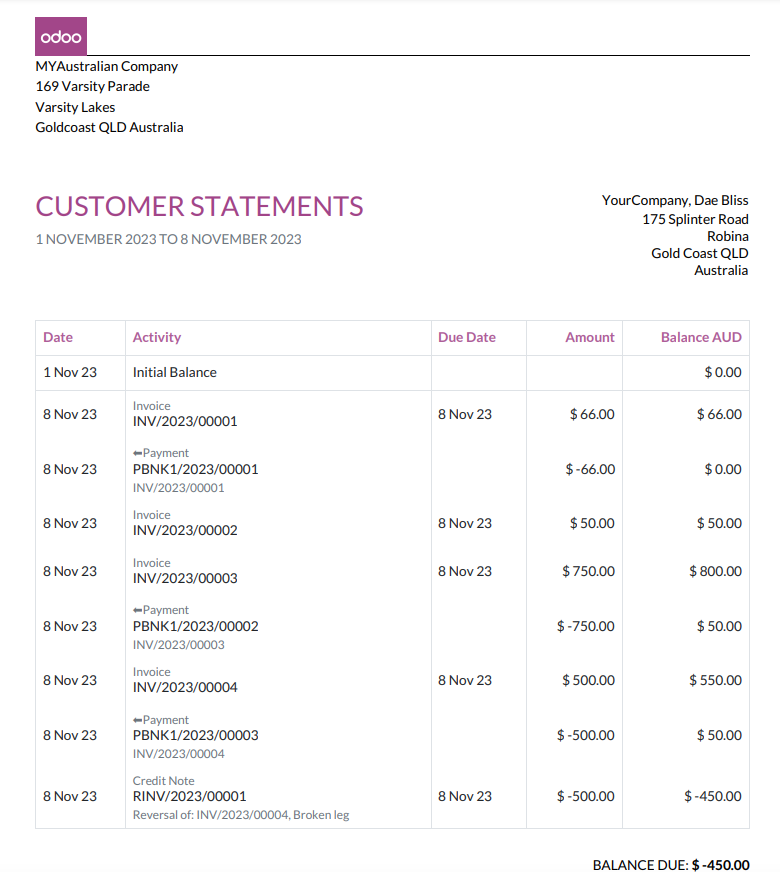

Changing the dates of the customer statements can be done by going to  Accounting ‣ Reporting ‣ Partner Ledger. The Partner ledger creates the ability to select a specific date range for the customer statements. 

.. image:: australia/CUSTSTATE_3.png
   :align: center

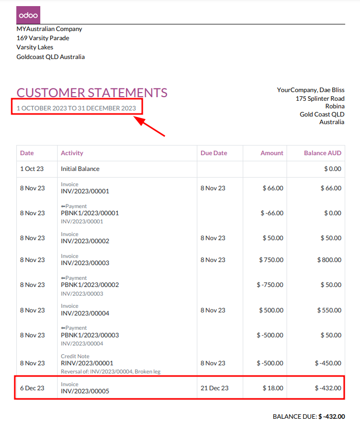

.. _australia/remittance:

Remittance Advice (Dymo)
================================================

Remittance Advice can be accessed by going to Accounting ‣ Vendors ‣ Payments and printing out the “Payment Receipt”

.. image:: australia/REMITENCE_1.png
   :align: center

.. _australia/peppol:

E-Invoicing via Peppol (Dymo)
================================================
Odoo is compliant for Australia and New Zealand, refer to here to learn more about AU-NZ Peppol format. 

.. _Link to Payroll:

.. _australia/starshipit:

Set up Starshipit shipping services in Odoo (PERO)
========================================================================
Starshipit is a shipping service operator that connects companies with many Australasian shipping carriers. Now that Odoo has a native integration with Starshipit, users can create shipping methods that will automatically get rates from specific couriers (such as Australia Post, NZ Post, DHL,...) based on predefined conditions.

Side note: Odoo is also integrated with `EasyPost <https://www.easypost.com/>`_, which provides a connection with different Australasian couriers as well.

Setup in Starshipit
--------------------------------

To get started, go to `Starshipit’s platform <https://starshipit.com/>`_: 

- Create Account
- Go to Settings
- Enter your pickup address
- Connect your desired couriers

.. image:: australia/STARSHIPIT_1.png
   :align: center

Find Starshipit credentials
--------------------------------

In the Starshipit account, navigate to Settings ‣ API in the menu on the left. 

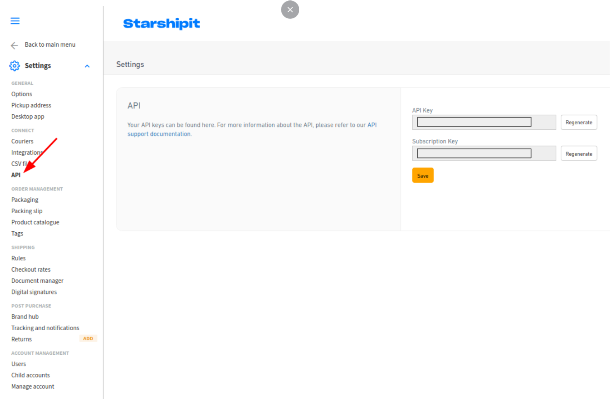

Any issues or questions pertaining to Starshipit only need to be discussed with Starshipit customer support.

Setup in Odoo
--------------------------------

#. To get started, go to Odoo’s Apps module, search for the Starshipit Shipping integration, and install it.

.. image:: australia/STARSHIPIT_3.png
   :align: center

#. Once installed, activate the Starshipit Shipping module in Inventory ‣  Configuration ‣  Settings. The Starshipit Connector setting is found under the Shipping Connectors section.

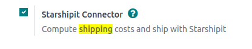

#. Configure the Warehouse address in Inventory ‣ Warehouses ‣ Address

Example: 
If your company ships from a warehouse called “WH1”, the Pickup Address used in Starshipit should also be the WH1 address. 

#. After activating the Starshipit Connector, go to Inventory ‣ Configuration ‣ Delivery ‣ Shipping Methods or click on the “Starshipit Shipping Methods” link below the listed connector. Once on the Shipping Methods page, click “Create”.

.. image:: australia/STARSHIPIT_5.png
   :align: center

Important fields:

- Provider: select Starshipit from the drop-down menu.
- Enter the Starshipit API Key and the Subscription Key under the Starshipit Configuration tab. 
- Choose a Delivery Product (this will be the product shown in the Sales Order, e.g. “Freight”). Note: this is a mandatory field, without a product, you will not be able to select a Service Code from Starshipit.
- Add the Service Code of the Product configured in Starshipit. When you select the service for that shipping method, the name of the Shipping method name will automatically change. Available service codes depend on the carriers integrated in your account Starshipit account.  This can be done on the Starshipit account ‣ Settings ‣ Checkout Rates ‣ Courier Configuration. 

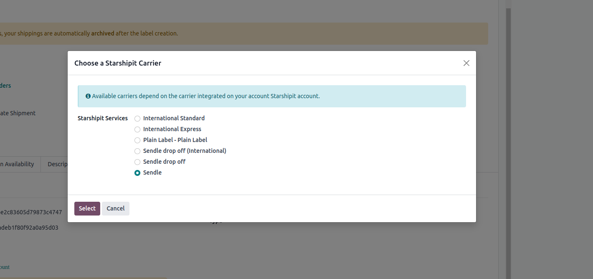

- Manually Save your changes by clicking the cloud icon next to the Shipping Methods / New. 
- Default Package Type: this option is recommended when dealing with packages with weights. You can activate the configuration “Packages” in order to create a new Package Type for Starshipit:

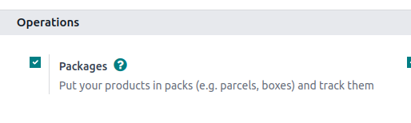

.. image:: australia/STARSHIPIT_8.png
   :align: center

Tip:
Odoo has a built-in layer of protection against unwanted charges when using test environments. In the test environment, if a shipping method is used to create labels, then those labels are immediately cancelled after the creation and archived in Starshipit — this occurs automatically. However, Starshipit does not allow test courier accounts and depending on each courier, and depending on the courier, the account might be charged for printing label, unless the order is cancellled manually on the couriers’s portal. 
The test and production environment settings can be toggled back and forth from the Smart Buttons.

Rate computation
------------------------------------

When creating a quotation in Odoo, click on “Add shipping”, select a Starshipit shipping product and click on “Get rate”. Contact must have a real and accurate address for the estimation to work.

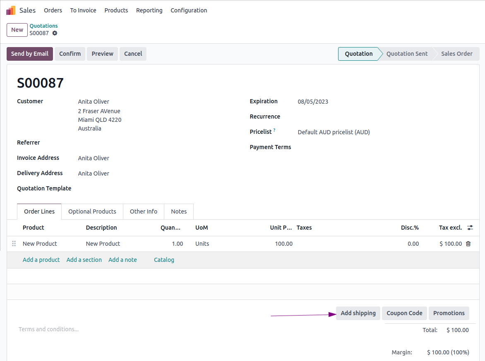

.. image:: australia/STARSHIPIT_10.png
   :align: center

.. important::
   Verify that the selected weight is supported by the selected shipping method and if this is set, make sure that the destination address is supported by the courier.
   Also, on the Starshipit Portal, navigate to Settings ‣ Rules and configure them according to your business logic. If a courier is not supported by a rule, Odoo won’t be able to create the order and get the rate.

Manage Packages
------------------------------------

Before validating the transfer, select Put In Pack to add the products to be shipped into a Package Type. You can manage your Package Types on Inventory ‣ Configuration ‣ Delivery ‣ Package Types when you set up Packages.

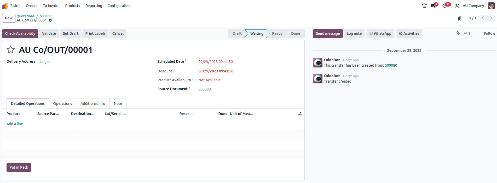

Process an order from Odoo to Starshipit
--------------------------------------------------------

After confirming a sale order and its related delivery transfer in Odoo, the order is automatically processed in Starshipit.

Note: 
In the Shipping Method configurations, if the option “Use Starshipit Sender’s Address” is selected, make sure that the Pickup Address is properly added in Starshipit. Otherwise, the sender's address will be the Company Address in Odoo.

For some couriers, contact details (email & mobile number) also need to be entered and valid, otherwise, Starshipit will not process the order. 

Shipping label documents are automatically generated in the chatter, which includes the following:
#. Shipping label(s) depending on the number of packages.
#. Tracking number (will open another tab with the tracking URL) 

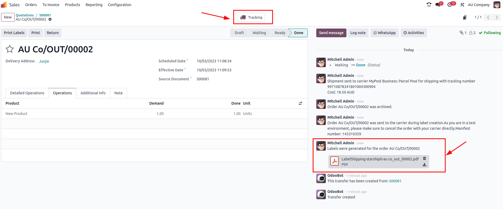

The tracking URL will be available as a Smart Button. If the carrier allows for it, it will redirect the user to the carrier’s website where the tracking status can be found.

In the Starshipit portal, the Order will be shown as Shipped on your Starshipit account if a carrier was selected. If “Plain Label” is selected instead, orders will be shown as Printed. 

Note:
Contact information, including a mobile number and email address, should be included in the customer's contact form depending on the courier.  

Returns management
------------------------------------

Starshipit allows returns with the following carriers: 
- Australia Post eParcel
- TNT
- Couriers Please
- Aramex
- StarTrack
- DHL Express
- NZ Post Domestic

In the Delivery transfer, click on the Return button.

.. image:: australia/STARSHIPIT_13.png
   :align: center

Then, in the “Additional Info” tab, check the Carrier field. If it allows for returns, the “Print Return Label” button will be available.

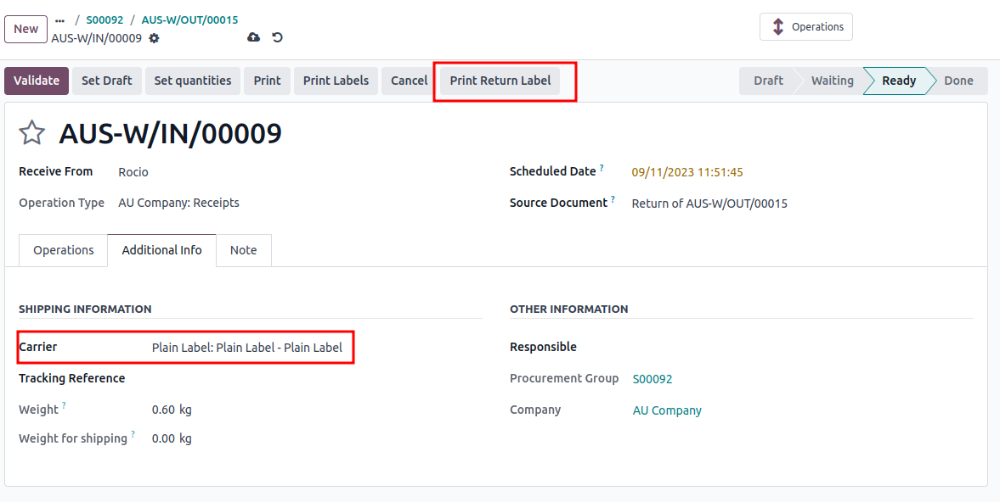

If the carrier does not support returns through Starshipit, Odoo will return the following Error message: "Starshipit does not support return for this carrier. In order to handle the return, please go to the carrier website directly”.

Cancellations/ Refunds
------------------------------------

Cancellations can be done in the “Additional Info” tab, by clicking on the “Cancel” button next to the Tracking Reference.

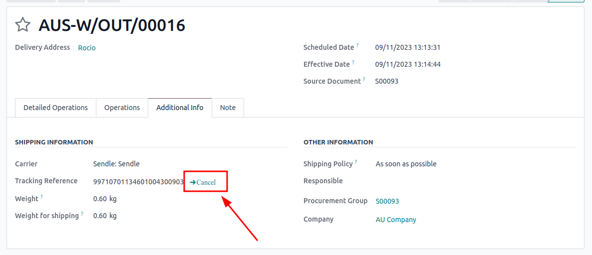

This will archive the shipment in Starshipit. However, the cancellation and refund has to be processed with the carrier as well if the order was already printed. 

.. _australia/aba:

ABA Files (DAJU)
========================

Introduction
----------------

An ABA file is a digital file format developed by the Australian Bankers' Association. It is designed for business customers to facilitate bulk payment processing by uploading a single file from their business management software.

The main advantage of using ABA files is to improve efficiency. This is achieved by consolidating numerous payments into one file for batch processing, which can be submitted to banks like CBA and is compatible with various banking portals across Australia, including Airwallex.

Configurations
----------------

Configurations in Settings
~~~~~~~~~~~~~~~~~~~~~~~~~~~~~~~

Accounting app -> Configuration -> Setting -> Batch Payment -> Allow Batch Payments

.. image:: australia/ABA_1.png
   :align: center

Configurations in Bank Journal
~~~~~~~~~~~~~~~~~~~~~~~~~~~~~~~~~~~~~~~~~

#. Configuration -> Journals -> Select the Bank type Journal

.. image:: australia/ABA_2.png
   :align: center

#. The account number (ACC) field has to be set. (Type the Account Number and Click Create and Edit)

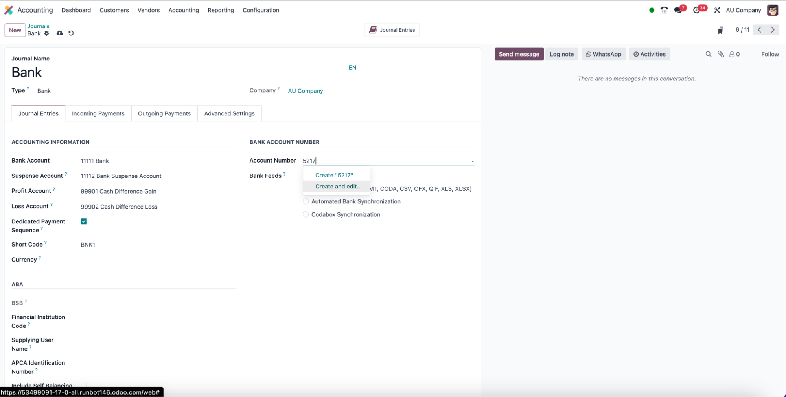

#. Then, put the Account information in this page. Ensure that the Send Money is allowed. (See link to know what is Send Money safety check) Finally, click Save & Close

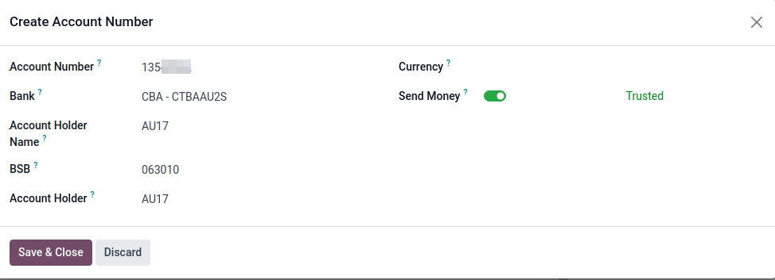

#. Configure the bank account related ABA info and the Bank Account Number info

- BSB: auto-formatted from Bank account (Can only configure in bank account number info)
- Financial Institution Code:  the official 3-letter abbreviation of the financial institution (e.g. WBC for Westpac)
- Supplying User Name: the name of the user or business that is creating the ABA file. The most common value is the business name.
- APCA Identification Number: 6-digit number provided by your bank. If you’re not sure what this number is, you’ll need to contact your bank. It’s often listed on their website and for some banks such as the ANZ you can provide any 6-digit number (such as 000000)
- Include Self-Balancing Transactions: selecting this option adds an additional “Self-balancing” transaction to the end of the ABA file which is required by some financial institutions when generating the ABA files (this info should be on the bank’s website).

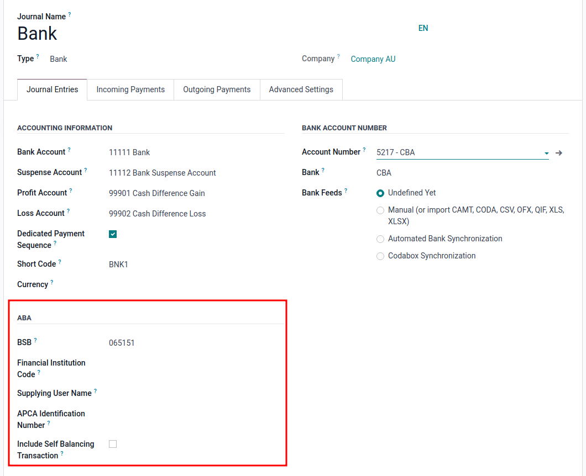

#. Click outgoing payments -> keep a payment option with the value “ABA Credit Transfer”

.. image:: australia/ABA_6.png
   :align: center

Config partners’ bank accounts
~~~~~~~~~~~~~~~~~~~~~~~~~~~~~~~

#. Go to Contact -> Accounting -> Configure the Bank Accounts

.. image:: australia/ABA_7.png
   :align: center

#. Account numbers (ACC), BSB, Account holder name, and Send Money are mandatory. Send Money: will set the bank account from “untrusted” to “trusted”. It is important for ABA files.

.. image:: australia/ABA_8.png
   :align: center

User Case
----------------

#. Create a vendor bill (manually or from a purchase order). Confirm it.

#. Check vendor information before registering a payment: is the partner’s bank account properly set up?

#. On the “Register Payment” window, select the right journal, then the “ABA Credit Transfer” payment method. Finally, choose the right partner bank account.

.. image:: australia/ABA_9.png
   :align: center

#.  After payment(s) are confirmed, they will show up in the payments list (Accounting > Vendors > Payments). Filter the ones to be included in a batch > Select > Create batch.

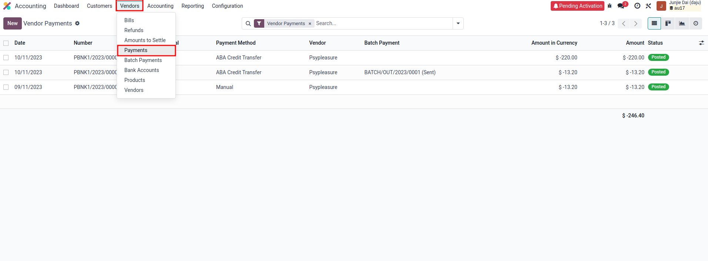

.. image:: australia/ABA_11.png
   :align: center

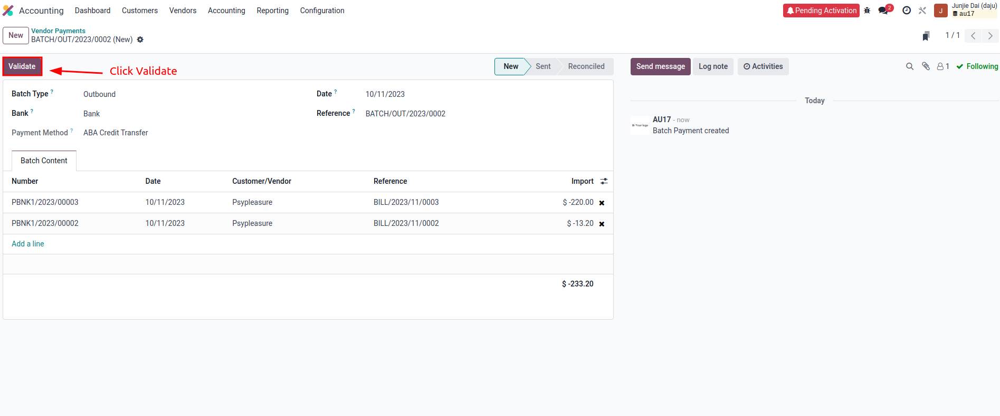

#. Download the ABA file from the chatter.

.. image:: australia/ABA_13.png
   :align: center

#. Upload it to your bank’s portal

#. An ABA transaction line will appear in your bank feed at the next bank feed iteration. You will then need to reconcile it against the batch payment made in Odoo.

.. _australia/asiapay:

Online payment solution Asia Pay (DYMO)
================================================
Asia Pay is compatible with Odoo helping businesses to better cater to their customers’ payment preferences. Find out more information about Asia Pay here.

.. Open Banking standards for bank sync (LWI)
.. ========================

.. _australia/bankstatement:

Export QIF, OFX Import (DAJU)
================================================

Import OFX statement files
--------------------------------
Open Financial Exchange (OFX) is a unified specification for the electronic exchange of financial data between financial institutions, businesses and consumers via the Internet.

With Odoo, you can download an OFX file from your bank or accounting software and import it directly into your Odoo instance. This will create all bank statements.

Import QIF statement files
--------------------------------
Quicken Interchange Format (QIF) is an open specification for reading and writing financial data to media (i.e. files). Although still widely used, QIF is an older format than Open Financial Exchange (OFX) and you should use the OFX version if you can export to both file formats.

With Odoo, you can download a QIF file from your bank or accounting software and import it directly into your Odoo instance. This will create all bank statements.

Configuration
----------------

#. Accounting -> Configuration -> Select the method you want to import the bank statements.

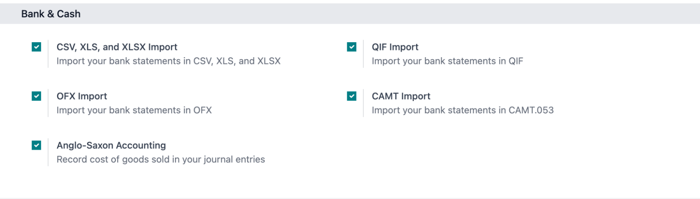

#. Then, export the OFX file from the bank.

.. image:: australia/QRF_2.png
   :align: center

#. Lastly, click import file to upload the bank statement.

.. image:: australia/QRF_3.png
   :align: center

.. _australia/pos:

POS terminal → in store payment solution (DAJU) (Stripe)
========================================================================
Redirect to the other page both Asia Pay and Stripe are payment solutions for both modules

Configuration
----------------
1. Select Stripe in Payment Terminal

.. image:: australia/POS_1.png
   :align: center

2. Create payment methods

- Select Bank as the Journal -> “Use a Payment Terminal” 
- Select Stripe as the payment terminal -> “Stripe Serial Number”
- Fill in the Stripe Serial Number
- Click the link to config Stripe.

.. image:: australia/POS_2.png
   :align: center

3. Stripe link configuration

Connect Strip via the link Connect Strip

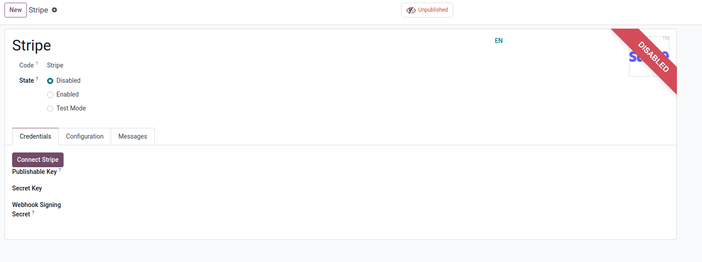

Jump to Stripe page

.. image:: australia/POS_4.png
   :align: center

Link to Stripe Account and the business. When it back to Odoo, Stripe account is set.

.. image:: australia/POS_5.png
   :align: center

4. Login to `Stripe <https://dashboard.stripe.com/dashboard>`_

Copy the Publishable Kay and Secret Key to Odoo.

.. image:: australia/POS_6.png
   :align: center

In the configuration, select the payment journal.

.. image:: australia/POS_7.png
   :align: center

Click the generate your webhook

.. image:: australia/POS_8.png
   :align: center

1. configuration of Point of Sales. 

Add Stripe to payment methods and click Save

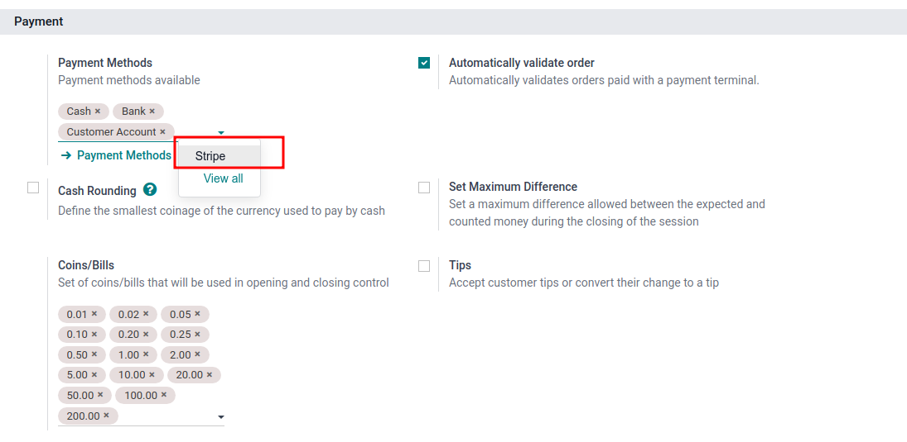

1. Link Stripe Terminal to Stripe Account
`Stripe Dashboard: <https://dashboard.stripe.com/dashboard>`_ Click More -> Terminal readers

.. image:: australia/POS_10.png
   :align: center

Click New -> Create a new address to manage the PoS Payment Terminal

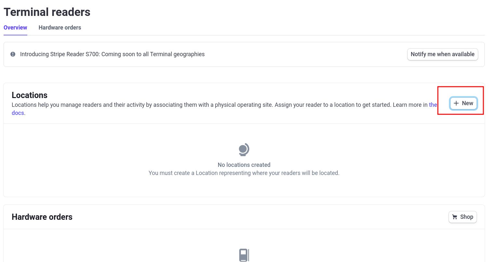

7. Register the reader by the pair code. Access the Registration Code from the `Stripe Terminal <https://stripe.com/docs/terminal>`_

.. image:: australia/POS_12.png
   :align: center

For the WisePOS E:
To open the settings menu, swipe right from the left edge of the reader screen to reveal a Settings button. 

.. image:: australia/POS_13.png
   :align: center

Tap the Settings button and enter the admin PIN 07139. From here, you can update your WiFi settings or generate a pairing code for device registration. 
Battery status is displayed at the top right of this screen. 

.. image:: australia/POS_14.png
   :align: center

.. image:: australia/POS_15.png
   :align: center

To close the settings menu, click the back arrow in the top left corner.

8. Configuration is completed.

.. image:: australia/POS_16.png
   :align: center

Flow
----------------

Select the products and click Payment

.. image:: australia/POS_17.png
   :align: center

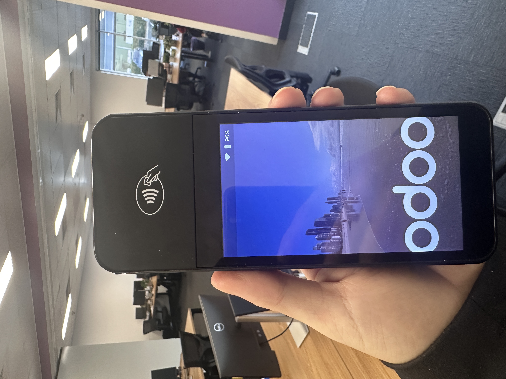

Select Stripe and click send.

.. image:: australia/POS_18.png
   :align: center

The PoS terminal shows the value that customers need to pay

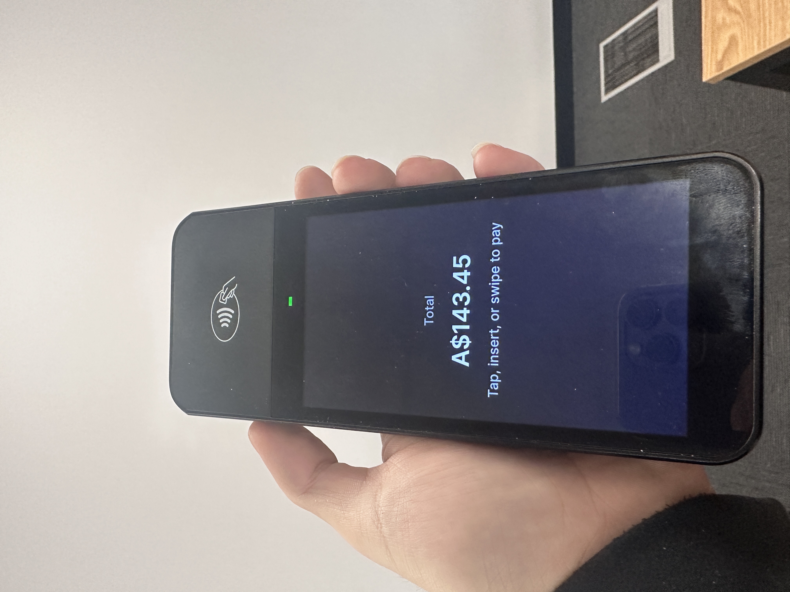

.. _australia/payroll:

Payroll (LWI)
========================

Create your employees
--------------------------------
A multitude of important fields have been added to comply with Australian regulations. First, go to Employees > Create. These fields can be found on the section “HR Settings” of the employee form: TFN, Medicare exemption and deduction, child support deduction and garnishee… Some of these fields will impact the employee’s withholding tax rate.
#. TFN Status: if a TFN is provided by the employee, make sure to add it to the “TFN” field.
#. Non-resident: if the employee is a foreign resident.
#. Tax-free Threshold
#. HELP / STSL: for all types of study and training support loans (e.g. HELP, VSL, SSL…)
#. Medicare Levy Deduction
#. Medicare Levy Exemption
#. Withholding for Extra Pay

In Odoo’s Australian localisation, some standard fields are crucial. Important examples are date of birth (which affects certain variables of employment termination payments or ETP), marital status and number of dependents (which affects Medicare surcharge).

.. image:: australia/PAY_1.png
   :align: center

Manage Australian contracts
--------------------------------
Once the employee form has been created, ensure the contract is enabled  by clicking on the “Contracts” smart button, or going to Employees > Contracts. Please note that only one contract can be active at the same time per employee, but it is possible for an employee to be assigned consecutive contracts during their employment.

Contractual information related to Australia can be found in the following 3 places:

1. The top panel:  Before assigning a salary amount, a pay frequency and other important details to a contract, it is important to define the salary structure, start date and work entry source. In Australia, the notion of a "Salary Structure" is employed to specify the tax schedule applicable to that contract, as defined by the Australian Taxation Office (ATO). Most contracts will fall under the following 3 structures:
- Regular (Schedule 1): the great majority of Australian employees will fall in this category and hence, this structure is assigned by default to all contracts.
- Working holiday makers (Schedule 15). When emploting working holidaymakers, other taxes apply. For detailed information on these specific tax implications, refer to the documentation provided by the ATO.
- No TFN. Choose this structure if the employee hasn’t provided a TFN for more than 28 days.

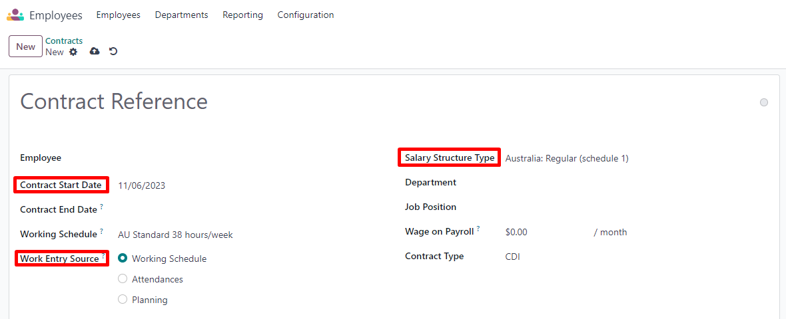

.. important::
   the structures “Horticulture / Shearing (Schedule 2)” and “Artists and Performers (Schedule 3)” are only partially complete in version 17 of Odoo and proper tests should be performed before using them to pay employees in your production database. Send your feedback to au-feedback@mail.odoo.com.

The field Work Entry Source is also very important and defines the way working hours and days will be accounted for in the employee’s payslip.
- Working Schedule: work entries are automatically generated based on the employee’s working schedule, starting from the start date of the contract. For example, let’s assume that an employee works 38 hours a week and their contract’s start date is January 1. Today is January 16 and the user generates a pay run from January 14 to 20. The working hours on the payslip will be automatically calculated to be 38 hours (5 * 7.36 hours) if no leave is taken.
- Attendances. The default working schedule is ignored, and work entries are only generated after clocking in and out of the attendance app.
- Planning. The default working schedule is ignored, and work entries are generated from planning shifts only.

.. important::
   To ensure that Odoo's payslips automatically compute various penalty rates as defined by an award (overtime rate, public holiday rate, etc) additional configurations are necessary. These configurations involve the following steps: firstly,  new work entry types for each penalty rate need to be created, before assigning a penalty rate in % to each of them. Once this one-time configuration is done, work entries can be manually imported for each period and Odoo will separate the pay items and rates on the employee’s payslip.
.. important::
   Timesheets do not impact work entries in Odoo.

1. The “Salary Information” tab. A few important fields will impact the frequency pay runs and the management of payslip rules in Odoo.

- Wage Type. For full-time and part-time employees, select the “Fixed Wage” pay type. For casual workers and other hourly contracts, choose the “Hourly Wage” type. For employees being paid hourly, make sure to define the correct casual loading.
- Schedule Pay. In Australia, only the following pay run frequencies are accepted: daily, weekly, bi-weekly (or fortnightly), monthly, and quarterly.
- Wage ( / period). Assign a wage to the contract according to their pay frequency. On payslips, the corresponding annual and hourly rates will be automatically computed. For hourly workers, please note that the hourly wage should exclude casual loading.

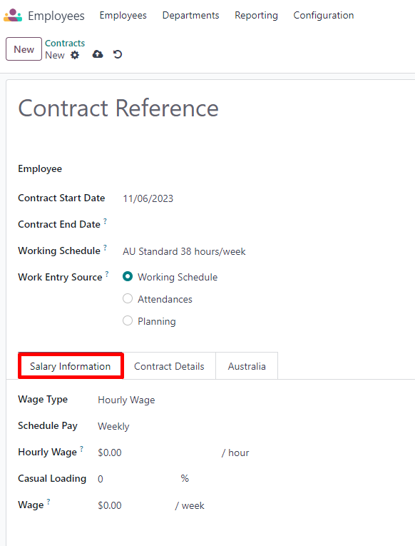

3. The “Australia” tab. Most of the fields in this tab are used for Single Touch Payroll (or STP) reporting, which requires a thorough understanding of several details from an employee’s contract. Make sure to review the information on this tab before moving forward with pay runs. This includes the following four fields which will also impact payslip computations:

- Withholding Variation: use this field in case the employee’s withholding must be varied upward or downward according to their circumstances. E.g. if Vanessa benefits from a 25% withholding variation, her percentage of tax withheld will vary from whatever amount she was supposed to pay according to her salary structure and situation, to a fixed 25%.
- Leave Loading: if the employee benefits from a regular leave loading, the value set in the field “Leave Loading Rate” (e.g. 17.5%) will be added on top of any amount earned by the employee when taking annual or long service leaves.
- Salary Sacrifice Superannuation: any amount added to this field will be deducted, per pay frequency, from the employee’s basic salary before the computation of the gross salary. Then, this amount will be added to the super guarantee line of their payslip. E.g. If Patrick earns 5,000 AUD per month and sacrifices 300 AUD to superannuation, his gross salary will be 4,700 AUD and 300 AUD will be added on top of his normal super contributions.
- Salary Sacrifice Other: any amount added to this field will be deducted, per pay frequency, from the employee’s basic salary before the computation of the gross salary.

.. image:: australia/PAY_4.png
   :align: center

Once all important information has been entered, ensure the transition of the contract's status from "New" to "Running" to facilitate its use in pay runs.

Assign superannuation accounts
----------------------------------------------
Upon receipt of superannuation details from a new employee, ensure the creation of a new account in Payroll ‣ Configuration ‣ Australia ‣ Super Accounts, linking it to the individual. Input the account's fund, "member since" date, and member number for accurate records.

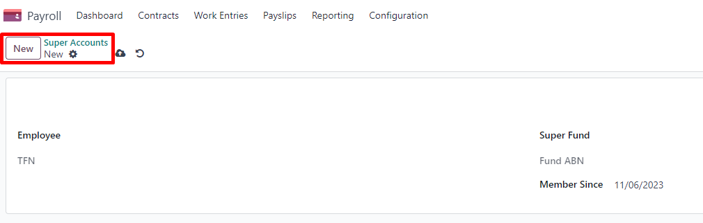

If the employee uses a superannuation fund that does not exist in  the database yet, Odoo will allow to create a new one and to centralise basic information about this fund, such as its ABN, address, type (APRA or SMSF), USI and ESA. Super funds can be created or imported in Payroll ‣ Configuration ‣ Australia ‣ Super Funds. 

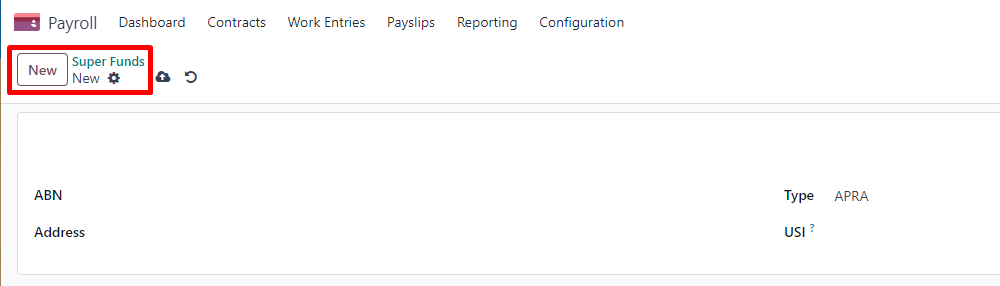

.. important::
   Odoo is not SuperStream-compliant in Odoo 17.0. Our teams are actively working on it and announcements will be made once companies can use Odoo to report their superannuation data and payments to the ATO via clearinghouses.

Create pay runs with payslips
----------------------------------------------

There are two ways Odoo can help create pay runs: via batch or via individual payslips.

Create a batch of payslips
~~~~~~~~~~~~~~~~~~~~~~~~~~~~~~
When preparing to generate employees’ draft payslips (e.g. at the end of every week, fortnight or month), navigate to Payroll ‣ Payslips ‣ Batches and create a new one. This method allows the creation of multiple payslips corresponding to each employee in a single batch.

.. image:: australia/PAY_6.png
   :align: center

#. Give the batch a name. E.g. 2024 – Weekly W1
#. Choose the pay run’s start and end date. E.g. 01/01/2024 to 07/01/2024.
#. Click on “Generate”. A pop-up window will ask to confirm which employees should be included in the batch. By default, all active employees will be there. Feel free to leave the field “salary structure” blank as Odoo will automatically select the structure currently linked to each employee’s contract.
#. The batch will create as many payslips as there are employees. There is no limit to the number of payslips that can be created in a batch.
#. Verify important information on each payslip. After payslips from a batch have been generated, there is no need to manually compute payslip lines, Odoo does it for you.

Create an individual payslip
~~~~~~~~~~~~~~~~~~~~~~~~~~~~~~~~~

In cases where the pay run doesn't fall into the category of regular payslips, the option exists to create a pay run dedicated to a single employee. Go to Payroll ‣ Payslips ‣ All Payslips ‣ New. Employ this method when processing one-time payments for employees, including return-to-work payments (ATO Schedule 4), employment termination payments (ATO Schedule 7 and 11), as well as commissions and bonuses (ATO Schedule 5). When generating an individual payslip, make sure to proceed with the following steps: 

.. image:: australia/PAY_7.png
   :align: center

#. Select an employee. Their contract will be filled out automatically.
#. Add a pay period
#. Select a salary structure (e.g. Return to work payment)
#. Unlike payslips generated from a batch, the payroll user needs to click on the “Compute Sheet” button to generate payslip lines.

Understand payslip features
~~~~~~~~~~~~~~~~~~~~~~~~~~~~~~~~~
No matter the way payslips are created (individually or via a batch), the same features apply. Let us dive into the different sections of the payslip form.

Depending on the way work entries are created for this employee (see the contract section above for more information), the “Worked Days” table will automatically show the number of days and hours the employee has worked during the payslip period, next to the corresponding total gross amount. Note that there will be one line per work entry type, which means that paid and unpaid time off, in addition to custom hourly penalty rates (overtime, public holidays…) will be added to the table automatically.

.. image:: australia/PAY_8.png
   :align: center

Under the worked days table, the payroll user can make sure of the “Other Inputs” table for both allowances and extra pay items.

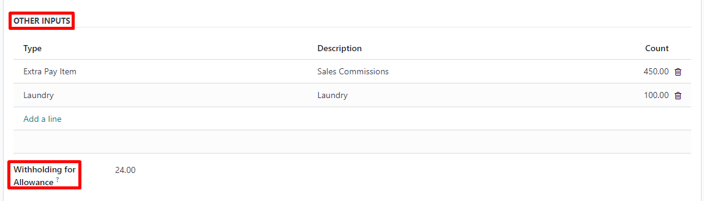

a. Allowances. To incorporate various types of allowances into an employee's payslip, begin by creating them in Payroll ‣ Configuration ‣ Other Input Types. Once the other input type is created (e.g. Laundry), make sure to tick the “Is an Allowance” checkbox.

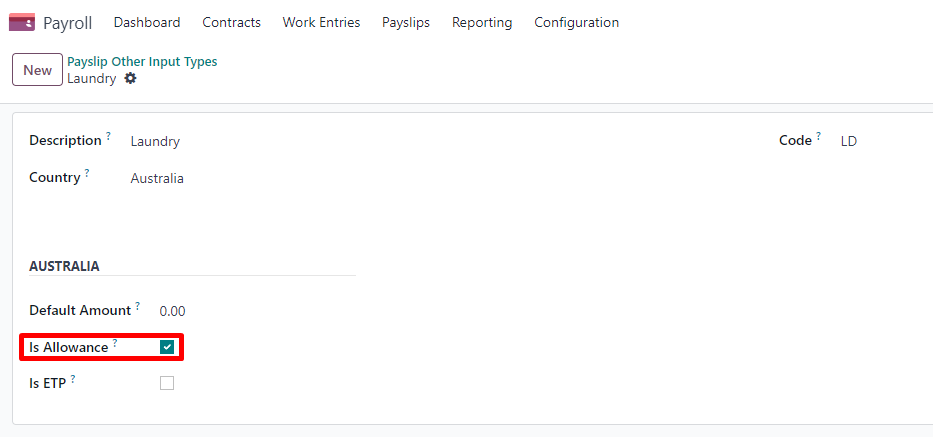

.. important::
   withholding for allowances is not computed automatically as of Odoo 17. The payroll user has to use the field “Withholding for allowance” under the other inputs table to manually add the total amount to be withheld across all allowances on that payslip.

b. Extra pay items. Unlike allowances, extra pay items are other inputs that add to the payslip’s gross and as such, to the withholding amount. A good example lies in regular sales commissions which are taxed at the same rate as the normal salary (unlike discretionary bonuses which fall under the ATO’s Schedule 5 and its corresponding salary structure). To configure such a custom pay item, go to Payroll ‣ Configuration ‣ Other Input Types and create a new entry with the code “EXTRA” as shown in the screenshot below.

.. image:: australia/PAY_11.png
   :align: center

On the tab “Salary Computation”, the payroll user can verify whether all the pay rules have been computed correctly as per employee, contract and salary structure. Here are a few guidelines to better understand the data.

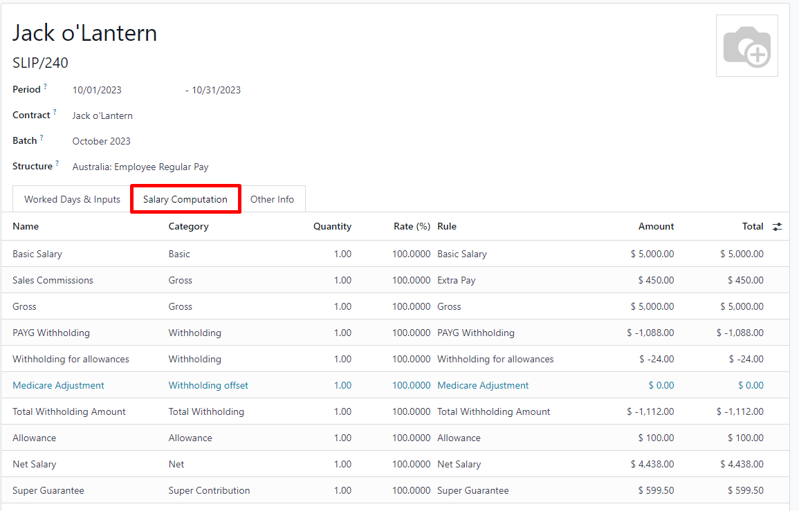

#. Basic salary: amount from which tax-deductible lines can be subtracted
#. Gross salary: amount subject to the taxes defined by the salary structure
#. Withholding: tax amount to be paid to the ATO
#. Net salary: amount to be paid to the employee’s bank account
#. Superannuation Guarantee: amount to be provisioned for quarterly payments to the employee’s super account
#. Allowances & Extra pay items: these lines will show if other inputs are added to the payslip.
#. Other lines: depending on the employee and contract specifics (Medicare, child support, salary sacrifice…)

When the payroll is satisfied with the payslip, they can click on “Create Draft entry” to generate a draft accounting journal entry that the accountant can review. Note that in the case of a payslip batch, this accounting entry will sum up balances from all payslips.

Pay employees
------------------------------

After a batch or a payslip’s journal entry has been posted, the company can proceed to pay their employees. The user can choose between two different payment methods.

1. Pay the employee in batch via ABA file. This is only possible from the payslip batch level. Please note however that it is always possible to include an individual payslip into an existing batch and as such, include it in an ABA file. To generate the ABA file, make sure that the batch’s journal entry has been posted. From the batch form view, click on “Create ABA File” and choose the desired bank journal. The newly generated ABA file will be available for download in the field “ABA File”. It is possible to re-generate the ABA file after applying corrections to existing payslips.

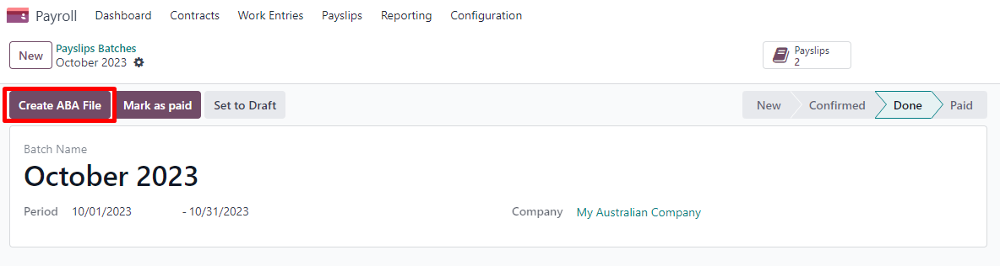

.. image:: australia/PAY_14.png
   :align: center

.. important::
   an ABA file can only be generated if both the company’s bank account and each employee’s bank account have been properly configured. See section “ABA Files” for more details.

2. Pay the employee using the “Register Payment” feature. On the individual payslip level, once the payslip's journal entry has been posted, click on the button “Register Payment”. The same process as paying for vendor bills, select the desired bank journal and payment method, then reconcile  the payment later with the corresponding bank statements.

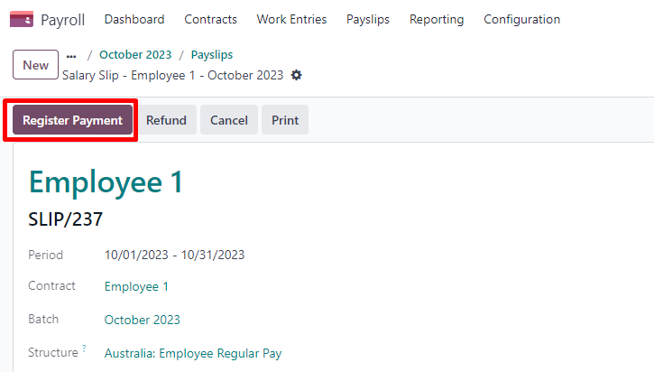

One-time payments
~~~~~~~~~~~~~~~~~~~~~~~~~~~~

Certain payments such as “return to work” payments and “employment termination payments” (ETP) are processed only once and require a slightly different approach.

Return to work payments
~~~~~~~~~~~~~~~~~~~~~~~~~~~~

A return to work payment is a payment made to an employee to resume working. To process one in Odoo, create an individual payslip, select the employee and modify its regular structure to “Australia: return to work”. Then, simply add the gross amount of that payment in the “Other Inputs” table and compute the payslip.

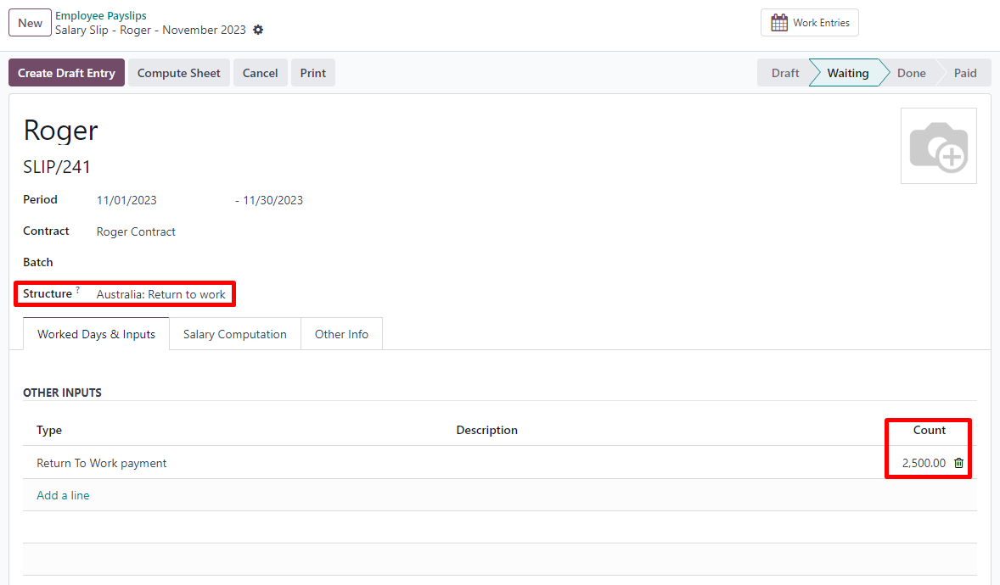

Odoo automatically computes the PAYG withholding, the net amount and the super guarantee corresponding to that payment.

.. image:: australia/salary_computing.png
   :align: center

Termination payments
~~~~~~~~~~~~~~~~~~~~~~~~~~~~

Before proceeding with the employee’s ETP, make sure that a “Contract End Date” has been set on that employee’s contract, so that Odoo can automatically compute the final prorated salary of that employee for the current month.

First, create the final salary for that employee this month. To do so, create an individual payslip. If the contract end date is set correctly, Odoo will automatically compute the prorated salary up to the final payslip date.

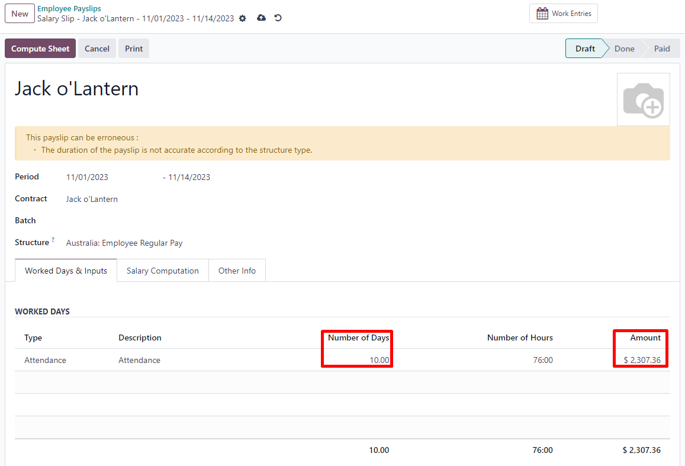

We recommend creating a batch on the fly for that payslip, in which we will add the ETP as a second payslip of that same batch.

.. image:: australia/PAY_18.png
   :align: center

Create a second individual payslip and include it in the same batch. Change the salary structure on that payslip to “Australia: Termination Payments”. Before computing the sheet, it is important to provide the payslip with details of the termination.

.. image:: australia/PAY_19.png
   :align: center

- Genuine or non-genuine redundancy. This choice will have an impact on the amounts and caps defined per ETP type.
- ETP types. First, see the full list of termination payment types in “Other Input Types” by filtering by “ETP Type is Set”.

.. image:: australia/PAY_20.png
   :align: center

Add the relevant ETP type in the “Other Inputs” table of the payslip, then compute the payslip. For example:

.. image:: australia/PAY_21.png
   :align: center

Odoo will automatically compute the gross ETP, the withholding, the unused leaves and the net salary according to the rules defined on the ETP, the employee and their contract.

.. image:: australia/PAY_22.png
   :align: center

Once payment for both payslips is ready to be processed, an ABA file can be created directly from the batch.

STP Phase 2
------------------------

.. important::
   Odoo is not compliant with STP Phase 2 as of Odoo 17.0. Our teams are actively working on it and announcements will be made once companies can use Odoo to report their payroll data directly to the ATO.

.. _australia/employment-hero:

Employment Hero Australian Payroll(DAJU)
==================================================

The Employment Hero module synchronizes payslip accounting entries (e.g., expenses, social charges,
liabilities, taxes) from Employment Hero to Odoo automatically. Payroll administration is still done
in Employment Hero. We only record the journal entries in Odoo.

.. important::
   KeyPay was rebranded as **Employment Hero** in March 2023.

Configuration
--------------------------

#. :ref:`Activate <general/install>` the :guilabel:`Employment Hero Australian Payroll` module
   (technical name: `l10n_au_keypay`).
#. Configure the **Employment Hero API** by going to :menuselection:`Accounting --> Configuration -->
   Settings`. More fields become visible after clicking on :guilabel:`Enable Employment Hero
   Integration`.

   .. image:: australia/employment-hero-integration.png
      :alt: Enabling Employment Hero Integration in Odoo Accounting displays new fields in the
            settings

   - You can find the API Key in the :guilabel:`My Account` section of the Employment Hero platform.

     .. image:: australia/employment-hero-myaccount.png
        :alt: "Account Details" section on the Employment Hero dashboard

   - The **Payroll URL** is pre-filled with `https://keypay.yourpayroll.com.au`. *Please do not
     change it.*
   - You can find the **Business ID** in the Employment Hero URL. (i.e., `189241`)

     .. image:: australia/employment-hero-business-id.png
        :alt: The Employment Hero "Business ID" number is in the URL

   - You can choose any Odoo journal to post the payslip entries.

How does the API work?
----------------------

The API syncs the journal entries from Employment Hero to Odoo and leaves them in draft mode. The
reference includes the Employment Hero payslip entry ID in brackets for the user to easily retrieve
the same record in Employment Hero and Odoo.

.. image:: australia/employment-hero-journal-entry.png
   :alt: Example of a Employment Hero Journal Entry in Odoo Accounting (Australia)

By default, the synchronization happens once per week. You can fetch the records manually by going
to :menuselection:`Accounting --> Configuration --> Settings` and, in the :guilabel:`Enable
Employment Hero Integration` option, click on :guilabel:`Fetch Payruns Manually`.

Employment Hero payslip entries also work based on double-entry bookkeeping.

The accounts used by Employment Hero are defined in the section :guilabel:`Payroll settings`.

.. image:: australia/employment-hero-chart-of-accounts.png
   :alt: Chart of Accounts menu in Employment Hero

For the API to work, you need to create the same accounts as the default accounts of your Employment
Hero business (**same name and same code**) in Odoo. You also need to choose the correct account
types in Odoo to generate accurate financial reports.