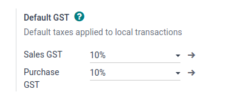
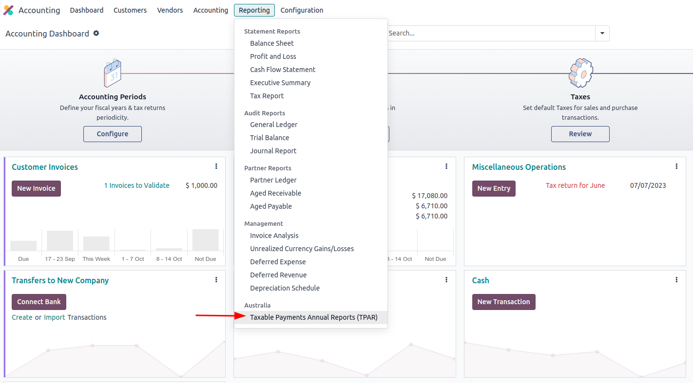
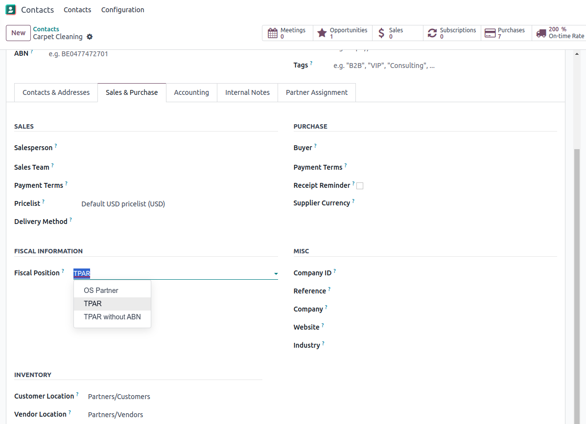
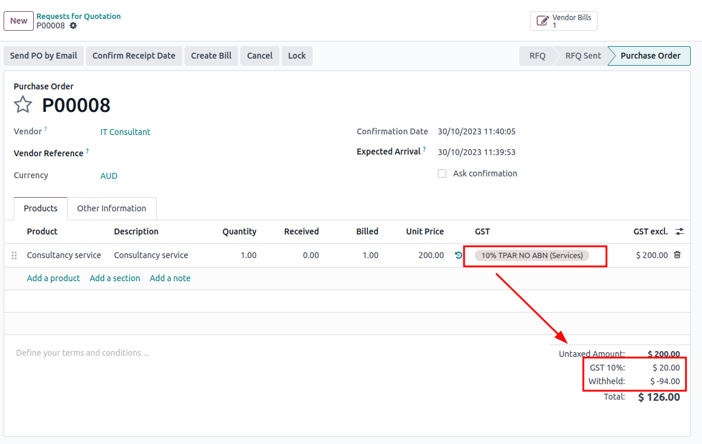

=========
Australia
=========

Documentation Guidelines
========================

Modules: (Daju)
========================

.. list-table::
   :header-rows: 1
   :widths: 25 20 55

   * - Module Name
     - Technical Name
     - Description
   * - Australia - Accounting
     - l10n_au
     - Australian accounting basic charts and localizations. Also:
       - activates a number of regional currencies.
       - sets up Australian taxes.
   * - ABA Credit Transfer
     - l10n_au_aba
     - This module allows the generation of payment batches as ABA (Australian Bankers Association) text files. The generated 'aba' file can be uploaded to many Australian banks.
   * - Employment Hero Australian Payroll
     - l10n_au_keypay
     - Employment Hero Payroll Integration This Module will synchronise all payrun journals from Employment Hero to Odoo.
   * - Australian Reports - Accounting
     - l10n_au_reports
     - Taxable Payments Annual Reports (TPAR) for Australia. The Taxable payments annual report (TPAR) allows:  Payments made to contractors (or subcontractors) for services, or Grants paid by government entities to ABN holders to be reported where required under the Taxable Payments Reporting System (TPRS) and the Taxable Government Grants and Payments reporting measure.
   * - Australia - Payroll
     - 
     - 
   * - Australia - Payroll with Accounting
     - 
     - 

 
COA: (Dymo)
========================

The Australian chart of accounts is included in the Australian - Accounting module. Go to Accounting ‣ Configuration ‣ Accounting: Chart of Accounts to access it.

Taxes (DAJU)
========================

The default Australian taxes are automatically generated upon installation of the **Australia - Accounting (l10n_au)** which is installed automatically for Australian databases.

These taxes impact the BAS Report, which can be accessed through
``Accounting ‣ Reporting ‣ BAS Report``.

.. _Link to BAS - TAX report:

In Australia, the standard Goods and Services Tax (GST) rate is 10%, but there are different rates and exemptions for specific categories of goods and services. 

Tax Name
-----------------------
The tax name will be utilised across multiple Odoo databases. Within the Australian localisation package, tax names encompass the tax rate as an integral part of their naming convention.

Despite the high amount of taxes in Odoo, these taxes are pretty similar (mostly 0% and 10%), with different tax grid variations for:

- Goods
- Services
- TPAR
- TPAR without ABN

There are two primary tax categories: Purchase and Sales. These taxes are further categorised based on whether their tax scope is Services.

Businesses need to report payments made to subcontractors from relevant services during the financial year. Odoo uses TPAR as a fiscal position to report these payments on the TPAR Report. Moreover, “TPAR without ABN” is used to record amounts withheld from subcontractors without an ABN for the ATO. 

.. _Link to T-PAR Report:

Here is the taxes for Australia in v17.

.. list-table::
   :widths: 20 20 20 20
   :header-rows: 1

   * - Name
     - Description
     - Tax Scope
     - Type Tax Use
   * - 10%
     - GST Sales
     - 
   * - Sales
     - 10% INC
     - GST Inclusive Sales
     - 
   * - Sales
     - 0% EX
     - Zero Rated (Export) Sales
     - 
   * - Sales
     - 0% EXEMPT
     - Exempt Sales
     - 
   * - Sales
     - 0% I
     - Input Taxed Sales
     - 
   * - Sales
     - 10% Adj
     - Tax Adjustments (Sales)
     - 
   * - Purchases
     - 10%
     - GST Purchases
     - 
   * - Purchases
     - 10% INC
     - GST Inclusive Purchases
     - 
   * - Purchases
     - 10% C
     - Capital Purchases
     - 
   * - Purchases
     - 0% C
     - Zero Rated Purch
     - 
   * - Purchases
     - 100% T EX
     - Purchase (Taxable Imports) - Tax Paid Separately
     - 
   * - Purchases
     - 10% I
     - Purchases for Input Taxed Sales
     - 
   * - Purchases
     - 10% P
     - Purchases for Private use or not deductible
     - 
   * - Purchases
     - 100% EX
     - GST Only on Imports
     - 
   * - Purchases
     - 10% Adj
     - Tax Adjustments (Purchases)
     - 
   * - Purchases
     - Services (Purchase)
     - 10% TPAR
     - GST Purchases
   * - Purchases
     - Services
     - 10% TPAR NO ABN
     - GST Purchases
   * - Purchases
     - Services
     - 10% INC TPAR
     - GST Inclusive Purchases

BAS - TAX report (DAJU)
========================

The Business Activity Statement (BAS) report is a critical tax reporting requirement for businesses registered for Goods and Services Tax (GST) in Australia. The BAS is used to report and remit various taxes to the Australian Taxation Office (ATO). With Odoo BAS feature, businesses can report on the following:
- Goods and Services Tax (GST) 
- PAYG tax withheld

The taxes for GST are collected from the Tax Grid, which is pre-configured in the system. The Tax Grid can also be manually set up for any additional special GST. Once the tax for each account is set up, the system automatically slots journal items into the correct tax category. This ensures that the BAS report generated is accurate and reflective of the business's financial activities. 

.. image:: australia/image49.png
   :align: center

In addition, the BAS report will encompass the PAYG tax withheld components. This integration spans from W1 to W5 and is seamlessly tied with the Payroll system. This ensures that all payroll-related withholding taxes are accurately captured and reflected within the report.

In the Payroll (Jump to Payroll), we have some features to configure specifically for W1 to W5. 
Payroll has in-built rules that facilitate the automatic calculation of taxes for types W1 to W5. For a detailed walkthrough and more information on how these taxes are calculated, please refer to the Payroll app documentation.

When it's time to file the tax return with the ATO, whether it be quarterly or annually, we should select "close entry." Following this set up the Tax group and consolidate all tax receivable and payable amounts into the tax clearing account. Subsequently, Odoo will create a Journal Entry reflecting the amount of GST we are required to pay to or receive from the ATO.

TPAR Report (PERO)
========================

Odoo allows businesses to report payments made to contractors or subcontractors during the financial year. This is done by generating a TPAR (Taxable Payments Annual Report). If you are not sure that your business needs this report, refer to the documentation provided by the ATO. 
You can find this report in Accounting ‣ Reporting: 

Configuration
-------------------------

Select Fiscal Position on the Contact form.

Upon billing a contact with a fiscal position set to “TPAR”  or “TPAR without ABN”, the report will automatically be generated in Accounting ‣ Reporting.

The report includes the ABN, Total GST, Gross Paid and Tax Withheld from their TPAR  subcontractors. 
- Total GST: total tax paid 
- Gross Paid amounts will show after registering a payment for those bills. 
- Tax Withheld will be shown if the subcontractor is registered with Fiscal Position “TPAR without ABN” 

The following image shows an example of an IT company contracting services from other IT-related companies and subcontractors: 

.. image:: australia/image14.png
   :align: center

File types that can be exported from Odoo: 
- PDF
- XLSX 

Customer Statements (Dymo)
========================

Customer statements can be downloaded by going to Apps ‣ Accounting Customer Statements.
This module allows customers to see their financial transactions as well as overdue statement details. These statements can be sent out to customers by email.

The customer statements can be found on Customers ‣ Print Customer Statements.

Remittance Advice (Dymo)
------------------------

E-Invoicing via Peppol (Dymo)
----------------------------

Set up Starshipit shipping services in Odoo (PERO)
========================

Setup in Starshipit
~~~~~~~~~~~~~~~~~~~

Find Starshipit credentials
~~~~~~~~~~~~~~~~~~~~~~~~~~

Setup in Odoo
~~~~~~~~~~~~~

Rate computation
~~~~~~~~~~~~~~~~

Manage Packages
~~~~~~~~~~~~~~~

Process an order from Odoo to Starshipit
~~~~~~~~~~~~~~~~~~~~~~~~~~~~~~~~~~~~~~~

Returns management
~~~~~~~~~~~~~~~~~~

Cancellations/ Refunds
~~~~~~~~~~~~~~~~~~~~~

ABA Files (DAJU)
----------------

Context
~~~~~~~

Definition
~~~~~~~~~~

Why do we need them?
~~~~~~~~~~~~~~~~~~~~

Limitations to know of
~~~~~~~~~~~~~~~~~~~~~~

Setup
~~~~~

Flow
~~~~

Online payment solution Asia Pay (DYMO)
---------------------------------------

Open Banking standards for bank sync (LWI)
------------------------------------------

Export QIF, OFX Import (DAJU)
-----------------------------

Import OFX statement files
~~~~~~~~~~~~~~~~~~~~~~~~~~

Import QIF statement files
~~~~~~~~~~~~~~~~~~~~~~~~~~

Configuration
~~~~~~~~~~~~~

POS terminal → in store payment solution (DAJU) (Stripe)
--------------------------------------------------------

Configuration
~~~~~~~~~~~~~

Flow
~~~~

Payroll (LWI)
-------------

Employees
~~~~~~~~~

Contracts
~~~~~~~~~

Superannuation
~~~~~~~~~~~~~~

Generating payslips
~~~~~~~~~~~~~~~~~~~

Paying employees using an ABA file
~~~~~~~~~~~~~~~~~~~~~~~~~~~~~~~~~~

Paying super contributions
~~~~~~~~~~~~~~~~~~~~~~~~~~

Termination payments
~~~~~~~~~~~~~~~~~~~~

Add custom pay items
~~~~~~~~~~~~~~~~~~~~

Work entry types
~~~~~~~~~~~~~~~~

Allowances
~~~~~~~~~~

Commissions and other bonuses
~~~~~~~~~~~~~~~~~~~~~~~~~~~~~

Compliance
~~~~~~~~~~

STP Phase 2
~~~~~~~~~~~

SuperStream
~~~~~~~~~~~

Employment Hero (DAJU)
----------------------
