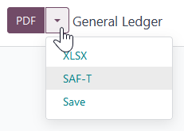

=======
Austria
=======

Configuration
=============

:ref:`Install <general/install>` the following modules to get all the features of the Austrian
localization.

.. list-table::
   :header-rows: 1

   * - Name
     - Technical name
     - Description
   * - :guilabel:`Austria - Accounting`
     - `l10n_at`
     - Default :ref:`fiscal localization package <fiscal_localizations/packages>`.
   * - :guilabel:`Austria - Accounting Reports`
     - `l10n_at_reports`
     - Adds localized versions of financial reports
   * - :guilabel:`Austrian SAF-T Export`
     - `l10n_at_saft`
     - Adds the SAF-T export.

Financial reports
=================

The following localized reports are available:

  - Balance sheet according to `§ 224 UGB <https://www.ris.bka.gv.at/NormDokument.wxe?Abfrage=Bundesnormen&Gesetzesnummer=10001702&Artikel=&Paragraf=224&Anlage=&Uebergangsrecht=>`_
  - Profit and loss according to `§ 231 UGB <https://www.ris.bka.gv.at/NormDokument.wxe?Abfrage=Bundesnormen&Gesetzesnummer=10001702&Artikel=&Paragraf=231&Anlage=&Uebergangsrecht=>`_ (Gesamtkostenverfahren)

.. seealso::
   :doc:`Accounting reporting documentation <../accounting/reporting>`

SAF-T (Standard Audit File for Tax)
===================================

The Austrian tax office may request a SAF-T. The Austrian SAF-T Export module allows exporting the
report in XML format.

Configuration
-------------

This section explains how to configure the database to ensure all the information required by the
SAF-T is available. If anything is missing, a warning message listing which information is needed
will be displayed during the export.

Company information
~~~~~~~~~~~~~~~~~~~

Open the database :guilabel:`Settings`. Under the :guilabel:`Companies` section, click
:guilabel:`Update Info` and ensure the following fields are correctly filled in:

- :guilabel:`Address`, by providing at least the following information:

  - :guilabel:`Street`
  - :guilabel:`City`
  - :guilabel:`ZIP`
  - :guilabel:`Country`

- :guilabel:`Phone`
- :guilabel:`Company ID` by providing your company's tax ID
- :guilabel:`Tax ID` by providing, if you have one, your :abbr:`UID-Nummer
  (Umsatzsteueridentifikationsnummer)` (including the country prefix)

Contact person
**************

At least one **contact person** must be linked to your company in the :guilabel:`Contacts` app, and:

  - Ensure the contact type is set to :guilabel:`Individual`.
  - Select your company in the :guilabel:`Company name` field.
  - Provide at least one phone number using the :guilabel:`Phone` or :guilabel:`Mobile` field.

Customer and supplier information
~~~~~~~~~~~~~~~~~~~~~~~~~~~~~~~~~

Using the :guilabel:`Contacts` app, fill in the :guilabel:`Address` of any partner that appears in
your invoices, vendor bills, or payments.

For partners that are companies, fill in the VAT number (including the country prefix) in the
:guilabel:`Tax ID` field.

Accounting settings
~~~~~~~~~~~~~~~~~~~

Go to :menuselection:`Accounting --> Configuration --> Settings`. Under the :guilabel:`Austrian
localization` section, fill in the following fields:

- :guilabel:`ÖNACE-Code`
- :guilabel:`Profit Assessment Method`

.. seealso::
   `ÖNACE information on the Austrian Economic Chambers website
   <https://www.wko.at/service/zahlen-daten-fakten/oenace.html>`_

Chart of accounts mapping
~~~~~~~~~~~~~~~~~~~~~~~~~

The Austrian SAF-T specifications define a chart of accounts (COA). All relevant accounts for the
SAF-T export must be annotated with a fitting account from this COA.

The needed mapping information is supplied by adding tags to the accounts. For example, adding the
`1000` tag to an account maps it (virtually) to the SAF-T COA account with the code `1000`. Any
number can be used as long as there is an account in the SAF-T COA with that code.

The :guilabel:`Austria - Accounting` module adds a tag for each SAF-T COA account. Furthermore, it
automatically maps many accounts from the default Austrian COA.

You can try exporting the SAF-T report to check if there are unmapped accounts (or mapped to
multiple SAF-T accounts). A warning will be displayed if there is any issue with your configuration
or the mapping. Clicking :guilabel:`View Problematic Accounts` lets you view them.

.. seealso::
   :doc:`Chart of accounts documentation <../accounting/get_started/chart_of_accounts>`

Exporting the SAF-T report
--------------------------

To export the SAF-T report, go to :menuselection:`Accounting --> Reports --> General Ledger`. Click
the right side of the :guilabel:`PDF` button and select :guilabel:`SAF-T`.

