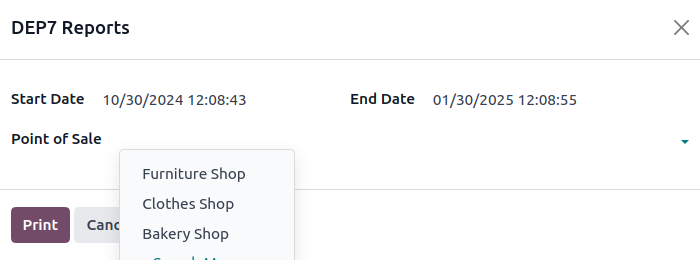

=======
Austria
=======

.. _localizations/austria/configuration:

Configuration
=============

:ref:`Install <general/install>` the following modules to get all the features of the Austrian
localization.

.. list-table::
   :header-rows: 1

   * - Name
     - Technical name
     - Description
   * - :guilabel:`Austria - Accounting`
     - `l10n_at`
     - Default :ref:`fiscal localization package <fiscal_localizations/packages>`.
   * - :guilabel:`Austria - Accounting Reports`
     - `l10n_at_reports`
     - Adds localized versions of financial reports
   * - :guilabel:`Austrian SAF-T Export`
     - `l10n_at_saft`
     - Adds the SAF-T export.
   * - :guilabel:`Austria - Security Regulation for Point of Sale`
     - `l10n_at_pos`
     - Adds RKSV compliance for POS.

.. seealso::
   :doc:`Documentation on e-invoicing’s legality and compliance in Austria
   <../accounting/customer_invoices/electronic_invoicing/austria>`

.. _localizations/austria/financial-reports:

Financial reports
=================

The following localized reports are available:

  - Balance sheet according to `§ 224 UGB <https://www.ris.bka.gv.at/NormDokument.wxe?Abfrage=Bundesnormen&Gesetzesnummer=10001702&Artikel=&Paragraf=224&Anlage=&Uebergangsrecht=>`_
  - Profit and loss according to `§ 231 UGB <https://www.ris.bka.gv.at/NormDokument.wxe?Abfrage=Bundesnormen&Gesetzesnummer=10001702&Artikel=&Paragraf=231&Anlage=&Uebergangsrecht=>`_ (Gesamtkostenverfahren)

.. seealso::
   :doc:`Accounting reporting documentation <../accounting/reporting>`

.. _localizations/austria/saf-t:

SAF-T (Standard Audit File for Tax)
===================================

The Austrian tax office may request a SAF-T. The Austrian SAF-T Export module allows exporting the
report in XML format.

.. _localizations/austria/saf-t-configuration:

Configuration
-------------

This section explains how to configure the database to ensure all the information required by the
SAF-T is available. If anything is missing, a warning message listing which information is needed
will be displayed during the export.

.. _localizations/austria/saf-t-company:

Company information
~~~~~~~~~~~~~~~~~~~

Open the database :guilabel:`Settings`. Under the :guilabel:`Companies` section, click
:guilabel:`Update Info` and ensure the following fields are correctly filled in:

- :guilabel:`Address`, by providing at least the following information:

  - :guilabel:`Street`
  - :guilabel:`City`
  - :guilabel:`ZIP`
  - :guilabel:`Country`

- :guilabel:`Phone`
- :guilabel:`Company ID` by providing your company's tax ID
- :guilabel:`Tax ID` by providing, if you have one, your :abbr:`UID-Nummer
  (Umsatzsteueridentifikationsnummer)` (including the country prefix)

.. _localizations/austria/saf-t-contact:

Contact person
**************

At least one **contact person** must be linked to your company in the :guilabel:`Contacts` app, and:

  - Ensure the contact type is set to :guilabel:`Individual`.
  - Select your company in the :guilabel:`Company name` field.
  - Provide at least one phone number using the :guilabel:`Phone` or :guilabel:`Mobile` field.

.. _localizations/austria/saf-t-customer-supplier-information:

Customer and supplier information
~~~~~~~~~~~~~~~~~~~~~~~~~~~~~~~~~

Using the :guilabel:`Contacts` app, fill in the :guilabel:`Address` of any partner that appears in
your invoices, vendor bills, or payments.

For partners that are companies, fill in the VAT number (including the country prefix) in the
:guilabel:`Tax ID` field.

.. _localizations/austria/saf-t-accounting:

Accounting settings
~~~~~~~~~~~~~~~~~~~

Go to :menuselection:`Accounting --> Configuration --> Settings`. Under the :guilabel:`Austrian
localization` section, fill in the following fields:

- :guilabel:`ÖNACE-Code`
- :guilabel:`Profit Assessment Method`

.. seealso::
   `ÖNACE information on the Austrian Economic Chambers website
   <https://www.wko.at/service/zahlen-daten-fakten/oenace.html>`_

.. _localizations/austria/saf-t-chart-of-account:

Chart of accounts mapping
~~~~~~~~~~~~~~~~~~~~~~~~~

The Austrian SAF-T specifications define a chart of accounts (COA). All relevant accounts for the
SAF-T export must be annotated with a fitting account from this COA.

The needed mapping information is supplied by adding tags to the accounts. For example, adding the
`1000` tag to an account maps it (virtually) to the SAF-T COA account with the code `1000`. Any
number can be used as long as there is an account in the SAF-T COA with that code.

The :guilabel:`Austria - Accounting` module adds a tag for each SAF-T COA account. Furthermore, it
automatically maps many accounts from the default Austrian COA.

You can try exporting the SAF-T report to check if there are unmapped accounts (or mapped to
multiple SAF-T accounts). A warning will be displayed if there is any issue with your configuration
or the mapping. Clicking :guilabel:`View Problematic Accounts` lets you view them.

.. seealso::
   :doc:`Chart of accounts documentation <../accounting/get_started/chart_of_accounts>`

.. _localizations/austria/saf-t-exporting:

Exporting the SAF-T report
--------------------------

To export the SAF-T report, go to :menuselection:`Accounting --> Reports --> General Ledger`. Click
the right side of the :guilabel:`PDF` button and select :guilabel:`SAF-T`.

.. image:: austria/austria-saft-button.png
   :alt: The SAF-T button to export the file in XML format

.. _localizations/austria/pos:

Point of Sale
=============

.. _localizations/austria/pos-rksv:

RKSV (Registrierkassensicherheitsverordnung)
--------------------------------------------

The :abbr:`RKSV (Registrierkassensicherheitsverordnung)` is an Austrian regulation designed
to secure cash registers and prevent tax fraud. It requires businesses to use tamper-proof
electronic cash register systems, including :doc:`point of sale </applications/sales/point_of_sale>`
systems.

These systems must be equipped with a **Signature Creation Unit (SCU)**, which is
responsible for signing each transaction. This ensures that the transaction data cannot be altered.
Additionally, the regulation mandates periodic transaction data exports for audit purposes. Odoo
provides a compliant solution through `fiskaly <https://fiskaly.com>`_, a *cloud-based solution*.

.. _localizations/austria/pos-rksv-configuration:

Configuration
~~~~~~~~~~~~~

:ref:`Install <general/install>` the **Austria - Security Regulation for Point of Sale**
(`l10n_at_pos`) module.

.. tip::
   If this module is not listed, :ref:`update the app list <general/install>`.

.. _localizations/austria/pos-rksv-company:

Company information
*******************

Open the Settings app, navigate to the :guilabel:`Companies` section, and click
:icon:`oi-arrow-right` :guilabel:`Update Info` to make sure the :ref:`information
<localizations/austria/saf-t-company>` is up-to-date and correctly filled in.

To link your company to Fiskaly and use it in Odoo, open the :guilabel:`Fiskaly` tab and enable
:guilabel:`Managed by Odoo` :icon:`fa-toggle-on`, which activates automatic integration management.

If a Fiskaly account already exists with its own credentials, disable the toggle and configure the
existing :guilabel:`Fiskaly credentials` manually.

.. note::
   For testing, ensure that :guilabel:`Test Fiskaly` :icon:`fa-toggle-on` is enabled to run the
   integration without impacting the production server. Since test mode is enabled by default,
   disable :guilabel:`Test Fiskaly` :icon:`fa-toggle-off` to switch to production mode.

  .. image:: austria/management-toggle.png
    :alt: Management toggle

.. important::
   Once the credentials have been authenticated, the Fiskaly management option (by Odoo or custom)
   and the mode (test or production) can no longer be modified.

Click :guilabel:`Generate Credentials` to create a new organization in the Fiskaly system and
generate the necessary credentials to run the service. Next, click :guilabel:`Authenticate Keys`
to validate those credentials.

.. _localizations/austria/pos-fiskaly-finanzonline:

Link a Fiskaly organization to FinanzOnline
*******************************************

To link the Fiskaly organization with the Austrian Ministry of Finance, FinanzOnline credentials
must be provided. To do so, fill in the following information in your company's :guilabel:`Fiskaly`
tab:

- :guilabel:`Participant Identifier`
- :guilabel:`User Identifier`
- :guilabel:`User Pin`

.. note::
   FinanzOnline credentials can be accessed through an existing account or by `creating a new one
   <https://finanzonline.bmf.gv.at/>`_ if it has not yet been set up.

.. tip::
   Random credentials can be used in **test mode**, but valid credentials are required in
   **production mode**.

Click :guilabel:`Authenticate FON` to link your Fiskaly organization to the Austrian Ministry of
Finance and start regular :doc:`point of sale </applications/sales/point_of_sale>` operations.

.. _localizations/austria/pos-digitally-sign-receipts:

Digitally signatured receipts
~~~~~~~~~~~~~~~~~~~~~~~~~~~~~

To ensure the integrity and authenticity of the receipts, the system automatically signs them using
the :abbr:`SCU (Signature Creation Unit)` in a background process. The receipt then displays an
encrypted signature as a QR code containing the receipt number and information about the SCU used to
sign it.

.. note::
   - If the :abbr:`SCU (Signature Creation Unit)` is unavailable, receipts may not include a QR
     code; in such cases:

     - Make sure the receipt includes a :guilabel:`Sicherheitseinrichtung ausgefallen` message,
       indicating that the system is linked to Fiskaly services, but the SCU is temporarily
       unavailable.
     - If this message is missing from the receipt, it indicates no connection to Fiskaly services.

   - Orders that remain unsigned due to SCU unavailability can be signed manually. To do so, follow
     these steps:

     #. Go to :menuselection:`Point of Sale --> Orders --> Orders`.
     #. To identify unsigned orders, click the :icon:`oi-settings-adjust` :guilabel:`(adjust
        settings)` icon in the :guilabel:`Orders` list view to reveal the :guilabel:`Receipt
        Signed?` column.
     #. Select the unsigned orders, click :icon:`fa-cog` :guilabel:`Actions`, and select
        :guilabel:`Sign Order`.

.. _localizations/austria/pos-dep7:

DEP7 export
~~~~~~~~~~~

The exported :abbr:`DEP7 (Digitale Schnittstelle der Finanzverwaltung für Kassensysteme)` file
allows authorities to verify transactions and ensure compliance with anti-fraud measures. Businesses
must periodically generate it for audit purposes and submit it to the Austrian tax authorities upon
request.

To generate it, go to :menuselection:`Point of Sale --> Reporting --> DEP7 Reports`, and, in the
:guilabel:`DEP7 Reports`, fill in the following mandatory fields:

- :guilabel:`Start Datetime`: Exports data with dates on or after the start date.
- :guilabel:`End Datetime`: Exports data with dates on or before the end date.
- :guilabel:`Point of Sale`: Specify from which point of sale(s) data must be exported.

Then, click :guilabel:`Print` to download the PDF file with DEP7 data.

.. _localizations/austria/pos-montly-yearly-receipts:

Monthly / Yearly closing receipts
~~~~~~~~~~~~~~~~~~~~~~~~~~~~~~~~~

To print monthly/yearly closing receipts, :ref:`start a session <pos/session-start>` from the **POS
dashboard** and click :guilabel:`Open Register` on the related point of sale. Click the
:icon:`oi-view-list` :guilabel:`(list view)` icon in the top-right corner and select
:guilabel:`Montly/Yearly Receipts`.

The last month is selected by default in the :guilabel:`Print closing receipts` window. To change
it,  select :guilabel:`Monthly` or :guilabel:`Yearly`, then click the :icon:`fa-calendar-o`
:guilabel:`(calendar)` icon to select the desired month/year.
