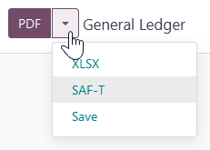
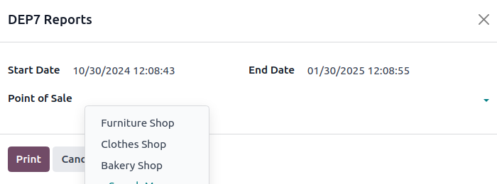
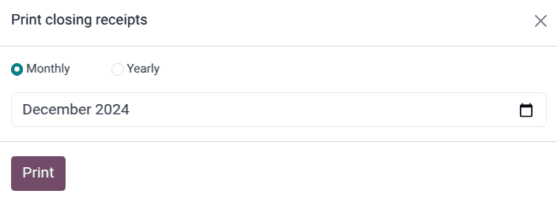

=======
Austria
=======

Configuration
=============

:ref:`Install <general/install>` the following modules to get all the features of the Austrian
localization.

.. list-table::
   :header-rows: 1

   * - Name
     - Technical name
     - Description
   * - :guilabel:`Austria - Accounting`
     - `l10n_at`
     - Default :ref:`fiscal localization package <fiscal_localizations/packages>`.
   * - :guilabel:`Austria - Accounting Reports`
     - `l10n_at_reports`
     - Adds localized versions of financial reports
   * - :guilabel:`Austrian SAF-T Export`
     - `l10n_at_saft`
     - Adds the SAF-T export.
   * - :guilabel:`Austrian RKSV Regulations for POS(Fiskaly)`
     - `l10n_at_pos`
     - Adds RKSV compliance for POS.

.. seealso::
   :doc:`Documentation on e-invoicing’s legality and compliance in Austria
   <../accounting/customer_invoices/electronic_invoicing/austria>`

Financial reports
=================

The following localized reports are available:

  - Balance sheet according to `§ 224 UGB <https://www.ris.bka.gv.at/NormDokument.wxe?Abfrage=Bundesnormen&Gesetzesnummer=10001702&Artikel=&Paragraf=224&Anlage=&Uebergangsrecht=>`_
  - Profit and loss according to `§ 231 UGB <https://www.ris.bka.gv.at/NormDokument.wxe?Abfrage=Bundesnormen&Gesetzesnummer=10001702&Artikel=&Paragraf=231&Anlage=&Uebergangsrecht=>`_ (Gesamtkostenverfahren)

.. seealso::
   :doc:`Accounting reporting documentation <../accounting/reporting>`

SAF-T (Standard Audit File for Tax)
===================================

The Austrian tax office may request a SAF-T. The Austrian SAF-T Export module allows exporting the
report in XML format.

Configuration
-------------

This section explains how to configure the database to ensure all the information required by the
SAF-T is available. If anything is missing, a warning message listing which information is needed
will be displayed during the export.

Company information
~~~~~~~~~~~~~~~~~~~

Open the database :guilabel:`Settings`. Under the :guilabel:`Companies` section, click
:guilabel:`Update Info` and ensure the following fields are correctly filled in:

- :guilabel:`Address`, by providing at least the following information:

  - :guilabel:`Street`
  - :guilabel:`City`
  - :guilabel:`ZIP`
  - :guilabel:`Country`

- :guilabel:`Phone`
- :guilabel:`Company ID` by providing your company's tax ID
- :guilabel:`Tax ID` by providing, if you have one, your :abbr:`UID-Nummer
  (Umsatzsteueridentifikationsnummer)` (including the country prefix)

Contact person
**************

At least one **contact person** must be linked to your company in the :guilabel:`Contacts` app, and:

  - Ensure the contact type is set to :guilabel:`Individual`.
  - Select your company in the :guilabel:`Company name` field.
  - Provide at least one phone number using the :guilabel:`Phone` or :guilabel:`Mobile` field.

Customer and supplier information
~~~~~~~~~~~~~~~~~~~~~~~~~~~~~~~~~

Using the :guilabel:`Contacts` app, fill in the :guilabel:`Address` of any partner that appears in
your invoices, vendor bills, or payments.

For partners that are companies, fill in the VAT number (including the country prefix) in the
:guilabel:`Tax ID` field.

Accounting settings
~~~~~~~~~~~~~~~~~~~

Go to :menuselection:`Accounting --> Configuration --> Settings`. Under the :guilabel:`Austrian
localization` section, fill in the following fields:

- :guilabel:`ÖNACE-Code`
- :guilabel:`Profit Assessment Method`

.. seealso::
   `ÖNACE information on the Austrian Economic Chambers website
   <https://www.wko.at/service/zahlen-daten-fakten/oenace.html>`_

Chart of accounts mapping
~~~~~~~~~~~~~~~~~~~~~~~~~

The Austrian SAF-T specifications define a chart of accounts (COA). All relevant accounts for the
SAF-T export must be annotated with a fitting account from this COA.

The needed mapping information is supplied by adding tags to the accounts. For example, adding the
`1000` tag to an account maps it (virtually) to the SAF-T COA account with the code `1000`. Any
number can be used as long as there is an account in the SAF-T COA with that code.

The :guilabel:`Austria - Accounting` module adds a tag for each SAF-T COA account. Furthermore, it
automatically maps many accounts from the default Austrian COA.

You can try exporting the SAF-T report to check if there are unmapped accounts (or mapped to
multiple SAF-T accounts). A warning will be displayed if there is any issue with your configuration
or the mapping. Clicking :guilabel:`View Problematic Accounts` lets you view them.

.. seealso::
   :doc:`Chart of accounts documentation <../accounting/get_started/chart_of_accounts>`

Exporting the SAF-T report
--------------------------

To export the SAF-T report, go to :menuselection:`Accounting --> Reports --> General Ledger`. Click
the right side of the :guilabel:`PDF` button and select :guilabel:`SAF-T`.

.. _austria/pos:

Point of Sale
=============

RKSV
----

The **RKSV (Registrierkassensicherheitsverordnung)** is an Austrian regulation designed
to secure cash registers and prevent tax fraud. It requires businesses to use tamper-proof
electronic cash register systems, including :doc:`point of sale </applications/sales/point_of_sale>`
systems.

These systems must be equipped with a **Signature Creation Unit (SCU)**, which is
responsible for signing each transaction. This ensures that the transaction data cannot be altered.
Additionally, the regulation mandates periodic transaction data exports for audit purposes.
Odoo offers a service that is compliant with the help of `fiskaly <https://fiskaly.com>`_, a
*cloud-based solution*.

.. important::
   - Since this solution is cloud-based, a working internet connection is required.

Configuration
~~~~~~~~~~~~~

:ref:`Install <general/install>` the **Austria - Security Regulation for Point of Sale**
(`l10n_at_pos`) module.

.. tip::
   If this module is not listed, :ref:`update the app list <general/install>`.

Company registration at fiskaly
*******************************

To register your company, open the :guilabel:`Settings` app, click :guilabel:`Update Info` under the
:guilabel:`General Information` section, and make sure to fill in proper details in the following fields:

- :guilabel:`VAT`
- :guilabel:`Address`

You are about to register your company at fiskaly, to do so open the **Fiskaly** tab of the company.

.. important::
   - For testing purposes, you should make sure to use the **Test Mode**. This will allow you to
     test the integration without affecting the production server. You can enable this mode in the
     :guilabel:`Fiskaly` tab of the company page by toggling the **Test Mode** switch.
      - If you need access to fiskaly's test environment, you can contact POS team to get access.
   - You will see the **Managed by Odoo** toggle. If you want to use the fiskaly service through Odoo,
     you need to enable this toggle. This will allow Odoo to manage the fiskaly service for you.
   - In case you already have a fiskaly account, you can disable this toggle to use your existing
     fiskaly credentials.

     .. image:: austria/management-toggle.png
        :alt: Management toggle

   - Once you authenticate your credentials, you can neither change the **Managed by Odoo** toggle
     nor the **Credentials**.

To register your company, click the :guilabel:`Generate Credentials` button. This will
create a new organization in the fiskaly system and generate the set of credentials nedded to
run the service.
You need to authenticate your credentials by clicking the :guilabel:`Authenticate Keys` button.

Link fiskaly organization to FinanzOnline
*****************************************

After authenticating your credentials, you need to provide your **FinanzOnline** credentials.
Which will be used to link your fiskaly organization to the Austrian Ministry of Finance.
Enter following credentials in the **FON Credentials** section:

- :guilabel:`Participant ID`
- :guilabel:`User ID`
- :guilabel:`User Pin`

.. important::
   - You can find these credentials in your FinanzOnline account.
   - If you don't have a FinanzOnline account, you can create one by visiting the
     `FinanzOnline website <https://finanzonline.bmf.gv.at/>`_.
   - If you are using the **Test Mode**, you can use dummmy credentials, but for
     **Production Mode** you need to provide your actual credentials.

Click the :guilabel:`Authenticate FON` button to link your fiskaly organization to the
Austrian Ministry of Finance.
You are all set to use the fiskaly services. Now you can start using the point of sale as usual.

Digitally Signatured Receipts
~~~~~~~~~~~~~~~~~~~~~~~~~~~~~

To ensure the integrity and authenticity of the receipts, the system will automatically sign
the receipts using the SCU. This process is done automatically in the background, and you will
be able to see encrypted signature in the form of QR code on your receipts with the
information about the SCU used to sign the receipt & the receipt number.

.. note::
   - It is possible not to have the QR code on the receipts due to the unavailability of the SCU.
      - But make sure your receipts have **Sicherheitseinrichtung ausgefallen** printed on them, which
        indicates that you are linked to the fiskaly services and the SCU is not available.
      - If you don't have this printed on your receipts, you are not linked to the fiskaly services.
   - In such cases, you can use the **Sign Orders** action to sign the orders manually.
     The **Sign Orders** action is only available for the orders that are not signed yet. You can
     find them by unhiding the **Signed** field in the list view of the orders.
   - You can find this action in the :guilabel:`Point of Sale` app under the
      :guilabel:`Orders` menu.

   .. image:: austria/sign-order-action.png
      :alt: Sign orders action

DEP7 export
~~~~~~~~~~~

The exported :abbr:`DEP7 (Digitale Schnittstelle der Finanzverwaltung für Kassensysteme)`
file allows authorities to verify transactions and ensure compliance with anti-fraud measures.
Businesses must periodically export the DEP7 data for audits and submit it to the austrian
tax authorities upon request.

You can export the data by going to :menuselection:`Point of
Sale --> Reporting --> DEP7 Reports`.

These fields are mandatory:

- :guilabel:`Start Datetime`: export data with dates larger than or equal to the given start date
- :guilabel:`End Datetime`: export data with dates smaller than or equal to the given end date

Specify the :guilabel:`Point of Sale` field with all your points of sale you want to export data for.
You will then be able to donload a PDF file with the DEP7 data.

Monthly / Yearly Closing Receipts
~~~~~~~~~~~~~~~~~~~~~~~~~~~~~~~~~

If you need any specific **Monthly Closing Receipt** or **Yearly Closing Receipt** of any perticular
cash register (config), you can go to any open session of that config and print receipts by clicking
**Monthly / Yearly Receipts** under dropdown menu of navigation bar.

By default :guilabel:`last month` will be selected which you can change and based on radio button
selectionyou can print **Monthly** or **Yearly** closing receipts.

