=======
Belgium
=======

.. _belgium/configuration:

Configuration
=============

Install the :guilabel:`🇧🇪 Belgium` :ref:`fiscal localization package
<fiscal_localizations/packages>` to get all the default accounting features of the Belgian
localization, following the :abbr:`IFRS(International Financial Reporting Standards)` rules.

.. _belgium/coa:

Chart of accounts
=================

You can reach the :guilabel:`Chart of accounts` by going to :menuselection:`Accounting -->
Configuration --> Accounting: Chart of Accounts`.

The Belgian chart of accounts includes pre-configured accounts as described in the :abbr:`PCMN(Plan
Comptable Minimum Normalisé)`. To add a new account, click :guilabel:`New`. A new line appears. Fill
it in, click :guilabel:`Save`, and then :guilabel:`Setup` to configure it further.

.. seealso::
   :doc:`../accounting/get_started/chart_of_accounts`

.. _belgium/taxes:

Taxes
=====

Default Belgian taxes are created automatically when the :guilabel:`Belgium - Accounting` and
the :guilabel:`Belgium - Accounting Reports` modules are installed. Each tax impacts the Belgian
:guilabel:`Tax Report`, available by going to :menuselection:`Accounting --> Reporting -->
Statements Reports: Tax Report`.

In Belgium, the standard VAT rate is **21%**, but there are lower rates for some categories of goods
and services. An intermediate rate of **12%** is applied on social housing and food served in
restaurants, while a reduced rate of **6%** applies to most basic goods, such as food, water supply,
books, and medicine. A **0%** rate applies to some exceptional goods and services, such as some
daily and weekly publications, as well as recycled goods.

.. _belgium/non-deductible:

Non-deductible taxes
--------------------

In Belgium, some taxes are not fully deductible, such as taxes on the maintenance of cars. This
means a part of these taxes is considered as an expense.

In Odoo, you can configure non-deductible taxes by creating tax rules for these taxes and linking
them to the corresponding accounts. This way, the system automatically calculates the taxes and
allocates them to the appropriate accounts.

To configure a new non-deductible tax, go to :menuselection:`Accounting --> Configuration -->
Accounting: Taxes`, and click :guilabel:`New`:

#. :guilabel:`Add a line` and select :guilabel:`Base` in the :guilabel:`Based On` column;
#. :guilabel:`Add a line`, then select :guilabel:`on tax` in the :guilabel:`Based on` column and
   enter the **non-deductible** percentage in the :guilabel:`%` column;
#. On the :guilabel:`of tax` line, select the :guilabel:`Tax Grid(s)` related to your tax;
#. :guilabel:`Add a line` with the **deductible** percentage in the :guilabel:`%` column;
#. Set :guilabel:`of tax` in :guilabel:`Based On`;
#. Select :guilabel:`411000 VAT recoverable` as account, and select the related tax grid.

Once you have created a non-deductible tax, you can apply it to your transactions by selecting the
appropriate tax during the encoding of bills and credit notes. The system automatically calculates
the tax amount and allocates it to the corresponding accounts based on the tax rules configured.

.. example::
   With the Belgian localization, the **21% car** tax is created by default (50% non-deductible).

   .. image:: belgium/deductible-tax.png
      :alt: Example of not-fully deductible tax

.. seealso::
  - :doc:`Taxes <../accounting/taxes>`
  - :doc:`../accounting/reporting/tax_returns`

.. _belgium/reports:

Reports
=======

Here is the list of Belgian-specific reports available:

- Balance sheet;
- Profit & loss;
- Tax report;
- Partner VAT Listing;
- EC Sales List;
- Intrastat.

You can access Belgian-specific versions of reports by clicking on the **book** icon when on a
report and selecting its Belgian version: **(BE)**.

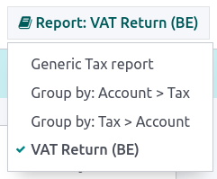

.. seealso::
   :doc:`../accounting/reporting`

.. _belgium/disallowed-expenses:

Disallowed expenses report
--------------------------

**Disallowed expenses** are expenses that can be deducted from your accounting result but not from
your fiscal result.

The **disallowed expenses report** is available by going to :menuselection:`Accounting --> Reporting
--> Management: Disallowed Expenses`. It allows financial results in real-time, and periodic
changes. This report is generated based on the **disallowed expenses categories** that you can reach
by going to :menuselection:`Accounting --> Configuration --> Management: Disallowed Expenses
Categories`. Some categories already exist by default but do not have any rates. Click on
:guilabel:`Set Rates` to update a specific category.

.. tip::
  - You can add multiple rates for various dates. In that case, the rate used to calculate the
    expense depends on the date at which it is calculated, and the rate set for that date.
  - If you have the **Fleet** app installed, tick the :guilabel:`Car Category` box when applicable.
    This makes the vehicle mandatory while booking a vendor bill.

To link a disallowed expenses category with a specific account, go to :menuselection:`Accounting -->
Configuration --> Accounting: Chart of Accounts`. Find the account you want, and click on
:guilabel:`Setup`. Add the :guilabel:`Disallowed Expense category` in the :guilabel:`Disallowed
Expenses` field. From now, when an expense is created with this account, the disallowed expense is
calculated based on the rate mentioned in the :guilabel:`Disallowed Expense category`.

Let's take an example reflecting **restaurant** and **car expenses**.

.. _belgium/restaurant-expenses:

Restaurant expenses
~~~~~~~~~~~~~~~~~~~

In Belgium, 31% of **restaurant** expenses are non-deductible. Create a new **disallowed expenses
category** and set both :guilabel:`Related Account(s)` and :guilabel:`Current Rate`.

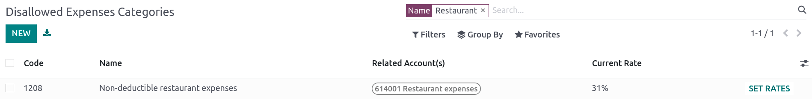

.. _belgium/vehicle-split:

Car expenses: vehicle split
~~~~~~~~~~~~~~~~~~~~~~~~~~~

In Belgium, the deductible percentage varies from car to car and, therefore, should be indicated for
each vehicle. To do so, open :menuselection:`Fleet` and select a vehicle. In the :guilabel:`Tax
info` tab, go to the :guilabel:`Disallowed Expenses Rate` section and click on :guilabel:`Add a
line`. Add a :guilabel:`Start Date` and a :guilabel:`%`. The amounts go in the same account for all
car expenses.

When you create a bill for car expenses, you can link each expense to a specific car by filling the
:guilabel:`Vehicle` column, so the right percentage is applied.

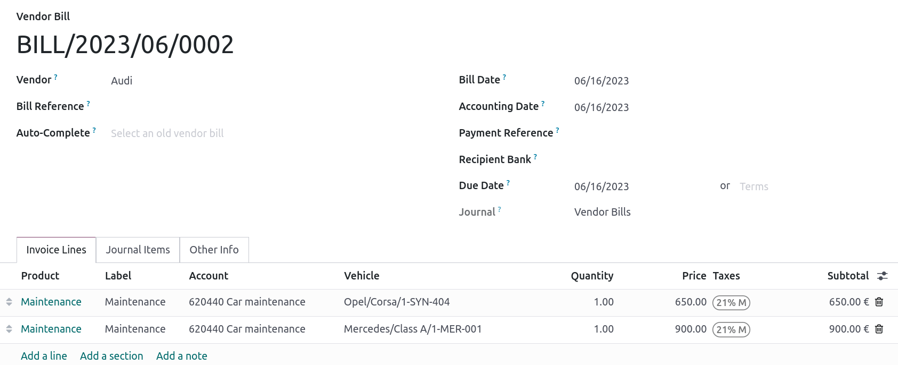

The :guilabel:`vehicle split` option available in the disallowed expenses report allows you to see
the rate and disallowed amount for each car.

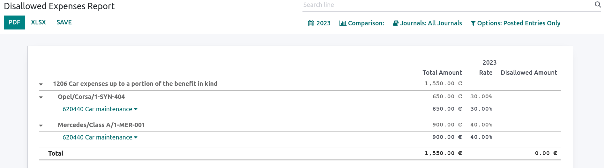

.. _belgium/forms:

Fee form 281.50 and form 325
============================

.. _belgium/281.50:

Fee form 281.50
---------------

Annually, a **281.50 fee form** must be reported to the fiscal authorities. To do so, the tag
`281.50` must be added on the **contact form** of the entities concerned by the **281.50** fee. To
add the tag, open :menuselection:`Contacts`, select the person or company you want to create a
**281.50 fee form** for, and add the `281.50` tag in the :guilabel:`Tags` field.

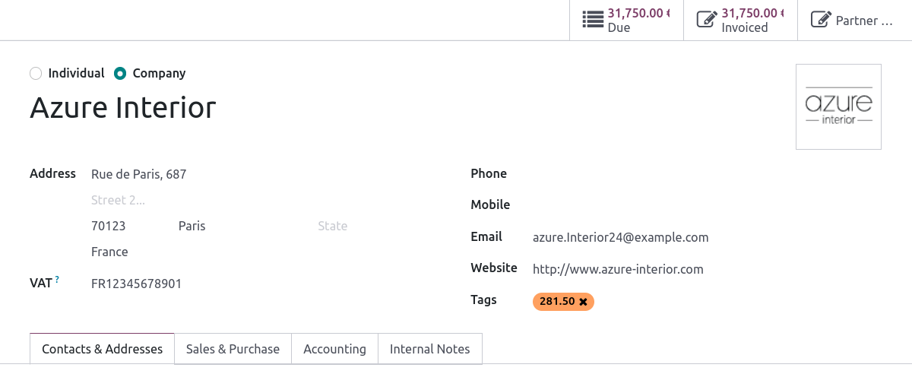

.. note::
   Make sure the **street, zip code, country**, and **VAT number** are also informed on the
   **Contact form**.

Then, depending on the nature of the expense, add the corresponding `281.50` tag on the impact
accounts. To do so, go to :menuselection:`Accounting --> Configuration --> Accounting: Chart of
Accounts`, and click on :guilabel:`Setup` to add the corresponding `281.50` tag on the impacted
accounts, i.e., :guilabel:`281.50 - Commissions`, depending on the nature of the expense.

.. _belgium/325:

Form 325
--------

You can create a **325 form** by going to :menuselection:`Accounting --> Reporting --> Belgium:
Create 325 form`. A new page pops up: select the right options and click :guilabel:`Generate 325
form`. To open an already generated **325 form**, go to :menuselection:`Accounting --> Reporting -->
Belgium: Open 325 forms`.

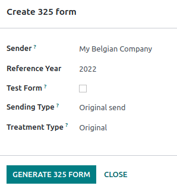

.. _belgium/coda-soda:

CODA and SODA statements
========================

.. _belgium/coda:

CODA
----

**CODA** is an electronic XML format used to import Belgian bank statements. You can download CODA
files from your bank and import them directly into Odoo by clicking :guilabel:`Import Statement`
from your :guilabel:`Bank` journal on your dashboard.

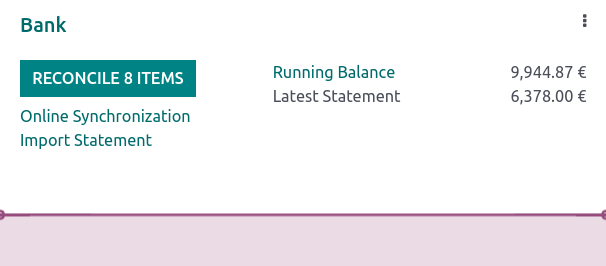

.. seealso::
   :ref:`Import bank statements files <transactions/import>`

.. _belgium/soda:

SODA
----

**SODA** is an electronic XML format used to import accounting entries related to salaries. SODA
files can be imported into the journal you use to record salaries by going to your Accounting
**dashboard** and clicking :guilabel:`Upload` in the related journal card form.

Once your **SODA** files are imported, the entries are created automatically in your salary journal.

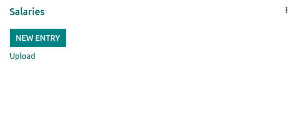

.. _belgium/einvoicing:

CodaBox
-------

**CodaBox** is a service that allows Belgian accounting firms to access their clients' bank
information and statements. Odoo provides a way to import such statements automatically.

.. note::
   As an accounting firm, you must manage your clients on separate databases and configure them
   individually to avoid mixing up their data.

Configuration
~~~~~~~~~~~~~

The configuration must be done on each client database. In the following
instructions, we will refer to your client's company as *Company* and to your
accounting firm as *Accounting Firm*.

You must first :ref:`install <general/install>` :guilabel:`CodaBox` and
:guilabel:`CodaBox Bridge Wizard` (if available) to start.

.. important::
   Make sure the company settings are correctly configured, i.e., the country is set to
   :guilabel:`Belgium`, the :guilabel:`Tax ID` and :guilabel:`Accounting Firm` fields are filled,
   as well as the :guilabel:`Tax ID` of the accounting firm (if not filled, the :guilabel:`Tax ID`
   of the company is used).

Configure the journals
**********************

.. tabs::

   .. tab:: For CODA files

      #. :doc:`Create a new bank journal <../accounting/bank>`.
      #. Set the right IBAN in the :guilabel:`Account Number` field.
      #. Select :guilabel:`CodaBox synchronization` as the :guilabel:`Bank Feed`.

      .. image:: belgium/codabox_configuration_coda_journal.png
         :align: center
         :alt: Configuration of a CODA journal.

   .. tab:: For SODA files

      #. Create a new miscellaneous journal.
      #. Go to :menuselection:`Accounting --> Configuration --> Settings`, then go to the
         :guilabel:`CodaBox` section.
      #. Select the journal you just created in the SODA journal field.

      .. image:: belgium/codabox_configuration_soda_setting.png
         :align: center
         :alt: Configuration of a SODA journal.

.. _belgium/codabox-configuration-connection:

Configure the connection
************************

#. Go to :menuselection:`Accounting --> Configuration --> Settings`, then go to the
   :guilabel:`CodaBox` section.
#. Click on :guilabel:`Manage Connection` to open the connection wizard, which shows the
   :guilabel:`Accounting Firm VAT` number and the :guilabel:`Company VAT` number that will be used
   for the connection.
#. If this is your **first connection**, click on :guilabel:`Create connection`.
   The wizard confirms that the connection has been created on **Odoo's side**. Follow the steps
   to validate the connection on **CodaBox's side**, too.

   If this is **not your first connection**, the :guilabel:`Accounting Firm Password` provided by
   Odoo during the first connection will be requested to create a new connection.

      .. note::
        This :guilabel:`Accounting Firm Password` is unique to Odoo and must be stored securely
        on your side.

The :guilabel:`Status` should have now switched to :guilabel:`Connected`.

Synchronization
~~~~~~~~~~~~~~~

Once the connection is established, Odoo can be synchronized with CodaBox.

.. tabs::

   .. tab:: For CODA files

      CODA files are automatically imported from CodaBox every 12 hours. You do
      not have to do anything. However, if you wish, it can also be done manually,
      by clicking on :guilabel:`Fetch CODA's` in the Accounting Dashboard.

      .. image:: belgium/codabox_dashboard_coda.png
         :align: center
         :alt: Manually fetch CODA's.

   .. tab:: For SODA files

      SODA files are automatically imported from CodaBox once a day as a draft. You do not have to
      do anything. However, if you wish, it can also be done manually by clicking on
      :guilabel:`Fetch SODA's` in the Accounting Dashboard.

      By default, if an account in the SODA file is not mapped to an account in Odoo, the Suspense
      Account (499000) is used, and a note is added to the created journal entry.

      .. image:: belgium/codabox_dashboard_soda.png
         :align: center
         :alt: Manually fetch SODA's.

      .. note::
         You can access the mapping between the SODA and Odoo accounts by going to
         :menuselection:`Accounting --> Configuration --> Settings` and clicking on the
         :guilabel:`Open SODA Mapping` button in the :guilabel:`CodaBox` section.

Potential issues
~~~~~~~~~~~~~~~~

* **CodaBox is not configured. Please check your configuration.**

  Either the :guilabel:`Company VAT` or the :guilabel:`Accounting Firm VAT` is not set.

*  **No connection exists with these accounting firms and company VAT numbers.**
   **Please check your configuration.**

    This can happen when checking the connection status, and the :guilabel:`Accounting Firm VAT` and
    :guilabel:`Company VAT` combination still needs to be registered. This may happen if you have
    changed the :guilabel:`Company VAT` after the connection was established. For security reasons,
    you have to :ref:`recreate a connection <belgium/codabox-configuration-connection>`
    for this :guilabel:`Company VAT`.

*  **It seems that your CodaBox connection is not valid anymore. Please connect again.**

    This can happen if you revoke Odoo's access to your CodaBox account or still need to complete
    the configuration process. In this case, you must revoke the connection and create a new one.

*  **The provided password is not valid for this accounting firm.**
   **You must reuse the password you received from Odoo during your first connection.**

    The password you provided is different from the one you received from Odoo during your first
    connection. You must use the password you received from Odoo during your first connection to
    create a new connection for this accounting firm. If you have lost your password, you must first
    revoke the Odoo connection on CodaBox's side (i.e., on your myCodaBox portal). Then, you can
    revoke the connection on Odoo's side and
    :ref:`create a new one <belgium/codabox-configuration-connection>`.

*  **It seems that the company or accounting firm VAT number you provided is not valid.**
   **Please check your configuration.**

    Either the :guilabel:`Company VAT` or the :guilabel:`Accounting Firm VAT` is not in a valid
    Belgian format.

*  **It seems that the accounting firm VAT number you provided does not exist in CodaBox.**
   **Please check your configuration.**

    The :guilabel:`Accounting Firm VAT` number you provided is not registered in CodaBox.
    You may not have a valid CodaBox license linked to this VAT number.

*  **It seems you have already created a connection to CodaBox with this accounting firm.**
   **To create a new connection, you must first revoke the old one on myCodaBox portal.**

    You must go to your myCodaBox portal and revoke Odoo's access to your CodaBox account.
    Then, you can :ref:`create a new connection <belgium/codabox-configuration-connection>`
    on Odoo's side.

.. tip::
    To revoke the connection between Odoo and CodaBox, go to
    :menuselection:`Accounting --> Configuration --> Settings`, scroll down to the
    :guilabel:`CodaBox` section, click on :guilabel:`Manage Connection`, then click on
    :guilabel:`Revoke`.

Electronic invoicing
====================

Odoo supports the **Peppol BIS Billing 3.0 (UBL)** electronic invoicing format. To enable it for a
customer, go to :menuselection:`Accounting --> Customers --> Customers`, open their contact form,
and under the :guilabel:`Accounting` tab, select the :guilabel:`Peppol BIS Billing 3.0` format.

.. seealso::
   :doc:`../accounting/customer_invoices/electronic_invoicing`

.. _belgium/cash-discount:

Cash discount
=============

In Belgium, if an early payment discount is offered on an invoice, the tax is calculated based on
the discounted total amount, whether the customer benefits from the discount or not.

To apply the right tax amount and report it correctly in your VAT return, set the tax reduction as
:guilabel:`Always (upon invoice)`.

.. seealso::
   :doc:`../accounting/customer_invoices/cash_discounts`

.. _belgium/pos-restaurant-certification:

Fiscal certification: POS restaurant
====================================

In Belgium, the owner of a cooking business such as a restaurant or food truck is required by law to
use a government-certified **Cash Register System** for their receipts. This applies if their yearly
earnings (excluding VAT, drinks, and take-away food) exceed 25,000 euros.

This government-certified system entails the use of a :ref:`certified POS system
<belgium/certified-pos>`, along with a device called a :ref:`Fiscal Data Module <belgium/fdm>` (or
**black box**) and a :ref:`VAT Signing Card <belgium/vat>`.

.. important::
   Do not forget to register as *foodservice industry manager* on the `Federal Public Service
   Finance registration form <https://www.systemedecaisseenregistreuse.be/fr/enregistrement>`_.

.. _belgium/certified-pos:

Certified POS system
--------------------

The Odoo POS system is certified for the major versions of databases hosted on **Odoo Online** and
**Odoo.sh**. Please refer to the following table to ensure that your POS system is certified.

.. list-table::
   :header-rows: 1
   :stub-columns: 1

   * -
     - Odoo Online
     - Odoo.sh
     - On-Premise
   * - Odoo 16.0
     - Certified
     - Certified
     - Not certified
   * - Odoo 15.2
     - Not certified
     - Not certified
     - Not certified
   * - Odoo 15.0
     - Certified
     - Certified
     - Not certified
   * - Odoo 14.0
     - Certified
     - Certified
     - Not certified

.. seealso::
   :doc:`/administration/maintain/supported_versions`

A `certified POS system <https://www.systemedecaisseenregistreuse.be/systemes-certifies>`_ must
adhere to rigorous government regulations, which means it operates differently from a non-certified
POS.

- On a certified POS, you cannot:

  - Set up and use the **global discounts** feature (the `pos_discount` module is blacklisted and
    cannot be activated).
  - Set up and use the **loyalty programs** feature (the `pos_loyalty` module is blacklisted and
    cannot be activated).
  - Reprint receipts (the `pos_reprint` module is blacklisted and cannot be activated).
  - Modify prices in order lines.
  - Modify or delete order lines in POS orders.
  - Sell products without a valid VAT number.
  - Use a POS that is not connected to an IoT box.

- The :doc:`cash rounding <../../sales/point_of_sale/pricing/cash_rounding>` feature must be
  activated and set to a :guilabel:`Rounding Precision` of `0,05` and a :guilabel:`Rounding Method`
  set as :guilabel:`Half-Up`.
- Taxes must be set as included in the price. To set it up, go to :menuselection:`Point of Sale -->
  Configuration --> Settings`, and from the :guilabel:`Accounting` section, open the
  :guilabel:`Default Sales Tax` form by clicking the arrow next to the default sales tax field.
  There, click :guilabel:`Advanced Options` and enable :guilabel:`Included in Price`.
- At the start of a POS session, users must click :guilabel:`Work in` to clock in. Doing so allows
  the registration of POS orders. If users are not clocked in, they cannot make POS orders.
  Likewise, they must click :guilabel:`Work Out` to clock out at the end of the session.

.. warning::
   If you configure a POS to work with a :abbr:`FDM (Fiscal Data Module)`, you cannot use it again
   without it.

.. _belgium/fdm:

Fiscal Data Module (FDM)
------------------------

An FDM, or **black box**, is a government-certified device that works together with the Point of
Sale application and saves your POS orders information. Concretely, a **hash** (:dfn:`unique code`)
is generated for each POS order and added to its receipt. This allows the government to verify that
all revenue is declared.

.. warning::
   Only the FDM from **Boîtenoire.be** with the `FDM certificate number BMC01
   <https://www.systemedecaisseenregistreuse.be/fr/systemes-certifies#FDM%20certifiés>`_ is
   supported by Odoo. `Contact the manufacturer (GCV BMC) <https://www.boîtenoire.be/contact>`_ to
   order one.

Configuration
~~~~~~~~~~~~~

Before setting up your database to work with an FDM, ensure you have the following hardware:

- a **Boîtenoire.be** (certificate number BMC01) FDM;
- an RS-232 serial null modem cable per FDM;
- an RS-232 serial-to-USB adapter per FDM;
- an :ref:`IoT Box <belgium/iotbox>` (one IoT box per FDM); and
- a receipt printer.

.. _belgium/blackbox:

Black box module
****************

As a pre-requisite, :ref:`activate <general/install>` the `Belgian Registered Cash Register` module
(technical name: `pos_blackbox_be`).

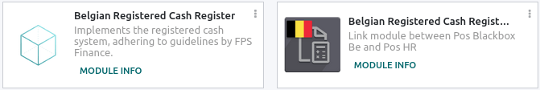

Once the module is activated, add your VAT number to your company information. To set it up, go to
:menuselection:`Settings --> Companies --> Update Info`, and fill in the :guilabel:`VAT` field.
Then, enter a national registration number for every staff member who operates the POS system. To do
so, go to the :guilabel:`Employees` app and open an employee form. There, go to :menuselection:`HR
settings tab --> Attendance/Point of Sale`, and fill in the :guilabel:`INSZ or BIS number` field.

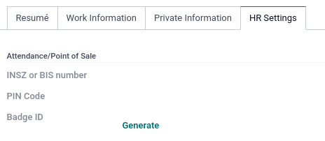

.. tip::
   To input your information, click on your avatar, go to :menuselection:`My Profile --> Preference
   tab`, and enter your INSZ or BIS number in the designated field.

.. warning::
   You must configure the :abbr:`FDM (Fiscal Data Module)` directly in the production database.
   Utilizing it in a testing environment may result in incorrect data being stored within the FDM.

.. _belgium/iotbox:

IoT Box
*******

In order to use an :abbr:`FDM (Fiscal Data Module)`, you need a registered IoT Box. To register your
IoT box, you must contact us through our `support contact form <https://www.odoo.com/help>`_ and
provide the following information:

- your VAT number;
- your company's name, address, and legal structure; and
- the Mac address of your IoT Box.

Once your IoT box is certified, :doc:`connect <../../productivity/iot/config/connect>` it to your
database. To verify that the IoT Box recognizes the FDM, go to the IoT homepage and scroll down the
:guilabel:`IOT Device` section, which should display the FDM.

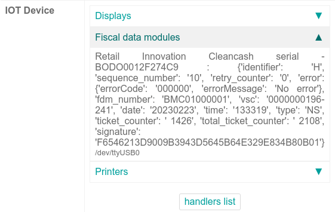

Then, add the IoT to your POS. To do so, go to :menuselection:`Point of Sale --> Configuration -->
Point of Sale`, select your POS, scroll down to the :guilabel:`Connected Device` section, and enable
:guilabel:`IoT Box`. Lastly, add the FMD in the :guilabel:`Fiscal Data Module` field.

.. note::
   To be able to use an FDM, you must at least connect one :guilabel:`Receipt Printer`.

.. _belgium/vat:

VAT signing card
----------------

When you open a POS session and make your initial transaction, you are prompted to enter the PIN
provided with your :abbr:`VSC (VAT signing card)`. The card is delivered by the :abbr:`FPS (Service
Public Federal Finances)` upon `registration <https://www.systemedecaisseenregistreuse.be/fr/enregistrement>`_.
