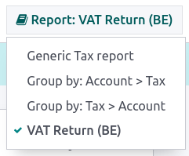
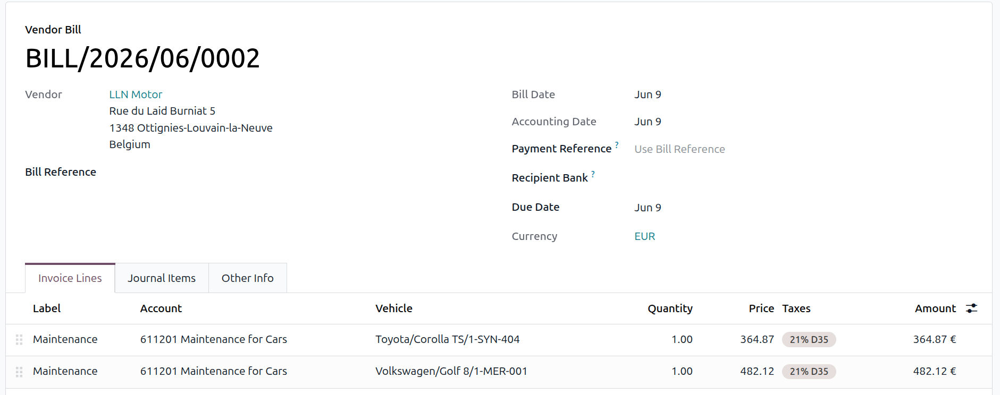
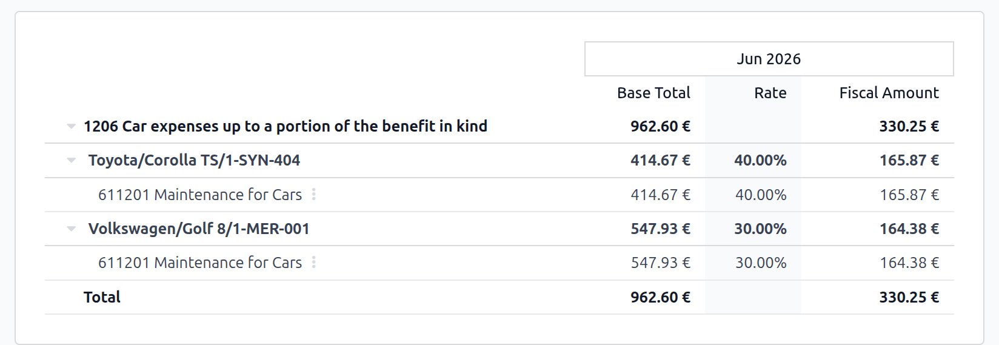
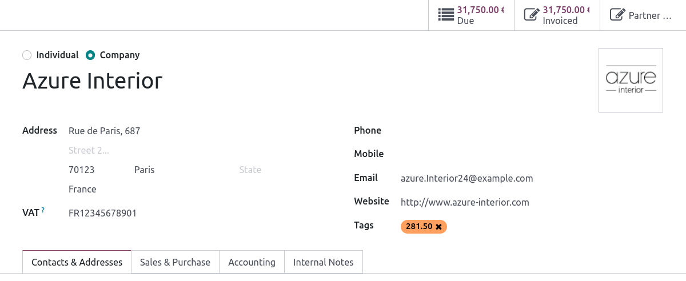
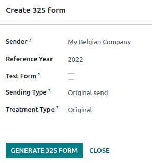
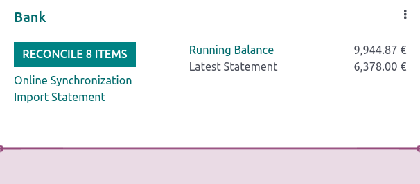
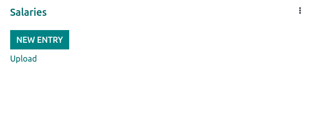
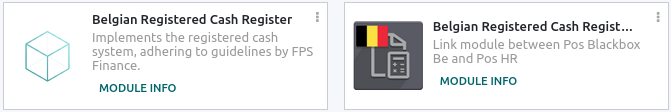
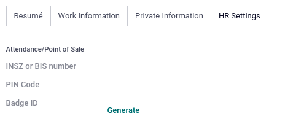
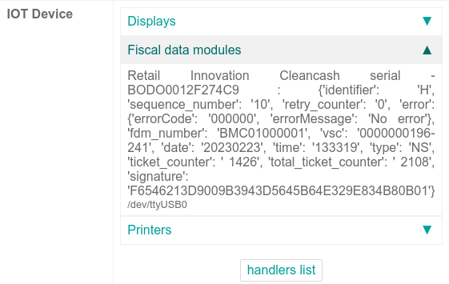

=======
Belgium
=======

.. _localizations_belgium/configuration/modules:

Modules
=======

The following modules are installed automatically with the Belgian localization:

.. list-table::
   :header-rows: 1
   :widths: 25 25 50

   * - Name
     - Technical name
     - Description
   * - :guilabel:`Belgium - Accounting`
     - `l10n_be`
     - Belgian :ref:`fiscal localization package <fiscal_localizations/packages>`, complete with
       the Belgian chart of accounts, taxes, tax report, and fiscal positions
   * - :guilabel:`Belgium - Accounting Reports`
     - `l10n_be_reports`
     - Module providing Belgian accounting reports
   * - :guilabel:`Belgium - Accounting Reports - SMS`
     - `l10n_be_report_sms`
     - Bridge module between Belgian accounting and SMS
   * - :guilabel:`Belgium - Accounting Reports Client Nihil`
     - `l10n_be_reports_client_nihil`
     - Extension for accounting returns in Belgium
   * - :guilabel:`Belgian Intervat & Myminfin Edi`
     - `l10n_be_intervat`
     - Integration with Intervat and MyMinFin APIs, allowing the sending and receipt of electronic
       VAT declarations
   * - :guilabel:`Belgium - Import SODA files`
     - `l10n_be_soda`
     - Module to import SODA files
   * - :guilabel:`Belgium - Import Bank CODA Statements`
     - `l10n_be_coda`
     - Module to import CODA bank statements
   * - :guilabel:`Belgium - Fiscal Categories Data`
     - `l10n_be_fiscal_categories`
     - Fiscal categories data

.. note::
   In some cases, such as when upgrading to a version with additional modules, it is possible that
   modules may not be installed automatically. Any missing modules can be manually :ref:`installed
   <general/install>`.

.. _belgium/configuration:

Configuration
=============

Install the Belgian :ref:`fiscal localization package <fiscal_localizations/packages>` to get all
the default accounting features of the Belgian localization, following the :abbr:`IFRS(International
Financial Reporting Standards)` rules.

.. seealso::
   :doc:`Documentation on e-invoicing’s legality and compliance in Belgium
   <../accounting/customer_invoices/electronic_invoicing/belgium>`

.. _belgium/coa:

Chart of accounts
=================

You can reach the :guilabel:`Chart of accounts` by going to :menuselection:`Accounting -->
Configuration --> Accounting: Chart of Accounts`.

The Belgian chart of accounts includes pre-configured accounts as described in the :abbr:`PCMN (Plan
Comptable Minimum Normalisé)` or :abbr:`MAR (Minimumindeling van het Algemeen Rekeningenstelsel)`.
To add a new account, click :guilabel:`New`. A new line appears. Fill it in, click :guilabel:`Save`,
and then :guilabel:`Setup` to configure it further.

.. seealso::
   :doc:`../accounting/get_started/chart_of_accounts`

.. _belgium/taxes:

Taxes
=====

Default Belgian taxes are created automatically when the :guilabel:`Belgium - Accounting` and
the :guilabel:`Belgium - Accounting Reports` modules are installed. Each tax impacts the Belgian
:guilabel:`Tax Report`, available by going to :menuselection:`Accounting --> Reporting -->
Statements Reports: Tax Report`.

In Belgium, the standard VAT rate is **21%**, but there are lower rates for some categories of goods
and services. An intermediate rate of **12%** is applied on social housing and food served in
restaurants, while a reduced rate of **6%** applies to most basic goods, such as food, water supply,
books, and medicine. A **0%** rate applies to some exceptional goods and services, such as some
daily and weekly publications, as well as recycled goods.

.. seealso::
   :doc:`Taxes <../accounting/taxes>`

.. _belgium/intervat:

Intervat
--------

.. note::
   - Make sure the :guilabel:`Belgian Intervat & Myminfin Edi` (`l10n_be_intervat`) module is
     :doc:`installed <../../general/apps_modules>` on your database.
   - When submitting your VAT returns, make sure to use XML or VAT format files. These are the only
     file formats accepted by Intervat.

`Intervat <https://financien.belgium.be/en/E-services/intervat>`_ is the electronic platform used to
submit VAT returns to the Belgian tax authorities. You can file your returns directly from Odoo
using the Intervat integration.

To set this up, open the **Accounting** app, go to :menuselection:`Configuration --> Settings`, and
scroll down to the :guilabel:`Taxes` section. From there, select a :guilabel:`Server Mode`, enter
your :guilabel:`VAT Number`, and select an :guilabel:`Accounting` firm if applicable.

.. seealso::
   :doc:`../accounting/reporting/tax_returns`

.. _belgium/non-deductible:

Non-deductible taxes
--------------------

In Belgium, some taxes are not fully deductible, such as taxes on the maintenance of cars. This
means a part of these taxes is considered as a :ref:`non-deductible expense
<belgium/disallowed-expenses>`.

In Odoo, you can configure non-deductible taxes by creating tax rules for these taxes and linking
them to the corresponding accounts. This way, the system automatically calculates the taxes and
allocates them to the appropriate accounts.

To configure a new non-deductible tax, go to :menuselection:`Accounting --> Configuration -->
Taxes`, and click :guilabel:`New`:

#. :guilabel:`Add a line` and select :guilabel:`Base` in the :guilabel:`Based On` column;
#. :guilabel:`Add a line`, then select :guilabel:`on tax` in the :guilabel:`Based on` column and
   enter the **non-deductible** percentage in the :guilabel:`%` column;
#. On the :guilabel:`of tax` line, select the :guilabel:`Tax Grid(s)` related to your tax;
#. :guilabel:`Add a line` with the **deductible** percentage in the :guilabel:`%` column;
#. Set :guilabel:`of tax` in :guilabel:`Based On`;
#. Select :guilabel:`411000 VAT recoverable` as account, and select the related tax grid.

Once you have created a non-deductible tax, you can apply it to your transactions by selecting the
appropriate tax during the encoding of bills and credit notes. The system automatically calculates
the tax amount and allocates it to the corresponding accounts based on the tax rules configured.

.. example::
   With the Belgian localization, the **21% car** tax is created by default (50% non-deductible).

   .. image:: belgium/deductible-tax.png
      :alt: Example of not-fully deductible tax

.. _belgium/vehicle-tax-deductibility:

Vehicle tax deductibility
-------------------------

.. note::
   To see the tax deductibility of a vehicle, the **Belgium - Disallowed Expenses Fleet**
   (`l10n_be_account_fiscal_categories_fleet`) module must be :doc:`installed
   <../../general/apps_modules>`.

A vehicle's tax deductibility rate varies depending on its type (car or bicycle) and several
factors, such as fuel type, CO2 emissions, engine power, etc.

To view the **tax deductibility percentage** for a specific model, open the **Fleet** app, navigate
to :menuselection:`Configuration --> Models`, and select a vehicle model. Locate the :guilabel:`Tax
Deduction` field, which is found under the :guilabel:`Engine` section for cars, or the
:guilabel:`Vehicle Information` section for bicycles.

.. important::
   The :guilabel:`Tax Deduction` field is strictly **informative** and is computed automatically
   based on the vehicle's specifications. It is **not** used for any automated calculations within
   the **Accounting** app and should not be confused with the :ref:`tax rate deductibility
   <belgium/non-deductible>` used on :ref:`tax grids <accounting/tax-returns/tax-grids>`. Instead,
   your accountant can reference this field to manually apply the correct deductible rate to
   invoices or :ref:`disallowed expenses <belgium/disallowed-expenses>`.

.. seealso::
   :ref:`Vehicle models <fleet/models>`

.. _belgium/reports:

Reports
=======

Here is the list of Belgian-specific reports available:

- Balance sheet;
- Profit & loss;
- Tax report;
- Partner VAT Listing;
- EC Sales List;
- Intrastat.

You can access Belgian-specific versions of reports by clicking on the **book** icon when on a
report and selecting its Belgian version: **(BE)**.

.. seealso::
   :doc:`../accounting/reporting`

.. _belgium/disallowed-expenses:

Disallowed expenses
-------------------

Disallowed expenses are business costs that are not fully tax-deductible. While they count as
business expenses in your accounting, tax laws do not allow you to use them to lower your taxable
income.

The **Fiscal Report** tracks disallowed expenses and is available by opening the **Accounting** app
and going to :menuselection:`Reporting --> Fiscal Report`. This report provides real-time financial
results and allows for periodic adjustments.

The report is generated based on **fiscal categories**, which can be managed by opening the
**Accounting** app, activating the :ref:`developer mode <developer-mode>` and going to
:menuselection:`Configuration --> Fiscal Categories`. While several default categories are provided,
you can create new ones by clicking :guilabel:`New`. Categories themselves do not contain rates.
Instead, categories are linked to accounts via the :guilabel:`Related Account(s)` field.

.. tip::
   - If the **Fleet** app is installed, check the :guilabel:`Requires a Vehicle` box where
     applicable. This makes selecting a vehicle mandatory when logging a vendor bill.
   - In a multi-company environment, you can restrict the category to a specific company by
     selecting it from the :guilabel:`Company` dropdown menu.

.. _belgium/set-fiscal-rate:

To set a rate on an account, open the **Accounting** app and go to :menuselection:`Configuration -->
Chart of Accounts` and open the account linked in the previous step. Under the :guilabel:`Fiscal
Rates` tab, click :guilabel:`Add a line` and enter a :guilabel:`Start Date` and :guilabel:`Fiscal
Rate (%)`.

Thereafter, whenever an expense is recorded using this account, the disallowed expense amount is
automatically calculated based on the rate specified in the :guilabel:`Fiscal Rates` tab.

.. tip::
    You can add multiple rates for different dates. The system will automatically apply the correct
    rate based on the date the expense is recorded.

.. _belgium/restaurant-expenses:

Restaurant expenses
~~~~~~~~~~~~~~~~~~~

**Restaurant** expenses are 69% deductible. To configure this, create a new :guilabel:`Fiscal
Category`, specify its :guilabel:`Related Account(s)`, then set the relevant :ref:`fiscal rates
<belgium/set-fiscal-rate>` on the respective related account(s).

.. _belgium/vehicle-split:

Vehicle expenses: vehicle split
~~~~~~~~~~~~~~~~~~~~~~~~~~~~~~~

The :ref:`deductibility percentage <belgium/vehicle-tax-deductibility>` varies and must be defined
individually for each vehicle in Odoo. To do this, open the :guilabel:`Fleet` app and select a
vehicle. In the :guilabel:`Tax info` tab, locate the :guilabel:`Fiscality` section and click
:guilabel:`Add a line` under the :guilabel:`Fiscal Deductibility` field. Set the :guilabel:`Start
Date` to indicate when the rate takes effect, and enter the corresponding :guilabel:`Non-deductible
(%)`. Note that, regardless of the deductibility percentage for each vehicle, expenses for all cars
are recorded under the same account in Odoo.

When creating a vendor bill for vehicle expenses, you can link each expense line to a specific
vehicle by filling in the :guilabel:`Vehicle` column (accessible by clicking the
:icon:`oi-settings-adjust` :guilabel:`(slider)` icon beside :guilabel:`Amount`, then selecting
:guilabel:`Vehicle`). This ensures the correct non-deductible percentage is applied.

To view the specific rates and disallowed amounts calculated for each vehicle in the **Fiscal
Report**, enable the :guilabel:`Vehicle Split` filter (located under :icon:`fa-sliders`
:guilabel:`Posted Entries`).

.. _belgium/forms:

Fee form 281.50 and form 325
============================

.. _belgium/281.50:

Fee form 281.50
---------------

Annually, a **281.50 fee form** must be reported to the fiscal authorities. To do so, the tag
`281.50` must be added on the **contact form** of the entities concerned by the **281.50** fee. To
add the tag, open :menuselection:`Contacts`, select the person or company you want to create a
**281.50 fee form** for, and add the `281.50` tag in the :guilabel:`Tags` field.

.. note::
   Make sure the **street, zip code, country**, and **VAT number** are also informed on the
   **Contact form**.

Then, depending on the nature of the expense, add the corresponding `281.50` tag on the impact
accounts. To do so, go to :menuselection:`Accounting --> Configuration --> Accounting: Chart of
Accounts`, and click on :guilabel:`Setup` to add the corresponding `281.50` tag on the impacted
accounts, i.e., :guilabel:`281.50 - Commissions`, depending on the nature of the expense.

.. _belgium/325:

Form 325
--------

You can create a **325 form** by going to :menuselection:`Accounting --> Reporting --> Belgium:
Create 325 form`. A new page pops up: select the right options and click :guilabel:`Generate 325
form`. To open an already generated **325 form**, go to :menuselection:`Accounting --> Reporting -->
Belgium: Open 325 forms`.

.. _belgium/coda-soda:

CODA and SODA statements
========================

.. _belgium/coda:

CODA
----

**CODA** is an electronic XML format used to import Belgian bank statements. You can download CODA
files from your bank and import them directly into Odoo by clicking :guilabel:`Import file` from
your :guilabel:`Bank` journal on your dashboard.

.. seealso::
   :ref:`Import bank files <accounting/transactions/import>`

.. _belgium/soda:

SODA
----

**SODA** is an electronic XML format used to import accounting entries related to salaries. SODA
files can be imported into the journal you use to record salaries by going to your Accounting
**dashboard** and clicking :guilabel:`Upload` in the related journal card form.

Once your **SODA** files are imported, the entries are created automatically in your salary journal.

.. _belgium/codabox:

CodaBox
-------

**CodaBox** is a service that allows Belgian companies and accounting firms to access bank
information and statements. Odoo provides a way to import such statements automatically.

.. _belgium/codabox-configuration:

Configuration
~~~~~~~~~~~~~

To configure and use Codabox, first :ref:`install <general/install>` the :guilabel:`CodaBox` module.

.. _belgium/codabox-configuration-connection:

Configure the Connection
************************

.. tabs::

   .. tab:: For companies

      .. important::
         Make sure the :doc:`company settings </applications/general/companies>` are correctly
         configured, i.e., the country is set to :guilabel:`Belgium` and the :guilabel:`Tax ID` or
         :guilabel:`Company ID` field is filled.

      #. Go to :menuselection:`Accounting --> Configuration --> Settings`, then go to the
         :guilabel:`CodaBox & SODA` section.
      #. Click on :guilabel:`Manage Connection` to open the connection wizard, which shows the
         :guilabel:`Company VAT/ID` number that will be used for the connection.
      #. If this is your **first connection**, click on :guilabel:`Create connection`.
         The wizard confirms that the connection has been created on **Odoo's side**. Follow the
         steps to validate the connection on **CodaBox's side** too.

         If this is **not your first connection**, the :guilabel:`Password` provided by
         Odoo during the first connection will be requested to create a new connection.

            .. note::
               This :guilabel:`Password` is unique to Odoo and must be stored securely
               on your side.

   .. tab:: For accounting firms
      .. note::
         Accounting firms must manage their clients on separate databases and configure them
         individually to avoid mixing up their data. The connection must be made by an accounting
         firm with valid CodaBox Connect credentials.
         In the following instructions, we will refer to your client's company as *Company* and to
         your accounting firm as *Accounting Firm*.

      .. important::
         Make sure the :doc:`company settings </applications/general/companies>` are correctly
         configured, i.e., the country is set to :guilabel:`Belgium`, the :guilabel:`Tax ID` or
         :guilabel:`Company ID` and :guilabel:`Accounting Firm` fields are filled, as well as the
         :guilabel:`Tax ID` of the :guilabel:`Accounting Firm`.

      #. Go to :menuselection:`Accounting --> Configuration --> Settings`, then go to the
         :guilabel:`CodaBox & SODA` section.
      #. Click on :guilabel:`Manage Connection` to open the connection wizard, which shows the
         :guilabel:`Accounting Firm VAT` number and the :guilabel:`Company VAT/ID` number that will
         be used for the connection.
      #. If this is your **first connection**, click on :guilabel:`Create connection`. The wizard
         confirms that the connection has been created on **Odoo's side**. Follow the steps to
         validate the connection on **CodaBox's side**, too.

         If this is **not your first connection**, the :guilabel:`Accounting Firm Password` provided
         by Odoo during the first connection will be requested to create a new connection.

            .. note::
               This :guilabel:`Accounting Firm Password` is unique to Odoo and must be stored
               securely on your side.

The :guilabel:`Status` should have now switched to :guilabel:`Connected`.

.. _belgium/codabox-configuration-journals:

Configure the journals
**********************

.. tabs::

   .. tab:: For CODA files

      #. :doc:`Create a new bank journal <../accounting/bank>`.
      #. Set the right IBAN in the :guilabel:`Account Number` field.
      #. Select :guilabel:`CodaBox synchronization` as the :guilabel:`Bank Feed`.

      .. image:: belgium/codabox_configuration_coda_journal.png
         :align: center
         :alt: Configuration of a CODA journal.

      .. tip::
         When working with bank transactions that use different currencies, it is recommended to
         create multiple journals with the same bank account but different currencies.

   .. tab:: For SODA files

      #. Create a new miscellaneous journal.
      #. Go to :menuselection:`Accounting --> Configuration --> Settings`, then go to the
         :guilabel:`CodaBox` section.
      #. Select the journal you just created in the SODA journal field.

      .. image:: belgium/codabox_configuration_soda_setting.png
         :align: center
         :alt: Configuration of a SODA journal.

.. _belgium/codabox-sync:

Synchronization
~~~~~~~~~~~~~~~

Once the connection is established, Odoo can be synchronized with CodaBox.

.. tabs::

   .. tab:: For CODA files

      CODA files are automatically imported from CodaBox every 12 hours. You do
      not have to do anything. However, if you wish, it can also be done manually,
      by clicking on :guilabel:`Fetch from CodaBox` in the Accounting Dashboard.

   .. tab:: For SODA files

      SODA files are automatically imported from CodaBox once a day as a draft. You do not have to
      do anything. However, if you wish, it can also be done manually by clicking on
      :guilabel:`Fetch from CodaBox` in the Accounting Dashboard.

      By default, if an account in the SODA file is not mapped to an account in Odoo, the Suspense
      Account (499000) is used, and a note is added to the created journal entry.

      .. note::
         You can access the mapping between the SODA and Odoo accounts by going to
         :menuselection:`Accounting --> Configuration --> Settings` and clicking on the
         :guilabel:`Open SODA Mapping` button in the :guilabel:`CodaBox` section.

.. _belgium/codabox-issues:

Potential issues
~~~~~~~~~~~~~~~~

* **CodaBox is not configured. Please check your configuration.**

  Either the :guilabel:`Company VAT` or the :guilabel:`Accounting Firm VAT` is not set.

*  **No connection exists with these accounting firms and company VAT numbers.**
   **Please check your configuration.**

    This can happen when checking the connection status, and the :guilabel:`Accounting Firm VAT` and
    :guilabel:`Company VAT` combination still needs to be registered. This may happen if you have
    changed the :guilabel:`Company VAT` after the connection was established. For security reasons,
    you have to :ref:`recreate a connection <belgium/codabox-configuration-connection>`
    for this :guilabel:`Company VAT`.

*  **It seems that your CodaBox connection is not valid anymore. Please connect again.**

    This can happen if you revoke Odoo's access to your CodaBox account or still need to complete
    the configuration process. In this case, you must revoke the connection and create a new one.

*  **The provided password is not valid for this accounting firm.**
   **You must reuse the password you received from Odoo during your first connection.**

    The password you provided is different from the one you received from Odoo during your first
    connection. You must use the password you received from Odoo during your first connection to
    create a new connection for this accounting firm. If you have lost your password, you must first
    revoke the Odoo connection on CodaBox's side (i.e., on your myCodaBox portal). Then, you can
    revoke the connection on Odoo's side and
    :ref:`create a new one <belgium/codabox-configuration-connection>`.

*  **It seems that the company or accounting firm VAT number you provided is not valid.**
   **Please check your configuration.**

    Either the :guilabel:`Company VAT` or the :guilabel:`Accounting Firm VAT` is not in a valid
    Belgian format.

*  **It seems that the accounting firm VAT number you provided does not exist in CodaBox.**
   **Please check your configuration.**

    The :guilabel:`Accounting Firm VAT` number you provided is not registered in CodaBox.
    You may not have a valid CodaBox license linked to this VAT number.

*  **It seems you have already created a connection to CodaBox with this accounting firm.**
   **To create a new connection, you must first revoke the old one on myCodaBox portal.**

    You must go to your myCodaBox portal and revoke Odoo's access to your CodaBox account.
    Then, you can :ref:`create a new connection <belgium/codabox-configuration-connection>`
    on Odoo's side.

.. tip::
    To revoke the connection between Odoo and CodaBox, go to
    :menuselection:`Accounting --> Configuration --> Settings`, scroll down to the
    :guilabel:`CodaBox` section, click on :guilabel:`Manage Connection`, then click on
    :guilabel:`Revoke`.

.. _belgium/codaclean:

Codaclean
---------

**Codaclean** is a service that allows Belgian companies and accounting firms to access bank
information and statements. Odoo provides a way to import such statements and their transactions
automatically.

.. _belgium/codaclean-configuration:

Configuration
~~~~~~~~~~~~~

.. note::
   Make sure to :ref:`install <general/install>` the :guilabel:`Codaclean` (`l10n_be_codaclean`)
   module.

.. _belgium/codaclean-configuration-connection:

Connection with Odoo
********************

To connect Odoo with Codaclean, follow these steps:

#. Open the Settings app, navigate to the :ref:`Companies <general/companies/company>` section, and
   click :icon:`oi-arrow-right` :guilabel:`Manage Companies` to make sure the company's
   :guilabel:`Country` is set to :guilabel:`Belgium`.
#. Go to :menuselection:`Accounting --> Configuration --> Settings` and scroll to the
   :guilabel:`Codaclean` section.
#. Click :guilabel:`Manage Connection` to open the connection wizard, enter the Codaclean
   :guilabel:`Username` and :guilabel:`Password` and click :guilabel:`Connect`.

The :guilabel:`Status` is updated to :guilabel:`Connected`.

.. tip::
   Once the connection is established, the :guilabel:`Manage Connection` wizard provides two options:

   - Update Codaclean credentials: Enter the new :guilabel:`Username` and :guilabel:`Password`, then
     click :guilabel:`Change Credentials`.
   - Remove Codaclean connection: Click :guilabel:`Disconnect`; no :guilabel:`Username` or
     :guilabel:`Password` is required.

.. _belgium/codaclean-configuration-journal:

Journal creation
****************

A specific bank journal must be created for Codaclean synchronization. To do so, :doc:`create a new
bank journal <../accounting/bank>`, make sure to enter the correct IBAN in the :guilabel:`Bank
Account Number` field, and select :guilabel:`Codaclean Syncronization` in the :guilabel:`Bank Feeds`
field.

.. tip::
   For bank transactions in different currencies, it is recommended to create a separate journal for
   each currency, using the same bank account.

.. _belgium/codaclean-synchronization:

Synchronization
~~~~~~~~~~~~~~~

Once the connection is established, Odoo is synchronized with Codaclean, and new CODA files received
via Codaclean are checked every twelve hours.

.. tip::
   To manually check for new CODA files, go to the Accounting Dashboard and click :guilabel:`Fetch
   from Codaclean` on the relevant :ref:`journal <belgium/codaclean-configuration-journal>` .

.. _belgium/peppol:

Electronic invoicing with Peppol
================================

As of 1 January 2026, all Belgian companies must be registered on the Peppol network to send and
receive electronic invoices.

To activate Peppol, refer to the :ref:`Peppol documentation <accounting/e-invoicing/peppol>`,
ensuring during :ref:`registration <accounting/e-invoicing/peppol-registration>` that:

- The :guilabel:`Peppol EAS` field is set to :guilabel:`0208 - Numero d'entreprise /
  ondernemingsnummer / Unternehmensnummer`.
- the :guilabel:`Peppol Endpoint` field is set to the company registry number.

In addition, when veryfing that a customer is :ref:`registered as a Peppol participant
<accounting/e-invoicing/contact-verification>`, ensure the :guilabel:`Format` field is set to
:guilabel:`BIS Billing 3.0`.

.. seealso::
   :ref:`Peppol documentation <accounting/e-invoicing/peppol>`

.. _belgium/cash-discount:

Cash discount
=============

In Belgium, if an early payment discount is offered on an invoice, the tax is calculated based on
the discounted total amount, whether the customer benefits from the discount or not.

To apply the right tax amount and report it correctly in your VAT return, set the tax reduction as
:guilabel:`Always (upon invoice)`.

.. seealso::
   :doc:`../accounting/customer_invoices/cash_discounts`

.. _belgium/point-of-sale:

Point of Sale
=============

.. _belgium/pos-restaurant-certification:

Fiscal certification: POS restaurant
------------------------------------

In Belgium, the owner of a cooking business such as a restaurant or food truck is required by law to
use a government-certified **Cash Register System** for their receipts. This applies if their yearly
earnings (excluding VAT, drinks, and take-away food) exceed 25,000 euros.

This government-certified system entails the use of a :ref:`certified POS system
<belgium/certified-pos>`, along with a device called a :ref:`Fiscal Data Module <belgium/fdm>` (or
**black box**) and a :ref:`VAT Signing Card <belgium/vat>`.

.. important::
   Do not forget to register as *foodservice industry manager* on the `Federal Public Service
   Finance registration form <https://www.systemedecaisseenregistreuse.be/fr/enregistrement>`_.

.. _belgium/certified-pos:

Certified POS system
~~~~~~~~~~~~~~~~~~~~

The Odoo POS system is certified for databases hosted on **Odoo Online**, **Odoo.sh**, and
**On-Premise**.

.. seealso::
   :doc:`/administration/standard_extended_support`

A `certified POS system <https://www.systemedecaisseenregistreuse.be/systemes-certifies>`_ must
adhere to rigorous government regulations, which means it operates differently from a non-certified
POS.

- On a certified POS, you cannot:

  - Set up and use the **global discounts** feature (the `pos_discount` module is blacklisted and
    cannot be activated).
  - Set up and use the **loyalty programs** feature (the `pos_loyalty` module is blacklisted and
    cannot be activated).
  - Reprint receipts (the `pos_reprint` module is blacklisted and cannot be activated).
  - Modify prices in order lines.
  - Modify or delete order lines in POS orders.
  - Sell products without a valid VAT number.
  - Use a POS that is not connected to an IoT box.

- The :ref:`cash rounding <pos/pricing/rounding>` feature must be activated and set to a
  :guilabel:`Rounding Precision` of `0,05` and a :guilabel:`Rounding Method` set as
  :guilabel:`Nearest`.
- Taxes must be set as included in the price. To set it up, go to :menuselection:`Point of Sale -->
  Configuration --> Settings`, and from the :guilabel:`Accounting` section, open the
  :guilabel:`Default Sales Tax` form by clicking the arrow next to the default sales tax field.
  There, click :guilabel:`Advanced Options` and enable :guilabel:`Included in Price`.
- At the opening of the POS register, users must click :guilabel:`Work in` to clock in. Doing so
  allows the registration of POS orders. If users are not clocked in, they cannot make POS orders.
  Likewise, they must click :guilabel:`Work Out` to clock out at the end of the session.

.. warning::
   If you configure a POS to work with a :abbr:`FDM (Fiscal Data Module)`, you cannot use it again
   without it.

.. _belgium/fdm:

Fiscal Data Module (FDM)
~~~~~~~~~~~~~~~~~~~~~~~~

An FDM, or **black box**, is a government-certified device that works together with the Point of
Sale application and saves your POS orders information. Concretely, a **hash** (:dfn:`unique code`)
is generated for each POS order and added to its receipt. This allows the government to verify that
all revenue is declared.

.. warning::
   Only the FDM from **Boîtenoire.be** with the `FDM certificate number BMC04
   <https://www.systemedecaisseenregistreuse.be/fr/systemes-certifies#FDM%20certifiés>`_ is
   supported by Odoo. `Contact the manufacturer (GCV BMC) <https://www.boîtenoire.be/contact>`_ to
   order one.

Configuration
*************

Before setting up your database to work with an FDM, ensure you have the following hardware:

- a **Boîtenoire.be** (certificate number BMC04) FDM;
- an RS-232 serial null modem cable per FDM;
- an RS-232 serial-to-USB adapter per FDM;
- an :ref:`IoT Box <belgium/iotbox>` (one IoT box per FDM); and
- a receipt printer.

.. _belgium/blackbox:

Black box module
^^^^^^^^^^^^^^^^

As a pre-requisite, :ref:`activate <general/install>` the `Belgian Registered Cash Register` module
(technical name: `pos_blackbox_be`).

Once the module is activated, add your VAT number to your company information. To set it up, go to
:menuselection:`Settings --> Companies --> Update Info`, and fill in the :guilabel:`VAT` field.
Then, enter a national registration number for every staff member who operates the POS system. To do
so, go to the :guilabel:`Employees` app and open an employee form. There, go to :menuselection:`HR
settings tab --> Attendance/Point of Sale`, and fill in the :guilabel:`INSZ or BIS number` field.

.. tip::
   To input your information, click on your avatar, go to :menuselection:`My Profile --> Preference
   tab`, and enter your INSZ or BIS number in the designated field.

.. warning::
   You must configure the :abbr:`FDM (Fiscal Data Module)` directly in the production database.
   Utilizing it in a testing environment may result in incorrect data being stored within the FDM.

.. _belgium/iotbox:

IoT Box
^^^^^^^

In order to use an :abbr:`FDM (Fiscal Data Module)`, you need a registered IoT Box. To register your
IoT box, you must contact us through our `support contact form <https://www.odoo.com/help>`_ and
provide the following information:

- your VAT number;
- your company's name, address, and legal structure;
- the identifier of your IoT Box.

Once your IoT box is certified, :doc:`connect <../../general/iot/connect>` it to your database. To
verify that the IoT Box recognizes the FDM, go to the IoT homepage and scroll down the
:guilabel:`IOT Device` section, which should display the FDM.

Then, add the IoT to your POS. To do so, go to :menuselection:`Point of Sale --> Configuration -->
Point of Sale`, select your POS, scroll down to the :guilabel:`Connected Device` section, and enable
:guilabel:`IoT Box`. Lastly, add the FMD in the :guilabel:`Fiscal Data Module` field.

.. note::
   To be able to use an FDM, you must at least connect one :guilabel:`Receipt Printer`.

.. _belgium/vat:

VAT signing card
~~~~~~~~~~~~~~~~

When you open the POS register and make your initial transaction, you are prompted to enter the PIN
provided with your :abbr:`VSC (VAT signing card)`. The card is delivered by the :abbr:`FPS (Service
Public Federal Finances)` upon `registration <https://www.systemedecaisseenregistreuse.be/fr/enregistrement>`_.

.. _belgium/pos/bancontact-pay:

Bancontact Pay
--------------

`Bancontact Pay <https://www.bancontact.com/en/consumer/bancontact-pay-app>`_ is a mobile app that
allows users to make payments through the Bancontact network by scanning a QR code.

`Bancontact Pro <https://www.bancontact.com/en/professional/what-is-bancontact-pro>`_ is the
merchant solution that provides a merchant portal and allows professionals to view and manage
real-time transactions, create shops, add products, and manage user accounts.

.. important::
   - Bancontact only supports Belgian banking apps, and the Bancontact Pay app.
   - Only the Euro (EUR) currency is supported with Odoo.

To create and configure a Bancontact Pro merchant account, go to the `portal guide
<https://www.bancontact.com/en/professional/our-solutions/integrated-solution>`_, click
:guilabel:`Log in`, and follow the website instructions. The API key and PPID needed for the
:ref:`payment method configuration in Odoo <belgium/pos/bancontact-method>` are automatically
generated and available in the portal's :guilabel:`Shops and products` section. The portal's
:guilabel:`QR codes` section allows professionals to choose the desired solution for QR code
generation:

   - :guilabel:`Display`: `Generate a unique QR code
     <https://docs.bancontactpro.com/guides/instore/ondisplay052025v4>`_ for each transaction
     and display it on the cashier's screen and, if available, on the :ref:`customer display
     <pos/hardware_network/display-configuration>`.
   - :guilabel:`Static QR Code`: `Link the QR code to the payment method
     <https://docs.bancontactpro.com/guides/instore/staticqr052025v4>`_, and download the
     sticker, print it, and place it near the register. Use a separate sticker per register, as a
     simultaneous payment from another register would overwrite the previous one before it is even
     scanned.

.. seealso::
   :doc:`/applications/sales/point_of_sale/payment_methods/qr_code_payment`

.. _belgium/pos/bancontact-method:

Odoo configuration
~~~~~~~~~~~~~~~~~~

To create a Bancontact Pay QR code :doc:`payment method
</applications/sales/point_of_sale/payment_methods>`, first :ref:`install the POS Bancontact Pay
Wero <general/install>` (`pos_bancontact_pay`) module. Then, follow these steps:

#. Go to :menuselection:`Point of Sale --> Configuration --> Payment Methods` and click
   :guilabel:`New`.
#. Type a name for the payment method.
#. Set the :guilabel:`Journal` field to :guilabel:`Bank`.
#. Set the :guilabel:`Point of Sale` field to the relevant point of sale.
#. Set the :guilabel:`Integration` field to :guilabel:`Quick Pay (QR Code)`.
#. Set the :guilabel:`Integrate with` field to :guilabel:`Bancontact Pay`.
#. Paste the :guilabel:`API Key` and :guilabel:`PPID` under the :guilabel:`Bancontact Pay` tab.
#. Set the desired :guilabel:`QR Usage` field to :guilabel:`On-Screen Display` or :guilabel:`Static
   Sticker`.

.. _belgium/pos/bancontact-payment:

Bancontact payment process
~~~~~~~~~~~~~~~~~~~~~~~~~~

To request a payment by generating a QR code, follow these steps:

#. Take an order and click :guilabel:`Payment`.
#. Select the :ref:`configured payment method <belgium/pos/bancontact-method>`. The QR code is
   automatically displayed on the payment screen and/or on the :ref:`customer display
   <pos/hardware_network/open-display>`.
#. Let customers scan the QR code and confirm the payment using the Bancontact Pay app or their
   mobile banking app.

.. tip::
   - If the QR code is not automatically displayed after selecting the payment method, click
     :guilabel:`Send` under the :guilabel:`Payment request pending` notification.
   - If the payment fails, the payment line is canceled. Click :guilabel:`Retry` to reset the
     payment.

.. note::
   - Customers can cancel the transaction from their app, which notifies Odoo and automatically
     cancels the payment.
   - Use the :guilabel:`Force Cancel` and :guilabel:`Force Done` buttons with caution, as they do
     not verify the actual payment status with Bancontact Pay.
