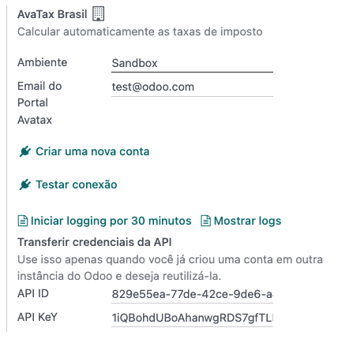
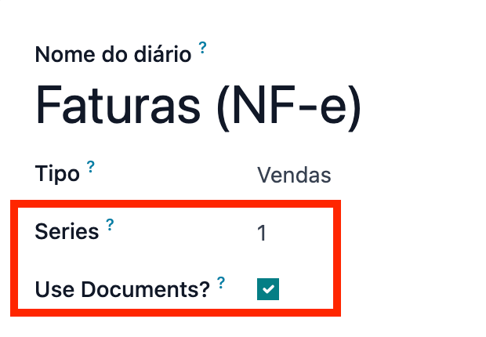
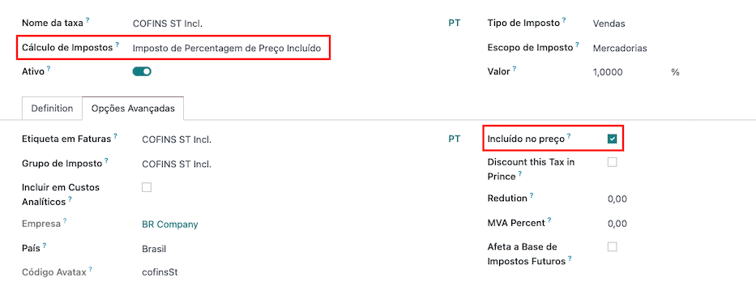
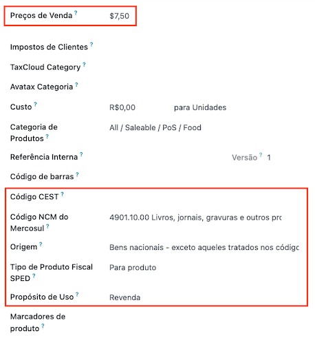
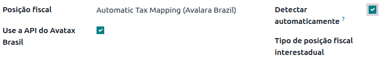
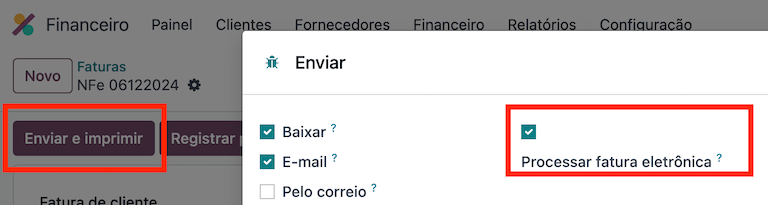
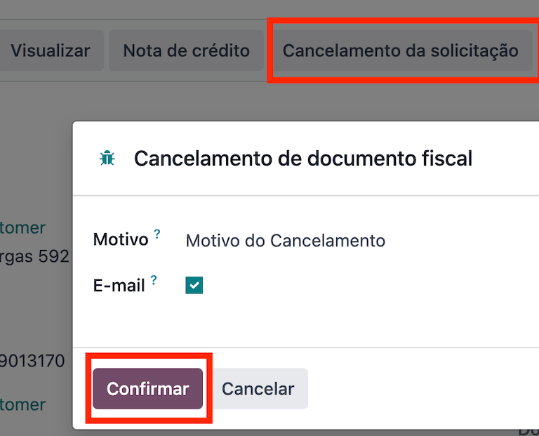
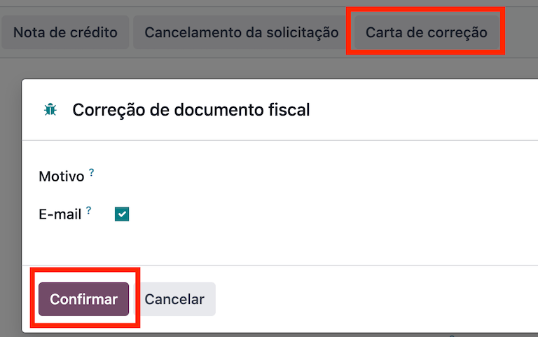
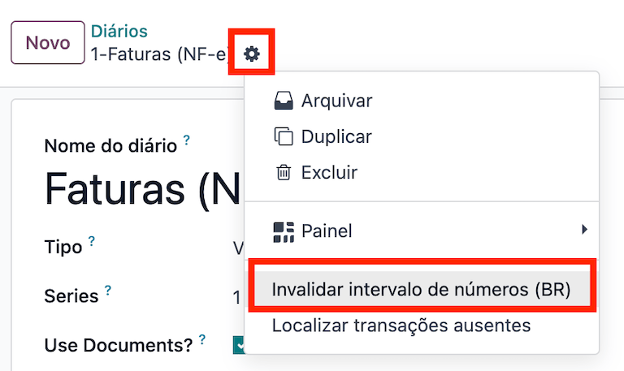
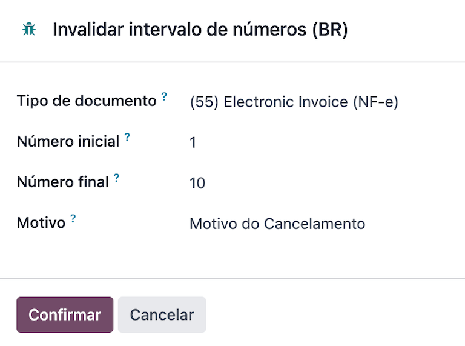

======
Brazil
======

.. |IAP| replace:: :abbr:`IAP (In-app-purchase)`
.. |API| replace:: :abbr:`API (Application programming interface)`
.. |SO| replace:: :abbr:`SO (Sales order)`

Introduction
============

With the Brazilian localization, sales taxes can be automatically computed and electronic invoices
(NF-e) for goods can be sent using AvaTax (Avalara) through |API| calls. Moreover, taxes for
services can be configured.

For the goods tax computation and electronic invoicing process, you need to configure the
:ref:`contacts <brazil/contacts>`, :ref:`company <brazil/company>`, :ref:`products
<brazil/products>`, and :ref:`create an account in Avatax <brazil/avatax-account>` need to be
configured in the general settings.

For the services taxes, you can create and configure them from Odoo directly without computing them
with AvaTax.

The localization also includes taxes and a chart of accounts template that can be modified if
needed.

Configuration
=============

Install the :guilabel:`🇧🇷 Brazil` :ref:`fiscal localization package
<fiscal_localizations/packages>` to get all the default accounting features of the Brazilian
localization, following the :abbr:`IFRS (International Financial Reporting Standards)` rules.

.. _brazil/company:

Configure your company
----------------------

To configure your company information, go to the :menuselection:`Contacts` app and search the name
given to your company.

#. Select the :guilabel:`Company` option at the top of the page. Then, configure the following
   fields:

   - :guilabel:`Name`.
   - :guilabel:`Address` (add :guilabel:`City`, :guilabel:`State`, :guilabel:`Zip Code`,
     :guilabel:`Country`).

     - In the :guilabel:`Street` field, enter the street name, number, and any additional address
       information.
     - In the :guilabel:`Street 2` field, enter the neighborhood.

   - :guilabel:`Identification Number` (:guilabel:`CNPJ`, :guilabel:`CPF`).
   - :guilabel:`Tax ID` (associated with the identification type).
   - :guilabel:`IE` (State registration).
   - :guilabel:`IM` (Municipal registration).
   - :guilabel:`SUFRAMA code` (Superintendence of the Manaus Free Trade Zone - add if applicable).
   - :guilabel:`Phone`.
   - :guilabel:`Email`.

   .. image:: brazil/contact-configuration.png
      :alt: Company configuration.

#. Configure the :guilabel:`Fiscal Information` within the :guilabel:`Sales and Purchase` tab:

   - Add the :guilabel:`Fiscal Position` for :ref:`Avatax Brazil <brazil/fiscal-positions>`.
   - :guilabel:`Tax Regime` (Federal Tax Regime).
   - :guilabel:`ICMS Taxpayer Type` (indicates ICMS regime, Exempt status, or Non-Taxpayer).
   - :guilabel:`Main Activity Sector`.

   .. image:: brazil/contact-fiscal-configuration.png
      :alt: Company fiscal configuration.

#. Finally, upload a company logo and save the contact

.. note::
   If you are a simplified regime, you need to configure the ICMS rate under
   :menuselection:`Accounting --> Configuration --> Settings --> Taxes --> Avatax Brazil`.

.. _brazil/avatax-account:

Configure AvaTax integration
----------------------------

Avalara AvaTax is a tax calculation and electronic invoicing provider that can be integrated in Odoo
to automatically compute taxes by taking into account the company, contact (customer), product, and
transaction information to retrieve the correct tax to be used and process the e-invoice afterward
with the government.

Using this integration requires :doc:`In-App-Purchases (IAPs) <../../general/in_app_purchase>` to
compute the taxes and to send the electronic invoices. Whenever you compute taxes, an |API| call is
made using credits from your |IAP| credits balance.

.. note::
   Odoo is a certified partner of Avalara Brazil.

Credential configuration
~~~~~~~~~~~~~~~~~~~~~~~~

To activate AvaTax in Odoo, you need to create an account. To do so, go to
:menuselection:`Accounting --> Configuration --> Settings --> Taxes`, and in the :guilabel:`AvaTax
Brazil` section, add the administration email address to be used for the AvaTax portal in the
:guilabel:`Avatax Portal Email`, and then click on :guilabel:`Create account`.

.. warning::
   When **testing** an :guilabel:`Avatax Portal Email` integration in a testing or sandbox database,
   use an alternate email address. It is **not** possible to re-use the same email address on the
   production database.

After you create the account from Odoo, you need to go to the Avalara Portal to set up your
password:

#. Access the `Avalara portal <https://portal.avalarabrasil.com.br/Login>`_.
#. Click on :guilabel:`Meu primeiro acesso`.
#. Add the email address you used in Odoo to create the Avalara/Avatax account, and then click
   :guilabel:`Solicitar Senha`.
#. You will receive an email with a token and a link to create your password. Click on this link and
   copy-paste the token to allocate your desired password.

.. tip::
   You can start using AvaTax in Odoo for tax computation **only** without creating a password and
   accessing the Avalara portal in the Odoo database. However, in order to use the electronic
   invoice service, you **must** access the AvaTax portal and upload your certificate there.

.. note::
   You can transfer |API| credentials. Use this only when you have already created an account in
   another Odoo instance and wish to reuse it.

A1 certificate upload
~~~~~~~~~~~~~~~~~~~~~

In order to issue electronic invoices, a certificate needs to be uploaded to the `AvaTax portal
<https://portal.avalarabrasil.com.br/Login>`_.

The certificate will be synchronized with Odoo, as long as the external identifier number in the
AvaTax portal matches - without special characters - with the CNPJ number, and the identification
number (CNPJ) in Odoo matches with the CNPJ in AvaTax.

Configure master data
---------------------

Chart of accounts
~~~~~~~~~~~~~~~~~

The :doc:`chart of accounts <../accounting/get_started/chart_of_accounts>` is installed by default
as part of the data set included in the localization module. The accounts are mapped automatically
in their corresponding taxes, and the default account payable and account receivable fields.

.. note::
   The chart of accounts for Brazil is based on the SPED CoA, which gives a baseline of the accounts
   needed in Brazil.

   You can add or delete accounts according to the company's needs.

Journals
~~~~~~~~

In Brazil, a *series* number is linked to a sequence number range for electronic invoices. The
series number can be configured in Odoo on a sales journal from the :guilabel:`Series` field. If
more than one series is needed, then a new sales journal will need to be created and a new series
number assigned to it for each series needed.

The :guilabel:`Use Documents` field needs to be selected. When issuing electronic and non-electronic
invoices, the :guilabel:`Type` field selects the document type used when creating the invoice. The
:guilabel:`Type` field will only be displayed if the :guilabel:`Use Documents` field is selected on
the journal.

.. note::
   When creating the journal, ensure the field :guilabel:`Dedicated Credit Note Sequence` is
   unchecked, as in Brazil, sequences between invoices, credit notes, and debit notes are shared per
   series number, which means per journal.

Taxes
~~~~~

Taxes are automatically created when installing the Brazilian localization. Taxes are already
configured, and some of them are used by Avalara when computing taxes on the sales order or invoice.

Taxes can be edited, or more taxes can be added. For example, some taxes used for services need to
be manually added and configured, as the rate may differ depending on the city where you are
offering the service.

.. important::
   Taxes attached to services are not computed by AvaTax. Only goods taxes are computed.

When configuring a tax used for a service that is included in the final price (when the tax is not
added or subtracted on top of the product price), set the :guilabel:`Tax Computation` to
:guilabel:`Percentage of Price Tax Included`, and, on the :guilabel:`Advanced Options` tab, check
the :guilabel:`Included in Price` option.

.. warning::
   Do not delete taxes, as they are used for the AvaTax tax computation. If deleted, Odoo creates
   them again when used in an |SO| or invoice and computing taxes with AvaTax, but the account used
   to register the tax needs to be re-configured in the tax's :guilabel:`Definition` tab, under the
   :guilabel:`Distribution for invoices` and :guilabel:`Distribution for refunds` sections.

.. seealso::
   :doc:`Taxes functional documentation <../accounting/taxes>`

.. _brazil/products:

Products
~~~~~~~~

To use the AvaTax integration on sale orders and invoices, first specify the following information
on the product:

- :guilabel:`CEST Code` (Code for products subject to ICMS tax substitution).
- :guilabel:`Mercosul NCM Code` (Mercosur Common Nomenclature Product Code).
- :guilabel:`Source of Origin` (Indicates the origin of the product, which can be foreign or
  domestic, among other possible options depending on the specific use case).
- :guilabel:`SPED Fiscal Product Type` (Fiscal product type according to SPED list table).
- :guilabel:`Purpose of Use` (Specify the intended purpose of use for this product).

.. note::
   Odoo automatically creates three products to be used for transportation costs associated with
   sales. These are named `Freight`, `Insurance`, and `Other Costs`. They are already configured, if
   more need to be created, duplicate and use the same configuration (configuration needed:
   :guilabel:`Product Type` `Service`, :guilabel:`Transportation Cost Type` `Insurance`, `Freight`,
   or `Other Costs`).

.. _brazil/contacts:

Contacts
~~~~~~~~

Before using the integration, specify the following information on the contact:

#. General information about the contact:

   - Select the :guilabel:`Company` option for a contact with a tax ID (CNPJ), or check
     :guilabel:`Individual` for a contact with a CPF.
   - :guilabel:`Name`.
   - :guilabel:`Address` (add :guilabel:`City`, :guilabel:`State`, :guilabel:`Zip Code`,
     :guilabel:`Country`).

     - In the :guilabel:`Street` field, enter the street, number, and any extra address information.
     - In the :guilabel:`Street 2` field, enter the neighborhood.

   - :guilabel:`Identification Number` (:guilabel:`CNPJ`, :guilabel:`CPF`).
   - :guilabel:`Tax ID` (associated with the identification type).
   - :guilabel:`IE`: state tax identification number.
   - :guilabel:`IM`: municipal tax identification number.
   - :guilabel:`SUFRAMA code`: SUFRAMA registration number.
   - :guilabel:`Phone`.
   - :guilabel:`Email`.

   .. image:: brazil/contact-configuration.png
     :alt: Contact configuration.

   .. note::
      The :guilabel:`CPF`, :guilabel:`IE`, :guilabel:`IM`, and :guilabel:`SUFRAMA code` fields are
      are hidden until the :guilabel:`Country` is set to `Brazil`.

#. Fiscal information about the contact under the :guilabel:`Sales \& Purchase` tab:

   - :guilabel:`Fiscal Position`: add the AvaTax fiscal position to automatically compute taxes on
     sale orders and invoices automatically
   - :guilabel:`Tax Regime`: federal tax regime
   - :guilabel:`ICMS Taxpayer Type`: taxpayer type determines if the contact is within the ICMS
     regime, if it is exempt, or if it is a non-taxpayer
   - :guilabel:`Main Activity Sector`: list of main activity sectors of the contact

   .. image:: brazil/contact-fiscal-configuration.png
      :alt: Contact fiscal configuration.

.. _brazil/fiscal-positions:

Fiscal positions
~~~~~~~~~~~~~~~~

To compute taxes and send electronic invoices on sale orders and invoices, both the
:guilabel:`Detect Automatically` and the :guilabel:`Use AvaTax API` options need to be enabled in
the :guilabel:`Fiscal Position`.

The :guilabel:`Fiscal Position` can be configured on the contact or selected when creating a sales
order or an invoice.

Workflows
=========

This section provides an overview of the actions that trigger `API calls
<https://en.wikipedia.org/wiki/API>`_ for tax computation, and how to send an electronic invoice for
goods (NF-e) for government validation.

.. warning::
   Please note that each |API| call incurs a cost. Be mindful of the actions that trigger these
   calls to manage costs effectively.

Tax computation
---------------

Tax calculations on quotations and sales orders
~~~~~~~~~~~~~~~~~~~~~~~~~~~~~~~~~~~~~~~~~~~~~~~

Trigger an |API| call to calculate taxes on a quotation or sales order automatically with AvaTax in
any of the following ways:

- **Quotation confirmation**
    Confirm a quotation into a sales order.
- **Manual trigger**
    Click on :guilabel:`Compute Taxes Using Avatax`.
- **Preview**
    Click on the :guilabel:`Preview` button.
- **Email a quotation / sales order**
    Send a quotation or sales order to a customer via email.
- **Online quotation access**
    When a customer accesses the quotation online (via the portal view), the |API| call is
    triggered.

Tax calculations on invoices
~~~~~~~~~~~~~~~~~~~~~~~~~~~~

Trigger an |API| call to calculate taxes on a customer invoice automatically with AvaTax any of the
following ways:

- **Manual trigger**
    Click on :guilabel:`Compute Taxes Using AvaTax`.
- **Preview**
    Click on the :guilabel:`Preview` button.
- **Online invoice access**
    When a customer accesses the invoice online (via the portal view), the |API| call is triggered.

.. note::
   The :guilabel:`Fiscal Position` must be set to `Automatic Tax Mapping (Avalara Brazil)` for any
   of these actions to compute taxes automatically.

.. seealso::
   :doc:`Fiscal positions (tax and account mapping) <../accounting/taxes/fiscal_positions>`

.. _brazil/electronic-documents:

Electronic documents
--------------------

Customer invoices
~~~~~~~~~~~~~~~~~

To process an electronic invoice for goods (NF-e), the invoice needs to be confirmed and taxes need
to be computed by Avalara. Once that step is done, click on the :guilabel:`Send \& Print` button in
the upper left corner, and a pop-up will appear. Then click on :guilabel:`Process e-invoice` and any
of the other options - :guilabel:`Download` or :guilabel:`Email`. Finally, click on :guilabel:`Send
\& Print` to process the invoice against the government.

Before sending the electronic invoice for goods (NF-e) some fields need to be filled out on the
invoice:

- :guilabel:`Customer` with all the customer information
- :guilabel:`Payment Method: Brazil` (how the invoice is planned to be paid)
- :guilabel:`Fiscal Position` set as the :guilabel:`Automatic Tax Mapping (Avalara Brazil)`
- :guilabel:`Document Type` set as :guilabel:`(55) Electronic Invoice (NF-e)`. This is the only
   electronic document supported at the moment. Non-electronic invoices can be registered, and other
   document types can be activated if needed

There are some other optional fields that depend on the nature of the transaction. These fields are
not required, so no errors will appear from the government if these optional fields are not
populated for most cases:

- :guilabel:`Freight Model` determines how the goods are planned to be transported - domestic
- :guilabel:`Transporter Brazil` determines who is doing the transportation

.. image:: brazil/invoice-info-needed.png
   :alt: Invoice information needed to process an electronic invoice.

.. note::
   All of the fields available on the invoice used to issue an electronic invoice are also available
   on the sales order, if needed. When creating the first invoice, the field :guilabel:`Document
   Number` is displayed, allocated as the first number to be used sequentially for subsequent
   invoices.

Credit notes
~~~~~~~~~~~~

If a sales return needs to be registered, then a credit note can be created in Odoo to be sent to
the government for validation.

.. seealso::
   :ref:`Issue a credit note <accounting/issue-credit-note>`

Debit Notes
~~~~~~~~~~~

If additional information needs to be included, or values need to be corrected that were not
accurately provided in the original invoice, a debit note can be issued.

.. important::
   Only the products included in the original invoice can be part of the debit note. While changes
   can be made to the product's unit price or quantity, products **cannot** be added to the debit
   note. The purpose of this document is only to declare the amount that you want to add to the
   original invoice for the same or fewer products.

.. seealso::
   :ref:`Issue a debit note <accounting/issue-debit-note>`

Invoice cancellation
~~~~~~~~~~~~~~~~~~~~

It is possible to cancel an electronic invoice that was validated by the government.

.. important::
   Check whether the electronic invoice is still within the cancellation deadline, which may vary
   according to the legislation of each state.

This can be done in Odoo by clicking :guilabel:`Request Cancel` and adding a cancellation
:guilabel:`Reason` on the pop-up that appears. If you want to send this cancellation reason to the
customer via email, activate the :guilabel:`E-mail` checkbox.

Correction letter
~~~~~~~~~~~~~~~~~

A correction letter can be created and linked to an electronic invoice that was validated by the
government.

This can be done in Odoo by clicking :guilabel:`Correction Letter` and adding a correction
:guilabel:`Reason` on the pop-up that appears. To send this correction reason to a customer via
email, activate the :guilabel:`E-mail` checkbox.

Invalidate invoice number range
~~~~~~~~~~~~~~~~~~~~~~~~~~~~~~~

A range of sequences that are assigned to sales journals can be invalidated with the government if
they are not currently used, **and** will not be used in the future. To do so, navigate to the
journal, and click the :menuselection:`⚙️ (gear) icon --> Invalidate Number Range (BR)`. On the
:guilabel:`Invalidate Number Range (BR)` wizard, add the :guilabel:`Initial Number` and
:guilabel:`End Number` of the range that should be canceled, and enter an invalidation
:guilabel:`Reason`.

.. note::
   The log of the canceled numbers along with the XML file are recorded in the chatter of the
   journal.

Vendor bills
------------

On the vendor bills side, when receiving an invoice from a supplier, you can encode the bill in Odoo
by adding all the commercial information together with the same Brazilian specific information that
is recorded on the :ref:`customer invoices <brazil/electronic-documents>`.

These Brazilian specific fields are:

- :guilabel:`Payment Method: Brazil` (how the invoice is planned to be paid).
- :guilabel:`Document Type` used by your vendor.
- :guilabel:`Document Number` (the invoice number from your supplier).
- :guilabel:`Freight Model` (how goods are planned to be transported - domestic).
- :guilabel:`Transporter Brazil` (who is doing the transportation).
