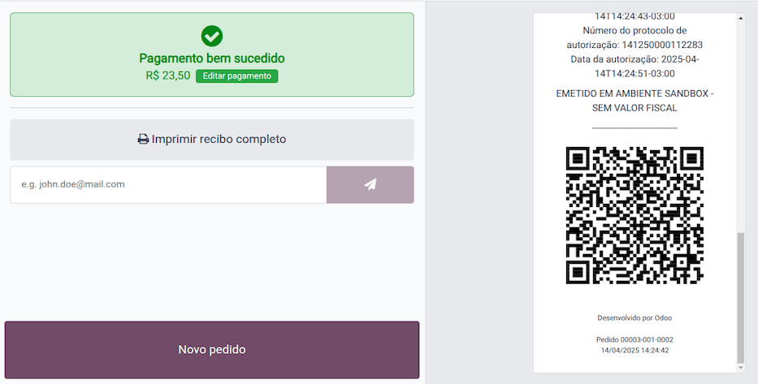
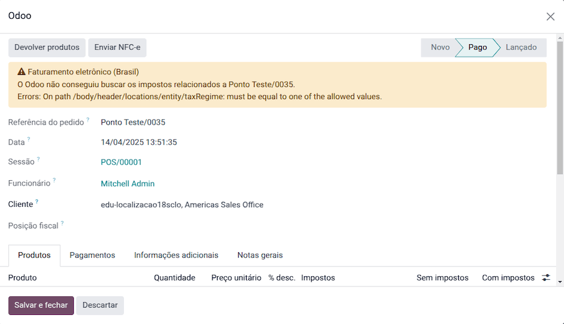
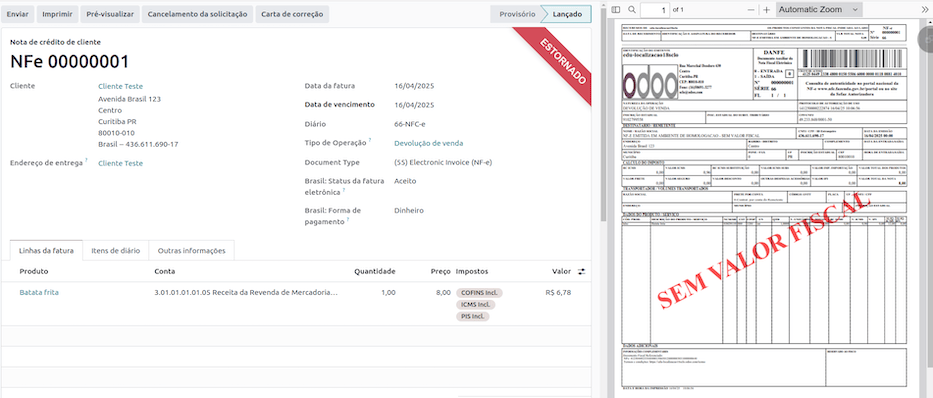

======
Brazil
======

.. |IAP| replace:: :abbr:`IAP (In-app-purchase)`
.. |API| replace:: :abbr:`API (Application programming interface)`
.. |SO| replace:: :abbr:`SO (Sales order)`

.. seealso::
   Helpful resources for the Brazilian localization, including onboarding materials and videos:

   - `Onboarding checklist for new users
     <https://docs.google.com/document/d/e/2PACX-1vSNYTYVnR_BzvQKL3kn5YdVzPjjHc-WHw_U3udk5tz_dJXo69woj9QrTMinH_siyOX2rLGjvspvc8AF/pub>`_.
   - `YouTube playlist - Brazil (Localization)
     <https://youtube.com/playlist?list=PL1-aSABtP6ADqexw4YNCbKPmpFggajxlX&si=RgmZR3Jco3223Np4>`_.
   - `YouTube playlist - Tutoriais Odoo em Português
     <https://youtube.com/playlist?list=PL1-aSABtP6ACGOW2UREePGjHQ2Bgdy-UZ&si=j6tiI36eB7BoKVQB>`_.
   - :doc:`Documentation on e-invoicing's legality and compliance in Brazil
     <../accounting/customer_invoices/electronic_invoicing/brazil>`

.. _localizations/brazil/modules:

Modules
=======

The following modules related to the Brazilian localization are available:

.. list-table::
   :header-rows: 1
   :widths: 25 25 50

   * - Name
     - Technical name
     - Description
   * - :guilabel:`Brazilian - Accounting`
     - `l10n_br`
     - Brazilian :ref:`fiscal localization package <fiscal_localizations/packages>`, complete with
       the Brazilian chart of accounts, taxes, tax report, fiscal positions, and document and
       identification types.
   * - :guilabel:`Brazil - Accounting Reports`
     - `l10n_br_reports`
     - Accounting reports for Brazil.
   * - :guilabel:`AvaTax Brazil`, :guilabel:`Avatax Brazil Sale` & :guilabel:`Test SOs for the
       Brazilian Avatax`
     - `l10n_br_avatax`, `l10n_br_avatax_sale` & `l10n_br_test_avatax_sale`
     - Goods and Services tax computation through Avalara.
   * - :guilabel:`Brazilian Accounting EDI`
     - `l10n_br_edi`
     - Provides electronic invoicing through Avatax.
   * - :guilabel:`Brazilian Accounting EDI For Sale`
     - `l10n_br_edi_sale`
     - Adds some fields to sale orders that are carried over the invoice.
   * - :guilabel:`Brazilian Accounting EDI for POS`
     - `l10n_br_edi_pos`
     - Provides electronic invoicing through Avatax in the POS.
   * - :guilabel:`Brazilian Accounting EDI for eCommerce`
     - `l10n_br_edi_website_sale`
     - Allows tax calculation and EDI for eCommerce users.
   * - :guilabel:`Brazilian Accounting EDI for stock`
     - `l10n_br_edi_stock`
     - Adds delivery-related information to the NF-e.
   * - :guilabel:`Brazil - Website Sale`
     - `l10n_br_website_sale`
     - Allows tax calculation and EDI for eCommerce users.
   * - :guilabel:`Brazil - Sale`
     - `l10n_br_sales`
     - Sale modifications for Brazil
   * - :guilabel:`Brazil - Sale Subscription`
     - `l10n_br_sale_subscription`
     - Sale subscription modifications for Brazil

.. note::
   The localization's core modules are installed automatically with the localization. The rest can
   be manually :doc:`installed </applications/general/apps_modules>`.

.. _localizations/brazil/loc-review:

Localization overview
=====================

The Brazilian localization package ensures compliance with Brazilian fiscal and accounting
regulations. It includes tools for managing taxes, fiscal positions, reporting, and a predefined
chart of accounts tailored to Brazil’s standards.

The Brazilian localization package provides the following key features to ensure compliance with
local fiscal and accounting regulations:

- :ref:`Chart of accounts <localizations/brazil/chart-of-accounts>`: a predefined structure tailored
  to Brazilian accounting standards
- :ref:`Taxes <localizations/brazil/taxes>`: pre-configured tax rates, including standard VAT,
  zero-rated, and exempt options.
- :ref:`Products <localizations/brazil/products>`
- :ref:`Contacts <localizations/brazil/company-and-contacts>`
- :ref:`Fiscal positions <localizations/brazil/fiscal-positions>`: automated tax adjustments based
  on customer or supplier registration status.
- :doc:`Payroll </applications/hr/payroll>`
- :doc:`Reporting <../accounting/reporting>`
- :ref:`AvaTax integration <localizations/brazil/avatax-account>`
- :ref:`Tax computation <localizations/brazil/tax-computation>`

Sales taxes can be automatically computed, and electronic invoices for goods (NF-e) and services
(NFS-e) can be sent using AvaTax (Avalara) through |API| calls. Moreover, taxes for services can be
configured.

For the goods and services tax computation and electronic invoicing process, configure the
:ref:`contacts <localizations/brazil/company-and-contacts>`, :ref:`company
<localizations/brazil/company-and-contacts>`, and :ref:`products <localizations/brazil/products>`
and :ref:`create an account in AvaTax <localizations/brazil/avatax-account>` in the general
settings.

For the services taxes, create and configure them from Odoo directly without computing them with
AvaTax.

.. _localizations/brazil/chart-of-accounts:

Chart of accounts
-----------------

In the :doc:`chart of accounts <../accounting/get_started/chart_of_accounts>`, the accounts are
mapped automatically to their corresponding taxes, and the default account payable and account
receivable fields.

.. note::
   The Brazil chart of accounts is based on the SPED CoA, which provides a baseline of the necessary
   accounts.

.. _localizations/brazil/taxes:

Taxes
-----

:doc:`Taxes <../accounting/taxes>` are automatically created and configured when installing the
Brazilian localization. Avalara uses some to compute taxes on sales orders or invoices.

Taxes used for services must be manually added and configured, as the rate may differ depending on
the city where the service is offered.

.. important::
   For service taxes created manually, NFS-e can't be issued. To electronically send an NFS-e,
   compute taxes using Avalara.

.. warning::
   Do not delete taxes, as they are used for the AvaTax tax computation. If deleted, Odoo creates
   them again when used in an |SO| or invoice, and computing taxes with AvaTax. However, the account
   used to register the tax must be re-configured in the tax's :guilabel:`Definition` tab, under
   the :guilabel:`Distribution for invoices` and :guilabel:`Distribution for refunds` sections.

.. seealso::
   :doc:`Taxes functional documentation <../accounting/taxes>`

.. _localizations/brazil/products:

Products
--------

To use the AvaTax integration on sales orders and invoices, enter the following information in the
:guilabel:`Sales` tab of the product form under the :guilabel:`Brazil Accounting` section, based on
how the product will be used.

E-Invoice for goods (NF-e)
~~~~~~~~~~~~~~~~~~~~~~~~~~

.. important::
   The :ref:`Avalara integration <localizations/brazil/avatax-account>` works on a credit-based
   system, where each interaction with Avalara consumes one credit. Below are the main
   credit-consuming operations:

   **Sales application**

   - Tax calculation on quotations and sales orders.

   **Accounting application**

   - Tax calculation on invoices.
   - Electronic invoice submission (NF-e or NFS-e).

   **Occasional operations**: (each step is billed separately)

   - :ref:`Correction letter (Carta de Correção) <localizations/brazil/correction-letter>`
   - :ref:`Invoice cancellation <localizations/brazil/invoice-cancellation>`
   - :ref:`Sales refund via credit note <localizations/brazil/credit-notes>`
   - :ref:`Sales complementary invoice via debit note <localizations/brazil/debit-notes>`
   - :ref:`Invalidate invoice number range <localizations/brazil/invalidate-invoice-number>`
   - Other tax validations.

.. note::
   If taxes are calculated in the **Sales** app, and the invoice is later issued in the
   **Accounting** app, the calculation happens twice, consuming two credits.

.. example::
   | **Sales order confirmed**
   | :icon:`fa-arrow-down` 1 credit (tax calculation)
   | **Invoice created**
   | :icon:`fa-arrow-down` 1 credit (tax calculation)
   | **Invoice confirmed and submitted**
   | :icon:`fa-arrow-down` 1 credit (tax calculation) + 1 credit (submit invoice)
   | **Total: 4 credits**

- :guilabel:`CEST Code`: code for products subject to ICMS tax substitution
- :guilabel:`Mercosul NCM Code`: Mercosur Common Nomenclature Product Code
- :guilabel:`Source of Origin`: origin of the product, which can be foreign or domestic, among other
  possible options, depending on the specific use case
- :guilabel:`SPED Fiscal Product Type`: fiscal product type according to SPED list table
- :guilabel:`Purpose of Use`: intended purpose of use for this product

.. image:: brazil/product-configuration.png
   :alt: Product configuration.

.. note::
   Odoo automatically creates three products to be used for transportation costs associated with
   sales. These are named :guilabel:`Freight`, :guilabel:`Insurance`, and :guilabel:`Other Costs`
   and are already configured. If more need to be created, duplicate and use the same configuration:

   - :guilabel:`Product Type` :guilabel:`Service`
   - :guilabel:`Transportation Cost Type`: :guilabel:`Insurance`, :guilabel:`Freight`, or
     :guilabel:`Other Costs`

E-Invoice for services (NFS-e)
~~~~~~~~~~~~~~~~~~~~~~~~~~~~~~

.. important::
   The :ref:`Avalara integration <localizations/brazil/avatax-account>` works on a credit-based
   system, where each interaction with Avalara consumes 1 credit. Below are the main
   credit-consuming operations:

   **Sales application**

   - Tax calculation on quotations and sales orders.

   **Accounting application**

   - Tax calculation on invoices.
   - Electronic invoice submission (NF-e or NFS-e).
   - Invoice status check (1 credit is consumed each time the invoice status is checked).

   **Occasional operations**: (each step is billed separately)

   - :ref:`Correction letter (Carta de Correção) <localizations/brazil/correction-letter>`
   - :ref:`Invoice cancellation <localizations/brazil/invoice-cancellation>`
   - :ref:`Sales refund via credit note <localizations/brazil/credit-notes>`
   - :ref:`Sales complementary invoice via debit note <localizations/brazil/debit-notes>`
   - :ref:`Invalidate invoice number range <localizations/brazil/invalidate-invoice-number>`
   - Other tax validations.

.. note::
   If taxes are calculated in the **Sales** app, and the invoice is later issued in the
   **Accounting** app, the calculation happens twice, consuming two credits.

.. example::
   | **Sales order confirmed**
   | :icon:`fa-arrow-down` 1 credit (tax calculation)
   | **Invoice created**
   | :icon:`fa-arrow-down` 1 credit (tax calculation)
   | **Invoice confirmed and submitted**
   | :icon:`fa-arrow-down` 1 credit (tax calculation) + 1 credit (submit invoice)
   | **Total: 4 credits**

- :guilabel:`Mercosul NCM Code`: Mercosur Common Nomenclature Product Code
- :guilabel:`Purpose of Use`: intended purpose of use for this product
- :guilabel:`Service Code Origin`: City Service Code where the provider is registered
- :guilabel:`Labor Assignment`: checkbox to select if service involves labor
- :guilabel:`Transport Cost Type`: type of transport costs to select
- :guilabel:`Service Codes`: City Service Code where the service will be provided; if no code is
  added, the :guilabel:`Service Code Origin` will be used.

.. _localizations/brazil/company-and-contacts:

Company and contacts
--------------------

To use all the features of this fiscal localization, the following fields are required on the
:doc:`company record </applications/general/companies>`:

- :guilabel:`Name`
- :guilabel:`Address`: add :guilabel:`City`, :guilabel:`State`, :guilabel:`Zip Code`,
  :guilabel:`Country`

  - In the :guilabel:`Street` field, enter the street name, number, and any additional address
    information.
  - In the :guilabel:`Street 2` field, enter the neighborhood.

- :guilabel:`Identification Number`: :guilabel:`CNPJ` or :guilabel:`CPF`
- :guilabel:`Tax ID`: associated with the identification type
- :guilabel:`IE`: State registration
- :guilabel:`IM`: Municipal registration
- :guilabel:`SUFRAMA code`: Superintendence of the Manaus Free Trade Zone - add if applicable
- :guilabel:`Phone`
- :guilabel:`Email`

   .. image:: brazil/contact-configuration.png
      :alt: Company configuration.

Configure the :guilabel:`Fiscal Information` within the :guilabel:`Sales and Purchase` tab:

   - Add the :guilabel:`Fiscal Position` for :ref:`AvaTax Brazil
     <localizations/brazil/fiscal-positions>`.
   - :guilabel:`Tax Regime`: Federal Tax Regime
   - :guilabel:`ICMS Taxpayer Type`: indicates :guilabel:`ICMS regime`, :guilabel:`Exempt status`,
     or :guilabel:`Non-Taxpayer`
   - :guilabel:`Main Activity Sector`

   .. image:: brazil/contact-fiscal-configuration.png
      :alt: Company fiscal configuration.

Configure the following extra :guilabel:`Fiscal Information` to issue NFS-e:

   - Add the :guilabel:`Fiscal Position` for :ref:`AvaTax Brazil
     <localizations/brazil/fiscal-positions>`.
   - :guilabel:`COFINS Details`: :guilabel:`Taxable, Not Taxable, Taxable with rate 0%, Exempt,
     Suspended`
   - :guilabel:`PIS Details` :guilabel:`Taxable, Not Taxable, Taxable with rate 0%, Exempt,
     Suspended`
   - :guilabel:`CSLL Taxable` if the company is subject to CSLL or not

   .. image:: brazil/contact-fiscal-configuration-nfse.png
      :alt: Company fiscal configuration for NFSe.

.. note::
   If it is a simplified regime, the ICMS rate under :menuselection:`Accounting --> Configuration
   --> Settings --> Taxes --> AvaTax Brazil` must be configured.

The same configuration applies to the relevant :doc:`contact <../../essentials/contacts>` form when
using the AvaTax integration.

.. note::
   Select the :guilabel:`Company` option for a contact with a tax ID (CNPJ), or check
   :guilabel:`Individual` for a contact with a CPF.

.. _localizations/brazil/fiscal-positions:

Fiscal positions
----------------

To compute taxes and send electronic invoices on sales orders and invoices, both the
:guilabel:`Detect Automatically` and the :guilabel:`Use AvaTax Brazil API` options need to be
enabled in the :guilabel:`Fiscal Position`. To do so, go to :menuselection:`Accounting -->
Configuration --> Fiscal Positions`. Then, open :guilabel:`Automatic Tax Mapping (Avalara Brazil)`
and update it accordingly.

.. image:: brazil/fiscal-position-configuration.png
   :alt: Fiscal position configuration

The :doc:`fiscal positions <../accounting/taxes/fiscal_positions>` can be configured:

- either on the :ref:`contact <localizations/brazil/company-and-contacts>`, in the :guilabel:`Sales
  & Purchase` tab under the :guilabel:`Fiscal Information` section;
- or when creating a sales order or an invoice, in the :guilabel:`Other Info` tab under the
  :guilabel:`Invoicing` or :guilabel:`Accounting` section.

.. _localizations/brazil/avatax-account:

AvaTax integration
------------------

Avalara AvaTax is a tax calculation and electronic invoicing provider that can be integrated into
Odoo to compute taxes automatically. It considers the company, contact (customer), product, and
transaction information to retrieve the correct tax to be used and process the e-invoice afterward
with the government.

This integration requires :doc:`In-App-Purchases (IAPs) <../../essentials/in_app_purchase>` to
compute taxes and send electronic invoices. To compute taxes, send an electronic document (NF-e,
NFS-e, etc.), or perform any electronic flow (NF-e Cancellation, Correction letter, Invalidate
invoice number range), an API call is made using credits from the `IAP credit balance
<https://iap.odoo.com/iap/in-app-services/819>`_.

.. note::
   - Odoo is a certified partner of Avalara Brazil.
   - Buy `IAP credits on odoo.com <https://iap.odoo.com/iap/in-app-services/819>`_.
   - On creation, new databases receive 500 free credits.

.. seealso::
   :doc:`In-App-Purchases (IAPs) <../../essentials/in_app_purchase>`

.. _localizations/brazil/credential-configuration:

Credential configuration
~~~~~~~~~~~~~~~~~~~~~~~~

To activate AvaTax in Odoo, an account must be created. To do so, go to :menuselection:`Accounting
--> Configuration --> Settings --> Taxes`. In the :guilabel:`AvaTax Brazil` section, add the
administration Email address for the AvaTax portal in :guilabel:`AvaTax Portal Email`, and click
:icon:`fa-plug` :guilabel:`Create account`.

.. warning::
   When **testing** or **creating a production** :guilabel:`AvaTax Portal Email` integration in a
   sandbox or production database, use a real Email address, as it is needed to log in to the
   Avalara Portal and set up the certificates, whether to test or use it on production.

   There are two different Avalara Portals, one for testing and one for production:

   - Sandbox: https://portal.sandbox.avalarabrasil.com.br/
   - Production: https://portal.avalarabrasil.com.br/

   When the account is created from Odoo, select the right environment. Moreover, the Email used to
   open the account cannot be used to open another account. Save the :guilabel:`API ID` and
   :guilabel:`API Key` when the account is created from Odoo.

   .. image:: brazil/transfer-api-credentials.png
      :alt: Transfer API Credentials.

After the account is created from Odoo, go to the Avalara Portal to set up the password:

#. Access the `Avalara portal <https://portal.avalarabrasil.com.br/Login>`_.
#. Click :guilabel:`Meu primeiro acesso`.
#. Add the Email address used in Odoo to create the Avalara/AvaTax account, and click
   :guilabel:`Solicitar Senha`.
#. An Email will then be received with a token and a link to create a password. Click on this link
   and copy-paste the token to allocate the desired password.

.. tip::
   Start using AvaTax in Odoo for tax computation **only**, without creating a password and
   accessing the Avalara portal in the Odoo database. However, to use the electronic invoice
   service, you **must** access the AvaTax portal and upload the certificate there.

.. image:: brazil/avatax-account-configuration.png
   :alt: AvaTax account configuration.

.. note::
   |API| credentials can be transferred. This option should be used only when an account has already
   been created in another Odoo instance and must be reused.

.. _localizations/brazil/certificate-upload:

A1 certificate upload
~~~~~~~~~~~~~~~~~~~~~

To issue electronic invoices, a certificate must be uploaded to the `AvaTax portal
<https://portal.avalarabrasil.com.br/Login>`_.

The certificate will be synchronized with Odoo as long as the external identifier number in the
AvaTax portal matches - without special characters - with the CNPJ number, and the
identification number (CNPJ) in Odoo matches the CNPJ in AvaTax.

.. important::
   Some cities require the certificate to be linked within the City Portal system before issuing
   NFS-e from Odoo.

   If an error message from the city that says :guilabel:`Your certificate is not linked
   to the user` is received, this process needs to be done in the city portal.

.. _localizations/brazil/tax-computation:

Tax computation
---------------

.. warning::
   Actions that trigger |API| calls for tax computation come with a cost. Be mindful of the
   actions that trigger these calls to manage costs effectively.

.. seealso::
   :doc:`In-App-Purchases (IAPs) <../../essentials/in_app_purchase>`

.. _localizations/brazil/tax-calculations:

Tax calculations on quotations and sales orders
~~~~~~~~~~~~~~~~~~~~~~~~~~~~~~~~~~~~~~~~~~~~~~~

Trigger an |API| call to calculate taxes on a quotation or sales order automatically with AvaTax in
any of the following ways:

- **Quotation confirmation**
    Confirm a quotation into a sales order.
- **Manual trigger**
    Click :guilabel:`Compute Taxes Using AvaTax`.
- **Preview**
    Click :guilabel:`Preview`.
- **Email a quotation/sales order**
    Send a quotation or sales order to a customer via Email.
- **Online quotation access**
    When a customer accesses the quotation online (via the portal view), the |API| call is
    triggered.

.. _localizations/brazil/tax-calculations-invoices:

Tax calculations on invoices
~~~~~~~~~~~~~~~~~~~~~~~~~~~~

Trigger an |API| call to calculate taxes on a customer invoice automatically with AvaTax in any of
the following ways:

- **Manual trigger**
    Click :guilabel:`Compute Taxes Using AvaTax`.
- **Preview**
    Click :guilabel:`Preview`.
- **Online invoice access**
    When a customer accesses the invoice online (via the portal view), the |API| call is triggered.

.. note::
   The :guilabel:`Fiscal Position` must be set to `Automatic Tax Mapping (Avalara Brazil)` for any
   of these actions to compute taxes automatically.

.. seealso::
   :doc:`Fiscal positions (tax and account mapping) <../accounting/taxes/fiscal_positions>`

.. _localizations/brazil/accounting:

Accounting
==========

.. _localizations/brazil/electronic-documents:

Electronic documents
--------------------

.. _localizations/brazil/journals:

Configuration
~~~~~~~~~~~~~

A *series* number is linked to a sequence number range for electronic invoices. To configure the
series number on a sales journal, go to :menuselection:`Accounting --> Configuration --> Journals`
and set it in the :guilabel:`Series` field. If more than one series is needed, a new sales journal
must be created, and a new series number assigned for each series.

Enable the :guilabel:`Use Documents?` option as the :guilabel:`Series` field will only be displayed
if the :guilabel:`Use Documents?` field is selected on the journal.

When issuing electronic and non-electronic invoices, the :guilabel:`Type` field selects the document
type used when creating the invoice.

.. image:: brazil/journal-configuration.png
   :alt: Journal configuration with the Use Documents? field checked.

.. note::
   When creating the journal, ensure the :guilabel:`Dedicated Credit Note Sequence` field in the
   :guilabel:`Accounting Information` section is unchecked, as in Brazil, sequences between
   invoices, credit notes, and debit notes are shared per series number, which means per journal.

.. _localizations/brazil/customer-invoices:

Customer invoices
~~~~~~~~~~~~~~~~~

To process an electronic invoice for goods (NF-e) or services (NFS-e), the invoice must be confirmed
and taxes must be computed by Avalara. The following fields must be filled out:

- :guilabel:`Customer`, with all the customer information
- :guilabel:`Payment Method: Brazil`: how the invoice is planned to be paid.
- :guilabel:`Document Type` set as :guilabel:`(55) Electronic Invoice (NF-e)` or :guilabel:`(SE)
  Electronic Service Invoice (NFS-e)`.

And in the :guilabel:`Other Info` tab:

- :guilabel:`Fiscal Position` set as :guilabel:`Automatic Tax Mapping (Avalara Brazil)`.

Some optional fields depend on the nature of the transaction. These fields in the :guilabel:`Other
Info` tab are not required, so in most cases, leaving them blank will not result in errors from the
government when the invoice is submitted:

- :guilabel:`Freight Model` determines how the goods are planned to be transported - domestic.
- :guilabel:`Transporter Brazil` determines who is doing the transportation.

.. image:: brazil/invoice-info-needed.png
   :alt: Invoice information needed to process an electronic invoice.

.. image:: brazil/process-electronic-invoice.png
   :alt: Process electronic invoice pop-up in Odoo.

Then, click :guilabel:`Send`. In the :guilabel:`Print & Send` window, click :guilabel:`Process
e-invoice` and any other options - :guilabel:`Download` or :guilabel:`Email`. Finally, click
:guilabel:`Send` to process the invoice with the government.

.. note::
   All fields available on the invoice used to issue an electronic invoice are also available on the
   sales order, if needed. When creating the first invoice, the :guilabel:`Document Number` field is
   displayed, allocated as the first number to be used sequentially for subsequent invoices.

.. _localizations/brazil/credit-notes:

Credit notes
~~~~~~~~~~~~

If a sales return needs to be registered, a credit note can be created in Odoo and sent to the
government for validation.

.. note::
   Credit notes are only available for electronic invoices for goods (NF-e).

.. seealso::
   :ref:`Issue a credit note <accounting/credit_notes/issue-credit-note>`

.. _localizations/brazil/debit-notes:

Debit Notes
~~~~~~~~~~~

If additional information needs to be included or values that were not accurately provided in the
original invoice need to be corrected, a debit note can be issued.

.. note::
   - Debit notes are only available for electronic invoices for goods (NF-e).
   - Only the products included in the original invoice can be included in the debit note. While
     changes can be made to the product's unit price or quantity, products **cannot** be added to
     the debit note. The purpose of this document is only to declare the amount to be added to the
     original invoice for the same or fewer products.

.. seealso::
   :ref:`Issue a debit note <accounting/credit_notes/issue-debit-note>`

.. _localizations/brazil/invoice-cancellation:

Invoice cancellation
~~~~~~~~~~~~~~~~~~~~

It is possible to cancel an electronic invoice that the government validated.

.. note::
   Check whether the electronic invoice is still within the cancellation deadline, which may vary
   according to each state's legislation.

.. _localizations/brazil/e-invoice-goods-nf-e:

E-invoices for goods (NF-e)
***************************

To cancel an e-invoice for goods (NF-e) in Odoo, click :guilabel:`Request Cancel` and add a
cancellation :guilabel:`Reason` on the pop-up that appears. To send this cancellation reason to the
customer via Email, enable the :guilabel:`E-mail` checkbox.

.. image:: brazil/invoice-cancellation.png
   :alt: Invoice cancellation reason in Odoo.

.. note::
   This is an electronic cancellation, which means that Odoo will send a request to the government
   to cancel the NF-e. It will then consume one |IAP| credit, as an |API| call occurs.

.. _localizations/brazil/e-invoice-services-nf-e:

E-invoices for services (NFS-e)
*******************************

To cancel an e-invoice for services (NFS-e) in Odoo, click :guilabel:`Request Cancel`. In this case,
there is no electronic cancellation process, as not every city has this service available. The
user needs to manually cancel this NFS-e on the city portal. Once that step is completed, they can
request the cancellation in Odoo, which will cancel the invoice.

.. _localizations/brazil/correction-letter:

Correction letter
~~~~~~~~~~~~~~~~~

A correction letter can be created and linked to an electronic invoice for goods (NF-e) that the
government validated.

To do so in Odoo, click :guilabel:`Correction Letter` and add a correction :guilabel:`Reason` on the
pop-up that appears. To send the correction reason to a customer via Email, enable the
:guilabel:`E-mail` checkbox.

.. image:: brazil/correction-letter.png
   :alt: Correction letter reason in Odoo.

.. note::
   Correction letters are only available for electronic invoices for goods (NF-e).

.. _localizations/brazil/invalidate-invoice-number:

Invalidate invoice number range
~~~~~~~~~~~~~~~~~~~~~~~~~~~~~~~

A range of sequences that are assigned to sales journals can be invalidated by the government if
they are not currently used **and** will not be used in the future. To do so, open the journal,
click the :icon:`fa-cog` (gear) icon, and select :guilabel:`Invalidate Number Range (BR)`. On the
:guilabel:`Invalidate Number Range (BR)` wizard, add the :guilabel:`Initial Number` and
:guilabel:`End Number` of the range that should be cancelled, and enter an invalidation
:guilabel:`Reason`.

.. image:: brazil/range-number-invalidation.png
   :alt: Number range invalidation selection in Odoo.

.. image:: brazil/range-number-invalidation-wizard.png
   :alt: Number range invalidation wizard in Odoo.

.. note::
   Invalidate invoice number range documents are only available for electronic invoices for goods
   (NF-e).

.. note::
   The journal's chatter records the log of the cancelled numbers, along with the XML file.

.. _localizations/brazil/vendor-bills:

Vendor bills
------------

When receiving an invoice from a supplier, encode the bill in Odoo by adding all the commercial
information, together with the same Brazilian-specific information that is recorded on the
:ref:`customer invoices <localizations/brazil/electronic-documents>`.

These Brazilian-specific fields are:

- :guilabel:`Payment Method: Brazil`: how the invoice is planned to be paid
- :guilabel:`Document Type`: used by the vendor
- :guilabel:`Document Number`: the invoice number from the supplier
- :guilabel:`Freight Model`: **NF-e specific** how goods are planned to be transported - domestic
- :guilabel:`Transporter Brazil`: **NF-e specific** who is doing the transportation.

.. _localizations/brazil/pos:

Point of sale NFC-e
===================

The NFC-e is a legal document that supports selling goods or merchandise to the final customer.
Like the :ref:`NF-e <localizations/brazil/e-invoice-goods-nf-e>`, the electronic customer invoice is
also issued in XML file format and has an auxiliary document (DANFC-e) known as the *NFC-e Summary*.
This electronic document can be issued through **Odoo Point of Sale app**.

Its legal validity is guaranteed by the digital signature and by each Brazilian state's SEFAZ
(Secretaria da Fazenda).

.. important::
   The :ref:`Avalara integration <localizations/brazil/avatax-account>` operates on a credit-based
   system. Each operation that involves communication with Avalara consumes one credit. The following
   operations within the **Point of Sale** (POS) application are subject to credit consumption:

   - Tax calculation at the time of sale
   - Electronic invoice issuance (NFC-e)

.. note::
   Each step is billed separately. For example, calculating taxes and issuing an invoice for the
   same POS transaction consume two credits.

.. seealso::
   :doc:`Point of Sale <../../sales/point_of_sale>`

.. _localizations/brazil/pos-configuration:

Configuration
-------------

:ref:`Install <general/install>` the :guilabel:`Brazilian Accounting EDI for POS` (`l10nbr_edi_pos`)
module.

.. _localizations/brazil/pos-csc-details:

CSC details
-----------

Go to :menuselection:`Accounting --> Configuration --> Settings`, scroll to the :guilabel:`Taxes`
section. In the :guilabel:`NFC-e configuration` section, complete the following CSC (Taxpayer
Security Code) fields:

- :guilabel:`CSC ID`: The *CSC ID* or *CSC Token* is an identification of the taxpayer security
  code, which can have 1 to 6 digits and is available on your state's website of State Department of
  Finance (SEFAZ).
- :guilabel:`CSC Number`: The *CSC Number* is a code of up to 36 characters that only you and the
  Department of Finance know. It is used to generate the QR Code of the NFC-e and ensure the
  authenticity of the DANFE.

.. note::
   The information required for these fields can be generated through the SEFAZ website of each
   Brazilian state by the company's accountant.

.. _localizations/brazil/pos-product:

Product configuration
---------------------

First, :doc:`create a new product in POS <../../sales/point_of_sale/configuration>`, then in the
:guilabel:`Sales` tab, configure the following :guilabel:`Brazil Accounting` fields:

- :guilabel:`CEST Code`: A tax classification code identifying goods and products subject to tax
  substitution under ICMS regulations. It helps determine the applicable tax treatment and
  procedures for specific items. Check if the product is subject to this at
  https://www.codigocest.com.br/.
- :guilabel:`Mercosul NCM Code`: NCM (Nomenclatura Comun do Mercosul) code from the Mercosur list.
- :guilabel:`Source of Origin`: Indicates whether the product is of foreign or national origin, with
  different variations and characteristics depending on the product use case.
- :guilabel:`SPED Fiscal Product Type`: Fiscal product type according to the SPED list table.
- :guilabel:`Purpose of Use`: Shows what this product is used for.

.. _localizations/brazil/pos-shop-configuration:

Shop configuration
------------------

Go to :menuselection:`Point of Sale --> Configuration --> Point of Sales` and create a
:guilabel:`New` shop. Choose an internal name for the new POS and save.

Then, go to :menuselection:`Point of Sale --> Configuration --> Settings` and make sure that the
correct Point of Sale is :doc:`selected at the top of the screen
<../../sales/point_of_sale/configuration>`. Then, scroll to the :guilabel:`Accounting` section and
configure the :guilabel:`Brazilian EDI` fields:

- :guilabel:`Series`
- :guilabel:`Next number`: the next NFC-e number in the sequence to be issued, for instance, if the
  last number issued in SEFAZ is `100`, the *Next number* will be `101`.

.. note::
   For the production environment, make sure that this information is updated.

.. _localizations/brazil/generate-nfc-e:

Generating an NFC-e
-------------------

First, :ref:`open the Shop and make a sale <pos/session-start>`.

After validating the payment, Odoo calculates taxes and issues an NFC-e. The valid NFC-e appears on
the right side of the screen.

.. note::
   It is also possible to issue an NFC-e that identifies the customer by their CPF/CNPJ. To do so,
   click :icon:`fa-user` :guilabel:`Customer`, search for the customer if they are already
   registered, or click :guilabel:`Create`.

   The following are mandatory fields to issue a CPF/CNPJ identified NFC-e:

   - :guilabel:`Name`
   - :guilabel:`City` and :guilabel:`State` where the invoice is being issued
   - :guilabel:`CPF/CNPJ`

After saving the register, click :guilabel:`Validate`. The NFC-e appears, highlighting the
customer's CPF on the print.

Finally, select one of the two options to deliver the invoice to the customer:

- :guilabel:`Print`
- :guilabel:`Send via e-mail`

.. _localizations/brazil/nfc-e-print:

NFC-e ticket print
------------------

After :ref:`generating and validating the NFC-e <localizations/brazil/generate-nfc-e>`, click
:guilabel:`Print` to deliver the invoice.

.. example::
   .. figure:: brazil/l10n-br-nfc-e-print.png
      :alt: Printed NFC-e ticket example.

      This is the DANFC-e, the print of NFC-e when it is successfully issued, and shows all the
      important information that is legally required.

.. tip::
   #. Using an :doc:`Odoo IoT Box <../../general/iot>` to integrate the print NFC-e through the
      **Point of Sale** app is unnecessary.
   #. The Odoo NFC-e feature works with any thermal printer.

.. _localizations/brazil/order-with-nfc-e-error:

Re-issue PoS order with NFC-e error
-----------------------------------

If the NFC-e returns an error, correct the error first. Then, to re-issue the NFC-e, click the
:icon:`fa-bars` :guilabel:`(menu)` icon and select :guilabel:`Orders`.

Filter the list to show only :guilabel:`Paid` orders and click :guilabel:`Details`. The error will
then be displayed, and the :guilabel:`Send NFC-e` button will be available.

.. note::
   If the error was fixed and the PoS Session was closed, Odoo indicates the tax adjustment on that
   journal entry in the chatter. The order's journal entry shows that the taxes were not calculated
   correctly. In that case, reprocessing the NFC-e is necessary.

.. _localizations/brazil/nfc-e-refunds-cancellations:

NFC-e refunds & cancellations
-----------------------------

*Refunds* can be created from Odoo, but *cancellations* must be done from the government portal.

.. important::
   SEFAZ only allows cancellation of an NFC-e **within 30 minutes** of its issuance on the SEFAZ
   website. After this period, a manual refund must be processed, along with the issuance of a
   *Return of Goods NF-e*.

To issue a refund, click the :icon:`fa-bars` :guilabel:`(menu)` icon and select :guilabel:`Orders`.
Filter the list to show only :guilabel:`Paid` orders, open the order, and click :guilabel:`Refund`.

Choose the :guilabel:`Payment method` and :guilabel:`Amount`, then click :guilabel:`Refund payment`.

.. note::
   Alternatively, to reimburse and cancel the NFC-e through the backend, go to
   :menuselection:`Point of Sale --> Orders --> Orders`. Open the order, select the customer,
   and click :guilabel:`Payment` to reimburse. Then click :guilabel:`Invoice` to create the invoice
   and issue the *Return of Goods NF-e*.

When the process is finalized, the approved return NF-e is created, meaning the **previous NFC-e is
canceled**.

