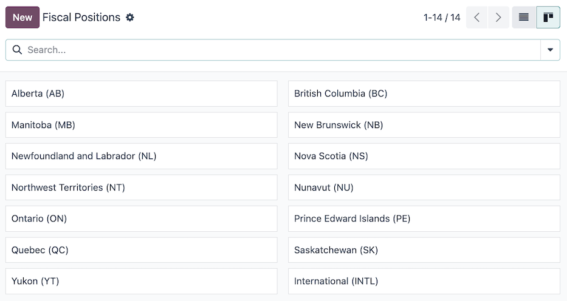

======
Canada
======

.. |COA| replace:: :abbr:`CoA (Chart of Accounts)`
.. |AR| replace:: :abbr:`AR (Accounts Receivable)`
.. |AP| replace:: :abbr:`AP (Accounts Payable)`
.. |CPA| replace:: :abbr:`CPA (Chartered Professional Accountant)`
.. |FCN| replace:: :abbr:`FCN (Next File Creation Number)`

The Odoo Canada localization package provides tailored features and configurations for Canadian
businesses.

A series of videos on the subject of Accounting are available through Odoo's eLearning platform.
These videos cover how to start from scratch, set up configurations, complete common workflows, and
provide in-depth looks at some specific use cases.

.. seealso::
   - `Odoo Tutorials: Accounting & Invoicing
     <https://www.odoo.com/slides/accounting-and-invoicing-19>`_
   - `Odoo SmartClass: Accounting <https://www.odoo.com/slides/smartclass-accounting-121>`_

Configuration
=============

Below are the available modules in Odoo for accounting use in Canada.

Modules installation
--------------------

:ref:`Install <general/install>` the following modules to get all the features of the Canadian
localization:

.. list-table::
   :header-rows: 1
   :widths: 25 25 50

   * - Name
     - Technical name
     - Description
   * - :guilabel:`Canada - Accounting`
     - `l10n_ca`
     - Base accounting module for Canadian localization.
   * - :guilabel:`Canada - Accounting Reports`
     - `l10n_ca_reports`
     - Adds Canadian accounting reports.
   * - :guilabel:`CPA005 Payments`
     - `l10n_ca_payment_cpa005`
     - Enables the export of payments as :ref:`CPA 005 files <l10n_ca/cpa005>` for use in Canada.
   * - :guilabel:`Canadian Checks Layout`
     - `l10n_ca_check_printing`
     - Enables the printing of payments on pre-printed check paper. Supports the three most common
       check formats and works natively with the linked checks from `checkdepot.net
       <https://checkdepot.net/collections/computer-checks/Odoo>`_.

       - `Check on top: Quicken / QuickBooks standard
         <https://checkdepot.net/collections/computer-checks/odoo+top-check>`_
       - `Check on middle: Peachtree standard
         <https://checkdepot.net/collections/computer-checks/odoo+middle-check>`_
       - `Check on bottom: ADP standard
         <https://checkdepot.net/collections/computer-checks/odoo+Bottom-Check>`_

Company
-------

Configure the company record by navigating to :menuselection:`Settings --> General Settings` and
find the :guilabel:`Companies` section. From here, select the :icon:`oi-arrow-right`
:guilabel:`Update Info` button to modify the following company fields:

- :guilabel:`Company Name`: name of the company.
- :guilabel:`Address`: the complete address of the company, be sure the :guilabel:`Country` is set
  as :guilabel:`Canada`.
- :guilabel:`Short Name used in Canadian EFT`: 15 character field used to represent a short version
  of the *Originator's name* in Canadian EFT files. It is typically used for bank statements. Most
  banks **require** this value to be all uppercase.

.. note::
   Both the :guilabel:`Company Name` and the :guilabel:`Short Name used in Canadian EFT` appear in
   the :ref:`CPA 005 file <l10n_ca/cpa005>`.

.. _l10n_ca/coa:

Chart of accounts
=================

The :doc:`chart of accounts (COA) <../accounting/get_started/chart_of_accounts>` for the Canadian
localization, in Odoo, has accounts grouped into seven main categories, with corresponding numeric
values that prefix individual journal entries:

- **Receivable**: the balance of money (or credit) due to the business for goods or services
  delivered or used, but not yet paid for by customers. |AR| is indicated by the journal code
  labeled (or beginning) with :guilabel:`1`.
- **Payable**: the business's short-term obligations owed to its creditors or suppliers, which have
  not yet been paid. |AP| is indicated by the journal code labeled (or beginning) with
  :guilabel:`2`.
- **Equity**: the amount of money that would be returned to a company's shareholders if all of the
  assets were liquidated and all of the company's debt was paid off in the case of liquidation.
  Equity is indicated by the journal code labeled (or beginning) with :guilabel:`3` or
  :guilabel:`9`.
- **Assets**: items listed on the balance sheet that contains economic value or have the ability to
  generate cash flows in the future, such as a piece of machinery, a financial security, or a
  patent. Assets are indicated by the journal code labeled (or beginning) with :guilabel:`1`.
- **Liability**: refers to a company's financial debts or obligations that arise during the course
  of business operations. Liabilities are indicated by the journal code labeled (or beginning) with
  :guilabel:`2`.
- **Income**: synonymous with *net income*, this is the profit a company retains after paying off
  all relevant expenses from sales revenue earned. Income is indicated by the journal code labeled
  (or beginning) with :guilabel:`4` or :guilabel:`6`.
- **Expenses**: the cost of operations that a company incurs to generate revenue. Expenses are
  indicated by the journal code labeled (or beginning) with a :guilabel:`6`.

.. tip::
   Predefined accounts are included in Odoo, as part of the |COA| that's installed with the Canadian
   localization package. The accounts listed below are preconfigured to perform certain operations
   within Odoo. It is recommended to **not** delete these accounts; however, if changes are needed,
   rename the accounts instead.

   .. list-table::
      :header-rows: 1
      :stub-columns: 1

      * - :guilabel:`Type`
        - :guilabel:`Account Name`
      * - :guilabel:`Current Assets`
        - | :guilabel:`Bank Suspense Account`
          | :guilabel:`Outstanding Receipts`
          | :guilabel:`Outstanding Payments`
          | :guilabel:`Liquidity Transfer`
          | :guilabel:`Stock Valuation`
          | :guilabel:`Stock Interim (Received)`
          | :guilabel:`Stock Interim (Delivered)`
          | :guilabel:`Cost of Production`
      * - :guilabel:`Income`
        - | :guilabel:`Foreign Exchange Gain`
          | :guilabel:`Cash Difference Gain`
          | :guilabel:`Cash Discount Gain`
      * - :guilabel:`Expenses`
        - | :guilabel:`Cash Discount Loss`
          | :guilabel:`Foreign Exchange Loss`
          | :guilabel:`Cash Difference Loss`
      * - :guilabel:`Current Year Earnings`
        - :guilabel:`Undistributed Profits/Losses`
      * - :guilabel:`Receivable`
        - :guilabel:`Account Receivable`
      * - :guilabel:`Payable`
        - :guilabel:`Account Payable`

.. seealso::
   - :doc:`../accounting/get_started/chart_of_accounts`
   - :doc:`../accounting/get_started/cheat_sheet`

.. _l10n_ca/fiscal-positions:

Fiscal positions
================

Canadian tax rates and taxable items vary by province and territory. Default fiscal positions are
automatically created when the Odoo **Accounting** application is installed. To manage or configure
additional fiscal positions, navigate to :menuselection:`Accounting --> Configuration --> Fiscal
Positions`.

The following fiscal positions are available by default:

- :guilabel:`Alberta (AB)`
- :guilabel:`British Columbia (BC)`
- :guilabel:`Manitoba (MB)`
- :guilabel:`New Brunswick (NB)`
- :guilabel:`Newfoundland and Labrador (NL)`
- :guilabel:`Nova Scotia (NS)`
- :guilabel:`Northwest Territories (NT)`
- :guilabel:`Nunavut (NU)`
- :guilabel:`Ontario (ON)`
- :guilabel:`Prince Edward Islands (PE)`
- :guilabel:`Quebec (QC)`
- :guilabel:`Saskatchewan (SK)`
- :guilabel:`Yukon (YT)`
- :guilabel:`International (INTL)`

.. note::
   When considering what taxes to be applied, it is the province where the delivery occurs that
   matters. Therefore, delivery is the responsibility of the vendor and is accounted for at the
   customer location.

.. example::
   - A delivery is made to a customer from another province.
        Set the fiscal position on the customer's record to the province of the customer.
   - A customer from another province comes to pick up products.
        No fiscal position should be set on the customer's record.
   - An international vendor doesn't charge any tax, but taxes are charged by the customs broker.
        Set the fiscal position on the vendor's record to *International*.
   - An international vendor charges provincial tax.
        Set the fiscal position on the vendor's record to your position.

.. seealso::
   :doc:`../accounting/taxes/fiscal_positions`

.. _l10n_ca/taxes:

Taxes
=====

In Canada, tax rates and what is considered taxable vary by province and territory. Default *Sales*
and *Purchases* taxes are created automatically when the Odoo **Accounting** application is
installed. To manage existing or configure additional taxes, navigate to :menuselection:`Accounting
--> Configuration --> Taxes`.

.. _l10n_ca/taxes-avatax:

AvaTax
------

**Avalara AvaTax** is a cloud-based tax calculation and compliance software that integrates with
Odoo for several localizations, including Canada. Integrating AvaTax with Odoo provides real-time
and region-specific tax calculations when items are sold, purchased, and invoiced in the database.

.. important::
   AvaTax is available for integration with databases/companies that have locations in Canada and/or
   the United States. Reference the :ref:`avatax/fiscal_country` documentation for more information.

.. seealso::
   Refer to the documentation articles below to integrate and configure an AvaTax account with an
   Odoo database:

   - :doc:`AvaTax integration <../accounting/taxes/avatax>`
   - :doc:`Avalara management portal <../accounting/taxes/avatax/avalara_portal>`
   - :doc:`Calculate taxes with AvaTax <../accounting/taxes/avatax/avatax_use>`
   - Avalara's support documents: `About AvaTax
     <https://community.avalara.com/support/s/document-item?language=en_US&bundleId=dqa1657870670369_dqa1657870670369&topicId=About_AvaTax.html&_LANG=enus>`_

.. _l10n_ca/reports:

Reports
=======

A number of :doc:`report selections <../accounting/reporting>` are readily available for the
Canadian localization, under the :menuselection:`Accounting app --> Reporting` drop-down menu:

- :ref:`Balance Sheet <accounting/reporting/balance-sheet>`: a "snapshot" of a company's financial
  position at a specific point in time, which contains an overview of a company's assets,
  liabilities, and equity.

  Be sure to select the :menuselection:`Balance sheet (CA)` option from the :icon:`fa-book`
  :guilabel:`Report` filter.

  .. image:: canada/l10n-ca-balance-sheet.png
     :alt: Balance sheet report selection for CA localization in Odoo.

- :ref:`Profit & Loss <accounting/reporting/balance-sheet>`: otherwise known as a *P&L statement* or
  *income statement*, provides a summary of a company's revenues, expenses, and profits/losses over
  a given period of time.

  Be sure to select the :menuselection:`Profit and loss (CA)` option from the :icon:`fa-book`
  :guilabel:`Report` filter.

  .. image:: canada/l10n-ca-profit-loss.png
     :alt: Profit and loss report selection for CA localization in Odoo.

- :guilabel:`Cash Flow Statement`: shows how much cash and cash equivalents a company has received
  and spent in a given period.
- :ref:`Executive Summary <accounting/reporting/executive-summary>`: an overview report that covers
  the key performance indicators of a company's financial position, such as revenue, profit, and
  debt.
- :ref:`Tax Report <accounting/reporting/tax-report>`: an official form filed for a tax authority
  that reports income, expenses, and other pertinent tax information. Tax reports allow taxpayers to
  calculate their tax liability, schedule tax payments, or request refunds for the overpayment of
  taxes. In Odoo, the tax report can be made monthly, every two months, quarterly, every 4 months,
  semi-annually, and annually.

.. seealso::
   - :doc:`Accounting reporting <../accounting/reporting>`
   - :doc:`../../essentials/search`

.. _l10n_ca/cash-discount:

Cash discount
=============

Cash discounts can be configured from :menuselection:`Accounting app --> Payment Terms`. Each
payment term can be set up with a cash discount and reduced tax.

.. seealso::
   :doc:`../accounting/customer_invoices/cash_discounts`

Writing checks
==============

The Canadian localization allows users to print checks for vendor payments. Be sure the *Canadian
Checks Layout* (`l10n_ca_check_printing`) module for the CA localization is :ref:`installed
<general/install>`.

To enable check printing from Odoo, navigate to :menuselection:`Accounting --> Configuration -->
Settings` and find the :guilabel:`Vendor Payments` section. From here, tick the :guilabel:`Checks`
checkbox to reveal several fields for check configuration.

Select a :guilabel:`Check Layout` from the drop-down menu:

- :guilabel:`Print Check (Top) - CA`
- :guilabel:`Print Check (Middle) - CA`
- :guilabel:`Print Check (Bottom) - CA`

Next, choose whether or not to enable the :guilabel:`Multi-Pages Check Stub` checkbox.

Optionally set a :guilabel:`Check Top Margin`, :guilabel:`Check Left Margin`, or :guilabel:`Check
Right Margin` if required.

Tick the :guilabel:`Print Date Label` checkbox if a date label is required.

Once all check configurations are complete, :guilabel:`Save` the settings.

.. tip::
   Some of the check formats may require pre-printed paper from a third party vendor.
   `Pre-printed checks from checkdepot.net <https://checkdepot.net/collections/odoo-checks>`_ are
   recommended.

.. seealso::
   :doc:`../accounting/payments/pay_checks`

Receive pre-authorized debits
=============================

Pre-authorized debits are a method for receiving payments from customers, where the customer
authorizes the business to withdraw funds from their bank account on a recurring basis. This
functionality is commonly used for subscriptions, recurring invoices, and other regular payments.

In the Odoo Canadian localization, pre-authorized debits are facilitated through an
:doc:`integration with Stripe <../payment_providers/stripe>`.

.. seealso::
   - :doc:`Setting up payment providers <../payment_providers>`
   - `Stripe's pre-authorized debit payments documentation
     <https://docs.stripe.com/payments/acss-debit>`_

.. _l10n_ca/cpa005:

|CPA| 005 file to pay vendors
=============================

To use the |CPA| 005 file, a type of electronic funds transfer (EFT) document, to pay vendors, first
configure the :ref:`Bank journal <l10n_ca/cpa005/bank-journal>` and
:ref:`Vendor <l10n_ca/cpa005/vendor>`. Then, follow the :ref:`workflow <l10n_ca/cpa005/workflow>`.

.. _l10n_ca/cpa005/bank-journal:

Configuration
-------------

Bank journal
~~~~~~~~~~~~

Navigate to :menuselection:`Accounting --> Configuration --> Journals` and then select the
:guilabel:`Bank` journal.

In the :guilabel:`Bank` journal record, select the :guilabel:`Outgoing Payments` tab.

Be sure :guilabel:`Canadian EFT` is listed under the :guilabel:`Payment Method`.

In the :guilabel:`Canadian EFT/CPA configuration`, configure the fields that where provided by the
bank and are needed for generating the EFT file:

- :guilabel:`Destination Data Center`: 5-digit ID.
- :guilabel:`Originator ID`: 10-digit code.

  .. important::
     Some banks require the :guilabel:`Originator ID` to combine the :guilabel:`Destination Data
     Center` ID with the routing number. Please check with the bank for the expected format.

- :guilabel:`Next File Creation Number (FCN)`: used when validating a Canadian EFT batch payment and
  is printed in the XML file. The |FCN| is a 4-digit sequence from `0001` to `9999`.

  .. important::
     Some banks require a specific |FCN| number, please check with the bank.

  .. tip::
     If any details of the |FCN| need to be adjusted, go to :menuselection:`Settings --> Technical
     --> Sequences` and search for `FCN`.

Next, select the :guilabel:`Journal Entries` tab and configure the following fields:

- :guilabel:`Account Number`: Select an existing bank account number or :ref:`create a new one
  <bank_accounts/number>` by selecting the :icon:`oi-arrow-right` :guilabel:`(Internal link)` icon.

  Be sure to select a :guilabel:`Bank`, set a :guilabel:`Financial Institution ID Number`, and to
  enable :guilabel:`Send Money`.
- :guilabel:`Bank`: Automatically selected depending on the :guilabel:`Account Number`.

.. important::
   To validate the bank account, the user **must** have the permission to do so. To confirm,
   navigate to :menuselection:`Settings --> Users & Companies --> Users`, select the user, and in
   the :guilabel:`Access Rights` tab find the :guilabel:`Accounting` section.

   From here, make sure the :guilabel:`Bank` field is set to :guilabel:`Validate bank account`.

.. _l10n_ca/cpa005/vendor:

Vendor
~~~~~~

Navigate to :menuselection:`Accounting --> Vendors --> Vendors` and choose a vendor to set up their
bank account information.

In the :guilabel:`Accounting` tab, be sure to configure :guilabel:`Bank Accounts`.

.. _l10n_ca/cpa005/workflow:

Workflow
--------

First, :ref:`create the vendor bills <vendor_bills/create>`  and :ref:`register the payments
<vendor_bills/payment>`.

- :guilabel:`Payment Type`: select :guilabel:`Send`.
- :guilabel:`Vendor`: select the vendor to assign to this payment.
- :guilabel:`Ammount`: set a payment amount.
- :guilabel:`Date`: select the date of the payment.
- :guilabel:`Memo`: write in a memo description.
- :guilabel:`Journal`: select :guilabel:`Bank`.
- :guilabel:`Payment Method`: select :guilabel:`Canadian EFT`.
- :guilabel:`EFT/CPA transaction code`: select the desired transaction code.
- :guilabel:`Vendor Bank Account`: select the vendor's bank account.

.. note::
   Alternativly, a :doc:`payment can be created independently <../accounting/payments>`. Be sure to
   select :guilabel:`Canadian EFT` as the :guilabel:`Payment Method`.

Finally, create a batch payment by navigating to :menuselection:`Accounting --> Vendors -->
Payments`. Select the checkboxes for each of the vendor payments to include in the batch, then
select the :guilabel:`Create Batch` button to create a new batch payment.

.. tip::
   The payments included in a batch are not restricted by the same vendor.

Existing batch payments can be managed from :menuselection:`Accounting --> Vendors --> Batch
Payments`. The export :file:`.txt` file displays in the chatter of the batch payment.

.. note::
   Please be aware that after importing the :file:`.txt` file to the bank, it may take up to 48
   hours to process the payment. Plan ahead if a deadline exists, such as payroll, to avoid legal
   issues.

.. important::
   Please validate the batch payment only once the date is confirmed. It is difficult to modify a
   validated batch payment.
