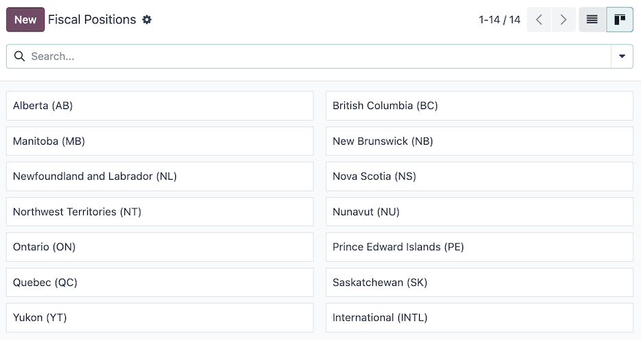

======
Canada
======

.. |COA| replace:: :abbr:`CoA (Chart of Accounts)`
.. |AR| replace:: :abbr:`AR (Accounts Receivable)`
.. |AP| replace:: :abbr:`AP (Accounts Payable)`

The Odoo Canada localization package provides tailored features and configurations for Canadian
businesses.

A series of videos on the subject of Accounting are available through Odoo's eLearning platform.
These videos cover how to start from scratch, set up configurations, complete common workflows, and
provide in-depth looks at some specific use cases.

.. seealso::
   - `Odoo Tutorials: Accounting & Invoicing
     <https://www.odoo.com/slides/accounting-and-invoicing-19>`_
   - `Odoo SmartClass: Accounting <https://www.odoo.com/slides/smartclass-accounting-121>`_

.. _localizations/canada/modules:

Modules
=======

The following modules are installed automatically with the Canadian localization:

.. list-table::
   :header-rows: 1
   :widths: 25 25 50

   * - Name
     - Technical name
     - Description
   * - :guilabel:`Canada - Accounting`
     - `l10n_ca`
     - Base accounting module for Canadian localization.
   * - :guilabel:`Canada - Accounting Reports`
     - `l10n_ca_reports`
     - Adds Canadian accounting reports.
   * - :guilabel:`Canadian Checks Layout`
     - `l10n_ca_check_printing`
     - Enables the printing of payments on pre-printed check paper. Supports the three most common
       check formats and works natively with the linked checks from `checkdepot.net
       <https://checkdepot.net/collections/computer-checks/Odoo>`_.

       - `Check on top: Quicken / QuickBooks standard
         <https://checkdepot.net/collections/computer-checks/odoo+top-check>`_
       - `Check on middle: Peachtree standard
         <https://checkdepot.net/collections/computer-checks/odoo+middle-check>`_
       - `Check on bottom: ADP standard
         <https://checkdepot.net/collections/computer-checks/odoo+Bottom-Check>`_

.. note::
   In some cases, such as when upgrading to a version with additional modules, it is possible that
   modules may not be installed automatically. Any missing modules can be manually :doc:`installed
   <../../general/apps_modules>`.

.. _localizations/canada/loc-overview:

Localization overview
=====================

The Canadian localization package ensures compliance with Canadian fiscal and accounting
regulations. It includes tools for managing taxes, fiscal positions, reporting, and a predefined
chart of accounts tailored to Canada’s standards.

The Canadian localization package provides the following key features to ensure compliance with
local fiscal and accounting regulations:

- :ref:`Chart of accounts <localizations/canada/coa>`: a predefined structure tailored to Canadian
  accounting standards
- :ref:`Fiscal position <localizations/canada/fiscal-positions>`: automated tax adjustments based on
  customer or supplier registration status
- :ref:`Taxes <localizations/canada/taxes>`: pre-configured tax rates, including standard VAT,
  zero-rated, and exempt options
- :ref:`Reporting <localizations/canada/reports>`

.. _localizations/canada/coa:

Chart of accounts
-----------------

The :doc:`chart of accounts (COA) <../accounting/get_started/chart_of_accounts>` for the Canadian
localization, has accounts grouped into seven main categories, with corresponding numeric values
that prefix individual journal entries:

- **Receivable**: the balance of money (or credit) due to the business for goods or services
  delivered or used, but not yet paid for by customers. |AR| is indicated by the journal code
  labeled (or beginning) with :guilabel:`1`.
- **Payable**: the business's short-term obligations owed to its creditors or suppliers, which have
  not yet been paid. |AP| is indicated by the journal code labeled (or beginning) with
  :guilabel:`2`.
- **Equity**: the amount of money that would be returned to a company's shareholders if all of the
  assets were liquidated and all of the company's debt was paid off in the case of liquidation.
  Equity is indicated by the journal code labeled (or beginning) with :guilabel:`3` or
  :guilabel:`9`.
- **Assets**: items listed on the balance sheet that contains economic value or have the ability to
  generate cash flows in the future, such as a piece of machinery, a financial security, or a
  patent. Assets are indicated by the journal code labeled (or beginning) with :guilabel:`1`.
- **Liability**: refers to a company's financial debts or obligations that arise during the course
  of business operations. Liabilities are indicated by the journal code labeled (or beginning) with
  :guilabel:`2`.
- **Income**: synonymous with *net income*, this is the profit a company retains after paying off
  all relevant expenses from sales revenue earned. Income is indicated by the journal code labeled
  (or beginning) with :guilabel:`4` or :guilabel:`6`.
- **Expenses**: the cost of operations that a company incurs to generate revenue. Expenses are
  indicated by the journal code labeled (or beginning) with a :guilabel:`6`.

.. tip::
   Predefined accounts are included in Odoo, as part of the |COA| that's installed with the Canadian
   localization package. The accounts listed below are preconfigured to perform certain operations
   within Odoo. It is recommended to **not** delete these accounts; however, if changes are needed,
   rename the accounts instead.

   .. list-table::
      :header-rows: 1
      :stub-columns: 1

      * - :guilabel:`Type`
        - :guilabel:`Account Name`
      * - :guilabel:`Current Assets`
        - | :guilabel:`Bank Suspense Account`
          | :guilabel:`Outstanding Receipts`
          | :guilabel:`Outstanding Payments`
          | :guilabel:`Liquidity Transfer`
          | :guilabel:`Stock Valuation`
          | :guilabel:`Stock Interim (Received)`
          | :guilabel:`Stock Interim (Delivered)`
          | :guilabel:`Cost of Production`
      * - :guilabel:`Income`
        - | :guilabel:`Foreign Exchange Gain`
          | :guilabel:`Cash Difference Gain`
          | :guilabel:`Cash Discount Gain`
      * - :guilabel:`Expenses`
        - | :guilabel:`Cash Discount Loss`
          | :guilabel:`Foreign Exchange Loss`
          | :guilabel:`Cash Difference Loss`
      * - :guilabel:`Current Year Earnings`
        - :guilabel:`Retained Earnings/Deficits, Unappropriated`
      * - :guilabel:`Receivable`
        - :guilabel:`Account Receivable`
      * - :guilabel:`Payable`
        - :guilabel:`Account Payable`

.. seealso::
   :doc:`../accounting/get_started/cheat_sheet`

.. _localizations/canada/fiscal-positions:

Fiscal positions
----------------

Canadian tax rates and taxable items vary by province and territory. Default fiscal positions are
automatically created when the Odoo **Accounting** application is installed. To manage or configure
additional fiscal positions, navigate to :menuselection:`Accounting --> Configuration --> Fiscal
Positions`.

The following fiscal positions are available by default:

- :guilabel:`Alberta (AB)`
- :guilabel:`British Columbia (BC)`
- :guilabel:`Manitoba (MB)`
- :guilabel:`New Brunswick (NB)`
- :guilabel:`Newfoundland and Labrador (NL)`
- :guilabel:`Nova Scotia (NS)`
- :guilabel:`Northwest Territories (NT)`
- :guilabel:`Nunavut (NU)`
- :guilabel:`Ontario (ON)`
- :guilabel:`Prince Edward Islands (PE)`
- :guilabel:`Quebec (QC)`
- :guilabel:`Saskatchewan (SK)`
- :guilabel:`Yukon (YT)`
- :guilabel:`International (INTL)`

.. note::
   When considering what taxes to be applied, it is the province where the delivery occurs that
   matters. Therefore, delivery is the responsibility of the vendor and is accounted for at the
   customer location.

.. example::
   - A delivery is made to a customer from another province.
        Set the fiscal position on the customer's record to the province of the customer.
   - A customer from another province comes to pick up products.
        No fiscal position should be set on the customer's record.
   - An international vendor doesn't charge any tax, but taxes are charged by the customs broker.
        Set the fiscal position on the vendor's record to *International*.
   - An international vendor charges provincial tax.
        Set the fiscal position on the vendor's record to your position.

.. seealso::
   :doc:`../accounting/taxes/fiscal_positions`

.. _localizations/canada/taxes:

Taxes
-----

In Canada, tax rates and what is considered taxable vary by province and territory. Default *Sales*
and *Purchases* taxes are created automatically when the Odoo **Accounting** application is
installed. To manage existing or configure additional taxes, navigate to :menuselection:`Accounting
--> Configuration --> Taxes`.

.. _localizations/canada/taxes-avatax:

AvaTax
~~~~~~

**Avalara AvaTax** is a cloud-based tax calculation and compliance software that integrates with
Odoo for several localizations, including Canada. Integrating AvaTax with Odoo provides real-time
and region-specific tax calculations when items are sold, purchased, and invoiced in the database.

.. important::
   AvaTax is available for integration with databases/companies that have locations in Canada and/or
   the United States. Reference the :ref:`accounting/avalara/fiscal_country` documentation for more
   information.

.. seealso::
   Refer to the documentation articles below to integrate and configure an AvaTax account with an
   Odoo database:

   - :doc:`Avalara integration <../accounting/taxes/avalara>`
   - :doc:`Avalara management portal <../accounting/taxes/avalara/avalara_portal>`
   - :doc:`Calculate taxes with AvaTax <../accounting/taxes/avalara/avatax_use>`

.. _localizations/canada/reports:

Reports
-------

A number of :doc:`report selections <../accounting/reporting>` are readily available for the
Canadian localization, under the :menuselection:`Accounting app --> Reporting` drop-down menu:

- :ref:`Balance Sheet <accounting/reporting/balance-sheet>`: a "snapshot" of a company's financial
  position at a specific point in time, which contains an overview of a company's assets,
  liabilities, and equity.

  Be sure to select the :menuselection:`Balance sheet (CA)` option from the :icon:`fa-book`
  :guilabel:`Report` filter.

  .. image:: canada/l10n-ca-balance-sheet.png
     :alt: Balance sheet report selection for CA localization in Odoo.

- :ref:`Profit & Loss <accounting/reporting/balance-sheet>`: otherwise known as a *P&L statement* or
  *income statement*, provides a summary of a company's revenues, expenses, and profits/losses over
  a given period of time.

  Be sure to select the :menuselection:`Profit and loss (CA)` option from the :icon:`fa-book`
  :guilabel:`Report` filter.

  .. image:: canada/l10n-ca-profit-loss.png
     :alt: Profit and loss report selection for CA localization in Odoo.

- :guilabel:`Cash Flow Statement`: shows how much cash and cash equivalents a company has received
  and spent in a given period.
- :ref:`Executive Summary <accounting/reporting/executive-summary>`: an overview report that covers
  the key performance indicators of a company's financial position, such as revenue, profit, and
  debt.
- :ref:`Tax Report <accounting/reporting/tax-report>`: an official form filed for a tax authority
  that reports income, expenses, and other pertinent tax information. Tax reports allow taxpayers to
  calculate their tax liability, schedule tax payments, or request refunds for the overpayment of
  taxes. In Odoo, the tax report can be made monthly, every two months, quarterly, every 4 months,
  semi-annually, and annually.

.. seealso::
   - :doc:`Accounting reporting <../accounting/reporting>`
   - :doc:`../../essentials/search`

.. _localizations/canada/accounting:

Accounting
==========

.. _localizations/canada/cash-discount:

Cash discount
-------------

Cash discounts can be configured from :menuselection:`Accounting --> Configuration --> Payment
Terms`. Each payment term can be set up with a cash discount and reduced tax.

.. seealso::
   :doc:`../accounting/customer_invoices/cash_discounts`

.. _localizations/canada/writing-checks:

Writing checks
--------------

The Canadian localization allows users to print checks for vendor payments. Be sure the *Canadian
Checks Layout* (`l10n_ca_check_printing`) module for the CA localization is :ref:`installed
<general/install>`.

To enable check printing from Odoo, navigate to :menuselection:`Accounting --> Configuration -->
Settings` and find the :guilabel:`Vendor Payments` section. From here, tick the :guilabel:`Checks`
checkbox to reveal several fields for check configuration.

Select a :guilabel:`Check Layout` from the drop-down menu:

- :guilabel:`Print Check (Top) - CA`
- :guilabel:`Print Check (Middle) - CA`
- :guilabel:`Print Check (Bottom) - CA`

Next, choose whether or not to enable the :guilabel:`Multi-Pages Check Stub` checkbox.

Optionally set a :guilabel:`Check Top Margin`, :guilabel:`Check Left Margin`, or :guilabel:`Check
Right Margin` if required.

Tick the :guilabel:`Print Date Label` checkbox if a date label is required.

Once all check configurations are complete, :guilabel:`Save` the settings.

.. tip::
   Some of the check formats may require pre-printed paper from a third party vendor.
   `Pre-printed checks from checkdepot.net <https://checkdepot.net/collections/odoo-checks>`_ are
   recommended.

.. seealso::
   :doc:`../accounting/payments/pay_checks`

.. _localizations/canada/eft:

EFT - electronic transfers
--------------------------

In Canada, Electronic Funds Transfer (EFT) refers to the digital transfer of funds between different
bank accounts, largely replacing traditional paper-based transactions. :abbr:`EFT (Electronic Funds
Transfers)` is the primary system used by businesses to automate payroll, pay suppliers, and collect
recurring payments.

.. _localizations/canada/cpa005:

CPA005 file
~~~~~~~~~~~

CPA005 is a standardized file format used by Canadian banks to process batched financial
transactions, primarily for :abbr:`EFT (Electronic Funds Transfers)`.

.. note::
   Make sure to :ref:`install <general/install>` the :guilabel:`CPA005 Payments`
   (`l10n_ca_payment_cpa005`) module.

.. _localizations/canada/cpa005-configuration:

Configuration
*************

The following configurations are required:

#. Make sure to fill in the necessary fields on the :doc:`company record
   </applications/general/companies>`:

   - :guilabel:`Country`: Canada.
   - :guilabel:`Short Name used in Canadian EFT`: Enter a short version of the :guilabel:`Company
     Name`, limited to a maximum of 15 characters.

     .. note::
        - Most banks require this value to be all uppercase letters.
        - Both the :guilabel:`Company Name` and the short name appear in the CPA005 file.

#. Set up the CPA005 information in the :ref:`Bank journal <accounting/journals/bank>`:

   .. note::
      Make sure to have the appropriate :doc:`access rights <../../general/users/access_rights>` in
      the :guilabel:`Accounting` section to validate bank accounts.

   #. Go to :menuselection:`Accounting --> Configuration --> Journals` and access the relevant
      :guilabel:`Bank` journal.
   #. In  the :guilabel:`Journal Entries` tab, enter the bank :ref:`Account Number and Bank
      <accounting/journals/bank>` details.
   #. In the :guilabel:`Outgoing Payments` tab, make sure the :guilabel:`Canadian EFT` Payment
      Method is set. Then, complete the following fields in the :guilabel:`Canadian EFT/CPA
      configuration` section:

      - :guilabel:`Destination Data Center`: Enter the 5-digit ID provided by your bank.
      - :guilabel:`Originator ID`: Enter the 10-digit code provided by your bank.
      - :guilabel:`Next File Creation Number (FCN)`: Enter a sequence between `1` and `9,999` that
        will appear on the CPA005 file.

#. Make sure the :guilabel:`Bank Account` information is properly set up in the :ref:`Accounting
   tab <contacts/accounting-tab>` for the relevant vendor.

.. _localizations/canada/cpa005-payments:

CPA005 EFT payments
*******************

.. note::
   Make sure that :ref:`batch payments are enabled <accounting/batch/configuration>`.

To pay vendor bills using an :abbr:`EFT (Electronic Funds Transfer)` via the CPA005 file format,
follow these steps:

#. When :ref:`registering payments for vendor bills <accounting/payments/group-payments>`, select
   the :guilabel:`Canadian EFT` payment method.
#. Go to :menuselection:`Accounting --> Vendor --> Payments`, access the relevant payments, and
   select the :guilabel:`EFT/CPA transaction code` for each payment.
#. In the :guilabel:`Vendor Payments` list view, select the relevant payments and click
   :guilabel:`Create Batch`.
#. Verify the information, such as the :guilabel:`Date` and :guilabel:`File Creation Number`, before
   validating the batch payment, as modifications can be more complex once validated.
#. Click :guilabel:`Validate`.

The generated CPA005 TXT file is available in the chatter for download and bank import.

.. important::
   After importing the file into your banking system, payment processing may take up to 48 hours.
