=====
Chile
=====

.. tip::
   Watch the two webinar recordings below for a general presentation of the localization, and search
   the playlist for tutorials to discover practical workflows while using Odoo in Chile.

   - `Webinar: intro and demo <https://youtu.be/BHnByZiyYcM>`_.
   - `Webinar: delivery guide <https://youtu.be/X7i4PftnEdU>`_.
   - `Playlist of tutorials
     <https://youtube.com/playlist?list=PL1-aSABtP6AB6UY7VUFnVgeYOaz33fb4P>`_.

.. seealso::
   - `Chilean localization app tour <https://www.youtube.com/watch?v=3qYkgbmBYHw>`_
   - `Chilean localization smart tutorial
     <https://www.odoo.com/slides/smart-tutorial-localizacion-de-chile-131>`_

.. _chile/configuration:

Modules
=======

:ref:`Install <general/install>` the following modules to utilize all the features of the Chilean
localization.

.. list-table::
   :header-rows: 1

   * - Name
     - Technical name
     - Description
   * - :guilabel:`Chile - Accounting`
     - `l10n_cl`
     - Adds the minimal accounting features required for a company to operate in Chile under the
       :abbr:`SII (Servicio de Impuestos Internos)` regulations and guidelines.
   * - :guilabel:`Chile - Accounting Reports`
     - `l10n_cl_reports`
     - Adds the *Propuesta F29* and *Balance Tributario (8 columnas)* reports.
   * - :guilabel:`Chile - E-invoicing`
     - `l10n_cl_edi`
     - Includes all technical and functional requirements to generate and receive electronic
       invoices online based on the :abbr:`SII (Servicio de Impuestos Internos)` regulations.
   * - :guilabel:`Chile - Electronic Receipt`
     - `l10n_cl_boletas`
     - Includes all technical and functional requirements to generate and receive electronic
       invoices digitally based on the :abbr:`SII (Servicio de Impuestos Internos)` regulations.
   * - :guilabel:`Electronic Exports of Goods for Chile`
     - `l10n_cl_edi_exports`
     - Includes technical and functional requirements to generate electronic invoices for exporting
       goods based on the :abbr:`SII (Servicio de Impuestos Internos)` and customs regulations.
   * - :guilabel:`Chile - E-Invoicing Delivery Guide`
     - `l10n_cl_edi_stock`
     - Includes all technical and functional requirements to generate delivery guides via web
       service based on the :abbr:`SII (Servicio de Impuestos Internos)` regulations.

.. note::
   - Odoo automatically installs the appropriate package for the company according to the country
     selected at the creation of the database.
   - The *Chile - E-Invoicing Delivery Guide* module depends on the *Inventory* application.

.. important::
   All features are only available if the company already completed the `SII Sistema de Facturación
   de Mercado <https://www.sii.cl/factura_electronica/factura_mercado/proceso_certificacion.htm>`_
   certification process.

Company information
===================

Navigate to :menuselection:`Settings --> Companies: Update Info` and ensure the following company
information is up-to-date and correctly filled in:

- :guilabel:`Company Name`
- :guilabel:`Address`:

  - :guilabel:`Street`
  - :guilabel:`City`
  - :guilabel:`State`
  - :guilabel:`ZIP`
  - :guilabel:`Country`

- :guilabel:`Tax ID`: enter the identification number for the selected :ref:`Taxpayer Type
  <chile/fiscal-info>`.
- :guilabel:`Activity Names`: select up to four activity codes.
- :guilabel:`Company Activity Description`: enter a short description of the company's activity.

Accounting settings
===================

Next, navigate to :menuselection:`Accounting --> Configuration --> Settings --> Chilean
Localization` and follow the instructions to configure the:

- :ref:`Fiscal information <chile/fiscal-info>`
- :ref:`Electronic invoice data <chile/electronic-invoice>`
- :ref:`DTE incoming email server <chile/dte-email>`
- :ref:`Signature certificates <chile/certificate>`

.. _chile/fiscal-info:

Fiscal information
------------------

Configure the following :guilabel:`Tax payer information`:

- :guilabel:`Taxpayer Type` by selecting the taxpayer type that applies:

  - :guilabel:`VAT Affected (1st Category)`: for invoices that charge taxes to customers
  - :guilabel:`Fees Receipt Issuer (2nd Category)`: for suppliers who issue fees receipt (Boleta)
  - :guilabel:`End consumer`: only issues receipts
  - :guilabel:`Foreigner`

- :guilabel:`SII Office`: select your company's :abbr:`SII (Servicio de Impuestos Internos)`
  regional office

.. _chile/electronic-invoice:

Electronic invoice data
-----------------------

Select your :guilabel:`SII Web Services` environment:

- :guilabel:`SII - Test`: for test databases using test :abbr:`CAFs (Folio
  Authorization Code)` obtained from the :abbr:`SII (Servicio de Impuestos Internos)`. In this mode,
  the direct connection flows can be tested, with the files being sent to the :abbr:`SII (Servicio
  de Impuestos Internos)`.
- :guilabel:`SII - Production`: for production databases.
- :guilabel:`SII - Demo Mode`: files are created and accepted automatically in demo mode but are
  **not** sent to the :abbr:`SII (Servicio de Impuestos Internos)`. For this reason, rejection
  errors or *Accepted with Objections* will not appear in this mode. Every internal validation can
  be tested in demo mode. Avoid selecting this option in a production database.

Then, enter the :guilabel:`Legal Electronic Invoicing Data`:

- :guilabel:`SII Resolution N°`
- :guilabel:`SII Resolution Date`

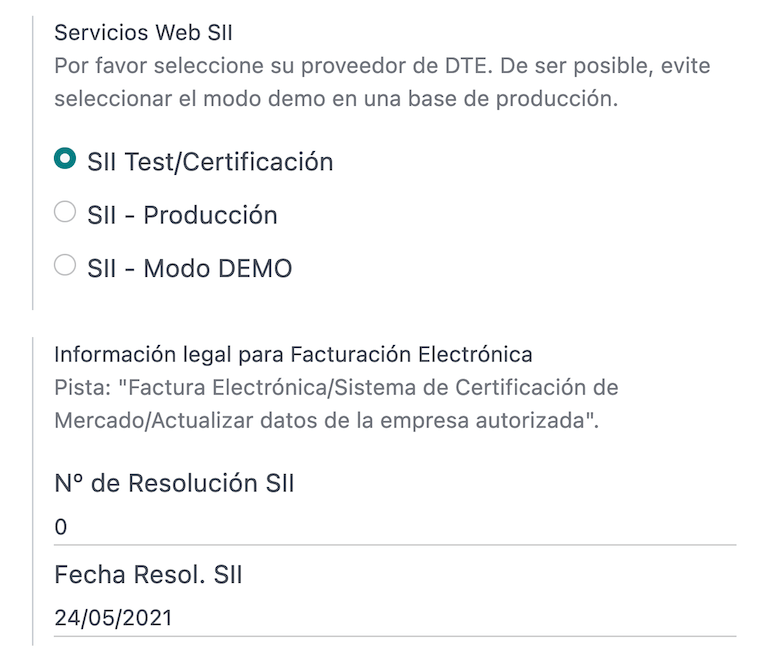

.. _chile/dte-email:

DTE incoming email server
=========================

The :abbr:`DTE (Documentos Tributarios Electrónicos)` :guilabel:`Email Box Electronic Invoicing` can
be defined to receive your customers' claim and acceptance emails. Enabling this option from
:menuselection:`Accounting --> Configuration --> Settings --> Chilean Localization` is necessary if
you want to use *Email Box Electronic Invoicing* as the :abbr:`DTE (Documentos Tributarios
Electrónicos)` incoming email server.

.. important::
   In order to receive your SII documents, it's necessary to set up your own email server. More
   information on how to do this can be found in this documentation:
   :doc:`../../general/email_communication/email_servers`

Begin by clicking :guilabel:`Configure DTE Incoming Email`, then click :guilabel:`New` to add a
server and fill in the following fields:

- :guilabel:`Name`: give the server a name.
- :guilabel:`Server Type`: select the server type used.

  - :guilabel:`IMAP Server`
  - :guilabel:`POP Server`
  - :guilabel:`Local Server`: uses a local script to fetch emails and create new records. The
    script can be found in the :guilabel:`Configuration` section with this option selected.
  - :guilabel:`Gmail OAuth Authentication`: requires your Gmail API credentials to be configured in
    the general settings. A direct link to the configuration can be found in the :guilabel:`Login
    Information` section.

- :guilabel:`DTE Server`: enable this option. By checking this option, this email account will be
  used to receive the electronic invoices from the suppliers, and communications from the :abbr:`SII
  (Servicio de Impuestos Internos)` regarding the electronic invoices issued. In this case, this
  email should match both emails declared on the :abbr:`SII (Servicio de Impuestos Internos)` site
  in the section: *ACTUALIZACION DE DATOS DEL CONTRIBUYENTE*, *Mail Contacto SII* and *Mail Contacto
  Empresas*.

In the :guilabel:`Server & Login` tab (for IMAP and POP servers):

- :guilabel:`Server Name`: enter the hostname or IP of the server.
- :guilabel:`Port`: enter the server port.
- :guilabel:`SSL/TLS`: enable this option if connections are encrypted using the SSL/TLS protocol.
- :guilabel:`Username`: enter the server login username.
- :guilabel:`Password`: enter the server login password.

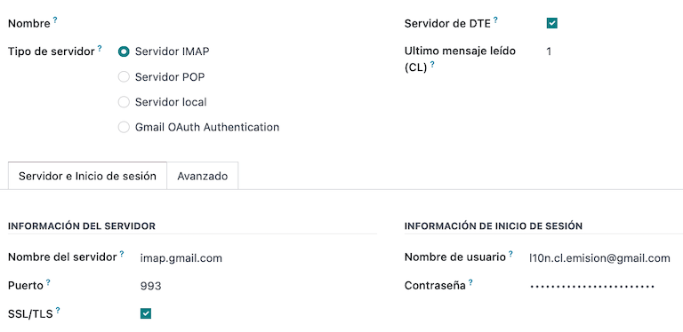

.. tip::
   Before going live, it is recommended to archive or remove all emails related to vendor bills that
   are not required to be processed in Odoo from your inbox.

.. _chile/certificate:

Certificate
-----------

A digital certificate in `.pfx` format is required to generate the electronic invoice signature. To
add one, click :guilabel:`Configure Signature Certificates` under the :guilabel:`Signature
Certificates` section. Then, click :guilabel:`New` to configure the certificate:

- :guilabel:`Certificate Key`: click :guilabel:`Upload your file` and select the `.pfx` file.
- :guilabel:`Certificate Passkey`: enter the file's passphrase.
- :guilabel:`Subject Serial Number`: depending on the certificate format, the field might not be
  automatically populated. In that case, enter the certificate's legal representative :abbr:`RUT
  (Rol Único Tributario)`.
- :guilabel:`Certificate Owner`: select one if you need to restrict the certificate for a specific
  user. Leave the field empty to share it with all billing users.

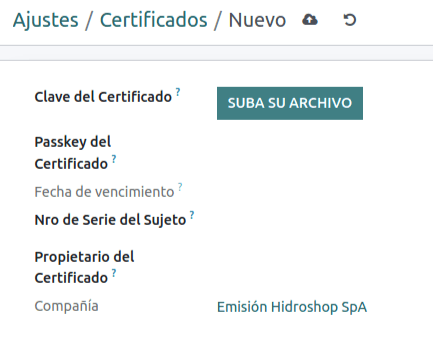

Multicurrency
=============

The official currency rate is provided by `Chilean mindicador.cl <https://mindicador.cl>`_. Navigate
to :menuselection:`Accounting --> Configuration --> Settings --> Currencies: Automatic Currency
Rates` to set an :guilabel:`Interval` for when the rate is automatically updated, or to select
another :guilabel:`Service`.

.. _chile/partner-information:

Partner information
===================

Configuring partner contacts is also required to send :abbr:`SII (Servicio de Impuestos Internos)`
electronic invoices. Open the :menuselection:`Contacts` app to do so and fill in the following
fields on a new or existing contact form.

- :guilabel:`Name`
- :guilabel:`Email`
- :guilabel:`Identification Number`
- :guilabel:`Taxpayer Type`
- :guilabel:`Activity Description`

In the :guilabel:`Electronic Invoicing` tab:

- :guilabel:`DTE Email`: enter the sender's email address for the partner.
- :guilabel:`Delivery Guide Price`: select which price the delivery guide displays, if any.

.. note::
   The :guilabel:`DTE Email` is the email used for sending electronic documents and must be set in
   the contact that will be part of an electronic document.

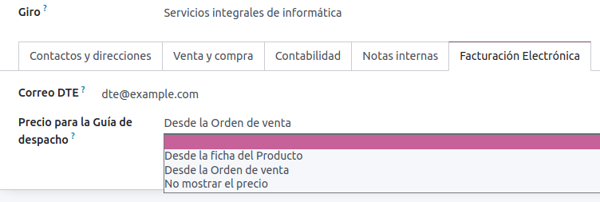

Document types
==============

Accounting documents are categorized by :abbr:`SII (Servicio de Impuestos Internos)`-defined
document types.

Document types are created automatically upon installation of the localization module, and can be
managed by navigating to :menuselection:`Accounting --> Configuration --> Document Types`.

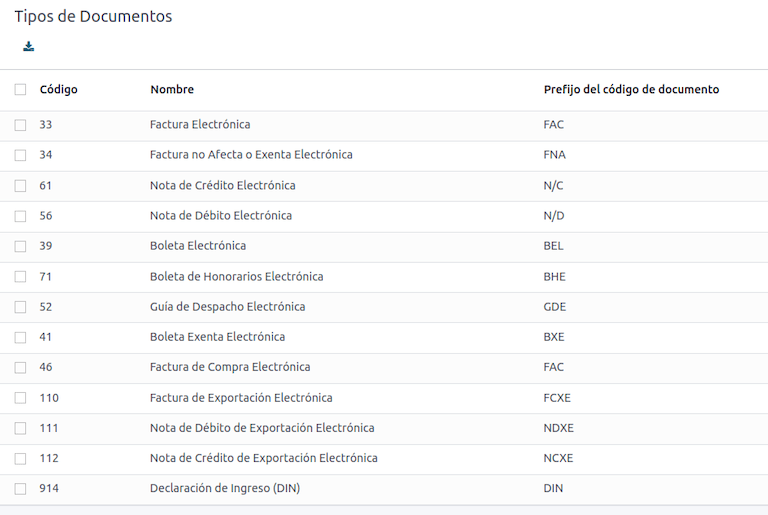

.. note::
   Several document types are inactive by default but can be activated by toggling the
   :guilabel:`Active` option.

Use on invoices
---------------

The document type on each transaction is determined by:

- The journal related to the invoice, identifying if the journal uses documents.
- The condition applied based on the type of issuer and recipient (e.g., the buyer or vendor's
  fiscal regime).

Journals
========

*Sales journals* in Odoo usually represent a business unit or location.

.. example::
   - Ventas Santiago.
   - Ventas Valparaiso.

For retail stores it is common to have one journal per :abbr:`POS (Point of Sale)`.

.. example::
   - Cashier 1.
   - Cashier 2.

The *purchase* transactions can be managed with a single journal, but sometimes companies use more
than one journal in order to handle some accounting transactions that are not related to vendor
bills. This configuration can easily be set by using the following model.

.. example::
   - Tax payments to the government.
   - Employees payments.

Create a sales journal
----------------------

To create a sales journal, navigate to :menuselection:`Accounting --> Configuration --> Journals`.
Then, click the :guilabel:`New` button, and fill in the following required information:

- :guilabel:`Type`: select :guilabel:`Sale` from the drop-down menu for customer invoice journals.
- :guilabel:`Point of sale type`: if the sales journal will be used for electronic documents, the
  option :guilabel:`Online` must be selected. Otherwise, if the journal is used for invoices
  imported from a previous system or if you are using the :abbr:`SII (Servicio de Impuestos
  Internos)` portal *Facturación MiPyme*, you can use the option :guilabel:`Manual`.
- :guilabel:`Use Documents`: check this field if the journal will use document types. This field is
  only applicable to purchase and sales journals that can be related to the different sets of
  document types available in Chile. By default, all the sales journals created will use documents.

Next, from the :guilabel:`Jounal Entries` tab, define the :guilabel:`Default Income Account` and
:guilabel:`Dedicated Credit Note Squence` in the :guilabel:`Accounting Information` section.
Configuring these fields is required for one of the debit notes :ref:`use cases <chile/use-cases>`.

.. _chile/caf-documentation:

CAF
===

A *folio authorization code* (CAF) is required for each document type that will be issued
electronically. The :abbr:`CAF (Folio Authorization Code)` is a file the :abbr:`SII (Servicio de
Impuestos Internos)` provides to the issuer with the folios/sequences authorized for the electronic
invoice documents.

Your company can request multiple folios and obtain several :abbr:`CAFs (Folio Authorization Codes)`
linked to different folio ranges. These :abbr:`CAFs (Folio Authorization Code)` are shared within
all journals, so you only need one active :abbr:`CAF (Folio Authorization Code)` per document type,
and it will be applied to all journals.

Please refer to the `SII documentation <https://palena.sii.cl/dte/mn_timbraje.html>`_ to check the
details on how to acquire the :abbr:`CAF (Folio Authorization Code)` files.

.. important::
   The :abbr:`CAFs (Folio Authorization Code)` required by the :abbr:`SII (Servicio de Impuestos
   Internos)` are different from production to test (certification mode). Make sure you have the
   correct :abbr:`CAF (Folio Authorization Code)` set depending on your environment.

Upload CAF files
----------------

Once the :abbr:`CAF (Folio Authorization Code)` files have been acquired from the :abbr:`SII
(Servicio de Impuestos Internos)` portal, they need to be uploaded in the database by navigating to
:menuselection:`Accounting --> Configuration: Chilean SII --> CAFs`. Then, click the :guilabel:`New`
begin the configuration. On the :abbr:`CAF (Folio Authorization Code)` form, upload your :abbr:`CAF
(Folio Authorization Code)` file by clicking the :guilabel:`Upload your file` button and then click
:guilabel:`Save`.

Once uploaded, the status changes to :guilabel:`In Use`. At this moment, when a transaction is used
for this document type, the invoice number takes the first folio in the sequence.

.. important::
   The document types have to be active before uploading the :abbr:`CAF (Folio Authorization Code)`
   files. In case some folios have been used in the previous system, the next valid folio has to be
   set when the first transaction is created.

Chart of accounts
=================

The chart of accounts is installed by default as part of the data set included in the localization
module. The accounts are mapped automatically in:

- Taxes
- Default Account Payable
- Default Account Receivable
- Transfer Accounts
- Conversion Rate

.. seealso::
   :doc:`../accounting/get_started/chart_of_accounts`

Taxes
=====

As part of the localization module, taxes are created automatically with their related financial
account and configuration. These taxes can be managed from :menuselection:`Accounting -->
Configuration --> Taxes`.

Chile has several tax types, the most common ones are:

- **VAT**: the regular VAT can have several rates.
- **ILA**: the tax for alcoholic drinks.

.. seealso::
   :doc:`../accounting/taxes`

Usage and testing
=================

Electronic invoice workflow
---------------------------

In the Chilean localization, the electronic invoice workflow includes customer invoice issuance and
vendor bill reception. The following diagram explains how information is shared to the :abbr:`SII
(Servicio de Impuestos Internos)`, customers, and vendors.

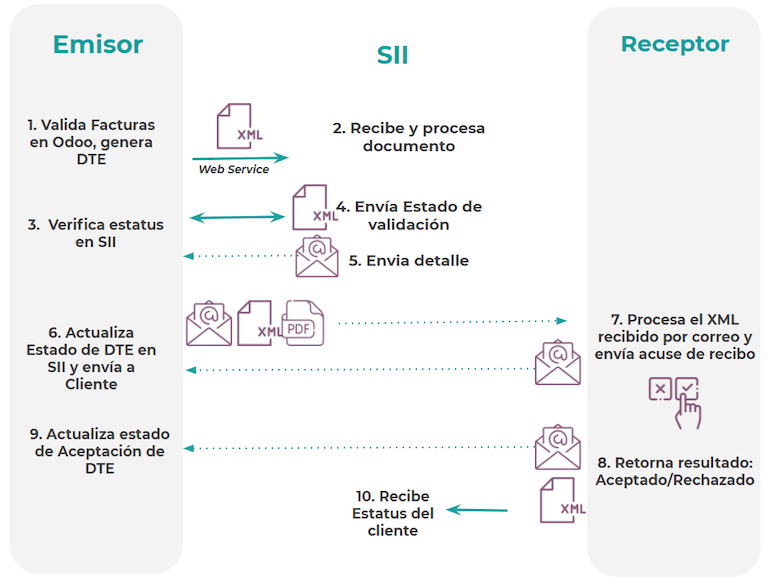

Customer invoice emission
-------------------------

After the partners and journals are created and configured, the invoices are created in the standard
way. For Chile, one of the differences is the document type that is automatically selected based on
the taxpayer. The document type can be changed manually if needed on the invoice by navigating to
:menuselection:`Accounting --> Customers --> Invoices`.

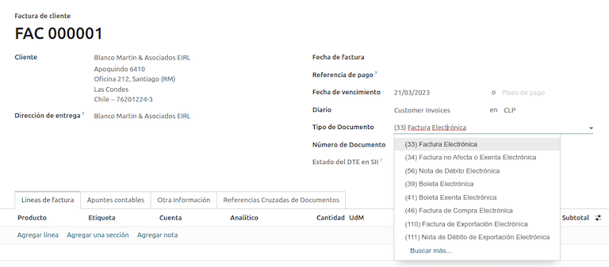

.. important::
   :guilabel:`Documents type 33` electronic invoice must have at least one item with tax, otherwise
   the :abbr:`SII (Servicio de Impuestos Internos)` rejects the document validation.

.. _chile/electronic-invoice-validation:

Validation and DTE status
~~~~~~~~~~~~~~~~~~~~~~~~~

Once all invoice information is filled, either manually or automatically when generated from a sales
order, validate the invoice. After the invoice is posted:

- The :abbr:`DTE (Documentos Tributarios Electrónicos)` file is created automatically and recorded
  in the chatter.
- The :abbr:`DTE (Documentos Tributarios Electrónicos)` :abbr:`SII (Servicio de Impuestos Internos)`
  status is set as :guilabel:`Pending` to be sent.

  .. image:: chile/xml-creation.png
     :alt: DTE XML File displayed in chatter.
     :align: center

The :abbr:`DTE (Documentos Tributarios Electrónicos)` status is updated automatically by Odoo with a
scheduled action that runs every day at night, if the response from the :abbr:`SII (Servicio de
Impuestos Internos)` is needed immediately, you can do it manually as well by following the
:abbr:`DTE (Documentos Tributarios Electrónicos)` status workflow:

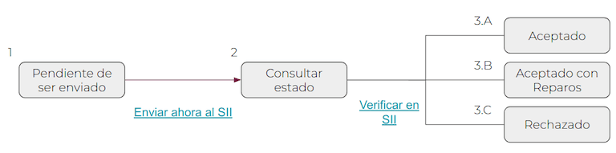

#. The first step is to send the :abbr:`DTE (Documentos Tributarios Electrónicos)` to the :abbr:`SII
   (Servicio de Impuestos Internos)`. This can be sent manually by clicking the :guilabel:`Enviar
   Ahora` button. This generates a :guilabel:`SII Tack number` for the invoice, which is used to
   check the details sent by the :abbr:`SII (Servicio de Impuestos Internos)` via email. Then, the
   :guilabel:`DTE status` is updated to :guilabel:`Ask for Status`.
#. Once the :abbr:`SII (Servicio de Impuestos Internos)` response is received, Odoo updates the
   :guilabel:`DTE status`. To do it manually, click on the button :guilabel:`Verify on SII`. The
   result can either be :guilabel:`Accepted`, :guilabel:`Accepted With Objection` or
   :guilabel:`Rejected`.

   .. image:: chile/dte-status-steps.png
      :alt: Identification transaction for invoice and Status update.
      :align: center

   .. important::
      There are intermediate statuses in the :abbr:`SII (Serviciqo de Impuestos Internos)` before
      acceptance or rejection. It's recommended to **NOT** continuously click :guilabel:`Verify in
      SII` for smooth processing.

      .. image:: chile/chatter-internal-statuses.png
         :alt: Electronic invoice data statuses.
         :align: center

#. The final response from the :abbr:`SII (Servicio de Impuestos Internos)` can take on one of these
   values:

   - :guilabel:`Accepted`: indicates the invoice information is correct, our document is now
     fiscally valid and it's automatically sent to the customer.
   - :guilabel:`Accepted with objections`: indicates the invoice information is correct, but a minor
     issue was identified, nevertheless the document is now fiscally valid and it's automatically
     sent to the customer.
   - :guilabel:`Rejected`: indicates the invoice information is incorrect and must be corrected.
     Details are sent to emails you registered in the :abbr:`SII (Servicio de Impuestos Internos)`.
     If it is properly configured in Odoo, the details are also retrieved in the chatter once the
     email server is processed.

     If the invoice is rejected please follow these steps:

     #. Change the document to :guilabel:`Draft`.
     #. Make the required corrections based on the message received from the :abbr:`SII (Servicio
        de Impuestos Internos)` in the chatter.
     #. Post the invoice again.

     .. image:: chile/rejected-invoice.png
        :alt: Message when an invoice is rejected.
        :align: center

Crossed references
~~~~~~~~~~~~~~~~~~

When the invoice is created, as a result of another fiscal document, the information related to the
originator document must be registered in the :guilabel:`Cross-Reference` tab. This tab is commonly
used for credit or debit notes, however, in some cases it can be used for customer invoices, as
well. In the case of the credit and debit notes, they are set automatically by Odoo.

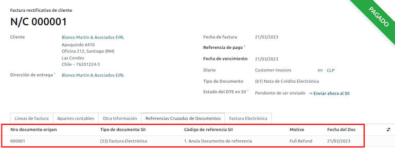

.. _chile/electronic-invoice-pdf-report:

Invoice PDF report
~~~~~~~~~~~~~~~~~~

Once the invoice is accepted and validated by the :abbr:`SII (Servicio de Impuestos Internos)` and
the PDF is printed, it includes the fiscal elements that indicate that the document is fiscally
valid.

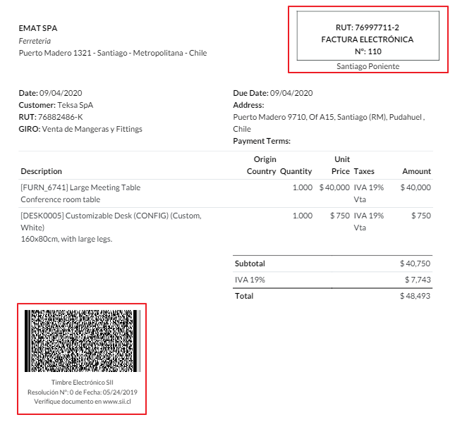

.. important::
   If you are hosted in Odoo SH or On-Premise, you should manually install the `pdf417gen
   <https://pypi.org/project/pdf417gen/>`_ library. Use the following command to install it:
   :command:`pip install pdf417gen`.

Commercial validation
~~~~~~~~~~~~~~~~~~~~~

Once the invoice has been sent to the customer:

#. :guilabel:`DTE Partner Status` changes to :guilabel:`Sent`.
#. The customer must send a reception confirmation email.
#. Subsequently, if commercial terms and invoice data are correct, an acceptance confirmation is
   sent; otherwise, a claim is sent.
#. The field :guilabel:`DTE Acceptance Status` is updated automatically.

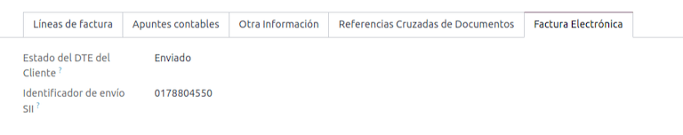

Processed for claimed invoices
~~~~~~~~~~~~~~~~~~~~~~~~~~~~~~

Once the invoice has been accepted by the :abbr:`SII (Servicio de Impuestos Internos)`, **it can not
be cancelled in Odoo**. In case you get a claim for your customer, the correct way to proceed is
with a credit note to either cancel the invoice or correct it. Please refer to the
:ref:`chile/credit-notes` section for more details.

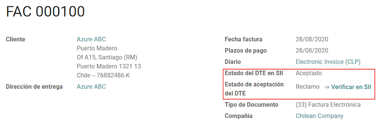

Common errors
~~~~~~~~~~~~~

There are multiple reasons behind a rejection from the :abbr:`SII (Servicio de Impuestos Internos)`,
but these are some of the common errors you might have and how to solve them:

- | **Error:** `RECHAZO- DTE Sin Comuna Origen`
  | **Hint:** make sure the company address is properly filled including the state and city.
- | **Error:** `en Monto - IVA debe declararse`
  | **Hint:** the invoice lines should include one VAT tax, make sure you add one on each invoice
    line.
- | **Error:** `Rut No Autorizado a Firmar`
  | **Hint:** the :abbr:`RUT (Rol Único Tributario)` entered is not allowed to invoice
    electronically, make sure the company :abbr:`RUT (Rol Único Tributario)` is correct and is valid
    in the :abbr:`SII (Servicio de Impuestos Internos)` to invoice electronically.
- | **Error:** `Fecha/Número Resolucion Invalido RECHAZO- CAF Vencido : (Firma_DTE[AAAA-MM-DD] -
    CAF[AAAA-MM-DD]) &gt; 6 meses`
  | **Hint:** try to add a new CAF related to this document as the one you're using is expired.
- | **Error:** `Element '{http://www.sii.cl/SiiDte%7DRutReceptor': This element is not expected.
    Expected is ( {http://www.sii.cl/SiiDte%7DRutEnvia ).`
  | **Hint:** Make sure the field :guilabel:`Document Type` and :guilabel:`VAT` are set in the
    customer and in the main company.
- | **Error:** `Usuario sin permiso de envio.`
  | **Hint:** this error indicates that most likely, your company has not passed the `Certification
    process <https://www.sii.cl/factura_electronica/factura_mercado/proceso_certificacion.htm>`_ in
    the :abbr:`SII (Servicio de Impuestos Internos)` - Sistema de Facturación de Mercado. If this is
    the case, please contact your Account Manager or Customer Support as this certification is not
    part of the Odoo services, but we can give you some alternatives. If you already passed the
    certification process, this error appears when a user different from the owner of the
    certificate is trying to send :abbr:`DTE (Documentos Tributarios Electrónicos)` files to the
    :abbr:`SII (Servicio de Impuestos Internos)`.
- | **Error:** `CARATULA`
  | **Hint:** there are just five reasons why this error could show up and all of them are related
    to the *Caratula* section of the XML:

    - The company's :abbr:`RUT (Rol Único Tributario)` number is incorrect or missing.
    - The certificate owner :abbr:`RUT (Rol Único Tributario)` number is incorrect or missing.
    - The :abbr:`SII's (Servicio de Impuestos Internos)` :abbr:`RUT (Rol Único Tributario)` number
      (this should be correct by default) is incorrect or missing.
    - The resolution date is incorrect or missing.
    - The resolution number is incorrect or missing.

.. _chile/credit-notes:

Credit notes
------------

When a cancellation or correction is needed over a validated invoice, a credit note must be
generated. It is important to consider that a :abbr:`CAF (Folio Authorization Code)` file is
required for the credit note, which is identified as :guilabel:`Document Type` :guilabel:`61` in the
:abbr:`SII (Servicio de Impuestos Internos)`. Please refer to the :ref:`CAF section
<chile/caf-documentation>` for more information on the process to load the :abbr:`CAF (Folio
Authorization Code)` on each document type.

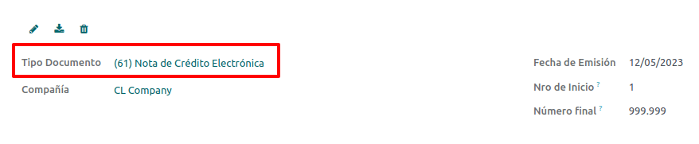

Use cases
~~~~~~~~~

Cancel referenced document
**************************

In case you need to cancel or invalidate an invoice, navigate to :menuselection:`Accounting -->
Customers --> Invoices` and select the desired invoice. Then, use the button :guilabel:`Add Credit
Note` and select :guilabel:`Full Refund`, in this case the :abbr:`SII (Servicio de Impuestos
Internos)` reference code is automatically set to :guilabel:`Anula Documento de referencia`.

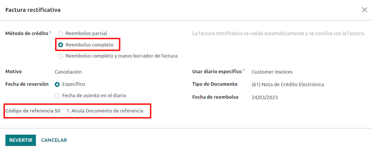

Correct referenced document
***************************

If a correction in the invoice information is required, for example the street name on the original
invoice is wrong, then use the button :guilabel:`Add Credit Note`, select :guilabel:`Partial Refund`
and select the option :guilabel:`Only Text Correction`. In this case the :guilabel:`SII Reference
Code` field is automatically set to :guilabel:`Corrects Referenced Document Text`.

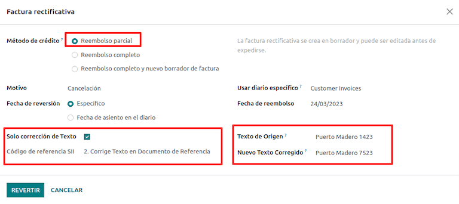

Odoo creates a credit note with the corrected text in an invoice and :guilabel:`Price` `0.00`.

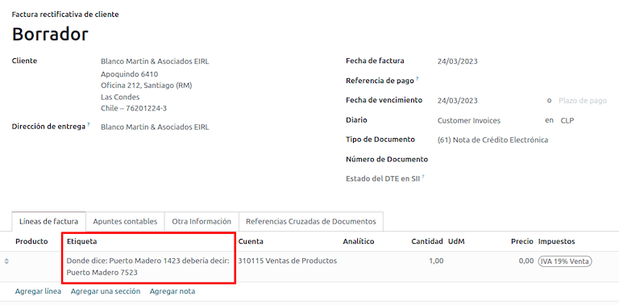

.. important::
   Make sure to define the :guilabel:`Default Credit Account` in the sales journal specifically for
   this use case.

Corrects referenced document amount
***********************************

When a correction on the amounts is required, use the button :guilabel:`Add Credit note` and select
:guilabel:`Partial Refund`. In this case the :guilabel:`SII Reference Code` is automatically set to
:guilabel:`Corrige el monto del Documento de Referencia`.

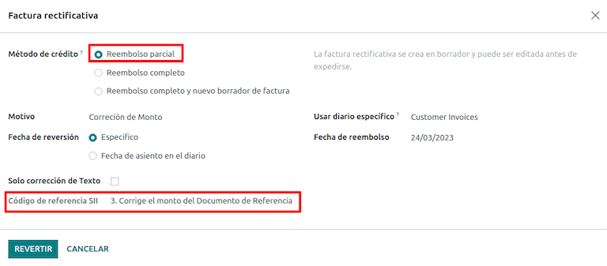

Debit notes
-----------

In Chilean localization, debit notes, in addition to credit notes, can be created using the
:guilabel:`Add Debit Note` button, with two main use cases.

.. _chile/use-cases:

Use cases
~~~~~~~~~

Add debt on invoices
********************

The primary use case for debit notes is to increase the value of an existing invoice. To do so,
select option :guilabel:`3. Corrige el monto del Documento de Referencia` for the
:guilabel:`Reference Code SII` field.

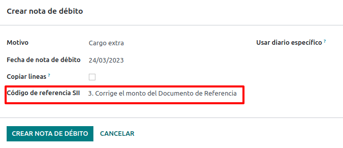

In this case Odoo automatically includes the :guilabel:`Source Invoice` in the :guilabel:`Cross
Reference` tab.

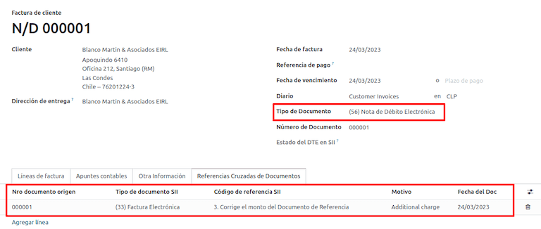

.. tip::
   You can only add debit notes to an invoice already accepted by the SII.

Cancel credit notes
*******************

In Chile, debits notes are used to cancel a valid credit note. To do this, click the :guilabel:`Add
Debit Note` button and select the :guilabel:`1: Anula Documentos de referencia` option for the
:guilabel:`Reference Code SII` field.

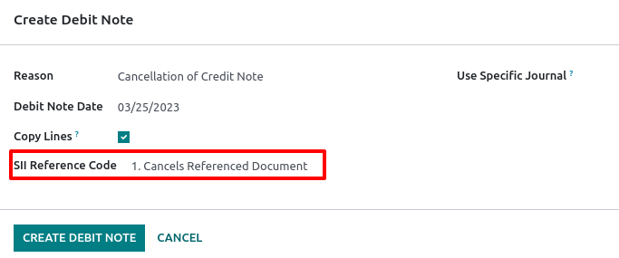

Vendor bills
------------

As part of the Chilean localization, you can configure your incoming email server to match the one
you have registered in the :abbr:`SII (Servicio de Impuestos Internos)` in order to:

- Automatically receive the vendor bills :abbr:`DTE (Documentos Tributarios Electrónicos)` and
  create the vendor bill based on this information.
- Automatically send the reception acknowledgement to your vendor.
- Accept or claim the document and send this status to your vendor.

Reception
~~~~~~~~~

As soon as the vendor email with the attached :abbr:`DTE (Documentos Tributarios Electrónicos)` is
received:

#. The vendor bill maps all the information included in the XML.
#. An email is sent to the vendor with the reception acknowledgement.
#. The :guilabel:`DTE Status` is set as :guilabel:`Acuse de Recibido Enviado`.

Acceptation
~~~~~~~~~~~

If all the commercial information is correct on your vendor bill, then you can accept the document
using the :guilabel:`Aceptar Documento` button. Once this is done, the :guilabel:`DTE Acceptation
Status` changes to :guilabel:`Accepted` and an email of acceptance is sent to the vendor.

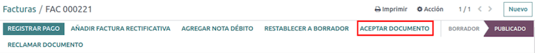

Claim
~~~~~

In case there is a commercial issue or the information is not correct on your vendor bill, you can
claim the document before validating it, using the :guilabel:`Claim` button. Once this is done, the
:guilabel:`DTE Acceptation Status` changes to :guilabel:`Claim` and a rejection email is sent to the
vendor.

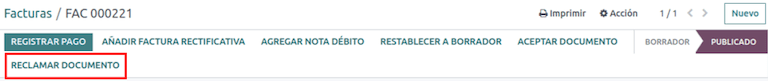
         rejected.
   :align: center

If you claim a vendor bill, the status changes from :guilabel:`Draft` to :guilabel:`Cancel`
automatically. Considering this as best practice, all the claimed documents should be canceled as
they won't be valid for your accounting records.

Delivery guide
--------------

To install the :guilabel:`Delivery Guide` module, go to :menuselection:`Apps` and search for `Chile
(l10n_cl)`. Then click :guilabel:`Install` on the module :guilabel:`Chile - E-Invoicing Delivery
Guide`.

.. note::
   :guilabel:`Chile - E-Invoicing Delivery Guide` has a dependency with :guilabel:`Chile -
   Facturación Electrónica`. Odoo will install the dependency automatically when the
   :guilabel:`Delivery Guide` module is installed.

The *Delivery Guide* module includes the ability to send the :abbr:`DTE (Documentos Tributarios
Electrónicos)` to :abbr:`SII (Servicio de Impuestos Internos)` and the stamp in PDF reports for
deliveries.

Once all configurations have been made for :ref:`electronic invoices <chile/electronic-invoice>`
(e.g., uploading a valid company certificate, setting up master data, etc.), delivery guides need
their own :abbr:`CAFs (Folio Authorization Code)`. Please refer to the :ref:`CAF documentation
<chile/caf-documentation>` to check the details on how to acquire the :abbr:`CAF (Folio
Authorization Code)` for electronic Delivery Guides.

Verify the following important information in the :guilabel:`Price for the Delivery Guide`
configuration:

- :guilabel:`From Sales Order`: delivery guide takes the product price from the sales order and
  shows it on the document.
- :guilabel:`From Product Template`: Odoo takes the price configured in the product template and
  shows it on the document.
- :guilabel:`No show price`: no price is shown in the delivery guide.

Electronic delivery guides are used to move stock from one place to another and they can represent
sales, sampling, consignment, internal transfers, and basically any product move.

Delivery guide from a sales process
~~~~~~~~~~~~~~~~~~~~~~~~~~~~~~~~~~~

.. warning::
   A delivery guide should **not** be longer than one page or contain more than 60 product lines.

When a sales order is created and confirmed, a delivery order is generated. After validating the
delivery order, the option to create a delivery guide is activated.

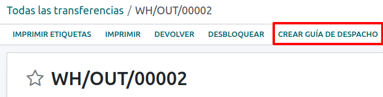

.. warning::
   When clicking on :guilabel:`Create Delivery Guide` for the first time, a warning message pops up,
   stating the following:

   `No se encontró una secuencia para la guía de despacho. Por favor, establezca el primer número
   dentro del campo número para la guía de despacho`

   .. image:: chile/delivery-guide-number-warning.png
      :alt: First Delivery Guide number warning message.
      :align: center

This warning message means the user needs to indicate the next sequence number Odoo has to take to
generate the delivery guide (e.g. next available :abbr:`CAF (Folio Authorization Code)` number), and
only happens the first time a delivery guide is created in Odoo. After the first document has been
correctly generated, Odoo takes the next available number in the :abbr:`CAF (Folio Authorization
Code)` file to generate the following delivery guide.

After the delivery guide is created:

- The :abbr:`DTE (Documentos Tributarios Electrónicos)` file (Electronic Tax Document) is
  automatically created and added to the :guilabel:`chatter`.
- The :guilabel:`DTE SII Status` is set as :guilabel:`Pending to be sent`.

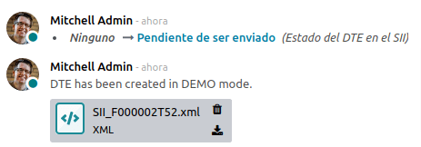

The :guilabel:`DTE Status` is automatically updated by Odoo with a scheduled action that runs every
night. To get a response from the :abbr:`SII (Servicio de Impuestos Internos)` immediately, press
the :guilabel:`Send now to SII` button.

Once the delivery guide is sent, it may then be printed by clicking on the :guilabel:`Print Delivery
Guide` button.

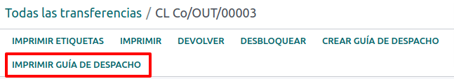

Delivery guide will have fiscal elements that indicate that the document is fiscally valid when
printed (if hosted in *Odoo SH* or on *On-premise* remember to manually add the
:guilabel:`pdf417gen` library mentioned in the :ref:`Invoice PDF report section
<chile/electronic-invoice-pdf-report>`).

Electronic receipt
------------------

To install the :guilabel:`Electronic Receipt` module, go to :menuselection:`Apps` and search for
`Chile (l10n_cl)`. Then click :guilabel:`Install` on the module :guilabel:`Chile - Electronic
Receipt`.

.. note::
   :guilabel:`Chile - Electronic Receipt` has a dependency with :guilabel:`Chile - Facturación
   Electrónica`. Odoo will install the dependency automatically when the :guilabel:`E-invoicing
   Delivery Guide` module is installed.

Once all configurations have been made for :ref:`electronic invoices <chile/electronic-invoice>`
(e.g., uploading a valid company certificate, setting up master data, etc.), electronic receipts
need their own :abbr:`CAFs (Folio Authorization Code)`. Please refer to the :ref:`CAF documentation
<chile/caf-documentation>` to check the details on how to acquire the :abbr:`CAFs (Folio
Authorization Code)` for electronic receipts.

Electronic receipts are useful when clients do not need an electronic invoice. By default, there is
a partner in the database called :guilabel:`Anonymous Final Consumer` with a generic :abbr:`RUT (Rol
Único Tributario)` `66666666-6` and taxpayer type of :guilabel:`Final Consumer`. This partner can be
used for electronic receipts or a new record may be created for the same purpose.

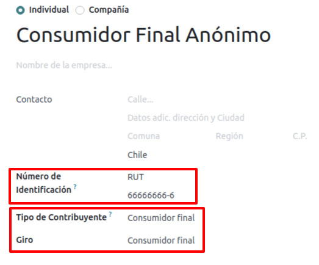

Although electronic receipts should be used for final consumers with a generic :abbr:`RUT (Rol Único
Tributario)`, it can also be used for specific partners. After the partners and journals are created
and configured, the electronic receipts are created in the standard way as electronic invoice, but
the type of document :guilabel:`(39) Electronic Receipt` should be selected in the invoice form:

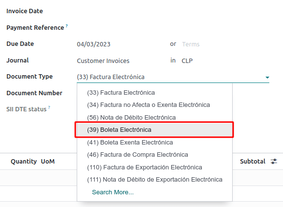

Validation and DTE status
~~~~~~~~~~~~~~~~~~~~~~~~~

When all of the electronic receipt information is filled, manually (or automatically) proceed to
validate the receipt from the sales order. By default, :guilabel:`Electronic Invoice` is selected as
the :guilabel:`Document Type`, however in order to validate the receipt correctly, make sure to edit
the :guilabel:`Document Type` and change to :guilabel:`Electronic Receipt`.

After the receipt is posted:

- The :abbr:`DTE (Documentos Tributarios Electrónicos)` file (Electronic Tax Document) is created
  automatically and added to the :guilabel:`chatter`.
- The :guilabel:`DTE SII Status` is set as :guilabel:`Pending to be sent`.

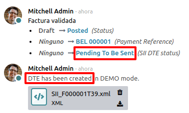

The :guilabel:`DTE Status` is automatically updated by Odoo with a scheduled action that runs every
day at night. To get a response from the :abbr:`SII (Servicio de Impuestos Internos)` immediately,
press the :guilabel:`Send now to SII` button.

Please refer to the :ref:`DTE Workflow <chile/electronic-invoice-validation>` for electronic
invoices as the workflow for electronic receipt follows the same process.

Electronic export of goods
--------------------------

To install the :guilabel:`Electronic Exports of Goods` module, go to :menuselection:`Apps` and
search for `Chile (l10n_cl)`. Then click :guilabel:`Install` on the module :guilabel:`Electronic
Exports of Goods for Chile`.

.. note::
   :guilabel:`Chile - Electronic Exports of Goods for Chile` has a dependency with :guilabel:`Chile
   - Facturación Electrónica`.

Once all configurations have been made for :ref:`electronic invoices <chile/electronic-invoice>`
(e.g., uploading a valid company certificate, setting up master data, etc.), electronic exports of
goods need their own :abbr:`CAFs (Folio Authorization Code)`. Please refer to the :ref:`CAF
documentation <chile/caf-documentation>` to check the details on how to acquire the :abbr:`CAFs
(Folio Authorization Code)` for electronic receipts.

Electronic invoices for the export of goods are tax documents that are used not only for the
:abbr:`SII (Servicio de Impuestos Internos)` but are also used with customs and contain the
information required by it.

Contact configurations
~~~~~~~~~~~~~~~~~~~~~~

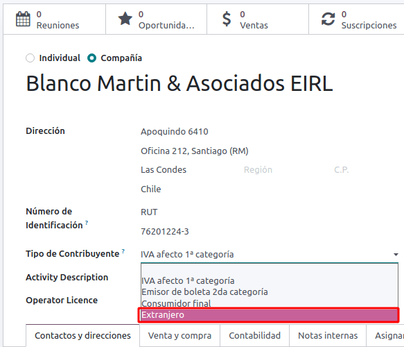

Chilean customs
~~~~~~~~~~~~~~~

When creating an electronic exports of goods invoice, these new fields in the :guilabel:`Other Info`
tab are required to comply with Chilean regulations.

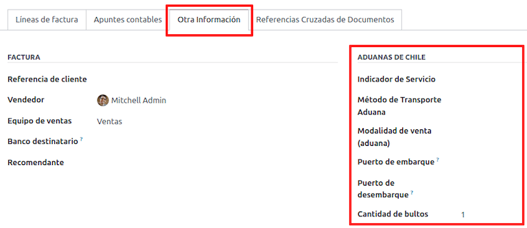

PDF report
~~~~~~~~~~

Once the invoice is accepted and validated by the :abbr:`SII (Servicio de Impuestos Internos)` and
the PDF is printed, it includes the fiscal elements that indicate that the document is fiscally
valid and a new section needed for customs.

.. image:: chile/pdf-report-section.png
   :alt: PDF report section for the Electronic Exports of Goods PDF Report.
   :align: center

eCommerce electronic invoicing
------------------------------

To install the :guilabel:`Chilean eCommerce` module, go to :menuselection:`Apps, search for the
module by its technical name `l10n_cl_edi_website_sale`, and click the :guilabel:`Activate` button.

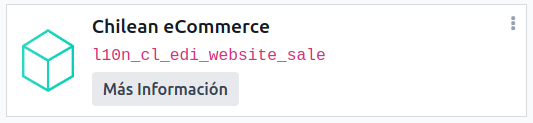

This module enables the features and configurations to:

- Generate electronic documents from the *eCommerce* application
- Support for required fiscal fields in the *eCommerce* application
- Effectively let the final client decide the electronic document to be generated for their
  purchase

Once all of the configurations are made for the Chilean :ref:`electronic invoice
<chile/electronic-invoice>` flow, the following configurations are required for the eCommerce flow
to be integrated.

To configure your website to generate electronic documents during the sale process, go to
:menuselection:`Website --> Configuration --> Settings --> Invoicing` and activate the
:guilabel:`Automatic Invoice` feature. Activating this feature allows electronic documents to be
automatically generated when an online payment is confirmed.

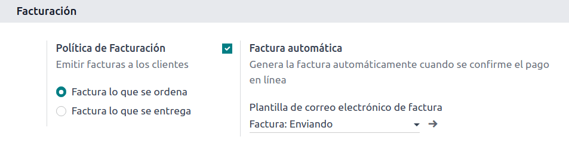

Since an online payment needs to be confirmed for the *automatic invoice* feature to generate the
document, a payment provider must be configured for the related website.

.. note::
   Review the :doc:`../payment_providers` documentation for information on which payment providers
   are supported in Odoo, and how to configure them.

It is also recommended to configure your products so they are able to be invoiced when an online
payment is confirmed. To do so, go to :menuselection:`Website --> eCommerce --> Products` and select
the product template of the desired product. Then, set the :guilabel:`Invoicing Policy` to
:guilabel:`Ordered quantities`.

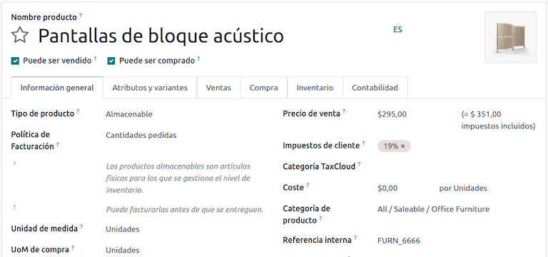

Invoicing flows
~~~~~~~~~~~~~~~

Clients from Chile will be able to select if they need an **invoice** or a **ballot** for their
purchase with an extra step added during the checkout process.

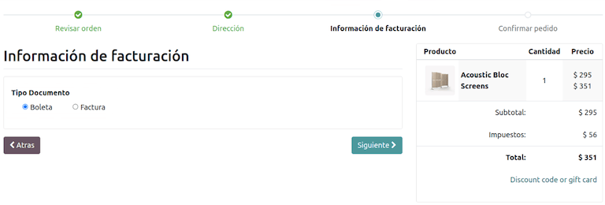

If the customer selects the :guilabel:`Electronic Invoice` option, fiscal fields are required to be
filled out, including the :guilabel:`Activity Description`, the :guilabel:`Identification Number`
and their :guilabel:`DTE Email`.

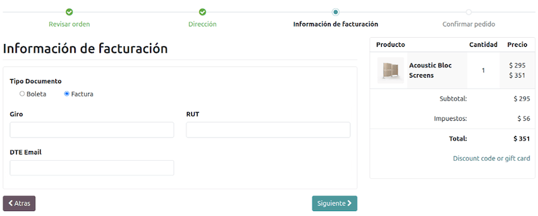

If the client selects the :guilabel:`Electronic Receipts` option, they will be directed to the next
step, and the electronic document will be generated for the *Consumidor Final Anónimo* contact.

Clients from countries other than Chile, will have their electronic receipts automatically generated
for them by Odoo.

.. note::
   If a purchase through eCommerce requires an export, the customer will need to contact your
   company to generate an electronic export invoice (*document type 110*), which can be done from
   the *Accounting* app.

Point of Sale electronic invoicing
----------------------------------

To install the :guilabel:`Chilean Module for Point of Sale`, go to the :menuselection:`Apps`
application on the main Odoo dashboard, search for the module by its technical name
`l10n_cl_edi_pos`, and click the :guilabel:`Activate` button.

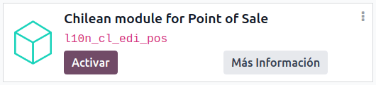

This module enables the following features and configurations to:

- Generate electronic documents from the *Point of Sale* application
- Support the required fiscal fields for contacts created in the *Point of Sale* application
- Effectively lets the final client decide the type of electronic document to be generated for their
  purchase
- Print QR or 5-digit codes in tickets to access to electronic invoices

To configure contacts with the required fiscal information, review the :ref:`partner information
<chile/partner-information>` section, or directly modify a contact. Navigate to
:menuselection:`Point of Sale --> Session --> Customers --> Details`, and edit any of the following
fields:

- :guilabel:`Name`
- :guilabel:`Email`
- :guilabel:`Identification Type`
- :guilabel:`Tax Payer Type`
- :guilabel:`Type Giro`
- :guilabel:`DTE Email`
- :guilabel:`RUT`

.. image:: chile/fiscal-required-pos-session.png
   :align: center
   :alt: Contact with fiscal information created from POS.

To configure the products, navigate to :menuselection:`Point of Sale --> Products --> Products` and
select a product record. In the :guilabel:`Sales` tab of the product form, it is necessary to mark
the product as :guilabel:`Available for POS`, this makes the product available for sale in the
*Point of Sale* app.

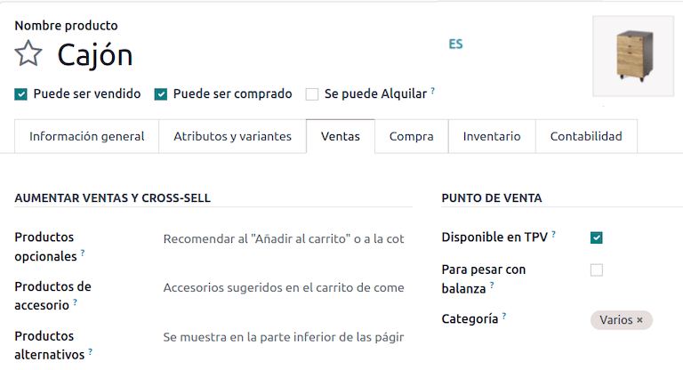

Optionally, the following features are available for configuration in the :menuselection:`Point of
Sale --> Configuration --> Settings --> Bills & Receipts section`:

- :guilabel:`Use QR code on ticket`: this feature enables a QR code to be printed on the user's
  receipt so they can easily request an invoice after their purchase
- :guilabel:`Generate a code on ticket`: this feature enables a 5-digit code to be generated on the
  receipt, allowing the user to request an invoice through the customer portal

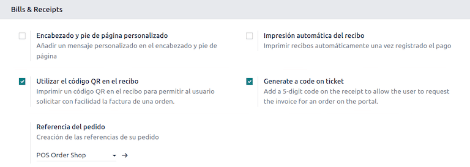

Invoicing flows
~~~~~~~~~~~~~~~

The following sections cover the invoicing flows for the *Point of Sale* application.

Electronic receipts: anonymous end user
***************************************

When making a purchase as an anonymous user that does not request an electronic invoice, Odoo
automatically selects :guilabel:`Consumidor Final Anónimo` as the contact for the order and
generates the electronic receipt.

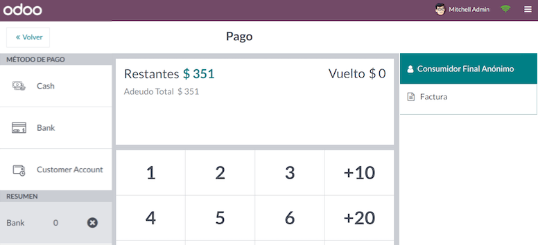

.. note::
   If the client requests a credit note due to a return of their purchase, the credit note should be
   made using the *Accounting* app. See the :doc:`credit notes and refunds
   <../accounting/customer_invoices/credit_notes>` documentation for detailed instructions.

Electronic receipts: specific customer
**************************************

When specific user makes a purchase that does not request an electronic invoice, Odoo automatically
selects the contact for the order as the :guilabel:`Consumidor Final Anónimo`, and allows you to
select or create the required customer contact with their fiscal information for the receipt.

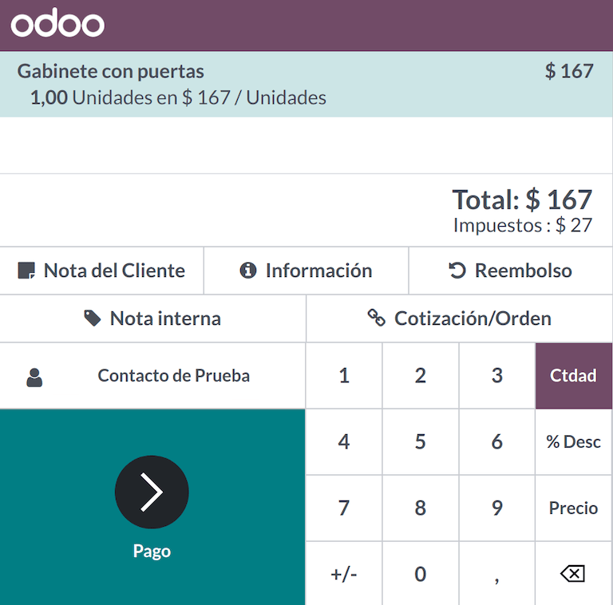

.. note::
   If the client requests a credit note because of a return of this type of purchase, the credit
   note and return process can be managed directly from the :abbr:`POS (Point of Sale)` session.

Electronic invoices
*******************

When clients request an electronic invoice, it is possible to select or create the required contact
with their fiscal information. When the payment is being made, select the option :guilabel:`Invoice`
to generate the document.

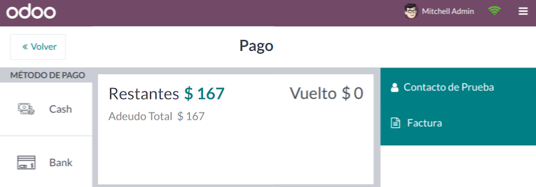

.. note::
   For both the electronic receipts and invoices, if the product is not affected by taxes, Odoo
   detects this and generates the correct type of document for tax-exempt sales.

Returns
*******

For electronic receipts (not generated for the *Consumidor Final Anónimo*) and electronic invoices,
it is possible to manage the process to return products sold in a :abbr:`POS (Point of Sale)` order
by selecting the :guilabel:`Refund` button.

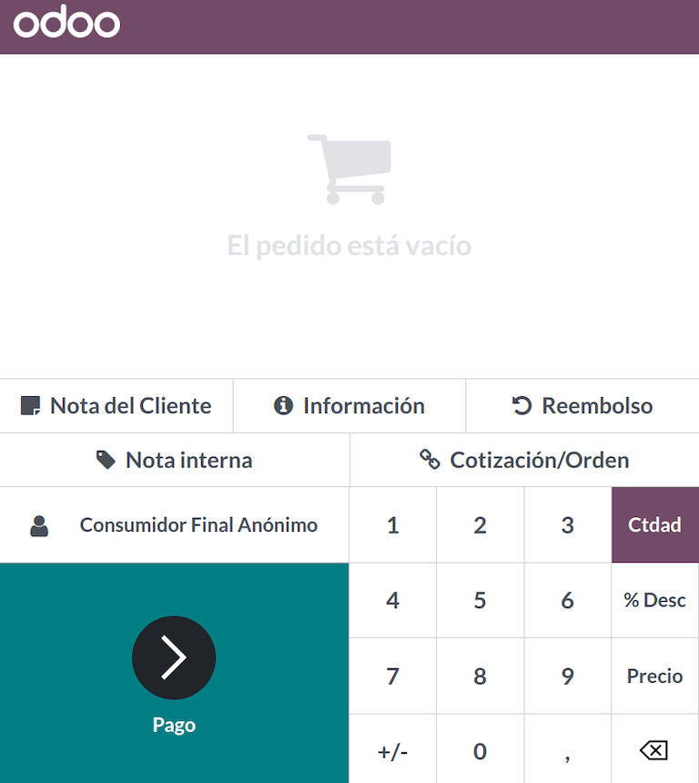

Orders can be searched by the order status or by contact, and be selected for the refund to be based
on the client's original order.

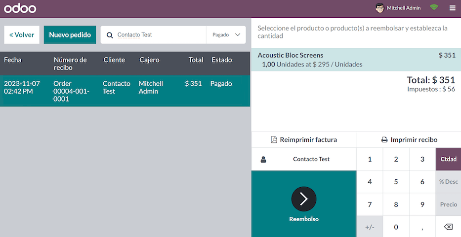

When the return payment is validated, Odoo generates the necessary credit note, referencing the
original receipt or invoice, partially or fully canceling the document.

.. seealso::
   `Smart tutorial - Electronic invoicing for point of sale
   <https://www.youtube.com/watch?v=B2XuWmtlmno&t=360s>`_.

Financial reports
=================

Balance tributario de 8 columnas
--------------------------------

This report presents the accounts in detail (with their respective balances), classifying them
according to their origin and determining the level of profit or loss that the business had within
the evaluated period of time.

You can find this report in :menuselection:`Accounting --> Reporting --> Balance Sheet` and
selecting in the :guilabel:`Report` field the option :guilabel:`Chilean Fiscal Balance (8 Columns)
(CL)`.

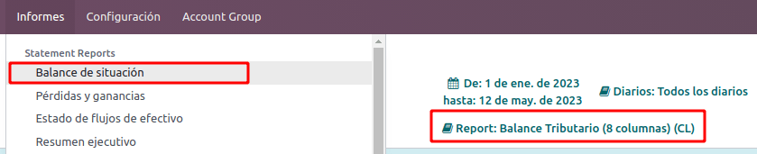

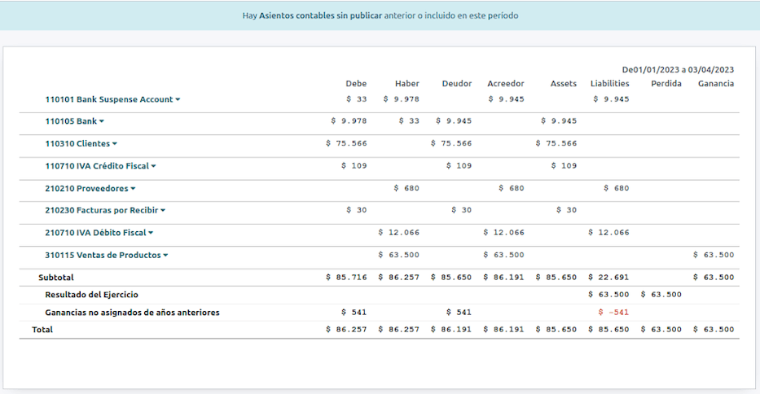

Propuesta F29
-------------

The form *F29* is a new system that the :abbr:`SII (Servicio de Impuestos Internos)` enabled to
taxpayers, and that replaces the *Purchase and Sales Books*. This report is integrated by Purchase
Register (CR) and the Sales Register (RV). Its purpose is to support the transactions related to
VAT, improving its control and declaration.

This record is supplied by the electronic tax documents (DTE's) that have been received by the
:abbr:`SII (Servicio de Impuestos Internos)`.

You can find this report in :menuselection:`Accounting --> Reporting --> Tax Reports` and selecting
the :guilabel:`Report` option :guilabel:`Propuesta F29 (CL)`.

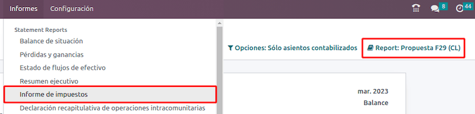

It is possible to set the :abbr:`PPM (Provisional Monthly Payments rate)` and the
:guilabel:`Proportional Factor for the fiscal year` from the :menuselection:`Accounting -->
Configuration --> Settings`.

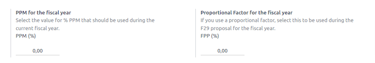

Or manually in the reports by clicking on the :guilabel:`✏️ (pencil)` icon.

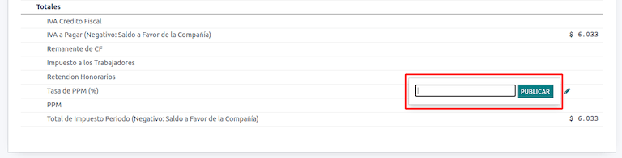
