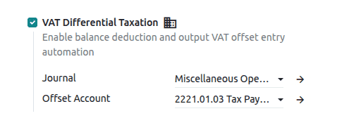

=====
China
=====

.. _china/configuration:

Configuration
=============

.. _china/configuration/modules:

Modules installation
--------------------

:ref:`Install <general/install>` the following modules to get all the features of the Chinese
localization:

.. list-table::
   :header-rows: 1

   * - Name
     - Technical name
     - Description
   * - :guilabel:`China - Accounting`
     - `l10n_cn`
     - This module includes two fiscal localization packages:
       :guilabel:`China - Accounting Standards for Business Enterprises` and
       :guilabel:`China - Accounting Standards for Small Business Enterprises`.
   * - :guilabel:`China - Accounting Reports`
     - `l10n_cn_reports`
     - This module includes the accounting reports for China.

.. _china/configuration/company:

Company information
-------------------

To configure company information, go to the :guilabel:`Contacts` app, search for the company, and
select the record. Then, configure the following fields:

- :guilabel:`Name`
- :guilabel:`Address`, including the :guilabel:`City`, :guilabel:`State`, :guilabel:`Zip Code`,
  and :guilabel:`Country`.

  - In the :guilabel:`Street` field, enter the street name, number, and any additional address
    information.

- :guilabel:`Tax ID`: Tax identification number (Unified social credit code)
- :guilabel:`Phone`
- :guilabel:`Email`

.. _china/chart_of_accounts:

Chart of accounts and financial statements
==========================================

Two independent charts of accounts are available, depending on the selected
:ref:`fiscal localization package <fiscal_localizations/packages>`:
:guilabel:`China - Accounting Standards for Business Enterprises` and
:guilabel:`China - Accounting Standards for Small Business Enterprises`.

To access the chart of accounts, go to
:menuselection:`Accounting --> Configuration --> Chart of Accounts`.

Each package also includes dedicated :guilabel:`Balance Sheet` and :guilabel:`Profit and Loss`
reports, based on the corresponding chart of accounts.

To access these reports, go to :menuselection:`Accounting --> Reporting` and select
:guilabel:`Balance Sheet` or :guilabel:`Profit and Loss`.

.. _china/taxes:

Taxes
=====

.. _china/taxes/value_added_tax:

Value-added tax (VAT)
---------------------

Both packages share the same pre-configured :doc:`taxes <../accounting/taxes>`. To view the taxes,
go to :menuselection:`Accounting --> Configuration --> Taxes`.

The taxes are designed to feed the :ref:`tax report <china/tax_report>`. Most taxes and tax grids
are assigned to a line of :guilabel:`Schedule 1 - Sales Details` or
:guilabel:`Schedule 2 - Input Tax Details`, so that amounts are classified and totaled
automatically. The tables below show the schedule line of each tax.

Each tax name follows a pattern that identifies the tax rate or treatment, the type of supply or
purchase, and the supporting document: a **fapiao**
(:dfn:`official invoice issued through the tax authority's system`) or a receipt. Understanding
this pattern simplifies the search for the right tax.

.. tip::
   To choose the right tax, first determine whether the transaction is a sale or a purchase. For a
   sale, identify the rate or treatment, the scope, and the fapiao type. For a purchase, identify
   the rate and the supporting document received.

.. _china/taxes/value_added_tax/output:

Output VAT (sales)
~~~~~~~~~~~~~~~~~~

Output VAT taxes are named **[Rate or treatment] [Scope] [Fapiao type]**, using the codes below.

.. list-table::
   :header-rows: 1
   :widths: 25 15 60

   * - Category
     - Code
     - Meaning
   * - Rate or treatment
     - :guilabel:`ECR`
     - Exemption, Credit and Refund
   * - Rate or treatment
     - :guilabel:`E`
     - Tax Exemption
   * - Rate or treatment
     - :guilabel:`ER`
     - Exemption and Refund
   * - Rate or treatment
     - :guilabel:`R`
     - 3% levy rate reduced to 2%, 1.5%, or 1%
   * - Scope
     - :guilabel:`G`
     - Goods and processing, repair and replacement services
   * - Scope
     - :guilabel:`S`
     - Service, immovable property and intangible asset
   * - Fapiao type
     - :guilabel:`S`
     - VAT Special Invoice
   * - Fapiao type
     - :guilabel:`O`
     - VAT Other Invoice
   * - Fapiao type
     - :guilabel:`N`
     - No Invoice

.. example::
   :guilabel:`13% G S` is the 13% VAT for goods and processing, repair and replacement services,
   issued with a VAT special invoice.

The tax rate and scope determine the line of :guilabel:`Schedule 1 - Sales Details`, while the
fapiao type determines the column:

- :guilabel:`S` (VAT Special Invoice): columns 1 and 2
- :guilabel:`O` (VAT Other Invoice): columns 3 and 4
- :guilabel:`N` (No Invoice): columns 5 and 6

The general tax calculation method applies tax rates to sales and allows the deduction of input
VAT. The simplified tax calculation method applies levy rates to sales and does not allow the
deduction of input VAT.

The following table shows the available combinations and the corresponding line of
:guilabel:`Schedule 1 - Sales Details`. Where a cell shows two values, the first applies to goods
and the second to services.

.. list-table::
   :header-rows: 1
   :widths: 14 13 19 12 14 14 14

   * - Tax rate or treatment
     - Method
     - Scope
     - Schedule 1 line
     - Special (S)
     - Other (O)
     - No Invoice (N)
   * - 13%
     - General
     - Goods (G) / Services (S)
     - 1 / 2
     - Yes
     - Yes
     - Yes (inactive)
   * - 9%
     - General
     - Goods (G) / Services (S)
     - 3 / 4
     - Yes
     - Yes
     - Yes (inactive)
   * - 6%
     - General
     - Not split by scope
     - 5
     - Yes
     - Yes
     - Yes (inactive)
   * - 5%
     - Simplified
     - Services (S)
     - 9b
     - Yes
     - Yes
     - Yes (inactive)
   * - 3%
     - Simplified
     - Goods (G) / Services (S)
     - 11 / 12
     - Yes
     - Yes
     - Yes (inactive)
   * - 0% ECR
     - Not applicable
     - Goods (G) / Services (S)
     - 16 / 17
     - No
     - Yes
     - Yes (inactive)
   * - E
     - Not applicable
     - Goods (G)
     - 18
     - Yes
     - Yes
     - Yes (inactive)
   * - E
     - Not applicable
     - Services (S)
     - 19
     - No
     - Yes
     - Yes (inactive)
   * - 0% ER
     - Not applicable
     - Goods (G)
     - 18
     - Yes
     - Yes
     - Yes (inactive)
   * - 0% ER
     - Not applicable
     - Services (S)
     - 19
     - No
     - Yes
     - Yes (inactive)

.. note::
   - For 6% taxes, the single letter at the end of the name is the fapiao type, not the scope.
     For example, :guilabel:`6% S` is the 6% VAT issued with a VAT special invoice.
   - Taxes with the :guilabel:`N` (No Invoice) type are inactive by default. To use one, activate it
     from the list of taxes.

The following taxes apply to the 3% levy rate reduced to a lower rate. The VAT general invoice is
the only fapiao type available, so these taxes are not split by fapiao type, and the amounts are
reported in columns 3 and 4 of :guilabel:`Schedule 1 - Sales Details`.

.. list-table::
   :header-rows: 1
   :widths: 20 15 15 35 15

   * - Tax name
     - Scope
     - Reduced levy rate
     - When it applies
     - Schedule 1 line
   * - :guilabel:`3% R 2%`
     - Goods
     - 2%
     - Sale of self-used fixed assets or used goods
     - 11
   * - :guilabel:`3% R 1%`
     - Goods
     - 1%
     - Small-scale taxpayers
     - 11
   * - :guilabel:`3% R 1.5%`
     - Services
     - 1.5%
     - Housing rental by individuals
     - 12

.. _china/taxes/value_added_tax/input:

Input VAT (purchases)
~~~~~~~~~~~~~~~~~~~~~

Input VAT taxes are named **[Rate] I [Document]**. The document code identifies the supporting
document that justifies the tax.

.. list-table::
   :header-rows: 1
   :widths: 12 18 32 20 18

   * - Code
     - Rates
     - Supporting document
     - Deductible
     - Schedule 2 line
   * - :guilabel:`I S`
     - 13%, 9%, 6%, 5%, 3%
     - VAT Special Invoice
     - Yes
     - 2
   * - :guilabel:`I C`
     - 13%, 9%
     - Customs Import VAT Special Payment Receipt
     - Yes
     - 5
   * - :guilabel:`I A`
     - 9%
     - Agricultural product purchasing or sales invoice
     - Yes
     - 6
   * - :guilabel:`I W`
     - 13%, 9%, 6%
     - Withholding tax Payment Receipt
     - Yes
     - 7
   * - :guilabel:`I ND`
     - 13%, 9%, 6%, 5%, 3%, 0%, Tax Exemption
     - Any (input tax not deductible)
     - No
     - Not applicable

.. note::
   :guilabel:`I S` taxes only feed line 2 of :guilabel:`Schedule 2 - Input Tax Details`, for VAT
   special invoices certified and deducted in the current period. For VAT special invoices
   certified in a previous period and deducted in the current period, enter the amounts manually
   on line 3 of the tax report.

.. _china/taxes/value_added_tax/tax_grids:

Tax grids for specific scenarios
~~~~~~~~~~~~~~~~~~~~~~~~~~~~~~~~

Some VAT scenarios are not configured as taxes. Instead, each scenario is an independent tax grid
defined directly in the formulas of the :ref:`tax report <china/tax_report>`.

To report an amount under a specific grid, open a draft invoice, bill, or journal entry. In the
:guilabel:`Journal Items` tab, select the grid in the :guilabel:`Tax Grids` field of the relevant
journal item. A tax grid can be used alone, without applying a tax rate, or combined with a tax
when the amount also needs to follow a tax rate.

.. note::
   These grids are not taxes and therefore do not appear in the list of taxes under
   :menuselection:`Accounting --> Configuration --> Taxes`.

.. _china/taxes/value_added_tax/tax_grids/refund_upon_collection:

Items subject to refund upon collection
***************************************

.. list-table::
   :header-rows: 1
   :widths: 35 50 15

   * - Tax grid
     - Meaning
     - Schedule 1 line
   * - :guilabel:`一般计税 即征即退货物销售额`
     - General tax calculation method, refund upon collection: sales amount of goods
     - 6
   * - :guilabel:`一般计税 即征即退货物销项税额`
     - General tax calculation method, refund upon collection: output tax amount of goods
     - 6
   * - :guilabel:`一般计税 即征即退服务销售额`
     - General tax calculation method, refund upon collection: sales amount of services
     - 7
   * - :guilabel:`一般计税 即征即退服务销项税额`
     - General tax calculation method, refund upon collection: output tax amount of services
     - 7
   * - :guilabel:`简易计税 即征即退货物销售额`
     - Simplified tax calculation method, refund upon collection: sales amount of goods
     - 14
   * - :guilabel:`简易计税 即征即退货物销项税额`
     - Simplified tax calculation method, refund upon collection: output tax amount of goods
     - 14
   * - :guilabel:`简易计税 即征即退服务销售额`
     - Simplified tax calculation method, refund upon collection: sales amount of services
     - 15
   * - :guilabel:`简易计税 即征即退服务销项税额`
     - Simplified tax calculation method, refund upon collection: output tax amount of services
     - 15

.. _china/taxes/value_added_tax/tax_grids/transferred_out:

Input tax transferred out
*************************

.. list-table::
   :header-rows: 1
   :widths: 35 50 15

   * - Tax grid
     - Meaning
     - Schedule 2 line
   * - :guilabel:`进项税转出 - 免税项目用`
     - Used for tax-exempt items
     - 14
   * - :guilabel:`进项税转出 - 集体福利和个人消费`
     - Collective welfare and personal consumption
     - 15
   * - :guilabel:`进项税转出 - 非正常损失`
     - Abnormal loss
     - 16
   * - :guilabel:`进项税转出 - 简易计税项目用`
     - Used for simplified taxation items
     - 17
   * - :guilabel:`进项税转出 - 免抵退不得抵扣`
     - Non-deductible under the exemption, credit and refund method
     - 18
   * - :guilabel:`进项税转出 - 纳税检查调减`
     - Reduction adjusted by tax inspection
     - 19
   * - :guilabel:`进项税转出 - 红字信息表注明进项税额`
     - Input tax indicated in the red information form
     - 20
   * - :guilabel:`进项税转出 - 上期留抵税额抵减欠税`
     - Prior-period retained tax credited against tax arrears
     - 21
   * - :guilabel:`进项税转出 - 上期留抵税额退税`
     - Prior-period retained tax refunded
     - 22
   * - :guilabel:`进项税转出 - 异常凭证`
     - Abnormal vouchers
     - 23a
   * - :guilabel:`进项税转出 - 其他情形`
     - Other circumstances
     - 23b

.. _china/tax_report:

Tax report
==========

The following tax report is available in the Chinese localization:

- :guilabel:`VAT Return (General Taxpayer) (CN)`

  This report includes four components:

  - :guilabel:`Main Form`
  - :guilabel:`Schedule 1 - Sales Details`
  - :guilabel:`Schedule 2 - Input Tax Details`
  - :guilabel:`Surtaxes and Surcharges Schedule`

To access the report, go to :menuselection:`Accounting --> Reporting --> Tax Report`.

.. note::
   Odoo fills in the report automatically from the taxes and tax grids applied to transactions,
   and calculates the total lines. Amounts that Odoo cannot compute must be entered manually by
   clicking the :icon:`fa-pencil` :guilabel:`(pencil)` icon next to the amount.

.. _china/vat_differential_taxation:

VAT differential taxation
=========================

**VAT differential taxation** allows taxpayers to calculate VAT on the balance of the sales
amount after deducting specific amounts paid to third parties, instead of on the full sales
amount. This method applies to businesses where part of the amount received from customers is
paid on to other parties, such as travel agencies, labor dispatch, and agency services.

In Odoo, the deductible amounts are recorded as balance deductions on the customer invoice. Odoo
then automatically posts an output VAT offset entry to reduce the output VAT accordingly. The
fapiao can be issued either for the full amount or for the net amount after deduction.

.. _china/vat_differential_taxation/configuration:

Configuration
-------------

Go to :menuselection:`Accounting --> Configuration --> Settings`. In the :guilabel:`Taxes` section,
activate :guilabel:`VAT Differential Taxation`.

Then, update the following fields if needed:

- :guilabel:`Journal`: Journal in which output VAT offset entries are posted. By default,
  :guilabel:`Miscellaneous Operations` is selected.
- :guilabel:`Offset Account`: Account used to record the output VAT offset. By default,
  :guilabel:`2221.01.03 Tax Payable - VAT (Offset of Output VAT)` is selected.

.. _china/vat_differential_taxation/workflow:

Workflow
--------

.. _china/vat_differential_taxation/workflow/vat_differential_fapiao:

VAT differential fapiao creation
~~~~~~~~~~~~~~~~~~~~~~~~~~~~~~~~

#. Go to :menuselection:`Accounting --> Customers --> Invoices` and create a new invoice.
#. Select :guilabel:`Full Amount Fapiao` or :guilabel:`Net Amount Fapiao` in the
   :guilabel:`VAT Differential Taxation Method` field.

   .. image:: china/vat-differential-taxation-method.png
      :alt: VAT Differential Taxation Method

#. In the :guilabel:`Invoice Lines` tab, add the products.
#. Fill in the :guilabel:`Balance Deduction` details. These details correspond to the deduction
   information entered in the Electronic Tax Bureau when issuing a net amount fapiao. On the
   relevant invoice line, click :icon:`fa-pencil-square-o` :guilabel:`Deduction`. In the
   :guilabel:`Balance Deductions Information` tab, click :guilabel:`Add a line` for each voucher
   that supports a deduction, and fill in the following fields:

   - :guilabel:`Voucher Type`: Type of voucher supporting the deduction.
   - :guilabel:`Voucher Total`: Total amount stated on the voucher.
   - :guilabel:`Deduct Amount`: Amount of the voucher deducted from the sales amount of this
     invoice line.
   - :guilabel:`E-Fapiao Number`: Number of the e-fapiao, if the voucher is an e-fapiao.
   - :guilabel:`Receipt Code`: Code of the voucher, if applicable.
   - :guilabel:`Voucher Number`: Number of the voucher, if the voucher is not an e-fapiao.
   - :guilabel:`Issue Date`: Date on which the voucher was issued.
   - :guilabel:`Expense Account`: Account in which the cost related to the deduction is recorded.

   .. image:: china/balance-deduction.png
      :alt: Balance Deduction

   Click :guilabel:`Save`.

#. Confirm the invoice.

.. _china/vat_differential_taxation/workflow/output_vat_offset_entry:

Output VAT offset entry
~~~~~~~~~~~~~~~~~~~~~~~

Depending on the selected :guilabel:`VAT Differential Taxation Method`, Odoo automatically handles
the journal entries differently:

- :guilabel:`Net Amount Fapiao`: Upon confirmation, Odoo automatically posts an output VAT offset
  entry.

  .. note::
     A :guilabel:`Net Amount Fapiao` invoice cannot be confirmed if the
     :guilabel:`Balance Deduction` details are missing.

- :guilabel:`Full Amount Fapiao`: Filling in the :guilabel:`Balance Deduction` details prior to
  invoice confirmation is optional. The timing of the output VAT offset entry depends on when these
  details are provided:

  - **Before confirmation:** Odoo automatically posts the entry upon invoice confirmation.
  - **After confirmation:** If left blank initially, Odoo automatically posts the entry upon saving
    the balance deduction details later.

If the tax rate of an invoice line is 0%, Odoo posts no output VAT offset entry.

Upon confirmation of a credit note, Odoo automatically posts a reversal of the output VAT offset
entry.

.. note::
   To ensure data alignment between the balance deduction details and the posted journal entries,
   automatically posted output VAT offset entries cannot be reset to draft or reversed directly
   from :menuselection:`Accounting --> Accounting --> Journal Entries`.

   To correct an entry, open the related invoice and reset the entire invoice to draft (for
   :guilabel:`Net Amount Fapiao`), or reset the specific balance deduction details to draft (for
   :guilabel:`Full Amount Fapiao`).

.. _china/vat_differential_taxation/workflow/output_vat_offset_entry/calculation_logic:

Calculation logic
*****************

Odoo calculates the output VAT offset based on the tax-exclusive value of the deduction amount.

The formula applied per invoice line is:

**Output VAT offset** = [Total deduction amount / (1 + Tax rate)] × Tax rate

.. example::
   If the total deduction amount is 113.00 and the tax rate is 13%, the output VAT offset is
   calculated as:

   [113.00 / (1 + 0.13)] × 0.13 = **13.00**

.. _china/vat_differential_taxation/workflow/balance_deductions_ledger:

Balance deductions ledger
~~~~~~~~~~~~~~~~~~~~~~~~~

To cross-check the data between the balance deduction details and the posted output VAT offset
journal entries, go to :menuselection:`Accounting --> Reporting --> Balance Deductions`.

.. note::
   Columns 12 to 14 of :guilabel:`Schedule 1 - Sales Details` in the
   :ref:`tax report <china/tax_report>` are not filled in automatically. Use the balance deduction
   data in this report to enter the amounts manually, or to cross-check them with the Electronic
   Tax Bureau.

.. _china/accounting_voucher:

Accounting voucher
==================

An **accounting voucher** is a document that records the details of a journal entry, used as a
bookkeeping record in China.

Accounting vouchers are available to download in PDF format from any of the following locations:

- :menuselection:`Accounting --> Customers --> Invoices`
- :menuselection:`Accounting --> Vendors --> Bills`
- :menuselection:`Accounting --> Accounting --> Journal Entries`

To print the voucher of a single record:

#. Open the invoice, bill, or journal entry.
#. Click the :icon:`fa-ellipsis-v` :guilabel:`(vertical ellipsis)` icon next to the record's name.
#. Select :menuselection:`Print --> Voucher`.

To print the vouchers of multiple records in batch:

#. In the list view, select the relevant records.
#. Click :icon:`fa-print` :guilabel:`Print`.
#. Select :guilabel:`Voucher`.
