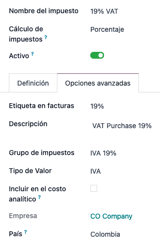
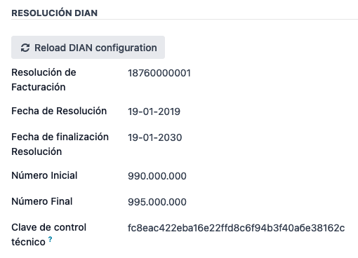
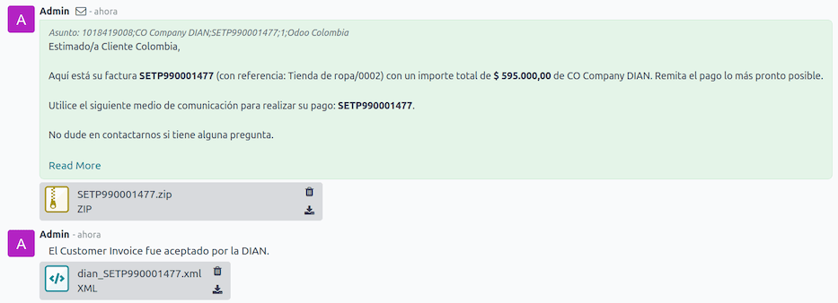
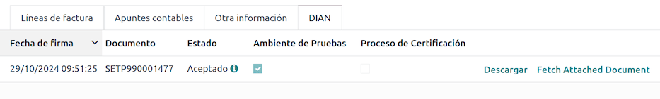
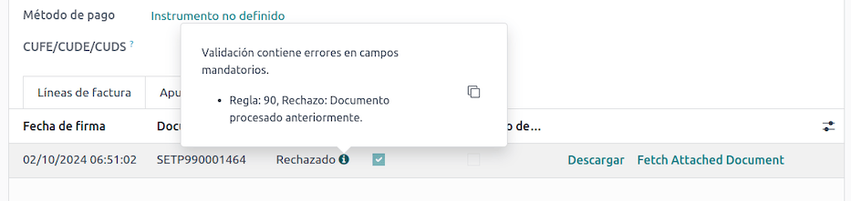
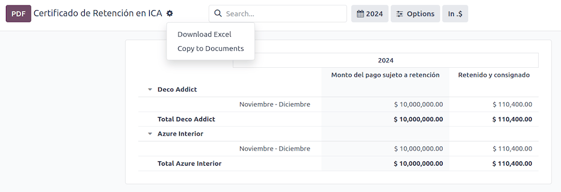
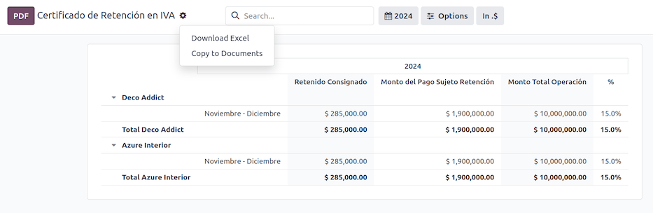
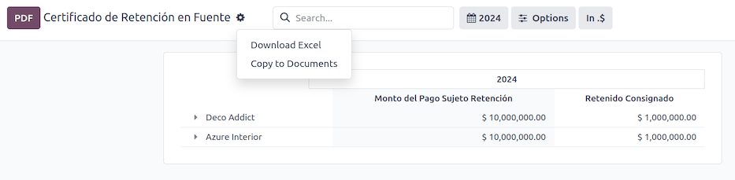

========
Colombia
========

.. |DIAN| replace:: :abbr:`DIAN (Dirección de Impuestos y Aduanas Nacionales)`
.. |NIT| replace:: :abbr:`NIT (El Número de Identificación Tributaria)`

Odoo's Colombian localization package provides accounting, fiscal, and legal features for databases
in Colombia - such as chart of accounts, taxes, and electronic invoicing. The localization has the
following `prerequisites
<https://micrositios.dian.gov.co/sistema-de-facturacion-electronica/que-requieres-para-factura-electronicamente/>`_
when using the `DIAN Own Software
<https://micrositios.dian.gov.co/sistema-de-facturacion-electronica/como-puedes-facturar-electronicamente/>`_
solution with Odoo:

- Be registered in the `RUT
  <https://www.dian.gov.co/tramitesservicios/tramites-y-servicios/tributarios/Paginas/RUT.aspx>`_
  (Registro Único Tributario) with a valid |NIT|.
- Have a valid digital signature certificate `approved by the ONAC
  <https://onac.org.co/directorio-de-acreditados/>`_.
- `Register and get enabled
  <https://micrositios.dian.gov.co/sistema-de-facturacion-electronica/proceso-de-registro-y-habilitacion-como-facturador-electronico/>`_
  by completing the certification process required by the |DIAN|.

.. seealso::
   - For more information on how to complete the certification process for the |DIAN| module, review
     the following `webinar <https://www.youtube.com/watch?v=l0G6iDc7NQA>`_.
   - `Smart Tutorial - Colombian Localization
     <https://www.odoo.com/slides/smart-tutorial-localizacion-de-colombia-132>`_.

.. _localization/colombia/configuration:

Configuration
=============

.. _localization/colombia/modules:

Modules installation
--------------------

:ref:`Install <general/install>` the following modules to get all the features of the Colombian
localization:

.. list-table::
   :header-rows: 1
   :widths: 25 25 50

   * - Name
     - Technical name
     - Description
   * - :guilabel:`Colombia - Accounting`
     - `l10n_co`
     - Default :ref:`fiscal localization package <fiscal_localizations/packages>`. This module adds
       the base accounting features for the Colombian localization: chart of accounts, taxes,
       withholdings, and identification document type.
   * - :guilabel:`Electronic invoicing for Colombia with DIAN`
     - `l10n_co_dian`
     - This module includes the features required for integration with the |DIAN| as its own
       software, and adds the ability to generate electronic invoices and support documents based on
       |DIAN| regulations.
   * - :guilabel:`Colombian - Accounting Reports`
     - `l10n_co_reports`
     - This module includes accounting reports for sending certifications to suppliers for
       withholdings applied.
   * - :guilabel:`Electronic invoicing for Colombia with Carvajal`
     - `l10n_co_edi`
     - This module includes the features required for integration with Carvajal. Adds the ability to
       generate the electronic invoices and support documents, based on |DIAN| regulations.
   * - :guilabel:`Colombian - Point of Sale`
     - `l10n_co_pos`
     - This module includes **Point of Sale** receipts for Colombian localization.

.. _localization/colombia/configuration/company:

Company information
-------------------

To configure your company information:

#. Access your company's contact form:

   - Go to the :guilabel:`Contacts` app and search for your company or;
   - Go to the :guilabel:`Settings` app, activate the :ref:`developer mode <developer-mode>`, and in
     the :guilabel:`Companies` section, click :guilabel:`Update Info`. Then, in the
     :guilabel:`Contact` field, click on the company name.

#. Configure the following information:

   - :guilabel:`Company Name`.
   - :guilabel:`Address`: Including :guilabel:`City`, :guilabel:`Department`, and :guilabel:`ZIP`
     code.
   - :guilabel:`Identification Number`: Select the :guilabel:`Identification Type` (:guilabel:`NIT`,
     :guilabel:`Cédula de Ciudadanía`, :guilabel:`Registro Civil`, etc.). When the
     :guilabel:`Identification Type` is :guilabel:`NIT`, the
     :guilabel:`Identification Number` **must** have the *verification digit* at the end of the ID
     prefixed by a hyphen (`-`).

#. Go to the :guilabel:`Sales & Purchase` tab and configure the :guilabel:`Fiscal Information`:

   - :guilabel:`Obligaciones y Responsabilidades`: Select the fiscal responsibility for the company.
     (:guilabel:`O-13` Gran Contribuyente, :guilabel:`O-15` Autorretenedor,
     :guilabel:`O-23` Agente de retención IVA, :guilabel:`O-47` Regimen de tributación simple,
     :guilabel:`R-99-PN` No Aplica).
   - :guilabel:`Gran Contribuyente`: If the company is *Gran Contribuyente*, enable this option.
   - :guilabel:`Fiscal Regimen`: Select the Tribute Name for the company (:guilabel:`IVA`,
     :guilabel:`INC`, :guilabel:`IVA e INC`, or :guilabel:`No Aplica`)
   - :guilabel:`Commercial Name`: If the company uses a specific commercial name and it needs to be
     displayed in the invoice.

.. tip::
   The data configured in the :guilabel:`Fiscal Information` section is printed in the valid fiscal
   PDF reports.

.. _localization/colombia/einvoice-configuration:

Electronic invoicing credentials and |DIAN| environment
-------------------------------------------------------

To configure the user credentials to be used to connect with the |DIAN|'s web service and the
|DIAN| environment, navigate to :menuselection:`Accounting --> Configuration --> Settings` and
scroll to the :guilabel:`Colombian Electronic Invoicing` section. Then, follow these steps:

#. Select :guilabel:`DIAN: Free Service` as the :guilabel:`Electronic Invoicing Provider`.
#. Configure the :guilabel:`Operation Modes` for the respective types of documents
   (*electronic invoices* or *support documents*) to be generated from Odoo. Click
   :guilabel:`Add a line`, then fill in the fields:

   - :guilabel:`Software Mode`: the type of document to be generated with the operation mode.
   - :guilabel:`Software ID`: the ID generated by |DIAN| for the specific operation mode.
   - :guilabel:`Software PIN`: the PIN selected in the operation mode configuration in the |DIAN|
     portal.
   - :guilabel:`Testing ID`: the testing ID generated by |DIAN| and obtained after testing the
     operation mode.

#. Configure the available :guilabel:`Certificates` to sign the electronic documents. Click
   :guilabel:`Add a line`, then fill in the fields:

   - :guilabel:`Name`: the name of the certificate.
   - :guilabel:`Certificate`: upload the certificate file in PEM format. In the :guilabel:`Private
     Key` field that appears on the screen, select an existing private key or create a new one. To
     do so, enter a key name and select :guilabel:`Create and edit`. Then, in the :guilabel:`Create
     Private Key` wizard, upload a valid :guilabel:`Key file` and click :guilabel:`Save & Close`.

     .. image:: colombia/dian-credentials-configuration.png
        :alt: Colombian electronic invoicing credentials configured.

#. Configure the |DIAN| environment; the |DIAN| electronic invoicing module offers three different
   |DIAN| environments to connect with:

   - **Certification environment**: This environment is useful to pass the |DIAN| certification
     process and obtain the *Enabled* status to invoice from Odoo. To activate it, enable both the
     :guilabel:`Test environment` and the :guilabel:`Activate the certification process` checkboxes.

   - **Testing environment**: This environment allows reproducing electronic invoicing flows
     and validations in the |DIAN| testing portal. To activate it, enable only the :guilabel:`Test
     Environment` checkbox.

   - **Production environment**: Activate production databases to generate valid electronic documents.
     To activate it, disable both the :guilabel:`Test environment` and the :guilabel:`Activate the
     certification process` checkboxes.

.. note::
   In a multi-company database, each company can have its own certificate.

.. seealso::
   For electronic invoicing configurations using the Carvajal solution, review the following video:
   `Configuración de Facturación Electrónica - Localización de Colombia
   <https://www.youtube.com/watch?v=bzweMwTEbfY&list=PL1-aSABtP6ABxZshems3snMjx7bj_7ZsZ&index=3>`_.

.. _localization/colombia/master-data:

Master data
-----------

.. _localization/colombia/contacts:

Contacts
~~~~~~~~

Configure the following fields on the :doc:`contact form <../../essentials/contacts>`:

- :guilabel:`Identification Number` (VAT): Select the identification number type and enter the
  identification number. If the identification number type is :guilabel:`NIT`, the identification
  number must include the verification digit at the end, prefixed by a hyphen (`-`).
- :ref:`Fiscal Information fields <localization/colombia/configuration/company>` in the
  :guilabel:`Sales & Purchase` tab.

.. _localization/colombia/products:

Products
~~~~~~~~

Access the product's form via :menuselection:`Accounting --> Customers --> Products` and ensure
that either the :guilabel:`UNSPSC Category` field (found in the :guilabel:`Accounting tab`) or the
:guilabel:`Internal Reference` field (in the :guilabel:`General Information` tab) is configured.

.. _localization/colombia/taxes:

Taxes
~~~~~

To create or modify taxes, go to :menuselection:`Accounting --> Configuration --> Taxes`, and select
the related tax.

If sales transactions include products with taxes, configure the :guilabel:`Value Type` field in the
:guilabel:`Advanced Options` tab. Retention tax types (:guilabel:`ICA`, :guilabel:`IVA`,
:guilabel:`Fuente`) are also included. This configuration is used to display taxes correctly on the
invoice.

.. _localization/colombia/co-journals:

Sales journals
~~~~~~~~~~~~~~

Once the |DIAN| has assigned the official sequence and prefix for the electronic invoice resolution,
the sales journals related to the invoices **must** be updated in Odoo. To do so, navigate
to :menuselection:`Accounting --> Configuration --> Journals` and select an existing sales journal
or create a new one with the :guilabel:`Create` button.

On the sales journal form, enter the :guilabel:`Journal Name` and :guilabel:`Type`, then set a
unique :guilabel:`Short Code` in the :guilabel:`Journals Entries` tab. Then, configure the following
data in the :guilabel:`Advanced Settings` tab:

- :guilabel:`Electronic invoicing`: enable UBL 2.1 (Colombia).
- :guilabel:`Invoicing Resolution`: resolution number issued by |DIAN| to the company via their test
  set.
- :guilabel:`Resolution Date`: initial effective date of the resolution.
- :guilabel:`Resolution End Date`: end date of the resolution's validity.
- :guilabel:`Range of Numbering (minimum)`: first authorized invoice number.
- :guilabel:`Range of Numbering (maximum)`: last authorized invoice number.
- :guilabel:`Technical Key`: control key received from the |DIAN| portal test set or from their web
  service in case of the production environment.

When the database is configured for the :ref:`production environment
<localization/colombia/einvoice-configuration>`, instead of configuring these fields manually,
click the :guilabel:`Reload DIAN configuration` button to obtain the |DIAN| resolution information
from the |DIAN| web service.

.. important::
   - The short code and resolution of the journal **must** match the ones received in the |DIAN|
     portal test set or from the MUISCA portal.
   - The :ref:`invoice sequence and prefix <localization/colombia/invoice-creation>` **must** be
     correctly configured when the first invoice is created. Odoo automatically assigns a prefix
     and sequence to the following invoices.

.. _localization/colombia/purchase-journals:

Purchase journals
~~~~~~~~~~~~~~~~~

Once the |DIAN| has assigned the official sequence and prefix for the *support document* related to
vendor bills, the purchase journals related to their supporting documents need to be updated in
Odoo. The process is similar to the configuration of the :ref:`sales journals
<localization/colombia/co-journals>`.

.. seealso::
   For more information on support document journals using the Carvajal solution, review the
   `Documento Soporte - Localización de Colombia video
   <https://www.youtube.com/watch?v=UmYsFcD7xzE&list=PL1-aSABtP6ABxZshems3snMjx7bj_7ZsZ&index=8>`_.

.. _localization/colombia/chart-of-accounts:

Chart of accounts
~~~~~~~~~~~~~~~~~

The :doc:`chart of accounts </applications/finance/accounting/get_started/chart_of_accounts>` is
installed by default as part of the localization module. The accounts are mapped automatically in
taxes, default account payable, and default account receivable. The chart of accounts for Colombia
is based on the PUC (Plan Unico de Cuentas).

.. _localization/colombia/workflows:

Main workflows
==============

.. _localization/colombia/electronic-invoices:

Electronic invoices
-------------------

The following is a breakdown of the main workflow for electronic invoices with the Colombian
localization:

#. The user creates an invoice.
#. Odoo generates the legal XML file.
#. Odoo generates the CUFE (Invoice Electronic Code) with the electronic signature.
#. Odoo sends a notification to DIAN.
#. |DIAN| validates the invoice.
#. |DIAN| accepts or rejects the invoice.
#. Odoo generates the PDF invoice with a QR code.
#. Odoo compresses the attached document (containing the sent XML file and the DIAN validation
   response) and the fiscal valid PDF into a :file:`.zip` file.
#. The user sends the invoice (:file:`.zip` file) via Odoo to the acquirer.

.. _localization/colombia/invoice-creation:

Invoice creation
~~~~~~~~~~~~~~~~

.. note::
   The functional workflow taking place before an invoice validation does **not** alter the main
   changes introduced with the electronic invoice.

Electronic invoices are generated and sent to both the |DIAN| and the customer. These documents can
be created from the sales order or manually generated. To create a new invoice, go to
:menuselection:`Accounting --> Costumers --> Invoices`, and select :guilabel:`Create`. On the
invoice form, configure the following fields:

- :guilabel:`Customer`: customer's information.
- :guilabel:`Journal`: journal used for electronic invoices.
- :guilabel:`Electronic Invoice Type`: Select the type of document. By default, :guilabel:`Factura
  de Venta` is selected.
- :guilabel:`Invoice Lines`: Specify the products with the correct taxes.

.. important::
   When creating the first invoice related to an electronic invoicing journal, it is required to
   manually change the *sequence* of the invoice to the |DIAN| format: `Prefix + Sequence`.

   For example, format the sequence from `SETP/2024/00001` to `SETP1`.

When done, click :guilabel:`Confirm`.

.. _localization/colombia/send-electronic-invoice:

Electronic invoice sending
~~~~~~~~~~~~~~~~~~~~~~~~~~

After the :ref:`invoice confirmation <localization/colombia/invoice-creation>`, click
:guilabel:`Print & Send`. In the wizard that appears, make sure to enable the :guilabel:`DIAN` and
:guilabel:`Email` checkboxes to send an XML to the |DIAN| web service and the validated invoice to
the client fiscal email and click :guilabel:`Print & Send`. Then:

- The XML document is created.
- The CUFE is generated.
- The XML is processed synchronously by the |DIAN|.
- If accepted, the file is displayed in the chatter and the email to the client with the
  corresponding :file:`.zip` file.

The :guilabel:`DIAN` tab then displays the following:

- :guilabel:`Signed Date`: timestamp recorded of the XML creation.
- :guilabel:`Status`: Status result obtained in the |DIAN| response. If the invoice was
  rejected, the error messages can be seen here.
- :guilabel:`Testing Environment`: To know if the document sent was delivered to the |DIAN| testing
  environment.
- :guilabel:`Certification Process`: To know if the document was sent as part of the certification
  process with the |DIAN|.
- :guilabel:`Download`: To download the sent XML file, even if the |DIAN| result was
  rejected.
- :guilabel:`Fetch Attached Document`: To download the generated attached document file included in
  the delivered :file:`.zip` file to the client.

.. _localization/colombia/credit-notes:

Credit notes
------------

The process for credit notes is the same as for invoices. To create a credit note with reference to
an invoice, go to :menuselection:`Accounting --> Customers --> Invoices`. On the invoice, click
:guilabel:`Add Credit Note`, and complete the following information:

- :guilabel:`Credit Method`: Select the type of credit method.

  - :guilabel:`Partial Refund`: Use this option when it is a partial amount.
  - :guilabel:`Full Refund`: Use this option if the credit note is for the full amount.
  - :guilabel:`Full refund and new draft invoice`: Use this option if the credit note is
    auto-validated and reconciled with the invoice. The original invoice is duplicated as a new
    draft.

- :guilabel:`Reason`: Enter the reason for the credit note.
- :guilabel:`Reversal Date`: Select if you want a specific date for the credit note or if it is the
  journal entry date.
- :guilabel:`Use Specific Journal`: Select the journal for your credit note or leave it empty if
  you want to use the same journal as the original invoice.
- :guilabel:`Refund Date`: If you chose a specific date, select the date for the refund.

Once reviewed, click the :guilabel:`Reverse` button.

.. _localization/colombia/debit-notes:

Debit notes
-----------

The process for debit notes is similar to credit notes. To create a debit note with reference to an
invoice, go to :menuselection:`Accounting --> Customers --> Invoices`. On the invoice, click the
:guilabel:`Add Debit Note` button, and enter the following information:

- :guilabel:`Reason`: Type the reason for the debit note.
- :guilabel:`Debit note date`: Select the specific options.
- :guilabel:`Copy lines`: Select this option if you need to register a debit note with the same
  lines of invoice.
- :guilabel:`Use Specific Journal`: Select the printer point for your debit note, or leave it empty
  if you want to use the same journal as the original invoice.

When done, click :guilabel:`Create Debit Note`.

.. _localization/colombia/support-document:

Support document for vendor bills
---------------------------------

With master data, credentials, and the purchase journal configured for support documents related to
vendor bills, you can start using *support documents*.

Support documents for vendor bills can be created from your purchase order or manually. Go to
:menuselection:`Accounting --> Vendors --> Bills` and fill in the following data:

- :guilabel:`Vendor`: Enter the vendor's information.
- :guilabel:`Bill Date`: Select the date of the bill.
- :guilabel:`Journal`: Select the journal for support documents related to the vendor bills.
- :guilabel:`Invoiced Lines`: Specify the products with the correct taxes.

Once reviewed, click the :guilabel:`Confirm` button. Upon confirmation, an XML file is created and
automatically sent to Carvajal.

.. _localization/colombia/common-errors:

Common errors
-------------

During the XML validation, the most common errors are related to missing :ref:`master data
<localization/colombia/master-data>`. In such cases, a validation error message is displayed and
sending is blocked.

If the invoice was sent and set as *Rejected* by the |DIAN|, the error messages are visible by
clicking the :icon:`fa-info-circle` :guilabel:`(info circle)` icon next to the :guilabel:`Status`
field in the :guilabel:`DIAN` tab. Using the reported error codes, it is possible to review
solutions to apply before re-sending.

After the master data or other issues are corrected, it is possible to reprocess the XML again. Do
so by following the :ref:`electronic invoice sending <localization/colombia/send-electronic-invoice>`
flow.

.. _localization/colombia/reports:

Financial reports
=================

.. _localization/colombia/certificado-ica:

Certificado de Retención en ICA
-------------------------------

This report is a certification to vendors for withholdings made for the Colombian Industry and
Commerce (ICA) tax. The report can be found under :menuselection:`Accounting --> Reporting -->
Colombian Statements --> Certificado de Retención en ICA`.

Click the :icon:`fa-cog` :guilabel:`(gear)` icon to display options to :guilabel:`Download Excel`
and :guilabel:`Copy to Documents`.

.. _localization/colombia/certificado-iva:

Certificado de Retención en IVA
-------------------------------

This report issues a certificate on the amount withheld from vendors for VAT withholding. The report
can be found under :menuselection:`Accounting --> Reporting --> Colombian Statements --> Certificado
de Retención en IVA`.

Click the :icon:`fa-cog` :guilabel:`(gear)` icon to display options to :guilabel:`Download Excel`
and :guilabel:`Copy to Documents`.

.. _localization/colombia/certificado-fuente:

Certificado de Retención en la Fuente
-------------------------------------

This certificate is issued to partners for the withholding tax that they have made. The report can
be found under :menuselection:`Accounting --> Reporting --> Colombian Statements --> Certificado de
Retención en Fuente`.

Click the :icon:`fa-cog` :guilabel:`(gear)` icon to display options to :guilabel:`Download Excel`
and :guilabel:`Copy to Documents`.

