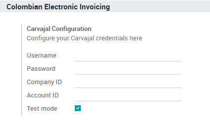
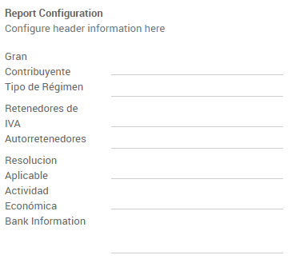
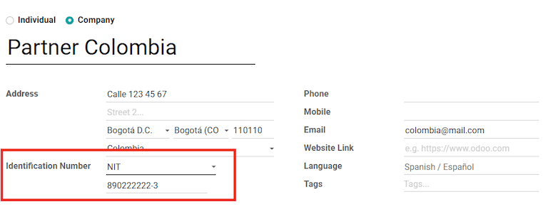
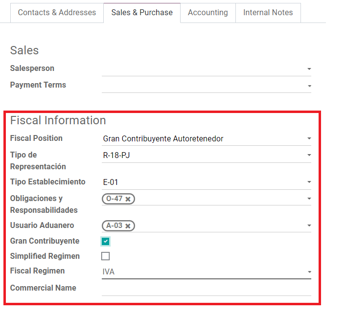
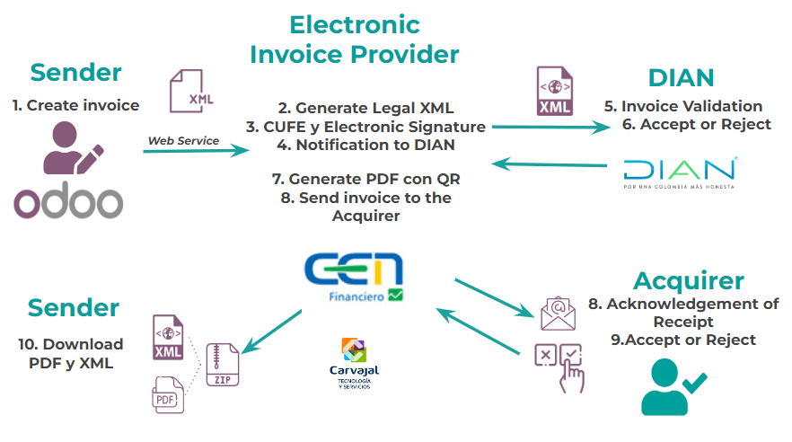
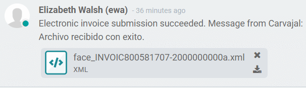
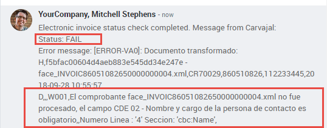
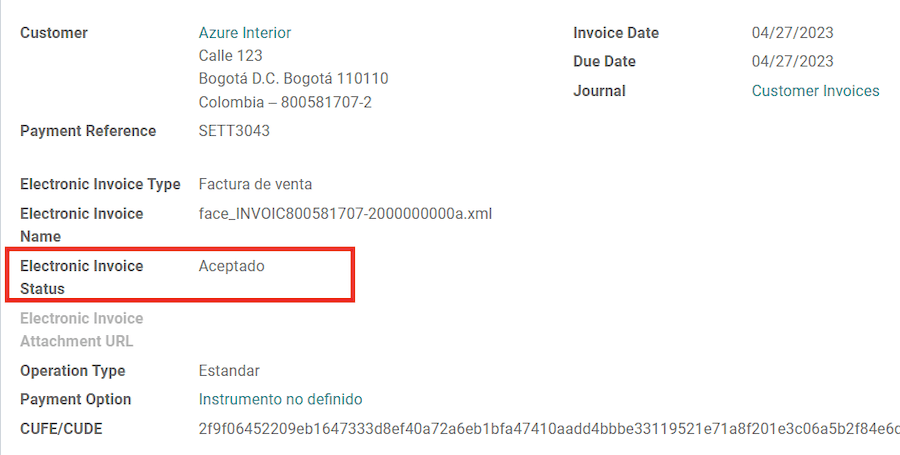

========
Colombia
========

The following documentation covers the Colombian localization modules and their basic concepts to
understand, implement, and use Colombian localization in Odoo.

- Configure Master Data for Colombia
- Use and configure Electronic Invoicing in Odoo for Colombia.
- :ref:`Invoice creation <colombia/invoice-creation>` and :ref:`validation
  <colombia/invoice-validation>`
- :ref:`Reception of legal XML and PDF <colombia/invoice-xml>`
- :ref:`Avoid common mistakes <colombia/common-errors>`
- :ref:`Financial reports <colombia/reports>`

.. seealso::
   `Smart Tutorial - Localización de Colombia
   <https://www.odoo.com/slides/smart-tutorial-localizacion-de-colombia-132>`_

.. _colombia/configuration:

Configuration
=============

Modules installation
--------------------

:ref:`Install <general/install>` the following modules to get all the features of the Colombian
localization:

.. list-table::
   :header-rows: 1
   :widths: 25 25 50

   * - Name
     - Technical name
     - Description
   * - :guilabel:`Colombia - Accounting`
     - `l10n_co`
     - Default :ref:`fiscal localization package <fiscal_localizations/packages>`
   * - :guilabel:`Electronic invoicing for Colombia with Carvajal`
     - `l10n_co_edi`
     - Carvajal e-invoicing integration
   * - :guilabel:`Colombian - Point of Sale`
     - `l10n_co_pos`
     - Point of Sale
   * - :guilabel:`Colombian - Accounting Reports`
     - `l10n_co_reports`
     - Colombian reports

Configure credentials for Carvajal web service
----------------------------------------------

Once the modules are installed, the user credentials need to be configured in order to connect with
Carvajal Web Service. First, navigate to :menuselection:`Accounting --> Configuration --> Settings`
and look for the :guilabel:`Colombian Electronic Invoice` section. Then, fill in the required
configuration information provided by Carvajal.

Check the :guilabel:`Test mode` checkbox to connect with the Carvajal testing environment. This
allows users to test the complete workflow and integration with the :abbr:`CEN (Centro Electrónico
de Negocios)` Financiero portal, which is accessible here:

- `CTS (Carvajal T&S) <https://cenflab.cen.biz/site/>`_.
- `CSC (Carvajal Servicios de Comunicación) <https://web-stage.facturacarvajal.com/>`_.

:abbr:`CSC (Carvajal Servicios de Comunicación)` is the default for new databases.

Once Odoo and Carvajal are fully configured and ready for production, the testing environment can be
disabled by unchecking the :guilabel:`Test mode` checkbox.

Configure report data
---------------------

Report data can be defined for the fiscal section and the bank information in the PDF as part of the
configurable information that is sent in the XML.

Navigate to :menuselection:`Accounting --> Configuration --> Settings` and look for the
:guilabel:`Colombian Electronic Invoice` section.

Configure data required in the XML
----------------------------------

Partner
~~~~~~~

Configure the identification number and fiscal structure.

Identification
**************

As part of the Colombian Localization, the document types defined by the :abbr:`DIAN (Dirección de
Impuestos y Aduanas Nacionales)` are now available on the Partner form. Colombian partners have to
have their identification number (:guilabel:`VAT`) and :guilabel:`Document Type` set:

.. tip::
   When the :guilabel:`Document Type` is `RUT`, the identification number needs to be configured in
   Odoo, including the verification digit, Odoo will split this number when the data to the
   third-party vendor is sent.

Fiscal structure (RUT)
**********************

The partner's responsibility codes (section 53 in the RUT document) are included as part of the
electronic invoice module, given it is part of the information required by the :abbr:`DIAN
(Dirección de Impuestos y Aduanas Nacionales)`.

The required fields can be found in :menuselection:`Partner --> Sales & Purchase Tab --> Fiscal
Information`.

Additionally, two boolean fields were added in order to specify the fiscal regimen of the partner.

Taxes
~~~~~

If sales transactions include products with taxes, the :guilabel:`Value Type` field in the
:guilabel:`Advanced Options tab` needs to be configured per tax.

Retention tax types (ICA, IVA, Fuente) are also included in the options to configure taxes. This
configuration is used in order to display taxes in the invoice PDF correctly.

.. image:: colombia/retention-tax-types.png
   :alt: The ICA, IVA and Fuente fields in the Advanced Options tab in Odoo.

Users
~~~~~

The default template that is used by Odoo on the invoice PDF includes the job position of the
salesperson, so the :guilabel:`Job Position` field should be configured.

.. _colombia/workflows:

Main workflows
==============

.. _colombia/invoice-creation:

Invoice creation
----------------

The functional workflow that takes place before an invoice validation doesn't change. The main
changes that are introduced with the electronic invoice are the next fields.

There are three types of documents:

- **Factura Electronica**: This is the regular document type applicable for Invoices, Credit Notes
  and Debit Notes.
- **Factura de Importación**: This should be selected for importation transactions.
- **Factura de contingencia**: This is an exceptional type that is used as a manual backup if the
  company is not able to use the ERP and if it is necessary to generate the invoice manually when
  this invoice is added to the ERP.

.. _colombia/invoice-validation:

Invoice validation
------------------

After the invoice is validated, an XML file is created and sent automatically to Carvajal. This file
is also displayed in the chatter.

The :guilabel:`Electronic Invoice Name` field is now displayed in the :guilabel:`Other Info` tab
with the name of the XML file. Additionally, the :guilabel:`Electronic Invoice Status` field is
displayed with the initial value :guilabel:`In progress`.

.. _colombia/invoice-xml:

Reception of legal XML and PDF
------------------------------

The electronic invoice vendor receives the XML file and proceeds to validate the structure and the
information in it. In the :guilabel:`Action` drop-down menu, select the :guilabel:`Check Carvajal
Status` button. If everything is correct, the :guilabel:`Electronic Invoice Status` field value
changes to :guilabel:`Validated`. Then, proceed to generate a legal XML, which includes a digital
signature and a unique code (CUFE), a PDF invoice that includes a QR code, and the CUFE is also
generated.

After this:

- A ZIP containing the legal XML and the PDF is downloaded and displayed in the invoice chatter:

  .. image:: colombia/zip-invoice-chatter.png
     :alt: ZIP file displayed in the invoice chatter in Odoo.

  .. image:: colombia/zip-file-contents.png
     :alt: XML and PDF contained in invoice ZIP file.

- The electronic invoice status changes to :guilabel:`Accepted`.

.. _colombia/common-errors:

Common errors
-------------

During the XML validation, the most common errors are usually related to missing master data. In
such cases, error messages are shown in the chatter after updating the electronic invoice status.

After the master data is corrected, it's possible to reprocess the XML with the new data and send
the updated version, using the following button in the :guilabel:`Action` drop-down menu.

Additional use cases
--------------------

The process for credit and debit notes is exactly the same as the invoice. The functional workflow
remains the same as well.

.. _colombia/reports:

Financial reports
=================

This information is a quick reference to the accounting reports included in the *Colombian
Localization Accounting Reports* module.

Certificado de Retención en ICA
-------------------------------

This report is a certification to vendors for withholdings made for the Colombian Industry and
Commerce tax (ICA).

Go to :menuselection:`Accounting --> Reporting --> Colombian Statements --> Certificado de Retención
en ICA`.

.. image:: colombia/ica-report.png
   :alt: Certificado de Retención en ICA report in Odoo Accounting.

Certificado de Retención en IVA
-------------------------------

This report issues a certificate on the amount withheld from vendors for VAT withholding.

Go to :menuselection:`Accounting --> Reporting --> Colombian Statements --> Certificado de Retención
en IVA`.

.. image:: colombia/iva-report.png
   :alt: Certificado de Retención en IVA report in Odoo Accounting.

Certificado de Retención en la Fuente
-------------------------------------

This certificate is issued to partners for the withholding tax that they have made.

Go to :menuselection:`Accounting --> Reporting --> Colombian Statements --> Certificado de Retención
en Fuente`.

.. image:: colombia/fuente-report.png
   :alt: Certificado de Retención en Fuente report in Odoo Accounting.
