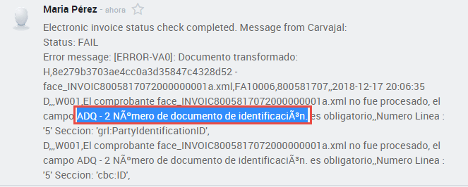
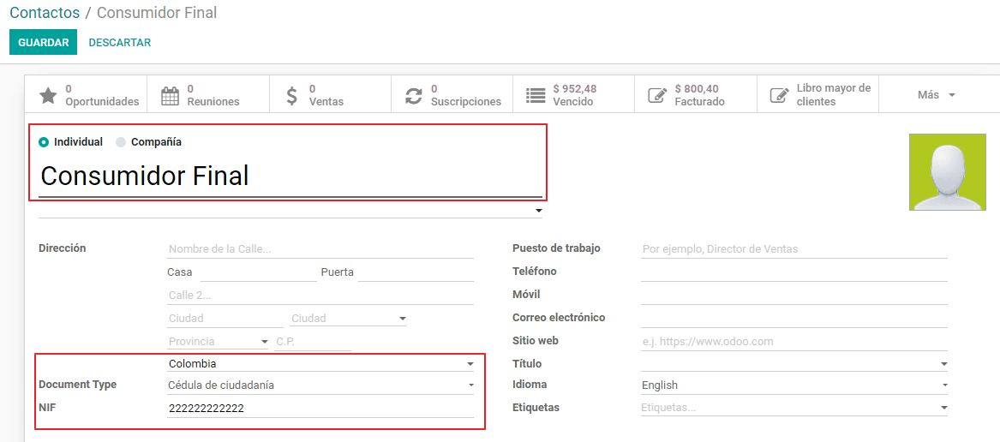
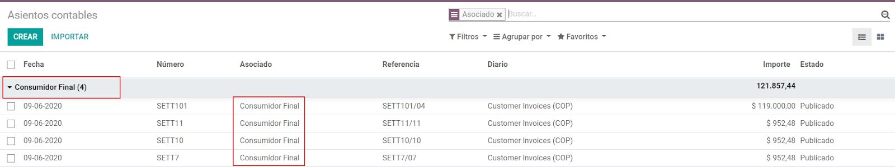

=============
Colombia (ES)
=============

Introducción
============

La Facturación Electrónica para Colombia está disponible en Odoo 12 y
requiere los siguientes Módulos:

#. **l10n_co**: Contiene los datos básicos para manejar el módulo de
   contabilidad, incluyendo la configuración por defecto de los siguientes
   puntos:

   - Plan Contable
   - Impuestos
   - Retenciones
   - Tipos de Documentos de Identificación

#. **l10n_co_edi**: Este módulo incluye todos los campos adicionales que son
   requeridos para la Integración entre Carvajal y la generación de la
   Factura Electrónica, basado en los requisitos legales de la DIAN.

Flujo General
=============

.. image:: colombia/colombia01.png
   :align: center

Configuración
=============

Instalación de los módulos de Localización Colombiana
-----------------------------------------------------

Para esto ve a las aplicaciones y busca “Colombia”, luego da click en
Instalar a los primeros dos módulos:

.. image:: colombia/colombia02.png
   :align: center

Configuración de las credenciales del Servicio Web de Carvajal
~~~~~~~~~~~~~~~~~~~~~~~~~~~~~~~~~~~~~~~~~~~~~~~~~~~~~~~~~~~~~~

| Una vez que los módulos están instalados, para poderte conectar con el
  Servicio Web de Carvajal, es necesario configurar el Usuario y las
  Credenciales. Esta información será provista por Carvajal.
| Ve a :menuselection:`Facturación --> Configuración --> Configuración` y busca la sección
  **Facturación Electrónica Colombiana**

.. image:: colombia_ES/colombia_ES02.png
  :align: center

La funcionalidad de pruebas le permite conectarse e interactuar con el
ambiente piloto de Carvajal, esto permite a los usuarios probar el
flujo completo y la integración con el Portal Financiero CEN, al cual
se accede a través de la siguiente liga:

CTS (Carvajal T&S)
   https://cenflab.cen.biz/site/

CSC (Carvajal Servicios de Comunicación)
   https://web-stage.facturacarvajal.com/

CSC es el predeterminado para nuevas bases de datos.

Una vez que el ambiente de producción está listo en Odoo y en Carvajal
el ambiente de pruebas debe ser deshabilitado para poder enviar la
información al ambiente de producción de Carvajal.

Configuración de Información para PDF
-------------------------------------

| Como parte de la información configurable que es enviada en el XML,
  puedes definir los datos de la sección fiscal del PDF, así como de la
  información Bancaria.
| Ve a :menuselection:`Contabilidad --> Configuración --> Ajustes` y busca la sección
  **Facturación Electrónica Colombiana**.

.. image:: colombia_ES/colombia_ES03.png
  :align: center

Configuración de los Datos Principales Requeridos en el XML
-----------------------------------------------------------

Contacto (Tercero)
~~~~~~~~~~~~~~~~~~

Identificación
**************

Como parte de la Localización Colombiana, los tipos de documentos
definidos por la DIAN ahora están disponibles en el formulario de
Contactos, por lo cual ya es posible asignarles su número de
identificación asociado al tipo de documento correspondiente.

.. image:: colombia_ES/colombia_ES04.png
  :align: center

Nota: Cuando el tipo de documento es RUT la identificación necesita ser
ingresada en Odoo incluyendo el Dígito de Verificación. Odoo separará
este número cuando la información sea enviada a los proveedores
terceros.

Estructura Fiscal (RUT)
***********************

Los Códigos de tipo de Obligación aplicables a los terceros (sección 53
en el documento de RUT), son incluidos como parte del módulo de
Facturación Electrónica, dado que es información requerida por la DIAN.

Estos campos se encuentran en :menuselection:`Contactos --> Pestaña de Ventas y Compras
--> Información Fiscal`

.. image:: colombia_ES/colombia_ES05.png
  :align: center

Adicionalmente dos últimos campos fueron agregados para especificar el
régimen fiscal del contacto. Cabe aclarar que para envío de Factura
electrónica de Carvajal, únicamente se hace distinción de entre Grandes
Contribuyentes y Régimen simplificado, por lo se muestran solo estas dos
opciones.

Impuestos
~~~~~~~~~

Si tus transacciones de ventas incluyen productos con impuestos, es
importante considerar que un campo adicional llamado *Tipo de Valor*
necesita ser configurado en la siguiente ruta: :menuselection:`Contabilidad
--> Configuración --> Impuestos: --> Opciones Avanzadas --> Tipo de Valor`

.. image:: colombia_ES/colombia_ES06.png
  :align: center

Los impuestos para Retenciones (ICA, IVA y Fuente) también están
incluidos en las opciones para configurar tus impuestos, esta
configuración es considerada para desplegar correctamente los impuestos
en la representación gráfica de la Factura. (PDF)

.. image:: colombia_ES/colombia_ES07.png
  :align: center

Diarios
~~~~~~~

Una vez que la DIAN ha asignado la secuencia y prefijo oficiales para la
resolución de la Facturación Electrónica, los Diarios de Ventas
relacionados con tus documentos de facturación necesitan ser
actualizados en Odoo.

La secuencia es configurada usando el modo de desarrollador en la
siguiente ruta: :menuselection:`Contabilidad --> Configuración --> Diarios
--> Liga de Secuencia`

.. image:: colombia_ES/colombia_ES08.png
  :align: center

Una vez que la secuencia es abierta, los campos de Prefijo y Siguiente
Número deben ser configurados y sincronizados con el CEN Financiero.

.. image:: colombia_ES/colombia_ES09.png
  :align: center

Usuarios
~~~~~~~~

La plantilla por defecto que es usada por Odoo en la representación
gráfica incluye el nombre del Vendedor, así que estos campos deben ser
considerados:

.. image:: colombia_ES/colombia_ES10.png
  :align: center

Uso y Pruebas
=============

Facturas
--------

Una vez que toda la información principal y las credenciales han sido
configuradas, es posible empezar a probar el flujo de la Facturación
Electrónica siguiendo las instrucciones que se detallan a continuación:

Invoice Creation
~~~~~~~~~~~~~~~~

El flujo de trabajo funcional que lleva lugar antes de la validación de
una factura continua siendo igual con Facturación Electrónica,
independientemente de si es creada desde una Orden de Venta o si es
creado manualmente.

Los cambios principales que son introducidos con la Facturación
Electrónica son los siguientes:

Hay tres tipos de documentos

- **Factura electrónica**. Este es el documento normal y aplica
  para Facturas, Notas de Crédito y Notas de Débito.

- **Factura de Importación**. Debe ser seleccionada para
  transacciones de importación.

- **Factura de Contingencia**. Esta es un caso excepcional y es
  utilizada como un respaldo manual en caso que la compañía no
  pueda usar el ERP y hay necesidad de crear la factura
  manualmente. Al ingresar esta factura en el ERP, se debe
  seleccionar este tipo.

  .. image:: colombia_ES/colombia_ES11.png

Invoice Validation
~~~~~~~~~~~~~~~~~~

Después que la factura fue validada, un archivo XML es creado y enviado
automáticamente al proveedor de la factura electrónica. Este archivo es
desplegado en el historial.

.. image:: colombia_ES/colombia_ES12.png
  :align: center

Un campo adicional es ahora desplegado en la pestaña de “Otra
Información” con el nombre del archivo XML. Adicionalmente hay un
segundo campo adicional que es desplegado con el estatus de la Factura
Electrónica, con el valor inicial **En Proceso**.

Recepción del XML y PDF Legal
~~~~~~~~~~~~~~~~~~~~~~~~~~~~~

| El proveedor de la Factura Electrónica recibe el archivo XML y procede
  a validar la información y la estructura contenida. Si todo es
  correcto, el estatus de la Factura cambia a “Validado”. Como parte de
  este proceso se generar el XML Legal, el cual incluye una firma
  digital y un código único (CUFE) y generan el PDF de la Factura (el
  cual incluye un código QR) y el CUFE.

| Odoo envía una petición de actualización automáticamente para
  verificar que el XML fue creado. Si este es el caso, las siguientes
  acciones son hechas automáticamente:

- El XML Legal y el PDF son incluidos en un archivo ZIP y desplegados
  en el historial de la Factura.

  .. image:: colombia_ES/colombia_ES14.png

- El estatus de la Factura Electrónica es cambiado a “Aceptado”.

  .. image:: colombia_ES/colombia_ES15.png

.. tip::
   En caso que el PDF y el XML sean requeridos inmediatamente, es
   posible mandar manualmente la petición del estatus usando el siguiente
   botón:

   .. image:: colombia_ES/colombia_ES16.png
      :align: center

Errores Frecuentes
~~~~~~~~~~~~~~~~~~

Durante la validación del XML los errores más comunes usualmente están
relacionados con información principal faltante. En estos casos, los
detalles del error son recuperados en la petición de actualización y
desplegados en el historial.

.. image:: colombia_ES/colombia_ES17.png
  :align: center

Si la información principal es corregida, es posible re procesar el XML
con la nueva información y mandar la versión actualizada usando el
siguiente botón:

.. image:: colombia_ES/colombia_ES18.png
  :align: center

.. image:: colombia_ES/colombia_ES19.png
  :align: center

Casos de Uso adicionales
------------------------

El proceso para las Notas de Crédito y Débito (Proveedores) es
exactamente el mismo que en las Facturas. Su flujo de trabajo funcional
se mantiene igual.

Consideraciones del Anexo 1.7
=============================

Contexto
--------

Contexto Normativo
~~~~~~~~~~~~~~~~~~

| Soporte Normativo:
| Resolución DIAN Número 000042  ( 5 de Mayo de 2020)  Por la cual se desarrollan:

- Los sistemas de facturación,
- Los proveedores tecnológicos,
- El registro de la factura electrónica de venta como título valor,
- Se expide el anexo técnico de factura electrónica de venta y
- Se dictan otras disposiciones en materia de sistemas de facturación.

Anexo 1.7: Principales Cambios
~~~~~~~~~~~~~~~~~~~~~~~~~~~~~~

- Cambios en la definición de Consumidor Final.
- Informar bienes cubiertos para los 3 dias sin IVA.
- Actualización de descripción de Impuestos.
- Se agrega concepto para IVA Excluido.
- Informar la fecha efectiva de entrega de los bienes.
- Adecuaciones en la representación Gráfica (PDF).

Calendario
~~~~~~~~~~

Se tiene varias fechas límites para la salida a producción bajo las condiciones del Anexo 1.7 las
cuales dependen de los siguientes factores:

#. Calendario de implementación de acuerdo con la actividad económica principal en el RUT:

   .. image:: colombia_ES/colombia-es-calendario-rut.png
      :align: center

#. Calendario de implementación, para otros sujetos obligados:

   .. image:: colombia_ES/colombia-es-calendario-otros-obligados.png
      :align: center

#. Calendario de implementación permanente:

   .. image:: colombia_ES/colombia-es-calendario-permanente.png
      :align: center

Requerimientos en Odoo
----------------------

Con la finalidad de facilitar el proceso de preparación de las bases de Odoo estándar V12 y v13,
únicamente será necesario que los administradores actualicen algunos módulos y creen los datos
maestros relacionados a los nuevos procesos.

Actualización de listado de Apps
~~~~~~~~~~~~~~~~~~~~~~~~~~~~~~~~

Utilizando el modo desarrollador, acceder al módulo de Aplicaciones y seleccionar el menú
*Actualizar Lista*.

.. image:: colombia_ES/colombia-es-actualizar-lista.png
   :align: center

Actualización de Módulos
~~~~~~~~~~~~~~~~~~~~~~~~

Una vez actualizado Buscar *Colombia*, los siguientes módulos serán desplegados, se requieren
actualizar dos módulos.

#. Colombia - Contabilidad - l10n_co
#. Electronic invoicing for Colombia with Carvajal UBL 2.1 - l10n_co_edi_ubl_2_1

.. image:: colombia_ES/colombia-es-modulos.png
   :align: center

En cada módulo o ícono hay que desplegar el menú opciones utilizando los 3 puntos de la esquina
superior derecha y seleccionamos *Actualizar*.

Primero lo hacemos con en el módulo l10n_co:

.. image:: colombia_ES/colombia-es-actualizar-contabilidad.png
   :align: center

Posteriormente lo hacemos con el módulo l10n_co_edi_ubl_2_1:

.. image:: colombia_ES/colombia-es-actualizar-electronic-invoicing.png
   :align: center

Creación de Datos Maestros
~~~~~~~~~~~~~~~~~~~~~~~~~~

Las bases de datos existentes a Junio 2020 tanto en V12 como V13, deberán crear algunos datos
maestros necesarios para operar correctamente con los cambios del Anexo 1.7.

Consumidor Final
****************

La figura del consumidor final será utilizada para aquellas ventas sobre las cuales no es posible
identificar toda la información fiscal y demográfica del cliente por lo que la factura se genera a
nombre de este registro genérico.

Es importante coordinar y definir los casos de uso en los que dependiendo de su empresa se tendrá
permitido utilizar este registro genérico.

Dentro de Odoo se tendrá que crear un contacto con las siguientes características, es importante que
se defina de esta manera debido a que son los parámetros definidos por la DIAN.

- **Tipo de contacto:** Individuo
- **Nombre:** Consumidor Final
- **Tipo de documento:** Cedula de Ciudadania
- **Numero de Identificacion:** 222222222222

Dentro de la pestaña Ventas y Compras, en la sección Información Fiscal, del campo Obligaciones y
Responsabilidades colocaremos el valor: **R-99-PN**.

.. image:: colombia_ES/colombia-es-consumidor-final-r-99-pn.png
   :align: center

IVA Excluido - Bienes Cubiertos
*******************************

Para reportar las transacciones realizadas mediante Bienes Cubiertos para los tres días sin IVA,
será necesario crear un nuevo Impuesto al cual se le debe de asociar un grupo de impuestos
específico que será utilizado por Odoo para agregar la sección requerida en el XML de factura
electrónica.

Para el crear el impuesto accederemos a Contabilidad dentro del menú :menuselection:`Configuración
--> Impuestos`:

.. image:: colombia_ES/colombia-es-menu-impuestos.png
   :align: center

Procedemos a crear un nuevo Impuesto con importe 0% considerando los siguientes parámetros:

.. image:: colombia_ES/colombia-es-nuevo-impuesto.png
   :align: center

El nombre del Impuesto puede ser definido a preferencia del usuario, sin embargo el campo clave es
**Grupo de Impuestos** dentro de Opciones avanzadas, el cual debe ser: *bienes cubiertos* y el campo
**Tipo de Valor**: *IVA*.

.. image:: colombia_ES/colombia-es-nuevo-impuesto-opciones-avanzadas.png
   :align: center

Actualización de descripción de Departamentos
*********************************************

Es necesario actualizar la descripción de algunos departamentos, para lo cual accederemos a módulo
de Contactos y dentro del menú de :menuselection:`Configuración --> Provincias`.

.. image:: colombia_ES/colombia-es-menu-provincias.png
   :align: center

Posteriormente, podemos agregar por País para identificar claramente las provincias (Departamentos)
de Colombia:

.. image:: colombia_ES/colombia-es-provincias-agrupar.png
   :align: center

Una vez agrupados buscar los siguientes departamentos para actualizarlos con el valor indicado en la
columna **Nombre actualizado**:

+------------------------------+---------------------+--------------------------+
| Nombre de provincia          | Código de Provincia | Nombre actualizado       |
+==============================+=====================+==========================+
| D.C.                         | DC                  | Bogotá                   |
+------------------------------+---------------------+--------------------------+
| Quindio                      | QUI                 | Quindío                  |
+------------------------------+---------------------+--------------------------+
| Archipiélago de San Andrés,  | SAP                 | San Andrés y Providencia |
| Providencia y Santa Catalina |                     |                          |
+------------------------------+---------------------+--------------------------+

Ejemplo:

.. image:: colombia_ES/colombia-es-provincias-ejemplo.png
   :align: center

Verificación de Código postal
*****************************

Dentro del Anexo 1.7 se comienza a validar que el código postal de las direcciones para contactos
colombianos corresponda a las tablas oficiales definidas por la DIAN, por lo que se debe verificar
que este campo está debidamente diligenciado de acuerdo a los definidos en la sigueinte fuente:
`Codigos_Postales_Nacionales.csv
<http://visor.codigopostal.gov.co/472/visor/Codigos_Postales_Nacionales.csv>`_

Consideraciones Operativas
--------------------------

Consumidor Final
~~~~~~~~~~~~~~~~

Una vez que resgistro de Consumidor final ha sido creado este deberá ser utilizado a demanda,
generalmente será utilizado en las transacciones de facturación del punto de punto de venta.

- El proceso de validación de la Factura será realizado de forma convencional en Odoo y la factura
  será generada de la misma manera. Al detectar que el número de identificación corresponde a
  consumidor Final, el XML que se envía a Carvajal será generado con las consideraciones y secciones
  correspondientes.
- Contablemente todos los registros de Consumidor final quedarán asociados al identificador generico:

IVA Excluido - Bienes Cubiertos
~~~~~~~~~~~~~~~~~~~~~~~~~~~~~~~

El 21 mayo del 2020 fue publicado el El Decreto 682 el cual establece Excepción especial en el
Impuesto sobre las ventas. El principal objetivo de este decreto es reactivar la economía en
Colombia por las bajas ventas generadas a causa del COVID.

Fechas
******

Días de excención del impuesto sobre las ventas – IVA para bienes cubiertos (3 días SIN IVA).

- **Primer día**: 19 de junio de 2020
- **Segundo día**: 3 de Julio de 2020
- **Tercer día**: 19 de Julio de 2020

Condiciones
***********

Debido a que estas transacciones serán generadas de forma excepcional y que se tiene una combinación
de varios factores y condiciones, los productores debera ser actualizados de forma manual en Odoo
asignados temporalmente el impuesto de venta *IVA exento - Bienes cubierto* en cada empresa según
corresponda.

A continuación se mencionan algunas de las principales condiciones, sin embargo, cabe mencionar que
las empresas deben de verificar todos los detalles en el `Decreto 682
<https://dapre.presidencia.gov.co/normativa/normativa/DECRETO%20682%20DEL%2021%20DE%20MAYO%20DE%202020.pdf>`_.

- Tipo de productos y precio Máximo:

  +-----------------------------+---------------------------------------+
  | Tipo de Productos           | Precio Máximo                         |
  +=============================+=======================================+
  | Electrodomesticos           | 40 UVT: $1,4 millones.                |
  +-----------------------------+---------------------------------------+
  | Vestuario y complementos    | | 3 UVT: $106.000                     |
  |                             | | En el caso de los complementos es:  |
  |                             | | 10 UVT- $356.000                    |
  +-----------------------------+---------------------------------------+
  | Elementos deportivos        | 10 UVT- $356.000                      |
  +-----------------------------+---------------------------------------+
  | Juguetes y Utiles Escolares | 5 UVT - $178.035                      |
  +-----------------------------+---------------------------------------+
  | Utiles Escolares            | 5 UVT - $178.035                      |
  +-----------------------------+---------------------------------------+
  | Bienes o servicios para     | 80 UVT - $2.848.560                   |
  | el sector agropecuario      |                                       |
  +-----------------------------+---------------------------------------+

- Métodos de Pago:

  - El pago debe realizarse por medios electrónico por ejemplo tarjetas de crédito/débito o bien mecanismos de pago online.

- Limite de unidades:

  - Cada cliente puede adquirir únicamente 3 unidades como máximo de cada producto.

Medidas en Odoo
***************

- **Preparación de datos**

  - Crear el Impuesto para Bienes cubiertos de acuerdo a lo indicado en este punto: Datos maestros.
  - Identificar los productos y transacciones a los cuales les aplicará la Exclusión de IVA de
    acuerdo a las condiciones establecidas en el decreto 682. En caso de ser un porcentaje
    significativo de productos, se recomienda actualizar el impuesto de forma temporal en Odoo.
  - Exportar un listado con los productos que serán afectados incluyendo el campo IVA Venta el cual
    será sustituido temporalmente por el IVA de Bienes Cubiertos.
  - Al finalizar las operaciones del día anterior a las fechas establecidas de día sin IVA, se debe
    hacer la actualización temporal a IVA de Bienes Cubiertos.

    .. image:: colombia_ES/columbia-es-producto-iva-bienes-cubiertos.png
       :align: center

- **Durante el día SIN IVA**

  - Por defecto los productos previamente considerados con IVA de Bienes cubiertos serán generados
    con este parámetro tanto en Órdenes de venta como facturas creadas durante ese mismo día.

    .. image:: colombia_ES/columbia-es-factura-iva-bienes-cubiertos.png
       :align: center

  - Las órdenes de venta generadas con este impuesto deberán ser facturas el mismo día.
  - En caso de que alguna de las condiciones no sea cumplida (ejemplo el pago es realizado en
    efectivo) el impuesto deberá ser actualizado manualmente al momento de facturar.

- **Posterior al día SIN IVA**

  - Los productos que fueron actualizados deberá ser reconfigurados a su IVA original.
  - En caso de que se detecte alguna Orden de venta facturar en la cual se incluya IVA de Bienes
    Cubiertos, se deberá realizar actualización manual correspondiente al IVA convencional.
