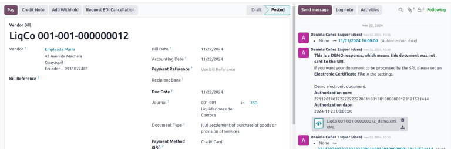
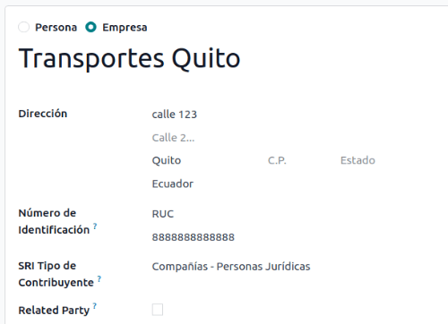
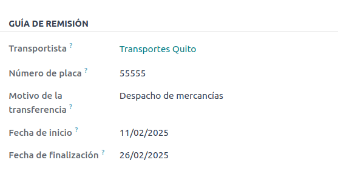
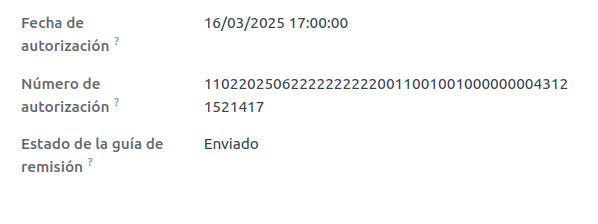
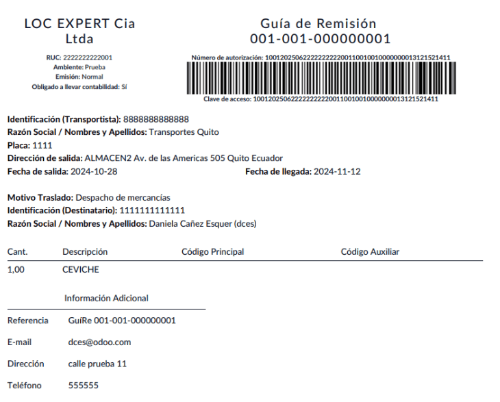

=======
Ecuador
=======

With the Ecuadorian localization, electronic documents can be generated using XML, fiscal
folio, electronic signature, and direct connection to tax authority SRI.

The supported documents are invoices, credit notes, debit notes, purchase liquidations, and
withholdings.

The localization also includes automation to easily predict the withholding tax to be applied to
each purchase invoice.

.. seealso::
   - `App Tour - Localización de Ecuador <https://www.youtube.com/watch?v=BQOXVSDeeK8>`_
   - `Smart Tutorial - Localización de Ecuador
     <https://www.odoo.com/slides/smart-tutorial-localizacion-de-ecuador-170>`_
   - :doc:`Documentation on e-invoicing's legality and compliance in Ecuador
     <../accounting/customer_invoices/electronic_invoicing/ecuador>`

.. tip::
   - **SRI**: *Servicio de Rentas Internas*, the government organization that enforces the payment
     of taxes in Ecuador.
   - **SRI certificate**: Document or digital credential issued by the *SRI* that is crucial for
     compliance with Ecuadorian tax laws.
   - **EDI**: *Electronic Data Interchange*, which refers to the electronic transmission of
     documents.
   - **RIMPE**: *Regimen Simplificado para Emprendedores y Negocios*, the type of taxpayer qualified
     for SRI.

.. _localizations/ecuador/module-installation:

Modules
=======

:doc:`Install </applications/general/apps_modules>` the following modules to get all the features of
the Ecuadorian localization:

.. list-table::
   :header-rows: 1
   :widths: 25 25 50

   * - Name
     - Technical name
     - Description
   * - :guilabel:`Ecuadorian - Accounting`
     - `l10n_ec`
     - The default :doc:`fiscal localization package <../fiscal_localizations>` adds accounting
       characteristics for the Ecuadorian localization, which represent the minimum configuration
       required for a company to operate in Ecuador according to the guidelines set by the
       :abbr:`SRI (servicio de rentas internas)`. The module's installation automatically loads:
       a chart of accounts, taxes, document types, and tax support types. Additionally, the
       generation of forms 103 and 104 is automatic.
   * - :guilabel:`Ecuadorian Accounting EDI`
     - `l10n_ec_edi`
     - Includes all the technical and functional requirements to generate and validate
       :doc:`Electronics Documents <../accounting/customer_invoices/electronic_invoicing>` based on
       the technical documentation published by the SRI. The authorized documents are: Invoices,
       Credit Notes, Debit Notes, Withholdings, and Purchase liquidations.
   * - :guilabel:`Ecuadorian Accounting Reports`
     - `l10n_ec_reports`
     - Includes all the technical and functional requirements to generate forms 103 and 104.
   * - :guilabel:`Ecuador - ATS Report`
     - `l10n_ec_reports_ats`
     - Includes all the technical and functional requirements to generate the ATS report XML file
       ready to be uploaded to the *DIMM Formularios*.
   * - :guilabel:`Ecuadorian Website`
     - `l10n_ec_website_sale`
     - Includes all the technical and functional requirements to generate automatic electronic
       invoices from a Website sale.
   * - :guilabel:`Ecuadorian Point of Sale`
     - `l10n_ec_edi_pos`
     - Includes all the technical and functional requirements to generate automatic electronic
       invoices from a POS sale.
   * - :guilabel:`Ecuadorian Delivery Guide`
     - `l10n_ec_edi_stock`
     - Includes all the technical and functional requirements to generate :ref:`electronic delivery
       guides <localizations/ecuador/electronic-delivery-guide>`.

.. note::
   In some cases, such as when upgrading to a version with additional modules, those modules may not
   be installed automatically. Any missing modules can be manually
   :doc:`installed </applications/general/apps_modules>`.

.. seealso::
   :doc:`/applications/hr/payroll/payroll_localizations` are documented separately.

.. _localizations/ecuador/specifics:

Localization overview
=====================

The Ecuadorian localization package ensures compliance with Ecuadorian fiscal and accounting
regulations. It includes tools for managing taxes, fiscal positions, reporting, and a predefined
chart of accounts tailored to Ecuador's standards.

The Ecuadorian localization package provides the following key features to ensure compliance with
local fiscal and accounting regulations:

- :doc:`../accounting/get_started/chart_of_accounts`: a predefined structure aligned with the latest
  standards of Ecuador’s *Superintendency of Companies*, organized into multiple categories and
  fully compatible with NIIF accounting
- :ref:`Products <localizations/ecuador/products>`
- :ref:`Taxes <localizations/ecuador/taxes>`: pre-configured tax rates, including standard VAT,
  zero-rated, and exempt options
- :doc:`../accounting/taxes/fiscal_positions`: automated tax adjustments based on customer or
  supplier registration status
- :ref:`Document types <localizations/ecuador/document types>`: classification of transactions like
  *customer invoices* and *vendor bills* using government-defined document types set by the SRI
  (Ecuador’s tax authority)
- :ref:`Company and contacts <localizations/ecuador/company-contact>`
- :ref:`Electronic documents <localizations/ecuador/electronic-documents>`
- :ref:`VAT withholding <localizations/ecuador/vat-withholding>`
- :ref:`Printer points <localizations/ecuador/printer-points>`
- :ref:`Withholding <localizations/ecuador/withholding>`
- :ref:`Reporting <localizations/ecuador/reporting>`

.. _localizations/ecuador/products:

Products
--------

If products have any :doc:`withholding taxes <../accounting/taxes/retention>`, they must be
configured on the product form. To do so, go to :menuselection:`Accounting --> Vendors -->
Products`. On the :guilabel:`General Information` tab, specify both :guilabel:`Purchase Taxes` and
:guilabel:`Profit Withhold`.

.. _localizations/ecuador/taxes:

Taxes
-----

To manage taxes, navigate to :menuselection:`Accounting --> Configuration --> Taxes`. Depending on
the tax type, the following options may be required for additional configuration:

- :guilabel:`Tax Name`: Follows a specific format depending on the tax type:

  - | **For IVA (Value-Added Tax)**:
    | `IVA [percent] (104, [form code] [tax support code] [tax support short name])`
    | Example: `IVA 12% (104, RUC [tax support code] IVA)`
  - | **For Income Tax Withholding codes**:
    | `Code ATS [percent of withhold] [withhold name]`
    | Example: `Code ATS 10% Retención a la Fuente`

- :guilabel:`Tax Support`: Configure only for the IVA tax. This option is used to register purchase
  withholdings.
- :guilabel:`Code ATS`: Configure only for income tax withholding codes, as it is necessary to
  register a withholding.

In the :guilabel:`Definition` tab:

- :guilabel:`Tax Grids`: Configure the code of a 104 form if it is an IVA tax, and the code of a
  103 form if it is an income tax withholding code.

.. seealso::
   :doc:`Configuring taxes <../accounting/taxes>`

.. _localizations/ecuador/document types:

Document types
--------------

To access or configure document types, go to :menuselection:`Accounting --> Configuration -->
Document Types`. Each document type can have a unique sequence per journal where it is assigned. As
part of the localization, the document type includes the country where the document is applicable;
also, the data is created automatically when the localization module is installed. The information
required for the document types is included by default and doesn't need to be changed.

.. _localizations/ecuador/company-contact:

Company and contact
-------------------

.. seealso::
   :doc:`Configure a company or individual contact <../../essentials/contacts>`

The following fields should be completed for localization purposes on the contact form:

- :guilabel:`Name`: Enter the company or individual's name.
- :guilabel:`Address`: The :guilabel:`Street` sub-field is required to confirm electronic invoices.
- :guilabel:`Identification Number`: For a company, enter the :guilabel:`Ruc`. For individuals,
  enter the :guilabel:`Cédula` or :guilabel:`Passport` number.
- :guilabel:`SRI Taxpayer Type`: Select the contact's SRI taxpayer type.
- :guilabel:`Phone`: Enter the company or individual's phone number.
- :guilabel:`Email`: Enter the company or individual's email. This email is used to send electronic
  documents, such as invoices.

.. note::
   The :guilabel:`SRI Taxpayer Type` indicated on the contact form determines which :ref:`VAT and
   profit withholding <localizations/ecuador/vat-withholding>` taxes apply when using this contact
   on a vendor bill.

.. _localizations/ecuador/electronic-documents:

Electronic documents
--------------------

To upload information for electronic documents, go to :menuselection:`Accounting --> Configuration
--> Settings`, and scroll to the :guilabel:`Ecuadorian Localization` section.

Configure the following information, starting with the :guilabel:`Electronic Invoicing` section:

- :guilabel:`Company legal name`
- :guilabel:`Regime`: Select whether the company is in the :guilabel:`Regular Regime (without
  additional messages in the RIDE)` or is qualified as in the :guilabel:`RIMPE Regime`.
- :guilabel:`Special Taxpayer Number`: If the company is qualified as a special taxpayer, complete
  this field with the company's corresponding tax contributor number.
- :guilabel:`Forced to Keep Accounting Books`: Enable this option if needed.

:guilabel:`Withholding` section:

- :guilabel:`Consumables`: Enter the code of the default withholding tax used when purchasing goods.
- :guilabel:`Services`: Enter the code of the default withholding tax used when purchasing services.
- :guilabel:`Credit Card`: Enter the code of the default withholding tax used when purchasing with
  credit cards.
- :guilabel:`Withhold Agent Number`: Enter the company's withholding agent resolution number, if
  applicable.

:guilabel:`SRI Connection` section:

- :guilabel:`Certificate file for SRI`: Select the company's :guilabel:`SRI certificate`. Click
  :icon:`oi-arrow-right` :guilabel:`SRI Certificates` to upload one, if necessary.
- :guilabel:`Use production servers`: Enable this option if electronic documents are used in the
  production environment; leave it disabled if the testing environment is used instead.

:guilabel:`Withholding accounts` section:

- :guilabel:`Sales Tax Base Account`: Enter the company's sales tax base account.
- :guilabel:`Purchase Tax Base Account`: Enter the company's sales tax purchase account.

.. important::
   When using the testing environment, EDI data is sent to test servers.

.. note::
   - The values entered in the :guilabel:`Consumables` and :guilabel:`Services` withholding fields
     are used as default values for domestic **only when** no withholdings are set up on the *SRI
     Taxpayer Type*.
   - The entered :guilabel:`Credit Card` withholding value is always applied when a credit or debit
     card SRI payment method is used.

.. _localizations/ecuador/vat-withholding:

VAT withholding
---------------

.. note::
   This configuration applies only if the SRI recognizes the company as a withholding agent. If not,
   skip this step.

To configure a VAT withholding, go to :menuselection:`Accounting --> Configuration --> Taxpayer Type
SRI`. Then, configure the :guilabel:`Name` of the taxpayer type, the :guilabel:`Goods VAT
Withholding`, and the :guilabel:`Services VAT Withholding`.

.. tip::
   If the :guilabel:`Taxpayer Type` is :guilabel:`Rimpe`, configure the :guilabel:`Profit Withhold`
   percentage.

.. _localizations/ecuador/printer-points:

Printer points
--------------

*Printer points* need to be configured for each type of electronic document used, such as customer
invoices, credit notes, and debit notes.

To configure printer points, navigate to :menuselection:`Accounting --> Configuration -->
Journals`. For each electronic document, click :guilabel:`New`, and enter the following information
on the journal form:

- :guilabel:`Journal Name`: Enter in this format: `[Emission Entity]-[Emission Point] [Document
  Type]`, e.g., `001-001 Sales Documents`.
- :guilabel:`Type`: Refers to the journal type; select :guilabel:`Sales`.

Once the :guilabel:`Type` is selected, complete the following fields:

- :guilabel:`Use Documents?`: Enable this option if legal invoicing (invoices, debit/credit notes)
  is used, as this is the standard configuration. If not, select the option to record accounting
  entries unrelated to legal invoicing documents, such as receipts, tax payments, or journal
  entries.
- :guilabel:`Emission Entity`: Enter the facility number.
- :guilabel:`Emission Point`: Enter the printer point.
- :guilabel:`Emission address`: Enter the address of the facility.

In the :guilabel:`Journal Entries` tab, under the :guilabel:`Accounting information` section, fill
in the following fields:

- :guilabel:`Default Income Account`: Enter the default income account.
- :guilabel:`Dedicated Credit Note Sequence`: Enable this option if *credit notes* should be
  generated from this printer point (i.e., the journal).
- :guilabel:`Dedicated Debit Note Sequence`: Enable this option if *debit notes* should be
  generated from this printer point (i.e., the journal).
- :guilabel:`Short Code`: Enter a unique 5-digit code for the accounting entry sequence (e.g.,
  VT001).

Customer invoices, credit notes, and debit notes must use the same journal as the
:guilabel:`Emission Point`, whereas the :guilabel:`Entity Point` should be unique per journal.

Finally, in the :guilabel:`Advanced Settings` tab, check the :guilabel:`Electronic invoicing`
checkbox to enable sending XML/EDI invoices.

.. seealso::
   :doc:`../accounting/customer_invoices/electronic_invoicing`

.. _localizations/ecuador/withholding:

Withholding
-----------

To define a *withholding journal*, go to :menuselection:`Accounting --> Configuration --> Journals`.
For each withholding journal, click :guilabel:`New`, and enter the following information:

- :guilabel:`Journal Name`: Enter this format: `[Emission Entity]-[Emission Point] [Document Type]`,
  e.g.,`001-001 Withholding`.
- :guilabel:`Type`: Refers to the journal type. Select :guilabel:`Miscellaneous`.
- :guilabel:`Withhold Type`: Select :guilabel:`Purchase Withhold`.

Once the :guilabel:`Type` and :guilabel:`Withhold Type` are selected, complete the following fields:

- :guilabel:`Emission Entity`: Enter the facility number.
- :guilabel:`Emission Point`: Enter the printer point.
- :guilabel:`Emission address`: Enter the address of the facility.

In the :guilabel:`Journal Entries` tab, under the :guilabel:`Accounting information` section, fill
in the following fields:

- :guilabel:`Default Account`: Configure the default income account.
- :guilabel:`Short Code`: Enter a unique 5-digit code for the accounting entry sequence (e.g.,
  `WT001`).

Finally, in the :guilabel:`Advanced Settings` tab, check the :guilabel:`Electronic invoicing`
checkbox to enable sending XML/EDI invoices.

.. _localizations/ecuador/reporting:

Reporting
---------

Ecuadorian companies submit fiscal reports to the SRI, with Odoo supporting two main ones: **reports
103** and **104**.

To get these reports, go to :menuselection:`Accounting --> Reporting --> Tax Return`.  Click the
:icon:`fa-book` :guilabel:`Report:` icon and select `103 (EC)` or `104 (EC)`.

.. _localizations/ecuador/report-103:

Report 103
~~~~~~~~~~

This report details income tax withholdings in a given period and can be reported monthly or
semi-annually. It includes information about base, tax amounts, and tax codes and can be used for
SRI reporting.

.. _localizations/ecuador/report-104:

Report 104
~~~~~~~~~~

This report details VAT tax and VAT withholding for a given period and can be generated monthly or
semi-annually. It includes information about base, tax amounts, and tax codes and can be used for
SRI reporting.

.. _localizations/ecuador/ats:

ATS report
~~~~~~~~~~

To enable downloading the ATS :abbr:`ATS (Anexo Transaccional Simplificado)` report in XML format,
:doc:`install </applications/general/apps_modules>` the *ATS Report* (`l10n_ec_reports_ats`) module.

.. note::
   The Ecuadorian *ATS Report* module depends on the previous installation of the *Accounting* app
   and the *Ecuadorian EDI module*.

.. _localizations/ecuador/ats-configuration:

Configuration
*************

To issue electronic documents, ensure the company is configured as explained in the
:ref:`electronic invoice <localizations/ecuador/company-contact>` section. In the :abbr:`ATS (Anexo
Transaccional Simplificado)`, every document generated in Odoo, such as :ref:`invoices
<localizations/ecuador/customer-invoice>`, :ref:`vendor bills <localizations/ecuador/vendor-bill>`,
:ref:`sales <localizations/ecuador/customer-withholdings>` and :ref:`purchases withholdings
<localizations/ecuador/purchase-withholding>`, :ref:`credit notes
<localizations/ecuador/credit-notes>`, and :ref:`debit notes <localizations/ecuador/debit-notes>`,
is included.

.. _localizations/ecuador/ats-vendor-bills:

Vendor bills
^^^^^^^^^^^^

When generating a :ref:`vendor bill <localizations/ecuador/vendor-bill>`, register the authorization
number from the vendor's invoice. To do so, go to :menuselection:`Accounting --> Vendors --> Bills`
and select the bill. Then, enter the number from the vendor's invoice in the
:guilabel:`Authorization Number` field.

.. _localizations/ecuador/ats-credit-debit-notes:

Credit and debit notes
^^^^^^^^^^^^^^^^^^^^^^

When creating a :ref:`credit <localizations/ecuador/credit-notes>` or :ref:`debit
<localizations/ecuador/debit-notes>` note manually or through an import, link it to the sales
invoice it modifies.

.. note::
   Some information is required to the documents before downloading the :abbr:`ATS (Anexo
   Transaccional Simplificado)` file. For example, add the *Authorization Number* and the *SRI
   Payment Method* to documents when needed.

.. _localizations/ecuador/ats-xml-generation:

XML generation
**************

To generate the :abbr:`ATS (Anexo Transaccional Simplificado)` report, go to
:menuselection:`Accounting --> Reporting --> Tax Return`. Choose a period for the desired :abbr:`ATS
(Anexo Transaccional Simplificado)` report, then click :guilabel:`ATS`. Then, upload the downloaded
XML file to *DIMM Formularios*.

.. note::
   When downloading the :abbr:`ATS (Anexo Transaccional Simplificado)` report, Odoo generates a
   warning pop-up alerting the user if a document(s) has missing or incorrect data. Nevertheless,
   the XML file can still be downloaded.

.. _localizations/ecuador/accounting:

Accounting
==========

.. _localizations/ecuador/sales-documents:

Sales documents
---------------

.. _localizations/ecuador/customer-invoice:

Customer invoice
~~~~~~~~~~~~~~~~

Customer invoices, electronic documents :doc:`created from sales orders or manually
<../accounting/customer_invoices/overview>`, must contain the following data and, once validated,
are sent to the SRI:

- :guilabel:`Journal`: Select the option matching the customer invoice's printer point.
- :guilabel:`Document Type`: Type the document type in this format: `(01) Invoice`.
- :guilabel:`Payment Method (SRI)`: Select how the invoice will be paid.

.. _localizations/ecuador/credit-notes:

Customer credit note
~~~~~~~~~~~~~~~~~~~~

:doc:`Customer credit notes <../accounting/customer_invoices/credit_notes>` are electronic
documents sent to the SRI once validated. :ref:`Credit notes
<accounting/credit_notes/issue-credit-note>` can only be registered from a validated (posted)
invoice.

Keep the :guilabel:`Document Type` on :guilabel:`(04) Credit Note` in the :guilabel:`Credit note`
window.

Filling out a credit note follows the same process as completing an :ref:`invoice
<accounting/invoice/creation>`.

.. note::
   When creating the first credit note, select :guilabel:`Reverse` and assign the first credit note
   number or, by default, Odoo assigns `NotCr 001-001-000000001` as the first credit note number.

.. _localizations/ecuador/debit-notes:

Customer debit note
~~~~~~~~~~~~~~~~~~~

:ref:`Customer debit notes <accounting/credit_notes/issue-debit-note>` are electronic documents sent
to the SRI once validated. They can only be registered from a validated (posted) invoice.

In the :guilabel:`Use Specific Journal` of the :guilabel:`Create Debit Note` window, select the
printer point for the credit note or leave it empty to use the same journal as the original
invoice.

.. _localizations/ecuador/customer-withholdings:

Customer withholding
~~~~~~~~~~~~~~~~~~~~

:guilabel:`Customer withholdings` are non-electronic documents issued by the client to apply a
withholding to a sale. They can only be registered from a validated (posted) invoice.

On the invoice, click :guilabel:`Add Withhold` and complete the following information in the
:guilabel:`Customer withholding` window:

- :guilabel:`Document Number`: Enter the withholding number.
- :guilabel:`Withhold Lines`: Select the taxes that the customer is withholding.

Before validating the withholding, review that the amounts for each tax are the same as the original
document.

.. _localizations/ecuador/purchase-documents:

Purchase documents
------------------

.. _localizations/ecuador/vendor-bill:

Vendor bill
~~~~~~~~~~~

:doc:`Vendor bills <../accounting/vendor_bills>`, non-electronic documents created from purchase
orders or manually, require a specific :ref:`vendor bill journal
<localizations/ecuador/vendor-bills-journal>`.

.. _localizations/ecuador/vendor-bills-journal:

Vendor bills journal
********************

Use the following configuration to set up the vendor bills journal:

- Select :guilabel:`Purchase` as the :guilabel:`Type`.
- **Do not** tick the :guilabel:`Purchase Liquidations` checkbox.
- Add a :guilabel:`Default Expense Account`.

To configure a vendor bill, make sure also to complete the following Ecuador-specific fields:

- :guilabel:`Document Type`: Enter this document type: `(01) Invoice`.
- :guilabel:`Document number`: Enter the document number.
- :guilabel:`Payment Method (SRI)`: Select how to pay the vendor bill.

.. important::
   When creating the purchase withholding, verify that the bases (base amounts) are correct. If the
   amount of the tax in the :guilabel:`Vendor bill` needs to be edited, click :guilabel:`Edit`. Or,
   from the :guilabel:`Journal Items` tab, click :guilabel:`Edit` and set the adjustment as desired.

.. _localizations/ecuador/purchase-liquidation:

Purchase liquidation
~~~~~~~~~~~~~~~~~~~~

*Purchase liquidations* are electronic documents sent to the SRI once they're validated. Companies
issue them when they make a purchase, but the vendor does not provide an invoice due to one or more
of the following reasons:

- Non-residents of Ecuador provided services.
- Foreign companies provided services without residency or facility in Ecuador.
- Purchase of goods or services from natural persons not registered with a RUC, who cannot issue
  sales receipts or customer invoices.
- Reimbursement for purchasing goods or services must be given to employees in a dependency
  relationship (full-time employee).
- Members of collegiate bodies have provided services in the exercise of their function.

In these cases, a :ref:`purchase liquidation journal
<localizations/ecuador/purchase-liquidation-journal>` must be created.

.. _localizations/ecuador/purchase-liquidation-journal:

Create a purchase liquidation journal
*************************************

To create a *purchase liquidations* journal, enter the following information:

- :guilabel:`Journal Name`: Enter this format: `[Emission Entity]-[Emission Point] [Document Type]`,
  e.g., `001-001 Purchase Liquidations`.
- :guilabel:`Type`: Refers to the journal type. Select :guilabel:`Purchase`.

Once the :guilabel:`Type` is selected, complete the following fields:

- :guilabel:`Purchase Liquidations`: Tick this checkbox to enable purchase liquidations.
- :guilabel:`Use Documents?`: Enable this option if legal invoicing (invoices, debit/credit notes)
  is used, as this is the standard configuration. If not, select the option to record accounting
  entries unrelated to legal invoicing documents, such as receipts, tax payments, or journal
  entries.
- :guilabel:`Emission Entity`: Enter the facility number.
- :guilabel:`Emission Point`: Enter the printer point.
- :guilabel:`Emission address`: Enter the address of the facility.
- :guilabel:`Short Code`: Enter a unique 5-digit code for the accounting entry sequence (e.g.,
  `PT001`).

Finally, in the :guilabel:`Advanced Settings` tab, check the :guilabel:`Electronic invoicing`
checkbox to enable sending XML/EDI invoices.

.. _localizations/ecuador/purchase-liquidation-creation:

Create a purchase liquidation
*****************************

Purchase liquidations, created from *purchase orders* or manually from *vendor bills*, must contain
the following data:

- :guilabel:`Vendor`: Enter the vendor's information.
- :guilabel:`Journal`: Select the :guilabel:`Purchase Liquidation` journal with the correct printer
  point.
- :guilabel:`Document Type`: Enter this document type: `(03) Purchase Liquidation`.
- :guilabel:`Document number`: Enter the document number (sequence). This must only be entered once,
  and the sequence will automatically be assigned to the subsequent documents.
- :guilabel:`Payment Method (SRI)`: Select how to pay the invoice.
- :guilabel:`Products`: Specify the product with the correct taxes.

Then, validate the :guilabel:`Purchase Liquidation`.

.. _localizations/ecuador/purchase-withholding:

Purchase withholding
~~~~~~~~~~~~~~~~~~~~

*Purchase withholdings* are electronic documents sent to the SRI once they're validated. They can
only be registered from a validated (posted) invoice.

On the invoice, click :guilabel:`Add Withhold` and complete the following fields in the
:guilabel:`Withhold` window:

- :guilabel:`Document number`: Enter the document number (sequence). This must only be entered once,
  and the sequence will automatically be assigned for the next documents.
- :guilabel:`Withhold lines`: The taxes appear automatically according to the configuration of
  products and vendors. Review if the taxes and tax support are correct. If not, edit and select
  the correct taxes and tax support.

Then, validate the :guilabel:`Withholding`.

.. note::
   Tax support types must be configured on the :guilabel:`Vendor Bill`. To do so, go to the tax
   applied on the :guilabel:`Vendor Bill` and change the :guilabel:`Tax Support` there.

A withholding tax can be divided into two or more lines, depending on whether two or more
withholding percentages apply.

.. example::
   Odoo suggests a VAT withholding of 30% with tax support 01. VAT withholding of 70% can be added
   to a new line with the same tax support. Odoo allows it if the base total matches the
   :guilabel:`Vendor Bill`'s total.

.. _localizations/ecuador/expense reimbursement:

Expense reimbursement
---------------------

Expense reimbursements apply to the following cases:

- :guilabel:`Individual`: reimbursement to an employee for miscellaneous expenses (e.g., purchase
  liquidations)
- :guilabel:`Legal Entity`: reimbursement for incurred expenses, such as representation expenses
  (e.g., hiring a lawyer)

To enable expense reimbursement, make sure a :ref:`purchase liquidation journal
<localizations/ecuador/purchase-liquidation>` has been created for an individual or a :ref:`vendor
bills journal <localizations/ecuador/vendor-bill>` for a legal entity.

.. note::
   In the vendor bills journal, be sure the following necessary configurations are set for a legal
   entity:

   - Select :guilabel:`Purchase` as the :guilabel:`Type`.
   - **Do not** tick the :guilabel:`Purchase Liquidations` checkbox.
   - Add a :guilabel:`Default Expense Account`.

Next, to create a reimbursement, :ref:`create a vendor bill <localizations/ecuador/vendor-bill>`
using the *purchase liquidation* or *vendor bills* journal. On the vendor bill, configure the
following fields:

- :guilabel:`Vendor`: This field should be an employee.
- :guilabel:`Document Type`: Verify that this field is accurately populated from the journal.
- :guilabel:`Payment Method (SRI)`: Select a payment method.
- :guilabel:`Reimbursement Lines` tab: Click :guilabel:`Auto Fill Invoice Lines` to automatically
  populate the invoice lines or add the expenses line by line, and provide the following details for
  each expense:

  - :guilabel:`Partner or authorization number`
  - :guilabel:`Date`
  - :guilabel:`Document Type`
  - :guilabel:`Document Number`
  - :guilabel:`Tax Base`
  - :guilabel:`Tax`

Then, click :guilabel:`Confirm Vendor Bill` and :guilabel:`Process Now`. The XML and authorization
number for the purchase liquidation are recorded, and the purchase withholding created from this
vendor bill includes the reimbursement information.

.. _localizations/ecuador/electronic-delivery-guide:

Electronic delivery guide
-------------------------

An *Electronic Delivery Guide* in Ecuador is a legal document that supports the transportation of
goods or merchandise from one place to another within the national territory. It is issued by the
sender of the goods and aims to record and justify the movement of products to avoid legal or tax
issues. It is a fiscal requirement mandated by the *Internal Revenue Service (SRI)*.

.. important::
   Make sure to :doc:`install </applications/general/apps_modules>` the :guilabel:`Ecuadorian
   Delivery Guide` (`l10n_ec_edi_stock`) module.

.. _localizations/ecuador/transporter:

Transporter
~~~~~~~~~~~

To create a new carrier (transporter), first :doc:`create a new contact <../../essentials/contacts>`
and fill out the contact information as a :guilabel:`Company`. Make sure the following fields are
complete:

- :guilabel:`Identification Number`: Select :guilabel:`RUC` and type the carrier's RUC number.
- :guilabel:`SRI Taxpayer Type`: Select :guilabel:`Companies - Legal Entities` as the partner
  position in the tax pyramid to automate the computation of VAT withholdings.

.. _localizations/ecuador/certificate-file:

Certificate file for SRI
~~~~~~~~~~~~~~~~~~~~~~~~

To upload the certificate file for SRI, go to :menuselection:`Accounting --> Configuration -->
Settings`, scroll to the :guilabel:`Ecuadorian Localization` section, and click
:icon:`oi-arrow-right` :guilabel:`SRI Certificates` in the :guilabel:`SRI Connection` section. Then,
to create a new certificate, click :guilabel:`New` and fill out the following fields:

- :guilabel:`Name`: The title of the certificate.
- :guilabel:`Certificate`: Use the :guilabel:`Upload your file` button to upload the SRI
  certificate.
- :guilabel:`Certificate Password`: Include the password to decrypt the PKS file if required.

Once the certificate is created, click :guilabel:`Settings` to go back to the settings and ensure
the certificate is selected in the :guilabel:`Certificate file for SRI` field and the :guilabel:`Use
production servers` checkbox is ticked.

.. _localizations/ecuador/warehouse configuration:

Warehouse configuration
~~~~~~~~~~~~~~~~~~~~~~~

To configure a warehouse, first :doc:`create a new warehouse
<../../inventory_and_mrp/inventory/warehouses_storage/inventory_management/warehouses>`. Enter the
following data for each warehouse that generates an electronic delivery guide:

- :guilabel:`Entity Point`: the emission entity number given by the SRI
- :guilabel:`Emission Point`: the emission point number given by the SRI
- :guilabel:`Next Delivery Guide Number`: the forwarding tracking number (editable after first
  saving the warehouse).

.. _localizations/ecuador/generate-electronic-delivery:

Generate an electronic delivery guide
~~~~~~~~~~~~~~~~~~~~~~~~~~~~~~~~~~~~~

Once the :doc:`delivery <../../inventory_and_mrp/inventory/shipping_receiving/setup_configuration>`
from inventory is created during the sales workflow, make sure the following fields are complete in
the :guilabel:`Delivery Guide` section on the :guilabel:`Additional info` tab:

- :guilabel:`Transporter`: Enter the :ref:`contact <localizations/ecuador/transporter>` created.
- :guilabel:`Plate Number`: Enter the vehicle plate number.
- :guilabel:`Transfer Reason`: By default, :guilabel:`Goods dispatch` is set; modify as needed.
- :guilabel:`Start date`: Automatically set to the creation date (editable).
- :guilabel:`End date`: Automatically set to 15 days after the start date (editable).

Click :guilabel:`Validate`, then :guilabel:`Generate Delivery Guide`. Subsequently, the following
information will be available in the :guilabel:`Delivery Guide` section:

- :guilabel:`Authorization date`: date on which the government authorizes the document.
- :guilabel:`Authorization number`: EDI authorization number (same as access key).
- :guilabel:`Delivery Guide Status`: status of the delivery guide.

To receive the XML and PDF, an email can be sent to the contact used in the :guilabel:`Delivery
Address` field  - this is an optional and manual step; the :guilabel:`Send Email` button needs to be
clicked.

.. _localizations/ecuador/ecommerce:

eCommerce
=========

The :ref:`ATS Report module <localizations/ecuador/ats>` enables the following:

- Choose the *SRI Payment Method* for each payment method's configuration.
- Customers can manually input their identification type and number during eCommerce checkout.
- Automatically generate a valid electronic invoice for Ecuador at the end of the checkout process.

.. seealso::
   :doc:`eCommerce documentation <../../websites/ecommerce>`

.. _localizations/ecuador/online-payments:

Online payments
---------------

To enable online payments, add the relevant :doc:`payment provider(s) <../payment_providers>` and
configure the necessary :ref:`payment methods <payment_providers/payment_methods>`. It is mandatory
to set the :guilabel:`SRI Payment Method` for each method.

.. note::
   Adding the :guilabel:`SRI Payment Method` is necessary to correctly generate the electronic
   invoice from an eCommerce sale. Select a **payment method** to access its configuration menu and
   field.

.. _localizations/ecuador/automatic-invoice:

Automatic invoice
-----------------

:ref:`Invoices <handling/legal>` can be generated after the checkout process.

.. tip::
   The invoice's email template can be modified from the :guilabel:`Invoice Email Template` field
   under the :guilabel:`Automatic Invoice` option.

.. important::
   The sales journal used for invoicing is the first in the priority sequence in the
   :guilabel:`Journal` menu.

.. _localizations/ecuador/ecommerce-workflow:

Identification type and number
------------------------------

During the checkout process, the client making a purchase will have the option to indicate their
identification type and number. This information is required to generate the electronic invoice
after the checkout is completed correctly.

.. note::
   Verification is done to ensure the :guilabel:`Identification Number` field is completed and has
   the correct number of digits. For RUC identification, 13 digits are required, and for Cédula, 9
   digits are required.

After finishing the checkout process, a confirmed invoice is generated, ready to be sent manually or
asynchronously to the SRI.

.. _localizations/ecuador/point-of-sale:

Point of sale electronic invoicing
==================================

Make sure the *Ecuadorian module for Point of Sale* (`l10n_ec_edi_pos`) is :ref:`installed
<localizations/ecuador/module-installation>` to enable the following features and configurations:

- Choose the SRI payment method in each payment method configuration.
- Manually input the customer's identification type and number when creating a new contact on *POS*.
- Automatically generate a valid electronic invoice for Ecuador at the end of the checkout process.

.. _localizations/ecuador/payment-method-configuration:

Payment method configuration
----------------------------

To :doc:`create a payment method for a point of sale <../../sales/point_of_sale/payment_methods>`,
go to :menuselection:`Point of Sale --> Configuration --> Payment Methods`. Then, set the
:guilabel:`SRI Payment Method` in the payment method form.

.. _localizations/ecuador/invoicing-flow:

Invoicing flows
---------------

.. _localizations/ecuador/identification-type-number:

Identification type and number
~~~~~~~~~~~~~~~~~~~~~~~~~~~~~~

The P0S cashier can :ref:`create a new contact for a customer <pos/customers>` who requests an
invoice from an open POS session.

The *Ecuadorian Module for Point of Sale* adds two new fields to the contact creation form:
:guilabel:`Identification Type` and :guilabel:`Tax ID`.

.. note::
   As the identification number length differs depending on the identification type, Odoo
   automatically checks the :guilabel:`Tax ID` field when saving the contact form. To manually
   ensure the length is correct, know that the :guilabel:`RUC` and :guilabel:`Citizenship` types
   require 13 and 10 digits, respectively.

.. _localizations/ecuador/anonymous-end-consumer:

Electronic invoice: anonymous end consumer
~~~~~~~~~~~~~~~~~~~~~~~~~~~~~~~~~~~~~~~~~~

When clients do not request an electronic invoice for their purchase, Odoo automatically sets the
customer as :guilabel:`Consumidor Final` and generates an electronic invoice anyway.

.. note::
   If the client requests a credit note due to a return of this type of purchase, the credit note
   should be made using the client's real contact information. Credit notes cannot be created for
   *Consumidor Final* and can be managed :ref:`directly from the POS session <pos/refund>`.

.. _localizations/ecuador/specific-customer:

Electronic invoice: specific customer
~~~~~~~~~~~~~~~~~~~~~~~~~~~~~~~~~~~~~

If a customer requests an invoice for their purchase, it is possible to select or create a contact
with their fiscal information. This ensures the invoice is generated with accurate customer details.

.. note::
   If the client requests a credit note due to a return of this type of purchase, the credit note
   and return process can be managed :ref:`directly from the POS session <pos/refund>`.
