=======
Ecuador
=======

Introduction
============

With the Ecuadorian localization you can generate electronic documents with its XML, Fiscal folio,
with electronic signature and direct connection to tax authority SRI.

The supported documents are Invoices, Credit Notes, Debit Notes, Purchase Liquidations and
Withholds.

The localization also Includes automations to easily predict the withholding tax to be applied to
each purchase invoice.

.. seealso::
   - `App Tour - Localización de Ecuador <https://www.youtube.com/watch?v=BQOXVSDeeK8>`_
   - `Smart Tutorial - Localización de Ecuador <https://www.odoo.com/slides/smart-tutorial-localizacion-de-ecuador-170>`_

Glossary
--------

Here are some terms that are essential on the Ecuadorian localization:

- **SRI**: meaning *Servicio de Rentas Internas*, the government organization that enforces pay of
  taxes in Ecuador.
- **EDI**: stands for *Electronic Data Interchange*, which refers to the sending of Electronics
  Documents.
- **RIMPE**: stands for *Regimen Simplificado para Emprendedores y Negocios*, the type of taxpayer
  qualified for SRI.

Configuration
=============

Modules installation
--------------------

:ref:`Install <general/install>` the following modules to get all the features of the Ecuadorian
localization:

.. list-table::
   :header-rows: 1
   :widths: 25 25 50

   * - Name
     - Technical name
     - Description
   * - :guilabel:`Ecuadorian - Accounting`
     - `l10n_ec`
     - The default :doc:`fiscal localization package <../fiscal_localizations>`, adds accounting
       characteristics for the Ecuadorian localization, which represent the minimum configuration
       required for a company to operate in Ecuador according to the guidelines set by the
       :abbr:`SRI (servicio de rentas internas)`. The module's installation automatically loads:
       Chart of Accounts, taxes, documents types, tax support types. Additionally, the generation of
       forms 103 and 104 are automatic.
   * - :guilabel:`Ecuadorian Accounting EDI`
     - `l10n_ec_edi`
     - Includes all the technical and functional requirements to generate and validate
       :doc:`Electronics Documents
       <../accounting/customer_invoices/electronic_invoicing>`, based on the Technical
       documentation published by the SRI. The authorized documents are: Invoices, Credit Notes,
       Debit Notes, Withholdings and Purchase liquidations.

.. note::
   When you install a database from scratch selecting `Ecuador` as the country, Odoo automatically
   installs the base module :guilabel:`Ecuadorian - Accounting`.

Configure your company
----------------------

To configure your company information, go to the :guilabel:`Contacts` app and search the name given
to your company or activate :ref:`developer mode <developer-mode>` and go to :menuselection:`Company
--> Contact` and then edit the contact to configure the following information:

#. Check the :guilabel:`Company` option on top

   - :guilabel:`Name`
   - :guilabel:`Address`
   - :guilabel:`Identification Number`
   - :guilabel:`Taxpayer Type`
   - :guilabel:`Phone`
   - :guilabel:`Email`

#. Upload company logo and save

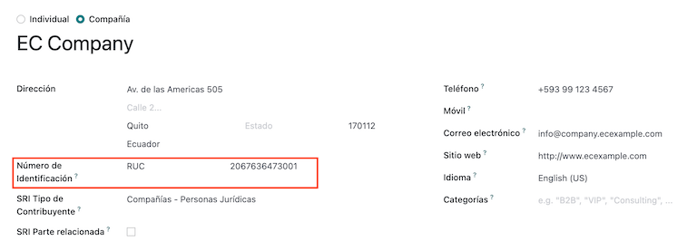

Electronic documents
--------------------

To upload your information for electronic documents go to :menuselection:`Accounting -->
Configuration --> Settings` and search for :command:`Ecuadorian Localization`.

Configure the next information:

- :guilabel:`Company legal name`
- :guilabel:`Use production servers`: check the checkbox if your company is going to do electronic
  documents in the production environment. If you want to use the testing environment for electronic
  documents then keep the checkbox unchecked.
- :guilabel:`Regime`: select if your company is in General Regular or is qualified as RIMPE.
- :guilabel:`Forced to keep accounting books`: check the checkbox if your company has this
  condition.
- :guilabel:`Default taxes for withholdings`
- :guilabel:`Issue withholds`: check the checkbox if your company is going to do electronic
  withholds.
- :guilabel:`Withhold consumibles`: put the code of the withholding for when you buy goods.
- :guilabel:`Withhold services`: put the code of the withholding for when you buy services.
- :guilabel:`Withhold credit card`: put the code of the withholding for when you buy with credit
  card
- :guilabel:`Withhold agent number`: put the company withholding agent resolution number, if
  applicable for your company.
- :guilabel:`Electronic Certificate File`: upload electronic certificate and password, then save it.
- :guilabel:`Special tax contributor number`: if your company is qualified as a special taxpayer,
  fill out this field with it's corresponding tax contributor number.

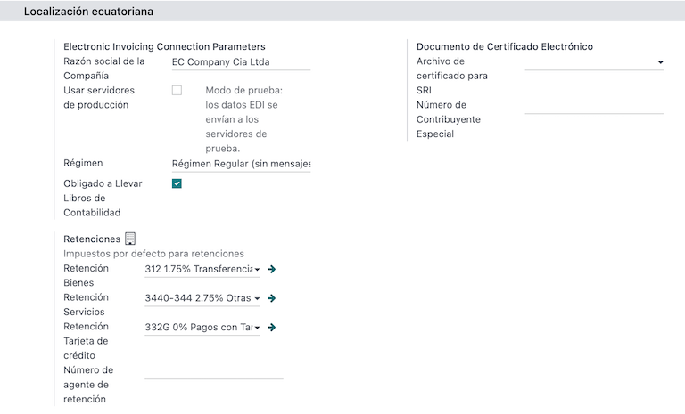

.. note::
   When configuring the withholdings in the configuration menu, these suggested withholdings are
   only for domestic suppliers when no withholdings are setup on their *Taxpayer Type*. Moreover,
   the Credit Card withholding set up is always used when a Credit or Debit Card SRI Payment Metho
   is used.

VAT withholding
---------------

This configuration only applies if you are qualified as a *Withholding Agent* by the SRI, otherwise
skip this step. To configure your VAT withholding, go to :menuselection:`Accounting --> Accounting
--> Configuration --> Ecuadorian SRI: Taxpayer Type SRI`.

You must configure the withholding percentage that applies for each type of taxpayer, specify the
:guilabel:`Goods VAT Withholding` and the :guilabel:`Services VAT Withholding`.

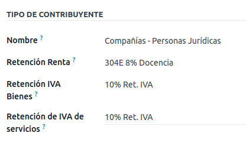

.. tip::
   In the case that the :guilabel:`Taxpayer Type` is `RIMPE`, also configure the :guilabel:`Profit
   Withholding` percentage.

Printer points
--------------

To configure your printer points, go to :menuselection:`Accounting --> Configuration --> Accounting:
Journals`.

Printer points need to be configured for each type of electronic document that you need. For
example: Customer Invoice, Credit Notes, and Debit Notes

For each printer point, you need to configure the following information:

- :guilabel:`Journal Name`: in this format `[Emission Entity]-[Emission Point] [Document Type]`, for
  example: `001-001 Sales Documents`.
- :guilabel:`Type`: refers to the type of journal, select `Sales`.
- :guilabel:`Use Documents?`: this checkbox is automatically checked, leave it checked.
- :guilabel:`Emission Entity`: configure the establishment number.
- :guilabel:`Emission Point`: configure the printer point.
- :guilabel:`Emission address`: configure the address of the establishment.
- :guilabel:`Default income account`: configure the default income account.
- :guilabel:`Dedicated Credit Note Sequence`: check the checkbox if *Credit Notes* are to be
  generated from this printer point - journal.
- :guilabel:`Short Code`: This is the unique code for the sequence of accounting entries, enter a
  unique 5-digit code, for example: `VT001`

Customer Invoice, Credit Notes and Debit Notes need to use the same journal as the
:guilabel:`Emission Point`, and the :guilabel:`Entity Point` should be unique per journal.

.. image:: ecuador/printer-point.png
   :align: center
   :alt: Configuring a printer point for Ecuador electronic document type of Customer Invoices.

.. note::
   In the :guilabel:`Advanced Settings` tab, check the :guilabel:`Electronic Invoicing` checkbox to
   enable it for Ecuador.

.. seealso::
   :doc:`../accounting/customer_invoices/electronic_invoicing`

Withholding
-----------

A Withholding Journal must be defined, go to go to :menuselection:`Accounting --> Configuration -->
Accounting:  Journals` where you need to configure the following information:

- :guilabel:`Journal Name`: in this format `[Emission Entity]-[Emission Point] [Document Type]`, for
  example: `001-001 Withholding`.
- :guilabel:`Type`: refers to the type of journal, select `Miscellaneous`.
- :guilabel:`Withhold Type`: Configure Purchase Withholding.
- :guilabel:`Use Documents?`: this checkbox is automatically checked, leave it checked.
- :guilabel:`Emission Entity`: configure the establishment number.
- :guilabel:`Emission Point`: configure the printer point.
- :guilabel:`Emission address`: configure the address of the establishment.
- :guilabel:`Default account`: configure the default income account.
- :guilabel:`Short Code`: This is the unique code for the sequence of accounting entries, enter a
  unique 5-digit code, for example: `RT001`

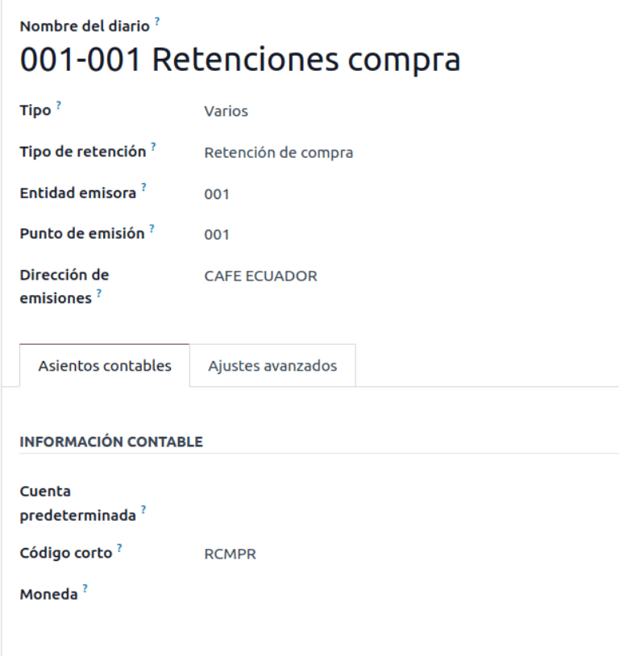

.. note::
   In the :guilabel:`Advanced Settings` tab, check the :guilabel:`Electronic Invoicing` checkbox to
   enable the sending of electronic invoicing for the withholding.

Purchase Liquidations
---------------------

When using Purchase Liquidations, a specific journal must be created, go to
:menuselection:`Accounting --> Configuration --> Accounting:  Journals` and configure the following
information:

- :guilabel:`Journal Name`: in this format `[Emission Entity]-[Emission Point] [Document Type]`, for
  example: `001-001 Withhold`.
- :guilabel:`Type`: refers to the type of journal, select `Miscellaneous`.
- :guilabel:`Purchase Liquidations`: check the checkbox to enable purchase liquidations.
- :guilabel:`Use Documents?`: this checkbox is automatically checked, leave it checked.
- :guilabel:`Emission Entity`: configure the establishment number.
- :guilabel:`Emission Point`: configure the printer point.
- :guilabel:`Emission address`: configure the address of the establishment.
- :guilabel:`Short Code`: This is the unique code for the sequence of accounting entries, enter a
  unique 5-digit code, for example: `RT001`

.. image:: ecuador/purchase-liqudations.png
   :align: center
   :alt: Configuring purchase liquidations for Ecuador electronic document type of Withholding.

.. note::
   In the :guilabel:`Advanced Settings` tab, check the :guilabel:`Electronic Invoicing` checkbox to
   enable the sending of electronic invoicing for the withholding.

Configure master data
---------------------

Chart of accounts
~~~~~~~~~~~~~~~~~

The :doc:`chart of accounts <../accounting/get_started/chart_of_accounts>`
is installed by default as part of the set of data included in the localization module, the accounts
are mapped automatically in Taxes, Default Account Payable, Default Account Receivable.

The chart of accounts for Ecuador is based on the most updated version of Superintendency of
Companies, which is grouped in several categories and is compatible with NIIF accounting.

You can add or delete accounts according to the company's needs.

Products
~~~~~~~~

In addition to the basic information in your products, you must add the configuration of the
withholding code (tax) that applies.

Go to :menuselection:`Accounting --> Vendors:  Products` under the tab "Purchase"

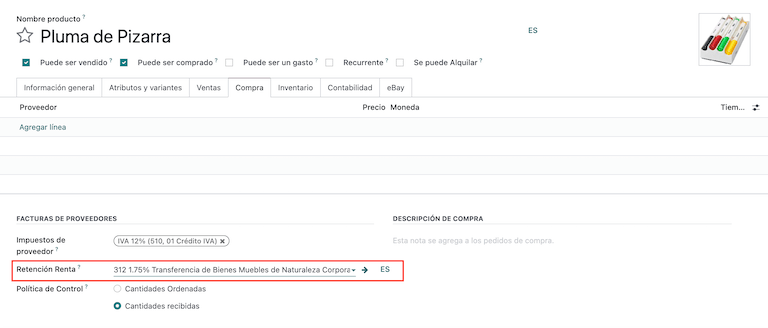

Contacts
~~~~~~~~

Configure the next information when you create a contact:

- Check the :guilabel:`Company` option on top if it is a contact with RUC, or check
  :guilabel:`Individual` if it is a contact with cedula or passport.
- :guilabel:`Name`
- :guilabel:`Address`: :guilabel:`Street` is a required field to confirm the Electronic Invoice.
- :guilabel:`Identification Number`: select an identification type `RUC`, `Cedula`, or `Passport`.
- :guilabel:`Taxpayer Type`: select the contact's SRI Taxpayer Type.
- :guilabel:`Phone`
- :guilabel:`Email`

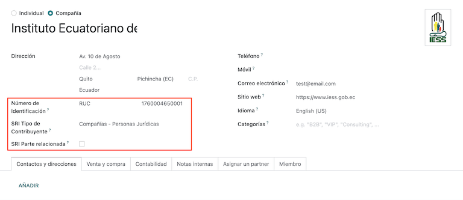

.. note::
   The :guilabel:`SRI Taxpayer Type` has inside the configuration of which VAT and Profit
   withholding will apply when you use this contact on Vendor Bill, and then create a withholding
   from there.

Review your taxes
~~~~~~~~~~~~~~~~~

As part of the localization module, taxes are automatically created with its configuration and
related financial accounts.

.. image:: ecuador/taxes.png
   :align: center
   :alt: Taxes for Ecuador.

The following options have been automatically configured:

- :guilabel:`Tax Support`: to be configured only in the IVA tax, this option is useful when you
  register purchase withholdings.
- :guilabel:`Code ATS`: to be configured only for income tax withholding codes, it is important when
  you register the withholding.
- :guilabel:`Tax Grids`: configure the codes of 104 form if it is a IVA tax and configure the codes
  of 103 form if it is a  income tax withholding code.
- :guilabel:`Tax Name`:

  - For IVA tax, format the name as: `IVA [percent] (104, [form code] [tax support code] [tax support
    short name])`
  - For income tax withholding code, format the name as: `Code ATS [Percent of withhold] [withhold
    name]`

Once the Ecuador module is installed, the most common taxes are automatically configured. If you
need to create an additional one, you can do so, for which you must base yourself on the
configuration of the existing taxes.

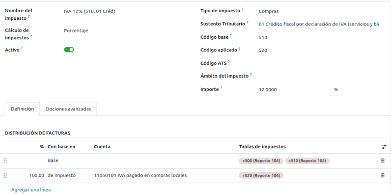

Review your Document Types
~~~~~~~~~~~~~~~~~~~~~~~~~~

Some accounting transactions like *Customer Invoices* and *Vendor Bills* are classified by document
types. These are defined by the government fiscal authorities, in this case by the SRI.

Each document type can have a unique sequence per journal where it is assigned. As part of the
localization, the document type includes the country on which the document is applicable; also the
data is created automatically when the localization module is installed.

The information required for the document types is included by default so the user does not need to
fill anything there.

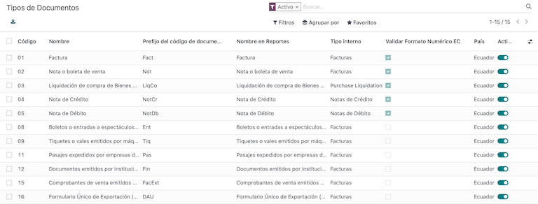

Workflows
=========

Once you have configured your database, you can register your documents.

Sales documents
---------------

Customer invoices
~~~~~~~~~~~~~~~~~

:guilabel:`Customer invoices` are electronic documents that, when validated, are sent to SRI. These
documents can be created from your sales order or manually. They must contain the following data:

- :guilabel:`Customer`: type the customer's information.
- :guilabel:`Journal`: select the option that matches the printer point for the customer invoice.
- :guilabel:`Document Type`: type document type in this format `(01) Invoice`.
- :guilabel:`Payment Method (SRI)`: select how the invoice is going to be paid.
- :guilabel:`Products`: specify the product with the correct taxes.

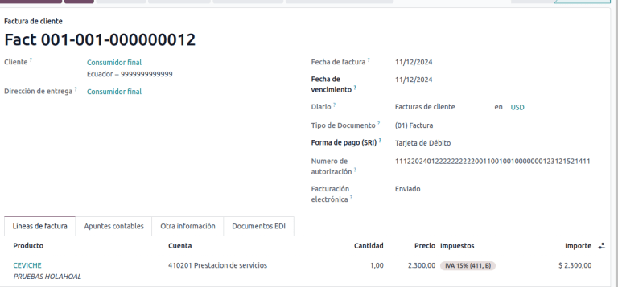

Customer credit note
~~~~~~~~~~~~~~~~~~~~

The :doc:`Customer credit note <../accounting/customer_invoices/credit_notes>` is an
electronic document that, when validated, is sent to SRI. It is necessary to have a validated
(posted) invoice in order to register a credit note. On the invoice there is a button named
:guilabel:`Credit note`, click on this button to be directed to the :guilabel:`Create credit note`
form, then complete the following information:

- :guilabel:`Credit Method`: select the type of credit method.

  - :guilabel:`Partial Refund`: use this option when you need to type the first number of documents
    and if it is a partial credit note.
  - :guilabel:`Full Refund`: use this option if the credit note is for the total invoice and you
    need the credit note to be auto-validated and reconciled with the invoice.
  - :guilabel:`Full refund and new draft invoice`: use this option if the credit note is for the
    total invoice and you need the credit note to be auto-validated and reconciled with the invoice,
    and auto-create a new draft invoice.

- :guilabel:`Reason`: type the reason for the credit note.
- :guilabel:`Rollback Date`: select the :guilabel:`specific` options.
- :guilabel:`Reversal Date`: type the date.
- :guilabel:`Use Specific Journal`: select the printer point for your credit note, or leave it empty
  if you want to use the same journal as the original invoice.

Once reviewed, you can click on the :guilabel:`Reverse` button.

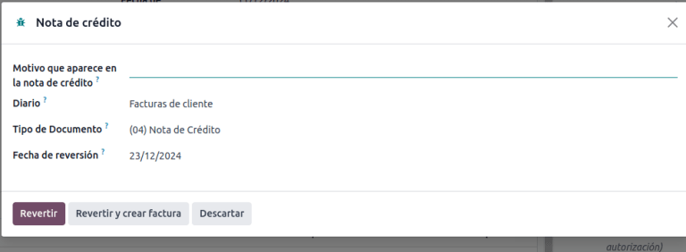

When the :guilabel:`Partial Refund` option is used, you can change the amount of the credit note and
then validate it. Before validating the credit note, review the following information:

- :guilabel:`Customer`: type the customer's information.
- :guilabel:`Journal`: select the printer point for the customer Credit Note.
- :guilabel:`Document Type`: this is the document type `(04) Credit Note`.
- :guilabel:`Products`: It must specify the product with the correct taxes.

.. image:: ecuador/customer-credit-note.png
   :align: center
   :alt: Customer Credit Note for Ecuador.

Customer debit note
~~~~~~~~~~~~~~~~~~~

The :guilabel:`Customer debit note` is an electronic document that, when validated, is sent to SRI.
It is necessary to have a validated (posted) invoice in order to register a debit note. On the
invoice there is a button named :guilabel:`Debit Note`, click on this button to be directed to the
:guilabel:`Create debit note` form, then complete the following information:

- :guilabel:`Reason`: type the reason for the debit note.
- :guilabel:`Debit note date`: select the :guilabel:`specific` options.
- :guilabel:`Copy lines`: select this option if you need to register a debit note with the same
  lines of invoice.
- :guilabel:`Use Specific Journal`: select the printer point for your credit note, or leave it empty
  if you want to use the same journal as the original invoice.

Once reviewed you can click on the :guilabel:`Create Debit Note` button.

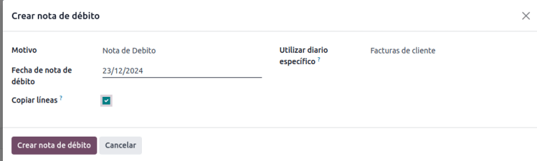

You can change the debit note amount, and then validate it. Before validating the debit note, review
the following information:

- :guilabel:`Customer`: type the customer's information.
- :guilabel:`Journal`: select the printer point for the customer Credit Note.
- :guilabel:`Document Type`: this is the document type `(05) Debit Note`.
- :guilabel:`Products`: It must specify the product with the correct taxes.

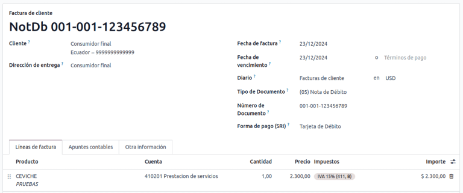

Customer withholding
~~~~~~~~~~~~~~~~~~~~

The :guilabel:`Customer withholding` is a non-electronic document for your company, this document is
issued by the client in order to apply a withholding to the sale.

It is necessary to have a validated (posted) invoice in order to register a customer withholding. On
the invoice there is a button named :guilabel:`Add Withhold`,  click on this button to be directed
to the :guilabel:`Customer withholding` form, then complete the following information:

- :guilabel:`Document Number`: type the withholding number.
- :guilabel:`Withhold Lines`: select the taxes that the customer is withholding.

Before validating the withholding, review that the amounts for each tax are the same as the original
document.

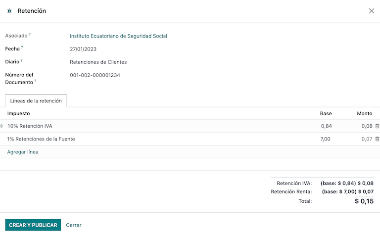

Purchase Documents
------------------

Vendor bill
~~~~~~~~~~~

The :guilabel:`Vendor bill` is a non-electronic document for your company, this document is issued
by your vendor when your company generates a purchase.

The bills can be created from the purchase order or manually, it must contain the following
information:

- :guilabel:`Vendor`: type the vendor's information.
- :guilabel:`Bill Date`: select the date of invoice.
- :guilabel:`Journal`: it is the journal for vendor bills.
- :guilabel:`Document Type`: this is the document type `(01) Invoice`
- :guilabel:`Document number`: type the document number.
- :guilabel:`Payment Method (SRI)`: select how the invoice is going to be paid.
- :guilabel:`Products`: specify the product with the correct taxes.

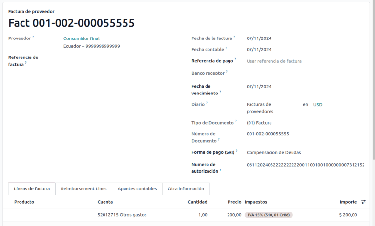

.. important::
   When creating the purchase withholding, verify that the bases (base amounts) are correct. If you
   need to edit the amount of the tax in the :guilabel:`Vendor bill`, click the :guilabel:`Edit`
   button. Otherwise, from the :guilabel:`Journal Items` tab click the :guilabel:`Edit` button and
   set the adjustment to go where you want.

Purchase liquidation
~~~~~~~~~~~~~~~~~~~~

The :guilabel:`Purchase liquidation` is an electronic document that, when validated, is sent to SRI.

Companies issue this type of electronic document when they purchase, and the vendor does not issue
an invoice due to one or more of the following cases:

- Services were provided by non-residents of Ecuador.
- Services provided by foreign companies without residency or establishment in Ecuador.
- Purchase of goods or services from natural persons not registered with a RUC, who due to their
  cultural level or hardiness are not able to issue sales receipts or customer invoices.
- Reimbursement for the purchase of goods or services to employees in a dependency relationship
  (full-time employee).
- Services provided by members of collegiate bodies for the exercise of their function.

These types of electronic documents can be created from the :guilabel:`Purchase Order` or manually
from the :guilabel:`Vendor Bills` form view. It must contain the following data:

- :guilabel:`Vendor`: type the vendor's information.
- :guilabel:`Journal`: select the journal for the :guilabel:`Purchase Liquidation` with the correct
  printer point.
- :guilabel:`Document Type`: this is the document type `(03) Purchase Liquidation`
- :guilabel:`Document number`: type the document number (sequence), you will only have to do this
  once, then the sequence will be automatically assigned for the next documents.
- :guilabel:`Payment Method (SRI)`: select how the invoice is going to be paid.
- :guilabel:`Products`: specify the product with the correct taxes.

Once you review the information you can validate the :guilabel:`Purchase Liquidation`.

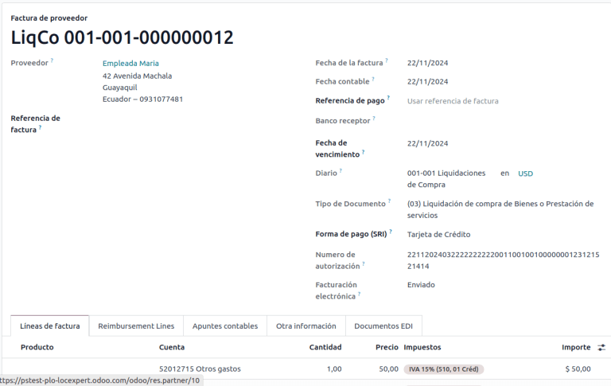

Purchase withholding
~~~~~~~~~~~~~~~~~~~~

The :guilabel:`Purchase withholding` is an electronic document that, when validated, is sent to SRI.

It is necessary to have an invoice in a validated state in order to register a :guilabel:`Purchase
withholding`. On the invoice, there is a button named :guilabel:`Add Withhold`, click on this button
to be directed to the :guilabel:`Withholding` form, then complete the following information:

- :guilabel:`Document number`: type the document number (sequence), you will only have to do this
  once, then the sequence will be automatically assigned for the next documents.
- :guilabel:`Withhold lines`: The taxes appear automatically according to the configuration of
  products and vendors, you should review if the taxes and tax support are correct, and, if it is
  not correct, you can edit and select the correct taxes and tax support.

Once you review the information you can validate the :guilabel:`Withholding`.

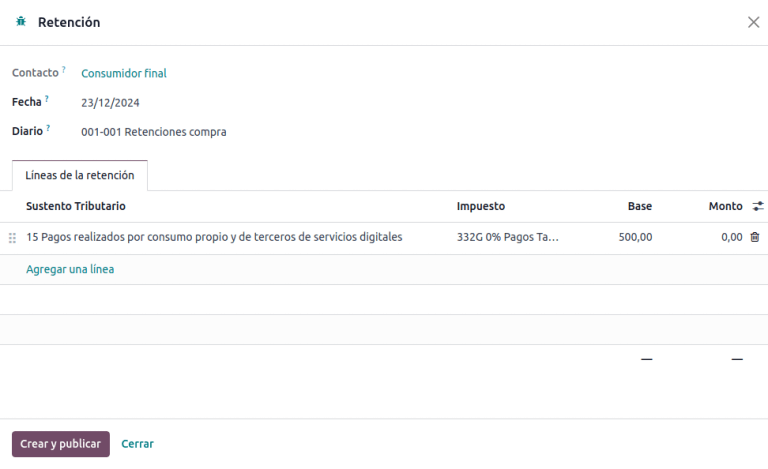

.. note::
   You can't change the tax support for one that was not included in the configuration of the taxes
   used on the :guilabel:`Vendor Bill`. To do so, go to the tax applied on the :guilabel:`Vendor
   Bill` and change the :guilabel:`Tax Support` there.

A withholding tax can be divided into two or more lines, this will depend on whether two or more
withholdings percentages apply.

.. example::
   The system suggests a VAT withholding of 30% with tax support 01, you can add your VAT
   withholding of 70% in a new line with the same tax support, the system will allow you as long as
   the total of the bases matches the total from the :guilabel:`Vendor Bill`.

Financial Reports
=================

In Ecuador, there are fiscal reports that the company presents to SRI. In Odoo, we have two of the
main financial reports used by companies. These are the reports 103 and 104.

To get these reports go to the :guilabel:`Accounting` app and select :menuselection:`Reporting -->
Statements Reports --> Tax Report` and then filter by `Tax Report 103` or `Tax Report 104`.

Report 103
----------

This report contains information of income tax withholdings in a given period, this can be reported
monthly or semi-annually.

You can see the information needed to report, which includes base and tax amounts, which also
includes the tax code within the parenthesis in order to report it to the SRI.

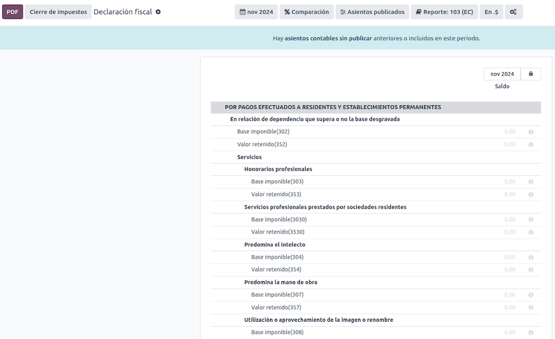

Report 104
----------

This report contains information on VAT tax and VAT withholding for a given period, this can be
monthly or semi-annually.

You can see the information needed to report, which includes base and tax amounts, which also
includes the tax code within the parenthesis in order to report it to the SRI.

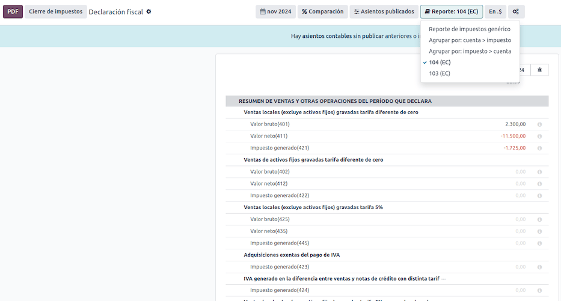
