=======
Ecuador
=======

<<<<<<< 8f2eaa2df172806a2f7834bdc889b35ed05b62e0
Introduction
============
||||||| b952bf23c83190445b9fbf2d782ccfb935cebaa3
With the Ecuadorian localization, it is possible to generate electronic documents using XML, fiscal
folio, electronic signature, and direct connection to tax authority SRI.
=======
With the Ecuadorian localization, electronic documents can be generated using XML, fiscal
folio, electronic signature, and direct connection to tax authority SRI.
>>>>>>> 531906549140c7f61afd4b557503dcc15f7538eb

With the Ecuadorian localization you can generate electronic documents with its XML, Fiscal folio,
with electronic signature and direct connection to tax authority SRI.

The supported documents are Invoices, Credit Notes, Debit Notes, Purchase Liquidations and
Withholds.

The localization also Includes automations to easily predict the withholding tax to be applied to
each purchase invoice.

.. seealso::
   - `App Tour - Localización de Ecuador <https://www.youtube.com/watch?v=BQOXVSDeeK8>`_
   - `Smart Tutorial - Localización de Ecuador <https://www.odoo.com/slides/smart-tutorial-localizacion-de-ecuador-170>`_
   - :doc:`Documentation on e-invoicing's legality and compliance in Ecuador
     <../accounting/customer_invoices/electronic_invoicing/ecuador>`

<<<<<<< 8f2eaa2df172806a2f7834bdc889b35ed05b62e0
Glossary
--------
||||||| b952bf23c83190445b9fbf2d782ccfb935cebaa3
.. _l10n_ec/glossary:

Glossary
========
=======
.. tip::
   - **SRI**: *Servicio de Rentas Internas*, the government organization that enforces the payment
     of taxes in Ecuador.
   - **SRI certificate**: Document or digital credential issued by the *SRI* that is crucial for
     compliance with Ecuadorian tax laws.
   - **EDI**: *Electronic Data Interchange*, which refers to the electronic transmission of
     documents.
   - **RIMPE**: *Regimen Simplificado para Emprendedores y Negocios*, the type of taxpayer qualified
     for SRI.

.. _localizations/ecuador/module-installation:
>>>>>>> 531906549140c7f61afd4b557503dcc15f7538eb

<<<<<<< 8f2eaa2df172806a2f7834bdc889b35ed05b62e0
Here are some terms that are essential on the Ecuadorian localization:
||||||| b952bf23c83190445b9fbf2d782ccfb935cebaa3
Here are some terms that are essential to the Ecuadorian localization:
=======
Modules
=======
>>>>>>> 531906549140c7f61afd4b557503dcc15f7538eb

<<<<<<< 8f2eaa2df172806a2f7834bdc889b35ed05b62e0
- **SRI**: meaning *Servicio de Rentas Internas*, the government organization that enforces pay of
  taxes in Ecuador.
- **EDI**: stands for *Electronic Data Interchange*, which refers to the sending of Electronics
  Documents.
- **RIMPE**: stands for *Regimen Simplificado para Emprendedores y Negocios*, the type of taxpayer
  qualified for SRI.

Configuration
=============

.. _l10n_ec/module-installation:

Modules installation
--------------------

:ref:`Install <general/install>` the following modules to get all the features of the Ecuadorian
localization:
||||||| b952bf23c83190445b9fbf2d782ccfb935cebaa3
- **SRI**: Stands for *Servicio de Rentas Internas*, which is the government organization that
  enforces the payment of taxes in Ecuador.
- **SRI certificate**: Document or digital credential issued by the *SRI* that is crucial for
  compliance with Ecuadorian tax laws.
- **EDI**: Stands for *Electronic Data Interchange*, which refers to the electronic transmission of
  documents.
- **RIMPE**: Stands for *Regimen Simplificado para Emprendedores y Negocios*, which is the type of
  taxpayer qualified for SRI.

Configuration
=============

.. _l10n_ec/module-installation:

Modules installation
--------------------

:ref:`Install <general/install>` the following modules to get all the features of the Ecuadorian
localization:
=======
:doc:`Install </applications/general/apps_modules>` the following modules to get all the features of
the Ecuadorian localization:
>>>>>>> 531906549140c7f61afd4b557503dcc15f7538eb

.. list-table::
   :header-rows: 1
   :widths: 25 25 50

   * - Name
     - Technical name
     - Description
   * - :guilabel:`Ecuadorian - Accounting`
     - `l10n_ec`
     - The default :doc:`fiscal localization package <../fiscal_localizations>` adds accounting
       characteristics for the Ecuadorian localization, which represent the minimum configuration
       required for a company to operate in Ecuador according to the guidelines set by the
       :abbr:`SRI (servicio de rentas internas)`. The module's installation automatically loads:
       a chart of accounts, taxes, document types, and tax support types. Additionally, the
       generation of forms 103 and 104 is automatic.
   * - :guilabel:`Ecuadorian Accounting EDI`
     - `l10n_ec_edi`
     - Includes all the technical and functional requirements to generate and validate
<<<<<<< 8f2eaa2df172806a2f7834bdc889b35ed05b62e0
       :doc:`Electronics Documents
       <../accounting/customer_invoices/electronic_invoicing>`, based on the Technical
       documentation published by the SRI. The authorized documents are: Invoices, Credit Notes,
       Debit Notes, Withholdings and Purchase liquidations.
||||||| b952bf23c83190445b9fbf2d782ccfb935cebaa3
       :doc:`Electronics Documents <../accounting/customer_invoices/electronic_invoicing>`, based on
       the technical documentation published by the SRI. The authorized documents are: Invoices,
       Credit Notes, Debit Notes, Withholdings and Purchase liquidations.
=======
       :doc:`Electronics Documents <../accounting/customer_invoices/electronic_invoicing>` based on
       the technical documentation published by the SRI. The authorized documents are: Invoices,
       Credit Notes, Debit Notes, Withholdings, and Purchase liquidations.
>>>>>>> 531906549140c7f61afd4b557503dcc15f7538eb
   * - :guilabel:`Ecuadorian Accounting Reports`
     - `l10n_ec_reports`
     - Includes all the technical and functional requirements to generate forms 103 and 104.
   * - :guilabel:`Ecuador - ATS Report`
     - `l10n_ec_reports_ats`
     - Includes all the technical and functional requirements to generate the ATS report XML file
       ready to be uploaded to the *DIMM Formularios*.
   * - :guilabel:`Ecuadorian Website`
     - `l10n_ec_website_sale`
     - Includes all the technical and functional requirements to generate automatic electronic
       invoices from a Website sale.
   * - :guilabel:`Ecuadorian Point of Sale`
     - `l10n_ec_edi_pos`
     - Includes all the technical and functional requirements to generate automatic electronic
       invoices from a POS sale.
   * - :guilabel:`Ecuadorian Delivery Guide`
     - `l10n_ec_edi_stock`
     - Includes all the technical and functional requirements to generate :ref:`electronic delivery
       guides <localizations/ecuador/electronic-delivery-guide>`.

.. note::
<<<<<<< 8f2eaa2df172806a2f7834bdc889b35ed05b62e0
   When you install a database from scratch selecting `Ecuador` as the country, Odoo automatically
   installs the base module :guilabel:`Ecuadorian - Accounting`.
||||||| b952bf23c83190445b9fbf2d782ccfb935cebaa3
   In some cases, such as when upgrading to a version with additional modules, it is possible that
   those modules may not be installed automatically. Any missing modules can be manually installed.
=======
   In some cases, such as when upgrading to a version with additional modules, those modules may not
   be installed automatically. Any missing modules can be manually
   :doc:`installed </applications/general/apps_modules>`.
>>>>>>> 531906549140c7f61afd4b557503dcc15f7538eb

.. seealso::
   :doc:`/applications/hr/payroll/payroll_localizations` are documented separately.

<<<<<<< 8f2eaa2df172806a2f7834bdc889b35ed05b62e0
Configure your company
----------------------
||||||| b952bf23c83190445b9fbf2d782ccfb935cebaa3
Configure a company or individual contact
-----------------------------------------
=======
.. _localizations/ecuador/specifics:

Localization overview
=====================

The Ecuadorian localization package ensures compliance with Ecuadorian fiscal and accounting
regulations. It includes tools for managing taxes, fiscal positions, reporting, and a predefined
chart of accounts tailored to Ecuador's standards.

The Ecuadorian localization package provides the following key features to ensure compliance with
local fiscal and accounting regulations:

- :doc:`../accounting/get_started/chart_of_accounts`: a predefined structure aligned with the latest
  standards of Ecuador’s *Superintendency of Companies*, organized into multiple categories and
  fully compatible with NIIF accounting
- :ref:`Products <localizations/ecuador/products>`
- :ref:`Taxes <localizations/ecuador/taxes>`: pre-configured tax rates, including standard VAT,
  zero-rated, and exempt options
- :doc:`../accounting/taxes/fiscal_positions`: automated tax adjustments based on customer or
  supplier registration status
- :ref:`Document types <localizations/ecuador/document types>`: classification of transactions like
  *customer invoices* and *vendor bills* using government-defined document types set by the SRI
  (Ecuador’s tax authority)
- :ref:`Company and contacts <localizations/ecuador/company-contact>`
- :ref:`Electronic documents <localizations/ecuador/electronic-documents>`
- :ref:`VAT withholding <localizations/ecuador/vat-withholding>`
- :ref:`Printer points <localizations/ecuador/printer-points>`
- :ref:`Withholding <localizations/ecuador/withholding>`
- :ref:`Reporting <localizations/ecuador/reporting>`

.. _localizations/ecuador/products:

Products
--------

If products have any :doc:`withholding taxes <../accounting/taxes/retention>`, they must be
configured on the product form. To do so, go to :menuselection:`Accounting --> Vendors -->
Products`. On the :guilabel:`General Information` tab, specify both :guilabel:`Purchase Taxes` and
:guilabel:`Profit Withhold`.

.. _localizations/ecuador/taxes:

Taxes
-----

To manage taxes, navigate to :menuselection:`Accounting --> Configuration --> Taxes`. Depending on
the tax type, the following options may be required for additional configuration:

- :guilabel:`Tax Name`: Follows a specific format depending on the tax type:

  - | **For IVA (Value-Added Tax)**:
    | `IVA [percent] (104, [form code] [tax support code] [tax support short name])`
    | Example: `IVA 12% (104, RUC [tax support code] IVA)`
  - | **For Income Tax Withholding codes**:
    | `Code ATS [percent of withhold] [withhold name]`
    | Example: `Code ATS 10% Retención a la Fuente`

- :guilabel:`Tax Support`: Configure only for the IVA tax. This option is used to register purchase
  withholdings.
- :guilabel:`Code ATS`: Configure only for income tax withholding codes, as it is necessary to
  register a withholding.

In the :guilabel:`Definition` tab:

- :guilabel:`Tax Grids`: Configure the code of a 104 form if it is an IVA tax, and the code of a
  103 form if it is an income tax withholding code.

.. seealso::
   :doc:`Configuring taxes <../accounting/taxes>`

.. _localizations/ecuador/document types:

Document types
--------------

To access or configure document types, go to :menuselection:`Accounting --> Configuration -->
Document Types`. Each document type can have a unique sequence per journal where it is assigned. As
part of the localization, the document type includes the country where the document is applicable;
also, the data is created automatically when the localization module is installed. The information
required for the document types is included by default and doesn't need to be changed.

.. _localizations/ecuador/company-contact:

Company and contact
-------------------
>>>>>>> 531906549140c7f61afd4b557503dcc15f7538eb

To configure your company information, go to the :guilabel:`Contacts` app and search the name given
to your company or activate :ref:`developer mode <developer-mode>` and go to :menuselection:`Company
--> Contact` and then edit the contact to configure the following information:

#. Check the :guilabel:`Company` option on top

<<<<<<< 8f2eaa2df172806a2f7834bdc889b35ed05b62e0
   - :guilabel:`Name`
   - :guilabel:`Address`
   - :guilabel:`Identification Number`
   - :guilabel:`Taxpayer Type`
   - :guilabel:`Phone`
   - :guilabel:`Email`
||||||| b952bf23c83190445b9fbf2d782ccfb935cebaa3
- :guilabel:`Name`: Enter the company or individual's name.
- :guilabel:`Address`: The :guilabel:`Street` sub-field is required to confirm electronic invoices.
- :guilabel:`Identification Number`: For a company, enter the :guilabel:`Ruc`. For individuals,
  enter the :guilabel:`Cedula` or :guilabel:`Passport` number.
- :guilabel:`SRI Taxpayer Type`: Select the contact's SRI taxpayer type.
- :guilabel:`Phone`: Enter the company or individual's phone number.
- :guilabel:`Email`: Enter the company or individual's email. This email is used to send electronic
  documents, such as invoices.
=======
- :guilabel:`Name`: Enter the company or individual's name.
- :guilabel:`Address`: The :guilabel:`Street` sub-field is required to confirm electronic invoices.
- :guilabel:`Identification Number`: For a company, enter the :guilabel:`Ruc`. For individuals,
  enter the :guilabel:`Cédula` or :guilabel:`Passport` number.
- :guilabel:`SRI Taxpayer Type`: Select the contact's SRI taxpayer type.
- :guilabel:`Phone`: Enter the company or individual's phone number.
- :guilabel:`Email`: Enter the company or individual's email. This email is used to send electronic
  documents, such as invoices.
>>>>>>> 531906549140c7f61afd4b557503dcc15f7538eb

<<<<<<< 8f2eaa2df172806a2f7834bdc889b35ed05b62e0
#. Upload company logo and save

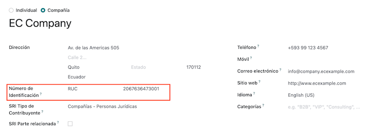
||||||| b952bf23c83190445b9fbf2d782ccfb935cebaa3
.. note::
   The :guilabel:`SRI Taxpayer Type` indicated on the contact form determines which :ref:`VAT and
   profit withholding <l10n_ec/VAT-withholding>` taxes apply when using this contact on a vendor
   bill.
=======
.. note::
   The :guilabel:`SRI Taxpayer Type` indicated on the contact form determines which :ref:`VAT and
   profit withholding <localizations/ecuador/vat-withholding>` taxes apply when using this contact
   on a vendor bill.

.. _localizations/ecuador/electronic-documents:
>>>>>>> 531906549140c7f61afd4b557503dcc15f7538eb

Electronic documents
--------------------

To upload your information for electronic documents go to :menuselection:`Accounting -->
Configuration --> Settings` and search for :command:`Ecuadorian Localization`.

Configure the next information:

- :guilabel:`Company legal name`
- :guilabel:`Use production servers`: check the checkbox if your company is going to do electronic
  documents in the production environment. If you want to use the testing environment for electronic
  documents then keep the checkbox unchecked.
- :guilabel:`Regime`: select if your company is in General Regular or is qualified as RIMPE.
- :guilabel:`Forced to keep accounting books`: check the checkbox if your company has this
  condition.
- :guilabel:`Default taxes for withholdings`
- :guilabel:`Issue withholds`: check the checkbox if your company is going to do electronic
  withholds.
- :guilabel:`Withhold consumibles`: put the code of the withholding for when you buy goods.
- :guilabel:`Withhold services`: put the code of the withholding for when you buy services.
- :guilabel:`Withhold credit card`: put the code of the withholding for when you buy with credit
  card
- :guilabel:`Withhold agent number`: put the company withholding agent resolution number, if
  applicable for your company.
- :guilabel:`Electronic Certificate File`: upload electronic certificate and password, then save it.
- :guilabel:`Special tax contributor number`: if your company is qualified as a special taxpayer,
  fill out this field with it's corresponding tax contributor number.

<<<<<<< 8f2eaa2df172806a2f7834bdc889b35ed05b62e0
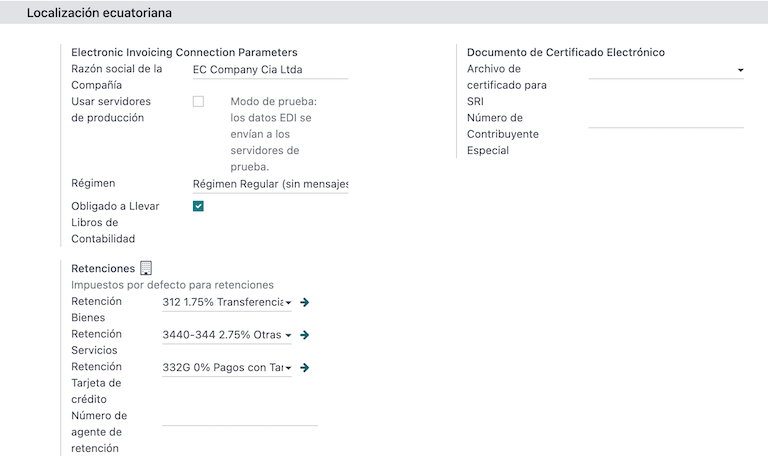
||||||| b952bf23c83190445b9fbf2d782ccfb935cebaa3
:guilabel:`Withholding` section:

- :guilabel:`Consumables`: Enter the code of the default withholding tax used when purchasing goods.
- :guilabel:`Services`: Enter the code of the default withholding tax used when purchasing services.
- :guilabel:`Credit Card`: Enter the code of the default withholding tax used when purchasing with
  credit cards.
- :guilabel:`Withhold Agent Number`: Enter the company's withholding agent resolution number, if
  applicable.

:guilabel:`SRI Connection` section:

- :guilabel:`Certificate file for SRI`: Select the company's :ref:`SRI certificate
  <l10n_ec/glossary>`. Click :icon:`oi-arrow-right` :guilabel:`SRI Certificates` to upload one, if
  necessary.
- :guilabel:`Use production servers`: Enable this option if electronic documents are used in the
  production environment; leave it disabled if the testing environment is used instead.

:guilabel:`Withholding accounts` section:

- :guilabel:`Sales Tax Base Account`: Enter the company's sales tax base account.
- :guilabel:`Purchase Tax Base Account`: Enter the company's sales tax purchase account.

.. important::
   When using the testing environment, EDI data is sent to test servers.
=======
:guilabel:`Withholding` section:

- :guilabel:`Consumables`: Enter the code of the default withholding tax used when purchasing goods.
- :guilabel:`Services`: Enter the code of the default withholding tax used when purchasing services.
- :guilabel:`Credit Card`: Enter the code of the default withholding tax used when purchasing with
  credit cards.
- :guilabel:`Withhold Agent Number`: Enter the company's withholding agent resolution number, if
  applicable.

:guilabel:`SRI Connection` section:

- :guilabel:`Certificate file for SRI`: Select the company's :guilabel:`SRI certificate`. Click
  :icon:`oi-arrow-right` :guilabel:`SRI Certificates` to upload one, if necessary.
- :guilabel:`Use production servers`: Enable this option if electronic documents are used in the
  production environment; leave it disabled if the testing environment is used instead.

:guilabel:`Withholding accounts` section:

- :guilabel:`Sales Tax Base Account`: Enter the company's sales tax base account.
- :guilabel:`Purchase Tax Base Account`: Enter the company's sales tax purchase account.

.. important::
   When using the testing environment, EDI data is sent to test servers.
>>>>>>> 531906549140c7f61afd4b557503dcc15f7538eb

.. note::
<<<<<<< 8f2eaa2df172806a2f7834bdc889b35ed05b62e0
   When configuring the withholdings in the configuration menu, these suggested withholdings are
   only for domestic suppliers when no withholdings are setup on their *Taxpayer Type*. Moreover,
   the Credit Card withholding set up is always used when a Credit or Debit Card SRI Payment Metho
   is used.
||||||| b952bf23c83190445b9fbf2d782ccfb935cebaa3
   - The values entered in the :guilabel:`Consumables` and :guilabel:`Services` withholding fields
     are used as default values for domestic **only when** no withholdings are set up on the *SRI
     Taxpayer Type*.
   - The entered :guilabel:`Credit Card` withholding value is always applied when a credit or debit
     card SRI payment method is used.

.. _l10n_ec/VAT-withholding:
=======
   - The values entered in the :guilabel:`Consumables` and :guilabel:`Services` withholding fields
     are used as default values for domestic **only when** no withholdings are set up on the *SRI
     Taxpayer Type*.
   - The entered :guilabel:`Credit Card` withholding value is always applied when a credit or debit
     card SRI payment method is used.

.. _localizations/ecuador/vat-withholding:
>>>>>>> 531906549140c7f61afd4b557503dcc15f7538eb

VAT withholding
---------------

This configuration only applies if you are qualified as a *Withholding Agent* by the SRI, otherwise
skip this step. To configure your VAT withholding, go to :menuselection:`Accounting --> Accounting
--> Configuration --> Ecuadorian SRI: Taxpayer Type SRI`.

<<<<<<< 8f2eaa2df172806a2f7834bdc889b35ed05b62e0
You must configure the withholding percentage that applies for each type of taxpayer, specify the
:guilabel:`Goods VAT Withholding` and the :guilabel:`Services VAT Withholding`.

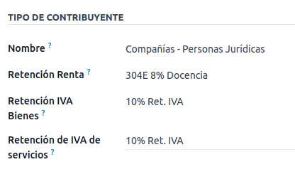
||||||| b952bf23c83190445b9fbf2d782ccfb935cebaa3
To configure a VAT withholding, go to :menuselection:`Accounting --> Configuration --> Taxpayer Type
SRI`.

Configure the :guilabel:`Name` of the taxpayer type, the :guilabel:`Goods VAT Withholding`, and the
:guilabel:`Services VAT Withholding`.
=======
To configure a VAT withholding, go to :menuselection:`Accounting --> Configuration --> Taxpayer Type
SRI`. Then, configure the :guilabel:`Name` of the taxpayer type, the :guilabel:`Goods VAT
Withholding`, and the :guilabel:`Services VAT Withholding`.
>>>>>>> 531906549140c7f61afd4b557503dcc15f7538eb

.. tip::
   In the case that the :guilabel:`Taxpayer Type` is `RIMPE`, also configure the :guilabel:`Profit
   Withholding` percentage.

.. _localizations/ecuador/printer-points:

Printer points
--------------

<<<<<<< 8f2eaa2df172806a2f7834bdc889b35ed05b62e0
To configure your printer points, go to :menuselection:`Accounting --> Configuration --> Accounting:
Journals`.

Printer points need to be configured for each type of electronic document that you need. For
example: Customer Invoice, Credit Notes, and Debit Notes
||||||| b952bf23c83190445b9fbf2d782ccfb935cebaa3
*Printer points* need to be configured for each type of electronic document used, such as customer
invoices, credit notes, and debit notes.

To configure printer points, navigate to :menuselection:`Accounting --> Configuration -->
Journals`.

For each electronic document, click :guilabel:`New`, and enter the following information on the
journal form:
=======
*Printer points* need to be configured for each type of electronic document used, such as customer
invoices, credit notes, and debit notes.

To configure printer points, navigate to :menuselection:`Accounting --> Configuration -->
Journals`. For each electronic document, click :guilabel:`New`, and enter the following information
on the journal form:
>>>>>>> 531906549140c7f61afd4b557503dcc15f7538eb

For each printer point, you need to configure the following information:

- :guilabel:`Journal Name`: in this format `[Emission Entity]-[Emission Point] [Document Type]`, for
  example: `001-001 Sales Documents`.
- :guilabel:`Type`: refers to the type of journal, select `Sales`.
- :guilabel:`Use Documents?`: this checkbox is automatically checked, leave it checked.
- :guilabel:`Emission Entity`: configure the establishment number.
- :guilabel:`Emission Point`: configure the printer point.
- :guilabel:`Emission address`: configure the address of the establishment.
- :guilabel:`Default income account`: configure the default income account.
- :guilabel:`Dedicated Credit Note Sequence`: check the checkbox if *Credit Notes* are to be
  generated from this printer point - journal.
- :guilabel:`Short Code`: This is the unique code for the sequence of accounting entries, enter a
  unique 5-digit code, for example: `VT001`

Customer Invoice, Credit Notes and Debit Notes need to use the same journal as the
:guilabel:`Emission Point`, and the :guilabel:`Entity Point` should be unique per journal.

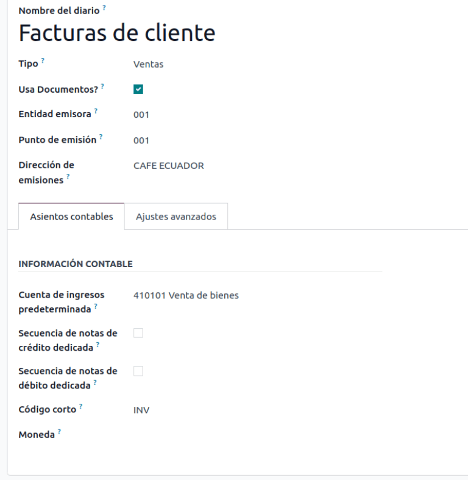

<<<<<<< 8f2eaa2df172806a2f7834bdc889b35ed05b62e0
.. note::
   In the :guilabel:`Advanced Settings` tab, check the :guilabel:`Electronic Invoicing` checkbox to
   enable it for Ecuador.
||||||| b952bf23c83190445b9fbf2d782ccfb935cebaa3
- :guilabel:`Default Income Account`: Enter the default income account.
- :guilabel:`Dedicated Credit Note Sequence`: Enable this option if *credit notes* should be
  generated from this printer point (i.e., the journal).
- :guilabel:`Dedicated Debit Note Sequence`: Enable this option if *debit notes* should be
  generated from this printer point (i.e., the journal).
- :guilabel:`Short Code`: Enter a unique 5-digit code for the accounting entry sequence (e.g.,
  VT001).

Customer invoices, credit notes, and debit notes need to use the same journal as the
:guilabel:`Emission Point`, whereas the :guilabel:`Entity Point` should be unique per journal.

Finally, in the :guilabel:`Advanced Settings` tab, check the :guilabel:`Electronic invoicing`
checkbox to enable sending XML/EDI invoices.
=======
- :guilabel:`Default Income Account`: Enter the default income account.
- :guilabel:`Dedicated Credit Note Sequence`: Enable this option if *credit notes* should be
  generated from this printer point (i.e., the journal).
- :guilabel:`Dedicated Debit Note Sequence`: Enable this option if *debit notes* should be
  generated from this printer point (i.e., the journal).
- :guilabel:`Short Code`: Enter a unique 5-digit code for the accounting entry sequence (e.g.,
  VT001).

Customer invoices, credit notes, and debit notes must use the same journal as the
:guilabel:`Emission Point`, whereas the :guilabel:`Entity Point` should be unique per journal.

Finally, in the :guilabel:`Advanced Settings` tab, check the :guilabel:`Electronic invoicing`
checkbox to enable sending XML/EDI invoices.
>>>>>>> 531906549140c7f61afd4b557503dcc15f7538eb

.. seealso::
   :doc:`../accounting/customer_invoices/electronic_invoicing`

.. _localizations/ecuador/withholding:

Withholding
-----------

A Withholding Journal must be defined, go to go to :menuselection:`Accounting --> Configuration -->
Accounting:  Journals` where you need to configure the following information:

- :guilabel:`Journal Name`: in this format `[Emission Entity]-[Emission Point] [Document Type]`, for
  example: `001-001 Withholding`.
- :guilabel:`Type`: refers to the type of journal, select `Miscellaneous`.
- :guilabel:`Withhold Type`: Configure Purchase Withholding.
- :guilabel:`Use Documents?`: this checkbox is automatically checked, leave it checked.
- :guilabel:`Emission Entity`: configure the establishment number.
- :guilabel:`Emission Point`: configure the printer point.
- :guilabel:`Emission address`: configure the address of the establishment.
- :guilabel:`Default account`: configure the default income account.
- :guilabel:`Short Code`: This is the unique code for the sequence of accounting entries, enter a
  unique 5-digit code, for example: `RT001`

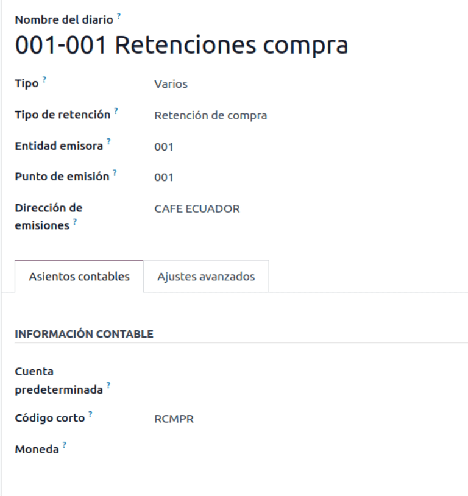

.. note::
   In the :guilabel:`Advanced Settings` tab, check the :guilabel:`Electronic Invoicing` checkbox to
   enable the sending of electronic invoicing for the withholding.

<<<<<<< 8f2eaa2df172806a2f7834bdc889b35ed05b62e0
Purchase Liquidations
---------------------
||||||| b952bf23c83190445b9fbf2d782ccfb935cebaa3
In the :guilabel:`Journal Entries` tab, under the :guilabel:`Accounting information` section, fill
in the following fields:

- :guilabel:`Default Account`: Configure the default income account.
- :guilabel:`Short Code`: Enter a unique 5-digit code for the accounting entry sequence (e.g.,
  `WT001`).

Finally, in the :guilabel:`Advanced Settings` tab, check the :guilabel:`Electronic invoicing`
checkbox to enable sending XML/EDI invoices.

Purchase liquidations
---------------------
=======
In the :guilabel:`Journal Entries` tab, under the :guilabel:`Accounting information` section, fill
in the following fields:

- :guilabel:`Default Account`: Configure the default income account.
- :guilabel:`Short Code`: Enter a unique 5-digit code for the accounting entry sequence (e.g.,
  `WT001`).

Finally, in the :guilabel:`Advanced Settings` tab, check the :guilabel:`Electronic invoicing`
checkbox to enable sending XML/EDI invoices.

.. _localizations/ecuador/reporting:
>>>>>>> 531906549140c7f61afd4b557503dcc15f7538eb

<<<<<<< 8f2eaa2df172806a2f7834bdc889b35ed05b62e0
When using Purchase Liquidations, a specific journal must be created, go to
:menuselection:`Accounting --> Configuration --> Accounting:  Journals` and configure the following
information:
||||||| b952bf23c83190445b9fbf2d782ccfb935cebaa3
A specific journal must be created for *purchase liquidations*. Go to :menuselection:`Accounting -->
Configuration --> Journals`. Click :guilabel:`New`, and enter the following information:
=======
Reporting
---------

Ecuadorian companies submit fiscal reports to the SRI, with Odoo supporting two main ones: **reports
103** and **104**.

To get these reports, go to :menuselection:`Accounting --> Reporting --> Tax Return`.  Click the
:icon:`fa-book` :guilabel:`Report:` icon and select `103 (EC)` or `104 (EC)`.

.. _localizations/ecuador/report-103:

Report 103
~~~~~~~~~~

This report details income tax withholdings in a given period and can be reported monthly or
semi-annually. It includes information about base, tax amounts, and tax codes and can be used for
SRI reporting.

.. _localizations/ecuador/report-104:

Report 104
~~~~~~~~~~

This report details VAT tax and VAT withholding for a given period and can be generated monthly or
semi-annually. It includes information about base, tax amounts, and tax codes and can be used for
SRI reporting.

.. _localizations/ecuador/ats:

ATS report
~~~~~~~~~~

To enable downloading the ATS :abbr:`ATS (Anexo Transaccional Simplificado)` report in XML format,
:doc:`install </applications/general/apps_modules>` the *ATS Report* (`l10n_ec_reports_ats`) module.

.. note::
   The Ecuadorian *ATS Report* module depends on the previous installation of the *Accounting* app
   and the *Ecuadorian EDI module*.

.. _localizations/ecuador/ats-configuration:

Configuration
*************

To issue electronic documents, ensure the company is configured as explained in the
:ref:`electronic invoice <localizations/ecuador/company-contact>` section. In the :abbr:`ATS (Anexo
Transaccional Simplificado)`, every document generated in Odoo, such as :ref:`invoices
<localizations/ecuador/customer-invoice>`, :ref:`vendor bills <localizations/ecuador/vendor-bill>`,
:ref:`sales <localizations/ecuador/customer-withholdings>` and :ref:`purchases withholdings
<localizations/ecuador/purchase-withholding>`, :ref:`credit notes
<localizations/ecuador/credit-notes>`, and :ref:`debit notes <localizations/ecuador/debit-notes>`,
is included.

.. _localizations/ecuador/ats-vendor-bills:

Vendor bills
^^^^^^^^^^^^

When generating a :ref:`vendor bill <localizations/ecuador/vendor-bill>`, register the authorization
number from the vendor's invoice. To do so, go to :menuselection:`Accounting --> Vendors --> Bills`
and select the bill. Then, enter the number from the vendor's invoice in the
:guilabel:`Authorization Number` field.

.. _localizations/ecuador/ats-credit-debit-notes:

Credit and debit notes
^^^^^^^^^^^^^^^^^^^^^^

When creating a :ref:`credit <localizations/ecuador/credit-notes>` or :ref:`debit
<localizations/ecuador/debit-notes>` note manually or through an import, link it to the sales
invoice it modifies.

.. note::
   Some information is required to the documents before downloading the :abbr:`ATS (Anexo
   Transaccional Simplificado)` file. For example, add the *Authorization Number* and the *SRI
   Payment Method* to documents when needed.

.. _localizations/ecuador/ats-xml-generation:

XML generation
**************

To generate the :abbr:`ATS (Anexo Transaccional Simplificado)` report, go to
:menuselection:`Accounting --> Reporting --> Tax Return`. Choose a period for the desired :abbr:`ATS
(Anexo Transaccional Simplificado)` report, then click :guilabel:`ATS`. Then, upload the downloaded
XML file to *DIMM Formularios*.

.. note::
   When downloading the :abbr:`ATS (Anexo Transaccional Simplificado)` report, Odoo generates a
   warning pop-up alerting the user if a document(s) has missing or incorrect data. Nevertheless,
   the XML file can still be downloaded.

.. _localizations/ecuador/accounting:

Accounting
==========

.. _localizations/ecuador/sales-documents:

Sales documents
---------------

.. _localizations/ecuador/customer-invoice:

Customer invoice
~~~~~~~~~~~~~~~~

Customer invoices, electronic documents :doc:`created from sales orders or manually
<../accounting/customer_invoices/overview>`, must contain the following data and, once validated,
are sent to the SRI:

- :guilabel:`Journal`: Select the option matching the customer invoice's printer point.
- :guilabel:`Document Type`: Type the document type in this format: `(01) Invoice`.
- :guilabel:`Payment Method (SRI)`: Select how the invoice will be paid.

.. _localizations/ecuador/credit-notes:

Customer credit note
~~~~~~~~~~~~~~~~~~~~

:doc:`Customer credit notes <../accounting/customer_invoices/credit_notes>` are electronic
documents sent to the SRI once validated. :ref:`Credit notes
<accounting/credit_notes/issue-credit-note>` can only be registered from a validated (posted)
invoice.

Keep the :guilabel:`Document Type` on :guilabel:`(04) Credit Note` in the :guilabel:`Credit note`
window.

Filling out a credit note follows the same process as completing an :ref:`invoice
<accounting/invoice/creation>`.

.. note::
   When creating the first credit note, select :guilabel:`Reverse` and assign the first credit note
   number or, by default, Odoo assigns `NotCr 001-001-000000001` as the first credit note number.

.. _localizations/ecuador/debit-notes:

Customer debit note
~~~~~~~~~~~~~~~~~~~

:ref:`Customer debit notes <accounting/credit_notes/issue-debit-note>` are electronic documents sent
to the SRI once validated. They can only be registered from a validated (posted) invoice.

In the :guilabel:`Use Specific Journal` of the :guilabel:`Create Debit Note` window, select the
printer point for the credit note or leave it empty to use the same journal as the original
invoice.

.. _localizations/ecuador/customer-withholdings:

Customer withholding
~~~~~~~~~~~~~~~~~~~~

:guilabel:`Customer withholdings` are non-electronic documents issued by the client to apply a
withholding to a sale. They can only be registered from a validated (posted) invoice.

On the invoice, click :guilabel:`Add Withhold` and complete the following information in the
:guilabel:`Customer withholding` window:

- :guilabel:`Document Number`: Enter the withholding number.
- :guilabel:`Withhold Lines`: Select the taxes that the customer is withholding.

Before validating the withholding, review that the amounts for each tax are the same as the original
document.

.. _localizations/ecuador/purchase-documents:

Purchase documents
------------------

.. _localizations/ecuador/vendor-bill:

Vendor bill
~~~~~~~~~~~

:doc:`Vendor bills <../accounting/vendor_bills>`, non-electronic documents created from purchase
orders or manually, require a specific :ref:`vendor bill journal
<localizations/ecuador/vendor-bills-journal>`.

.. _localizations/ecuador/vendor-bills-journal:

Vendor bills journal
********************

Use the following configuration to set up the vendor bills journal:

- Select :guilabel:`Purchase` as the :guilabel:`Type`.
- **Do not** tick the :guilabel:`Purchase Liquidations` checkbox.
- Add a :guilabel:`Default Expense Account`.

To configure a vendor bill, make sure also to complete the following Ecuador-specific fields:

- :guilabel:`Document Type`: Enter this document type: `(01) Invoice`.
- :guilabel:`Document number`: Enter the document number.
- :guilabel:`Payment Method (SRI)`: Select how to pay the vendor bill.

.. important::
   When creating the purchase withholding, verify that the bases (base amounts) are correct. If the
   amount of the tax in the :guilabel:`Vendor bill` needs to be edited, click :guilabel:`Edit`. Or,
   from the :guilabel:`Journal Items` tab, click :guilabel:`Edit` and set the adjustment as desired.

.. _localizations/ecuador/purchase-liquidation:

Purchase liquidation
~~~~~~~~~~~~~~~~~~~~

*Purchase liquidations* are electronic documents sent to the SRI once they're validated. Companies
issue them when they make a purchase, but the vendor does not provide an invoice due to one or more
of the following reasons:

- Non-residents of Ecuador provided services.
- Foreign companies provided services without residency or facility in Ecuador.
- Purchase of goods or services from natural persons not registered with a RUC, who cannot issue
  sales receipts or customer invoices.
- Reimbursement for purchasing goods or services must be given to employees in a dependency
  relationship (full-time employee).
- Members of collegiate bodies have provided services in the exercise of their function.

In these cases, a :ref:`purchase liquidation journal
<localizations/ecuador/purchase-liquidation-journal>` must be created.

.. _localizations/ecuador/purchase-liquidation-journal:

Create a purchase liquidation journal
*************************************

To create a *purchase liquidations* journal, enter the following information:
>>>>>>> 531906549140c7f61afd4b557503dcc15f7538eb

- :guilabel:`Journal Name`: in this format `[Emission Entity]-[Emission Point] [Document Type]`, for
  example: `001-001 Withhold`.
- :guilabel:`Type`: refers to the type of journal, select `Miscellaneous`.
- :guilabel:`Purchase Liquidations`: check the checkbox to enable purchase liquidations.
- :guilabel:`Use Documents?`: this checkbox is automatically checked, leave it checked.
- :guilabel:`Emission Entity`: configure the establishment number.
- :guilabel:`Emission Point`: configure the printer point.
- :guilabel:`Emission address`: configure the address of the establishment.
- :guilabel:`Short Code`: This is the unique code for the sequence of accounting entries, enter a
  unique 5-digit code, for example: `RT001`

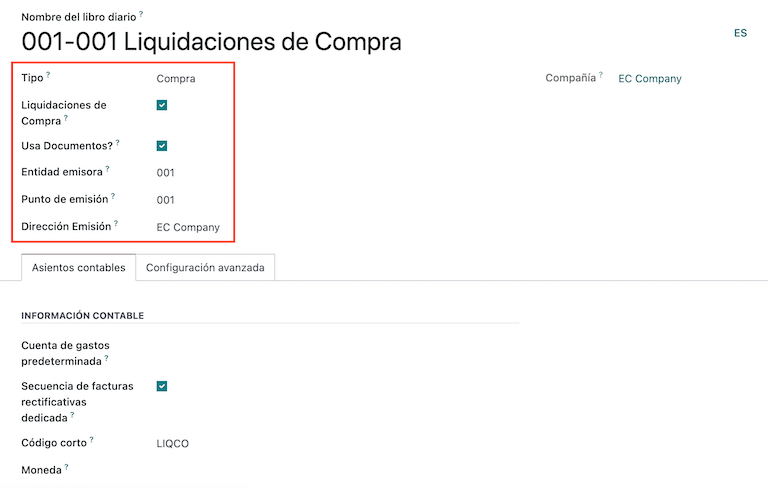

.. note::
   In the :guilabel:`Advanced Settings` tab, check the :guilabel:`Electronic Invoicing` checkbox to
   enable the sending of electronic invoicing for the withholding.

<<<<<<< 8f2eaa2df172806a2f7834bdc889b35ed05b62e0
Configure master data
---------------------

Chart of accounts
~~~~~~~~~~~~~~~~~

The :doc:`chart of accounts <../accounting/get_started/chart_of_accounts>`
is installed by default as part of the set of data included in the localization module, the accounts
are mapped automatically in Taxes, Default Account Payable, Default Account Receivable.

The chart of accounts for Ecuador is based on the most updated version of Superintendency of
Companies, which is grouped in several categories and is compatible with NIIF accounting.

You can add or delete accounts according to the company's needs.

Products
~~~~~~~~

In addition to the basic information in your products, you must add the configuration of the
withholding code (tax) that applies.

Go to :menuselection:`Accounting --> Vendors:  Products` under the tab "Purchase"

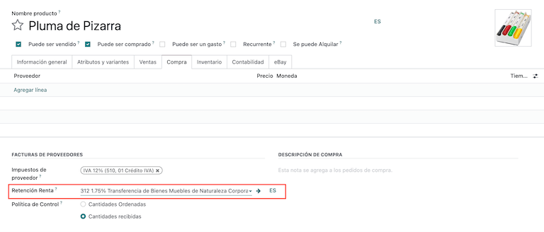

Contacts
~~~~~~~~

Configure the next information when you create a contact:

- Check the :guilabel:`Company` option on top if it is a contact with RUC, or check
  :guilabel:`Individual` if it is a contact with cedula or passport.
- :guilabel:`Name`
- :guilabel:`Address`: :guilabel:`Street` is a required field to confirm the Electronic Invoice.
- :guilabel:`Identification Number`: select an identification type `RUC`, `Cedula`, or `Passport`.
- :guilabel:`Taxpayer Type`: select the contact's SRI Taxpayer Type.
- :guilabel:`Phone`
- :guilabel:`Email`

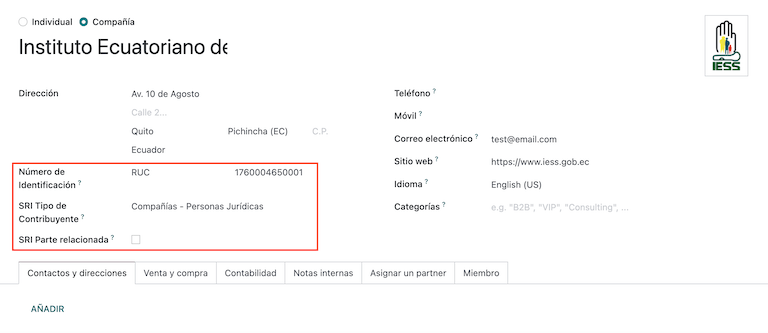

.. note::
   The :guilabel:`SRI Taxpayer Type` has inside the configuration of which VAT and Profit
   withholding will apply when you use this contact on Vendor Bill, and then create a withholding
   from there.

Review your taxes
~~~~~~~~~~~~~~~~~

As part of the localization module, taxes are automatically created with its configuration and
related financial accounts.

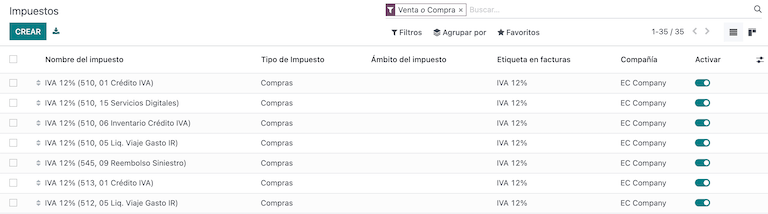

The following options have been automatically configured:

- :guilabel:`Tax Support`: to be configured only in the IVA tax, this option is useful when you
  register purchase withholdings.
- :guilabel:`Code ATS`: to be configured only for income tax withholding codes, it is important when
  you register the withholding.
- :guilabel:`Tax Grids`: configure the codes of 104 form if it is a IVA tax and configure the codes
  of 103 form if it is a  income tax withholding code.
- :guilabel:`Tax Name`:

  - For IVA tax, format the name as: `IVA [percent] (104, [form code] [tax support code] [tax
    support short name])`
  - For income tax withholding code, format the name as: `Code ATS [Percent of withhold] [withhold
    name]`

Once the Ecuador module is installed, the most common taxes are automatically configured. If you
need to create an additional one, you can do so, for which you must base yourself on the
configuration of the existing taxes.

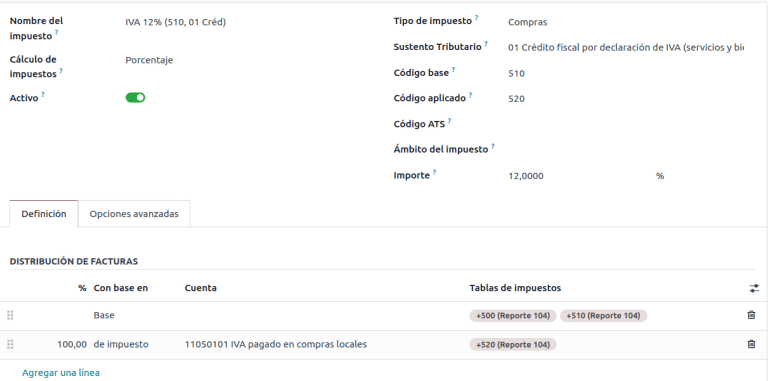

Review your Document Types
~~~~~~~~~~~~~~~~~~~~~~~~~~

Some accounting transactions like *Customer Invoices* and *Vendor Bills* are classified by document
types. These are defined by the government fiscal authorities, in this case by the SRI.

Each document type can have a unique sequence per journal where it is assigned. As part of the
localization, the document type includes the country on which the document is applicable; also the
data is created automatically when the localization module is installed.

The information required for the document types is included by default so the user does not need to
fill anything there.

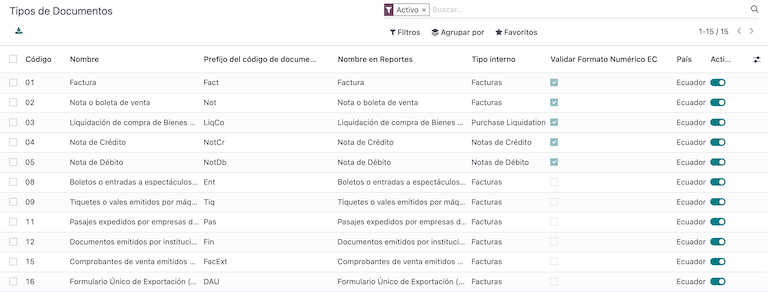

Workflows
=========

Once you have configured your database, you can register your documents.

Sales documents
---------------

Customer invoices
~~~~~~~~~~~~~~~~~

:guilabel:`Customer invoices` are electronic documents that, when validated, are sent to SRI. These
documents can be created from your sales order or manually. They must contain the following data:

- :guilabel:`Customer`: type the customer's information.
- :guilabel:`Journal`: select the option that matches the printer point for the customer invoice.
- :guilabel:`Document Type`: type document type in this format `(01) Invoice`.
- :guilabel:`Payment Method (SRI)`: select how the invoice is going to be paid.
- :guilabel:`Products`: specify the product with the correct taxes.

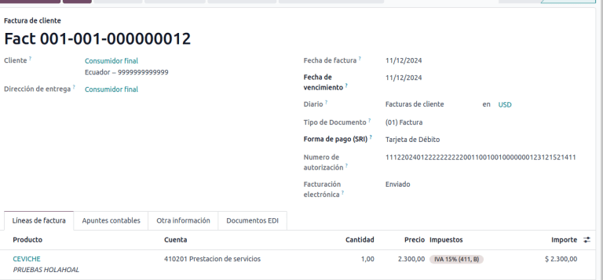

Customer credit note
~~~~~~~~~~~~~~~~~~~~

The :doc:`Customer credit note <../accounting/customer_invoices/credit_notes>` is an
electronic document that, when validated, is sent to SRI. It is necessary to have a validated
(posted) invoice in order to register a credit note. On the invoice there is a button named
:guilabel:`Credit note`, click on this button to be directed to the :guilabel:`Create credit note`
form, then complete the following information:

- :guilabel:`Credit Method`: select the type of credit method.

  - :guilabel:`Partial Refund`: use this option when you need to type the first number of documents
    and if it is a partial credit note.
  - :guilabel:`Full Refund`: use this option if the credit note is for the total invoice and you
    need the credit note to be auto-validated and reconciled with the invoice.
  - :guilabel:`Full refund and new draft invoice`: use this option if the credit note is for the
    total invoice and you need the credit note to be auto-validated and reconciled with the invoice,
    and auto-create a new draft invoice.

- :guilabel:`Reason`: type the reason for the credit note.
- :guilabel:`Rollback Date`: select the :guilabel:`specific` options.
- :guilabel:`Reversal Date`: type the date.
- :guilabel:`Use Specific Journal`: select the printer point for your credit note, or leave it empty
  if you want to use the same journal as the original invoice.

Once reviewed, you can click on the :guilabel:`Reverse` button.

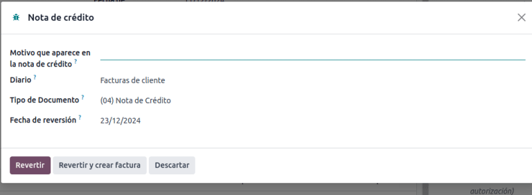

When the :guilabel:`Partial Refund` option is used, you can change the amount of the credit note and
then validate it. Before validating the credit note, review the following information:

- :guilabel:`Customer`: type the customer's information.
- :guilabel:`Journal`: select the printer point for the customer Credit Note.
- :guilabel:`Document Type`: this is the document type `(04) Credit Note`.
- :guilabel:`Products`: It must specify the product with the correct taxes.

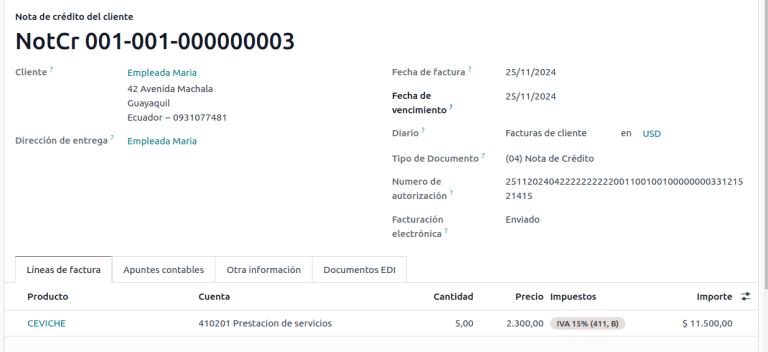

Customer debit note
~~~~~~~~~~~~~~~~~~~

The :guilabel:`Customer debit note` is an electronic document that, when validated, is sent to SRI.
It is necessary to have a validated (posted) invoice in order to register a debit note. On the
invoice there is a button named :guilabel:`Debit Note`, click on this button to be directed to the
:guilabel:`Create debit note` form, then complete the following information:

- :guilabel:`Reason`: type the reason for the debit note.
- :guilabel:`Debit note date`: select the :guilabel:`specific` options.
- :guilabel:`Copy lines`: select this option if you need to register a debit note with the same
  lines of invoice.
- :guilabel:`Use Specific Journal`: select the printer point for your credit note, or leave it empty
  if you want to use the same journal as the original invoice.

Once reviewed you can click on the :guilabel:`Create Debit Note` button.

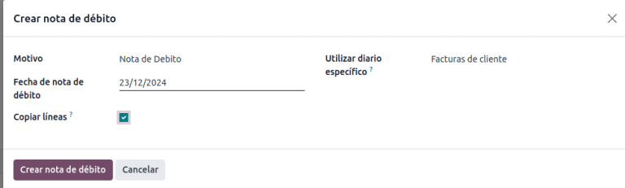

You can change the debit note amount, and then validate it. Before validating the debit note, review
the following information:

- :guilabel:`Customer`: type the customer's information.
- :guilabel:`Journal`: select the printer point for the customer Credit Note.
- :guilabel:`Document Type`: this is the document type `(05) Debit Note`.
- :guilabel:`Products`: It must specify the product with the correct taxes.

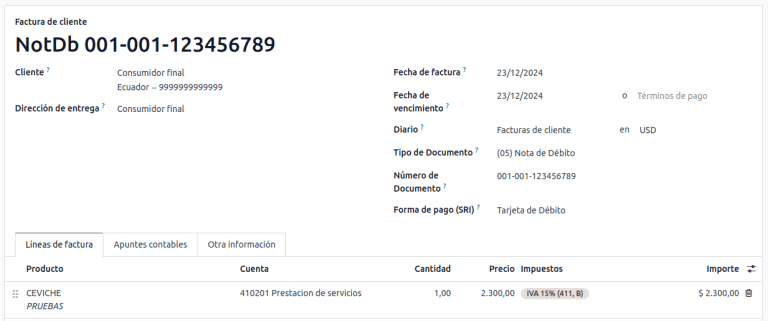

Customer withholding
~~~~~~~~~~~~~~~~~~~~

The :guilabel:`Customer withholding` is a non-electronic document for your company, this document is
issued by the client in order to apply a withholding to the sale.

It is necessary to have a validated (posted) invoice in order to register a customer withholding. On
the invoice there is a button named :guilabel:`Add Withhold`,  click on this button to be directed
to the :guilabel:`Customer withholding` form, then complete the following information:

- :guilabel:`Document Number`: type the withholding number.
- :guilabel:`Withhold Lines`: select the taxes that the customer is withholding.

Before validating the withholding, review that the amounts for each tax are the same as the original
document.

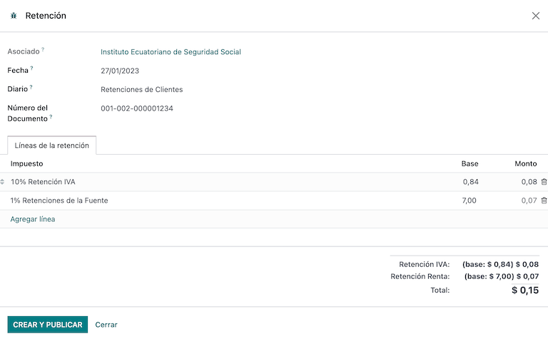

Purchase Documents
------------------

Vendor bill
~~~~~~~~~~~

The :guilabel:`Vendor bill` is a non-electronic document for your company, this document is issued
by your vendor when your company generates a purchase.

The bills can be created from the purchase order or manually, it must contain the following
information:

- :guilabel:`Vendor`: type the vendor's information.
- :guilabel:`Bill Date`: select the date of invoice.
- :guilabel:`Journal`: it is the journal for vendor bills.
- :guilabel:`Document Type`: this is the document type `(01) Invoice`
- :guilabel:`Document number`: type the document number.
- :guilabel:`Payment Method (SRI)`: select how the invoice is going to be paid.
- :guilabel:`Products`: specify the product with the correct taxes.

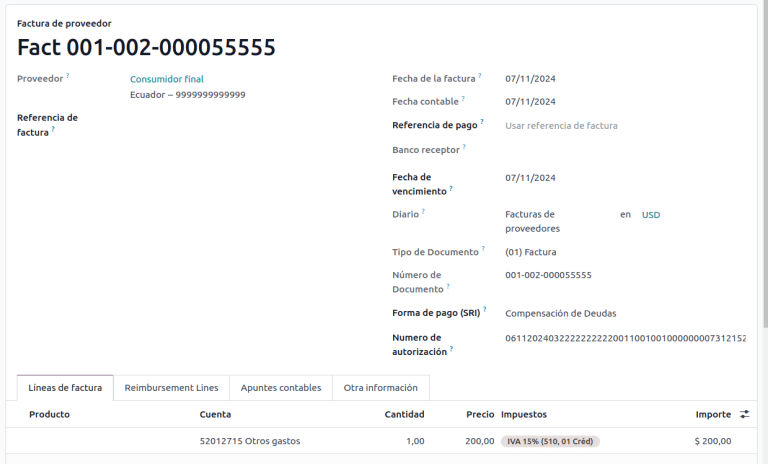

.. important::
   When creating the purchase withholding, verify that the bases (base amounts) are correct. If you
   need to edit the amount of the tax in the :guilabel:`Vendor bill`, click the :guilabel:`Edit`
   button. Otherwise, from the :guilabel:`Journal Items` tab click the :guilabel:`Edit` button and
   set the adjustment to go where you want.

Purchase liquidation
~~~~~~~~~~~~~~~~~~~~

The :guilabel:`Purchase liquidation` is an electronic document that, when validated, is sent to SRI.

Companies issue this type of electronic document when they purchase, and the vendor does not issue
an invoice due to one or more of the following cases:

- Services were provided by non-residents of Ecuador.
- Services provided by foreign companies without residency or establishment in Ecuador.
- Purchase of goods or services from natural persons not registered with a RUC, who due to their
  cultural level or hardiness are not able to issue sales receipts or customer invoices.
- Reimbursement for the purchase of goods or services to employees in a dependency relationship
  (full-time employee).
- Services provided by members of collegiate bodies for the exercise of their function.

These types of electronic documents can be created from the :guilabel:`Purchase Order` or manually
from the :guilabel:`Vendor Bills` form view. It must contain the following data:

- :guilabel:`Vendor`: type the vendor's information.
- :guilabel:`Journal`: select the journal for the :guilabel:`Purchase Liquidation` with the correct
  printer point.
- :guilabel:`Document Type`: this is the document type `(03) Purchase Liquidation`
- :guilabel:`Document number`: type the document number (sequence), you will only have to do this
  once, then the sequence will be automatically assigned for the next documents.
- :guilabel:`Payment Method (SRI)`: select how the invoice is going to be paid.
- :guilabel:`Products`: specify the product with the correct taxes.

Once you review the information you can validate the :guilabel:`Purchase Liquidation`.

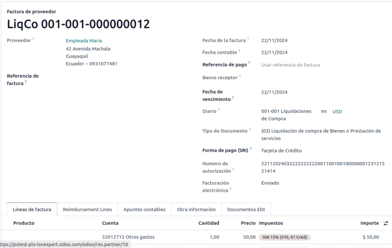
||||||| b952bf23c83190445b9fbf2d782ccfb935cebaa3
Configure master data
---------------------

Chart of accounts
~~~~~~~~~~~~~~~~~

The :doc:`chart of accounts <../accounting/get_started/chart_of_accounts>` is installed by default
as part of the set of data included in the localization module. The accounts are mapped
automatically in *Taxes*, *Default Account Payable*, *Default Account Receivable*.

Ecuador's chart of accounts is based on the most updated version of the *Superintendency of
Companies*, which is grouped into several categories and is compatible with NIIF accounting.

Accounts can be added or deleted according to the company's needs.

Products
~~~~~~~~

If products have any withholding taxes, they must be configured on the product form.

Go to :menuselection:`Accounting --> Vendors --> Products`. On the :guilabel:`General Information`
tab, specify both :guilabel:`Purchase Taxes` and :guilabel:`Profit Withhold`.

Taxes
~~~~~

The localization module automatically creates and configures taxes. If new taxes need to be created,
it is recommended to base them on the configuration of the existing ones.

To manage taxes, navigate to :menuselection:`Accounting --> Configuration --> Taxes`. Depending on
the tax type, the following options may be required for additional configuration:

- :guilabel:`Tax Name`: Follows a specific format depending on the tax type:

  - | **For IVA (Value-Added Tax)**:
    | `IVA [percent] (104, [form code] [tax support code] [tax support short name])`
    | Example: `IVA 12% (104, RUC [tax support code] IVA)`
  - | **For Income Tax Withholding codes**:
    | `Code ATS [percent of withhold] [withhold name]`
    | Example: `Code ATS 10% Retención a la Fuente`

- :guilabel:`Tax Support`: Configure only for the IVA tax. This option is used to register purchase
  withholdings.
- :guilabel:`Code ATS`: Configure only for income tax withholding codes, as it is necessary to
  register a withholding.

In the :guilabel:`Definition` tab:

- :guilabel:`Tax Grids`: Configure the code of a 104 form if it is an IVA tax, and the code of a
  103 form if it is an income tax withholding code.

.. seealso::
   :doc:`Configuring taxes <../accounting/taxes>`

Document types
~~~~~~~~~~~~~~

Some accounting transactions like *customer invoices* and *vendor bills* are classified by *document
types*. These are defined by the government fiscal authorities, which in this case is the SRI.

To access or configure document types, go to :menuselection:`Accounting --> Configuration -->
Document Types`.

Each document type can have a unique sequence per journal where it is assigned. As part of the
localization, the document type includes the country in which the document is applicable; also the
data is created automatically when the localization module is installed.

The information required for the document types is included by default and doesn't need to be
changed.

Workflows
=========

Once a company's database is configured, documents can be registered to enable workflows across
Odoo's applications, such as **Accounting**, **Inventory**, and **Sales**.

Sales documents
---------------

Customer invoices
~~~~~~~~~~~~~~~~~

:guilabel:`Customer invoices` are electronic documents that, when validated, are sent to SRI. These
documents can be :doc:`created from your sales order or manually
<../accounting/customer_invoices/overview>`.

They must contain the following data:

- :guilabel:`Journal`: Select the option matching the customer invoice's printer point.
- :guilabel:`Document Type`: Type the document type in this format: `(01) Invoice`.
- :guilabel:`Payment Method (SRI)`: Select how the invoice will be paid.

.. seealso::
   :doc:`Manage customer invoices <../accounting/customer_invoices/overview>`

Customer credit note
~~~~~~~~~~~~~~~~~~~~

The :doc:`customer credit note <../accounting/customer_invoices/credit_notes>` is an electronic
document that, when validated, is sent to SRI. A validated (posted) invoice is necessary to register
a credit note.

On the invoice, click :guilabel:`Credit note` and complete the following information in the
:guilabel:`Credit note` window:

- :guilabel:`Reason`: Type the reason for the credit note.
- :guilabel:`Journal`: Select the journal for the reversal.
- :guilabel:`Document Type`: By default, :guilabel:`(04) Credit Note` is selected.
- :guilabel:`Reversal date`: Set the date for the reversal.

Then, click :guilabel:`Reverse` to first review the invoice or click :guilabel:`Reverse and Create
Invoice`.

.. note::
   When creating the first credit note, select :guilabel:`Reverse` and assign the first credit note
   number or by default Odoo assigns `NotCr 001-001-000000001` as the first credit note number.

Once the credit note is created, modify :guilabel:`Product` and :guilabel:`Quantity` if needed. Make
sure the correct :guilabel:`Customer`, :guilabel:`Journal`, and :guilabel:`Document Type` are
specified, and the products listed on the :guilabel:`Invoice Lines` tab are configured with the
correct taxes.

To validate, click :guilabel:`Confirm`.

Customer debit note
~~~~~~~~~~~~~~~~~~~

The :ref:`customer debit note <accounting/credit_notes/issue-debit-note>` is an electronic document
that, when validated, is sent to SRI.

A validated (posted) invoice is necessary to register a debit note. Select the related invoice to
issue a debit note in the :guilabel:`Invoices` list view, click :icon:`fa-cog` :guilabel:`Actions`
and select :guilabel:`Create Debit Note`. Then, complete the following information in the
:guilabel:`Create Debit Note` window.

- :guilabel:`Reason`: Enter the reason for the debit note.
- :guilabel:`Debit note date`: Set the debit note date.
- :guilabel:`Copy lines`: Select this option to register a debit note with the same lines of
  invoice.
- :guilabel:`Use Specific Journal`: Select the printer point for your credit note, or leave it empty
  to use the same journal as the original invoice.

Then, click :guilabel:`Create Debit Note`.

The debit note amount can be changed, if desired.

Customer withholding
~~~~~~~~~~~~~~~~~~~~

The :guilabel:`Customer withholding` is a non-electronic document issued by the client in order to
apply a withholding to a sale.

A validated (posted) invoice is necessary to register a customer withholding. On the invoice, click
:guilabel:`Add Withhold` and complete the following information in the :guilabel:`Customer
withholding` window:

- :guilabel:`Document Number`: Enter the withholding number.
- :guilabel:`Withhold Lines`: Select the taxes that the customer is withholding.

Before validating the withholding, review that the amounts for each tax are the same as the original
document.

Purchase Documents
------------------

.. _l10n_ec/vendor-bills:

Vendor bill
~~~~~~~~~~~

:doc:`Vendor bills <../accounting/vendor_bills>` are non-electronic documents issued by vendors when
a company generates a purchase. Vendor bills can be created from purchase orders or manually.

.. important::
   A vendor bill journal must be created to create vendor bill documents.

Create a vendor bill journal
****************************

To create a new journal, go to :menuselection:`Accounting --> Configuration --> Journals`, and click
:guilabel:`New`.

Then, configure the following:

- Select :guilabel:`Purchase` as the :guilabel:`Type`.
- **Do not** tick the :guilabel:`Purchase Liquidations` checkbox.
- Add a :guilabel:`Default Expense Account`.

Configure a vendor bill
***********************

To configure a vendor bill, make sure also to complete the following Ecuador specific fields:

- :guilabel:`Document Type`: Enter this document type: `(01) Invoice`.
- :guilabel:`Document number`: Enter the document number.
- :guilabel:`Payment Method (SRI)`: Select how the vendor bill will be paid.

.. important::
   When creating the purchase withholding, verify that the bases (base amounts) are correct. If you
   need to edit the amount of the tax in the :guilabel:`Vendor bill`, click :guilabel:`Edit`. Or,
   from the :guilabel:`Journal Items` tab, click :guilabel:`Edit` and set the adjustment as desired.

.. _l10n_ec/purchase-liquidation:

Purchase liquidation
~~~~~~~~~~~~~~~~~~~~

The *purchase liquidation* is an electronic document that, when validated, is sent to SRI.

Companies issue them when they make a purchase but the vendor does not provide an invoice, due to
one or more of the following reasons:

- Non-residents of Ecuador provided services.
- Foreign companies provided services without residency or facility in Ecuador.
- Purchase of goods or services from natural persons not registered with a RUC, who cannot issue
  sales receipts or customer invoices.
- Reimbursement for purchasing goods or services must be given to employees in a dependency
  relationship (full-time employee).
- Members of collegiate bodies have provided services in the exercise of their function.

In these cases, a purchase liquidation journal must be created.

Create a purchase liquidation journal
*************************************

To create a new journal, go to :menuselection:`Accounting --> Configuration --> Journals`, and click
:guilabel:`New`.

Then, configure the following:

- Select :guilabel:`Purchase` as the :guilabel:`Type`.
- Tick the :guilabel:`Purchase Liquidations` checkbox.
- Add a :guilabel:`Default Expense Account`.

Create a purchase liquidation
*****************************

These types of electronic documents can be created from the *purchase order* or manually from the
*vendor bills* form. Purchase liquidations must contain the following data:

- :guilabel:`Vendor`: Enter the vendor's information.
- :guilabel:`Journal`: Select the :guilabel:`Purchase Liquidation` journal with the correct printer
  point.
- :guilabel:`Document Type`: Enter this document type: `(03) Purchase Liquidation`
- :guilabel:`Document number`: Enter the document number (sequence). This must only be entered once,
  and the sequence will automatically be assigned to the subsequent documents.
- :guilabel:`Payment Method (SRI)`: Select how the invoice is going to be paid.
- :guilabel:`Products`: Specify the product with the correct taxes.

Once the information has been reviewed, validate the :guilabel:`Purchase Liquidation`.
=======
.. _localizations/ecuador/purchase-liquidation-creation:

Create a purchase liquidation
*****************************

Purchase liquidations, created from *purchase orders* or manually from *vendor bills*, must contain
the following data:

- :guilabel:`Vendor`: Enter the vendor's information.
- :guilabel:`Journal`: Select the :guilabel:`Purchase Liquidation` journal with the correct printer
  point.
- :guilabel:`Document Type`: Enter this document type: `(03) Purchase Liquidation`.
- :guilabel:`Document number`: Enter the document number (sequence). This must only be entered once,
  and the sequence will automatically be assigned to the subsequent documents.
- :guilabel:`Payment Method (SRI)`: Select how to pay the invoice.
- :guilabel:`Products`: Specify the product with the correct taxes.

Then, validate the :guilabel:`Purchase Liquidation`.

.. _localizations/ecuador/purchase-withholding:
>>>>>>> 531906549140c7f61afd4b557503dcc15f7538eb

Purchase withholding
~~~~~~~~~~~~~~~~~~~~

<<<<<<< 8f2eaa2df172806a2f7834bdc889b35ed05b62e0
The :guilabel:`Purchase withholding` is an electronic document that, when validated, is sent to SRI.
||||||| b952bf23c83190445b9fbf2d782ccfb935cebaa3
The *Purchase withholding* is an electronic document that, when validated, is sent to SRI.
=======
*Purchase withholdings* are electronic documents sent to the SRI once they're validated. They can
only be registered from a validated (posted) invoice.
>>>>>>> 531906549140c7f61afd4b557503dcc15f7538eb

<<<<<<< 8f2eaa2df172806a2f7834bdc889b35ed05b62e0
It is necessary to have an invoice in a validated state in order to register a :guilabel:`Purchase
withholding`. On the invoice, there is a button named :guilabel:`Add Withhold`, click on this button
to be directed to the :guilabel:`Withholding` form, then complete the following information:
||||||| b952bf23c83190445b9fbf2d782ccfb935cebaa3
An invoice in a validated state is necessary before registering a :guilabel:`Purchase withholding`.
On the invoice, click :guilabel:`Add Withhold` and complete the following fields in the
:guilabel:`Withholding` window:
=======
On the invoice, click :guilabel:`Add Withhold` and complete the following fields in the
:guilabel:`Withhold` window:
>>>>>>> 531906549140c7f61afd4b557503dcc15f7538eb

- :guilabel:`Document number`: type the document number (sequence), you will only have to do this
  once, then the sequence will be automatically assigned for the next documents.
- :guilabel:`Withhold lines`: The taxes appear automatically according to the configuration of
  products and vendors, you should review if the taxes and tax support are correct, and, if it is
  not correct, you can edit and select the correct taxes and tax support.

Once you review the information you can validate the :guilabel:`Withholding`.

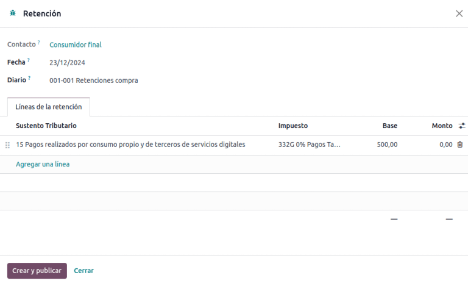

.. note::
   You can't change the tax support for one that was not included in the configuration of the taxes
   used on the :guilabel:`Vendor Bill`. To do so, go to the tax applied on the :guilabel:`Vendor
   Bill` and change the :guilabel:`Tax Support` there.

<<<<<<< 8f2eaa2df172806a2f7834bdc889b35ed05b62e0
A withholding tax can be divided into two or more lines, this will depend on whether two or more
withholdings percentages apply.
||||||| b952bf23c83190445b9fbf2d782ccfb935cebaa3
A withholding tax can be divided into two or more lines, depending on whether two or more
withholdings percentages apply.
=======
A withholding tax can be divided into two or more lines, depending on whether two or more
withholding percentages apply.
>>>>>>> 531906549140c7f61afd4b557503dcc15f7538eb

.. example::
<<<<<<< 8f2eaa2df172806a2f7834bdc889b35ed05b62e0
   The system suggests a VAT withholding of 30% with tax support 01, you can add your VAT
   withholding of 70% in a new line with the same tax support, the system will allow you as long as
   the total of the bases matches the total from the :guilabel:`Vendor Bill`.
||||||| b952bf23c83190445b9fbf2d782ccfb935cebaa3
   The system suggests a VAT withholding of 30% with tax support 01. VAT withholding of 70% can be
   added in a new line with the same tax support. Odoo allows it if the base total matches the
   :guilabel:`Vendor Bill`'s total.

Expense reimbursement
---------------------

Expense reimbursements apply to the following cases:

- :guilabel:`Individual`: reimbursement to an employee for miscellaneous expenses (e.g. purchase
  liquidations)
- :guilabel:`Legal Entity`: reimbursement for incurred expenses, such as representation expenses
  (e.g. hiring a lawyer)

To enable an expense reimbursement, make sure a :ref:`purchase liquidation journal
<l10n_ec/purchase-liquidation>` has been created for an individual or a :ref:`vendor bills journal
<l10n_ec/vendor-bills>` for a legal entity.

.. note::
   In the vendor bills journal, be sure the following necessary configurations are set for a legal
   entity:

   - Select :guilabel:`Purchase` as the :guilabel:`Type`.
   - **Do not** tick the :guilabel:`Purchase Liquidations` checkbox.
   - Add a :guilabel:`Default Expense Account`.

Next, to create a reimbursement, :ref:`create a vendor bill <l10n_ec/vendor-bills>` using the
*purchase liquidation* or *vendor bills* journal. On the vendor bill, configure the following
fields:

- :guilabel:`Vendor`: This field should be an employee.
- :guilabel:`Document Type`: Verify that this field is accurately populated from the journal.
- :guilabel:`Payment Method (SRI)`: Select a payment method.
- :guilabel:`Reimbursement Lines` tab: Click :guilabel:`Auto Fill Invoice Lines` to automatically
  populate the invoice lines or add the expenses line by line, and provide the following details for
  each expense:

  - :guilabel:`Partner or authorization number`
  - :guilabel:`Date`
  - :guilabel:`Document Type`
  - :guilabel:`Document Number`
  - :guilabel:`Tax Base`
  - :guilabel:`Tax`

Then, click :guilabel:`Confirm Vendor Bill` and :guilabel:`Process Now`. The XML and authorization
number for the purchase liquidation are recorded, and the purchase withholding created from this
vendor bill includes the reimbursement information.

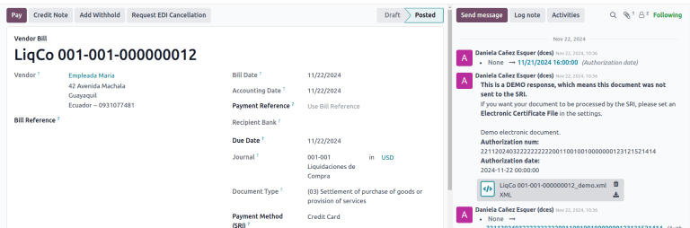
=======
   Odoo suggests a VAT withholding of 30% with tax support 01. VAT withholding of 70% can be added
   to a new line with the same tax support. Odoo allows it if the base total matches the
   :guilabel:`Vendor Bill`'s total.

.. _localizations/ecuador/expense reimbursement:

Expense reimbursement
---------------------

Expense reimbursements apply to the following cases:

- :guilabel:`Individual`: reimbursement to an employee for miscellaneous expenses (e.g., purchase
  liquidations)
- :guilabel:`Legal Entity`: reimbursement for incurred expenses, such as representation expenses
  (e.g., hiring a lawyer)

To enable expense reimbursement, make sure a :ref:`purchase liquidation journal
<localizations/ecuador/purchase-liquidation>` has been created for an individual or a :ref:`vendor
bills journal <localizations/ecuador/vendor-bill>` for a legal entity.

.. note::
   In the vendor bills journal, be sure the following necessary configurations are set for a legal
   entity:

   - Select :guilabel:`Purchase` as the :guilabel:`Type`.
   - **Do not** tick the :guilabel:`Purchase Liquidations` checkbox.
   - Add a :guilabel:`Default Expense Account`.

Next, to create a reimbursement, :ref:`create a vendor bill <localizations/ecuador/vendor-bill>`
using the *purchase liquidation* or *vendor bills* journal. On the vendor bill, configure the
following fields:

- :guilabel:`Vendor`: This field should be an employee.
- :guilabel:`Document Type`: Verify that this field is accurately populated from the journal.
- :guilabel:`Payment Method (SRI)`: Select a payment method.
- :guilabel:`Reimbursement Lines` tab: Click :guilabel:`Auto Fill Invoice Lines` to automatically
  populate the invoice lines or add the expenses line by line, and provide the following details for
  each expense:

  - :guilabel:`Partner or authorization number`
  - :guilabel:`Date`
  - :guilabel:`Document Type`
  - :guilabel:`Document Number`
  - :guilabel:`Tax Base`
  - :guilabel:`Tax`

Then, click :guilabel:`Confirm Vendor Bill` and :guilabel:`Process Now`. The XML and authorization
number for the purchase liquidation are recorded, and the purchase withholding created from this
vendor bill includes the reimbursement information.

>>>>>>> 531906549140c7f61afd4b557503dcc15f7538eb

.. _localizations/ecuador/electronic-delivery-guide:

<<<<<<< 8f2eaa2df172806a2f7834bdc889b35ed05b62e0
The :ref:`ATS Report module <ecuador/ats>` enables the following:
||||||| b952bf23c83190445b9fbf2d782ccfb935cebaa3
The :ref:`ATS Report module <l10n_ec/ats>` enables the following:
=======
Electronic delivery guide
-------------------------

An *Electronic Delivery Guide* in Ecuador is a legal document that supports the transportation of
goods or merchandise from one place to another within the national territory. It is issued by the
sender of the goods and aims to record and justify the movement of products to avoid legal or tax
issues. It is a fiscal requirement mandated by the *Internal Revenue Service (SRI)*.

.. important::
   Make sure to :doc:`install </applications/general/apps_modules>` the :guilabel:`Ecuadorian
   Delivery Guide` (`l10n_ec_edi_stock`) module.

.. _localizations/ecuador/transporter:

Transporter
~~~~~~~~~~~

To create a new carrier (transporter), first :doc:`create a new contact <../../essentials/contacts>`
and fill out the contact information as a :guilabel:`Company`. Make sure the following fields are
complete:

- :guilabel:`Identification Number`: Select :guilabel:`RUC` and type the carrier's RUC number.
- :guilabel:`SRI Taxpayer Type`: Select :guilabel:`Companies - Legal Entities` as the partner
  position in the tax pyramid to automate the computation of VAT withholdings.

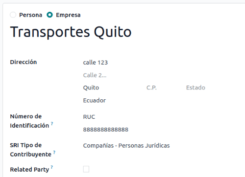

.. _localizations/ecuador/certificate-file:

Certificate file for SRI
~~~~~~~~~~~~~~~~~~~~~~~~

To upload the certificate file for SRI, go to :menuselection:`Accounting --> Configuration -->
Settings`, scroll to the :guilabel:`Ecuadorian Localization` section, and click
:icon:`oi-arrow-right` :guilabel:`SRI Certificates` in the :guilabel:`SRI Connection` section. Then,
to create a new certificate, click :guilabel:`New` and fill out the following fields:

- :guilabel:`Name`: The title of the certificate.
- :guilabel:`Certificate`: Use the :guilabel:`Upload your file` button to upload the SRI
  certificate.
- :guilabel:`Certificate Password`: Include the password to decrypt the PKS file if required.

Once the certificate is created, click :guilabel:`Settings` to go back to the settings and ensure
the certificate is selected in the :guilabel:`Certificate file for SRI` field and the :guilabel:`Use
production servers` checkbox is ticked.

.. _localizations/ecuador/warehouse configuration:

Warehouse configuration
~~~~~~~~~~~~~~~~~~~~~~~

To configure a warehouse, first :doc:`create a new warehouse
<../../inventory_and_mrp/inventory/warehouses_storage/inventory_management/warehouses>`. Enter the
following data for each warehouse that generates an electronic delivery guide:

- :guilabel:`Entity Point`: the emission entity number given by the SRI
- :guilabel:`Emission Point`: the emission point number given by the SRI
- :guilabel:`Next Delivery Guide Number`: the forwarding tracking number (editable after first
  saving the warehouse).

.. _localizations/ecuador/generate-electronic-delivery:

Generate an electronic delivery guide
~~~~~~~~~~~~~~~~~~~~~~~~~~~~~~~~~~~~~

Once the :doc:`delivery <../../inventory_and_mrp/inventory/shipping_receiving/setup_configuration>`
from inventory is created during the sales workflow, make sure the following fields are complete in
the :guilabel:`Delivery Guide` section on the :guilabel:`Additional info` tab:

- :guilabel:`Transporter`: Enter the :ref:`contact <localizations/ecuador/transporter>` created.
- :guilabel:`Plate Number`: Enter the vehicle plate number.
- :guilabel:`Transfer Reason`: By default, :guilabel:`Goods dispatch` is set; modify as needed.
- :guilabel:`Start date`: Automatically set to the creation date (editable).
- :guilabel:`End date`: Automatically set to 15 days after the start date (editable).

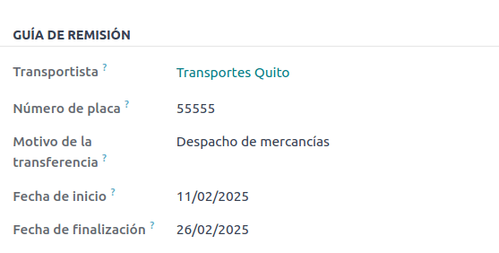

Click :guilabel:`Validate`, then :guilabel:`Generate Delivery Guide`. Subsequently, the following
information will be available in the :guilabel:`Delivery Guide` section:

- :guilabel:`Authorization date`: date on which the government authorizes the document.
- :guilabel:`Authorization number`: EDI authorization number (same as access key).
- :guilabel:`Delivery Guide Status`: status of the delivery guide.

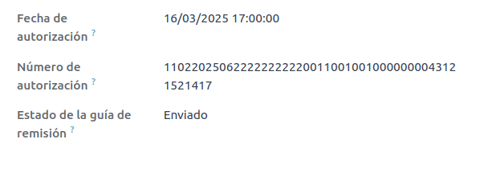

To receive the XML and PDF, an email can be sent to the contact used in the :guilabel:`Delivery
Address` field  - this is an optional and manual step; the :guilabel:`Send Email` button needs to be
clicked.

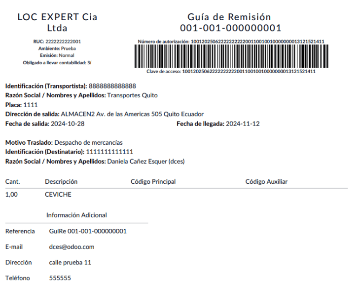

.. _localizations/ecuador/ecommerce:

eCommerce
=========

The :ref:`ATS Report module <localizations/ecuador/ats>` enables the following:
>>>>>>> 531906549140c7f61afd4b557503dcc15f7538eb

- Choose the SRI Payment Method in each payment method's configuration.
- Customers can manually input their identification type and identification number during the
  eCommerce checkout process.
- Automatically generate a valid electronic invoice for Ecuador at the end of the checkout process.

Configuration
~~~~~~~~~~~~~

<<<<<<< 8f2eaa2df172806a2f7834bdc889b35ed05b62e0
Website
*******
||||||| b952bf23c83190445b9fbf2d782ccfb935cebaa3
Online payments
~~~~~~~~~~~~~~~

To enable online payments, add the relevant :doc:`payment provider(s) <../payment_providers>` and
configure the necessary :ref:`payment methods <payment_providers/payment_methods>`. It is mandatory
to set the :guilabel:`SRI Payment Method` for each method.

.. note::
   Adding the :guilabel:`SRI Payment Method` is necessary to correctly generate the electronic
   invoice from an eCommerce sale. Select a **payment method** to access its configuration menu and
   field.

Automatic invoice
~~~~~~~~~~~~~~~~~
=======
.. _localizations/ecuador/online-payments:

Online payments
---------------

To enable online payments, add the relevant :doc:`payment provider(s) <../payment_providers>` and
configure the necessary :ref:`payment methods <payment_providers/payment_methods>`. It is mandatory
to set the :guilabel:`SRI Payment Method` for each method.

.. note::
   Adding the :guilabel:`SRI Payment Method` is necessary to correctly generate the electronic
   invoice from an eCommerce sale. Select a **payment method** to access its configuration menu and
   field.

.. _localizations/ecuador/automatic-invoice:
>>>>>>> 531906549140c7f61afd4b557503dcc15f7538eb

Automatic invoice
-----------------

:ref:`Invoices <handling/legal>` can be generated after the checkout process.

.. tip::
   The invoice's email template can be modified from the :guilabel:`Invoice Email Template` field
   under the :guilabel:`Automatic Invoice` option.

.. important::
   The sales journal used for invoicing is the first in the priority sequence in the
   :guilabel:`Journal` menu.

<<<<<<< 8f2eaa2df172806a2f7834bdc889b35ed05b62e0
Payment providers
*****************

To activate the payment providers that should be used to capture eCommerce payments, navigate to
:menuselection:`Website --> Configuration --> Payment Providers` section and then click on the
:guilabel:`View other providers` button under the :guilabel:`Activate Payments` heading. From here,
each payment provider can be configured by selecting a provider record. Refer to the :doc:`payment
provider <../payment_providers>` documentation for more information.

Payment methods
^^^^^^^^^^^^^^^

To activate one or more payment methods for a payment provider, click :guilabel:`→ Enable Payment
Methods` within the :guilabel:`Configuration` tab of each provider.

When configuring the payment method, it is **mandatory** to set the :guilabel:`SRI Payment Method`
for each method. This field appears after you create and save the payment method for the first
time.

.. note::
   Adding the :guilabel:`SRI Payment Method` is necessary to generate correctly the electronic
   invoice from an eCommerce sale. Select a **payment method** to access its configuration menu and
   the field.

.. seealso::
   :doc:`Payment provider <../payment_providers>`

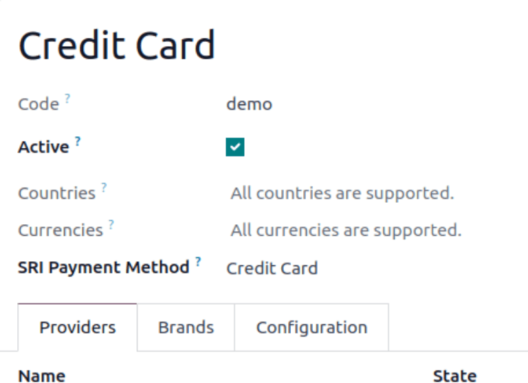

eCommerce workflow
~~~~~~~~~~~~~~~~~~
||||||| b952bf23c83190445b9fbf2d782ccfb935cebaa3
eCommerce workflow
~~~~~~~~~~~~~~~~~~
=======
.. _localizations/ecuador/ecommerce-workflow:
>>>>>>> 531906549140c7f61afd4b557503dcc15f7538eb

Identification type and number
------------------------------

During the checkout process, the client making a purchase will have the option to indicate their
identification type and number. This information is required to generate the electronic invoice
after the checkout is completed correctly.

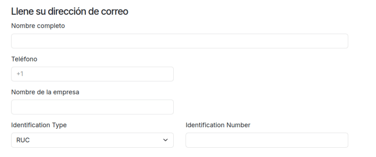

.. note::
   Verification is done to ensure the :guilabel:`Identification Number` field is completed and has
<<<<<<< 8f2eaa2df172806a2f7834bdc889b35ed05b62e0
   the correct number of digits. For RUC identification, 13 digits are required. For Cédula,
   9 digits are required.
||||||| b952bf23c83190445b9fbf2d782ccfb935cebaa3
   the correct number of digits. For RUC identification, 13 digits are required. For Cédula, 9
   digits are required.
=======
   the correct number of digits. For RUC identification, 13 digits are required, and for Cédula, 9
   digits are required.
>>>>>>> 531906549140c7f61afd4b557503dcc15f7538eb

After finishing the checkout process, a confirmed invoice is generated, ready to be sent manually or
asynchronously to the SRI.

<<<<<<< 8f2eaa2df172806a2f7834bdc889b35ed05b62e0
Point of Sale electronic invoicing
----------------------------------
||||||| b952bf23c83190445b9fbf2d782ccfb935cebaa3
Point of sale electronic invoicing
----------------------------------
=======
.. _localizations/ecuador/point-of-sale:

Point of sale electronic invoicing
==================================
>>>>>>> 531906549140c7f61afd4b557503dcc15f7538eb

Make sure the *Ecuadorian module for Point of Sale* (`l10n_ec_edi_pos`) is :ref:`installed
<localizations/ecuador/module-installation>` to enable the following features and configurations:

- Choose the SRI payment method in each payment method configuration.
<<<<<<< 8f2eaa2df172806a2f7834bdc889b35ed05b62e0
- Manually input the customer's identification type and identification number when creating a
  new contact on *POS*.
||||||| b952bf23c83190445b9fbf2d782ccfb935cebaa3
- Manually input the customer's identification type and identification number when creating a new
  contact on *POS*.
=======
- Manually input the customer's identification type and number when creating a new contact on *POS*.
>>>>>>> 531906549140c7f61afd4b557503dcc15f7538eb
- Automatically generate a valid electronic invoice for Ecuador at the end of the checkout process.

.. _localizations/ecuador/payment-method-configuration:

Payment method configuration
----------------------------

To :doc:`create a payment method for a point of sale <../../sales/point_of_sale/payment_methods>`,
go to :menuselection:`Point of Sale --> Configuration --> Payment Methods`. Then, set the
:guilabel:`SRI Payment Method` in the payment method form.

.. _localizations/ecuador/invoicing-flow:

Invoicing flows
---------------

.. _localizations/ecuador/identification-type-number:

Identification type and number
~~~~~~~~~~~~~~~~~~~~~~~~~~~~~~

The POS cashier can :ref:`create a new contact for a customer <pos/customers>` who requests an
invoice from an open POS session.

The *Ecuadorian Module for Point of Sale* adds two new fields to the contact creation form:
:guilabel:`Identification Type` and :guilabel:`Tax ID`.

.. note::
   As the identification number length differs depending on the identification type, Odoo
   automatically checks the :guilabel:`Tax ID` field when saving the contact form. To manually
   ensure the length is correct, know that the :guilabel:`RUC` and :guilabel:`Citizenship` types
   require 13 and 10 digits, respectively.

.. _localizations/ecuador/anonymous-end-consumer:

Electronic invoice: anonymous end consumer
~~~~~~~~~~~~~~~~~~~~~~~~~~~~~~~~~~~~~~~~~~

When clients do not request an electronic invoice for their purchase, Odoo automatically sets the
customer as :guilabel:`Consumidor Final` and generates an electronic invoice anyway.

.. note::
   If the client requests a credit note due to a return of this type of purchase, the credit note
   should be made using the client's real contact information. Credit notes cannot be created for
   *Consumidor Final* and can be managed :ref:`directly from the POS session <pos/refund>`.

.. _localizations/ecuador/specific-customer:

Electronic invoice: specific customer
~~~~~~~~~~~~~~~~~~~~~~~~~~~~~~~~~~~~~

If a customer requests an invoice for their purchase, it is possible to select or create a contact
with their fiscal information. This ensures the invoice is generated with accurate customer details.

.. note::
   If the client requests a credit note due to a return of this type of purchase, the credit note
   and return process can be managed :ref:`directly from the POS session <pos/refund>`.
<<<<<<< 8f2eaa2df172806a2f7834bdc889b35ed05b62e0

Financial reports
=================

In Ecuador, there are fiscal reports that the company presents to SRI. Odoo supports two of the main
financial reports used by companies: **reports 103** and **104**.

To get these reports, go to the **Accounting** app and select :menuselection:`Reporting -->
Statements Reports --> Tax Report` and then filter by `Tax Report 103` or `Tax Report 104`.

Report 103
----------

This report contains information of income tax withholdings in a given period, this can be reported
monthly or semi-annually.

You can see the information needed to report, which includes base and tax amounts, but also includes
the tax code within the parenthesis in order to report it to the SRI.

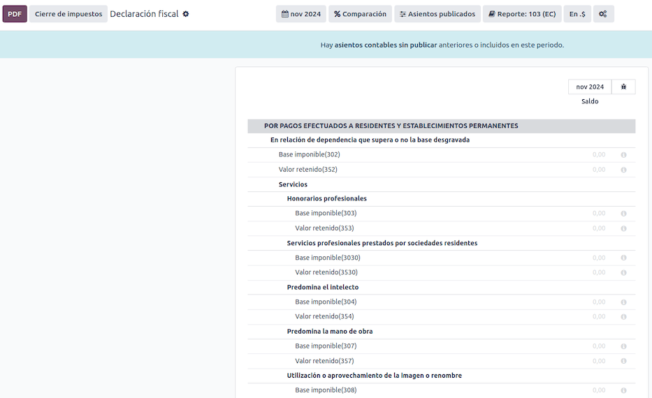

Report 104
----------

This report contains information on VAT tax and VAT withholding for a given period, this can be
monthly or semi-annually.

You can see the information needed to report, which includes base and tax amounts, but also includes
the tax code within the parenthesis to report it to the SRI.

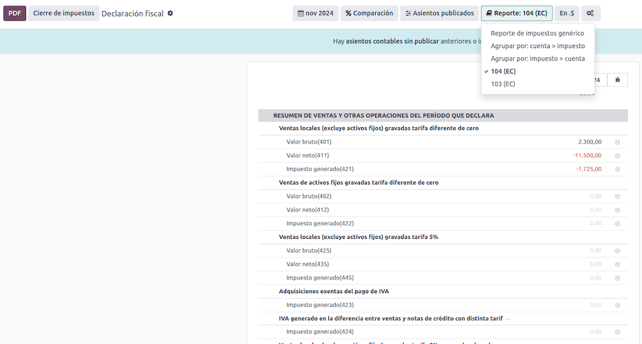

.. _ecuador/ats:

ATS report
----------

:ref:`Install <general/install>` the *ATS Report* (`l10n_ec_reports_ats`) module to enable
downloading the ATS report in XML format.

.. note::
   The Ecuadorian *ATS Report* module depends on the previous installation of the *Accounting* app
   and the *Ecuadorian EDI module*.

Configuration
~~~~~~~~~~~~~

To issue electronic documents, ensure your company is configured as explained in the
:ref:`electronic invoice <l10n_ec/configure-your-company>` section.

In the :abbr:`ATS (Anexo Transaccional Simplificado)`, every document generated in Odoo (invoices,
vendor bills, sales and purchases withholdings, credit notes, and debit notes) will be included.

Vendor bills
************

When generating a vendor bill, it is necessary to register the authorization number from the
invoice that the vendor generated for the purchase. To do so, go to :menuselection:`Accounting
--> Vendors --> Bills` and select the bill. Then, enter the number from the vendor's invoice in the
:guilabel:`Authorization Number` field.

Credit and debit notes
**********************

When generating a credit note or debit note manually or through importation, it is necessary to link
this note to the sales invoice that is being modified by it.

.. note::
   Remember to add all required information to the documents before downloading the :abbr:`ATS
   (Anexo Transaccional Simplificado)` file. For example, add the *Authorization Number* and the
   *SRI Payment Method* on documents, when needed.

XML generation
~~~~~~~~~~~~~~

To generate the :abbr:`ATS (Anexo Transaccional Simplificado)` report, go to
:menuselection:`Accounting --> Reports --> Tax Report` and choose a time period for the desired
:abbr:`ATS (Anexo Transaccional Simplificado)` report, then click :guilabel:`ATS`.

The downloaded XML file is ready to be uploaded to *DIMM Formularios*.

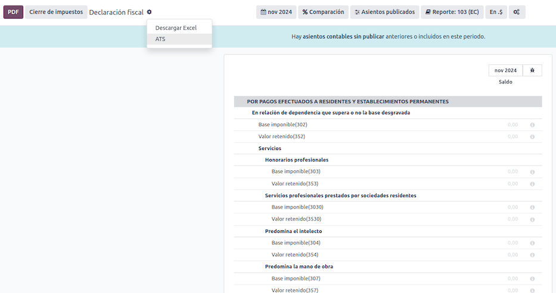

.. note::
   When downloading the :abbr:`ATS (Anexo Transaccional Simplificado)` report, Odoo generates a
   warning pop-up alerting the user if a document(s) has missing or incorrect data. Nevertheless,
   the user can still download the XML file.
||||||| b952bf23c83190445b9fbf2d782ccfb935cebaa3

Financial reports
=================

In Ecuador, there are fiscal reports that the company presents to SRI. Odoo supports two of the main
financial reports used by companies: **reports 103** and **104**.

To get these reports, go to :menuselection:`Accounting --> Reporting --> Tax Return`.  Click the
:icon:`fa-book` :guilabel:`Report:` icon and select `103 (EC)` or `104 (EC)`.

Report 103
----------

This report provides details on income tax withholdings in a given period and can be reported
monthly or semi-annually. It includes information about base, tax amounts, and tax codes, and can be
used for SRI reporting.

Report 104
----------

This report provides details on VAT tax and VAT withholding for a given period and can be generated
monthly or semi-annually. It includes information about base, tax amounts, and tax codes, and can be
used for SRI reporting.

.. _l10n_ec/ats:

ATS report
----------

:ref:`Install <general/install>` the *ATS Report* (`l10n_ec_reports_ats`) module to enable
downloading the ATS report in XML format.

.. note::
   The Ecuadorian *ATS Report* module depends on the previous installation of the *Accounting* app
   and the *Ecuadorian EDI module*.

Configuration
~~~~~~~~~~~~~

To issue electronic documents, ensure the company is configured as explained in the
:ref:`electronic invoice <l10n_ec/configure-your-company>` section.

In the :abbr:`ATS (Anexo Transaccional Simplificado)`, every document generated in Odoo (invoices,
vendor bills, sales and purchases withholdings, credit notes, and debit notes) will be included.

Vendor bills
************

When generating a vendor bill, it is necessary to register the authorization number from the
vendor's invoice. To do so, go to :menuselection:`Accounting --> Vendors --> Bills` and select the
bill. Then, enter the number from the vendor's invoice in the :guilabel:`Authorization Number`
field.

Credit and debit notes
**********************

When generating a credit note or debit note manually or through an import, it is necessary to link
this note to the sales invoice that is being modified by it.

.. note::
   Remember to add all required information to the documents before downloading the :abbr:`ATS
   (Anexo Transaccional Simplificado)` file. For example, add the *Authorization Number* and the
   *SRI Payment Method* on documents, when needed.

XML generation
~~~~~~~~~~~~~~

To generate the :abbr:`ATS (Anexo Transaccional Simplificado)` report, go to
:menuselection:`Accounting --> Reporting --> Tax Return`. Choose a time period for the desired
:abbr:`ATS (Anexo Transaccional Simplificado)` report, then click :guilabel:`ATS`.

The downloaded XML file is ready to be uploaded to *DIMM Formularios*.

.. note::
   When downloading the :abbr:`ATS (Anexo Transaccional Simplificado)` report, Odoo generates a
   warning pop-up alerting the user if a document(s) has missing or incorrect data. Nevertheless,
   the XML file can still be downloaded.
=======
>>>>>>> 531906549140c7f61afd4b557503dcc15f7538eb
