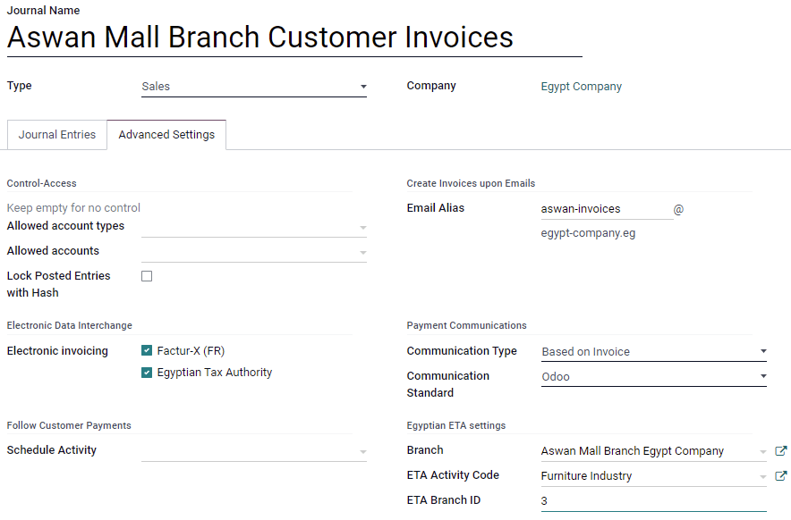
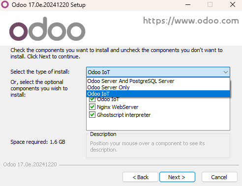

=====
Egypt
=====

.. _egypt/installation:

Installation
============

:ref:`Install <general/install>` the following modules to get all the features of the Egyptian
localization:

.. list-table::
   :header-rows: 1

   * - Name
     - Technical name
     - Description
   * - :guilabel:`Egypt - Accounting`
     - ``l10n_eg``
     - Default :ref:`fiscal localization package <fiscal_localizations/packages>`
   * - :guilabel:`Egyptian E-invoice Integration`
     - ``l10n_eg_edi_eta``
     - :ref:`Egyptian Tax Authority (ETA) e-invoicing integration <egypt/e-invoicing>`

.. _egypt/e-invoicing:

Egyptian e-invoicing
====================

Odoo is compliant with the **Egyptian Tax Authority (ETA) e-invoicing** requirements.

.. important::
   Egyptian e-invoicing is available from Odoo 15.0. If needed, :doc:`upgrade
   </administration/upgrade>` your database.

.. seealso::
   - `Video: Egypt E-invoicing <https://www.youtube.com/watch?v=NXuBPLR4pVw>`_
   - :doc:`/administration/upgrade`

.. _egypt/e-invoicing-eta-portal:

Register Odoo on your ETA portal
--------------------------------

You must register your Odoo ERP system on your ETA portal to get your API credentials. You need
these codes to :ref:`configure your Odoo Accounting app <egypt/e-invoicing-configuration>`.

Access your company profile on the ETA portal by clicking on :guilabel:`View Taxpayer Profile`.

.. image:: egypt/taxpayer-profile.png
   :align: center
   :alt: Clicking on "View Taxpayer Profile" on an ETA invoicing portal

Next, go to the :guilabel:`Representatives` section and then click on :guilabel:`Register ERP`.
Fill out the :guilabel:`ERP Name` (e.g., ``Odoo``) and leave the other fields empty.

.. image:: egypt/add-erp-system.png
   :align: center
   :alt: Filling out of the form to register an ERP system on the ETA portal.

Once successfully registered, the website displays your API credentials:

- Client ID
- Client Secret 1
- Client Secret 2

.. note::
   - ETA should give you a username and a password to access their online portal.
   - Ask ETA to provide you with preproduction portal access as well.
   - These codes are confidential and should be stored safely.

.. _egypt/e-invoicing-configuration:

Configuration on Odoo
---------------------

To connect your Odoo database to your ETA portal account, go to :menuselection:`Accounting -->
Configuration --> Settings --> ETA E-Invoicing Settings`, and set the :guilabel:`ETA Client ID` and
:guilabel:`ETA Secret` that you retrieved when you :ref:`registered Odoo on your ETA portal
<egypt/e-invoicing-eta-portal>`. Set an invoicing threshold if needed.

.. image:: egypt/eta-api-integration.png
   :align: center
   :alt: Configuration of the ETA E-Invoicing credentials in Odoo Accounting

.. important::
   - **Test on your preproduction portal** before starting to issue real invoices on the production
     ETA portal.
   - **Credentials** for preproduction and production environments are different. Make sure to
     update them on Odoo when you move from one environment to another.
   - If not done yet, fill out your company details with your company's full address, country, and
     Tax ID.

.. _egypt/e-invoicing-eta-codes:

ETA codes
~~~~~~~~~

E-invoicing works with a set of codes provided by the ETA. You can use the `ETA documentation
<https://sdk.preprod.invoicing.eta.gov.eg/codes/>`_ to code your business attributes.

Most of these codes are handled automatically by Odoo, provided that your :ref:`branches
<egypt/e-invoicing-branches>`, :ref:`customers <egypt/e-invoicing-customers>`, and :ref:`products
<egypt/e-invoicing-products>` are correctly configured.

- Company Information:

  - Company Tax ID
  - | Branch ID
    | If you have only one branch, use ``0`` as the branch code.
  - Activity type Code

- Other Information:

  - | Product Codes
    | Your company's products should be coded and matched with their **GS1** or **EGS** codes.
  - | Tax Codes
    | Most of the taxes codes are already configured on Odoo in the :guilabel:`ETA Code (Egypt)`
      field. We advise you to make sure these codes match your company's taxes.

.. seealso::
   - `Egyptian eInvoicing & eReceipt SDK - Code Tables
     <https://sdk.preprod.invoicing.eta.gov.eg/codes/>`_
   - :doc:`../accounting/taxes`

.. _egypt/e-invoicing-branches:

Branches
~~~~~~~~

Create a contact and a journal for each branch of your company and configure its ETA settings.

To do so, go to :menuselection:`Accounting --> Configuration --> Journals`, then click on
:guilabel:`Create`.

Name the journal according to your company's branch and set the :guilabel:`Type` as
:guilabel:`Sales`. Next, open the :menuselection:`Advanced Settings` tab and fill out the
:guilabel:`Egyptian ETA settings` section:

- In the :guilabel:`Branch` field, select the branch's contact or create it.
- Set the :guilabel:`ETA Activity Code`.
- Set the :guilabel:`ETA Branch ID` (use ``0`` if you have one branch only).

.. important::
   The contact selected in the :guilabel:`Branch` field must be set as a :guilabel:`Company`
   (**not** as an :guilabel:`Individual`), and the :guilabel:`Address` and :guilabel:`Tax ID` fields
   must be filled out.

.. _egypt/e-invoicing-customers:

Customers
~~~~~~~~~

Make sure your customers' contact forms are correctly filled out so your e-invoices are valid:

- contact type: :guilabel:`Individual`: or :guilabel:`Company`:
- :guilabel:`Country`:
- :guilabel:`Tax ID`: Tax ID or Company registry for companies. National ID for individuals.

.. note::
   You can edit your customers' contact forms by going to :menuselection:`Accounting --> Customers
   --> Customers`.

.. _egypt/e-invoicing-products:

Products
~~~~~~~~

Make sure your products are correctly configured so your e-invoices are valid:

- :guilabel:`Product Type`: storable products, consumables, or services.
- :guilabel:`Unit of Measure`: if you also use Odoo Inventory and have enabled :doc:`Units of
  Measure <../../inventory_and_mrp/inventory/product_management/product_replenishment/uom>`.
- :guilabel:`Barcode`: **GS1** or **EGS** barcode
- :guilabel:`ETA Item code` (under the :menuselection:`Accounting` tab): if the barcode doesn't
  match your ETA item code.

.. note::
   You can edit your products by going to :menuselection:`Accounting --> Customers --> Products`.

.. _egypt/e-invoicing-usb-authentication:

USB authentication
------------------

Each person who needs to electronically sign invoices needs a specific USB key to authenticate and
send invoices to the ETA portal through an ERP.

.. note::
   You can contact the :abbr:`ETA (Egyptian Tax Authority)` or `Egypt Trust
   <https://www.egypttrust.com/>`_ to get these USB keys.

.. _egypt/e-invoicing-local-proxy:

Install Odoo as a local proxy on your computer
~~~~~~~~~~~~~~~~~~~~~~~~~~~~~~~~~~~~~~~~~~~~~~

An Odoo local server works as a bridge between your computer and your Odoo database hosted online.

Download the Odoo Community installer from the page https://www.odoo.com/page/download and start the
installation on your computer.

Select :guilabel:`Local Proxy Mode` as the type of install.

.. note::
   This installation of Odoo only works as a server and does not install any Odoo apps on your
   computer.

Once the installation is complete, the installer displays your **access token** for the Odoo Local
Proxy. Copy the token and save it in a safe place for later use.

.. seealso::
   - `Odoo: Download Odoo <https://www.odoo.com/page/download>`_
   - :doc:`../../../administration/install`

.. _egypt/e-invoicing-usb-configuration:

Configure the USB key
~~~~~~~~~~~~~~~~~~~~~

Once the local proxy server is installed on your computer, you can link it with your Odoo database.

#. Go to :menuselection:`Accounting --> Configurations --> Thumb Drive` and click on
   :guilabel:`Create`.
#. Input a :guilabel:`Company` name, the :guilabel:`ETA USB Pin` given to you by your USB key
   provider, and the :guilabel:`Access Token` provided at the end of the :ref:`local proxy
   installation <egypt/e-invoicing-local-proxy>`, then click on :guilabel:`Save`.
#. Click on :guilabel:`Get certificate`.

.. image:: egypt/thumb-drive.png
   :align: center
   :alt: Creating a new thumb drive for the e-invoicing of an egyptian company.
