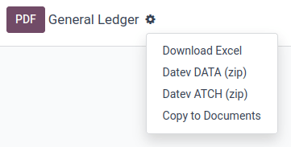
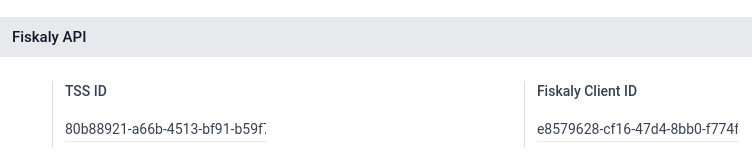
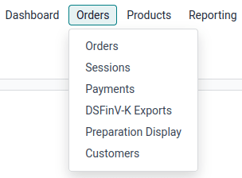

=======
Germany
=======

Accounting
==========

Chart of accounts
-----------------

Both SKR03 and SKR04 charts of accounts are supported in Odoo. When you create a new Odoo Online
database, SKR03 is installed by default.

Verify which is installed by going to :menuselection:`Accounting --> Configuration --> Settings`
and checking the :guilabel:`Package` field under the :guilabel:`Fiscal Localization` section.

.. warning::
   Selecting another package is only possible if you have not created an accounting entry. If one
   was posted, a new company or database must be set up to select another package. In
   addition, all journal entries will need to be created again.

Reports
-------

The following German-specific reports available on Odoo Enterprise:

- Balance Sheet
- Profit & Loss
- Tax Report (Umsatzsteuervoranmeldung)
- EC Sales List
- Intrastat

Exporting entries from Odoo to DATEV
------------------------------------

Provided that one of the German :ref:`fiscal localization packages
<fiscal_localizations/accounting>` is installed, you can export your accounting entries from Odoo to
DATEV from the general ledger.

Two types of exports are needed: first the DATEV ATCH export, then the DATEV DATA export.

.. note::
   Both are needed at different stages to transfer the data correctly to DATEV, as DATEV works with
   two interfaces, one for clients (DUO - DATEV Unternehmen Online) and one for tax advisors (DATEV
   Rechnungswesen).

1. DATEV ATCH
~~~~~~~~~~~~~

Go to :menuselection:`Accounting --> Reporting --> General Ledger`, click the :icon:`fa-cog`
(:guilabel:`Actions`) button, and select :guilabel:`Datev ATCH (zip)`.

Upload the downloaded ZIP file via the `DATEV Belegtransfer software <https://www.datev.de/web/de/service-und-support/software-bereitstellung/download-bereich/betriebliches-rechnungswesen/belegtransfer>`_.

If you do not have the DATEV Belegtransfer software installed on your computer, ask your tax advisor
to help you with this.

.. warning::
   The DATEV ATCH ZIP file includes the files (reports) linked to an Odoo invoice or bill. For
   customer invoices, the file must have been generated by using the :guilabel:`Print & Send`
   button. For vendor bills, the file must have been received via an email alias or uploaded by
   using the :guilabel:`Upload` button.

.. admonition:: DATEV ATCH ZIP file

   The ZIP file contains two types of files:

   - the individual invoice/bill files (PDF, JPEG, etc.) for the selected period on the general
     ledger, and
   - a :file:`document.xml` file used to generate a unique ID (GUID) for each file.

   These unique IDs are essential as they allow DATEV to automatically link the files to the
   individual journal items, which will be imported with the DATEV DATA file in the next step.

2. DATEV DATA
~~~~~~~~~~~~~

Go to :menuselection:`Accounting --> Reporting --> General Ledger`, click the :icon:`fa-cog`
(:guilabel:`Actions`) button, and select :guilabel:`Datev DATA (zip)`.

Transfer the downloaded ZIP file to your tax advisor. They should import the ZIP file into DATEV
Rechnungswesen.

Check with your tax advisor how often they need these files.

.. admonition:: DATEV ATCH ZIP file

   The ZIP file contains three CSV files:

   - the :file:`EXTF_customer_accounts.csv` file containing all information related to your
     customers,
   - the :file:`EXTF_vendor_accounts.csv` file containing all information related to your vendors,
     and
   - the :file:`EXTF_accounting_entries.csv` containing all journal items for the period defined on
     the general ledger, as well as the unique IDs (GUID) so that the journal items can be linked to
     the files inside the DATEV ATCH ZIP file.

.. _germany/gobd:

GoBD compliance
---------------

**GoBD** stands for *Grundsätze zur ordnungsmäßigen Führung und Aufbewahrung von Büchern,
Aufzeichnungen und Unterlagen in elektronischer Form sowie zum Datenzugriff*. In short, it is a
guideline for the proper management and storage of books, records, and documents in electronic form,
as well as for data access, that is relevant for the German tax authority, tax declaration, and
balance sheet.

These principles have been written and published by the Federal Ministry of Finance (BMF) in
November 2014. Since January 2015, **they have become the norm** and have replaced previously
accepted practices linked to computer-based accounting. Several changes have been made by the BMF in
2019 and January 2020 to specify some of the content due to the development of digital solutions
(cloud hosting, paperless companies, etc.).

.. important::
   Odoo is certified **GoBD-compliant**.

Understanding GoBD in relation to accounting software
~~~~~~~~~~~~~~~~~~~~~~~~~~~~~~~~~~~~~~~~~~~~~~~~~~~~~

The **GoBD is binding for companies that have to present accounts**, which includes SMEs,
freelancers, and entrepreneurs, to the financial authorities. As such, **the taxpayer himself is the
sole responsible** for the complete and exhaustive keeping of fiscal-relevant data (above-mentioned
financial and related data).

Apart from software requirements, the user is required to ensure internal control systems (*in
accordance with sec. 146 of the Fiscal Code*):

- access rights control;
- segregation of duties, functional separating;
- entry controls (error notifications, plausibility checks);
- reconciliation checks at data entry;
- processing controls; and
- measures to prevent intentional or unintentional manipulation of software, data, or documents.

The user must distribute tasks within their organization to the relevant positions (*control*) and
verify that the tasks are properly and completely performed (*supervision*). The result of these
controls must be recorded (*documentation*), and should errors be found during these controls,
appropriate measures to correct the situation should be put into place (*prevention*).

Data security
~~~~~~~~~~~~~

The taxpayer must **secure the system against any data loss** due to deletion, removal, or theft of
any data. If the entries are not sufficiently secured, the bookkeeping will be regarded as not in
accordance with the GoBD guidelines.

Once bookings have been finally posted, they can no longer be changed or deleted via the
application.

- If Odoo is used in the cloud, regular backups are part of the Odoo Online service. In addition,
  regular backups can be downloaded and backed up on external systems.

  .. seealso::
     `Odoo Cloud Hosting - Service Level Agreement <https://www.odooo.com/cloud-sla>`_

- If the server is operated locally, the user is responsible for creating the necessary backup
  infrastructure.

.. important::
   In some cases, data has to be kept for ten years or more, so always have backups saved. It is
   even more important if you decide to change software provider.

Responsibility of the software editor
~~~~~~~~~~~~~~~~~~~~~~~~~~~~~~~~~~~~~

Considering GoBD applies only to the taxpayer, **the software editor can by no means be held
responsible for the accurate and compliant documentation of their users' financial transactional
data**. It can merely provide the necessary tools for the user to respect the software-related
guidelines described in the GoBD.

Ensuring compliance through Odoo
~~~~~~~~~~~~~~~~~~~~~~~~~~~~~~~~

The keywords, when it comes to GoBD are: **traceable, verifiable, true, clear, and continuous**.
In short, you need to have audit-proof archiving in place, and Odoo provides you with the means to
achieve all of these objectives:

#. | **Traceability and verifiability**
   | Each record in Odoo is stamped with the creator of the document, the creation date, the
     modification date, and who modified it. In addition, relevant fields are tracked. Thus, it can
     be seen which value was changed by whom in the chatter of the relevant object.
#. | **Completeness**
   | All financial data must be recorded in the system, and there can be no gaps. Odoo ensures that
     there is no gap in the numbering of the financial transactions. It is the responsibility of the
     user to encode all financial data in the system. As most financial data in Odoo is generated
     automatically, it remains the responsibility of the user to encode all vendor bills and
     miscellaneous operations completely.
#. | **Accuracy**
   | Odoo ensures that, with the correct configuration, the correct accounts are used. In addition,
     the control mechanisms between purchase orders and sales orders and their respective invoices
     reflect the reality of the business. It is the responsibility of the user to scan and attach
     the paper-based vendor bill to the respective record in Odoo. *Odoo Documents helps you
     automate this task*.
#. | **Timely booking and record-keeping**
   | As most financial data in Odoo is generated by the transactional objects (for example, the
     invoice is booked at confirmation), Odoo ensures out-of-the-box timely record-keeping. It is
     the responsibility of the user to encode all incoming vendor bills in a timely manner, as well
     as the miscellaneous operations.
#. | **Order**
   | Financial data stored in Odoo is, per definition, ordered and can be reordered according to
     most fields present in the model. A specific ordering is not enforced by the GoBD, but the
     system must ensure that a given financial transaction can be quickly found by a third-party
     expert. Odoo ensures this out-of-the-box.
#. | **Inalterability**
   | With the German Odoo localization, Odoo is in standard configured in such a way that the
     inalterability clause can be adhered to without any further customization.

GoBD export
~~~~~~~~~~~

In the case of fiscal control, the fiscal authority can request three levels of access to the
accounting system (Z1, Z2, Z3). These levels vary from direct access to the interface to the
handover of the financial data on a storage device.

In the case of a handover of financial data to a storage device, the GoBD does **not** enforce the
format. It can be, for example, in XLS, CSV, XML, Lotus 123, SAP-format, AS/400-format, or else.
Odoo supports the CSV and XLS export of financial data out of the box. The GoBD **recommends** the
export in a specific XML-based GoBD format (see "Ergänzende Informationen zur
Datenträgerüberlassung" §3), but it is not binding.

Non-compliance
~~~~~~~~~~~~~~

In the event of an infringement, you can expect a fine and a court order demanding the
implementation of specific measures.

.. _germany/pos:

Point of Sale
=============

Technical security system
-------------------------

The **Kassensicherungsverordnung** (The Act on Protection against Manipulation of Digital Records)
requires that electronic record-keeping systems - including the :doc:`point of sale
</applications/sales/point_of_sale>` systems - must be equipped with a **technical security system**
(also called **TSS** or **TSE**).

Odoo offers a service that is compliant with the help of `fiskaly <https://fiskaly.com>`_, a
*cloud-based solution*.

.. important::
   Since this solution is cloud-based, a working internet connection is required.

.. note::
   The only VAT rates allowed are given by fiskaly. You can check these rates by consulting
   `fiskaly DSFinV-K API: VAT Definition
   <https://developer.fiskaly.com/api/dsfinvk/v0/#tag/VAT-Definition>`_.

Configuration
~~~~~~~~~~~~~

:ref:`Install <general/install>` the **Germany - Certification for Point of Sale**
(`l10n_de_pos_cert`) and **Germany - Certification for Point of Sale of type restaurant**
(`l10n_de_pos_res_cert`) modules.

.. tip::
   If these modules are not listed, :ref:`update the app list <general/install>`.

Company registration at the financial authority
***********************************************

To register your company, open the :guilabel:`Settings` app, click :guilabel:`Update Info` under the
:guilabel:`Companies` section, and fill in the following fields:

- :guilabel:`Company Name`
- :guilabel:`Address`
- :guilabel:`VAT`
- :guilabel:`St.-Nr.` (Steuernummer) this number is assigned by the tax office to every taxable
  natural or legal person (e.g., `2893081508152`).
- :guilabel:`W-IdNr.` (Wirtschafts-Identifikationsnummer) this number is used as a permanent
  identification number for economically active persons.

You can then **register your company through fiskaly** by opening the :guilabel:`Fiskaly` tab and
clicking the :guilabel:`Fiskaly Registration` button.

.. tip::
   If you do not see the :guilabel:`Fiskaly Registration` button, make sure that you *saved* your
   company details and are not in *editing mode* anymore.

Once the registration has been finalized, new fields appear:

- :guilabel:`Fiskaly Organization ID` refers to the ID of your company on fiskaly's side.
- :guilabel:`Fiskaly API Key` and :guilabel:`Fiskaly API Secret` are the credentials the system
  uses to access the services offered by fiskaly.

.. image:: germany/fiskaly-registration.png
   :alt: Fiskaly registration tab

.. note::
   It is possible to request new credentials if there is any issue with the current ones by clicking
   the :guilabel:`New keys` button.

Create a technical security system and link it to a POS
*******************************************************

To use a point of sale in Germany, first create a :abbr:`TSS (Technical Security System)` by going
to :menuselection:`Point of Sale --> Configuration --> Point of Sale`, selecting the
:guilabel:`Point of Sale` to edit, then checking the :guilabel:`Create TSS` box under the
:guilabel:`Fiskaly API` section.

Once the creation of the TSS is successful, you can find the:

- :guilabel:`TSS ID`, which refers to the ID of your TSS on fiskaly's side, and
- :guilabel:`Fiskaly Client ID`, which refers to your POS on fiskaly's side.

DSFinV-K export
~~~~~~~~~~~~~~~

Whenever you close a PoS session, the details of the orders are sent to the :abbr:`DSFinV-K
(Digitale Schnittstelle der Finanzverwaltung für Kassensysteme)` service of fiskaly.

In case of an audit, you can export the data sent to DSFinV-K by going to :menuselection:`Point of
Sale --> Orders --> DSFinV-K Exports --> New`.

These fields are mandatory:

- :guilabel:`Start Datetime`: export data with dates larger than or equal to the given start date
- :guilabel:`End Datetime`: export data with dates smaller than or equal to the given end date

Leave the :guilabel:`Point of Sale` field blank to export the data of all your points of sale;
specify one if you want to export data for this specific POS only.

.. image:: germany/dsfinv-k-export.png
   :alt: Exporting DSFinV-K

When an export is successfully triggered and is being processed, the :guilabel:`State` field should
mention :guilabel:`Pending`. Click :guilabel:`Refresh State` to check if it is ready.
