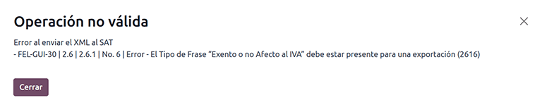
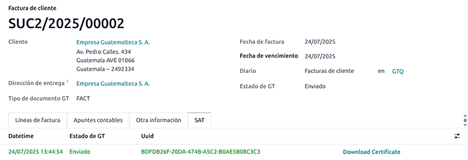
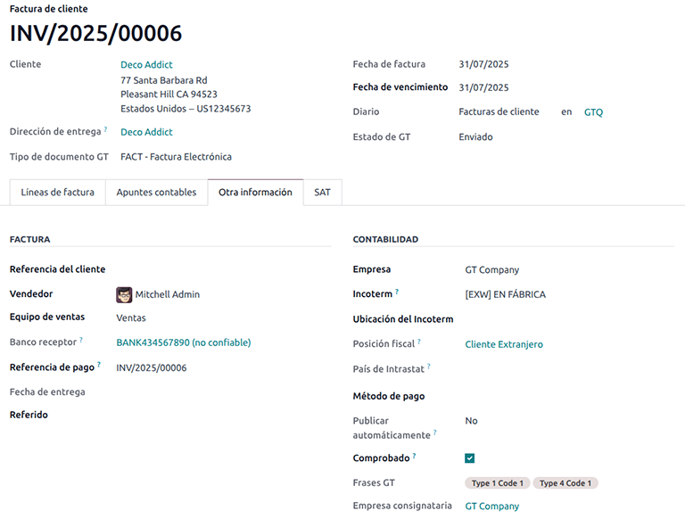

=========
Guatemala
=========

.. |SAT| replace:: :abbr:`SAT (Superintendencia de Administración Tributaria)`
.. |EDI| replace:: :abbr:`EDI (Electronic Data Interchange)`
.. |UUID| replace:: :abbr:`UUID (Universally Unique Identifier)`

.. _guatemala/intro:

Introduction
============

With the Guatemalan localization, you can connect to the tax authority Superintendencia de
Administración Tributaria (SAT) to generate electronic documents with its XML, fiscal folio, and
electronic signature.

The supported documents are:

- :guilabel:`FACT-Factura`,
- :guilabel:`FCAM-Factura Cambiaria`,
- :guilabel:`FPEQ-Factura de Pequeño Contribuyente`,
- :guilabel:`NCRE-Credit Note`,
- :guilabel:`NDEB-Debit Note`,
- :guilabel:`NABN-Nota de Abono`,
- :guilabel:`FCAP-Factura Cambiaria Pequeño Contribuyente`,
- :guilabel:`FACT-Factura with Export Complement`.

The localization requires an `Infile <https://infile.com.gt/>`_ account, which enables users to
generate electronic documents within Odoo. To request an Infile account, fill out the `Infile
Registration Form <https://share.hsforms.com/1HksZ6i1VRRWHRhXPvYZORQrwu2r>`_.

.. seealso::
   :doc:`Documentation on e-invoicing's legality and compliance in Guatemala
   <../accounting/customer_invoices/electronic_invoicing/guatemala>`

Glossary
--------

The following terms are used throughout the Guatemalan localization:

- **SAT**: *Superintendencia de Administración Tributaria* is the government entity responsible for
  enforcing tax payments in Guatemala.
- **FEL**: *Factura Electrónica en Línea* is the electronic invoicing system mandated by the SAT in
  Guatemala, which requires businesses to issue and manage electronic documents in compliance with
  local regulations.
- **EDI**: *Electronic Data Interchange* refers to the sending of electronic documents.
- **Infile**: is the third-party organization that facilitates the interchange of electronic
  documents between companies and the Guatemalan government.
- **UUID**: *Universally Unique Identifier* is a unique alphanumeric code assigned by the SAT to
  each certified electronic document in the FEL system, used for traceability and official
  validation.
- **Phrases**: Type of Phrases with specific Scenario Codes are used in the Guatemalan localization
  to comply with the requirements of the SAT. They should be added depending on the issuer regime,
  receiver, and operation type. These phrases are used in the XML and PDF documents.
- **Establishment Code**: A unique identifier assigned by the SAT to each business establishment,
  which is required for electronic invoicing.
- **Quetzal**: The official currency of Guatemala, represented by the symbol GTQ. This is the base
  currency for all financial transactions in the Guatemalan localization.

Configuration
=============

Modules installation
--------------------

:ref:`Install <general/install>` the following modules to get all the features of the Guatemalan
localization:

.. list-table::
   :header-rows: 1
   :widths: 25 25 50

   * - Name
     - Technical name
     - Description
   * - :guilabel:`Guatemala - Accounting`
     - `l10n_gt`
     - The default :doc:`fiscal localization package <../fiscal_localizations>`. It adds accounting
       characteristics for the Guatemalan localization, which represent the minimum configuration
       required for a company to operate in Guatemala according to the guidelines set by the |SAT|.
       The module's installation automatically loads the chart of accounts and taxes.
   * - :guilabel:`Guatemala Accounting EDI`
     - `l10n_gt_edi`
     - Includes all the technical and functional requirements to generate and validate
       :doc:`Electronics Documents <../accounting/customer_invoices/electronic_invoicing>`, based on
       the technical documentation published by the |SAT|. The authorized documents are :ref:`listed
       above <guatemala/intro>`.

.. note::
   Odoo automatically installs the base module **Guatemala - Accounting** when a database is
   installed with `Guatemala` selected as the country. However, to enable electronic invoicing, the
   **Guatemala Accounting EDI** (`l10n_gt_edi`) module needs to be manually :ref:`installed
   <general/install>`.

Company
-------

To configure your company information, open the **Settings** app, scroll down to the
:guilabel:`Companies` section, click :guilabel:`Update Info`, and configure the following:

- :guilabel:`Company Name`
- :guilabel:`Address`, including the :guilabel:`Street`, :guilabel:`City`, :guilabel:`State`,
  :guilabel:`ZIP`, and :guilabel:`Country`
- :guilabel:`Tax ID`: Enter the identification number for the selected taxpayer type.
- :guilabel:`VAT Affiliation`: Select the VAT affiliation for the company, which is the type of
  Regime the company belongs to.
- :guilabel:`Legal Name`: The legal name of the company, which is used in the XML and PDF documents.
- :guilabel:`Establishment Code`: A necessary part of the XML when creating an electronic document.
  If this field is not set, all electronic documents will be rejected.

  To locate the :guilabel:`Establishment Code` in your `SAT account <https://portal.sat.gob.gt/>`_,
  go to :menuselection:`FEL --> Administración de Establecimientos`. The list of registered
  establishments is displayed along with their corresponding codes.

.. important::
   After configuring the company in the database settings, navigate to the company's contact form
   and verify that the :guilabel:`Identification Number` :guilabel:`Type` is set to :guilabel:`NIT`.

Electronic invoicing credentials
--------------------------------

In Guatemala, electronic invoicing is mandatory for most businesses. Odoo connects with the
authorized provider, Infile, to generate and submit electronic documents to the |SAT| for
validation.

Before issuing electronic documents, you must configure and connect Odoo to Infile to ensure they
are properly validated and assigned an official |UUID|.

Infile
~~~~~~

Sign a service agreement directly with `Infile <https://infile.com.gt/>`_. Infile will then provide
the necessary credentials to input in Odoo.

.. note::
   To create an Infile account and benefit from the **8% discount** available for Odoo customers,
   fill out the: `Infile Registration Form <https://share.hsforms.com/1HksZ6i1VRRWHRhXPvYZORQrwu2r>`_.
   An Infile agent will contact you to help you complete the onboarding process and sign the service agreement.

Odoo
~~~~

In Odoo, once you have completed the Infile process, navigate to :menuselection:`Accounting -->
Configuration --> Settings`, scroll down to the :guilabel:`Guatemalan Localization` section, then
follow these steps:

#. Select the :guilabel:`Infile Web Services` environment, either :guilabel:`Test` or
   :guilabel:`Production`.
#. Enter the :guilabel:`Infile Credentials`:

   - :guilabel:`Infile WS Username or Prefix`
   - :guilabel:`Infile Token`
   - :guilabel:`Infile Key`

#. Click on :guilabel:`Save`.

.. note::
   The :guilabel:`Infile Credentials` are provided by Infile and are required for both test and
   production environments. If they are not available, contact Infile support.

.. tip::
   The demo environment is for testing only and does not generate legal documents, |UUID| keys, or
   fiscal folios. No Infile account or credentials are needed to use the demo environment.

Multi-currency
~~~~~~~~~~~~~~

The official currency exchange rate in Guatemala is provided by the Bank of Guatemala. Odoo can
connect directly to its services and get the currency rate either automatically or manually.

.. seealso::
   :doc:`Multi-currencies <../accounting/get_started/multi_currency>`

Master data
-----------

Chart of accounts
~~~~~~~~~~~~~~~~~

The :doc:`chart of accounts <../accounting/get_started/chart_of_accounts>` is installed by default
as part of the set of data included in the localization module, the accounts are mapped
automatically in taxes, default accounts payable, and default accounts receivable.

Accounts can be added or deleted according to the company's needs.

Contacts
~~~~~~~~

The following fields must be completed on contact forms:

- :guilabel:`Company Name`
- :guilabel:`Address`, including the :guilabel:`Street`, :guilabel:`City`, :guilabel:`State`,
  :guilabel:`ZIP`, and :guilabel:`Country`
- :guilabel:`Identification Number`:

  - :guilabel:`Type`: Select an identification type.
  - :guilabel:`Number`: Required to confirm an electronic invoice.

.. note::
   To automatically include a specific phrase in the XML and PDF of every electronic invoice for a
   contact, select it in :guilabel:`Phrases` field in the :guilabel:`Sales & purchase` tab of the
   contact form.

Taxes
~~~~~

As part of the Guatemala localization module, taxes are automatically created with their configuration
and related financial accounts.

Electronic invoices
===================

Once the database has been configured successfully, electronic documents can be created and sent.

Once :doc:`customer invoices <../accounting/customer_invoices>` are validated, they can be sent
electronically to |SAT| via Infile, provided the following fields are completed:

- :guilabel:`Customer`: Type the customer's information.
- :guilabel:`GT Document Type`: Select the type of document you want to create, i.e.,
  :guilabel:`FACT - Factura Electrónica` or :guilabel:`FCAM - Factura Cambiara`. By default, the
  document type is set to :guilabel:`FACT`.
- :guilabel:`Due date`: To compute if the invoice is due now or later.
- :guilabel:`Journal`: Select the sales journal.
- :guilabel:`Products`: Specify the product(s) with the correct taxes.

When done, click :guilabel:`Confirm`.

.. note::
   If you need to add a specific phrase based on the transaction, go to the :guilabel:`Other Info`
   tab and add the corresponding phrase in :guilabel:`GT Phrases`. These phrases are used in the XML
   and PDF documents.

.. note::
   If you need to add an addendum to the invoice, you can do so in the :guilabel:`Terms and
   Conditions` field. The addendum will be included in the XML document and can be used to provide
   additional information or notes related to the invoice.

After the invoice confirmation, click :guilabel:`Send`. In the wizard that appears, make sure to
enable the :guilabel:`Send to SAT` and :guilabel:`by Email` checkboxes to send the XML to the |SAT|
through Infile's web service and the validated invoice to the client's email, and click
:guilabel:`Send`. Then, the following occurs:

- The XML document is created.
- The |UUID| is generated.
- The XML is processed synchronously by Infile.

  - If accepted, the file is displayed in the chatter, and the email to the client with the
    corresponding :file:`pdf` and :file:`xml` file is sent.
  - If the file contains errors, a warning message displays the reason(s) and the email is not sent.

The :guilabel:`SAT` tab then displays the following:

- :guilabel:`Datetime`: Timestamp recorded of the XML creation.
- :guilabel:`GT Status`: Status result obtained in the |SAT| response. If the file contains errors,
  a warning message displays the reason(s) and the email is not sent.
- :guilabel:`UUID`: The unique identifier assigned by the |SAT| to the electronic document.
- :guilabel:`Download Certificate`: To download the sent XML file, even if the |SAT| result was
  rejected.

.. _localization/guatemala/credit-notes:

Debit and credit notes
----------------------

To send a debit or credit note to Infile, first create the :ref:`debit
<accounting/credit_notes/issue-debit-note>` or :ref:`credit note
<accounting/credit_notes/issue-credit-note>`.

Then, in the :guilabel:`Send` window, click :guilabel:`Send to SAT (Guatemalan EDI)` to submit it
for real-time validation. Upon successful validation, the QR code from Infile is embedded in the
debit or credit note PDF.

Export invoices
---------------

Exportation invoices must meet the following conditions:

- The customer's :guilabel:`Identification type` must be :guilabel:`VAT`, :guilabel:`Passport`, or
  :guilabel:`Foreign ID`.
- The following fields must be defined in the customer invoice's :guilabel:`Other Info` tab, under
  the :guilabel:`Accounting` section:

   - :guilabel:`Incoterm`
   - :guilabel:`GT Phrases`: :guilabel:`Type 4 Code 1`
   - :guilabel:`Consignatory Company`

- All invoice lines must include taxes set to 0%.

