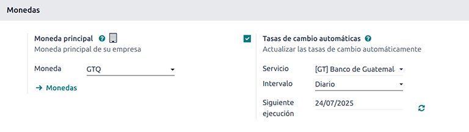
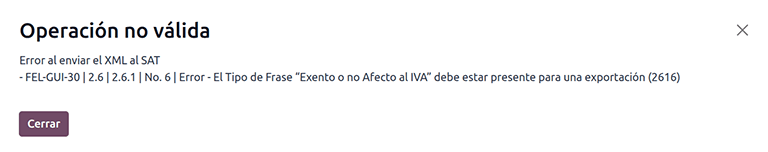
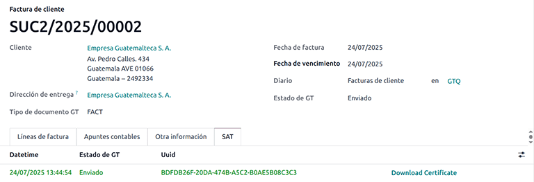
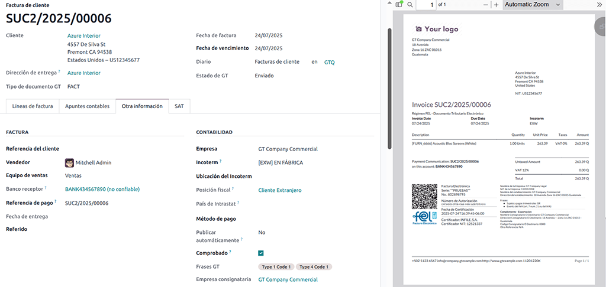

=========
Guatemala
=========

.. |SAT| replace:: :abbr:`SAT (Superintendencia de Administración Tributaria)`
.. |EDI| replace:: :abbr:`EDI (Electronic Data Interchange)`

.. _guatemala/intro:

Introduction
============

With the Guatemalan localization, you can generate electronic documents with its XML, fiscal folio,
electronic signature and connection to tax authority Superintendencia de Administración Tributaria
(SAT) through Infile.

The supported documents are:

- :guilabel:`FACT-Factura`, :guilabel:`FCAM-Factura Cambiaria`, :guilabel:`NCRE-Credit Note`,
  :guilabel:`NDEB-Debit Note`;
- :guilabel:`NABN-Nota de Abono`, :guilabel:`FPEQ-Factura de Pequeño Contribuyente`,
  :guilabel:`FCAP-Factura Cambiaria Pequeño Contribuyente`;
- :guilabel:`FACT-Factura with Export Complement`.

The localization requires an Infile account, which enables users to generate electronic documents
within Odoo.

.. seealso::
   :doc:`Documentation on e-invoicing's legality and compliance in Guatemala
   <../accounting/customer_invoices/electronic_invoicing/guatemala>`

Glossary
--------

The following terms are used throughout the Guatemalan localization:

- **SAT**: *Superintendencia de Administración Tributaria* is the government entity responsible for
  enforcing tax payments in Guatemala.
- **FEL**: *Factura Electrónica en Línea* is the electronic invoicing system mandated by the SAT in
  Guatemala, which requires businesses to issue and manage electronic documents in compliance with
  local regulations.
- **EDI**: *Electronic Data Interchange* refers to the sending of electronic documents.
- **Infile**: is the third-party organization that facilitates the interchange of electronic
  documents between companies and the Guatemalan government.
- **UUID**: *Universally Unique Identifier* is a unique alphanumeric code assigned by the SAT to
  each certified electronic document in the FEL system, used for traceability and official
  validation.
- **Phrases**: Type of Phrases with specific Scenario Codes are used in the Guatemalan localization
  to comply with the requirements of the SAT. They should be added depending on the issuer regime,
  receiver and operation type. These phrases are used in the XML and PDF documents.
- **Establishment Code**: A unique identifier assigned by the SAT to each business establishment,
  which is required for electronic invoicing.
- **Quetzal**: The official currency of Guatemala, represented by the symbol GTQ. This is the base
  currency for all financial transactions in the Guatemalan localization.

Configuration
=============

Modules installation
--------------------

:ref:`Install <general/install>` the following modules to get all the features of the Guatemalan
localization:

.. list-table::
   :header-rows: 1
   :widths: 25 25 50

   * - Name
     - Technical name
     - Description
   * - :guilabel:`Guatemala - Accounting`
     - `l10n_gt`
     - The default :doc:`fiscal localization package <../fiscal_localizations>`. It adds accounting
       characteristics for the Guatemalan localization, which represent the minimum configuration
       required for a company to operate in Guatemala according to the guidelines set by the |SAT|.
       The module's installation automatically loads: chart of accounts, taxes, and tax supported
       types.
   * - :guilabel:`Guatemala Accounting EDI`
     - `l10n_gt_edi`
     - Includes all the technical and functional requirements to generate and validate
       :doc:`Electronics Documents <../accounting/customer_invoices/electronic_invoicing>`, based on
       the technical documentation published by the |SAT|. The authorized documents are :ref:`listed
       above <guatemala/intro>`.

.. note::
   Odoo automatically installs the base module **Guatemala - Accounting** when a database is
   installed with `Guatemala` selected as the country. However, to enable electronic invoicing, the
   **Guatemala Accounting EDI** (`l10n_gt_edi`) module needs to be manually :ref:`installed
   <general/install>`.

Company
-------

To configure your company information, open the **Settings** app, scroll down to the
:guilabel:`Companies` section, click :guilabel:`Update Info`, and configure the following:

- :guilabel:`Company Name`
- :guilabel:`Address`, including the :guilabel:`Street`, :guilabel:`City`, :guilabel:`State`,
  :guilabel:`ZIP`, and :guilabel:`Country`
- :guilabel:`Tax ID`: Enter the identification number for the selected taxpayer type.
- :guilabel:`VAT Affiliation`: Select the VAT affiliation for the company, which is the type of
  Regime the company belongs to.
- :guilabel:`Legal Name`: The legal name of the company, which is used in the XML and PDF documents.
- :guilabel:`Establishment Code`: A necessary part of the XML when creating an electronic document.
  If this field is not set, all electronic documents will be rejected.

  To find the :guilabel:`Establishment Code`, follow these steps:

  #. From your `SAT account <https://portal.sat.gob.gt/>`_, go to :menuselection:`FEL -->
     Administración de Establecimientos`.
  #. You will see the list of establishments registered along with their corresponding code.

.. important::
   After configuring the company in the database settings, navigate to :menuselection:`Contacts` and
   verify that the :guilabel:`Identification Number` :guilabel:`Type` is set to :guilabel:`NIT`.

In the :guilabel:`Sales & Purchase` tab, select the appropriate phrase in the :guilabel:`Phrases`
field under :guilabel:`Fiscal Information`; this phrase defines the VAT affiliation in the XML and
is also used in the generated PDF.

Electronic invoice data
-----------------------

- Sign a service agreement directly with `Infile <https://infile.com.gt/>`_.
- Infile will provide you with the necessary credentials to input in Odoo.
- In Odoo, navigate to :menuselection:`Accounting --> Configuration --> Settings` and scroll down to
  the :guilabel:`Guatemalan Localization` section.
- Select the :guilabel:`Infile Web Services` environment, either :guilabel:`Production` or
  :guilabel:`Testing`.
- Enter the :guilabel:`Infile Data`:
  - :guilabel:`Infile WS Password`
  - :guilabel:`Commerce Code`
  - :guilabel:`Terminal Code`
- Click on :guilabel:`Save`.

.. note::
   The :guilabel:`Infile WS Password`, :guilabel:`Commerce Code`, and :guilabel:`Terminal Code` are
   provided by Infile. If you do not have them, then contact Infile support, since credentials are
   needed for both testing and production.

.. tip::
   The demo environment is for testing only and does not generate legal documents, UUIDs, or fiscal
   folios. No Infile account or credentials are needed to use the demo environment.

Multi-currency
~~~~~~~~~~~~~~

The official currency exchange rate in Guatemala is provided by the Bank of Guatemala. Odoo can
connect directly to its services and get the currency rate either automatically or manually.

.. seealso::
   :doc:`Multi-currencies <../accounting/get_started/multi_currency>`

Master data
-----------

Chart of accounts
~~~~~~~~~~~~~~~~~

The :doc:`chart of accounts <../accounting/get_started/chart_of_accounts>` is installed by default
as part of the set of data included in the localization module, the accounts are mapped
automatically in taxes, default accounts payable, and default accounts receivable.

Accounts can be added or deleted according to the company's needs.

Contacts
~~~~~~~~

To create a contact, navigate to :menuselection:`Contacts app` and select :guilabel:`New`. Then
enter the following information:

- :guilabel:`Company Name`
- :guilabel:`Address`:

  - :guilabel:`Street`
  - :guilabel:`City`
  - :guilabel:`State`
  - :guilabel:`ZIP`
  - :guilabel:`Country`: required to confirm an electronic invoice.

- :guilabel:`Identification Number`:

  - :guilabel:`Type`: select a identification type.
  - :guilabel:`Number`: required to confirm an electronic invoice.

.. note::
   To automatically include a specific phrase in the XML and PDF of every electronic invoice for a
   contact, select it in :guilabel:`Phrases`field in the :guilabel:`Sales & purchase` tab of the
   contact form.

Taxes
~~~~~

As part of the Guatemala localization module, taxes are automatically created with its configuration
and related financial accounts.

Electronic invoices
===================

Once the database has been configured successfully, electronic documents can be created and sent.

Once :doc:`customer invoices <../accounting/customer_invoices>` are validated, they can be sent
electronically to |SAT| via Infile, provided the following fields are completed:

- :guilabel:`Customer`: Type the customer's information.
- :guilabel:`GT Document Type`: Select the type of document you want to create, i.e.,
  :guilabel:`FACT - Factura Electrónica` or :guilabel:`FCAM - Factura Cambiara`. By default, the
  document type is set to :guilabel:`FACT`.
- :guilabel:`Due date`: To compute if the invoice is due now or later.
- :guilabel:`Journal`: Select the sales journal.
- :guilabel:`Products`: Specify the product(s) with the correct taxes.

When done, click :guilabel:`Confirm`.

.. note::
   If you need to add a specific phrase based on the transaction go to the :guilabel:`Other Info`
   tab and add the corresponding phrase in :guilabel:`GT Phrases`. These phrases are used in the XML
   and PDF documents.

.. note::
   If you need to add an addenda to the invoice, you can do so in the :guilabel:`Terms and
   Conditions` field. The addenda will be included in the XML document and can be used to provide
   additional information or notes related to the invoice.

After the invoice confirmation, click :guilabel:`Send`. In the wizard that appears, make sure to
enable the :guilabel:`Send to SAT` and :guilabel:`by Email` checkboxes to send the XML to the |SAT|
through Infile's web service and the validated invoice to the client email and click
:guilabel:`Send`. Then, the following occurs:

- The XML document is created.
- The :abbr:`UUID (Universally Unique Identifier)` is generated.
- The XML is processed synchronously by Infile.

  - If accepted, the file is displayed in the chatter and the email to the client with the
    corresponding :file:`pdf` and :file:`xml` file is sent.
  - If the file contains errors, a warning message displays the reason(s) and the email is not sent.

The :guilabel:`SAT` tab then displays the following:

- :guilabel:`Datetime`: Timestamp recorded of the XML creation.
- :guilabel:`GT Status`: Status result obtained in the |SAT| response. If the file contains errors,
  a warning message displays the reason(s) and the email is not sent.
- :guilabel:`UUID`: The unique identifier assigned by the |SAT| to the electronic document.
- :guilabel:`Download`: To download the sent XML file, even if the |SAT| result was rejected.

.. _localization/guatemala/credit-notes:

Customer electronic notes
-------------------------

The :doc:`Customer credit note <../accounting/customer_invoices/credit_notes>` is an electronic
document that, when validated, is sent to |SAT| via Infile. It is necessary to have a validated
(posted) electronic invoice to register a credit note. On the invoice, click the :guilabel:`Credit
note` button to access the :guilabel:`Create credit note` form, then complete the following
information:

- :guilabel:`Reason`: Type the reason for the credit note.
- :guilabel:`Journal`: Select the journal.
- :guilabel:`Reversal Date`: Type the date.

The :doc:`Customer debit note <../accounting/customer_invoices/credit_notes>` is an electronic
document that, when validated, is sent to |SAT| via Infile. It is necessary to have a validated
(posted) electronic invoice to register a debit note. On the invoice, click the :icon:`fa-cog`
(:guilabel:`action menu`) icon, select the :guilabel:`Debit note` option to access the
:guilabel:`Create credit note` form, then complete the following information:

- :guilabel:`Reason`: Type the reason for the debit note.
- :guilabel:`Journal`: Select the journal.
- :guilabel:`Copy lines`: Tick the checkbox to copy the invoice lines to the debit note.
- :guilabel:`Debit note date`: Type the date.

.. note::
   Confirm the invoice to create it. To send the document to |SAT| via Infile, click on
   :guilabel:`Send` and select the checkbox :guilabel:`Send to SAT`.

Export invoices
---------------

When creating exportation invoices, take into account the next considerations:

- The customer's :guilabel:`Identification type` must be :guilabel:`VAT`, :guilabel:`Passport` or
  :guilabel:`Foreign ID`.
- The following fields must be defined in the customer invoice's :guilabel:`Other Info` tab, under
  the :guilabel:`Accounting` section:

   - :guilabel:`Incoterm`
   - :guilabel:`GT Phrases`: :guilabel:`Type 4 Code 1`
   - :guilabel:`Consignatory Company`

- The taxes included in the invoice lines should be 0% taxes.

