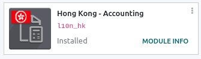
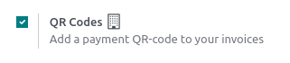

=========
Hong Kong
=========

Configuration
=============

:ref:`Install <general/install>` the :guilabel:`Hong Kong - Accounting` module to get the features
of the HK localization.

Add FPS QR codes to invoices
============================

:abbr:`FPS (Faster Payment System)` is a payment service platform that allows customers to make
instant domestic payments to individuals and merchants in Hong Kong dollars or Renminbi via online
and mobile banking.

Activate QR codes
-----------------

Go to :menuselection:`Accounting --> Configuration --> Settings`. Under the :guilabel:`Customer
Payments` section, activate the :guilabel:`QR Codes` feature.

FPS bank account configuration
------------------------------

Go to :menuselection:`Contacts --> Configuration --> Bank Accounts` and select the bank account for
which you want to activate FPS. Set the :guilabel:`FPS Type` and fill in the :guilabel:`FPS ID/Phone
Number/Email Address` field depending on the type you chose.

.. note::
   The account holder's country must be set to Hong Kong on its contact form.

.. image:: hong_kong/hk-fps-bank-setting.png
   :align: center
   :alt: FPS bank account configuration

.. seealso::
   :doc:`../accounting/bank/setup/bank_accounts`

Bank journal configuration
--------------------------

Go to :menuselection:`Accounting --> Configuration --> Journals`, open the bank journal, then fill
out the :guilabel:`Account Number` and :guilabel:`Bank` under the :guilabel:`Journal Entries` tab.

.. image:: hong_kong/hk-bank-account-journal-setting.png
   :align: center
   :alt: Bank Account's journal configuration

Issue invoices with FPS QR codes
--------------------------------

When creating a new invoice, open the :guilabel:`Other Info` tab and set the :guilabel:`Payment
QR-code` option to *EMV Merchant-Presented QR-code*.

.. image:: hong_kong/hk-qr-code-invoice-setting.png
   :align: center
   :alt: Select EMV Merchant-Presented QR-code option

Ensure that the :guilabel:`Recipient Bank` is the one you configured, as Odoo uses this field to
generate the FPS QR code.
