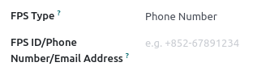
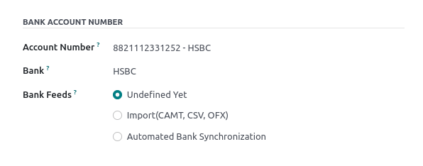
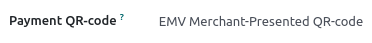

=========
Hong Kong
=========

Add FPS QR codes to invoices
============================

:abbr:`FPS (Faster Payment System)` is a payment service platform that allows customers to make
instant domestic payments to individuals and merchants in Hong Kong dollars or Renminbi via online
and mobile banking.

Activate QR codes
-----------------

Go to :menuselection:`Accounting --> Configuration --> Settings`. Under the :guilabel:`Customer
Payments` section, activate the :guilabel:`QR Codes` feature.

FPS bank account configuration
------------------------------

Go to :menuselection:`Contacts --> Configuration --> Bank Accounts` and select the bank account for
which you want to activate FPS. Set the :guilabel:`Proxy Type` and fill in the :guilabel:`Proxy
Value` field depending on the type you chose.

.. important::
   - The account holder's country must be set to Hong Kong on its contact form.
   - You could also include the invoice number in the QR code by checking the :guilabel:`Include
     Reference` checkbox.

.. seealso::
   :doc:`../accounting/bank`

Bank journal configuration
--------------------------

Go to :menuselection:`Accounting --> Configuration --> Journals`, open the bank journal, then fill
out the :guilabel:`Account Number` and :guilabel:`Bank` under the :guilabel:`Journal Entries` tab.

Issue invoices with FPS QR codes
--------------------------------

When creating a new invoice, open the :guilabel:`Other Info` tab and set the :guilabel:`Payment
QR-code` option to *EMV Merchant-Presented QR-code*.

Ensure that the :guilabel:`Recipient Bank` is the one you configured, as Odoo uses this field to
generate the FPS QR code.
