=========
Hong Kong
=========

Configuration
=============

:ref:`Install <general/install>` the following modules to get the latest features of the Hong Kong
localization:

.. list-table::
   :header-rows: 1

   * - Name
     - Technical name
     - Description
   * - :guilabel:`Hong Kong - Accounting`
     - `l10n_hk`
     - The base module to manage chart of accounting and localization for Hong Kong.
   * - :guilabel:`Hong Kong - Payroll`
     - `l10n_hk_hr_payroll`
     - Enables :ref:`payroll <hong_kong/payroll>` specific localization features for Odoo *Payroll*
       app. This module also installs :guilabel:`Hong Kong - Payroll with Accounting` and
       :guilabel:`Documents - Hong Kong Payroll`.
   * - :guilabel:`Hong Kong - Payroll with Accounting`
     - `l10n_hk_hr_payroll_account`
     - Installs the link between Hong Kong payroll and accounting.
   * - :guilabel:`Documents - Hong Kong Payroll`
     - `documents_l10n_hk_hr_payroll`
     - Integrates employee ir56 forms in the Odoo *Documents* app.

FPS QR codes on invoices
========================

:abbr:`FPS (Faster Payment System)` is a payment service platform that allows customers to make
instant domestic payments to individuals and merchants in Hong Kong dollars or Renminbi via online
and mobile banking.

Activate QR codes
-----------------

Go to :menuselection:`Accounting app --> Configuration --> Settings`. Under the :guilabel:`Customer
Payments` section, tick the checkbox beside the :guilabel:`QR Codes` feature. Then, click
:guilabel:`Save`.

FPS bank account configuration
------------------------------

Go to :menuselection:`Contacts app --> Configuration --> Bank Accounts section --> Bank Accounts`.
Then select the bank account for FPS activation. Proceed to set the :guilabel:`Proxy Type` and fill
in the :guilabel:`Proxy Value` field, depending on the type chosen.

Remember to include the invoice number in the QR code, by ticking the :guilabel:`Include Reference`
checkbox.

.. image:: hong_kong/hk-fps-bank-setting.png
   :align: center
   :alt: FPS bank account configuration.

.. important::
   - The account holder's country must be set to `Hong Kong` on its contact form.
   - The account holder's city is mandatory.
   - You could also include the invoice number in the QR code by checking the :guilabel:`Include
     Reference` checkbox.

.. seealso::
   :doc:`../accounting/bank`

Bank journal configuration
--------------------------

Go to :menuselection:`Accounting app --> Configuration --> Journals` and open the bank journal.
Then, fill out the :guilabel:`Account Number` and :guilabel:`Bank` fields, located in the
:guilabel:`Journal Entries` tab.

.. image:: hong_kong/hk-bank-account-journal-setting.png
   :align: center
   :alt: Bank Account's journal configuration.

Issue invoices with FPS QR codes
--------------------------------

When creating a new invoice, open the :guilabel:`Other Info` tab and set the :guilabel:`Payment
QR-code` option to :guilabel:`EMV Merchant-Presented QR-code`.

.. image:: hong_kong/hk-qr-code-invoice-setting.png
   :align: center
   :alt: Select EMV Merchant-Presented QR-code option.

Ensure that the :guilabel:`Recipient Bank` is configured, as Odoo uses this field to generate the
FPS QR code.

.. _hong_kong/payroll:

Payroll
=======

.. important::
   Ensure the :guilabel:`Hong Kong - Payroll` (`l10n_hk_hr_payroll`) module is installed before
   proceeding.

Create employees
----------------

Go to the :menuselection:`Employees` app and click :guilabel:`New`. Then, configure the following
fields:

- Under the :guilabel:`Work Information` tab

  - :guilabel:`Working Hours`: :guilabel:`HK Standard 40 hours/week` option **must** be selected.

- Under the :guilabel:`Private Information` tab

  - :guilabel:`Surname, Given Name, Name in Chinese`: name of the employee.
  - :guilabel:`Private Address`: address of the employee.
  - :guilabel:`Bank Account Number`: employee's bank account number.
  - :guilabel:`Current Rental`: employee's rental records (if rental allowance is applicable).
  - :guilabel:`Autopay Type`: :guilabel:`BBAN`, :guilabel:`SVID`, :guilabel:`EMAL`, etc.
  - :guilabel:`Autopay Reference`: autopay reference number.
  - :guilabel:`Identification No`: HKID of the employee.
  - :guilabel:`Gender`: gender of the employee.

  .. important::
     For the :guilabel:`Bank Account Number`, this account should be set as :guilabel:`Trusted`
     before further processing.

     To achieve this, click on the right-arrow button next to :guilabel:`Bank Account Number` field.
     Set the :guilabel:`Send Money` to :guilabel:`Trusted` by clicking on the toggle.

  .. note::
     To populate the :guilabel:`Current Rental`, click on the :guilabel:`History` button.
     Then, click on :guilabel:`New`. Fill in the relevant details and save the rental record. Upon
     saving the record, the rental contract :guilabel:`state` will be visible (at the top-right
     corner) and can be set to :guilabel:`Running`.

- Under the :guilabel:`HR Settings` tab:

  - :guilabel:`Volunteer Contribution Option`: select either :guilabel:`Only Mandatory
    Contribution`, :guilabel:`With Fixed %VC`, or :guilabel:`Cap 5% VC`.
  - :guilabel:`MPF Manulife Account`: account number, if applicable.

.. _hong_kong/manage_contracts:

Manage contracts
----------------

Once the new employee has been created, click the :guilabel:`Contracts` smart button on the
employee record, or navigate to :menuselection:`Employees app --> Employees --> Contracts`.

.. note::
   Only **one** contract can be active simultaneously per employee, but an employee can be assigned
   consecutive contracts during their employment.

The following are critical for setting up a contract:

- :guilabel:`Salary Structure Type`: set as :guilabel:`CAP57: Hong Kong Employee`.
- :guilabel:`Contract Start Date`: start date of employment.
- :guilabel:`Working Schedule`: set as :guilabel:`HK Standard 40 hours/week` (from employee record).
- :guilabel:`Work Entry Source`: select either :guilabel:`Working Schedule`, :guilabel:`Attendances`
  or :guilabel:`Planning`. This field determines how the work entries are accounted for in the
  payslip.

  - :guilabel:`Working Schedule`: the work entries are generated automatically based on the
    employee's working schedule.
  - :guilabel:`Attendances`: the work entries are generated based on the check-in/out period logged
    in the *Attendances*.
  - :guilabel:`Planning`: the work entries are generated from planning shifts only.

- Under the :guilabel:`Salary Information` tab

  - :guilabel:`Wage Type`: select :guilabel:`Fixed Wage` for Full-time or Part-time employees, or
    :guilabel:`Hourly Wage` for employees who are paid hourly.
  - :guilabel:`Schedule Pay`: the frequency of payslip issuance.
  - :guilabel:`Wage`: :guilabel:`Monthly` or :guilabel:`Hourly` depending on the :guilabel:`Wage
    Type`.
  - :guilabel:`Internet Subscription`: this is an **optional** field to provide additional internet
    allowance on top of the current salary package.

.. important::
   Timesheets do **not** impact work entries in Odoo.

Once all information has been setup, set the contract status to :guilabel:`Running` by clicking the
:guilabel:`Running` button in the top-right of the page.

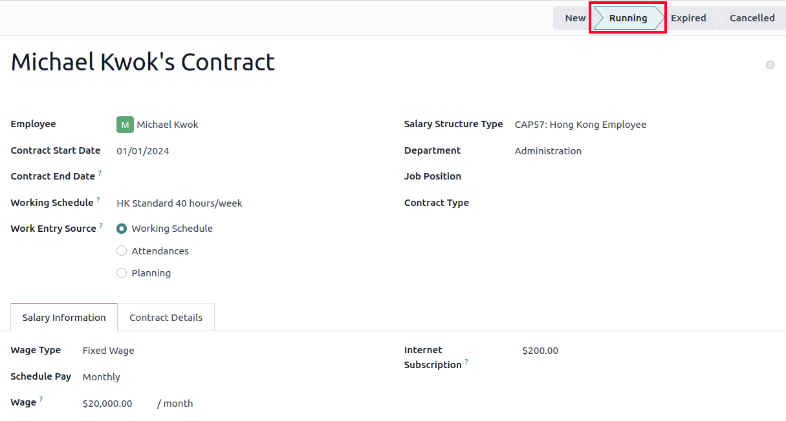

.. _hong_kong/running_payslips:

Generate payslips
-----------------

Once the employees, and their contracts, are configured, payslips can be generated in the *Payroll*
app.

Odoo provides **four** different salary structures under CAP57 regulation:

#. :guilabel:`CAP57: Employees Monthly Pay`: to process the monthly employee salary.
#. :guilabel:`CAP57: Payment in Lieu of Notice`: to process final payment upon contract termination
   using :abbr:`ADW (Average Daily Wage)`.
#. :guilabel:`CAP57: Long Service Payment`: applicable to employees with more than five years of
   service upon contract termination.
#. :guilabel:`CAP57: Severance Payment`: applicable to employees with more than two years of service
   upon contract termination.

Before running the payslips, the accounts used in the salary rule can be adjusted by navigating to
:menuselection:`Payroll app --> Configuration --> Rules`.

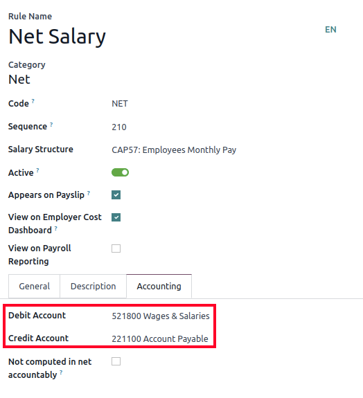

Odoo can create pay runs in two ways: via :ref:`batch <hong_kong/batch_payslips>` or
:ref:`individual <hong_kong/individual_payslips>` payslips.

.. _hong_kong/batch_payslips:

Batch payslips
~~~~~~~~~~~~~~

This method of payslip generation is used for recurring payments, since multiple employee payslips
can be managed at once. Go to :menuselection:`Payroll app --> Payslips --> Batches`.

#. Click on :guilabel:`New`.
#. Enter a :guilabel:`Batch Name` (e.g. `2024 - Jan`) and :guilabel:`Period` (e.g. `01/01/2024` -
   `01/31/2024`).
#. Click on :guilabel:`Generate Payslips`.
#. Choose which :guilabel:`Salary Structure` to use for this batch. The department filter allows the
   batch to only apply to a specific group of employees.
#. Click on :guilabel:`Generate`.
#. A :guilabel:`Payslips` smart button is created automatically.

Next, click :guilabel:`Create Draft Entry` to generate a draft journal entry found in the
:guilabel:`Other Info` tab of each payslip. A :guilabel:`Confirmation` pop-up window appears asking
:guilabel:`Are you sure you want to proceed?`. Click :guilabel:`Ok` to create the journal entries.

.. _hong_kong/individual_payslips:

Individual payslips
~~~~~~~~~~~~~~~~~~~

Go to :menuselection:`Payroll app --> Payslips --> All Payslips`.

This method of payslip generation is commonly used to handle non-recurring payments (e.g.
:guilabel:`CAP57: Payment in Lieu of Notice`, :guilabel:`CAP57: Long Service Payment` or
:guilabel:`CAP57: Severance Payment`).

#. Click on :guilabel:`New`.
#. Select an :guilabel:`Employee`. When selected, the :guilabel:`Contract` is filled out
   automatically.
#. Add a pay :guilabel:`Period`.
#. Select a salary :guilabel:`Structure` (e.g. :guilabel:`CAP57: Employees Monthly Pay`).
#. The :guilabel:`Worked Days & Inputs` tab automatically compute the worked days/hours and time off
   leaves that are applicable.
#. Additional payslip items can be added at this time (e.g. :guilabel:`Commissions`,
   :guilabel:`Deductions`) under the :guilabel:`Other Inputs` section.
#. Click on :guilabel:`Compute Sheet` button to generate the payslip lines. This button updates
   the :guilabel:`Salary Computation` tab.

.. note::
   If the work entry for an employee was amended, click the :icon:`fa-cog` :guilabel:`(gear)` icon,
   then click :guilabel:`Recompute Whole Sheet` to refresh the payslip's :guilabel:`Worked Days &
   Inputs` tab.

The :guilabel:`Salary Computation` tab shows the detailed breakdown of the computation, based on
the salary rules configured for each structure type.

#. :guilabel:`Rent Allowance`: amount derived from the employee's active rental record.
#. :guilabel:`Basic Salary`: amount of base salary provided (after rent allowance deduction).
#. :guilabel:`713 Gross`: net payable amount considering *Commission*, *Internet Allowance*,
   *Reimbursements*, *Back-pay*, *Deduction*, etc.
#. :guilabel:`MPF Gross`: net payable amount from 713 gross after consideration of additional
   allowances, deductions, and end-of-year payment.
#. :guilabel:`Employee Mandatory Contribution`: employee MPF Contribution.
#. :guilabel:`Employer Mandatory Contribution`: employer MPF Contribution.
#. :guilabel:`Gross`: net payable amount from MPF gross after consideration of MPF deductions.
#. :guilabel:`Net Salary`: final payable amount to be paid to the employee.

.. important::
   There are no MPF contributions for the first month. Both employee and employer contribution
   starts on second month.

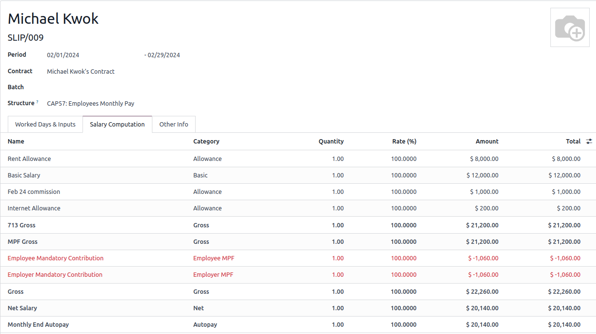

Under the :guilabel:`Other Inputs` section in :guilabel:`Worked Days & Inputs` tab, there are
additional manual input types:

- :guilabel:`Back Pay`: additional salary payout can be included under this category.
- :guilabel:`Commission`: the commission earned during the period can be manually entered here.
- :guilabel:`Global Deduction`: a lump-sum deduction from the entire payslip.
- :guilabel:`Global Reimbursement`: a lump-sum reimbursement to the entire payslip.
- :guilabel:`Referral Fee`: the additional bonus offered for any form of business-related referral.
- :guilabel:`Moving Daily Wage`: to override the :abbr:`ADW (Average Daily Wage)` value used for
  leaves computation.
- :guilabel:`Skip Rent Allowance`: if set, the rental allowance is excluded from the current
  payslip.
- :guilabel:`Custom Average Monthly Salary`: to override the average monthly salary used for
  end-of-year payment (rule is only applicable to payslips generated in December).
- :guilabel:`Lieu of Notice Period (Months)`: only applicable to :guilabel:`CAP57: Payment in Lieu
  of Notice` salary structure. By default, the final payout is set as 1-month. Use the
  :guilabel:`Count` field under the :guilabel:`Other Inputs` section to set a different notice
  period duration.

Once the payslips are ready, click on :guilabel:`Compute Sheet`, followed by :guilabel:`Create Draft
entry` to generate a draft journal entry found in the :guilabel:`Other Info` tab of the payslip.

Pay employees
-------------

Once the draft journal entries have been posted, the company can now pay the employees. The user can
choose between **two** different *payment methods*:

- From the employee's payslip (:menuselection:`Payroll app --> Payslips --> All Payslips`), once the
  payslip's journal entry has been posted, click :guilabel:`Register Payment`. The process is the
  same as :doc:`paying vendor bills <../accounting/payments>`. Select the desired bank journal and
  payment method, then later reconcile the payment with the corresponding bank statement.
- For batch payments (:menuselection:`Payroll app --> Payslips --> Batches`), once all draft journal
  entries from the batch are confirmed, click :guilabel:`Mark as Paid` to post the payment journal
  entry. Then :doc:`create a payment <../accounting/payments>` in the *Accounting* app, and
  reconcile accordingly.

Attendances and hourly wage
---------------------------

To configure the contract for an employee paid hourly using the *Attendances* app for hours
tracking, navigate to :menuselection:`Payroll app --> Contracts --> Contracts`.
Create a new :ref:`contract <hong_kong/manage_contracts>`. It is important to remember to set the
:guilabel:`Work Entry Source` as :guilabel:`Attendances`, and :guilabel:`Wage Type` as
:guilabel:`Hourly Wage`.

To record the hours logged by the employee using *Attendances* app:

#. Go to :menuselection:`Attendances app`.
#. The employee can check-in/out, via the kiosk mode and the time will be logged automatically.
#. In the :menuselection:`Payroll app`, review the attendance work entries generated from
   :menuselection:`Payroll app --> Work Entries --> Work Entries`.
#. Next, generate the :ref:`payslips <hong_kong/running_payslips>` and process the payment.

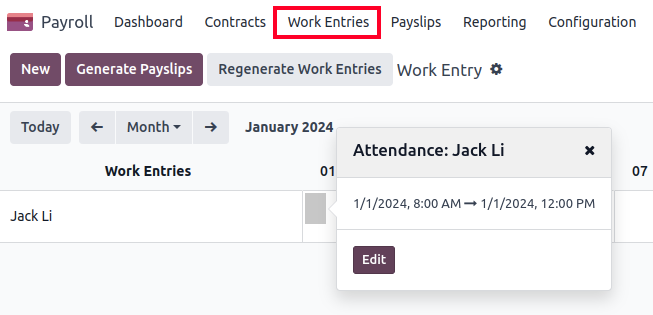

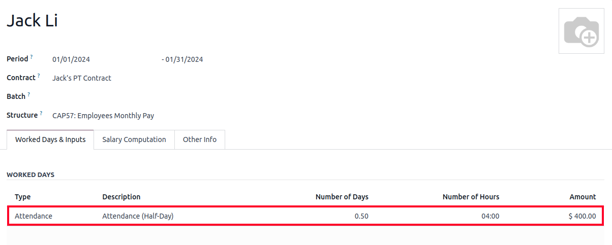

Time Off with Payroll
---------------------

The work entry types and time off types are fully integrated between the *Time Off* and
*Payroll* apps. There are several default time off types and work entry types specific to
Hong Kong which are installed automatically along with the *Hong Kong - Payroll* module.

Go to :menuselection:`Payroll app --> Configuration --> Work Entry Types` and click :guilabel:`New`.

There are two checkboxes to be considered when setting up the work entry type:

- :guilabel:`Use 713`: Include this leave type as part of 713 computation.
- :guilabel:`Non-full pay`: 80% of the :abbr:`ADW (Average Daily Wage)`.

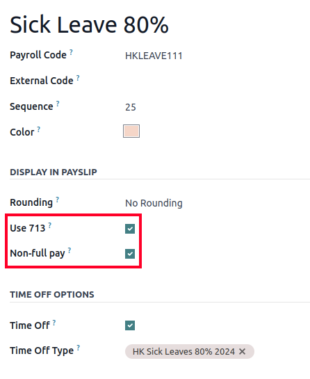

.. seealso::
   :ref:`Creating and configuring work entry types <payroll/work-entries>`

Understanding 713 Ordinance
---------------------------

The *Hong Kong - Payroll* module is compliant with 713 Ordinance which relates to the
:abbr:`ADW (Average Daily Wage)` computation to ensure fair compensation for employees.

The ADW computation is as follows:

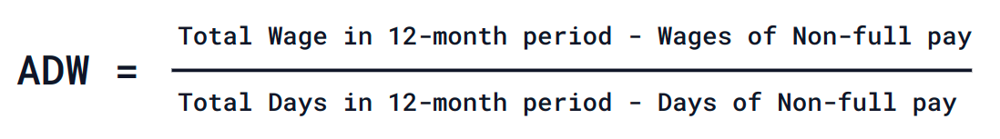

   :abbr:`ADW (Average Daily Wage)` equals the total wage in a 12-month period, minus the wages of
   non-full pay, divided by the total days in a 12-month period minus the days of non-full pay.

.. note::
   For 418 compliance, there is no automated allocation of the *Statutory Holiday* entitlement to
   the employees. As soon as 418 requirements are met, manually allocate the leaves, via the *Time
   Off* app.

.. note::
   Before generating payslips, ensure the statuses are :guilabel:`Done` to validate the outcome.

.. list-table::
   :header-rows: 1

   * - Period
     - Days
     - Wage
     - Commission
     - Total
     - ADW
     - Leave Value
   * - Jan
     - 31
     - $20200
     - $0
     - $20200
     - $651.61 ($20200/31)
     - N/A
   * - Feb
     - 28
     - $20200
     - $5000
     - $25200
     - $769.49 ($45400/59)
     - N/A
   * - Mar (One Day Annual Leave)
     - 31
     - $20324.33
     - $0
     - $20324.33
     - $730.27 ($65724.33/90)
     - $769.49
   * - Apr (One Day 80% Sick Leave)
     - 30
     - $20117.56
     - $0
     -
     -
     - $584.22 ($730.27*0.8)

.. example::
   Here is an example demonstrating the 713 logic:

   - **Jan**: Generate a payslip with a monthly wage of $20200. The :abbr:`ADW (Average Daily Wage)`
     is always computed on a cumulative basis of the trailing 12-months.
   - **Feb**: Generate a similar payslip, but add an :guilabel:`Other Input Type` for the
     :guilabel:`Commission`.
   - **Mar**: Apply for **one** full-paid annual leave in March. The salary compensation for the
     leave taken is based on :abbr:`ADW (Average Daily Wage)` thus far.

     .. image:: hong_kong/hk-march-713.png
        :align: center
        :alt: Hong Kong March 713.

   - **Apr**: Apply for a 1-day non-full pay leave in April. Since this is a non-full pay leave, the
     :abbr:`ADW (Average Daily Wage)` is computed accordingly.

     .. image:: hong_kong/hk-apr-713.png
        :align: center
        :alt: Hong Kong April 713.

.. note::
   The value of :abbr:`ADW (Average Daily Wage)` is computed in the backend, and not be visible to
   the user.

.. seealso::
   - `HK 713 Ordinance <https://www.labour.gov.hk/eng/public/wcp/ConciseGuide/Appendix1.pdf>`_
   - `HK 418 Ordinance <https://www.workstem.com/hk/en/blog/418-regulations/>`_

Generate reports
----------------

Before generating the below reports, setup the following in :menuselection:`Settings app -->
Payroll`.

Configure the following in the :guilabel:`Accounting` section:

- Tick the :guilabel:`Payroll HSBC Autopay` checkbox.

  - :guilabel:`Autopay Type`: Set as :guilabel:`H2H Submission`.
  - Select the :guilabel:`Bank Account` to use.

Configure the following in the :guilabel:`HK Localization` section:

- :guilabel:`Employer's Name shows on reports`
- :guilabel:`Employer's File Number`
- :guilabel:`Manulife MPF Scheme`

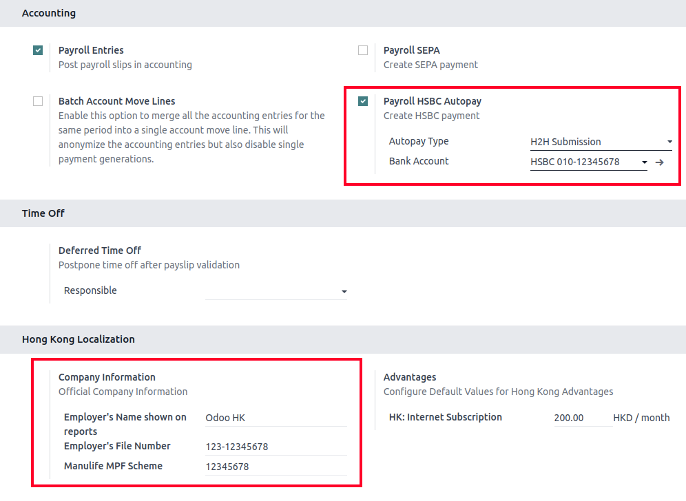

IRD report
~~~~~~~~~~

There are a total of **four** IRD reports available:

- :guilabel:`IR56B`: employer's Return of Remuneration and Pensions.
- :guilabel:`IR56E`: notification of Commencement of Employment.
- :guilabel:`IR56F`: notification of Ceasation of Employment (remaining in HK).
- :guilabel:`IR56G`: notification of Ceasation of Employment (departing from HK permanently).

Go to :menuselection:`Payroll app --> Reporting`, and select one of the :guilabel:`IR56B/E/F/G
Sheet` options:

#. Click on :guilabel:`New`.
#. Fill in the relevant information for the IRD report.
#. Click on :guilabel:`Populate`, and the :guilabel:`Eligible Employees` smart button appears.
#. The :guilabel:`Employee Declarations` status is :guilabel:`Draft` and changed to
   :guilabel:`Generated PDF` status once the schedule runs.
#. Once the PDF is generated, the IRD form may be downloaded.

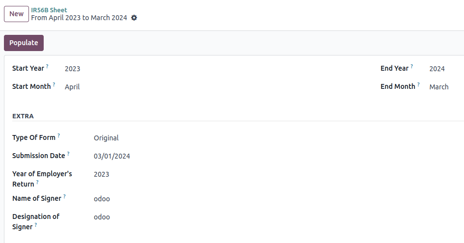

.. note::
   The scheduled action called *Payroll: Generate pdfs* can be manually triggered. It is set by
   default to run the PDF generation monthly.

Manulife MPF sheet
~~~~~~~~~~~~~~~~~~

Go to :menuselection:`Payroll app --> Reporting --> Manulife MPF Sheet`.

#. Click on :guilabel:`New`.
#. Select the relevant :guilabel:`Year`, :guilabel:`Month`, and :guilabel:`Sequence No.`.
#. Click on :guilabel:`Create XLSX`.
#. The *Manulife MPF XLSX* file is then generated, and available for download.

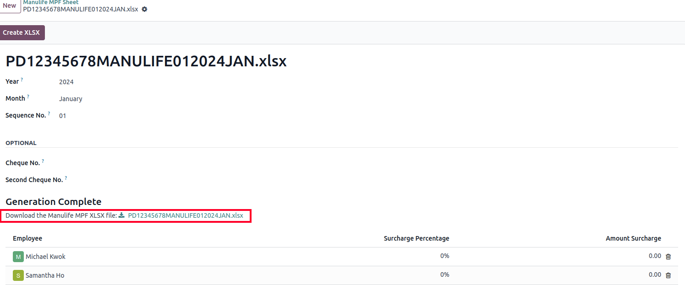

.. note::
   Odoo will not be developing further reports for other MPF trustee as there will soon be an
   eMPF platform setup by the local government.

.. seealso::
   `eMPF <https://www.mpfa.org.hk/en/empf/overview>`_

HSBC autopay report
~~~~~~~~~~~~~~~~~~~

If *HSBC Autopay* is selected as the batch payment method, click on :guilabel:`Create HSBC Autopay
Report`, and fill in the mandatory fields:

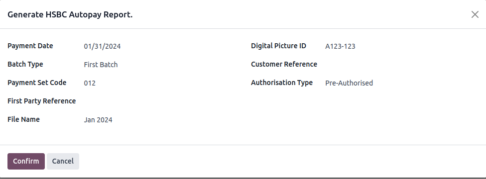

This creates an :file:`.apc` file format which can be uploaded to the HSCB portal for processing.
