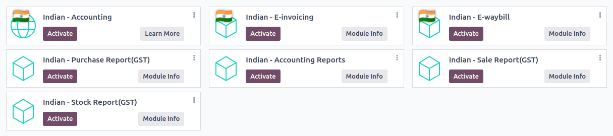
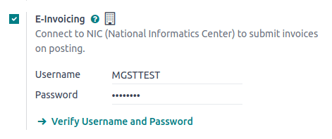
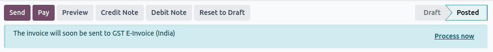
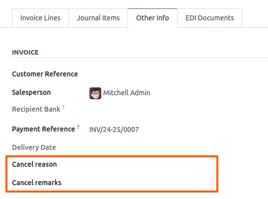
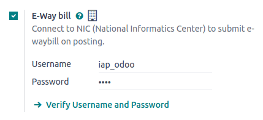
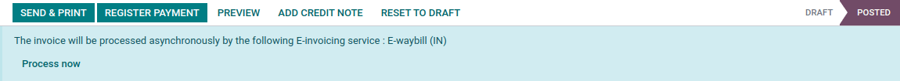

=====
India
=====

.. _india/installation:

Installation
============

:ref:`Install <general/install>` the following modules to get all the features of the Indian
localization:

.. list-table::
   :header-rows: 1

   * - Name
     - Technical name
     - Description
   * - :guilabel:`Indian - Accounting`
     - `l10n_in`
     - Default :ref:`fiscal localization package <fiscal_localizations/packages>`
   * - :guilabel:`Indian E-invoicing`
     - `l10n_in_edi`
     - :ref:`Indian e-invoicing integration <india/e-invoicing>`
   * - :guilabel:`Indian E-waybill`
     - `l10n_in_edi_ewaybill`
     - :ref:`Indian E-way bill integration <india/e-waybill>`
   * - :guilabel:`Indian - Accounting Reports`
     - `l10n_in_reports`
     - Indian tax reports
   * - :guilabel:`Indian - Purchase Report(GST)`
     - `l10n_in_purchase`
     - Indian GST Purchase report
   * - :guilabel:`Indian - Sale Report(GST)`
     - `l10n_in_sale`
     - Indian GST Sale report
   * - :guilabel:`Indian - Stock Report(GST)`
     - `l10n_in_stock`
     - Indian GST Stock report

.. _india/e-invoicing:

e-Invoice system
================

Odoo is compliant with the **Indian Goods and Services Tax (GST) e-Invoice system** requirements.

.. important::
   Indian e-invoicing is available from Odoo 15.0. If needed, :doc:`upgrade
   </administration/upgrade>` your database.

Setup
-----

.. _india/e-invoicing-api:

NIC e-Invoice registration
~~~~~~~~~~~~~~~~~~~~~~~~~~

You must register on the :abbr:`NIC (National Informatics Centre)` e-Invoice portal to get your
**API credentials**. You need these credentials to :ref:`configure your Odoo Accounting app
<india/e-invoicing-configuration>`.

#. Log in to the `NIC e-Invoice portal <https://einvoice1.gst.gov.in/>`_ by clicking
   :guilabel:`Login` and entering your :guilabel:`Username` and :guilabel:`Password`;

   .. note::
      If you are already registered on the NIC portal, you can use the same login credentials.

   .. image:: india/e-invoice-system-login.png
      :alt: Register Odoo ERP system on e-invoice web portal

#. From the dashboard, go to :menuselection:`API Registration --> User Credentials --> Create API
   User`;
#. After that, you should receive an :abbr:`OTP (one-time password)` code on your registered mobile
   number. Enter the OTP code and click :guilabel:`Verify OTP`;
#. Select :guilabel:`Through GSP` for the API interface, set :guilabel:`Tera Software Limited` as
   GSP, and type in a :guilabel:`Username` and :guilabel:`Password` for your API. Once it is done,
   click :guilabel:`Submit`.

   .. image:: india/submit-api-registration-details.png
      :alt: Submit API specific Username and Password

.. _india/e-invoicing-configuration:

Configuration in Odoo
~~~~~~~~~~~~~~~~~~~~~

To enable the e-Invoice service in Odoo, go to :menuselection:`Accounting --> Configuration -->
Settings --> Indian Electronic Invoicing`, and enter the :guilabel:`Username` and
:guilabel:`Password` previously set for the API.

.. _india/e-invoicing-journals:

Journals
********

To automatically send e-Invoices to the NIC e-Invoice portal, you must first configure your *sales*
journal by going to :menuselection:`Accounting --> Configuration --> Journals`, opening your *sales*
journal, and in the :guilabel:`Advanced Settings` tab, under :guilabel:`Electronic Data
Interchange`, enable :guilabel:`E-Invoice (IN)` and save.

.. _india/e-invoicing-workflow:

Workflow
--------

.. _india/invoice-validation:

Invoice validation
~~~~~~~~~~~~~~~~~~

Once an invoice is validated, a confirmation message is displayed at the top. Odoo automatically
uploads the JSON-signed file of validated invoices to the NIC e-Invoice portal after some time. If
you want to process the invoice immediately, click :guilabel:`Process now`.

.. note::
   - You can find the JSON-signed file in the attached files in the chatter.
   - You can check the document's :abbr:`EDI (electronic data interchange)` status under the
     :guilabel:`EDI Document` tab or the :guilabel:`Electronic invoicing` field of the invoice.

.. _india/invoice-pdf-report:

Invoice PDF report
~~~~~~~~~~~~~~~~~~

Once an invoice is validated and submitted, the invoice PDF report can be printed. The report
includes the :abbr:`IRN (Invoice Reference Number)`, :guilabel:`Ack. No` (acknowledgment number) and
:guilabel:`Ack. Date` (acknowledgment date), and QR code. These certify that the invoice is a valid
fiscal document.

.. image:: india/invoice-report.png
   :alt: IRN and QR code

.. _india/edi-cancellation:

e-Invoice cancellation
~~~~~~~~~~~~~~~~~~~~~~

If you want to cancel an e-Invoice, go to the :guilabel:`Other info` tab of the invoice and fill out
the :guilabel:`Cancel reason` and :guilabel:`Cancel remarks` fields. Then, click :guilabel:`Request
EDI cancellation`. The status of the :guilabel:`Electronic invoicing` field changes to :guilabel:`To
Cancel`.

.. important::
   Doing so cancels both the :ref:`e-Invoice <india/e-invoicing>` and the :ref:`E-Way bill
   <india/e-waybill>`.

.. note::
   - If you want to abort the cancellation before processing the invoice, then click :guilabel:`Call
     Off EDI Cancellation`.
   - Once you request to cancel the e-Invoice, Odoo automatically submits the JSON-signed file to
     the NIC e-Invoice portal. You can click :guilabel:`Process now` if you want to process the
     invoice immediately.

.. _india/verify-e-invoice:

GST e-Invoice verification
~~~~~~~~~~~~~~~~~~~~~~~~~~

After submitting an e-Invoice, you can verify if the invoice is signed from the GST e-Invoice system
website itself.

#. Download the JSON file from the attached files. It can be found in the chatter of the related
   invoice;
#. Open the `NIC e-Invoice portal <https://einvoice1.gst.gov.in/>`_ and go to
   :menuselection:`Search --> Verify Signed Invoice`;
#. Select the JSON file and submit it;

   .. image:: india/verify-invoice.png
      :alt: select the JSON file for verify invoice

   If the file is signed, a confirmation message is displayed.

   .. image:: india/signed-invoice.png
      :alt: verified e-invoice

.. _india/e-waybill:

E-Way bill
==========

Setup
-----

Odoo is compliant with the **Indian Goods and Services Tax (GST) E-waybill system** requirements.

.. important::
   Indian E-waybill is available from Odoo 15.0. If needed, :doc:`upgrade </administration/upgrade>`
   your database.

.. _india/e-waybill-api:

API registration on NIC E-Way bill
~~~~~~~~~~~~~~~~~~~~~~~~~~~~~~~~~~

You must register on the :abbr:`NIC (National Informatics Centre)` E-Way bill portal to create your
**API credentials**. You need these credentials to :ref:`configure your Odoo Accounting app
<india/e-waybill-configuration>`.

#. Log in to the `NIC E-Way bill portal <https://ewaybillgst.gov.in/>`_ by clicking
   :guilabel:`Login` and entering your :guilabel:`Username` and :guilabel:`Password`;
#. From your dashboard, go to :menuselection:`Registration --> For GSP`;
#. Click :guilabel:`Send OTP`. Once you have received the code on your registered mobile number,
   enter it and click :guilabel:`Verify OTP`;
#. Check if :guilabel:`Tera Software Limited` is already on the registered GSP/ERP list. If so, use
   the username and password used to log in to the NIC portal. Otherwise, follow the next steps;

   .. image:: india/e-waybill-gsp-list.png
      :alt: E-Way bill list of registered GSP/ERP

#. Select :guilabel:`Add/New`, select :guilabel:`Tera Software Limited` as your GSP Name, create a
   :guilabel:`Username` and a :guilabel:`Password` for your API, and click :guilabel:`Add`.

   .. image:: india/e-waybill-registration-details.png
      :alt: Submit GSP API registration details

.. _india/e-waybill-configuration:

Configuration in Odoo
~~~~~~~~~~~~~~~~~~~~~

To set up the E-Way bill service, go to :menuselection:`Accounting --> Configuration --> Settings
--> Indian Electronic WayBill --> Setup E-Way bill`, and enter your :guilabel:`Username` and
:guilabel:`Password`.

.. _india/e-waybill-workflow:

Workflow
--------

.. _india/e-waybill-send:

Send an E-Way bill
~~~~~~~~~~~~~~~~~~

You can manually send an E-Way bill by clicking :guilabel:`Send E-Way bill`. To send the E-Way bill
automatically when an invoice or a bill is confirmed, enable :guilabel:`E-Way bill (IN)` in your
:ref:`Sales or Purchase journal <india/e-invoicing-journals>`.

.. image:: india/e-waybill-send-button.png
   :alt: Send E-waybill button on invoices

.. _india/invoice-validation-e-way:

Invoice validation
~~~~~~~~~~~~~~~~~~

Once an invoice has been issued and sent via :guilabel:`Send E-Way bill`, a confirmation message is
displayed.

.. note::
   - You can find the JSON-signed file in the attached files in the chatter.
   - Odoo automatically uploads the JSON-signed file to the government portal after some time. Click
     :guilabel:`Process now` if you want to process the invoice immediately.

Invoice PDF report
~~~~~~~~~~~~~~~~~~

You can print the invoice PDF report once you have submitted the E-Way bill. The report includes the
**E-Way bill number** and the **E-Way bill validity date**.

.. image:: india/e-waybill-invoice-report.png
   :alt: E-way bill acknowledgment number and date

.. _india/e-waybill-cancellation:

E-Way bill cancellation
~~~~~~~~~~~~~~~~~~~~~~~

If you want to cancel an E-Way bill, go to the :guilabel:`E-Way bill` tab of the related invoice and
fill out the :guilabel:`Cancel reason` and :guilabel:`Cancel remarks` fields. Then, click
:guilabel:`Request EDI Cancellation`.

.. important::
   Doing so cancels both the :ref:`e-Invoice <india/e-invoicing>` (if applicable) and the
   :ref:`E-Way bill <india/e-waybill>`.

.. image:: india/e-waybill-cancellation.png
   :alt: Cancel reason and remarks

.. note::
   - If you want to abort the cancellation before processing the invoice, click :guilabel:`Call Off
     EDI Cancellation`.
   - Once you request to cancel the E-Way bill, Odoo automatically submits the JSON-signed file to
     the government portal. You can click :guilabel:`Process Now` if you want to process the invoice
     immediately.
