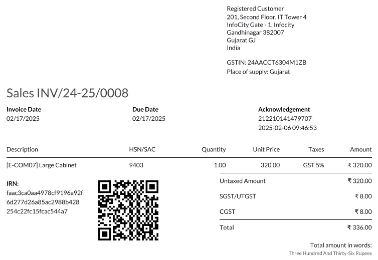
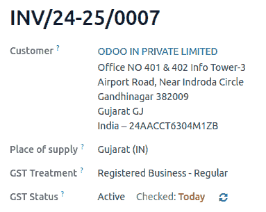
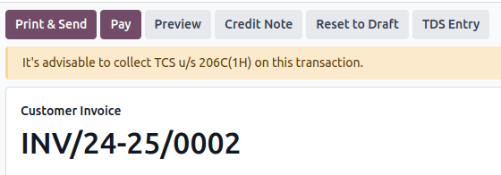

=====
India
=====

.. _india/installation:

Installation
============

:ref:`Install <general/install>` the following modules to get all the features of the Indian
localization:

.. list-table::
   :header-rows: 1

   * - Name
     - Technical name
     - Description
   * - :guilabel:`Indian - Accounting`
     - `l10n_in`
     - Default :ref:`fiscal localization package <fiscal_localizations/packages>`
   * - :guilabel:`Indian E-invoicing`
     - `l10n_in_edi`
     - :ref:`Indian e-invoicing integration <india/e-invoicing>`
   * - :guilabel:`Indian E-waybill`
     - `l10n_in_ewaybill`
     - :ref:`Indian E-way bill integration <india/e-waybill>`
   * - :guilabel:`Indian E-waybill Stock`
     - `l10n_in_ewaybill_stock`
     - :ref:`E-waybill creation from the Inventory app <india/e-waybill-stock>`
   * - :guilabel:`Indian - Accounting Reports`
     - `l10n_in_reports`
     - Adds the :ref:`Indian GST Return filing <india/gstr>` and the :ref:`Indian
       Tax reports <india/gstr_reports>`.

.. _india/company:

Company
-------

To configure your company information, open the **Settings** app, scroll down to the
:guilabel:`Companies` section, click :guilabel:`Update Info`, and configure the following:

- :guilabel:`Company Name`
- :guilabel:`Address`, including the :guilabel:`Street`, :guilabel:`City`, :guilabel:`State`,
  :guilabel:`ZIP`, and :guilabel:`Country`
- :guilabel:`PAN`: essential for determining the type of taxpayer.
- :guilabel:`GSTIN`: necessary for generating e-Invoices, E-waybills and filing GST returns.

.. _india/indian-configuration:

Indian Configuration
====================

The **Indian Integration** section provides essential taxation and compliance features to simplify
financial operations. To enable these features, navigate to :menuselection:`Accounting -->
Configuration --> Settings` and scroll down to the :guilabel:`Indian Integration` section.

- :guilabel:`TDS/TCS`: Activate this to enable :ref:`TDS/TCS <india/tds-tcs-threshold>`
  functionality along with account-based TDS/TCS section suggestions.
- :guilabel:`Registered Under GST`: Select this if your business is registered under GST to access
  GST-related features, including e-invoice, e-waybill, GST e-filing, fetch vendor e-invoiced
  document and check GST number status.
- :guilabel:`E-Invoicing`: Connects to the :ref:`e-invoice <india/e-invoicing>` :abbr:`NIC
  (National Informatics Center)` portal to submit invoices.
- :guilabel:`E-Way bill`: Connects to the :ref:`e-waybill <india/e-waybill>` :abbr:`NIC
  (National Informatics Center)` portal to generate e-waybills.
- :guilabel:`GST E-Filing & Matching`: Enable the feature to facilitate :ref:`GST return filing
  <india/gstr>` and connect with the GST portal to submit GSTR-1 and retrieve GSTR-2B.
- :guilabel:`Check GST Number Status`: Enable to verify :ref:`GSTIN Status <india/gstin_status>`.
- :guilabel:`Fetch Vendor E-Invoiced Document`: Helps in creating draft vendor bills using
  e-invoice data submitted by vendors on GST portal.

.. important::
   Check the :guilabel:`Production Environment` checkbox to start using Indian services in the
   production environment. If you want to use the testing environment then keep the checkbox
   unchecked.

.. _india/e-invoicing:

e-Invoice system
================

Odoo is compliant with the **Indian Goods and Services Tax (GST) e-Invoice system** requirements.

Setup
-----

.. _india/e-invoicing-api:

NIC e-Invoice registration
~~~~~~~~~~~~~~~~~~~~~~~~~~

You must register on the :abbr:`NIC (National Informatics Centre)` e-Invoice portal to get your
**API credentials**. You need these credentials to :ref:`configure your Odoo Accounting app
<india/e-invoicing-configuration>`.

#. Log in to the `NIC e-Invoice portal <https://einvoice1.gst.gov.in/>`_ by clicking
   :guilabel:`Login` and entering your :guilabel:`Username` and :guilabel:`Password`;

   .. note::
      If you are already registered on the NIC portal, you can use the same login credentials.

   .. image:: india/e-invoice-system-login.png
      :alt: Register Odoo ERP system on e-invoice web portal

#. From the dashboard, go to :menuselection:`API Registration --> User Credentials --> Create API
   User`;
#. After that, you should receive an :abbr:`OTP (one-time password)` code on your registered mobile
   number. Enter the OTP code and click :guilabel:`Verify OTP`;
#. Select :guilabel:`Through GSP` for the API interface, set :guilabel:`Tera Software Limited` as
   GSP, and type in a :guilabel:`Username` and :guilabel:`Password` for your API. Once it is done,
   click :guilabel:`Submit`.

   .. image:: india/submit-api-registration-details.png
      :alt: Submit API specific Username and Password

.. _india/e-invoicing-configuration:

Configuration in Odoo
~~~~~~~~~~~~~~~~~~~~~

To enable the e-Invoice service in Odoo, :ref:`activate <india/indian-configuration>` the
:guilabel:`E-Invoicing` feature and enter the :guilabel:`Username` and :guilabel:`Password`
previously set for the API.

.. _india/e-invoicing-workflow:

Workflow
--------

.. _india/generate-e-invoice:

Generate e-Invoice
~~~~~~~~~~~~~~~~~~

Once an invoice is confirmed, click the :guilabel:`Send` button to open the wizard. Select
:guilabel:`E-Invoicing`, then click the :guilabel:`Generate` button. Odoo will upload the
JSON-signed file of the invoice to the NIC e-Invoice portal.

.. note::
   - You can find the JSON-signed file and check the e-Invoicing status in the chatter.

.. _india/invoice-pdf-report:

Invoice PDF report
~~~~~~~~~~~~~~~~~~

Once an invoice is validated and submitted, the invoice PDF report can be printed. The report
includes the :abbr:`IRN (Invoice Reference Number)`, :guilabel:`Acknowledgement` (number and date)
and QR code. These certify that the invoice is a valid fiscal document.

.. _india/edi-cancellation:

e-Invoice cancellation
~~~~~~~~~~~~~~~~~~~~~~

To cancel an e-Invoice, click the :guilabel:`Request Cancel` button on the related invoice. In the
:guilabel:`Cancel E-Invoice` window, fill out the :guilabel:`Cancel Reason` and :guilabel:`Cancel
Remarks`.

.. note::
   - You can find the e-Invoicing status in the chatter.

.. _india/e-invoice-negative-lines:

Management of negative lines in e-Invoices
~~~~~~~~~~~~~~~~~~~~~~~~~~~~~~~~~~~~~~~~~~

Negative lines are typically used to represent discounts or adjustments associated with specific
products or global discounts. The government portal prohibits the submission of data with negative
lines, which means they need to be converted based on the HSN code and GST rate. This is done
automatically by Odoo.

.. example::

   Consider the following example:

   +---------------------------------------------------------------------------------------------------+
   |                                     **Product Details**                                           |
   +=======================+==============+==================+==============+==============+===========+
   | **Product Name**      | **HSN Code** | **Tax Excluded** | **Quantity** | **GST Rate** | **Total** |
   +-----------------------+--------------+------------------+--------------+--------------+-----------+
   | Product A             |  123456      |  1,000           |  1           |  18%         |  1,180    |
   +-----------------------+--------------+------------------+--------------+--------------+-----------+
   | Product B             |  239345      |  1,500           |  2           |  5%          |  3,150    |
   +-----------------------+--------------+------------------+--------------+--------------+-----------+
   | Discount on Product A |  123456      |  -100            |  1           |  18%         |  -118     |
   +-----------------------+--------------+------------------+--------------+--------------+-----------+

   Here's the transformed representation:

   +-------------------------------------------------------------------------------------------------------------+
   |                                         **Product Details**                                                 |
   +==================+==============+==================+==============+==============+==============+===========+
   | **Product Name** | **HSN Code** | **Tax Excluded** | **Quantity** | **Discount** | **GST Rate** | **Total** |
   +------------------+--------------+------------------+--------------+--------------+--------------+-----------+
   | Product A        |  123456      |  1,000           |  1           |  100         |  18%         |  1,062    |
   +------------------+--------------+------------------+--------------+--------------+--------------+-----------+
   | Product B        |  239345      |  1,500           |  2           |  0           |  5%          |  3,150    |
   +------------------+--------------+------------------+--------------+--------------+--------------+-----------+

   In this conversion, negative lines have been transformed into positive discounts, maintaining
   accurate calculations based on the HSN Code and GST rate. This ensures a more straightforward and
   standardized representation in the E-invoice records.

.. _india/verify-e-invoice:

GST e-Invoice verification
~~~~~~~~~~~~~~~~~~~~~~~~~~

After submitting an e-Invoice, you can verify if the invoice is signed from the GST e-Invoice system
website itself.

#. Download the JSON file from the attached files. It can be found in the chatter of the related
   invoice;
#. Open the `NIC e-Invoice portal <https://einvoice1.gst.gov.in/>`_ and go to
   :menuselection:`Search --> Verify Signed Invoice`;
#. Select the JSON file and submit it;

   .. image:: india/verify-invoice.png
      :alt: select the JSON file for verify invoice

   If the file is signed, a confirmation message is displayed.

   .. image:: india/signed-invoice.png
      :alt: verified e-invoice

.. _india/e-waybill:

E-Way bill
==========

.. _india/e-waybill-setup:

Setup
-----

Odoo is compliant with the **Indian Goods and Services Tax (GST) E-waybill system** requirements.

.. _india/e-waybill-api:

API registration on NIC E-Way bill
~~~~~~~~~~~~~~~~~~~~~~~~~~~~~~~~~~

You must register on the :abbr:`NIC (National Informatics Centre)` E-Way bill portal to create your
**API credentials**. You need these credentials to :ref:`configure your Odoo Accounting app
<india/e-waybill-configuration>`.

#. Log in to the `NIC E-Way bill portal <https://ewaybillgst.gov.in/>`_ by clicking
   :guilabel:`Login` and entering your :guilabel:`Username` and :guilabel:`Password`;
#. From your dashboard, go to :menuselection:`Registration --> For GSP`;
#. Click :guilabel:`Send OTP`. Once you have received the code on your registered mobile number,
   enter it and click :guilabel:`Verify OTP`;
#. Check if :guilabel:`Tera Software Limited` is already on the registered GSP/ERP list. If so, use
   the username and password used to log in to the NIC portal. Otherwise, follow the next steps;

   .. image:: india/e-waybill-gsp-list.png
      :alt: E-Way bill list of registered GSP/ERP

#. Select :guilabel:`Add/New`, select :guilabel:`Tera Software Limited` as your GSP Name, create a
   :guilabel:`Username` and a :guilabel:`Password` for your API, and click :guilabel:`Add`.

   .. image:: india/e-waybill-registration-details.png
      :alt: Submit GSP API registration details

.. _india/e-waybill-configuration:

Configuration in Odoo
~~~~~~~~~~~~~~~~~~~~~

To enable the E-Way bill service in Odoo, :ref:`activate <india/indian-configuration>` the
:guilabel:`E-Way bill` feature and enter the :guilabel:`Username` and :guilabel:`Password`.

.. _india/e-waybill-workflow:

Workflow
--------

.. _india/generate-e-waybill:

Generate E-Way bill
~~~~~~~~~~~~~~~~~~~

To generate an E-Way bill, confirm the customer invoice/vendor bill and click :guilabel:`Create
e-Waybill`. Enter the necessary details and click :guilabel:`Generate e-Waybill` to proceed.

.. note::
   - You can find the JSON-signed file in the attached files in the chatter.

Invoice PDF report
~~~~~~~~~~~~~~~~~~

You can print the invoice PDF report once you have submitted the E-Way bill. The report includes the
**E-Way bill number** and the **E-Way bill validity date**.

.. image:: india/e-waybill-invoice-report.png
   :alt: E-way bill acknowledgment number and date

.. _india/e-waybill-cancellation:

E-Way bill cancellation
~~~~~~~~~~~~~~~~~~~~~~~

To cancel an E-Way bill, click :guilabel:`e-Waybill` on the related invoice/bill, then
:guilabel:`Cancel e-Waybill`. In the :guilabel:`Cancel Ewaybill` window, fill out the
:guilabel:`Cancel Reason` and :guilabel:`Cancel Remarks`.

.. image:: india/e-waybill-cancellation.png
   :alt: Cancel reason and remarks

.. note::
   - Once you request to cancel the E-Way bill, Odoo automatically submits the JSON-signed file to
     the government portal. You can check the JSON file in the chatter.

.. _india/e-waybill-stock:

E-waybill creation from receipts and delivery orders
----------------------------------------------------

.. note::
   Make sure the **E-Way bill Stock** module is :ref:`installed <general/install>` and
   the :ref:`E-Way bill setup <india/e-waybill-setup>` is complete.

To create E-Way bills from :doc:`receipts and deliveries
</applications/inventory_and_mrp/inventory/shipping_receiving/daily_operations>` in the Inventory
app, follow these steps:

#. Go to :menuselection:`Inventory --> Operations --> Deliveries` or :menuselection:`Inventory -->
   Operations --> Receipts` and select an existing delivery order/receipt or create a new one.

#. Click :guilabel:`Create E-waybill/Challan`.

   .. note::
      To create an E-way bill:

      - A delivery order must be in the :guilabel:`Done` state (i.e., validated)
      - A receipt must have the :guilabel:`Ready` or :guilabel:`Done` state.

#. Click :guilabel:`Generate e-Waybill` to validate the E-Way bill and send it to the NIC E-Way
   bill portal.

   .. tip::
      To use the E-Way bill as a challan for goods deliveries without sending it to the NIC
      E-Waybill portal, click :guilabel:`Use as Challan`.

To print the E-waybill or the challan, click the :icon:`fa-cog` :guilabel:`(gear)` icon and select
:icon:`fa-print` :guilabel:`Ewaybill / Delivery Challan`.

.. _india/gstin_status:

Indian Check GSTIN Status
=========================

The :guilabel:`Indian - Check GST Number Status` allows you to verify the status of a
:abbr:`GSTIN (Goods and Services Tax Identification Number)` directly from Odoo.

To verify the status of a contact's GST number, access the customer's/vendor's form and click
:guilabel:`Check GSTIN Status` next to the :guilabel:`GSTIN` field.

To verify the status of a GST number entered on an invoice/bill, access the invoice/bill and click
the :icon:`fa-refresh` (:guilabel:`refresh`) button next to the :guilabel:`GST Status` field.

A notification is displayed to confirm the status update and the GSTIN status and verification date
are logged in the contact's chatter.

.. _india/gstr:

Indian GST Return filing
========================

.. _india/gstr_api:

Enable API access
-----------------

To file GST Returns in Odoo, you must first enable API access on the GST portal.

#. Log into the `GST portal <https://services.gst.gov.in/services/login>`_ by entering your
   :guilabel:`Username` and :guilabel:`Password`, and go to :guilabel:`My Profile` on your **profile
   menu**;

   .. image:: india/gst-portal-my-profile.png
      :alt: Click On the My Profile from profile

#. Select :guilabel:`Manage API Access`, and click :guilabel:`Yes` to enable API access;

   .. image:: india/gst-portal-api-yes.png
      :alt: Click Yes

.. note::
   It is recommended to set the :guilabel:`Duration` to :guilabel:`30 days` to avoid the need for
   frequent token reauthentication.

#. Doing so enables a :guilabel:`Duration` drop-down menu. Select the :guilabel:`Duration` of your
   preference, and click :guilabel:`Confirm`.

.. _india/gstr_configuration:

Indian GST Service In Odoo
--------------------------

Once you have enabled the :ref:`API access <india/gstr_api>` on the GST portal, :ref:`activate
<india/indian-configuration>` the :guilabel:`GST E-Filing & Matching Feature` to start using GST
Service. Then, in the :guilabel:`Registered Under GST` section, fill in the required :guilabel:`GST
Username`.

   .. image:: india/gst-setup.png
      :alt: Please enter your GST portal Username as Username

.. _india/gstr_workflow:

File-in GST Return
------------------

To file a GST return, make sure the :ref:`GST E-Filing & Matching Feature
<india/indian-configuration>` is enabled. Then, go to the Accounting dashboard and click
:guilabel:`Tax Returns` on the :guilabel:`Tax Returns` journal. In the
:guilabel:`Accounting Periods` window, fill in the following fields.

- :guilabel:`Opening Date`: Starting date from which tax return periods are created.
- :guilabel:`Fiscal Year End`: End date of the fiscal year (e.g., :guilabel:`31 March`).
- :guilabel:`GSTIN Periodicity`: Frequency of return filing (e.g., :guilabel:`Monthly`).

.. tip::
   Alternatively, go to :menuselection:`Accounting --> Reporting --> Tax Report`, click
   :icon:`fa-book` :guilabel:`Report:` and select :guilabel:`GSTR-1 (IN)`. Then, click
   :guilabel:`Returns` to file the return.

.. note::
   To reconcile vendor bills with GST portal data, go to
   :menuselection:`Accounting --> Reporting --> Tax Report`, click :icon:`fa-book`
   :guilabel:`Report:` and select :guilabel:`GSTR-2B`, and click :guilabel:`Reconcile`.

.. _india/gstr-1:

Filing GSTR-1 tax return
~~~~~~~~~~~~~~~~~~~~~~~~

To file a GSTR-1 tax return, follow these steps:

#. Click the suitable :guilabel:`GSTR-1` report for the desired period to open the filing view.

   .. image:: india/gst-gstr-1-file.png
      :alt: GSTR-1 filing view

   .. note::
      It is recommended to file the return **five days before the filing date** to avoid any
      penalties.

#. Odoo automatically performs validation checks before submission to ensure compliance with GST
   portal requirements that must be addressed before filing.

   .. note::
      The following types of validation issues can be raised:

      - :guilabel:`Apply Appropriate Tax`: :guilabel:`IGST` is not applicable for intra-state
        transactions.
      - :guilabel:`Wrong CGST/SGST on Inter-State Transactions`: :guilabel:`CGST/SGST` cannot be
        applied on inter-state transactions.
      - :guilabel:`Fiscal Year Reversed Move`: Credit Notes for invoices issued in a given financial
        year should not be included in GSTR-1 after **November 30th**; remove tax from these lines.
      - :guilabel:`Invalid HSN Codes`:
        - For products (non-services), HSN codes must not begin with `99`.
        - For services, HSN codes must begin with `99`.
      - :guilabel:`Missing HSN Codes`: Some product lines do not have HSN codes for journal
        items.
      - :guilabel:`Invalid UQC Codes`: The Unit Quantity Code (UQC) must comply with Indian GST
        standards.
      - :guilabel:`Missing Document Summary`: Document summary lines are mandatory for GSTR-1. This
        check is always marked as :guilabel:`Anomaly` initially. After reviewing the summary by
        clicking the relevant check, it changes to :guilabel:`Reviewed`.
      - :guilabel:`Missing E-Invoice`: Some invoices are not linked to an e-invoice.
      - :guilabel:`Unlinked Unregistered Credit Notes`: Credit Notes have been issued without
        referencing an invoice.

   Validation checks have four stages:

   - :guilabel:`To Review`: Check requires review.
   - :guilabel:`Reviewed`: Check has been reviewed.
   - :guilabel:`Supervised`: Check is supervised, and a supervisor is assigned.
   - :guilabel:`Anomaly`: Check has failed.

   Click on any individual check to view and resolve the corresponding issue.

   .. tip::
      A tax return can only be validated when all checks are in the :guilabel:`Reviewed` or
      :guilabel:`Supervised` stage.

   After reviewing the checks, click :guilabel:`Validate`. The :guilabel:`Review` stage appears in
   green then.

#. Click :guilabel:`GSTR-1 (IN)` to review the report.

#. Click :guilabel:`Submit`, and click :guilabel:`Push Data` in the
   :guilabel:`Submission Instructions` window to send the report to the GST portal.

   During this step, GST portal credentials must be verified. As the data is being sent, the
   :guilabel:`Send` stage in the progress bar appears orange. Once the GST portal confirms receipt,
   the stage turns green. If an error occurs, the :guilabel:`Send` stage changes to red.

   .. note::
      Click the :icon:`fa-ellipsis-v` :guilabel:`(ellipsis)` icon on the relevant :guilabel:`GSTR-1`
      line to display additional options:

      - :guilabel:`Generate XLSX`: Download the GSTR-1 report as an XLSX file.
      - :guilabel:`Reset`: Clear the current state and revert the return to the initial stage.

#. Click :guilabel:`Check Status` to retrieve the current status from the GST portal.
   Once the confirmation is received, the :guilabel:`Review` stage in the progress bar turns green.
   Then, click :guilabel:`Mark as Filed` to finalize and submit the return as filed.

   .. important::
      Once a return is marked as **Filed**, it cannot be reset or filed again.

.. _india/gstr-2b:

Receive GSTR-2B tax reconciliation
~~~~~~~~~~~~~~~~~~~~~~~~~~~~~~~~~~

#. Select the relevant :guilabel:`GSTR-2B` report for the desired period that needs to be
   reconciled.

#. In the validation checks view, click :guilabel:`Fetch E-Invoice` to retrieve vendor e-invoice
   data for the reconciliation period. The check is initially marked as :guilabel:`Anomaly` and
   changes to :guilabel:`Reviewed` after fetching. Then, click :guilabel:`Validate` to confirm and
   mark the :guilabel:`Review` stage as green.

   .. important::
      The :guilabel:`Fetch E-Invoice` check only turns green if the e-invoice data is fetched
      **two days after the end of the last month's reconciliation period**.

#. Click :guilabel:`Fetch GSTR-2B` to retrieve all invoices from the GST portal. Once the data is
   fetched, the :guilabel:`Fetch` stage in the progress bar turns green. To view the raw report
   data, click :guilabel:`GSTR-2B (IN)`.

#. The fetched invoices are automatically matched with the E-invoices. Click :guilabel:`View Bills`
   to see detailed matching results.

   .. note::
      The :guilabel:`Match` stage indicates the reconciliation status:

      - Orange: Partially matched (some bills require correction).
      - Green: Fully matched (all bills reconciled).

      In case of mismatches, correct the affected bills, then click the :icon:`fa-ellipsis-v`
      :guilabel:`(ellipsis)` icon to access additional options:

      - :guilabel:`Re-Match`: Re-run the matching process after making corrections.
      - :guilabel:`Reset`: Reset the reconciliation to the :guilabel:`Match` stage.

#. After all bills are fully matched, click the :icon:`fa-ellipsis-v` :guilabel:`(ellipsis)` icon
   and select :guilabel:`Mark as Complete`.
   The :guilabel:`Complete` stage in the progress bar turns green, finalizing the bill
   reconciliation.

.. _india/gstr_reports:

Tax reports
===========

.. _india/gstr-1_report:

GSTR-1 report
-------------

The :guilabel:`GSTR-1` report is divided into sections. It displays the :guilabel:`Base` amount,
:abbr:`CGST (Central Goods and Services Tax)`, :abbr:`SGST (State Goods and Service Tax)`,
:abbr:`IGST (Integrated Goods and Services Tax)`, and :guilabel:`CESS` for each section.

   .. image:: india/gst-gstr-1-report.png
      :alt: GSTR-1 Report

.. _india/gstr-2b_report:

GSTR-2B report
--------------

The :guilabel:`GSTR-2` report is divided into sections. It displays the :guilabel:`Base` amount,
:abbr:`CGST (Central Goods and Services Tax)`, :abbr:`SGST (State Goods and Service Tax)`,
:abbr:`IGST (Integrated Goods and Services Tax)`, and :guilabel:`CESS` for each section.

   .. image:: india/gst-gstr-2b-report.png
      :alt: GSTR-2B Report

.. _india/gstr-3b_report:

GSTR-3B report
--------------

The :guilabel:`GSTR-3B` report contains different sections:

- Details of inward and outward supply subject to a **reverse charge**;
- Eligible :abbr:`ITC (Income Tax Credit)`;
- Values of **exempt**, **Nil-rated**, and **non-GST** inward supply;
- Details of inter-state supplies made to **unregistered** persons.

   .. image:: india/gst-gstr-3b-report.png
      :alt: GSTR-3B Report

Profit and Loss (IN) report
---------------------------

This is a :guilabel:`Profit and Loss` report that displays the balances for **Opening Stock** and
**Closing Stock**. It helps users using Continental accounting to accurately determine the cost of
goods (i.e :guilabel:`Opening Stock` + purchases during the period - :guilabel:`Closing Stock`).

   .. image:: india/profit-and-loss-report.png
      :alt: Profit and Loss report

.. _india/tds-tcs-threshold:

TDS/TCS threshold alert
=======================

:abbr:`TDS (tax deducted at source)` and :abbr:`TCS (tax collected at source)` are tax provisions
under Indian law, triggered when transaction amounts exceed specified thresholds. This alert
notifies users when the value of invoices or bills surpasses these limits, prompting the application
of the appropriate TDS/TCS.

To configure Odoo to advise you on when to apply TDS/TCS, set the :guilabel:`TDS/TCS section`
field on the corresponding account in the chart of accounts. Odoo will display a banner suggesting
the TDS/TCS section under which tax might be applicable when recording an invoice or bill.

Configuration
-------------

#. Navigate to :menuselection:`Accounting --> Configuration --> Settings`
#. In the :guilabel:`Indian Integration` section, enable the :guilabel:`TDS` or :guilabel:`TCS`
   feature as required.
#. Navigate to :menuselection:`Accounting --> Configuration --> Chart of Accounts`.
#. Click :guilabel:`View` on the desired account, and set the :guilabel:`TDS/TCS Section` field.

.. note::
   The TDS/TCS sections are pre-configured with threshold limits. If you need to modify these
   limits, go to :menuselection:`Accounting --> Configuration --> Taxes`. In the :guilabel:`Advanced
   Options` tab, click on the  :icon:`fa-arrow-right` :guilabel:`(internal link)` icon of the
   :guilabel:`Section` field.

   .. image:: india/tds-tcs-section-modify.png
      :alt: TDS/TCS section modify

Applying TCS/TDS on invoices and bills
--------------------------------------

Based on the account used on the customer invoice or vendor bill, Odoo checks the TCS/TDS threshold
limit. If the limit specified in the :guilabel:`TCS/TDS Section` of the account is exceeded, Odoo
displays an alert that suggests applying the appropriate TCS/TDS. The alert will disappear once the
TCS/TDS is applied.

**TCS** is directly applicable in the tax on the invoice lines. To apply **TDS**, click the
:guilabel:`TDS Entry` smart button on the vendor bill/payment. The popup window allows specifying
the TDS details. Confirm the entry to apply the TDS.

.. image:: india/tds-apply.png
   :alt: TDS application

In Odoo, the aggregate total is calculated for partners sharing the same PAN number, across all company branches.

.. example::

   .. list-table::
      :header-rows: 1
      :widths: 10 20 10 20 15

      * - **Branch**
        - **Customer**
        - **Invoice**
        - **Transaction Amount (₹)**
        - **PAN Number**
      * - IN - MH
        - XYZ Enterprise - GJ
        - Invoice 1
        - ₹50,000
        - ABCPX1234E
      * - IN - MH
        - XYZ Enterprise - GJ
        - Invoice 2
        - ₹30,000
        - ABCPX1234E
      * - IN - MH
        - XYZ Enterprise - MH
        - Invoice 3
        - ₹40,000
        - ABCPX1234E
      * - IN - DL
        - XYZ Enterprise - GJ
        - Invoice 4
        - ₹20,000
        - ABCPX1234E
      * - IN - GJ
        - XYZ Enterprise - MH
        - Invoice 5
        - ₹60,000
        - ABCPX1234E

   -  **Aggregate total** = 50,000 + 30,000 + 40,000 + 20,000 + 60,000 = ₹200,000
   -  The aggregate total for all customers (XYZ Enterprise - GJ, MH, DL) sharing the PAN number
      ABCPX1234E across all branches is ₹200,000.
