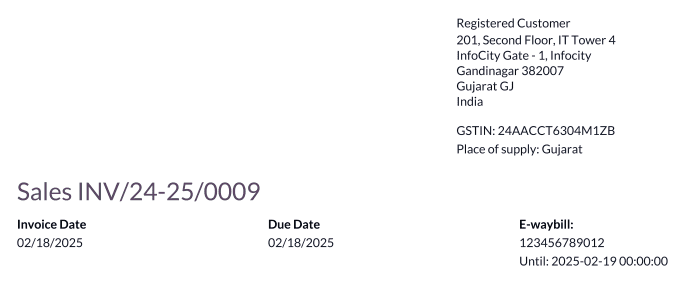
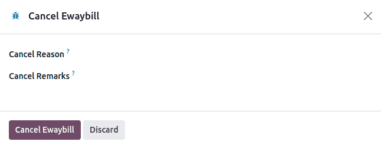

=====
India
=====

.. _india/installation:

Installation
============

:ref:`Install <general/install>` the following modules to get all the features of the Indian
localization:

.. list-table::
   :header-rows: 1

   * - Name
     - Technical name
     - Description
   * - :guilabel:`Indian - Accounting`
     - `l10n_in`
     - Default :ref:`fiscal localization package <fiscal_localizations/packages>`
   * - :guilabel:`Indian E-invoicing`
     - `l10n_in_edi`
     - :ref:`Indian e-invoicing integration <india/e-invoicing>`
   * - :guilabel:`Indian E-waybill`
     - `l10n_in_edi_ewaybill`
     - :ref:`Indian E-way bill integration <india/e-waybill>`
   * - :guilabel:`Indian - GSTR India eFiling`
     - `l10n_in_reports_gstr`
     - :ref:`Indian GST Return filing <india/gstr>`
   * - :guilabel:`Indian - Accounting Reports`
     - `l10n_in_reports`
     - :ref:`Indian tax reports <india/gstr_reports>`
   * - :guilabel:`Indian - Purchase Report(GST)`
     - `l10n_in_purchase`
     - Indian GST Purchase report
   * - :guilabel:`Indian - Sale Report(GST)`
     - `l10n_in_sale`
     - Indian GST Sale report
   * - :guilabel:`Indian - Stock Report(GST)`
     - `l10n_in_stock`
     - Indian GST Stock report

.. image:: india/india-modules.png
   :alt: Indian localization modules

.. _india/e-invoicing:

e-Invoice system
================

Odoo is compliant with the **Indian Goods and Services Tax (GST) e-Invoice system** requirements.

Setup
-----

.. _india/e-invoicing-api:

NIC e-Invoice registration
~~~~~~~~~~~~~~~~~~~~~~~~~~

You must register on the :abbr:`NIC (National Informatics Centre)` e-Invoice portal to get your
**API credentials**. You need these credentials to :ref:`configure your Odoo Accounting app
<india/e-invoicing-configuration>`.

#. Log in to the `NIC e-Invoice portal <https://einvoice1.gst.gov.in/>`_ by clicking
   :guilabel:`Login` and entering your :guilabel:`Username` and :guilabel:`Password`;

   .. note::
      If you are already registered on the NIC portal, you can use the same login credentials.

   .. image:: india/e-invoice-system-login.png
      :alt: Register Odoo ERP system on e-invoice web portal

#. From the dashboard, go to :menuselection:`API Registration --> User Credentials --> Create API
   User`;
#. After that, you should receive an :abbr:`OTP (one-time password)` code on your registered mobile
   number. Enter the OTP code and click :guilabel:`Verify OTP`;
#. Select :guilabel:`Through GSP` for the API interface, set :guilabel:`Tera Software Limited` as
   GSP, and type in a :guilabel:`Username` and :guilabel:`Password` for your API. Once it is done,
   click :guilabel:`Submit`.

   .. image:: india/submit-api-registration-details.png
      :alt: Submit API specific Username and Password

.. _india/e-invoicing-configuration:

Configuration in Odoo
~~~~~~~~~~~~~~~~~~~~~

To enable the e-Invoice service in Odoo, go to :menuselection:`Accounting --> Configuration -->
Settings --> Indian Electronic Invoicing`, and enter the :guilabel:`Username` and
:guilabel:`Password` previously set for the API.

.. image:: india/e-invoice-setup.png
   :alt: Setup e-invoice service

.. _india/e-invoicing-journals:

Journals
********

To automatically send e-Invoices to the NIC e-Invoice portal, you must first configure your *sales*
journal by going to :menuselection:`Accounting --> Configuration --> Journals`, opening your *sales*
journal, and in the :guilabel:`Advanced Settings` tab, under :guilabel:`Electronic Data
Interchange`, enable :guilabel:`E-Invoice (IN)` and save.

.. _india/e-invoicing-workflow:

Workflow
--------

.. _india/invoice-validation:

Invoice validation
~~~~~~~~~~~~~~~~~~

Once an invoice is validated, a confirmation message is displayed at the top. Odoo automatically
uploads the JSON-signed file of validated invoices to the NIC e-Invoice portal after some time. If
you want to process the invoice immediately, click :guilabel:`Process now`.

.. image:: india/e-invoice-process.png
   :alt: Indian e-invoicing confirmation message

.. note::
   - You can find the JSON-signed file in the attached files in the chatter.
   - You can check the document's :abbr:`EDI (electronic data interchange)` status under the
     :guilabel:`EDI Document` tab or the :guilabel:`Electronic invoicing` field of the invoice.

.. _india/invoice-pdf-report:

Invoice PDF report
~~~~~~~~~~~~~~~~~~

Once an invoice is validated and submitted, the invoice PDF report can be printed. The report
includes the :abbr:`IRN (Invoice Reference Number)`, :guilabel:`Ack. No` (acknowledgment number) and
:guilabel:`Ack. Date` (acknowledgment date), and QR code. These certify that the invoice is a valid
fiscal document.

.. image:: india/invoice-report.png
   :alt: IRN and QR code

.. _india/edi-cancellation:

e-Invoice cancellation
~~~~~~~~~~~~~~~~~~~~~~

If you want to cancel an e-Invoice, go to the :guilabel:`Other info` tab of the invoice and fill out
the :guilabel:`Cancel reason` and :guilabel:`Cancel remarks` fields. Then, click :guilabel:`Request
EDI cancellation`. The status of the :guilabel:`Electronic invoicing` field changes to :guilabel:`To
Cancel`.

.. important::
   Doing so cancels both the :ref:`e-Invoice <india/e-invoicing>` and the :ref:`E-Way bill
   <india/e-waybill>`.

.. image:: india/e-invoice-cancellation.png
   :alt: cancel reason and remarks

.. note::
   - If you want to abort the cancellation before processing the invoice, then click :guilabel:`Call
     Off EDI Cancellation`.
   - Once you request to cancel the e-Invoice, Odoo automatically submits the JSON-signed file to
     the NIC e-Invoice portal. You can click :guilabel:`Process now` if you want to process the
     invoice immediately.

.. _india/verify-e-invoice:

GST e-Invoice verification
~~~~~~~~~~~~~~~~~~~~~~~~~~

After submitting an e-Invoice, you can verify if the invoice is signed from the GST e-Invoice system
website itself.

#. Download the JSON file from the attached files. It can be found in the chatter of the related
   invoice;
#. Open the `NIC e-Invoice portal <https://einvoice1.gst.gov.in/>`_ and go to
   :menuselection:`Search --> Verify Signed Invoice`;
#. Select the JSON file and submit it;

   .. image:: india/verify-invoice.png
      :alt: select the JSON file for verify invoice

   If the file is signed, a confirmation message is displayed.

   .. image:: india/signed-invoice.png
      :alt: verified e-invoice

.. _india/e-waybill:

E-Way bill
==========

Setup
-----

Odoo is compliant with the **Indian Goods and Services Tax (GST) E-waybill system** requirements.

.. _india/e-waybill-api:

API registration on NIC E-Way bill
~~~~~~~~~~~~~~~~~~~~~~~~~~~~~~~~~~

You must register on the :abbr:`NIC (National Informatics Centre)` E-Way bill portal to create your
**API credentials**. You need these credentials to :ref:`configure your Odoo Accounting app
<india/e-waybill-configuration>`.

#. Log in to the `NIC E-Way bill portal <https://ewaybillgst.gov.in/>`_ by clicking
   :guilabel:`Login` and entering your :guilabel:`Username` and :guilabel:`Password`;
#. From your dashboard, go to :menuselection:`Registration --> For GSP`;
#. Click :guilabel:`Send OTP`. Once you have received the code on your registered mobile number,
   enter it and click :guilabel:`Verify OTP`;
#. Check if :guilabel:`Tera Software Limited` is already on the registered GSP/ERP list. If so, use
   the username and password used to log in to the NIC portal. Otherwise, follow the next steps;

   .. image:: india/e-waybill-gsp-list.png
      :alt: E-Way bill list of registered GSP/ERP

#. Select :guilabel:`Add/New`, select :guilabel:`Tera Software Limited` as your GSP Name, create a
   :guilabel:`Username` and a :guilabel:`Password` for your API, and click :guilabel:`Add`.

   .. image:: india/e-waybill-registration-details.png
      :alt: Submit GSP API registration details

.. _india/e-waybill-configuration:

Configuration in Odoo
~~~~~~~~~~~~~~~~~~~~~

To set up the E-Way bill service, go to :menuselection:`Accounting --> Configuration --> Settings
--> Indian Electronic WayBill --> Setup E-Way bill`, and enter your :guilabel:`Username` and
:guilabel:`Password`.

.. image:: india/e-waybill-configuration.png
   :alt: E-way bill setup odoo

.. _india/e-waybill-workflow:

Workflow
--------

.. _india/e-waybill-send:

Send an E-Way bill
~~~~~~~~~~~~~~~~~~

You can manually send an E-Way bill by clicking :guilabel:`Send E-Way bill`. To send the E-Way bill
automatically when an invoice or a bill is confirmed, enable :guilabel:`E-Way bill (IN)` in your
:ref:`Sales or Purchase journal <india/e-invoicing-journals>`.

.. image:: india/e-waybill-send-button.png
   :alt: Send E-waybill button on invoices

.. _india/invoice-validation-e-way:

Invoice validation
~~~~~~~~~~~~~~~~~~

Once an invoice has been issued and sent via :guilabel:`Send E-Way bill`, a confirmation message is
displayed.

.. image:: india/e-waybill-process.png
   :alt: Indian e-Way bill confirmation message

.. note::
   - You can find the JSON-signed file in the attached files in the chatter.
   - Odoo automatically uploads the JSON-signed file to the government portal after some time. Click
     :guilabel:`Process now` if you want to process the invoice immediately.

Invoice PDF report
~~~~~~~~~~~~~~~~~~

You can print the invoice PDF report once you have submitted the E-Way bill. The report includes the
**E-Way bill number** and the **E-Way bill validity date**.

.. _india/e-waybill-cancellation:

E-Way bill cancellation
~~~~~~~~~~~~~~~~~~~~~~~

If you want to cancel an E-Way bill, go to the :guilabel:`E-Way bill` tab of the related invoice and
fill out the :guilabel:`Cancel reason` and :guilabel:`Cancel remarks` fields. Then, click
:guilabel:`Request EDI Cancellation`.

.. important::
   Doing so cancels both the :ref:`e-Invoice <india/e-invoicing>` (if applicable) and the
   :ref:`E-Way bill <india/e-waybill>`.

.. note::
   - If you want to abort the cancellation before processing the invoice, click :guilabel:`Call Off
     EDI Cancellation`.
   - Once you request to cancel the E-Way bill, Odoo automatically submits the JSON-signed file to
     the government portal. You can click :guilabel:`Process Now` if you want to process the invoice
     immediately.

.. _india/gstr:

Indian GST Return filing
========================

.. _india/gstr_api:

Enable API access
-----------------

To file GST Returns in Odoo, you must first enable API access on the GST portal.

#. Log into the `GST portal <https://services.gst.gov.in/services/login>`_ by entering your
   :guilabel:`Username` and :guilabel:`Password`, and go to :guilabel:`My Profile` on your **profile
   menu**;

   .. image:: india/gst-portal-my-profile.png
      :alt: Click On the My Profile from profile

#. Select :guilabel:`Manage API Access`, and click :guilabel:`Yes` to enable API access;

   .. image:: india/gst-portal-api-yes.png
      :alt: Click Yes

#. Doing so enables a :guilabel:`Duration` drop-down menu. Select the :guilabel:`Duration` of your
   preference, and click :guilabel:`Confirm`.

.. _india/gstr_configuration:

Indian GST Service In Odoo
--------------------------

Once you have enabled the :ref:`API access <india/gstr_api>` on the GST portal, you can set up the
:guilabel:`Indian GST Service` in Odoo.

Go to :menuselection:`Accounting --> Configuration --> Settings --> Indian GST Service` and enter
the :guilabel:`GST Username`. Click :guilabel:`Send OTP`, enter the code, and finally,
:guilabel:`Validate`.

   .. image:: india/gst-setup.png
      :alt: Please enter your GST portal Username as Username

.. _india/gstr_workflow:

File-in GST Return
------------------

When the :guilabel:`Indian GST Service` is configured, you can file your GST return. Go to
:menuselection:`Accounting --> Reporting --> India --> GST Return periods` and create a new **GST
Return Period** if it does not exist. GST Return file-in is done in **three steps** in Odoo:

.. note::
   **Tax Return Periodicity** can be
   :doc:`configured <../accounting/reporting/tax_returns>` according to the user's
   needs.

.. _india/gstr-1:

Send GSTR-1
~~~~~~~~~~~

#. The user can verify the :ref:`GSTR-1 <india/gstr-1_report>` report before uploading it to the
   **GST portal** by clicking :guilabel:`GSTR-1 Report`;
#. If the **GSTR-1** report is correct, then click :guilabel:`Push to GSTN` to send it to the **GST
   portal**. The status of the :guilabel:`GSTR-1` report changes to :guilabel:`Sending`;

   .. image:: india/gst-gstr-1-sending.png
      :alt: GSTR-1 in the Sending Status

#. After a few seconds, the status of the **GSTR-1** report changes to :guilabel:`Waiting for
   Status`. It means that the **GSTR-1** report has been sent to the :guilabel:`GST Portal` and is
   being verified on the :guilabel:`GST Portal`;

   .. image:: india/gst-gstr-1-waiting.png
      :alt: GSTR-1 in the Waiting for Status

#. Once more, after a few seconds, the status either changes to :guilabel:`Sent` or :guilabel:`Error
   in Invoice`. The status :guilabel:`Error in Invoice` indicates that some of the invoices are not
   correctly filled out to be validated by the **GST portal**;

   - If the state of the **GSTR-1** is :guilabel:`Sent`, it means your **GSTR-1** report is ready to
     be filed on the **GST portal**.

     .. image:: india/gst-gstr-1-sent.png
        :alt: GSTR-1 Sent

   - If the state of the **GSTR-1** is :guilabel:`Error in Invoice`, invoices can be checked for
     errors in the :guilabel:`Log Note`. Once issues have been resolved, the user can click
     :guilabel:`Push to GSTN` to submit the file again on the **GST portal**.

     .. image:: india/gst-gstr-1-error.png
        :alt: GSTR-1 Error in Invoice

   .. image:: india/gst-gstr-1-error-log.png
      :alt: GSTR-1 Error in Invoice Log

#. Click :guilabel:`Mark as Filed` after filing the **GSTR-1** report on the **GST portal**. The
   status of the report changes to :guilabel:`Filed` in **Odoo**.

   .. image:: india/gst-gstr-1-filed.png
      :alt: GSTR-1 in the Filed Status

.. _india/gstr-2B:

Receive GSTR-2B
~~~~~~~~~~~~~~~

Users can retrieve the **GSTR-2B Report** from the **GST portal**. This automatically reconciles
the **GSTR-2B** report with your Odoo bills;

#. Click :guilabel:`Fetch GSTR-2B Summary` to retrieve the **GSTR-2B** summary. After a few seconds,
   the status of the report changes to :guilabel:`Waiting for Reception`. This means Odoo is trying
   to receive the **GSTR-2B** report from the **GST portal**;

   .. image:: india/gst-gstr-2b-waiting.png
      :alt: GSTR-2B in Waiting for Reception

#. Once more, after a few seconds, the status of the **GSTR-2B** changes to the :guilabel:`Being
   Processed`. It means Odoo is reconciling the **GSTR-2B** report with your Odoo bills;

   .. image:: india/gst-gstr-2b-processed.png
      :alt: GSTR-2B in Waiting for Reception

#. Once it is done, the status of the **GSTR-2B** report changes to either :guilabel:`Matched` or
   :guilabel:`Partially Matched`;

   - If the status is :guilabel:`Matched`:

      .. image:: india/gst-gstr-2b-matched.png
         :alt: GSTR-2B Matched

   - If the status is :guilabel:`Partially Matched`, you can make changes in bills by clicking
     :guilabel:`View Reconciled Bills`. Once it is done, click :guilabel:`re-match`.

      .. image:: india/gst-gstr-2b-partially.png
         :alt: GSTR-2B Partially Matched

      .. image:: india/gst-gstr-2b-reconcile.png
         :alt: GSTR-2B Reconciled Bills

.. _india/gstr-3:

GSTR-3 report
~~~~~~~~~~~~~

The :ref:`GSTR-3 <india/gstr-3_report>` report is a monthly summary of **sales** and **purchases**.
This return is auto-generated by extracting information from **GSTR-1** and **GSTR-2**.

#. Users can compare the **GSTR-3** report with the **GSTR-3** report available on the
   **GST portal** to verify if they match by clicking :guilabel:`GSTR-3 Report`;

#. Once the **GSTR-3** report has been verified by the user and the tax amount on the **GST portal**
   has been paid. Once paid, the report can be **closed** by clicking :guilabel:`Closing Entry`;

   .. image:: india/gst-gstr-3.png
      :alt: GSTR-3

#. In :guilabel:`Closing Entry`, add the tax amount paid on the **GST portal** using challan, and
   click :guilabel:`POST` to post the :guilabel:`Closing Entry`;

   .. image:: india/gst-gstr-3-post.png
      :alt: GSTR-3 Post Entry

#. Once posted, the **GSTR-3** report status changes to :guilabel:`Filed`.

   .. image:: india/gst-gstr-3-filed.png
      :alt: GSTR-3 Filed

.. _india/gstr_reports:

Tax reports
===========

.. _india/gstr-1_report:

GSTR-1 report
-------------

The :guilabel:`GSTR-1` report is divided into sections. It displays the :guilabel:`Base` amount,
:abbr:`CGST (Central Goods and Services Tax)`, :abbr:`SGST (State Goods and Service Tax)`,
:abbr:`IGST (Integrated Goods and Services Tax)`, and :guilabel:`CESS` for each section.

   .. image:: india/gst-gstr-1-sale-report.png
      :alt: GSTR-1 Report

.. _india/gstr-3_report:

GSTR-3 report
-------------

The :guilabel:`GSTR-3` report contains different sections:

- Details of inward and outward supply subject to a **reverse charge**;
- Eligible :abbr:`ITC (Income Tax Credit)`;
- Values of **exempt**, **Nil-rated**, and **non-GST** inward supply;
- Details of inter-state supplies made to **unregistered** persons.

   .. image:: india/gst-gstr-3-report.png
      :alt: GSTR-3 Report
