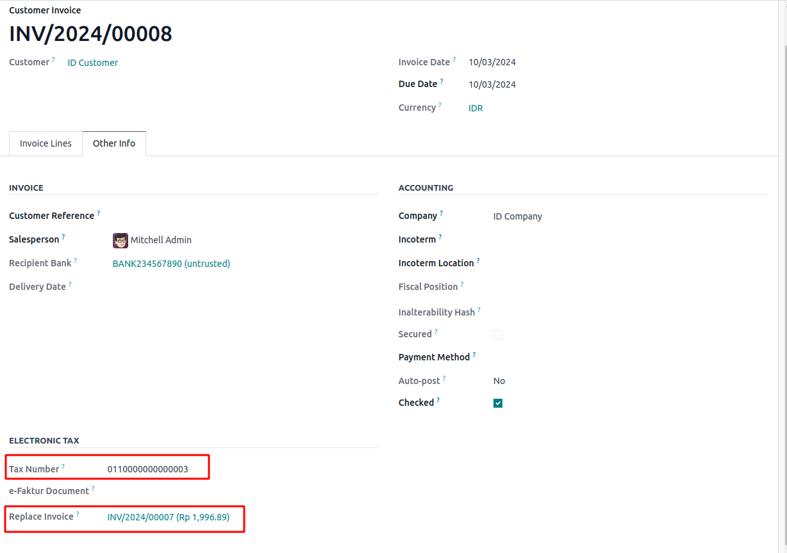
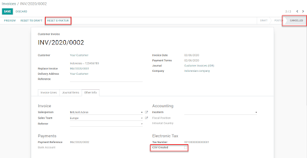
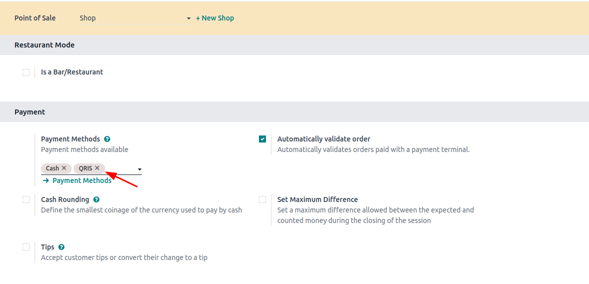
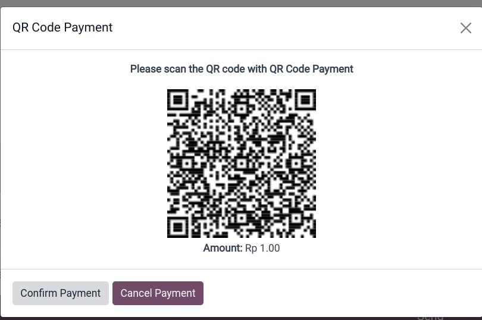

=========
Indonesia
=========

.. _localization_indonesia/e-faktur:

E-Faktur Module
===============

The **E-Faktur Module** is installed by default with the Indonesian localization module. It allows
one to generate a CSV file for one or batch of tax invoices which will be uploaded to
**Tax Office e-Faktur** application.

.. _localization_indonesia/npwp_nik:

NPWP/NIK settings
-----------------

- | **Your Company**
  | This information is used in the FAPR line in the effect file format. You need to set a NPWP
    number on the related partner of your Odoo company. If you don't, it won't be possible to create
    an e-Faktur from an invoice.
- | **Your Clients**
  | You need to set the checkbox *Is PKP* to generate e-fakturs for a customer. You can use the NPWP
    field on the customer's contact to set the NPWP needed to generate the e-Faktur file. If your
    customer does not have an NPWP, just enter the NIK in the same field.

  .. image:: indonesia/indonesia-partner-nik.png
     :align: center

.. _localization_indonesia/e-faktur_usage:

Usage
-----

.. _localization_indonesia/tax_invoice_sn:

Generate Tax Invoice Serial Number
~~~~~~~~~~~~~~~~~~~~~~~~~~~~~~~~~~

#. Go to :menuselection:`Accounting --> Configuration --> Settings --> Indonesian Localization` and
   click on :guilabel:`Configure Your e-Faktur Ranges`. In order to export customer invoices as
   e-Faktur for the Indonesian government, you need to put the ranges of numbers you were assigned
   by the government. When you validate an invoice, a number will be assigned based on these ranges.
   Afterwards, you can download the csv file by going on the invoices list, selecting them, and then
   click :menuselection:`Action --> Download e-Faktur`
#. After receiving new serial numbers from the Indonesian Revenue Department, you can create a set
   of tax invoice serial numbers group through this list view. You only have to specify the Min and
   Max of each serial numbers' group and Odoo will format the number automatically to a 13-digits
   number, as requested by the Indonesia Tax Revenue Department.
#. There is a counter to inform you how many avaialable numbers are left in that group.

   .. image:: indonesia/indonesia-sn-count.png
      :align: center

.. _localization_indonesia/csv:

Generate E-faktur CSV For a Single Invoice or a Batch of Invoices
~~~~~~~~~~~~~~~~~~~~~~~~~~~~~~~~~~~~~~~~~~~~~~~~~~~~~~~~~~~~~~~~~

#. Create an invoice from :menuselection:`Accounting --> Customers --> Invoices`. If the invoice
   customer's country is Indonesia and the customer's *Is PKP* is checked, Odoo will allow you to
   create an e-Faktur.
#. Set Tax Transaction Code for the Invoice. There are constraints related to the Kode transaksi and
   the type of VAT applied to invoice lines.

   .. image:: indonesia/indonesia-kode-transaksi.png
      :align: center

#. If you have setup multiple e-Faktur ranges as such

    .. image:: indonesia/indonesia-multiple-range.png

   You will have the option to choose from all available e-Faktur ranges on the invoice.

    .. image:: indonesia/indonesia-invoice-choose-range.png

    If there is only one range, Odoo will automatically select it to be used when generating tax
    number for the invoice.

#. Odoo will automatically pick the next available serial number from the e-Faktur number table (see
   the :ref:`section above <localization_indonesia/tax_invoice_sn>`) and generate the e-faktur
   number as a concatenation of Kode Transaksi and serial number. You can see this from the invoice
   form view under the page *Other Info* in the box *Electronic Tax*.

   .. image:: indonesia/indonesia-e-faktur-sn.png
      :align: center

#. Once the invoice is posted, you can generate and download the e-Faktur from the *Action* menu
   item *Download e-faktur*. An e-Faktur document will be linked to the invoice so you can keep
   downloading the same document without further processing.

   .. image:: indonesia/indonesia-csv-created.png
      :align: center

#. You can also select multiple invoices in list view and generate a batch e-Faktur .csv.

.. _localization_indonesia/kode_transaksi_fp:

Kode Transaksi FP (Transaction Code)
~~~~~~~~~~~~~~~~~~~~~~~~~~~~~~~~~~~~

The following codes are available when generating e-Faktur:

* 01 Kepada Pihak yang Bukan Pemungut PPN (Customer Biasa)
* 02 Kepada Pemungut Bendaharawan (Dinas Kepemerintahan)
* 03 Kepada Pemungut Selain Bendaharawan (BUMN)
* 04 DPP Nilai Lain (PPN 1%)
* 06 Penyerahan Lainnya (Turis Asing)
* 07 Penyerahan yang PPN-nya Tidak Dipungut (Kawasan Ekonomi Khusus/ Batam)
* 08 Penyerahan yang PPN-nya Dibebaskan (Impor Barang Tertentu)
* 09 Penyerahan Aktiva (Pasal 16D UU PPN)

.. _localization_indonesia/replace_invoice:

Correct an invoice that has been posted and downloaded: Replace Invoice feature
~~~~~~~~~~~~~~~~~~~~~~~~~~~~~~~~~~~~~~~~~~~~~~~~~~~~~~~~~~~~~~~~~~~~~~~~~~~~~~~

Suppose you have downloaded the e-Faktur and submitted it to the tax office. However, later you
found out that there is an incorrect detail from that invoice (e.g. wrong unit price, quantity,
customer detail). You would next have to submit a correction and this is achievable through
our Replace Invoice feature.

#. Create a credit note from the invoice where you want to correct.
#. Enter the reason and then click on "Reverse and Create Invoice"
#. A new invoice should be created and the Replace Invoice field should be filled in with the
   invoice you just reversed.
#. Make the correction to the invoice, then confirm it. It will generate a new tax number
   that uses the tax number of previous invoice.

.. _localization_indonesia/reset_e-faktur:

Correct an invoice that has been posted but not downloaded yet: Reset e-Faktur
~~~~~~~~~~~~~~~~~~~~~~~~~~~~~~~~~~~~~~~~~~~~~~~~~~~~~~~~~~~~~~~~~~~~~~~~~~~~~~

If you have posted an invoice, downloaded the e-Faktur for it, found a mistake on the invoice but
you haven't submitted it to the tax office, then you don't need to do a replacement invoice. Insetad
you can use reset e-Faktur feature.

#. Reset the invoice to draft and cancel it.
#. Click on the button *Reset e-Faktur* on the invoice form view.
#. The serial number will be unassigned, and we will be able to reset the invoice to draft, edit it
   and re-assign a new serial number.

.. _localization_indonesia/qris-qr:

QRIS
====

`QRIS <https://qris.online/homepage/>`_ is a digital payment system that allows customers to make
payments by scanning the QR code from their preferred e-wallet.

.. important::
    According to the `QRIS API documentation <https://qris.online/api-doc/create-invoice.php>`_,
    QRIS expires after 30 minutes. Due to this restriction, the QR code is not included in reports
    sent to customers and is only available on the customer portal.

Activate QR codes
-----------------

Go to :menuselection:`Accounting --> Configuration --> Settings`. Under the :guilabel:`Customer
Payments` section, activate the :guilabel:`QR Codes` feature.

QRIS bank account configuration
-------------------------------

Go to :menuselection:`Contacts --> Configuration --> Bank Accounts` and select the bank account for
which you want to activate QRIS. Set the :guilabel:`QRIS API Key` and :guilabel:`QRIS Merchant ID`
based on the information provided by QRIS.

.. important::
   The account holder's country must be set to `Indonesia` on its contact form.

.. image:: indonesia/qris-setup.png
   :alt: QRIS bank account configuration

.. seealso::
   :doc:`../accounting/bank`

Bank journal configuration
--------------------------

Go to :menuselection:`Accounting --> Configuration --> Journals`, open the bank journal, then fill
out the :guilabel:`Account Number` and :guilabel:`Bank` under the :guilabel:`Journal Entries` tab.

.. image:: indonesia/journal-bank-config.png
    :alt: Bank journal configuration

Issue invoices with QRIS QR codes
---------------------------------

When creating a new invoice, open the :guilabel:`Other Info` tab and set the :guilabel:`Payment
QR-code` option to `QRIS`.

.. image:: indonesia/invoice-qris.png
   :alt: Select QRIS QR-code option

Ensure that the :guilabel:`Recipient Bank` is the one you configured, as Odoo uses this field to
generate the QRIS QR code.

POS payment method configurations
---------------------------------

If you installed Point Of Sale, you can also add a new payment method for PoS via QRIS.
Go to :menuselection:`Point of Sale --> Configuration --> Paymen Methods`, create a new payment
method.

.. image:: indonesia/indonesia-qris-payment-method.png
    :alt: QRIS Payment Method configuration

Afterwards, add this payment method the PoS configurations that allow the payment.

Issue QRIS on Point of sale
---------------------------

On the payment page of Point of Sale, choose the QRIS payment method you have configured. Choose
the amount you want to pay and click on the Send button.

Then, a popup containing a QR code should appear. Once customer has scanned and paid it, you can
click on Confirm Payment to complete the payment.

