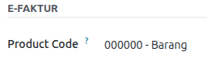
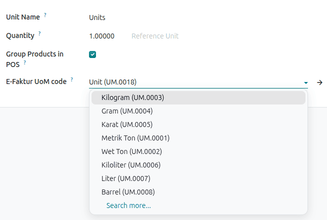
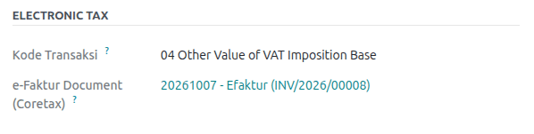
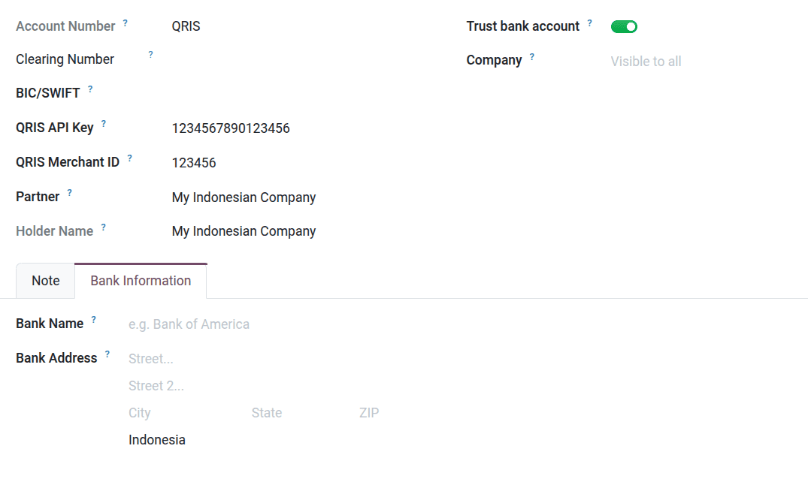
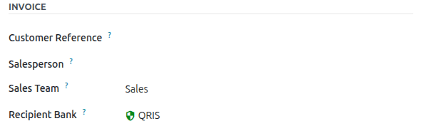

=========
Indonesia
=========

.. _localizations/indonesia/modules:

Modules
=======

The following modules are installed automatically with the Indonesian localization:

.. list-table::
   :widths: 25 25 50
   :header-rows: 1

   * - Name
     - Technical name
     - Description
   * - :guilabel:`Indonesian - Accounting`
     - `l10n_id`
     - This module includes the default fiscal localization package.
   * - :guilabel:`Indonesia E-faktur (Coretax)`
     - `l10n_id_efaktur_coretax`
     - This module facilitates the generation of XML files for the Coretax system.

.. _localizations/indonesia/overview:

Localization overview
=====================

The Indonesian localization package ensures compliance with Indonesian fiscal and accounting
regulations. It provides tools for managing taxes, fiscal positions, and a predefined chart of
accounts tailored to Indonesian standards.

- :doc:`../accounting/get_started/chart_of_accounts`: predefined structure tailored to Indonesian
  accounting standards
- :ref:`localizations/indonesia/taxes`: pre-configured tax rates, including value-added tax (PPN)
  and luxury goods sales tax (PPnBM)
- :doc:`../accounting/taxes/fiscal_positions`: automated tax and account mapping based on partner
  registration status

.. _localizations/indonesia/configuration:

Configuration
=============

.. _localizations/indonesia/configuration-company:

Company
-------

To configure the company information, open the :doc:`../../essentials/contacts` app, search for your company, and open
its contact form (or go to :menuselection:`Settings --> Companies` and click :ref:`Update Info
<general/companies/company>`).

Configure the following fields:

- :guilabel:`Name` and :guilabel:`Address`: enter the street name and number in the
  :guilabel:`Street` field, the neighborhood in the :guilabel:`Street 2` field, and the :guilabel:`city`, :guilabel:`state`,
  :guilabel:`ZIP code`, and :guilabel:`country`.
- :guilabel:`NPWP/NIK`: *Nomor Pokok Wajib Pajak* or *Nomor Induk Kependudukan*. The first
  digit indicates the entity type: `0` for companies, `1` to `9` for individuals.
- :guilabel:`TKU`: *Tempat Kegiatan Usaha* code.
- :guilabel:`Document Type`: go to the :guilabel:`Accounting` tab, and under the
  :guilabel:`Coretax Information` section, select the appropriate document type: NPWP (TIN),
  national ID (NIK), passport, or other documents.

.. example::
   Here is an example of a completed company contact form 

   .. image:: indonesia/efaktur-contact.png 
      :alt: Indonesian company information settings.

.. _localizations/indonesia/configuration-products:

Products
--------

#. Go to :menuselection:`Accounting --> Customers --> Products` and open the desired product form.
#. Go to the :guilabel:`Accounting` tab, under the :guilabel:`E-Faktur` section.
#. Select a code in the :guilabel:`Product Code` field. By default, the code is set to
   :guilabel:`000000 - Barang`.

.. note::
   E-Faktur product codes are pre-generated by Odoo and cannot be edited. Select a code from the
   available options.

.. _localizations/indonesia/configuration-uom-code:

E-Faktur UoM code
~~~~~~~~~~~~~~~~~

.. important::
   Go to :menuselection:`Inventory --> Configuration --> Settings` and make sure the
   :guilabel:`Units of Measure & Packagings` option is enabled.

To configure the :guilabel:`E-Faktur UoM code`, go to :menuselection:`Inventory --> Configuration
--> Units & Packagings`. Open the desired unit of measure, and select the appropriate
:guilabel:`E-Faktur UoM code` from the options.

.. _localizations/indonesia/taxes:

Taxes
=====

.. _localizations/indonesia/taxes-ppn:

PPN
---

**PPN** (*Pajak Pertambahan Nilai*) is Indonesia's value-added tax (VAT), charged on the sale of
most goods and services at every stage of production and distribution. Default taxes are created
automatically when the :guilabel:`Indonesian - Accounting` (`l10n_id`) module is installed.

The standard VAT rate in Indonesia is 12%. However, some goods and services use the *Other Value Tax
Base* (*DPP Nilai Lain*) to determine the VAT. A DPP Nilai Lain of 11/12 is applied to non-luxury
goods and services, and other rates apply to specific categories of goods and services. A zero
percent rate is applied to basic commodities, such as rice and clean tap water.

.. _localizations/indonesia/taxes-ppnbm:

PPnBM
-----

**PPnBM** (*Pajak Penjualan atas Barang Mewah*), or sales tax on luxury goods (STLG), is imposed on
the import or delivery of certain taxable goods (*Barang Kena Pajak*, or BKP) classified as luxury.

.. _localizations/indonesia/taxes-pemungut-ppn:

Pemungut PPN
------------

A **VAT collector** (*Pemungut PPN*, or *WAPU*) is a government-designated entity that is authorized to withhold VAT on
transactions and remit it directly to the Indonesian state treasury, rather than paying it to the
seller.

The :guilabel:`Pemungut PPN` tax is not recorded in the journal items, but the tax amount is still
visible to customers on the invoice report.

The following categories of taxes are installed:

- Sales and purchase: 12% (non-luxury goods) and 12%
- Luxury goods: 20%
- Exempt, zero-rated, and export: 0%
- Pemungut PPN: 12% Pemungut (non-luxury goods) and 12% Pemungut

.. note::
   It is recommended to use the standard taxes instead of creating new ones, as the taxes are used
   in e-Faktur. If a new tax is required, make sure to map it to an existing **tax group**.

.. _localizations/indonesia/coretax:

Coretax
=======

`Coretax <https://coretaxdjp.pajak.go.id/>`_ is Indonesia's all-in-one tax platform that unifies
separate systems, such as e-Faktur and e-Bupot, into a single portal. Taxes can be reported to
Coretax using an XML file generated from Odoo.

.. _localizations/indonesia/contact:

Contacts
--------
To generate Indonesian electronic tax documents, first configure the partner data. Go to the partner's
contact form and fill in the following Indonesian-specific fields:

- :guilabel:`NPWP/NIK`: Enter the partner's Tax Identification Number.
- :guilabel:`TKU`: Enter the partner's *Tempat Kegiatan Usaha* code.
- :guilabel:`Country`: Set the partner's country.

.. _localizations/indonesia/e-faktur-xml:

Generate an e-Faktur XML
------------------------

To generate an e-Faktur XML file:

#. Go to :menuselection:`Accounting --> Customers --> Invoices` and :ref:`create an invoice
   <accounting/invoice/creation>`.
#. In the :guilabel:`Accounting` tab, under the :guilabel:`Coretax Information` section, select a
   :guilabel:`Transaction Code`.
#. After confirming the invoice, click the :icon:`fa-cog` :guilabel:`(Actions)` icon and select
   :guilabel:`Download e-faktur`.

The downloaded XML file can then be uploaded to Coretax. After the file is generated, the
:guilabel:`e-Faktur Document (Coretax)` field in the :guilabel:`Electronic Tax` section of the
invoice is populated automatically.

.. tip::
   To create a batch XML file for several invoices, select them in the invoice list view, and click
   :icon:`fa-cog` :guilabel:`(Actions)`, then :guilabel:`Download e-faktur`.

.. important::
   - The tax invoice number (*Nomor Seri Faktur Pajak*, or NSFP) is generated by Coretax, not by
     Odoo.
   - Once an e-Faktur XML file has been downloaded, it cannot be changed. Any subsequent download
     retrieves the original file.

.. _localizations/indonesia/e-faktur-global-discount:

Global discount
~~~~~~~~~~~~~~~

A global discount is a single percentage or fixed-amount reduction applied to the total amount of an
entire order. In e-Faktur, there is no field to store the global discount amount, and a product with
a negative amount cannot be used either. To handle such cases, Odoo distributes the global discount
amount across each product.

.. example::
   Create the invoice using a product with a negative amount as the global discount. The XML file
   detects the discount automatically and evenly distributes the discount amount across each
   product.

   .. image:: indonesia/efaktur-global-discount.png
      :alt: Invoice with a negative-amount product line used as a global discount.

.. _localizations/indonesia/qris:

QRIS QR code on invoices
========================

`QRIS <https://qris.online/homepage/>`_ is a digital payment system that allows customers to make
payments by scanning a QR code with their preferred e-wallet.

.. important::
   According to the `QRIS API documentation <https://qris.online/api-doc/#create-invoice>`_, a
   QRIS code expires after 30 minutes. Due to this restriction, the QR code is not included in
   reports sent to customers and is only available on the customer portal.

.. _localizations/indonesia/qris-activate-qr-code:

Activate QR codes
-----------------

Go to :menuselection:`Accounting --> Configuration --> Settings`. Under the :guilabel:`Customer
Payments` section, enable the :guilabel:`QRIS Code` feature.

.. _localizations/indonesia/qris-bank-account-config:

QRIS bank account configuration
-------------------------------

Go to :menuselection:`Accounting --> Configuration --> Journals` and open the desired bank journal.
Create a :guilabel:`Bank Account Number`, and set the :guilabel:`QRIS API Key` and :guilabel:`QRIS
Merchant ID` based on the information provided by QRIS. 

.. note::
   To get a :guilabel:`QRIS API` key and :guilabel:`merchant ID`, register through `this link <https://www.odoo.com/survey/start/3e20dc36-e4e5-4101-aeca-fd37bb3eaa54>`_.

.. important::
   The country of the account holder must be set to Indonesia on its contact form.

.. _localizations/indonesia/qris-invoices:

Issue invoices with QRIS QR codes
---------------------------------

When creating a new invoice, navigate to the :guilabel:`Other Info` tab. Under the :guilabel:`Invoice`
section, select the previously-configured :guilabel:`Recipient Bank`. Odoo uses this account to generate
the QRIS code, which displays on the customer portal.

