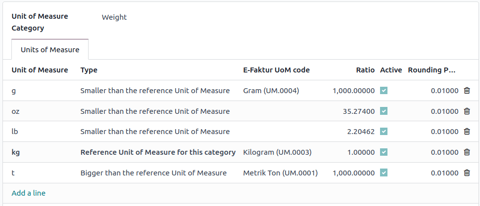

=========
Indonesia
=========

.. _localizations/indonesia/modules:

Modules
=======

The following modules related to the Indonesia localization are available:

.. list-table::
   :widths: 25 25 50
   :header-rows: 1

   * - Name
     - Technical name
     - Description
   * - :guilabel:`Indonesian - Accounting`
     - `l10n_id`
     - This module includes the default fiscal localization package.
   * - :guilabel:`Indonesia E-faktur`
     - `l10n_id_efaktur`
     - This module includes the features required to export invoices as e-Faktur.
   * - :guilabel:`Indonesia E-faktur (Coretax)`
     - `l10n_id_efaktur_coretax`
     - This module facilitates the generation of XML files for the Coretax system.

.. _localizations/indonesia/configuration:

Configuration
=============

Company
-------

Open the :guilabel:`Settings` app, go to the :guilabel:`Companies` section, and click
:guilabel:`Update Info`.
Ensure the :guilabel:`NPWP` field contains the **Tax Identification Number**, as an e-Faktur cannot
be generated from an invoice otherwise.

Contacts
--------

To configure a partner for e-Faktur, go to their :guilabel:`contact` form and fill in the following
fields:

* :guilabel:`Is PKP`: Check this box to allow e-Faktur generation for the partner.
* :guilabel:`NPWP`: Enter the partner's Tax Identification Number.
* :guilabel:`NIK`: If the partner does not have an :guilabel:`NPWP`, enter the :guilabel:`NIK` in
  the :guilabel:`Accounting` tab under :guilabel:`Indonesian taxes`.

Products
--------

To set a product's E-Faktur product code, navigate to the :guilabel:`product` form. In the
:guilabel:`General Information` tab, choose a code from the :guilabel:`E-Faktur Product code`
dropdown menu. By default, the code is set to :guilabel:`000000 - Barang`.

.. note::
   E-Faktur product codes are pre-generated by Odoo and cannot be edited. Select a code from the
   available options.

E-Faktur UoM Code
~~~~~~~~~~~~~~~~~

To configure the E-Faktur UoM code, go to :menuselection:`Inventory --> Configuration --> Units of
Measure --> Units of Measure Categories`. Open a category and select the appropriate
:guilabel:`E-Faktur UoM Code` from the options.

.. _localizations/indonesia/workflow:

Workflow
========

Generate an E-Faktur XML
------------------------

An e-Faktur can be created for an invoice if the customer's country is Indonesia and the
:guilabel:`Is PKP` checkbox is enabled on their :guilabel:`contact` form.

To generate an e-Faktur XML:

#. Go to :menuselection:`Accounting --> Customers --> Invoices` and create an invoice.
#. In the :guilabel:`Other Info` tab, under the :guilabel:`Electronic Tax` section, select a
   :guilabel:`Kode Transaksi`.

   .. image:: indonesia/efaktur_invoice_draft.png
      :alt: Draft invoice showing the Kode Transaksi field.

   .. note::
      The :guilabel:`Kode Transaksi` codes are pre-generated by Odoo and cannot be edited. A
      selection can be made from the available options.

#. After confirming the invoice, click the :icon:`fa-cog` :guilabel:`(Actions)` icon and select
   :guilabel:`Download e-faktur`.

The downloaded XML file can be uploaded to the Coretax system. After the file is generated, the
:guilabel:`e-Faktur Document` field on the invoice is populated automatically.

   .. image:: indonesia/faktur_invoice_confirmed.png
      :alt: Invoice with E-Faktur Document.

   .. note::
      To create a batch XML file for several invoices, select them in the list view and choose
      :guilabel:`Download e-faktur` from the :guilabel:`Actions` menu.

.. important::
   - The tax invoice number is generated by the Coretax system, not by Odoo.
   - Once an e-Faktur XML file has been downloaded, it cannot be changed. Any subsequent download
     will retrieve the original file.

QRIS QR code on invoices
========================

`QRIS <https://qris.online/homepage/>`_ is a digital payment system that allows customers to make
payments by scanning the QR code from their preferred e-wallet.

.. important::
    According to the `QRIS API documentation <https://qris.online/api-doc/create-invoice.php>`_,
    QRIS expires after 30 minutes. Due to this restriction, the QR code is not included in reports
    sent to customers and is only available on the customer portal.

Activate QR codes
-----------------

Go to :menuselection:`Accounting --> Configuration --> Settings`. Under the :guilabel:`Customer
Payments` section, activate the :guilabel:`QR Codes` feature.

QRIS bank account configuration
-------------------------------

Go to :menuselection:`Contacts --> Configuration --> Bank Accounts` and select the bank account for
which you want to activate QRIS. Set the :guilabel:`QRIS API Key` and :guilabel:`QRIS Merchant ID`
based on the information provided by QRIS.

.. important::
   The account holder's country must be set to `Indonesia` on its contact form.

.. image:: indonesia/qris-setup.png
   :alt: QRIS bank account configuration

.. seealso::
   :doc:`../accounting/bank`

Bank journal configuration
--------------------------

Go to :menuselection:`Accounting --> Configuration --> Journals`, open the bank journal, then fill
out the :guilabel:`Account Number` and :guilabel:`Bank` under the :guilabel:`Journal Entries` tab.

Issue invoices with QRIS QR codes
---------------------------------

When creating a new invoice, open the :guilabel:`Other Info` tab and set the :guilabel:`Payment
QR-code` option to :guilabel:`QRIS`.

.. image:: indonesia/invoice-qris.png
   :alt: Select QRIS QR-code option

Ensure that the :guilabel:`Recipient Bank` is the one you configured, as Odoo uses this field to
generate the QRIS QR code.
