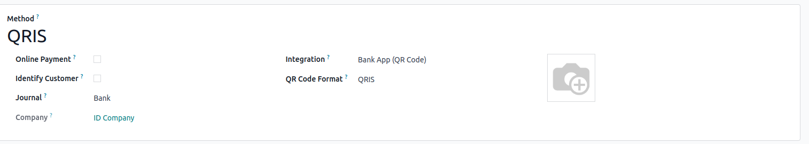

=========
Indonesia
=========

.. _localization_indonesia/e-faktur:

E-Faktur Module
===============

The **E-Faktur Module** is installed by default with the Indonesian localization module. It allows
one to generate a CSV file for one tax invoice or for a batch of tax invoices to upload to the
**Tax Office e-Faktur** application.

.. _localization_indonesia/npwp_nik:

NPWP/NIK settings
-----------------

- | **Your Company**
  | This information is used in the FAPR line in the e-Faktur. You need to set a NPWP
    number on the related partner of your Odoo company. If you don't, it won't be possible to create
    an e-Faktur from an invoice.
- | **Your Clients**
  | To generate e-Faktur for a customer, first set the :guilabel:`Is PKP` checkbox on the customer's
    contact record, then enter the customer's NPWP in the :guilabel:`NPWP` field. If the customer
    does not have an NPWP, enter the NIK in the same field.

.. _localization_indonesia/tax_invoice_sn:

Configure e-Faktur ranges
-------------------------
An e-Faktur range is range of serial numbers for tax invoices provided by the Indonesian Tax
Revenue Department. When an invoice is validated, the next available number in the specified range
is automatically assigned to that inovice. Afterwards, the e-Faktur CSV can be downloaded for that
particular invoice.

- Go to :menuselection:`Accounting --> Configuration --> Settings --> Indonesian Localization` and
  click on :guilabel:`Configure Your e-Faktur Ranges`.
- After receiving serial numbers from the Indonesian Revenue Department, you can create a set
  of tax invoice serial numbers group through this list view. You only have to specify the Min and
  Max of each serial numbers' group and Odoo will format the number automatically to 13-digits
  number, as requested by the Indonesia Tax Revenue Department.

   .. image:: indonesia/indonesia-sn-count.png
      :align: center

   .. note::
      For every e-Faktur range, there is a counter to check how many available numbers are left in
      that range

.. _localization_indonesia/e-faktur_usage:

Usage
-----

.. _localization_indonesia/csv:

Generate an e-faktur CSV for a single invoice or a batch of invoices
~~~~~~~~~~~~~~~~~~~~~~~~~~~~~~~~~~~~~~~~~~~~~~~~~~~~~~~~~~~~~~~~~~~~

#. Create an invoice from :menuselection:`Accounting --> Customers --> Invoices`. If the invoice
   customer's country is Indonesia and the customer's *Is PKP* is checked, Odoo will allow you to
   create an e-Faktur.
#. Set Tax Transaction Code for the invoice. There are constraints related to the Kode transaksi and
   the type of VAT applied to invoice lines.

   .. image:: indonesia/indonesia-kode-transaksi.png
      :align: center

#. If there are multiple e-Faktur ranges configured, the option to choose from available e-Faktur
   ranges will appear on invoice form

    .. image:: indonesia/indonesia-invoice-choose-range.png
       :align: center
       :alt: Choose from multiple e-faktur range

    If there is only one range, Odoo will automatically select it to be used when generating tax
    number for the invoice.

#. Odoo will automatically pick the next available serial number from selected
   :ref:`e-Faktur range <localization_indonesia/tax_invoice_sn>` and generate the e-faktur
   number as a concatenation of Kode Transaksi and serial number. These information should be
   reflected on the *Other Info* page under the *Electronic Tax* box.

   .. image:: indonesia/indonesia-e-faktur-sn.png
      :align: center

#. Once the invoice is posted, generate and download the e-Faktur from the :guilabel:`Action` menu
   item *Download e-faktur*. An e-Faktur document will be linked to the invoice and all subsequent
   downloads will refer to the same document without further processing.

   .. image:: indonesia/indonesia-csv-created.png
      :align: center

#. Generating batch e-Faktur csv can be done by selecting multiple invoices in list view and run
   *Downlaod e-Fatkur* under the action menu.

.. _localization_indonesia/kode_transaksi_fp:

Kode Transaksi FP (Transaction Code)
~~~~~~~~~~~~~~~~~~~~~~~~~~~~~~~~~~~~

The following codes are available when generating e-Faktur:

* 01 Kepada Pihak yang Bukan Pemungut PPN (Customer Biasa)
* 02 Kepada Pemungut Bendaharawan (Dinas Kepemerintahan)
* 03 Kepada Pemungut Selain Bendaharawan (BUMN)
* 04 DPP Nilai Lain (PPN 1%)
* 06 Penyerahan Lainnya (Turis Asing)
* 07 Penyerahan yang PPN-nya Tidak Dipungut (Kawasan Ekonomi Khusus/ Batam)
* 08 Penyerahan yang PPN-nya Dibebaskan (Impor Barang Tertentu)
* 09 Penyerahan Aktiva (Pasal 16D UU PPN)

.. _localization_indonesia/replace_invoice:

Correct an invoice that has been posted and downloaded: Replace Invoice feature
~~~~~~~~~~~~~~~~~~~~~~~~~~~~~~~~~~~~~~~~~~~~~~~~~~~~~~~~~~~~~~~~~~~~~~~~~~~~~~~

Suppose you have downloaded the e-Faktur and submitted it to the tax office. However, later you
found out that there is an incorrect detail from that invoice (e.g. wrong unit price, quantity,
customer detail). To fix this, create a correction invoice using the **Replace Invoice** feature:

#. Create a credit note from the invoice to be corrected.
#. Enter the reason and then click on :guilabel:`Reverse and Create Invoice`
#. A new invoice should be created and the Replace Invoice field should be filled in with the
   invoice that is just reversed.
#. Make the correction to the invoice, then confirm it. It will generate a new tax number
   that uses the tax number of previous invoice.

.. image:: indonesia/indonesia-replace-invoice.png
   :align: center

.. _localization_indonesia/reset_e-faktur:

Correct an invoice that has been posted but not downloaded yet: Reset e-Faktur
~~~~~~~~~~~~~~~~~~~~~~~~~~~~~~~~~~~~~~~~~~~~~~~~~~~~~~~~~~~~~~~~~~~~~~~~~~~~~~

If you have posted an invoice, downloaded the e-Faktur for it, found a mistake on the invoice but
you haven't submitted it to the tax office, then you don't need to do a replacement invoice. Insetad
you can use reset e-Faktur feature.

#. Reset the invoice to draft and cancel it.
#. Click on the button *Reset e-Faktur* on the invoice form view.
#. The serial number will be unassigned. Reset the invoice to draft, edit it and re-confirm to set
   a new serial number.

.. _localization_indonesia/qris-qr:

QRIS
====

`QRIS <https://qris.online/homepage/>`_ is a digital payment system that allows customers to make
payments by scanning the QR code from their preferred e-wallet. You can sign up for a merchant
account on the following `link <https://registrasi.qris.interactive.co.id/v2/m/register/
now.php?idir=pages/registration.php&pgv=new-merchant&step=1>`.

.. important::
    According to the `QRIS API documentation <https://qris.online/api-doc/create-invoice.php>`_,
    QRIS expires after 30 minutes. Due to this restriction, the QR code is not included in reports
    sent to customers and is only available on the customer portal.

Activate QR codes
-----------------

Go to :menuselection:`Accounting --> Configuration --> Settings`. Under the :guilabel:`Customer
Payments` section, activate the :guilabel:`QR Codes` feature.

QRIS bank account configuration
-------------------------------

Go to :menuselection:`Contacts --> Configuration --> Bank Accounts` and select the bank account for
which you want to activate QRIS. Set the :guilabel:`QRIS API Key` and :guilabel:`QRIS Merchant ID`
based on the information provided by QRIS.

.. important::
   The account holder's country must be set to `Indonesia` on its contact form.

.. seealso::
   :doc:`../accounting/bank`

Bank journal configuration
--------------------------

Go to :menuselection:`Accounting --> Configuration --> Journals`, open the bank journal, then fill
out the :guilabel:`Account Number` and :guilabel:`Bank` under the :guilabel:`Journal Entries` tab.

.. image:: indonesia/journal-bank-config.png
    :alt: Bank journal configuration

Issue invoices with QRIS QR codes
---------------------------------

When creating a new invoice, open the :guilabel:`Other Info` tab and set the :guilabel:`Payment
QR-code` option to `QRIS`.

.. image:: indonesia/invoice-qris.png
   :alt: Select QRIS QR-code option

Ensure that the :guilabel:`Recipient Bank` is the one you configured, as Odoo uses this field to
generate the QRIS QR code.

POS payment method configurations
---------------------------------

If you installed Point Of Sale, you can also add a new payment method for PoS via QRIS.
Go to :menuselection:`Point of Sale --> Configuration --> Payment Methods`, create a new payment
method.

Afterwards, add this payment method the PoS configurations that allow the payment.

Issue QRIS on Point of sale
---------------------------

On the payment page of Point of Sale, choose the QRIS payment method as configured. Choose
the amount you want to pay and click on the Send button.

Then, a popup containing a QR code should appear. Click on Confirm Payment to verify the status
of the payment. When QRIS hasn't successfully received the payment it will issue an error. If
payment is received, then Point of Sale will be directed to the receipt page.

