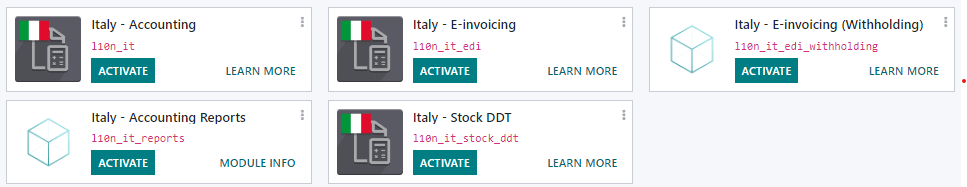
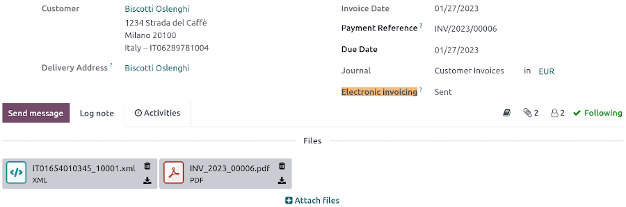
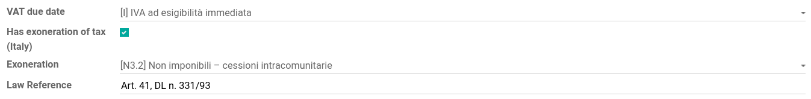

=====
Italy
=====

.. _italy/modules:

Configuration
=============

:ref:`Install <general/install>` the following modules to get all the features of the Italian
localization:

.. list-table::
   :header-rows: 1
   :stub-columns: 1

   * - Name
     - Technical name
     - Description
   * - Italy - Accounting
     - `l10n_it`
     - Default :ref:`fiscal localization package <fiscal_localizations/packages>`
   * - Italy - E-invoicing
     - `l10n_it_edi`
     - e-invoice implementation
   * - Italy - E-invoicing
     - `l10n_it_edi_withholding`
     - e-invoice withholding
   * - Italy - Accounting Reports
     - `l10n_it_reports`
     - Country-specific reports
   * - Italy - Stock DDT
     - `l10n_it_stock_ddt`
     - Transport documents - Documento di Trasporto (DDT)

Company information
-------------------

Configuring the company's information ensures your Accounting database is properly set up. To add
information, go to :menuselection:`Settings --> General Settings`, and in the :guilabel:`Companies`
section, click :guilabel:`Update info`. From here, fill out the fields:

- :guilabel:`Address`: the address of the company;
- :guilabel:`VAT`: VAT of the company;
- :guilabel:`Codice Fiscale`: the fiscal code of the company;
- :guilabel:`Tax System`: the tax system under which the company falls;

.. image:: italy/italy-company.png
   :align: center
   :alt: Company information to provide

E-invoicing
-----------

The :abbr:`SdI (Sistema di Interscambio)` is the electronic invoicing system used in Italy. It
enables to send and receive electronic invoices to and from customers. The documents must be in XML
format and formally validated by the system before being delivered.

To be able to receive invoices and notifications, the :abbr:`SdI (Sistema di Interscambio)` service
must be notified that the user's files are to be sent to **Odoo** and processed on their behalf. To
so, you must set up Odoo's :guilabel:`Codice Destinatario` on the **Agenzia Delle Entrate**
portal.

#. Go to https://ivaservizi.agenziaentrate.gov.it/portale/ and authenticate;
#. Go to section :menuselection:`Fatture e Corrispettivi`;
#. Set the user as Legal Party for the VAT number you wish to configure the electronic address;
#. In :menuselection:`Servizi Disponibili --> Fatturazione Elettronica --> Registrazione
   dell’indirizzo telematico dove ricevere tutte le fatture elettroniche`, insert Odoo's
   :guilabel:`Codice Destinatario` `K95IV18`, and confirm.

Electronic Data Interchange (EDI)
~~~~~~~~~~~~~~~~~~~~~~~~~~~~~~~~~

Odoo uses the **FatturaPA** :abbr:`EDI (Electronic Data Interchange)` format for the Italian
localization and is enabled on the default journals when installed. When the **file processing
authorization** has been set, all **invoices** and **bills** are automatically sent.

.. note::
   You can :ref:`enable electronic invoicing for other sales and purchase journals
   <e-invoicing/configuration>` than the default ones.

You can check the current status of an invoice by the :guilabel:`Electronic invoicing` field. The
XML file can be found in the **chatter** of the invoice.

.. seealso::
   :doc:`../accounting/customer_invoices/electronic_invoicing`

File processing authorization (Odoo)
------------------------------------

Since the files are transmitted through Odoo's server before being sent to the :abbr:`SdI (Sistema
di Interscambio)` or received by your database, you need to authorize Odoo to process your files
from your database. To do so, go to :menuselection:`Accounting --> Configuration --> Settings -->
Electronic Document Invoicing`.

There are **three** modes available:

:guilabel:`Demo`
  This mode simulates an environment in which invoices are sent to the government. In this mode,
  invoices need to be *manually* downloaded as XML files and uploaded to the **Agenzia delle
  Entrate**'s website.
:guilabel:`Test (experimental)`
  This mode sends invoices to a non-production (i.e., test) service made available by the **Agenzia
  delle Entrate**. Saving this change directs all companies on the database to use this
  configuration.
:guilabel:`Official`
  This is a production mode that sends your invoices directly to the **Agenzia delle Entrate**.

Once a mode is selected, you need to accept the **terms and conditions** by ticking :guilabel:`Allow
Odoo to process invoices`, and then :guilabel:`Save`. You can now record your transactions in Odoo
Accounting.

.. warning::
   Selecting either :guilabel:`Test (experimental)` or :guilabel:`Official` is **irreversible**.
   Once in :guilabel:`Official` mode, it is not possible to select :guilabel:`Test (experimental)`
   or :guilabel:`Demo`, and same for :guilabel:`Test (experimental)`. We recommend creating a
   separate database for testing purposes only.

.. note::
   When in :guilabel:`Test (Experimental)` mode, all invoices sent *must* have a partner using one
   of the following fake :guilabel:`Codice Destinatario` given by the **Agenzia Delle Entrate**:
   `0803HR0` - `N8MIMM9` - `X9XX79Z`. Any real production :guilabel:`Codice Destinario` of your
   customers will not be recognized as valid by the test service.

.. image:: italy/italy-edi.png
   :align: center
   :alt: Italy's electronic document invoicing options

Taxes configuration
===================

Many of the e-invoicing features are implemented using Odoo's tax system. As such, it is very
important that taxes are properly configured in order to generate invoices correctly and handle
other billing use cases. For example, specific configurations are required for the **reverse
charge** type of taxes. In case of a **reverse charge** tax, the seller does *not* charge the
customer for the VAT but, instead, the customer pays the VAT *themselves* to their government. There
are **two** main types:

- :ref:`external reverse charge <italy/external-reverse>`;
- :ref:`internal reverse charge  <italy/internal-reverse>`.

.. _italy/external-reverse:

External reverse charge
-----------------------

Invoices
~~~~~~~~

To make an export invoice, make sure that the invoice lines all use a tax configured for **reverse
charge**. The **Italian** localization contains an **example** of a reverse charge tax for export in
the EU to be used as reference (`0% EU`, invoice label `00eu`), which can be found under
:menuselection:`Accounting --> Configuration --> Taxes`. Exports are exempt from VAT, and therefore
**reverse charge** taxes require the :guilabel:`Has exoneration of tax (Italy)` option ticked, with
both the :guilabel:`Exoneration` kind and :guilabel:`Law Reference` filled in.

.. note::
   If you need to use a different kind of :guilabel:`Exoneration`, click :menuselection:`Action -->
   Duplicate` within the tax menu to create a copy of an existing similar tax. Then, select another
   :guilabel:`Exoneration`, and :guilabel:`Save`. Repeat this process as many times as you need
   different kind of :guilabel:`Exoneration` taxes.

.. tip::
   **Rename** your taxes in the :guilabel:`Name` field according to their :guilabel:`Exoneration` to
   differentiate them easily.

On your invoice, select the corresponding tax you need in the :guilabel:`Taxes` field. You can find
the following **additional info** by opening the **XML** file of the issued invoice:

- :guilabel:`SdI address (Codice Destinatario)`: must be filled for both **EU** or **non-EU**;
- :guilabel:`Country Id`: must contain the country of the foreign seller in the two-letter ISO
  (Alpha-2) code (ex., `IT` for 'Italy');
- :guilabel:`CAP`: must be filled with `00000`;
- :guilabel:`Partita Iva` (**VAT number**): must contain the **VAT** number for **EU businesses**
  and `OO99999999999` (double 'O' **letter**, not 'zero') for **non-EU businesses**. In case of
  private customers without **VAT** number, use `0000000`;
- :guilabel:`Fiscal Code`: for foreign entities without an actual **Codice Fiscale**, any
  recognizable identifier is valid.

.. note::
   Odoo does not support sending user-modified XML files.

For **invoices**, multiple configurations are technically identified by a :guilabel:`Tipo Documento`
code:

- `TD02` - Down payments;
- `TDO7` - Simplified invoice;
- `TD08` - Simplified credit note;
- `TD09` - Simplified debit note;
- `TD24` - Deferred invoice.

.. tabs::

   .. tab:: `TD02`

      Down payments.

      **Down payment** invoices are imported/exported with a different :guilabel:`Tipo Documento`
      code `TDO2` than regular invoices. Upon import of the invoice, it creates a regular vendor
      bill.

      Odoo exports moves as `TD02` if the following conditions are met:

     - Is an invoice;
     - All invoice lines are related to **sales order lines** that have the flag `is_downpayment`
       set as `True`.

   .. tab:: `TD07`, `TD08`, and `TD09`

      Simplified invoices, and credit/debit notes.

      Simplified invoices and credit notes can be used to certify **domestic transactions** under
      **400 EUR** (VAT included). Its status is the same as a regular invoice, but with fewer
      information requirements.

      For a **simplified** invoice to be established, it must include:

      - :guilabel:`Customer Invoice` reference: **unique** numbering sequence with **no gaps**;
      - :guilabel:`Invoice Date`: issue **date** of the invoice;
      - :guilabel:`Company Info`: the **seller**'s full credentials (VAT/TIN number, name, full
        address) under :menuselection:`General Settings --> Companies (section)`;
      - :guilabel:`VAT`: the **buyer**'s VAT/TIN number (on their profile card);
      - :guilabel:`Total`: the total **amount** (VAT included) of the invoice.

      In the :abbr:`EDI (Electronic Data Interchange)`, Odoo exports invoices as simplified if:

      - It is a **domestic** transaction (i.e., the partner is from Italy);
      - The buyer's data is **insufficient** for a regular invoice;
      - The **required fields** for a regular invoice (address, ZIP code, city, country) are
        provided;
      - The total amount VAT included is **less** than **400 EUR**.

      .. note::
         The 400 EUR threshold was defined in `the decree of the 10th of May 2019 in the Gazzetta
         Ufficiale <https://www.gazzettaufficiale.it/eli/id/2019/05/24/19A03271/sg>`_. We advise you
         to check the current official value.

   .. tab:: `TD24`

      Deferred invoices.

      The **deferred invoice** is an invoice that is **issued at a later time** than the sale of
      goods or the provision of services. A **deferred invoice** has to be issued at the latest
      within the **15th day** of the month following the delivery covered by the document.

      It usually is a **summary invoice** containing a list of multiple sales of goods or services,
      carried out in the month. The business is allowed to **group** the sales into **one invoice**,
      generally issued at the **end of the month** for accounting purposes. Deferred invoices are
      default for **wholesaler** having recurrent clients.

      If the goods are transported by a **carrier**, every delivery has an associated **Documento di
      Transporto (DDT)**, or **Transport Document**. The deferred invoice **must** indicate the
      details of all the **DDTs** information for better tracing.

      .. note::
         E-invoicing of deferred invoices requires the `l10n_it_stock_ddt`
         :ref:`module <italy/modules>`. In this case, a dedicated :guilabel:`Tipo Documento` `TD24`
         is used in the e-invoice.

      Odoo exports moves as `TD24` if the following conditions are met:

      - Is an invoice;
      - Is associated to deliveries whose **DDTs** have a **different** date than the issuance date
        of the invoice.

Vendor bills
~~~~~~~~~~~~

Italian companies buying goods or services from EU countries (or services from non-EU countries)
must send the information contained within the bill received to the **Agenzia delle Entrate**. This
allows you to complete tax-related information on your bill, and to send it. The seller must be set
as :guilabel:`Cedente/Prestatore`, and the buyer as :guilabel:`Cessionario/Committente`. Contained
within the **XML** document for the vendor bill, the vendor's credentials show as
:guilabel:`Cedente/Prestatore`, and your company's credentials as
:guilabel:`Cessionario/Committente`.

.. note::
   Self-billing invoices or VAT invoice integrations must be issued and sent to the tax agency.

When inputting taxes in a vendor bill, it is possible to select **reverse charge** taxes. These are
automatically activated in the Italian fiscal position. By going to :menuselection:`Accounting -->
Configuration --> Taxes`, the `10%` and `22%` :guilabel:`Goods` and :guilabel:`Services` tax scopes
are activated and preconfigured with the correct tax grids. These are set up automatically to ensure
the correct booking of accounting entries and display of the tax report.

For **vendor bills**, **three** types of configurations are technically identified by a code called
:guilabel:`Tipo Documento`:

- `TD17` - Buying services from **EU** and **non-EU** countries;
- `TD18` - Buying **goods** from **EU**;
- `TD19` - Buying **goods** from a **foreign** vendor, but the **goods** are already in **Italy**
  in a **VAT deposit**.

.. tabs::

   .. tab:: `TD17`

      Buying **services** from **EU** and **non-EU** countries:

      The foreign *seller* invoices a service with a **VAT-excluded** price, as it is not
      taxable in Italy. The VAT is paid by the *buyer* in Italy;

      - Within EU: the *buyer* integrates the invoice received with the **VAT information**
        due in Italy (i.e., **vendor bill tax integration**);
      - Non-EU: the *buyer* sends themselves an invoice (i.e., **self-billing**).

      Odoo exports a transaction as `TD17` if the following conditions are met:

      - Is a vendor bill;
      - At least one tax on the invoice lines targets the tax grids :ref:`VJ <italy/grids>`;
      - All invoice lines either have :guilabel:`Services` as **products**, or a tax with the
        :guilabel:`Services` as **tax scope**.

  .. tab:: `TD18`

     Buying **goods** from **EU**:

     Invoices issued within the EU follow a **standard format**, therefore only an integration of
     the existing invoice is required.

     Odoo exports a transaction as `TD18` if the following conditions are met:

     - Is a vendor bill;
     - At least one tax on the invoice lines targets the tax grids :ref:`VJ <italy/grids>`;
     - All invoice lines either have :guilabel:`Consumable` as **products**, or a tax with the
       :guilabel:`Goods` as **tax scope**.

  .. tab:: `TD19`

     Buying **goods** from a **foreign** vendor, but the **goods** are already in **Italy** in a
     **VAT deposit**:

     - From EU: the *buyer* integrates the invoice received with the **VAT information** due in
       Italy (i.e., **vendor bill tax integration**);
     - Non-EU: the *buyer* sends an invoice to *themselves* (i.e., **self-billing**).

     Odoo exports a move as a `TD19` if the following conditions are met:

     - Is a vendor bill;
     - At least one tax on the invoice lines targets the tax grid :ref:`VJ3 <italy/grids>`;
     - All invoice lines either have :guilabel:`Consumable` products, or a tax with
       :guilabel:`Goods` as tax scope.

.. warning::
   Odoo does not offer the
   `Conservazione Sostitutiva <https://www.agid.gov.it/index.php/it/piattaforme/conservazione>`_
   requirements. Other providers and **Agenzia delle Entrate** supply free and certified storage to
   meet the requested conditions.

.. _italy/internal-reverse:

Internal reverse charge
-----------------------

.. warning::
   Odoo currently does not support domestic **internal reverse charge** processes.

.. _italy/grids:

'Reverse Charge' tax grids
--------------------------

The Italian localization has a specific **tax grid** section for **reverse charge** taxes. These
tax grids are identifiable by the :ref:`VJ <italy/grids>` tag, and can be found under
:menuselection:`Accounting --> Reporting --> Audit Reports: Tax Report`.

.. image:: italy/italy-grids.png
   :align: center
   :alt: Italian reverse charge tax grids

San Marino
==========

Invoices
--------

San Marino and Italy have special agreements on e-invoicing operations. As such, **invoices** follow
the regular **reverse charge** rules. Additional requirements are not enforced by Odoo, however, the
user is requested by the **State** to:

- Select a tax with the option :guilabel:`Has exoneration of tax (Italy)` ticked, and the
  :guilabel:`Exoneration` set to `N3.3`;
- Use the generic :abbr:`SdI (Sistema di Interscambio)` :guilabel:`Codice Destinatario` `2R4GT08`.
  The invoice is then routed by a dedicated office in San Marino to the correct business.

Bills
-----

When a **paper bill** is received from San Marino, any Italian company **must** submit that invoice
to the **Agenzia delle Entrate** by indicating the e-invoice's :guilabel:`Tipo Documento` field with
the special value `TD28`.

.. tabs::

   .. tab:: `TD28`

      Odoo exports a move as `TD28` if the following conditions are met:

      - Is a vendor bill;
      - At least one tax on the invoice lines targets the tax grids :ref:`VJ <italy/grids>`;
      - The **country** of the partner is **San Marino**.

Pubblica amministrazione (B2G)
==============================

.. warning::
   Odoo does **not** send invoices directly to the government as they need to be signed. If we see
   that the codice destinatario is 6 digits, then it is not sent to the PA automatically, but you
   can download the XML, sign it with an external program and send it through the portal.

Digital qualified signature
---------------------------

For invoices and bills intended to the **Pubblica Amministrazione (B2G)**, a **Digital Qualified
Signature** is required for all files sent through the :abbr:`SdI (Sistema di Interscambio)`. The
**XML** file must be certified using a certificate that is either:

- a **smart card**;
- a **USB token**;
- a **Hardware Security Module (HSM)**.

CIG, CUP, DatiOrdineAcquisto
----------------------------

To ensure the effective traceability of payments by public administrations, electronic invoices
issued to the public administrations must contain:

- The :abbr:`CIG (Codice Identificativo Gara)`, except in cases of exclusion from traceability
  obligations provided by law n. 136 of August 13, 2010;
- The :abbr:`CUP (Codice Unico di Progetto)`, in case of invoices related to public works.

If the **XML** file requires it, the **Agenzia Delle Entrate** can *only* proceed payments of
electronic invoices when the **XML** file contains a :abbr:`CIG (Codice Identificativo Gara)` and
:abbr:`CUP (Codice Unico di Progetto)`. For each electronic invoice, it is **necessary** to indicate
the :abbr:`CUU (Codice Univoco Ufficio)`, which represents the unique identifier code that allows
the :abbr:`SdI (Sistema di Interscambio)` to correctly deliver the electronic invoice to the
recipient office.

.. note::
   - The :abbr:`Codice Unico di Progetto)` and the :abbr:`CIG (Codice Identificativo Gara)` must be
     included in one of the **2.1.2** (DatiOrdineAcquisto), **2.1.3** (Dati Contratto), **2.1.4**
     (DatiConvenzione), **2.1.5** (Date Ricezione), or **2.1.6** (Dati Fatture Collegate)
     information blocks. These correspond to the elements named :guilabel:`CodiceCUP` and
     :guilabel:`CodiceCIG` of the electronic invoice **XML** file, whose table can be found on the
     government `website <http://www.fatturapa.gov.it/>`_.
   - The :abbr:`CUU (Codice Univoco Ufficio)` must be included in the electronic invoice
     corresponding to the element **1.1.4** (:guilabel:`CodiceDestinario`).
